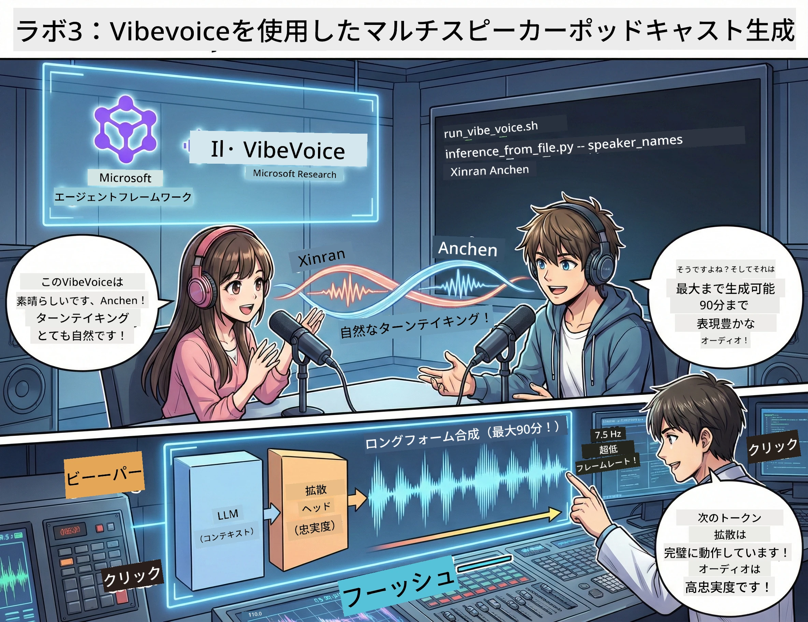

<!--
CO_OP_TRANSLATOR_METADATA:
{
  "original_hash": "bb2a3cf5ebd0ec8211af960a004fc23d",
  "translation_date": "2026-01-05T12:07:01+00:00",
  "source_file": "WorkshopForAgentic/md/03.Multi-SpeakerPodcastGenerationWithVibeVoice.md",
  "language_code": "ja"
}
-->
# 第3幕：ポッドキャストに命を吹き込もう 🎤



## グランドフィナーレ

トピックをリサーチし、スクリプトを書きました。さあ、「それを実際のポッドキャスト音声に変える」という最後の仕上げです！リアルな声で！

登場するのは **VibeVoice** — Microsoft ResearchのオープンソースTTS（テキスト読み上げ）技術で、以下を作り出します：
- 🎭 自然な会話音声
- 👥 複数の話者（最大4人！）
- ⏱️ 長尺音声（最大90分！）
- 🎵 表現力豊かな話し方（ロボット声じゃない！）

これが合成ポッドキャストの裏側技術です。さあ、あなたのポッドキャストを作りましょう！

## VibeVoiceとは？（カッコいいポイント）

VibeVoiceはMicrosoft Researchから世界への贈り物です。特にポッドキャストスタイルの会話音声用に設計されています。

### なぜすごいのか🔥

* **⏱️ マラソンセッション**：最大90分の連続音声を生成（つまりフルエピソード！）
* **👥 複数話者マジック**：最大4つの異なる声で一貫した人格表現
* **⚡ 驚異の効率**：超低7.5Hzフレームレートで計算コストを節約
* **🧠 スマートな音声生成**：LLM（文脈理解）と拡散モデル（リアルな音声生成）を組み合わせ
* **🎭 自然な流れ**：話の順番、間、会話のリズムを自動処理

**要は**：VibeVoiceはスクリプトを「読む」だけでなく、本物の人が話しているように「演じます」。

---

## 始める前に🚀

**必要なもの**：

* 🐍 **Python 3.10以上**（第1幕・第2幕で用意済み）
* 🚀 **uv**（高速Pythonパッケージマネージャー — 後でインストールします）
* 📝 **スクリプト**：第2幕で作成した `podcast.txt` ファイル（`../03.Application/`内）

**プロのヒント**：このステップでは事前学習モデルのダウンロードに良いインターネット環境が必要です。コーヒーでもどうぞ！☕

---

## さあ行こう！簡単な方法🎬

超簡単です。1つのシェルスクリプトで全て完了。

### 手順

1. **実行可能にする**：
```bash
chmod +x run_vibe_voice.sh
```

2. **実行する**：
```bash
./run_vibe_voice.sh
```

3. **魔法の待ち時間**（初回は数分かかる場合あり）

### 裏側で何が起こっている？🎭

このスクリプトは自動音響エンジニアです：

1. **📥 VibeVoiceをダウンロード**：公式GitHubリポジトリをクローン
2. **📦 依存関係のインストール**：`uv pip`で高速にパッケージをインストール
3. **🎬 音声生成**：推論スクリプトを以下の引数で実行
   * `--model_path`：事前学習済みVibeVoice-7Bモデル
   * `--txt_path`：あなたの`podcast.txt`スクリプト
   * `--speaker_names`：声の割り当て（デフォルトはXinran & Anchen）

**結果**：スクリプトが本物のポッドキャストエピソードになります！🎉

---

## あなたへのミッション🎯

面白くしましょう：

### タスク1: コンテンツ作成
`../03.Application/podcast.txt`を編集して2人の会話を書きます。テーマはテクノロジーでも趣味でも何でもOK！会話調にしてください。

**フォーマット例**：
```
Speaker 1: Hey! Did you hear about the new AI model?
Speaker 2: No way! Tell me more!
Speaker 1: It's called...
```

### タスク2: 音声生成
スクリプトを実行して魔法を体験。初回はモデルダウンロードで時間がかかります。

### タスク3: 聞いて分析
- 自然に聞こえますか？
- 話者の声は区別できますか？
- 話の順番はスムーズですか？
- ロボットっぽい部分はありますか？

### タスク4: 実験（勇者向け）
`run_vibe_voice.sh`を編集して`--speaker_names`を変え、別の声の組み合わせに挑戦。VibeVoiceには複数の事前学習声があります！

**ボーナスチャレンジ**：3人の会話に挑戦！🎆

---

## 詳しく知りたい📚

* **🏠 プロジェクトホームページ**：[VibeVoice公式サイト](https://microsoft.github.io/VibeVoice/)
* **🤗 事前学習モデル**：[Hugging Face - VibeVoice-7B](https://huggingface.co/vibevoice/VibeVoice-7B)
* **📖 研究論文**：技術の深掘りにどうぞ（興味があれば）

> **⚠️ 責任あるAI利用のお願い**：VibeVoiceは強力です。倫理的に使いましょう！深層偽造や誤解を招くコンテンツの作成は禁止。人々の役に立つ素敵な作品を作ってください。🙏

---

## 🏆 おめでとうございます！達成です！

あなたは一連の流れを完遂しました：
1. ✅ **第1幕**：カスタムツールでAIエージェントを構築
2. ✅ **第2幕**：マルチエージェントワークフローを調整
3. ✅ **第3幕**：本物のポッドキャスト音声を生成

**手に入れたもの**：
- 動くAIリサーチアシスタント
- 完全なポッドキャスト制作ワークフロー
- 実際の共有可能な音声ファイル

### 次は？🚀

**ポッドキャストを公開しよう！**
- プラットフォームにアップロード
- SNSでシェア
- 改善サイクルを回す

**開発を続けよう！**
- いろんなテーマに挑戦
- 話者を増やす実験
- バックグラウンドミュージック追加
- ウェブインターフェースを構築
- 全自動化にチャレンジ

**作品をシェアしよう！**
タグ付けしてください！世界にあなたの成果を見せましょう。AIポッドキャスト革命はあなたから始まります。🎙️

---

**質問？アイデア？成功体験？** ワークショップチャットで教えてください！

**コンテンツ制作の未来へようこそ。** 🌟

---

<!-- CO-OP TRANSLATOR DISCLAIMER START -->
**免責事項**：
本書類はAI翻訳サービス「Co-op Translator」（https://github.com/Azure/co-op-translator）を使用して翻訳されました。正確性を期しておりますが、自動翻訳には誤りや不正確な表現が含まれる可能性があることをご了承ください。原文の言語による文書が正式な情報源とみなされます。重要な情報については、専門の人間による翻訳を推奨いたします。本翻訳の利用による誤解や解釈違いについて、一切の責任を負いかねます。
<!-- CO-OP TRANSLATOR DISCLAIMER END -->