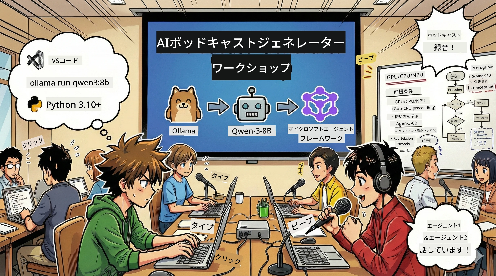

<!--
CO_OP_TRANSLATOR_METADATA:
{
  "original_hash": "aa775a734bda4590ecbe3a94a3b62197",
  "translation_date": "2026-01-05T17:30:10+00:00",
  "source_file": "WorkshopForAgentic/translation/zh-cn/README.md",
  "language_code": "ja"
}
-->
# 🎙️ AI ポッドキャストスタジオ ワークショップ



## あなたのタスク

ようこそ **AI ポッドキャストスタジオ** へ！あなたは自分のテクノロジーポッドキャスト「未来バイト」を立ち上げるところですが、ここにひとつひねりがあります：AI駆動の制作チームを構築してそれを助けてもらいます。もう終わりのないリサーチ、スクリプト作成、オーディオ編集は必要ありません。代わりに、プログラミングを通じてAIの超能力を持つポッドキャストプロデューサーになりましょう。

## ストーリー背景

想像してみてください：あなたと友人は最もクールなテクノロジートレンドについてのポッドキャストを始めたいが、みんな勉強や仕事、生活で忙しい。もしAIエージェントのチームに重い作業を任せられたらどうでしょう？1人はテーマのリサーチ、もう1人は魅力的なスクリプトの執筆、3人目はテキストを自然で流暢な会話に変換。SFみたいですか？それを現実にしましょう。

## あなたが学ぶこと

このワークショップの終わりには、以下ができるようになります：
- 🤖 自分のローカルAIモデルをデプロイ（APIコストなし、クラウド依存なし！）
- 🔧 実際に連携するプロのAIエージェントを構築
- 🎬 アイデアからオーディオまでのフルポッドキャスト制作プロセスを作成

## あなたの旅路：三幕劇

良いストーリーのように、私たちには三幕があります。幕ごとにあなたのAIポッドキャストスタジオを段階的に構築します：

| 章 | あなたのタスク | 起こること | 習得スキル |
|---------|-----------|--------------|----------------|
| **第一幕** | [あなたの AI アシスタントと出会う](01.BuildAIAgentWithSLM.md) | 会話し、ウェブ検索し、問題を解決できるAIエージェントを作る方法を学びます。寝ないリサーチインターンのように考えてください。 | 🎯 最初のエージェントを構築<br>🛠️ 超能力（ツール！）を与える<br>🧠 思考を教える<br>🌐 インターネットへ接続 |
| **第二幕** | [制作チームを組織する](02.AIAgentOrchestrationAndWorkflows.md) | いよいよ面白くなります！複数のAIエージェントを本物のポッドキャストチームのように調整します。ひとりはリサーチ、ひとりは執筆、あなたは承認 — チームワークで夢を実現。 | 🎭 複数エージェントの調整<br>🔄 承認ワークフローの構築<br>🖥️ DevUIでテスト<br>✋ 人間の管理を維持 |
| **第三幕** | [ポッドキャストを生き生きとさせる](03.Multi-SpeakerPodcastGenerationWithVibeVoice.md) | クライマックス！テキストスクリプトをリアルな声と自然な会話を持つ本物のポッドキャストオーディオに変換。あなたの「未来バイト」ポッドキャストが公開準備完了！ | 🎤 テキスト読み上げの魔法<br>👥 複数話者の声<br>⏱️ 長尺オーディオ<br>🚀 完全自動化 |

各幕は新たな能力のアンロックです。勇気があれば飛ばしてもOKですが、順番に学ぶことをお勧めします！

## 環境要件

本ワークショップは多様なハードウェア環境をサポートします：
- **CPU**：テストや小規模用途に適合
- **GPU**：本番環境に推奨、推論速度が大幅向上
- **NPU**：次世代ニューラルプロセッサユニットによる高速化をサポート

## 必要なもの

### ソフト一覧 ✅
- **Python 3.10+**（プログラミング言語）
- **Ollama**（ローカルでAIモデルを実行）
- **VS Code**（コードエディター）
- **Python拡張機能**（VS Codeをより賢く）
- **Git**（コード取得用）

### ハードウェアチェック 💻
- **動く？**：メモリ8GB、空き容量10GB（動くが少し遅い可能性あり）
- **理想構成**：メモリ16GB以上、適度なGPU（快適に動作！）
- **NPUある？**：あれば最高！次世代パフォーマンスを解放 🚀

## スタジオ構築 🎬

### ステップ 1：Python バージョンアップ

Python 3.10 以上があることを確認してください：

```bash
python --version
# Python 3.10.x 以上のバージョンを表示する必要があります
```

Pythonがない？[python.org](https://python.org)から入手しましょう——無料です！

### ステップ 2：Ollama（AIモデルの実行エンジン）入手

[ollama.ai](https://ollama.ai) に行き、OSに合ったOllamaをダウンロード。ローカルでAIモデルを動かすエンジンと考えてください。

準備ができているか確認：

```bash
ollama --version
```

### ステップ 3：AIの頭脳をダウンロード 🧠

Qwen-3-8Bモデルを入手する時です（初めてのAIアシスタントを雇うイメージ）：

```bash
ollama pull qwen3:8b
```

*数分かかるかもしれません。完璧なコーヒータイム！☕*

### ステップ 4：VS Codeセットアップ

未導入なら [Visual Studio Code](https://code.visualstudio.com/) を入手。最高のコードエディターです（反論不可 😄）。

### ステップ 5：Python拡張機能

VS Codeで：
1. `Ctrl+Shift+X` （Macは `Cmd+Shift+X`）を押す
2. 「Python」を検索
3. Microsoft公式のPython拡張機能をインストール

### ステップ 6：よし、準備完了！🎉

本気で、準備できました。さあ、AIマジックを作りましょう！

### ステップ 7：Microsoft Agent Framework と関連パッケージのインストール 📦

ワークショップに必要な全依存関係をインストール：

```bash
pip install -r ./Installations/requirements.txt -U
```

*Microsoft Agent Frameworkと必要なパッケージがインストールされます。初回は数分かかるかも？コーヒーを飲みながらお待ちを ☕*

## ワークショップ案内

詳細なプロジェクト構造、設定手順と実行方法はワークショップ中に順次解説します。

## トラブルシューティング（問題が起きたら）🔧

### 「モデルのダウンロードが遅すぎる！」
**解決策**：VPNを使うか、Ollamaのミラーを設定してください。時にはネットが遅いこともあります。

### 「パソコンが危ない！メモリ不足！」
**解決策**：小さいモデルに変更するか、`num_ctx`設定を調整してメモリ使用量を減らしましょう。AIのダイエットのようなものです。

### 「GPUで速くできる？」
**解決策**：Ollamaは自動的にGPUを検出します！GPUドライバが最新であることを確認しましょう。無料の速度アップ！🏎️

## 追加リソース（好奇心旺盛なあなたへ）📚

- [Ollama ドキュメント](https://github.com/ollama/ollama) — ローカルAIモデルについてもっと知る
- [Microsoft Agent Framework](https://microsoft.github.io/autogen/) — エージェントチーム構築に関する詳細
- [Qwen モデル情報](https://qwenlm.github.io/) — あなたのAIアシスタントの頭脳を理解する

## ライセンス

MITライセンス — かっこいいものを作って、共有して、世界をより良く！🌍

## 貢献したい？

バグを見つけた？アイデアがある？IssueやPRを送ってください！コミュニティを楽しみにしています。✨

---

<!-- CO-OP TRANSLATOR DISCLAIMER START -->
**免責事項**：  
本書類は、AI翻訳サービス「Co-op Translator」（https://github.com/Azure/co-op-translator）を使用して翻訳されました。正確性の確保に努めておりますが、自動翻訳には誤りや不正確な部分が含まれる可能性があります。原文の言語による文書が正式な情報源とみなされるべきです。重要な情報については、専門の翻訳者による翻訳を推奨します。本翻訳の利用により生じた誤解や誤訳について、当方は一切責任を負いかねます。
<!-- CO-OP TRANSLATOR DISCLAIMER END -->