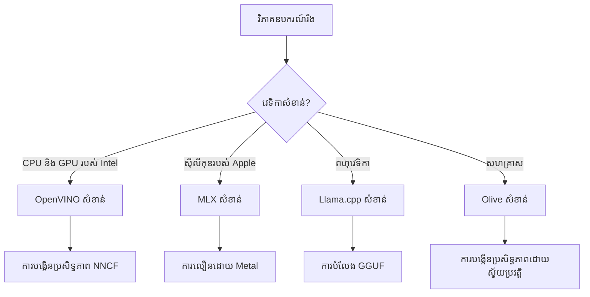
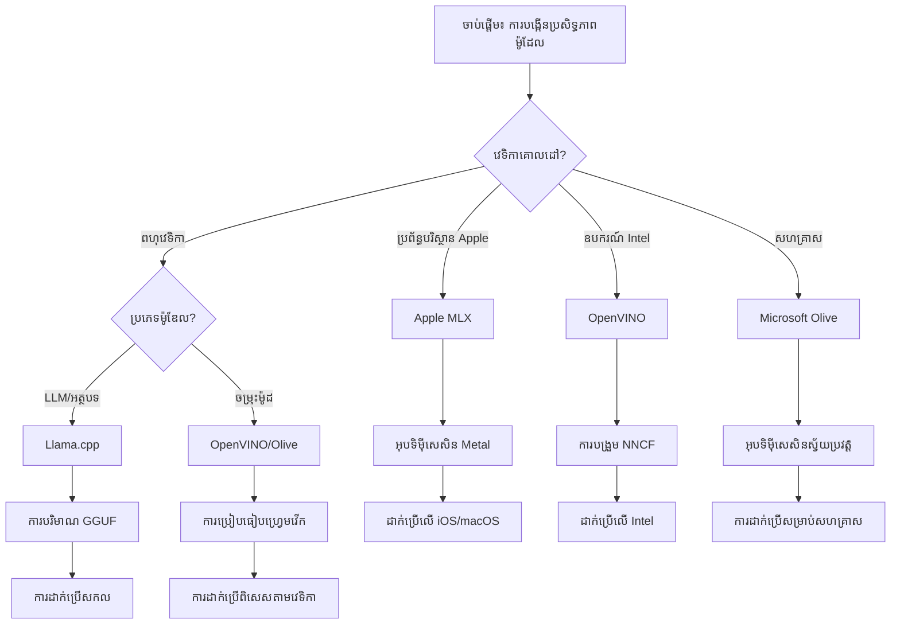
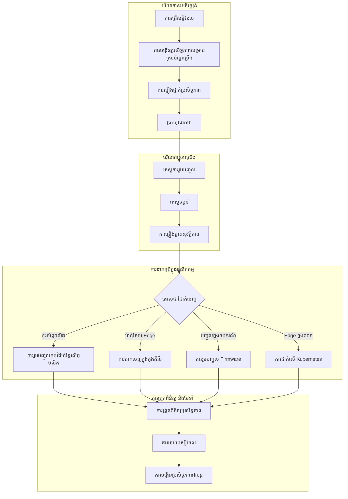

# ផ្នែក 6: សេចក្តីសេចក្តីសន្និដ្ឋានលំហាត់ការអភិវឌ្ឍ Edge AI

## តារាងមាតិកា
1. [ការណែនាំ](#ការណែនាំ)
2. [គោលបំណងការសិក្សា](#គោលបំណងការសិក្សា)
3. [ទិដ្ឋភាពធ្វើការផ្នែកសមាសភាពផ្ដុំ](#ទិដ្ឋភាពធ្វើការផ្នែកសមាសភាពផ្ដុំ)
4. [ម៉ាទ្រីសការជ្រើសរើសវេទិកា](#ម៉ាទ្រីសជ្រើសរើសវេទិកា)
5. [សេចក្តីល្អបំផុតសង្ខេប](#សេចក្តីល្អបំផុតសង្ខេប)
6. [មគ្គុទេសក៍យុទ្ធសាស្ត្រDeployment](#មគ្គុទេសក៍យុទ្ធសាស្ត្រ-deployment)
7. [លំហាត់ប្រសិទ្ធភាពកែសម្រួល](#លំហាត់ប្រសិទ្ធភាពកែសម្រួល)
8. [ច្បាប់ត្រៀមខ្លួនសម្រាប់ផលិតកម្ម](#ច្បាប់ត្រៀមខ្លួនសម្រាប់ផលិតកម្ម)
9. [ការដោះស្រាយបញ្ហា និងការតាមដាន](#ការដោះស្រាយបញ្ហា-និងការតាមដាន)
10. [ការធានាអនាគតសម្រាប់ប៉ាយប៊ែល Edge AI របស់អ្នក](#ការធានាអនាគតសម្រាប់ប៉ាយប៊ែល-edge-ai-របស់អ្នក)

## ការណែនាំ

ការអភិវឌ្ឍ Edge AI តម្រូវឲ្យមានការយល់ដឹងជ្រាលជ្រៅអំពីសំណុំស្រទាប់អុបទីម៉ៃសេក្សិនជាច្រើន យុទ្ធសាស្ត្រការដាក់ចេញ និងការពិចារណាផលិតផលរឹងមាំ។ សេចក្តីសង្ខេបនេះបញ្ចូលចំណេះដឹងពី Llama.cpp, Microsoft Olive, OpenVINO, និង Apple MLX ទៅក្នុងលំហាត់ការចម្រាញ់មួយដែលបង្កើនប្រសិទ្ធភាព រក្សាគុណភាព និងធានាការដាក់ចេញក្នុងផលិតកម្មដោយជោគជ័យ។

ពេលយើងរៀននៅក្នុងវគ្គនេះ យើងបានសង្កេតមើលស្រទាប់អុបទីម៉ៃសេក្សិននីមួយៗ ដែលមានភាពខ្លួនខុសគ្នានិងប្រើប្រាស់ពិសេសខ្លះៗ។ ទោះយ៉ាងណា គម្រោង Edge AI ក្នុងពិភពពិតជាញឹកញាប់ត្រូវការលាយបច្ចេកទេសពីស្រទាប់ជាច្រើន ឬធ្វើការសម្រេចចិត្តយុទ្ធសាស្ត្រអំពីវិធីសាស្ត្រណាមួយដែលនឹងផ្តល់លទ្ធផលល្អបំផុតសម្រាប់កំណត់ដែន និងតម្រូវការ។

ផ្នែកនេះសម្រង់មនោសញ្ញាផ្តល់ច្រកចេញពីស្រទាប់ទាំងអស់ទៅក្នុងលំហាត់ការអាចអនុវត្តបាន ទ្រង់ទ្រាយសម្រេចចិត្ត និងអនុវត្តខ្លះៗ ដែលជួយឲ្យអ្នកអាចបង្កើតដំណោះស្រាយ Edge AI សម្រាប់ផលិតកម្មបានយ៉ាងមានប្រសិទ្ធភាព និងមានប្រសិទ្ធភាព។ មិនថាអ្នកកំពុងអុបទីម៉ៃសម្រាប់ឧបករណ៍ចល័ត ប្រព័ន្ធភ្ជាប់ ឬម៉ាស៊ីនបម្រើ Edge, មគ្គុទេសក៍នេះផ្តល់ស្នាដៃយុទ្ធសាស្ត្រសម្រាប់ធ្វើសេចក្តីសម្រេចចិត្តនៅ sepanjang វដ្តជីវិតអភិវឌ្ឍរបស់អ្នក។

## គោលបំណងការសិក្សា

នៅចុងវគ្គនេះ អ្នកនឹងអាច៖

### ការសម្រេចចិត្តយុទ្ធសាស្ត្រ
- **វាយតម្លៃ និង ជ្រើសរើស** ស្រទាប់អុបទីម៉ៃសេក្សិនឱកាសល្អបំផុត dựa លើតម្រូវការ គម្រប់ធាតុរឹង ហើយស្ថានភាពដាក់ចេញ
- **រចនាលំហាត់ការរួមបញ្ចូល** ដែលបញ្ចូលបច្ចេកទេសអុបទីម៉ៃនានា សម្រាប់ប្រសិទ្ធភាពអតិបរមា
- **វាស់វែងចំនល់** រវាងភាពច្បាស់នៃម៉ូដែល ល្បឿនប៉ាន់ប្រមាណ ការប្រើប្រាស់អ្នកចងចាំ និងភាពស្មុគស្មាញក្នុងការដាក់ចេញនៅគ្នាស្រទាប់នានា

### ការរួមបញ្ចូលលំហាត់ការ
- **អនុវត្តបណ្ដាញការអភិវឌ្ឍរួមគ្នា** ដែលប្រើប្រាស់កម្លាំងពីស្រទាប់អុបទីម៉ៃសេក្សិនច្រើន
- **បង្កើតលំហាត់ការដែលអាចធ្វើឡើងឡើងវិញ** សម្រាប់ការអុបទីម៉ៃនិងដាក់ចេញម៉ូដែលយ៉ាងស្ថេរភាពក្នុងបរិយាកាសផ្សេងៗ
- **បង្កើតដងគុណភាព** និងដំណើរការត្រួតពិនិត្យ ដើម្បីធានាថាម៉ូដែលដែលបានអុបទីម៉ៃបានបំពេញតម្រូវការផលិតកម្ម

### ការបង្កើនប្រសិទ្ធភាព
- **អនុវត្តយុទ្ធសាស្ត្រអុបទីម៉ៃដោយប្រព័ន្ធ** ដោយប្រើ quantization, pruning, និងបច្ចេកទេសបង្កើនល្បឿនជាក់លាក់សម្រាប់រឹងមាំ
- **តាមដាន និងធ្វើឧបមាណវិភាគ** ប្រសិទ្ធភាពម៉ូដែលនៅលើកម្រិតអុបទីម៉ៃផ្សេងៗ និងគោលដៅដាក់ចេញ
- **អុបទីម៉ៃសម្រាប់វេទិកាផ្ទាល់** រួមទាំង CPU, GPU, NPU, និងឧបករណ៍បង្កើនល្បឿនសម្រាប់ Edge

### ការដាក់ចេញក្នុងផលិតកម្ម
- **រចនាស្ថាបត្យកម្មដាក់ចេញដែលអាចវាស់បាន** ដែលទទួលយកទម្រង់ម៉ូដែល និងម៉ាស៊ីនប៉ាន់ប្រមាណច្រើន
- **អនុវត្តការតាមដាន និងការមើលឃើញ** សម្រាប់កម្មវិធី Edge AI ក្នុងបរិយាកាសផលិតកម្ម
- **កំណត់ដំណើរការថែទាំ** សម្រាប់អាប់ដេតម៉ូដែល តាមដានប្រសិទ្ធភាព និងអុបទីម៉ៃប្រព័ន្ធ

### ល្អឥតខ្ចោះឆ្លងវេទិកា
- **ដាក់ចេញម៉ូដែលដែលបានអុបទីម៉ៃ** លើវេទិកាផ្សេងៗទាំងអស់ ខណៈរក្សាប្រសិទ្ធភាពជាប់ស្រួល
- **ដោះស្រាយអុបទីម៉ៃដែលជាច្រើនស្តុក** សម្រាប់ Windows, macOS, Linux, មობილហ្វូន និងប្រព័ន្ធបញ្ចូល
- **បង្កើតស្រទាប់អចិន្រ្តៃយ៍** ដែលអនុញ្ញាតឲ្យដាក់ចេញស្រួលជាមួយសម្រាប់បរិយាកាស Edge ផ្សេងៗ

## ទិដ្ឋភាពធ្វើការផ្នែកសមាសភាពផ្ដុំ

### ដំណាក់កាល 1៖ ការវិភាគតម្រូវការ និងជ្រើសរើសវេទិកា

មូលដ្ឋាននៃការដាក់ចេញ Edge AI ដោយជោគជ័យចាប់ផ្ដើមពីការវិភាគតម្រូវការយ៉ាងជ្រាលជ្រៅ ដែលណែនាំការជ្រើសរើសវេទិកានិងយុទ្ធសាស្ត្រអុបទីម៉ៃ។

#### 1.1 ការប៉ាន់ប្រមាណឧបករណ៍រឹងមាំ

**ចំណុចសំរាប់ពិចារណា:**
- **សំណាញ់ស្ថិតិ CPU**: x86, ARM, Apple Silicon capabilities
- **ភាពមានសមត្ថភាពអេក្សេលេរេរាត័រ**: GPU, NPU, VPU, specialized AI chips
- **កំណត់ចរាចរណ៍អ្នកចងចាំ**: កំណត់ RAM, សមត្ថភាពផ្ទុក
- **ថវិកាថាមពល**: រយៈពេលថ្ម, កំណត់សីតុណ្ហភាព
- **ការតភ្ជាប់**: តម្រូវការ Offline, កំណត់កម្រិតបណ្ដាញ

#### 1.2 ពិគ្រោះការតម្រូវការអនុវត្តកម្ម

| តម្រូវការ | Llama.cpp | Microsoft Olive | OpenVINO | Apple MLX |
|-------------|-----------|-----------------|----------|-----------|
| ពហុវេទិកា | ✅ Excellent | ⚡ Good | ⚡ Good | ❌ Apple Only |
| ការរួមបញ្ចូលសហគ្រាស | ⚡ Basic | ✅ Excellent | ✅ Excellent | ⚡ Limited |
| ការដាក់លើទូរស័ព្ទចល័ត | ✅ Excellent | ⚡ Good | ⚡ Good | ✅ iOS Excellent |
| ការវាយប្រហារអោយបានពេលពិត | ✅ Excellent | ✅ Excellent | ✅ Excellent | ✅ Excellent |
| ភាពចម្រុះនៃម៉ូដែល | ✅ LLM Focus | ✅ All Models | ✅ All Models | ✅ LLM Focus |
| ភាពងាយស្រួលក្នុងការប្រើ | ✅ Simple | ✅ Automated | ⚡ Moderate | ✅ Simple |

### ដំណាក់កាល 2៖ ការរៀបចំម៉ូដែល និងអុបទីម៉ៃ

#### 2.1 លំហាត់ប៉ាន់ប្រមាណម៉ូដែលសកល

```python
# សំណុំគ្រឹះសកលសម្រាប់ការវាយតម្លៃម៉ូឌែល
class EdgeAIModelAssessment:
    def __init__(self, model_path, target_hardware):
        self.model_path = model_path
        self.target_hardware = target_hardware
        self.optimization_frameworks = []
        
    def assess_model_characteristics(self):
        """Analyze model size, architecture, and complexity"""
        return {
            'model_size': self.get_model_size(),
            'parameter_count': self.get_parameter_count(),
            'architecture_type': self.detect_architecture(),
            'quantization_compatibility': self.check_quantization_support()
        }
    
    def recommend_optimization_strategy(self):
        """Recommend optimal frameworks and techniques"""
        characteristics = self.assess_model_characteristics()
        
        if self.target_hardware.startswith('apple'):
            return self.mlx_optimization_strategy(characteristics)
        elif self.target_hardware.startswith('intel'):
            return self.openvino_optimization_strategy(characteristics)
        elif characteristics['model_size'] > 7_000_000_000:  # 7B+ ប៉ារ៉ាម៉ែត្រ
            return self.enterprise_optimization_strategy(characteristics)
        else:
            return self.lightweight_optimization_strategy(characteristics)
```

#### 2.2 លំហាត់អុបទីម៉ៃច្រើនវេទិកា

**វិធីអុបទីម៉ៃជាដំណាក់កាលស៊េរី:**
1. **ការបម្លែងដំបូង**: បម្លែងទៅទ្រង់ទ្រង់រវាងម៉ូដែល (ONNX when possible)
2. **អុបទីម៉ៃជាវេទិកាពិសេស**: អនុវត្តបច្ចេកទេសពិសេស
3. **ការត្រួតពិនិត្យឆ្លងកាត់**: ធានាប្រសិទ្ធភាពលើវេទិកាដែលមានគោលដៅ
4. **ការវេចខ្ចប់ចុងក្រោយ**: រៀបចំសម្រាប់ការដាក់ចេញ

```bash
# ស្គ្រីបសម្រាប់ធ្វើឱ្យប្រសើរឡើងនៅលើមូលដ្ឋានការងារ ច្រើន
#!/bin/bash

MODEL_NAME="phi-3-mini"
BASE_MODEL="microsoft/Phi-3-mini-4k-instruct"

# ជំហានទី 1: ការបម្លែង ONNX (សកល)
python convert_to_onnx.py --model $BASE_MODEL --output models/onnx/

# ជំហានទី 2: ការធ្វើឱ្យប្រសើរឡើងជាក់លាក់សម្រាប់វេទិកា
if [[ "$TARGET_PLATFORM" == "intel" ]]; then
    # ការធ្វើឱ្យប្រសើរឡើង OpenVINO
    python optimize_openvino.py --input models/onnx/ --output models/openvino/
elif [[ "$TARGET_PLATFORM" == "apple" ]]; then
    # ការធ្វើឱ្យប្រសើរឡើង MLX
    python optimize_mlx.py --input $BASE_MODEL --output models/mlx/
elif [[ "$TARGET_PLATFORM" == "cross" ]]; then
    # ការធ្វើឱ្យប្រសើរឡើង Llama.cpp
    python convert_to_gguf.py --input models/onnx/ --output models/gguf/
fi

# ជំហានទី 3: ការផ្ទៀងផ្ទាត់
python validate_optimization.py --original $BASE_MODEL --optimized models/$TARGET_PLATFORM/
```

### ដំណាក់កាល 3៖ សេចក្តីផ្ទៀងផ្ទាត់ប្រសិទ្ធភាព និងធ្វើល្បឿនវាស់

#### 3.1 សំណុំធរណីវិទ្យាសម្រាប់ធ្វើល្បឿនវាស់ពេញលេញ

```python
class EdgeAIBenchmark:
    def __init__(self, optimized_models):
        self.models = optimized_models
        self.metrics = {
            'inference_time': [],
            'memory_usage': [],
            'accuracy_score': [],
            'throughput': [],
            'energy_consumption': []
        }
    
    def run_comprehensive_benchmark(self):
        """Execute standardized benchmarks across all optimized models"""
        test_inputs = self.generate_test_inputs()
        
        for model_framework, model_path in self.models.items():
            print(f"Benchmarking {model_framework}...")
            
            # ការសាកល្បងពេលយឺត
            latency = self.measure_inference_latency(model_path, test_inputs)
            
            # ការវិភាគអង្គចងចាំ
            memory = self.profile_memory_usage(model_path)
            
            # ការផ្ទៀងផ្ទាត់ភាពត្រឹមត្រូវ
            accuracy = self.validate_model_accuracy(model_path, test_inputs)
            
            # ការវិភាគទិន្នផល
            throughput = self.measure_throughput(model_path)
            
            self.record_metrics(model_framework, latency, memory, accuracy, throughput)
    
    def generate_optimization_report(self):
        """Create comprehensive comparison report"""
        report = {
            'recommendations': self.analyze_performance_trade_offs(),
            'deployment_guidance': self.generate_deployment_recommendations(),
            'monitoring_requirements': self.define_monitoring_metrics()
        }
        return report
```

## ម៉ាទ្រីសជ្រើសរើសវេទិកា

### រមណីយដ្ឋានសម្រេចចិត្តសម្រាប់ជ្រើសរើសវេទិកា


### ក្រមសម្រាប់ជ្រើសរើសយ៉ាងទូលំទូលាយ

#### 1. ការអង្គការករណីប្រើប្រាស់មូលដ្ឋាន

**ម៉ូដែលភាសាធំ (LLMs):**
- **Llama.cpp**: ល្អបំផុតសម្រាប់ការដាក់លើ CPU ផ្តោតលើពហុវេទិកា
- **Apple MLX**: ល្អបំផុតសម្រាប់ Apple Silicon ជាមួយអង្គចងចាំរួម
- **OpenVINO**: ល្អសម្រាប់ឧបករណ៍ Intel ជាមួយការអុបទីម៉ៃ NNCF
- **Microsoft Olive**: ពិសេសសម្រាប់ដំណើរការសហគ្រាសជាមួយអូតូម៉ាស្សា

**ម៉ូដែលចម្រុះអនុភាពច្រើន (Multi-Modal Models):**
- **OpenVINO**: គាំទ្រយ៉ាងទូលំទូលាយសម្រាប់ការមើលវិស័យ សំឡេង និងអត្ថបទ
- **Microsoft Olive**: អុបទីម៉ៃថ្នាក់សហគ្រាសសម្រាប់បណ្ដាញស្មុគស្មាញ
- **Llama.cpp**: កំណត់ខ្ទប់ទៅម៉ូដែលផ្អែកលើអត្ថបទ
- **Apple MLX**: កំពុងពង្រីកការគាំទ្រសម្រាប់កម្មវិធីចម្រុះពហុម៉ូដុល

#### 2. ម៉ាទ្រីសវេទិកាឧបករណ៍រឹងមាំ

| វេទិកា | វេទិកាផ្ទាល់ | ជម្រើសជាលំដាប់ទីពីរ | លក្ខណៈពិសេស |
|----------|------------------|------------------|---------------------|
| Intel CPU/GPU | OpenVINO | Microsoft Olive | NNCF compression, Intel optimization |
| NVIDIA GPU | Microsoft Olive | OpenVINO | CUDA acceleration, enterprise features |
| Apple Silicon | Apple MLX | Llama.cpp | Metal shaders, unified memory |
| ARM Mobile | Llama.cpp | OpenVINO | Cross-platform, minimal dependencies |
| Edge TPU | OpenVINO | Microsoft Olive | Specialized accelerator support |
| Embedded ARM | Llama.cpp | OpenVINO | Minimal footprint, efficient inference |

#### 3. ចំណង់ចំណូលចិត្តលំហាត់អភិវឌ្ឍ

**ប្រតិទិនល្បឿនក្នុងការសាកល្បង:**
1. **Llama.cpp**: ចាប់ផ្តើមបានលឿនបំផុត, លទ្ធផលភ្លាមៗ
2. **Apple MLX**: API Python ងាយស្រួល, iteration លឿន
3. **Microsoft Olive**: អុបទីម៉ៃអូតូម៉ាទា, ការកំណត់តិចតួច
4. **OpenVINO**: ការតំឡើងស្មុគស្មាញជាងនេះ, លក្ខណៈពិសេសទូលំទូលាយ

**ផលិតកម្មសហគ្រាស:**
1. **Microsoft Olive**: លក្ខណៈសហគ្រាស, សាំងស៊ីជាមួយ Azure
2. **OpenVINO**: ប្រព័ន្ធ Intel, ឧបករណ៍សរុប
3. **Apple MLX**: ប្រើប្រាស់សម្រាប់កម្មវិធីសហគ្រាសពិសេស Apple
4. **Llama.cpp**: ដាក់ចេញសាមញ្ញ, កម្រិតសេវាសហគ្រាសមានដែនកំណត់

## សេចក្តីល្អបំផុតសង្ខេប

### គោលការណ៍អុបទីម៉ៃសកល

#### 1. យុទ្ធសាស្ត្រអុបទីម៉ៃដំណើរការ逐步

```python
class ProgressiveOptimization:
    def __init__(self, base_model):
        self.base_model = base_model
        self.optimization_stages = [
            'baseline_measurement',
            'format_conversion',
            'quantization_optimization',
            'hardware_acceleration',
            'production_validation'
        ]
    
    def execute_progressive_optimization(self):
        """Apply optimization techniques incrementally"""
        
        # ជំហាន 1: ការវាស់វែងមូលដ្ឋាន
        baseline_metrics = self.measure_baseline_performance()
        
        # ជំហាន 2: ការបម្លែងទ្រង់ទ្រាយ
        converted_model = self.convert_to_optimal_format()
        conversion_metrics = self.measure_performance(converted_model)
        
        # ជំហាន 3: ការកំណត់កម្រិតតម្លៃ
        quantized_model = self.apply_quantization(converted_model)
        quantization_metrics = self.measure_performance(quantized_model)
        
        # ជំហាន 4: ការបង្កើនល្បឿនដោយឧបករណ៍រឹង
        accelerated_model = self.enable_hardware_acceleration(quantized_model)
        acceleration_metrics = self.measure_performance(accelerated_model)
        
        # ជំហាន 5: ការផ្ទៀងផ្ទាត់
        production_ready = self.validate_for_production(accelerated_model)
        
        return self.compile_optimization_report(
            baseline_metrics, conversion_metrics, 
            quantization_metrics, acceleration_metrics
        )
```

#### 2. ការអនុវត្តដងគុណភាព

**ទ្វារ រក្សាភាពត្រឹមត្រូវ:**
- រក្សា >95% នៃភាពត្រឹមត្រូវដើមរបស់ម៉ូដែល
- ត្រួតពិនិត្យប្រឆាំងនឹងសំណុំទិន្នន័យសាកល្បងតំណាង
- អនុវត្ត A/B testing សម្រាប់ផ្ទៀងផ្ទាត់ក្នុងផលិតកម្ម

**ទ្វារកែលម្អមុខសមត្ថភាព:**
- ទទួលបានកែលម្អល្បឿនយ៉ាងតិច 2x
- កាត់បន្ថយទំហំអ្នកចងចាំយ៉ាងតិច 50%
- ត្រួតពិនិត្យភាពស្ថេរភាពនៃពេលវេលាប៉ាន់ប្រមាណ

**ទ្វារត្រៀមខ្លួនសម្រាប់ផលិតកម្ម:**
- ជាប់តេស្តស្ត្រេសក្រោមលំនឹង
- បង្ហាញពីប្រសិទ្ធភាពស្ថេរតាមពេល
- ត្រួតពិនិត្យសុវត្ថិភាព និងការគោរពឯកជនភាព

### ការរួមបញ្ចូលល្អបំផុតដោយវេទិកាពិសេស

#### 1. ស្ត្រាតេជី Quantization សន្និសីទ

```python
# វិធីសាស្ត្រតែមួយសម្រាប់ការកំណត់កម្រិត
class UnifiedQuantizationStrategy:
    def __init__(self, model, target_platform):
        self.model = model
        self.platform = target_platform
        
    def select_optimal_quantization(self):
        """Choose best quantization based on platform and requirements"""
        
        if self.platform == 'apple_silicon':
            return self.mlx_quantization_strategy()
        elif self.platform == 'intel_hardware':
            return self.openvino_quantization_strategy()
        elif self.platform == 'cross_platform':
            return self.llamacpp_quantization_strategy()
        else:
            return self.olive_quantization_strategy()
    
    def mlx_quantization_strategy(self):
        """Apple MLX-specific quantization"""
        return {
            'method': 'mlx_quantize',
            'precision': 'int4',
            'group_size': 64,
            'optimization_target': 'unified_memory'
        }
    
    def openvino_quantization_strategy(self):
        """OpenVINO NNCF quantization"""
        return {
            'method': 'nncf_quantize',
            'precision': 'int8',
            'calibration_method': 'post_training',
            'optimization_target': 'intel_hardware'
        }
```

#### 2. ការអុបទីម៉ៃជាប់ឧបករណ៍ល្បឿនស្ដង់ដារ

**សមាសភាព CPU Optimization សន្និសីទ:**
- **SIMD Instructions**: ប្រើខ្សែការកំណត់ដែលបានអុបទីម៉ៃឲ្យបានទូលំទូលាយនៅក្នុងវេទិកា
- **បណ្ដាញចរន្តអ្នកចងចាំ**: បង្កើនលំដាប់ទិន្នន័យសម្រាប់ប្រសិទ្ធភាព cache
- **Threading**: សមតុល្យភាពលំនាំជាមួយកំណត់ធនធាន

**អនុវត្ត GPU Acceleration ល្អបំផុត:**
- **Batch Processing**: អតិបរិមាដើម្បីបន្ថែម throughput ជាមួយទំហំ batch ត្រឹមត្រូវ
- **Memory Management**: បង្កើតការចែកចាយនិងផ្ទេរម្ដងម៉ាទម៉ូរក្នុង GPU
- **Precision**: ប្រើ FP16 នៅពេលគាំទ្រ ដើម្បីប្រសើរឡើងប្រសិទ្ធភាព

**NPU/ឧបករណ៍បង្កើនល្បឿនពិសេស:**
- **ស្ថាបត្យកម្មម៉ូដែល**: ធានាការផ្គូផ្គងជាមួយសមត្ថភាពរបស់អេក្សេលេរេរាត័រ
- **ដំណើរការទិន្នន័យ**: អុបទីម៉ៃបញ្ចូល/ចេញដើម្បីប្រសិទ្ធភាពមើលឃើញ
- **យុទ្ធសាស្ត្រត្រឡប់ក្រោយ**: អនុវត្ត fallback លើ CPU សម្រាប់ប្រតិបត្តិការមិនគាំទ្រ

## មគ្គុទេសក៍យុទ្ធសាស្ត្រ Deployment

### ស្ថាបត្យកម្មដាក់ចេញសកល


### ទម្រង់ការដាក់លើវេទិកាពិសេស

#### 1. យុទ្ធសាស្ត្រការដាក់លើទូរស័ព្ទចល័ត

```yaml
# Mobile Deployment Configuration
mobile_deployment:
  ios:
    framework: apple_mlx
    optimization:
      quantization: int4
      memory_mapping: true
      background_execution: limited
    packaging:
      format: mlx
      bundle_size: <50MB
      
  android:
    framework: llama_cpp
    optimization:
      quantization: q4_k_m
      threading: android_optimized
      memory_management: conservative
    packaging:
      format: gguf
      apk_size: <100MB
      
  cross_platform:
    framework: onnx_runtime
    optimization:
      quantization: int8
      execution_provider: cpu
    packaging:
      format: onnx
      shared_libraries: minimal
```

#### 2. ការដាក់លើម៉ាស៊ីនបម្រើ Edge

```yaml
# Edge Server Deployment Configuration
edge_server:
  intel_based:
    framework: openvino
    optimization:
      quantization: int8
      acceleration: cpu_gpu_auto
      batch_processing: dynamic
    deployment:
      container: openvino_runtime
      orchestration: kubernetes
      scaling: horizontal
      
  nvidia_based:
    framework: microsoft_olive
    optimization:
      quantization: int4
      acceleration: cuda
      tensor_parallelism: true
    deployment:
      container: nvidia_triton
      orchestration: kubernetes
      scaling: gpu_aware
```

### ផ្នែក Containerization ល្អបំផុត

```dockerfile
# Multi-Framework Edge AI Container
FROM ubuntu:22.04 as base

# Install common dependencies
RUN apt-get update && apt-get install -y \
    python3 \
    python3-pip \
    build-essential \
    cmake \
    && rm -rf /var/lib/apt/lists/*

# Framework-specific stages
FROM base as openvino
RUN pip install openvino nncf optimum[intel]

FROM base as llamacpp
RUN git clone https://github.com/ggerganov/llama.cpp.git \
    && cd llama.cpp && make LLAMA_OPENBLAS=1

FROM base as olive
RUN pip install olive-ai[auto-opt] onnxruntime-genai

# Production stage with selected framework
FROM openvino as production
COPY models/ /app/models/
COPY src/ /app/src/
WORKDIR /app

EXPOSE 8080
CMD ["python3", "src/inference_server.py"]
```

## លំហាត់ប្រសិទ្ធភាពកែសម្រួល

### ការធ្វើ Tune ប្រសិទ្ធភាពយ៉ាងប្រព័ន្ធ

#### 1. លំហាត់ប៉ាន់ប្រមាណប្រសិទ្ធភាព

```python
class EdgeAIPerformanceProfiler:
    def __init__(self, model_path, framework):
        self.model_path = model_path
        self.framework = framework
        self.profiling_results = {}
    
    def comprehensive_profiling(self):
        """Execute comprehensive performance analysis"""
        
        # ការវិភាគ CPU
        cpu_profile = self.profile_cpu_usage()
        
        # ការវិភាគអង្គចងចាំ
        memory_profile = self.profile_memory_usage()
        
        # ការពន្យារពេលនៃការប៉ាន់ស្មាន
        latency_profile = self.profile_inference_latency()
        
        # ការវិភាគអត្រាផលិត
        throughput_profile = self.profile_throughput()
        
        # ការប្រើថាមពល (ប្រសិនបើមាន)
        energy_profile = self.profile_energy_consumption()
        
        return self.compile_performance_report(
            cpu_profile, memory_profile, latency_profile,
            throughput_profile, energy_profile
        )
    
    def identify_bottlenecks(self):
        """Automatically identify performance bottlenecks"""
        bottlenecks = []
        
        if self.profiling_results['cpu_utilization'] > 80:
            bottlenecks.append('cpu_bound')
        
        if self.profiling_results['memory_usage'] > 90:
            bottlenecks.append('memory_bound')
        
        if self.profiling_results['inference_variance'] > 20:
            bottlenecks.append('inconsistent_performance')
        
        return self.generate_optimization_recommendations(bottlenecks)
```

#### 2. លំហាត់អុបទីម៉ៃអូតូម៉ាទា

```python
class AutomatedOptimizationPipeline:
    def __init__(self, base_model, target_constraints):
        self.base_model = base_model
        self.constraints = target_constraints
        self.optimization_history = []
    
    def execute_optimization_search(self):
        """Systematically search optimization space"""
        
        optimization_candidates = [
            {'quantization': 'int8', 'pruning': 0.1},
            {'quantization': 'int4', 'pruning': 0.2},
            {'quantization': 'int8', 'acceleration': 'gpu'},
            {'quantization': 'int4', 'acceleration': 'npu'}
        ]
        
        best_configuration = None
        best_score = 0
        
        for config in optimization_candidates:
            optimized_model = self.apply_optimization(config)
            score = self.evaluate_optimization(optimized_model)
            
            if score > best_score and self.meets_constraints(optimized_model):
                best_score = score
                best_configuration = config
            
            self.optimization_history.append({
                'config': config,
                'score': score,
                'model': optimized_model
            })
        
        return best_configuration, self.optimization_history
```

### ការអុបទីម៉ៃគោលបំណងច្រើន

#### 1. Pareto Optimization សម្រាប់ Edge AI

```python
class ParetoOptimization:
    def __init__(self, objectives=['speed', 'accuracy', 'memory']):
        self.objectives = objectives
        self.pareto_frontier = []
    
    def find_pareto_optimal_solutions(self, optimization_results):
        """Identify Pareto-optimal configurations"""
        
        for result in optimization_results:
            is_dominated = False
            
            for frontier_point in self.pareto_frontier:
                if self.dominates(frontier_point, result):
                    is_dominated = True
                    break
            
            if not is_dominated:
                # ដកចេញចំណុចពីព្រំដែនដែលត្រូវបានចំណុចផ្សេងលើស
                self.pareto_frontier = [
                    point for point in self.pareto_frontier 
                    if not self.dominates(result, point)
                ]
                
                self.pareto_frontier.append(result)
        
        return self.pareto_frontier
    
    def recommend_configuration(self, user_preferences):
        """Recommend configuration based on user preferences"""
        
        weighted_scores = []
        for config in self.pareto_frontier:
            score = sum(
                user_preferences[obj] * config['metrics'][obj] 
                for obj in self.objectives
            )
            weighted_scores.append((score, config))
        
        return max(weighted_scores, key=lambda x: x[0])[1]
```

## ច្បាប់ត្រៀមខ្លួនសម្រាប់ផលិតកម្ម

### ការផ្ទៀងផ្ទាត់ផលិតកម្មទូលំទូលាយ

#### 1. ការធានាគុណភាពម៉ូដែល

```python
class ProductionReadinessValidator:
    def __init__(self, optimized_model, production_requirements):
        self.model = optimized_model
        self.requirements = production_requirements
        self.validation_results = {}
    
    def validate_model_quality(self):
        """Comprehensive model quality validation"""
        
        # ការផ្ទៀងផ្ទាត់ភាពត្រឹមត្រូវ
        accuracy_result = self.validate_accuracy()
        
        # ការផ្ទៀងផ្ទាត់សមត្ថភាព
        performance_result = self.validate_performance()
        
        # ការធ្វើតេស្តភាពរឹងមាំ
        robustness_result = self.validate_robustness()
        
        # ការវាយតម្លៃសុវត្ថិភាព
        security_result = self.validate_security()
        
        # ការផ្ទៀងផ្ទាត់ភាពស្របតាម
        compliance_result = self.validate_compliance()
        
        return self.compile_validation_report(
            accuracy_result, performance_result, robustness_result,
            security_result, compliance_result
        )
    
    def generate_certification_report(self):
        """Generate production certification report"""
        return {
            'model_signature': self.generate_model_signature(),
            'validation_timestamp': datetime.now(),
            'validation_results': self.validation_results,
            'deployment_approval': self.check_deployment_approval(),
            'monitoring_requirements': self.define_monitoring_requirements()
        }
```

#### 2. បញ្ជីត្រៀមខ្លួនដើម្បីដាក់ចេញក្នុងផលិតកម្ម

**ការផ្ទៀងផ្ទាត់មុនការដាក់ចេញ:**
- [ ] ភាពត្រឹមត្រូវម៉ូដែលបំពេញតម្រូវគោល (>\u200b95% នៃគន្លឹះ)
- [ ] គោលដៅប្រសិទ្ធភាពឈានដល់ (latency, throughput, memory)
- [ ] ចក្រពិសេសសន្តិសុខត្រូវបានប៉ាន់ប្រមាណនិងកាត់បន្ថយ
- [ ] ការធ្វើតេស្តស្ត្រេសបានបញ្ចប់នៅក្រោមលំនឹងដែលរំពឹងទុក
- [ ] ស្ថានភាពបរាជ័យត្រូវបានសាកល្បង និងនីតិវិធីស្ដារឡើងវិញត្រូវបានផ្ទៀងផ្ទាត់
- [ ] ប្រព័ន្ធតាមដាន និងសញ្ញាបន្ទាន់បានកំណត់រួច
- [ ] នីតិវិធី rollback ត្រូវបានសាកល្បង និងចុះបញ្ជី

**ដំណើរការដាក់ចេញ:**
- [ ] វិធីសាស្ត្រ blue-green deployment ត្រូវបានអនុវត្ត
- [ ] ការបន្ថែមចរាចរជំហានបានកំណត់
- [ ] តុបតែងការតាមដានពេលពិតត្រូវបានដំណើរការ
- [ ] មូលដ្ឋានប្រសិទ្ធភាពត្រូវបានបង្កើត
- [ ] កំណត់សមាមាត្រកំហុស
- [ ] ការចាប់ផ្តើម rollback ដោយស្វ័យប្រវត្តិបានកំណត់

**ការតាមដានក្រោយការដាក់ចេញ:**
- [ ] ការរកឃើញការបែកបាក់ម៉ូដែល (model drift) ដំណើរការ
- [ ] ការជូនដំណឹងការនៃការធ្លាក់ថយប្រសិទ្ធភាពត្រូវបានកំណត់
- [ ] ការតាមដានការប្រើប្រាស់ធនធានបានបើក
- [ ] តាមដានវិមាត្របទពិសោធន៍អ្នកប្រើ
- [ ] ការកំណត់កំណែម៉ូដែល និងប្រភពនៃវាត្រូវបានរក្សា
- [ ] ការពិនិត្យប្រសិទ្ធភាពម៉ូដែលប្រចាំកាលវិភាគត្រូវបានកំណត់

### ការរួមបញ្ចូល/ដាក់ចេញជាបន្ត (CI/CD)

```yaml
# Edge AI CI/CD Pipeline Configuration
edge_ai_pipeline:
  stages:
    - model_validation
    - optimization
    - testing
    - staging_deployment
    - production_deployment
    - monitoring
  
  model_validation:
    accuracy_threshold: 0.95
    performance_baseline: required
    security_scan: enabled
    
  optimization:
    frameworks:
      - llama_cpp
      - openvino
      - microsoft_olive
    validation:
      cross_validation: enabled
      performance_comparison: required
      
  testing:
    unit_tests: comprehensive
    integration_tests: full_pipeline
    load_tests: production_scale
    security_tests: comprehensive
    
  deployment:
    strategy: blue_green
    traffic_ramping: gradual
    rollback: automatic
    monitoring: real_time
```

## ការដោះស្រាយបញ្ហា និងការតាមដាន

### សុទិដ្ឋិនិយមការដោះស្រាយបញ្ហាសកល

#### 1. បញ្ហារួម និងដំណោះស្រាយ

**បញ្ហាប្រសិទ្ធភាព:**
```python
class PerformanceTroubleshooter:
    def __init__(self, model_metrics):
        self.metrics = model_metrics
        
    def diagnose_performance_issues(self):
        """Systematic performance issue diagnosis"""
        
        issues = []
        
        # វិនិច្ឆ័យការពន្យារពេលខ្ពស់
        if self.metrics['avg_latency'] > self.metrics['target_latency']:
            issues.append(self.diagnose_latency_issues())
        
        # វិនិច្ឆ័យការប្រើប្រាស់អង្គចងចាំ
        if self.metrics['memory_usage'] > self.metrics['memory_limit']:
            issues.append(self.diagnose_memory_issues())
        
        # វិនិច្ឆ័យអត្រាចេញទិន្នន័យ
        if self.metrics['throughput'] < self.metrics['target_throughput']:
            issues.append(self.diagnose_throughput_issues())
        
        return self.generate_resolution_plan(issues)
    
    def diagnose_latency_issues(self):
        """Specific latency troubleshooting"""
        potential_causes = []
        
        if self.metrics['cpu_utilization'] > 80:
            potential_causes.append('cpu_bottleneck')
        
        if self.metrics['memory_bandwidth'] > 90:
            potential_causes.append('memory_bandwidth_limit')
        
        if self.metrics['model_size'] > self.metrics['optimal_size']:
            potential_causes.append('model_too_large')
        
        return {
            'issue': 'high_latency',
            'causes': potential_causes,
            'solutions': self.generate_latency_solutions(potential_causes)
        }
```

**ការដោះស្រាយបញ្ហាជាវេទិកាពិសេស:**

| បញ្ហា | Llama.cpp | Microsoft Olive | OpenVINO | Apple MLX |
|-------|-----------|-----------------|----------|-----------|
| បញ្ហាអ្នកចងចាំ | កាត់បន្ថយ context length | Lower batch size | Enable caching | Use memory mapping |
| ប៉ាន់ប្រមាណយឺត | Enable SIMD | Check quantization | Optimize threading | Enable Metal |
| ខូចខាតភាពត្រឹមត្រូវ | Higher quantization | Retrain with QAT | Increase calibration | Fine-tune post-quant |
| ភាពសម្របសម្រួល | Check model format | Verify framework version | Update drivers | Check macOS version |

#### 2. យុទ្ធសាស្ត្រតាមដានក្នុងផលិតកម្ម

```python
class EdgeAIMonitoring:
    def __init__(self, deployment_config):
        self.config = deployment_config
        self.metrics_collectors = []
        self.alerting_rules = []
    
    def setup_comprehensive_monitoring(self):
        """Configure comprehensive monitoring for Edge AI deployment"""
        
        # ការត្រួតពិនិត្យប្រសិទ្ធិភាពនៃម៉ូឌែល
        self.setup_model_performance_monitoring()
        
        # ការត្រួតពិនិត្យហេដ្ឋារចនាសម្ព័ន្ធ
        self.setup_infrastructure_monitoring()
        
        # ការត្រួតពិនិត្យមាត្រដ្ឋាននៃអាជីវកម្ម
        self.setup_business_metrics_monitoring()
        
        # ការត្រួតពិនិត្យសន្តិសុខ
        self.setup_security_monitoring()
    
    def setup_model_performance_monitoring(self):
        """Model-specific performance monitoring"""
        metrics = [
            'inference_latency_p50',
            'inference_latency_p95',
            'inference_latency_p99',
            'model_accuracy_drift',
            'prediction_confidence_distribution',
            'error_rate',
            'throughput_requests_per_second'
        ]
        
        for metric in metrics:
            self.add_metric_collector(metric)
            self.add_alerting_rule(metric)
    
    def detect_model_drift(self):
        """Automated model drift detection"""
        drift_indicators = [
            self.statistical_drift_detection(),
            self.performance_drift_detection(),
            self.data_distribution_shift_detection()
        ]
        
        return self.aggregate_drift_signals(drift_indicators)
```

### ដោះស្រាយបញ្ហា​ស្វ័យប្រវត្តិបន្ត

```python
class AutomatedIssueResolution:
    def __init__(self, monitoring_system):
        self.monitoring = monitoring_system
        self.resolution_strategies = {}
    
    def handle_performance_degradation(self, alert):
        """Automated performance issue resolution"""
        
        if alert['type'] == 'high_latency':
            return self.resolve_latency_issue(alert)
        elif alert['type'] == 'high_memory_usage':
            return self.resolve_memory_issue(alert)
        elif alert['type'] == 'accuracy_drift':
            return self.resolve_accuracy_issue(alert)
        
    def resolve_latency_issue(self, alert):
        """Automated latency issue resolution"""
        resolution_steps = [
            'increase_cpu_allocation',
            'enable_model_caching',
            'reduce_batch_size',
            'switch_to_quantized_model'
        ]
        
        for step in resolution_steps:
            if self.apply_resolution_step(step):
                return f"Resolved latency issue with: {step}"
        
        return "Escalating to human operator"
```

## ការធានាអនាគតសម្រាប់ប៉ាយប៊ែល Edge AI របស់អ្នក

### ការរួមបញ្ចូលបច្ចេកវិទ្យាថ្មីៗ

#### 1. ការគាំទ្រឧបករណ៍ប្រព័ន្ធជំនាន់ក្រោយ

```python
class FutureHardwareIntegration:
    def __init__(self):
        self.supported_accelerators = [
            'npu_next_gen',
            'quantum_processors',
            'neuromorphic_chips',
            'optical_processors'
        ]
    
    def design_adaptive_pipeline(self):
        """Create hardware-agnostic optimization pipeline"""
        
        pipeline = {
            'model_preparation': self.universal_model_preparation(),
            'hardware_detection': self.dynamic_hardware_detection(),
            'optimization_selection': self.adaptive_optimization_selection(),
            'performance_validation': self.hardware_agnostic_validation()
        }
        
        return pipeline
    
    def adaptive_optimization_selection(self):
        """Dynamically select optimization based on available hardware"""
        
        def optimize_for_hardware(model, available_hardware):
            if 'npu' in available_hardware:
                return self.npu_optimization(model)
            elif 'quantum' in available_hardware:
                return self.quantum_optimization(model)
            elif 'neuromorphic' in available_hardware:
                return self.neuromorphic_optimization(model)
            else:
                return self.fallback_optimization(model)
        
        return optimize_for_hardware
```

#### 2. ការវិវត្តស្ថាបត្យកម្មម៉ូដែល

**គាំទ្រស្ថាបត្យកម្មកំពុងកើតមាន:**
- **Mixture of Experts (MoE)**: ស្ថាបត្យកម្មម៉ូដែលច្រើនស្បែកសម្រាប់ប្រសិទ្ធភាព
- **Retrieval-Augmented Generation**: ប្រព័ន្ធហាំប្រេកម៉ូដែល + មូលដ្ឋានចំណេះទូទៅ
- **ម៉ូដែលចម្រុះពហុម៉ូដុល**: ការរួមបញ្ចូលវិស័យ + ភាសា + សំឡេង
- **Federated Learning**: ការបណ្ដុះបណ្ដាល និងអុបទីម៉ៃចែកចាយ

```python
class NextGenModelSupport:
    def __init__(self):
        self.architecture_handlers = {
            'moe': self.handle_mixture_of_experts,
            'rag': self.handle_retrieval_augmented,
            'multimodal': self.handle_multimodal,
            'federated': self.handle_federated_learning
        }
    
    def handle_mixture_of_experts(self, model):
        """Optimize Mixture of Experts models for edge deployment"""
        optimization_strategy = {
            'expert_pruning': True,
            'routing_optimization': True,
            'expert_quantization': 'per_expert',
            'load_balancing': 'dynamic'
        }
        return self.apply_moe_optimization(model, optimization_strategy)
```

### ការសិក្សាបន្ត និងការកែខ្លួន

#### 1. ការរួមបញ្ចូលការសិក្សាលើបណ្តាញ (Online Learning)

```python
class EdgeOnlineLearning:
    def __init__(self, base_model, learning_rate=0.001):
        self.base_model = base_model
        self.learning_rate = learning_rate
        self.adaptation_buffer = []
    
    def continuous_adaptation(self, new_data, feedback):
        """Continuously adapt model based on edge data"""
        
        # ការកែសម្រួលក្នុងស្រុកដែលរក្សាឯកជនភាព
        local_updates = self.compute_local_gradients(new_data, feedback)
        
        # អនុវត្តការអាប់ដេតដោយមានកំណត់
        adapted_model = self.apply_constrained_updates(
            self.base_model, local_updates
        )
        
        # ផ្ទៀងផ្ទាត់គុណភាពការកែសម្រួល
        if self.validate_adaptation(adapted_model):
            self.base_model = adapted_model
            return True
        
        return False
    
    def federated_learning_participation(self):
        """Participate in federated learning while preserving privacy"""
        
        # គណនាការអាប់ដេតម៉ូដែលក្នុងស្រុក
        local_updates = self.compute_private_updates()
        
        # ការពារដោយភាពឯកជនខុសគ្នា
        private_updates = self.apply_differential_privacy(local_updates)
        
        # ចែករំលែកជាមួយអ្នកសម្របសម្រួលការរៀនផ្ដុំគ្នា
        return self.share_updates(private_updates)
```

#### 2. ការអភិរក្ស និង Green AI

```python
class GreenEdgeAI:
    def __init__(self, sustainability_targets):
        self.targets = sustainability_targets
        self.energy_monitor = EnergyMonitor()
    
    def optimize_for_sustainability(self, model):
        """Optimize model for minimal environmental impact"""
        
        optimization_objectives = [
            'minimize_energy_consumption',
            'maximize_hardware_utilization',
            'reduce_model_training_cost',
            'extend_device_lifetime'
        ]
        
        return self.multi_objective_green_optimization(
            model, optimization_objectives
        )
    
    def carbon_aware_deployment(self):
        """Deploy models considering carbon footprint"""
        
        deployment_strategy = {
            'prefer_renewable_energy_regions': True,
            'optimize_for_energy_efficiency': True,
            'minimize_data_transfer': True,
            'lifecycle_carbon_accounting': True
        }
        
        return deployment_strategy
```

## សេចក្តីសន្និដ្ឋាន

សេចក្តីសង្ខេបលំហាត់ការនេះ​ជា​សមាសភាព​ផ្តល់​សេចក្តី​សន្និដ្ឋាននៃចំណេះដឹងអុបទីម៉ៃ EdgeAI ដែលរួមបញ្ចូលសេចក្តីអនុវត្តល្អបំផុតពីវេទិកាអុបទីម៉ៃសំខាន់ៗទាំងអស់ទៅក្នុងវិធីសាស្ត្រខ្នាតមួយសម្រាប់ផលិតកម្ម។ តាមរយៈការតាមដានជំហានទាំងនេះ អ្នកនឹងអាច:

**ទទួលបានប្រសិទ្ធភាពអតិបរមា**: តាមរយៈការជ្រើសរើសវេទិកាយ៉ាងប្រព័ន្ធ ការអុបទីម៉ៃ逐步 និងការផ្ទៀងផ្ទាត់ពេញលេញ ដើម្បីធានាថាកម្មវិធី Edge AI របស់អ្នកផ្តល់ប្រសិទ្ធភាពអតិបរមា។

**ធានាថាត្រៀមខ្លួនសម្រាប់ផលិតកម្ម**: ជាមួយការធ្វើតេស្តពេញលេញ ការតាមដាន និងដងគុណភាព ដែលធានាថាការដាក់ចេញ និងប្រតិបត្តិការនៅក្នុងបរិយាកាសពិភពពិតមានទំនុកចិត្ត។

**រក្សាជោគជ័យរយៈពេលវែង**: តាមរយៈការតាមដានបន្ត ដោះស្រាយបញ្ហាស្វ័យប្រវត្តិ និងយុទ្ធសាស្ត្រកែសម្រួល ដែលរក្សាឲ្យដំណោះស្រាយ Edge AI របស់អ្នកមានប្រសិទ្ធភាព និងសមស្រប។

**ធានាថានឹងមានតម្លៃអនាគត**: ដោយរចនា ប៉ាយប៊ែលឲ្យអាចបត់បែន បានខាងលើហើយមិនពឹងផ្អែកលើរឹងមាំពិសេស ឲ្យវាអាចរីកចម្រើនជាមួយបច្ចេកវិទ្យានិងតម្រូវការថ្មីៗ។

វិបត្តិ Edge AI គឺបន្តផ្លាស់ប្តូរយ៉ាងឆាប់រហ័ស ជាមួយវេទិកាឧបករណ៍ថ្មីៗ បច្ចេកទេសអុបទីម៉ៃនិងយុទ្ធសាស្ត្រដាក់ចេញដែលកើតមានប្រកបដោយសារ។ សេចក្តីសង្ខេបនេះផ្តល់មូលដ្ឋានសម្រាប់រៀបចំផ្លូវក្នុងការទៅកាន់ភាពស្មុគស្មាញនេះ ខណៈបង្កើតដំណោះស្រាយ Edge AI ដែលរឹងមាំ មានប្រសិទ្ធភាព និងងាយសង់ថែរក្សាដែលផ្តល់តម្លៃពិតនៅក្នុងបរិយាកាសផលិតកម្ម។

ចងចាំថា​យុទ្ធសាស្ត្រអុបទីម៉ៃល្អបំផុត គឺយុទ្ធសាស្ត្រដែលឆ្លើយតបទៅនឹងតម្រូវការពិសេសរបស់អ្នក ខណៈរក្សាម្លប់ភាពបត់បែនដើម្បីអាចកែប្រែបានពេលតម្រូវការเหล่านั้นផ្លាស់ប្តូរ។ ប្រើមគ្គុទេសក៍នេះជាក្រាលដើម្បីធ្វើសេចក្តីសម្រេចចិត្តដោយមានព័ត៌មានលម្អិត ប៉ុន្តែតែងតែផ្ទៀងផ្ទាត់ជាជាក់ស្តែងតាមការសាកល្បង និងបទពិសោធន៍ដាក់ចេញក្នុងពិភពពិត។

## ➡️ តើអ្វីទៅបន្ទាប់
- [07: ការធ្វើវិភាគជ្រៅលើក្របខ័ណ្ឌ Qualcomm QNN](./07.QualcommQNN.md)

---

<!-- CO-OP TRANSLATOR DISCLAIMER START -->
**Disclaimer**:
ឯកសារនេះត្រូវបានបកប្រែដោយប្រើសេវាកម្មបកប្រែដោយបច្ចេកវិទ្យាបញ្ញាសិប្បនិម្មិត [Co-op Translator](https://github.com/Azure/co-op-translator)។ ខណៈយើងខិតខំដើម្បីឱ្យបានត្រឹមត្រូវ សូមកត់សម្គាល់ថាការបកប្រែដោយស្វ័យប្រវត្តិនោះអាចមានកំហុស ឬការមិនច្បាស់លាស់។ ឯកសារដើមក្នុងភាសាមូលដ្ឋានរបស់វាគួរត្រូវបានចាត់ទុកជាប្រភពដែលអាចទុកចិត្តបាន។ សម្រាប់ព័ត៌មានដែលមានសារៈសំខាន់ យើងសូមណែនាំឱ្យប្រើការបកប្រែដោយអ្នកជំនាញមនុស្ស។ យើងមិនទទួលខុសត្រូវចំពោះការយល់ច្រឡំ ឬការបកស្រាយខុសណាមួយដែលកើតឡើងពីការប្រើប្រាស់ការបកប្រែនេះ។
<!-- CO-OP TRANSLATOR DISCLAIMER END -->