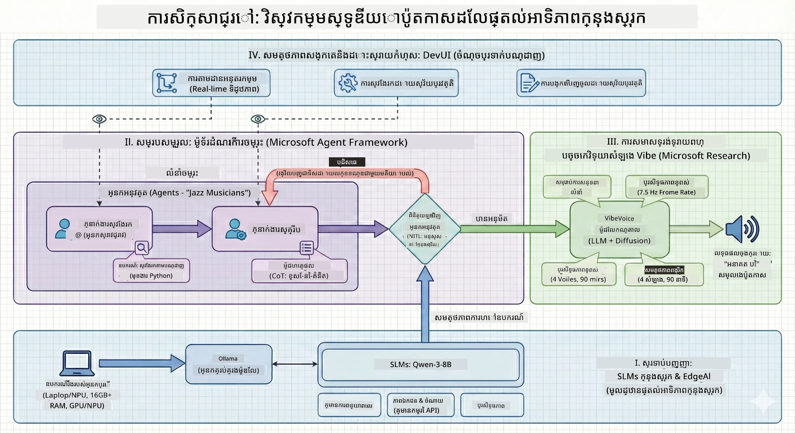

# 🎙️ កម្មវិធីហ្វឹកហាត់ស្ទូឌីយោ AI Podcast

> 🌏 [中文版 (Chinese Version)](translation/zh-cn/README.md)


## បេសកកម្មរបស់អ្នក

ស្វាគមន៍មកកាន់ **The AI Podcast Studio**! អ្នកកំពុងត្រៀមបញ្ចេញកម្មវិធីផ្សាយសំឡេងបច្ចេកវិទ្យារបស់ខ្លួនឯងដែលមានឈ្មោះថា "Future Bytes" — ប៉ុន្តែមានការផ្លាស់ប្តូរ៖ អ្នកនឹងបង្កើតក្រុមផលិតកម្មនិងអាជ្ញាធរដែលផែនដោយ AI ដើម្បីជួយអ្នកបង្កើតវា។ មិនចាំបាច់ចំណាយម៉ោងយប់យូរនឹងការស្រាវជ្រាវ ការរៀបចំស្គ្រីប និងកាសែតសំឡេងទៀតទេ។ អ្នកនឹងបង្កើតការផលិតនារបៀបដែលអ្នកក្លាយទៅជាអ្នកផលិតកម្មផ្សាយសំឡេងជាមួយអំណាច AI ។

## រឿងរ៉ាវ

សូមរំលឹកថា៖ អ្នក និងមិត្តរបស់អ្នកចង់ចាប់ផ្តើមកម្មវិធីផ្សាយសំឡេងអំពីនិន្នាការបច្ចេកវិទ្យាដ៏ល្អបំផុតប៉ុន្តែគ្រប់រូបរវល់ជាមួយសាលា ការងារ ឬជីវិតកាលសព្វថ្ងៃ។ តើជាការស្រួលប៉ុណ្ណា បើអ្នកអាចបង្កើតក្រុម AI ដែលអាចធ្វើកន្លែងជំនាញធំៗបាន? អ្នកម្នាក់ធ្វើការស្រាវជ្រាវ ប្រវត្តិ រឿងរបស់អ្នកម្នាក់សរសេរស្គ្រីបដែលទាក់ទាញ និងមួយទៀតបម្លែងអត្ថបទទៅជាការសន្ទនាដែលឆ្លាតវៃ។ បើលឺថារឿងវិទ្យាសាស្រ្ត? មកបង្កើតវាឲ្យក្លាយជាការពិត។

## អ្វីដែលអ្នកនឹងសិក្សា

នៅចុងកម្មវិធីហ្វឹកហាត់នេះ អ្នកនឹងដឹងវិធីធ្វើ៖
- 🤖 បង្ហោះម៉ូដែល AI ដោយផ្ទាល់ផ្នែកក្នុងគ្រឿង (គ្មានការចំណាយ API ក៏គ្មានការគ្រប់គ្រងពពក!)
- 🔧 បង្កើតអាជ្ញាធរ AI ជាពិសេសដែលប្រព័ន្ធធ្វើការជាមួយគ្នាភាពជាក់លាក់
- 🎬 បង្កើតបណ្ដាញផលិតកម្មផ្សាយសំឡេងពេញលេញពីគំនិតដល់សំឡេង

## ប្រវត្តិរបស់អ្នក៖ បីផ្នែក



ដូចជារឿងល្អៗណាមួយ យើងមានបីផ្នែក។ នីមួយៗជួយបង្កើតស្ទូឌីយោ AI podcast របស់អ្នកជាជំហានៗ៖

| ព្រឹត្តិការណ៍ | បេសកកម្មរបស់អ្នក | អ្វីកើតឡើង | ជំនាញដែលបានរំលឹក |
|---------|-----------|--------------|----------------|
| **ផ្នែក 1** | [ជួបជាមួយអាជ្ញាធរ AI របស់អ្នក](md/01.BuildAIAgentWithSLM.md) | អ្នកស្វែងយល់ពីរបៀបបង្កើតអាជ្ញាធរ AI អាចសន្ទនា ស្វែងរកអ៊ិនធឺរណេត និងដោះស្រាយបញ្ហា។ គិតទោលដូចជាក្រុមហ៊ុនស្រាវជ្រាវរបស់អ្នក ដែលមិនគេង។ | 🎯 បង្កើតអាជ្ញាធរដំបូងរបស់អ្នក<br>🛠️ ផ្តល់អំណាចពិសេស (ឧបករណ៍!)<br>🧠 សិក្សាអោយវាគិត<br>🌐 ភ្ជាប់វាទៅអ៊ីនធឺរណេត |
| **ផ្នែក 2** | [ប្រមូលផ្តុំក្រុមផលិតកម្មរបស់អ្នក](md/02.AIAgentOrchestrationAndWorkflows.md) | ឥឡូវរឿងចាប់ផ្តើមគួរឱ្យចាប់អារម្មណ៍! អ្នកនឹងរៀបចំអាជ្ញាធរជាច្រើន ឲ្យដំណើរការជាកម្មវិធីផ្សាយសំឡេងពិតប្រាកដ។ ម្នាក់ស្រាវជ្រាវ ម្នាក់សរសេរ អ្នកអនុញ្ញាត — ការធ្វើការ​គ្នា​ធ្វើឲ្យមានភាពជោគជ័យ។ | 🎭 ប្រតិបត្តិការអាជ្ញាធរច្រើន<br>🔄 បង្កើតលំហូរាការអនុម័ត<br>🖥️ សាកល្បងជាមួយ DevUI<br>✋ ត្រួតពិនិត្យដោយមនុស្សនៅកណ្តាល |
| **ផ្នែក 3** | [នាំឱ្យ Podcast របស់អ្នករស់រានមានជីវិត](md/03.Multi-SpeakerPodcastGenerationWithVibeVoice.md) | ចុងក្រោយ! បម្លែងស្គ្រីបអត្ថបទរបស់អ្នកទៅជាសំឡេង podcast ជាក់ស្តែង ជាមួយសំឡេងពិត និងការសន្ទនាទាក់ទាញ។ "Future Bytes" របស់អ្នករួចរាល់រួចរាល់! | 🎤 ហេតុផលជាការប្រែអត្ថបទទៅសូរ<br>👥 សំឡេងអ្នកនិយាយជាច្រើន<br>⏱️ សំឡេងយូរៗ<br>🚀 ផ្ទាល់ខ្លួនទាំងមូល |

នីមួយៗបើកចំនេះដឹងថ្មីៗ។ អាចរំលងទៅមុខបើអ្នកមានក្ស័យស្មារតី ប៉ុន្តែយើងណែនាំឲ្យដើរតាមរឿង!

## តម្រូវការបរិស្ថាន

កម្មវិធីហ្វឹកហាត់នេះគាំទ្របរិស្ថានឧបករណ៍ផ្សេងៗ៖
- **CPU**: ផ្តល់សមត្ថភាពសាកល្បង និងប្រើប្រាស់តូចៗ
- **GPU**: ណែនាំសម្រាប់បរិស្ថានផលិតកម្ម ផ្តល់ល្បឿនប្រសើរពីការគណនា
- **NPU**: គាំទ្រការបង្កើលឧបករណ៍ neural ថ្មីៗ

## អ្វីដែលអ្នកត្រូវការក្នុងកំឡុងនេះ

### បញ្ជីផ្នែកទន់ ✅
- **Python 3.10+** (ភាសាកូដរបស់អ្នក)
- **Ollama** (រត់ម៉ូដែល AI នៅលើម៉ាស៊ីនអ្នក)
- **VS Code** (កម្មវិធីកែសម្រួលកូដរបស់អ្នក)
- **Python Extension** (ធ្វើអោយ VS Code ឆ្លាតព្រមទាំង)
- **Git** (សម្រាប់ទាញយកកូដ)

### ត្រួតពិនិត្យឧបករណ៍ 💻
- **តើខ្ញុំអាចរត់នេះបានទេ?**: 8GB RAM, 10GB ទំហំនៅទំនេរ (ដំណើរការបាន តែប្រហែលយឺត)
- **កំណត់បរិយាកាសល្អបំផុត**: 16GB+ RAM, GPU ប្រណិត (រលូនដោយមិនពិបាក!)
- **មាន NPU?**: ល្អណាស់! ប្រសិទ្ធភាពជំនាន់ក្រោយបានបើក 🚀

## ចាប់ផ្តើមស្ទូឌីយោរបស់អ្នក 🎬

### ជំហ៊ាន 1៖ តម្លើង Python

ប្រាកដថាអ្នកមាន Python 3.10 ឬថ្មីជាងនេះ៖

```bash
python --version
# គួរតែបង្ហាញ Python 3.10.x ឬខ្ពស់ជាងនេះ
```
  
មិនមាន Python ទេ? ទៅទាញយកពី [python.org](https://python.org) — ឥតគិតថ្លៃ!

### ជំហ៊ាន 2៖ ទាញយក Ollama (កម្មវិធីរត់ម៉ូដែល AI របស់អ្នក)

ចូលទៅ [ollama.ai](https://ollama.ai) ហើយទាញយក Ollama សម្រាប់ប្រព័ន្ធប្រតិបត្តិការរបស់អ្នក។ នេះគឺជា​ម៉ូទ័ររត់ម៉ូដែល AI នៃរបស់អ្នក៕

ពិនិត្យមើលថាវាស្រិងត្រៀមរួច៖

```bash
ollama --version
```
  
### ជំហ៊ាន 3៖ ទាញយកខួរក្បាល AI របស់អ្នក 🧠

ពេលនេះទាញយកម៉ូដែល Qwen-3-8B (ដូចជាចុះកុងត្រាជាមួយមិត្ត AI ដំបូងរបស់អ្នក)៖

```bash
ollama pull qwen3:8b
```
  
*នេះប្រហែលចំណាយពេលបីនាទី។ ពេលល្អសម្រាប់ផឹកកាហ្វេ! ☕*

### ជំហ៊ាន 4៖ តម្លើង VS Code

ទាញយក [Visual Studio Code](https://code.visualstudio.com/) ប្រសិនបើអ្នកមិនទាន់មាន។ វាជាកម្មវិធីកែសម្រួលកូដល្អបំផុត (វាយប្រហារខ្ញុំបាន 😄).

### ជំហ៊ាន 5៖ Python Extension

នៅក្នុង VS Code:  
1. ចុច `Ctrl+Shift+X` (ឬ `Cmd+Shift+X` លើ Mac)  
2. ស្វែងរក "Python"  
3. តម្លើងកម្មវិធីផ្តល់ដោយ Microsoft  

### ជំហ៊ាន 6៖ អ្នករួចរាល់ហើយ! 🎉

សំខាន់ណាស់ អ្នករួចរាល់សម្រាប់ធ្វើវា។ មកចូលរួមបង្កើតការអស្ចារ្យ AI!

### ជំហ៊ាន 7៖ តម្លើង Microsoft Agent Framework និងកញ្ចប់ដែលពាក់ព័ន្ធ 📦

តម្លើងdependency ទាំងអស់ដែលចាំបាច់សម្រាប់កម្មវិធីហ្វឹកហាត់នេះ៖

```bash
pip install -r ./Installations/requirements.txt -U
```
  
*នេះនឹងតម្លើង Microsoft Agent Framework និងកញ្ចប់ទាំងអស់ដែលចាំបាច់។ មកផឹកកាហ្វេ — ការតម្លើងដំបូងប្រហែលនឹងចំណាយពេលប៉ុន្មាននាទី! ☕*

## សេចក្ដីណែនាំកម្មវិធីហ្វឹកហាត់

រចនាសម្ព័ន្ធគម្រោងលម្អិត ជំហ៊ានកំណត់ និងវិធីដំណើរការនឹងត្រូវពន្យល់មូលដ្ឋានជំហ៊ានៗក្នុងកំឡុងកម្មវិធីហ្វឹកហាត់នេះ។

## ការជួសជុល បើមានបញ្ហា 🔧

### "អូហ្គ្គា! ការទាញយកម៉ូដែលយឺតពេក!"
**ដោះស្រាយ**៖ ប្រើ VPN ឬកំណត់ Ollama ជាមួយប្រភពមេរៀនមួយច្រក។ ពេលខ្លះអ៊ីនធឺរណេតមិនសប្បាយចិត្តយើងទេ។

### "កុំព្យូទ័រខ្ញុំដួលរលំ! មិនមានអង្គចងចាំ!"
**ដោះស្រាយ**៖ ប្រើម៉ូដែលតូចជាង ឬកែប្រែការកំណត់ `num_ctx` ដើម្បីប្រើអង្គចងចាំតិច។ គិតថាវាជាការអោយ AI របស់អ្នកឈប់បរិច្ឆេទ។

### "តើខ្ញុំអាចធ្វើឲ្យវរហ័សជាមួយ GPU របស់ខ្ញុំបានទេ?"
**ដោះស្រាយ**៖ Ollama ស្វ័យប្រវត្តិរកឃើញ GPU! ត្រឹមត្រូវប្រាកដថាកម្មវិធីបើកបរ GPU មានសុពលភាព។ ល្បឿនកម្រិតពីរាបក្លាយ! 🏎️

## ធនធានបន្ថែម (សម្រាប់អ្នកចាប់អារម្មណ៍) 📚

- [Ollama Docs](https://github.com/ollama/ollama) — អភិវឌ្ឍន៍ជម្រៅខាងម៉ូដែល AI ក្នុងម៉ាស៊ីន
- [Microsoft Agent Framework](https://microsoft.github.io/autogen/) — រៀនពីរបៀបបង្កើតក្រុមអាជ្ញាធរ
- [Qwen Model Info](https://qwenlm.github.io/) — ស្គាល់ខួរក្បាល AI របស់អ្នក

## អាជ្ញាបណ្ណ

អាជ្ញាបណ្ណ MIT — បង្កើតរឿងល្អៗ ចែករំលែកវា ធ្វើឱ្យពិភពលោកល្អប្រសើរឡើង! 🌍

## ចង់ចូលរួមរួចទេ?

ឃើញបញ្ហា? មានគំនិត? បញ្ចូល Issue ឬ PR! យើងស្រលាញ់សហគមន៍ដែលរស់រវើក។ ✨

---

<!-- CO-OP TRANSLATOR DISCLAIMER START -->
**ការបដិសេធ**:  
ឯកសារនេះត្រូវបានប្តូរភាសាដោយប្រើសេវាកម្មបកប្រែ AI [Co-op Translator](https://github.com/Azure/co-op-translator) ។ នៅពេលដែលយើងខិតខំផ្តល់ភាពត្រឹមត្រូវ សូមយល់ព្រមថាការបកប្រែដោយស្វ័យប្រវត្តិអាចមានកំហុសឬភាពមិនត្រឹមត្រូវ។ ឯកសារដើមនៅភាសាមូលដ្ឋានគួរត្រូវបានចាត់ទុកជាផ្នែកដែលមានសុពលភាពខ្ពស់បំផុត។ សម្រាប់ព័ត៌មានសំខាន់ សូមផ្តល់អាទិភាពដល់ការបកប្រែដោយមនុស្សដែលមានជំនាញ។ យើងមិនទទួលខុសត្រូវចំពោះការយល់ខុសឬការបកស្រាយខុសៗដែលកើតឡើងពីការប្រើប្រាស់ការបកប្រែនេះទេ។
<!-- CO-OP TRANSLATOR DISCLAIMER END -->