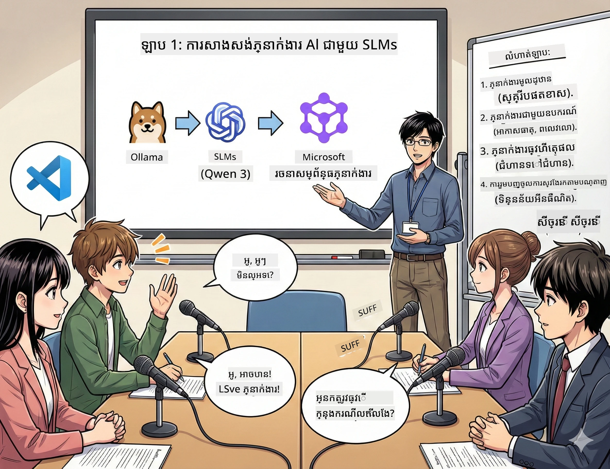

# ឆាកទី 1: ស្គាល់ជំនួយការស្រាវជ្រាវ AI របស់អ្នក 🤖

## ការប្រឈម

អ្នកកំពុងចាប់ផ្តើម "Future Bytes," ដែលជ៉ាប់កាស់បច្ចេកវិទ្យាថ្មីរបស់អ្នក។ ភាគទី 1 និយាយអំពីការបង្កើតថ្មីៗក្នុង AI ប៉ុន្តែអ្នកមានពេលតែ 24 ម៉ោងដើម្បី:
1. ស្រាវជ្រាវប្រធានបទ
2. រកប្រភពដែលទំនុកចិត្តបាន
3. សរសេរលេខងារមួយដែលទាក់ទាញ
4. ធ្វើឱ្យវាហាក់ដូចជា នៅក្នុងស្ទើរ

**បត់បែនផ្លូវ**: អ្នកមិនចាំបាច់ធ្វើវាដោយខ្លួនឯងទេ។ អ្នកនឹងបង្កើតជំនួយការវិទ្យាសាស្រ្ត AI ដំបូងរបស់អ្នក ដែលអាចជួយបានគ្រប់យ៉ាងនេះ។ ឈ្មោះរបស់គេគឺ Alex — ដៃគូស្រាវជ្រាវដែលមិនដែលត្រូវការគេង។

## ហេតុអ្វីម៉ូឌែលភាសាឯកទេសតូច? (ស្ពេលើ: ពួកវាអស្ចារ្យ)

គិតពីម៉ូឌែលភាសាឯកទេសតូច (SLMs) ជា AI ផ្ទាល់ខ្លួនដែលរស់នៅលើកុំព្យូទ័ររបស់ *អ្នក*។ គ្មានមេឃ, គ្មានថ្លៃសេវាប្រចាំខែ, គ្មានការចែករំលែកទិន្នន័យដែលមើលមិនសូវល្អ។

**ហេតុអ្វី SLMs គួរឱ្យចាប់អារម្មណ៍ 🔥:**
- **🏠 ដំណើរការលើម៉ាស៊ីនរបស់អ្នក**: Laptop, desktop, ឬ нават Raspberry Pi កម្រិតខ្លាំង
- **💸 គ្មានថ្លៃបន្ត**: គ្មានកម្រៃ API បីឡមួយចូលបរិច្ឆេទ
- **🔒 ជំហិនភាពឯកជនជាប្រយោជន៍ដំបូង**: ទិន្នន័យរបស់អ្នកមិនចេញពីឧបករណ៍ទេ
- **⚡ ឆាប់រហ័ស**: គ្មានភាពយឺតអ៊ីនធឺណិត, ការឆ្លើយតបភ្លាមៗ
- **🪦 ទំងន់ស្រាល**: 1B-10B ប៉ារ៉ាម៉ែត្រ ផ្សេងពី 100B+ របស់ក្រុមធំៗ

**ម៉ូឌែល SLMs ដែលពេញនិយម**: Qwen 3, Phi-4, Gemma 3 (យើងកំពុងប្រើ Qwen សម្រាប់វគ្គហាងនេះ)

## ឧបករណ៍របស់អ្នក

### Ollama: អ្នកគ្រប់គ្រងម៉ូឌែល AI របស់អ្នក

[Ollama](https://ollama.com/) ជាចំបាប់ដូចជា Steam សម្រាប់ម៉ូឌែល AI។ ទាញយក ដំណើរការ និងគ្រប់គ្រងម៉ូឌែលដោយពាក្យបញ្ជាងាយៗ។

**អ្វីដែលធ្វើឱ្យវាស្អាត:**
- ពាក្យបញ្ជាតែមួយដើម្បីទាញយក និងដំណើរការម៉ូឌែលណាមួយ
- ដំណើរការលើ Mac, Windows, Linux
- ធ្វើការប្រើ GPU របស់អ្នកដោយស្វ័យប្រវត្តិ ប្រសិនបើអ្នកមាន
- សន្សំខ្សែម៉emoryយ៉ាងមានប្រសិទ្ធភាព

### Microsoft Agent Framework: កន្លែងដែលព្រឹត្តិការណ៍អស្ចារ្យកើតឡើង

[Microsoft Agent Framework](https://github.com/microsoft/agent-framework) ជាសួនសេវារបស់អ្នកសម្រាប់បង្កើតភ្នាក់ងារ AI ដែលអាច:

- 💬 ចែកចាយនិងចងចាំអ្វីដែលអ្នកបាននិយាយ
- 🛠️ ប្រើឧបករណ៍ប្តូរទូទៅ (ដូចជា ស្វែងរកវេបសាយ ឬ ពិនិត្យអាកាសធាតុ)
- 🧠 គិតតាមជំហានដើម្បីដោះស្រាយបញ្ហាកម្ដៅ
- 🤝 ធ្វើការ​ជាមួយភ្នាក់ងារផ្សេងទៀតជាក្រុម
- 🔌 ភ្ជាប់ទៅអ្នកផ្គត់ផ្គង់ AI ផ្សេងៗ (OpenAI, Ollama, Azure)

**ឧបករណ៍ដើម្បីកសាង:**
- **Agents**: ជាជំនួយការដែលមានភារកិច្ចជាក់លាក់
- **Tools**: សមត្ថភាពពិសេសដែលអ្នកផ្តល់ឱ្យពួកវា
- **Memory**: ដើម្បីឲ្យពួកវាមិនភ្លេចការពិភាក្សារ
- **Reasoning**: បង្រៀនឲ្យពួកវាគិត មិនមែនតែឆ្លើយតបប៉ុណ្ណោះទេ

## ការបណ្តុះបណ្តាលរបស់អ្នក: បេសកកម្ម 4

### បេសកកម្ម 1: បង្កើតភ្នាក់ងារដំបូងរបស់អ្នក

📓 [Open Notebook](../code/01.BasicAgent/00.BasicAgent-agent.ipynb)

**ភារកិច្ច**: បង្កើត Alex, ជាអ្នកសរសេរស្គ្រីបផតខាស្ដរបស់អ្នក។ Alex ត្រូវបង្កើតសន្ទនារវាងម្ចាស់ផតខាស ២ នាក់ពិភាក្សាអំពីប្រធានបទបច្ចេកវិទ្យា។

**អ្វីដែលអ្នកនឹងរៀន**:
- របៀបធ្វើឱ្យភ្នាក់ងារ AI ត្រឡប់មក (វាងាយជាងការត្រឡប់ចេញនៅថ្ងៃច័ន្ទ)
- និយាយលក្ខណៈនិងការណែនាំឲ្យវា
- ធ្វើឲ្យវាបង្កើតស្គ្រីបផតខាសជាក់ស្តែង
- យល់ពីអ្វីដែលវាកំពុងនិយាយតបវិញ

**លក្ខខណ្ឌជ័យលាភ**: Alex បង្កើតស្គ្រីបសម្រាប់វគ្គដំបូង "Future Bytes" របស់អ្នកអំពី AI! 🎯

### បេសកកម្ម 2: ផ្ដល់អំណាចពិសេសឲ្យ Alex (ឧបករណ៍!)

📓 [Open Notebook](../code/01.BasicAgent/01.BasicAgent-tools.ipynb)

**ភារកិច្ច**: Alex ប្រាជ្ញាធំ ប៉ុន្តែវាមិនដឹងអាកាសធាតុថ្ងៃនេះ ឬម៉ោងបច្ចុប្បន្នទេ។ យើងនឹងដោះស្រាយបញ្ហានេះដោយផ្ដល់ឧបករណ៍ឲ្យវា!

**អ្វីដែលអ្នកនឹងរៀន**:
- បង្កើតមុខងារ Python ផ្ទាល់ខ្លួនជាថ្មីជា "ឧបករណ៍"
- ឲ្យ Alex ទទួលសិទ្ធិពិនិត្យ *ពេលណា* ដើម្បីប្រើឧបករណ៍ណាមួយ
- មើលវាដោះស្រាយបញ្ហាដោយស្វ័យប្រវត្តិ
- ផ្សំឧបករណ៍ច្រើនសម្រាប់ភារកិច្ចស្មុគស្មាញ

**លក្ខខណ្ឌជ័យលាភ**: សួរ "បាតប៉ុន្មាននៅទីក្រុង Tokyo?" ហើយ Alex ស្វែងយល់យកដោយខ្លួនឯង! ☁️

### បេសកកម្ម 3: បង្រៀន Alex ឲ្យគិត

📓 [Open Notebook](../code/01.BasicAgent/02.BasicAgent-reasoning.ipynb)

**ភារកិច្ច**: ធ្វើឲ្យ Alex បញ្ជាក់ពីវិធីសាស្រ្តរបស់វា។ នៅពេលដោះស្រាយបញ្ហា អ្នកចង់ឃើញ *វិធីដែល* វាគិត មិនមែនតែចម្លើយមួយទេ។

**អ្វីដែលអ្នកនឹងរៀន**:
- បើក "ម៉ូដការពិចារណា" (វាដូចជាការបង្ហាញការងារ​របស់អ្នកនៅថ្នាក់គណិតវិទ្យា)
- មើលដំណើរការគិតជាជំហានៗរបស់ Alex
- យល់ពីបច្ចេកទេស chain-of-thought prompting
- ដោះស្រាយកំហុសពេល Alex មានការភាន់ច្រឡំ

**លក្ខខណ្ឌជ័យលាភ**: សួរបញ្ហាគណិតស្មុគស្មាញមួយ ហើយមើល Alex គិតចេញ! 🧠

### បេសកកម្ម 4: ភ្ជាប់ Alex ទៅអ៊ីនធឺណិត

📓 [Open Notebook](../code/01.BasicAgent/03.BasicAgent-websearch.ipynb)

**ភារកិច្ច**: ចំណេះដឹងរបស់ Alex មានកាលបរិច្ឆេទកាត់បន្សំ។ យើងនឹងភ្ជាប់វាទៅបណ្តាញសម្រាប់ព័ត៌មានពេលវេលាចុងក្រោយ!

**អ្វីដែលអ្នកនឹងរៀន**:
- បង្កើតឧបករណ៍ស្វែងរកវេបផ្ទាល់ខ្លួន
- ប្រើ APIs ខាងក្រៅ
- ហើយដោះស្រាយកំហុសបណ្ដាញដោយម៉ាសុីនច្បាស់
- ទទួលបានព័ត៌មានកើតចេញពីពីលើទិន្នន័យបណ្តុះបណ្តាលរបស់ Alex

**លក្ខខណ្ឌជ័យលាភ**: សួរអំពីព័ត៌មានបច្ចេកវិទ្យាថ្ងៃនេះ ហើយទទួលបានលទ្ធផលថ្មីៗ! 📰

## មុនពេលអ្នកចាប់ផ្តើម 🚀

**ឧបករណ៍ដែលចាំបាច់**:
- Python 3.10+ ត្រូវបានដំឡើង
- Ollama ដំណើរការ (ពិនិត្យដោយ `ollama --version`)
- VS Code ជាមួយផ្នែកបន្ថែម Python
- RAM យ៉ាងហោចណាស់ 8GB (16GB ប្រសិនបើអ្នកចង់ឲ្យរលូន)

## លំដាប់បេសកកម្ម

ធ្វើតាមសៀវភៅកំណត់ត្រានៅលំដាប់សម្រាប់រឿងពេញលេញ:

1. [00.BasicAgent-agent.ipynb](../code/01.BasicAgent/00.BasicAgent-agent.ipynb) — ស្គាល់ Alex (ភ្នាក់ងារដំបូងរបស់អ្នក)
2. [01.BasicAgent-tools.ipynb](../code/01.BasicAgent/01.BasicAgent-tools.ipynb) — ពេលវេលាសមត្ថភាព!
3. [02.BasicAgent-reasoning.ipynb](../code/01.BasicAgent/02.BasicAgent-reasoning.ipynb) — បង្រៀន Alex ឲ្យគិត
4. [03.BasicAgent-websearch.ipynb](../code/01.BasicAgent/03.BasicAgent-websearch.ipynb) — បើកចូលទៅអ៊ីនធឺណិត!

## អ្វីដែលអ្នកនឹងស្គាល់

បន្ទាប់ពីឆាកទី 1 អ្នកនឹងអាច:

- ✅ ដំណើរការម៉ូឌែល AI នៅលើរឹងរានរបស់អ្នក (គ្មានមេឃត្រូវការទេ!)
- ✅ បង្កើតភ្នាក់ងារដោយមានបុគ្គលិកលក្ខណៈ និងជំនាញផ្ទាល់ខ្លួន
- ✅ ផ្ដល់ឧបករណ៍ឲ្យភ្នាក់ងារដោះស្រាយបញ្ហាជាក់ស្ដែង
- ✅ ធ្វើឲ្យភ្នាក់ងារបង្ហាញដំណើរការគិតរបស់ពួកវា
- ✅ ភ្ជាប់ភ្នាក់ងារទៅប្រភពទិន្នន័យខាងក្រៅ
- ✅ ដោះស្រាយកំហុសពេលមានបញ្ហា

## ពេលមានបញ្ហា (ហើយរបៀបជួសជុល) 🔧

### "Alex មិនដំណើរការ! ចេញពីម៉េម៉ូរី!"
**ដំណោះស្រាយ**: កុំព្យូទ័ររបស់អ្នកកំពុងតែក្ដើម។ ព្យាយាមបិទកម្មវិធីផ្សេងៗ ឬប្ដូរទៅម៉ូឌែលតូចជាង។ 8GB RAM គឺជាកម្រិតអប្បបរមា។

### "Alex យឺតណាស់"
**ដំណោះស្រាយ**: បើកការបង្កើនល្បឿន GPU នៅក្នុងការកំណត់ Ollama។ ឬកាត់បន្ថយទំហំ​បណ្ដាំ context window។ របៀបលឿនបានដាក់ចាប់ផ្ដើម! 🏎️

### "ឧបករណ៍មិនដំណើរការ!"
**ដំណោះស្រាយ**: ពិនិត្យហត្ថលេខាមុខងាររបស់អ្នកម្ដងទៀត។ Alex ត្រូវការការផ្ដល់ព្រមានប្រភេទ (type hints) ត្រឹមត្រូវ ដើម្បីយល់ថាឧបករណ៍នោះធ្វើអ្វី។ គិតថាវាដូចជាការផ្ដល់សេចក្តីណែនាំច្បាស់។

## តំណភ្ជាប់ដែលមានប្រយោជន៍ 🔗

- [Agent Framework Docs](https://github.com/microsoft/agent-framework) — មគ្គុទេសក៍ផ្លូវការនិងឧទាហរណ៍
- [Ollama Model Library](https://ollama.com/library) — ស្វែងរកម៉ូឌែលដែលមាន
- [Qwen Model](https://ollama.com/library/qwen3) — ស្គាល់ខួរក្បាល AI របស់អ្នក
- [Code Examples](https://github.com/microsoft/agent-framework/tree/main/python/samples) — យកគំនិតពីទីនេះ

## បន្ទាប់ទៅ: ឆាកទី 2 🎬

អ្នកមានភ្នាក់ងារមួយ។ ប៉ុន្តែប្រសិនបើអ្នកមាន *ក្រុម* ភ្នាក់ងារធ្វើការជាមួយគ្នា? នៅឆាកទី 2 អ្នកនឹងបង្កើតក្រុមផលិតផតខាសពេញលេញរបស់អ្នក:
- **Researcher Agent**: រកប្រភពល្អបំផុត
- **Writer Agent**: សរសេរស្គ្រីបដ៏ល្អឥតខ្ចោះ  
- **Editor (You!)**: អនុម័តឬស្នើសុំការផ្លាស់ប្តូរ

ចង់ចាក់ប្រមូលមន្តសាស្រ្ត AI មួយទេ? → [Act 2: Assemble Your Production Team](02.AIAgentOrchestrationAndWorkflows.md)

---

**ទៅក្នុងភពសង្ស័យ?** សួរពេលវគ្គបណ្តុះបណ្តាល។ យើងទាំងអស់កំពុងរៀនរួមគ្នា! 🙌

---

<!-- CO-OP TRANSLATOR DISCLAIMER START -->
**Disclaimer**:
ឯកសារនេះត្រូវបានបកប្រែដោយប្រើសេវាបកប្រែ AI [Co-op Translator](https://github.com/Azure/co-op-translator)។ ខណៈពេលដែលយើងខិតខំរកភាពត្រឹមត្រូវ សូមចំណាំថាការបកប្រែដោយស្វ័យប្រវត្តិអាចមានកំហុស ឬភាពមិនត្រឹមត្រូវ។ ឯកសារដើមក្នុងភាសាម្ចាស់ត្រូវបានគេរួមគិតថាជាប្រភពដែលមានសក្ដានុពល។ សម្រាប់ព័ត៌មានដែលសំខាន់ខ្លាំង យើងបนะนำឲ្យប្រើការបកប្រែដោយមនុស្សជំនាញ។ យើងមិនទទួលខុសត្រូវចំពោះការយល់ច្រឡំនោះ ឬការបកស្រាយខុសពីការប្រើប្រាស់ការបកប្រែនេះទេ។
<!-- CO-OP TRANSLATOR DISCLAIMER END -->