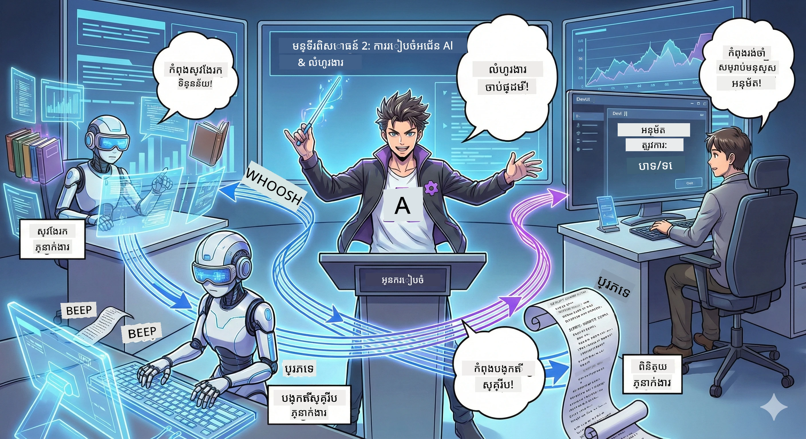

# សកម្មភាពទី 2: ផ្គុំក្រុមផលិតកម្មប៉ូត្កាសរបស់អ្នក 🎬



## រឿងកាន់តែស្មុគស្មាញ

Alex (ជាជំនួយការរបស់អ្នកពី សកម្មភាពទី 1) ល្អបំផុត ប៉ុន្តែភ្នាក់ងារ​ម្នាក់មិនអាចបើកស្ទូឌីយ៉ូប៉ូត្កាសបានទាំងមូលទេ។ អ្នកត្រូវការក្រុមមួយ៖
- 🔍 **Research Agent**: ស្វែងរកព័ត៌មានថ្មីពីអ៊ីនធឺណិត
- ✍️ **Script Agent**: បម្លែងការស្រាវជ្រាវទៅជាសោភ័ណភាពសំឡេងនៃស្គ្រីប
- 👤 **You (The Editor)**: អនុម័តស្គ្រីប ឬផ្ញើវាឡើងវិញសម្រាប់ការសរសេរឡើងវិញ

សូមស្វាគមន៍មកកាន់ **AI Agent Orchestration** — នៅទីនេះអ្នកក្លាយជាអ្នកដឹកនាំនៃក្រុម AI របស់អ្នក។ សូមគិតថាជាក្រុម Avengers ប៉ុន្តសម្រាប់ការផលិតប៉ូត្កាស។

## តើ Agent Orchestration ជាអ្វី? (បែបសាមញ្ញ)

សូមស្រមៃថាអ្នកកំពុងដើរក្នុងភោជនីយដ្ឋាន។ អ្នកមិនធ្វើគ្រប់យ៉ាងផ្ទាល់ខ្លួនទេ មែនទេ? អ្នកមាន:
- 🍳 ពិជ្ជិមាស (chef) ដែលចម្អិន
- 👨‍🍳 sous chef ដែលរៀបចំ
- 👩‍🍳 បុគ្គលិកដឹកជញ្ជូនដែលផ្តល់អាហារ

Agent orchestration គឺដូចគ្នា ជាមួយ AI។ ភ្នាក់ងារនីមួយៗមានជំនាញជាក់លាក់ ហើយអ្នកសម្របសម្រួលពួកវាឲ្យសម្រេចគោលបំណងធំៗ។ មិនមានភ្នាក់ងារម្នាក់ណាដែលត្រូវធ្លាក់បន្ទុកធ្លែកទេ ហើយការងារត្រូវបានបញ្ចប់ឆាប់រហ័សជាងមុន។

### ការប្រៀបធៀបជា​ក្រុមតន្រ្តី 🎸

ភ្នាក់ងារ AI របស់អ្នកដូចជាក្រុមតន្រ្តី៖
- **Lead singer**: ភ្នាក់ងារសំខាន់ដែលដោះស្រាយភារកិច្ចសម្រាប់អតិថិជន
- **Drummer**: បង្វឹកចង្វាក់គន្លង, ដោះស្រាយការប្រមូលខាងក្រោយ  
- **Bass player**: គាំទ្រក្រុមទាំងមូល, ប្រមូលទិន្នន័យ
- **You (Band Manager)**: ដើម្បីសម្របសម្រួលទាំងអស់!

ប្រសិនបើគ្មានការសម្របសម្រួល? គ្រាន់តែមានសំឡេងកក្រូល។ មាន orchestration? តន្រ្តីស្រស់ស្អាត។

### ហេតុអ្វីវាសំខាន់

ភ្នាក់ងារ AI ម្នាក់ព្យាយាមធ្វើគ្រប់យ៉ាង = អស់កម្លាំង។ ភ្នាក់ងារដែលមានជំនាញរួមគ្នា = ប្រសិទ្ធភាពបើកចំហ! 🚀

**ការពិត**: ចងចាំពេលដែលអ្នកខិតស្រាវជ្រាវ, សរសេរ, ហើយកែសម្រួលប៉ូត្កាសតែម្នាក់ឯង? អ្នកប្រាកដជាមានភាពខុសរឿង។ ជាមួយ orchestration ភ្នាក់ងារ​ម្នាក់ៗធ្វើការក្នុងអ្វីដែលពួកវាដើមកាលបាន។ អ្នកគ្រាន់តែធ្វើការសម្រេចចុងក្រោយ។

**ឧទាហរណ៍ក្នុងពិភពពិត**: របូតបំពេញសេវាអតិថិជនដែលដឹងពេលណាត្រូវសម្របចំពោះវិក្កយបត្រ ទំព័របច្ចេកទេស ឬពេលណាត្រូវនឹងមនុស្ស។ នោះហើយជាការសម្របសម្រួល!

## ភ្នាក់ងារ​ទល់នឹង Workflow: ផ្សេងគ្នា​យ៉ាងដូចម្តេច?

សូមគិតដូចនេះ៖

### 🤖 AI Agent = តន្រ្តី Jazz
- **ធ្វើការសម្រេចចិត្តភ្លាមៗ** ដោយផ្អែកលើអ្វីដែលវាស្តាប់
- **អ៊ីមប្រីវីស** ដោះស្រាយដោយប្រើឧបករណ៍របស់វា
- **គិត** ជាមួយខួរក្បាល LLM
- **សម្រប** ទៅនឹងអ្វីដែលអ្នកផ្តល់សំឡេង

### 🎵 Workflow = យុទ្ធសាស្ត្រលេងតន្រ្តីក្លាស៊ីក  
- **អនុវត្តតាមនិទាន** (ជំហានដែលបានកំណត់ជាមុន)
- **អនុវត្តកម្មដែលអាចទុកចិត្តបាន**
- **សម្របសម្រួល** ភ្នាក់ងារ, មនុស្ស, ប្រព័ន្ធជាច្រើន
- **មានរចនាសម្ព័ន្ធ** ដូចជា រូបមន្ត

**អស្ចារ្យ**: Workflows *សម្របសម្រួល* ភ្នាក់ងារ! អ្នកគំរោង workflow ដែលប្រាប់ភ្នាក់ងារ​ពេលណាត្រូវរួមចំណែក។ គង់មានភាពល្អបង្អស់ពីពីរផ្នែកទាំងនេះ។ 🎭

## វិធីបីក្នុងការសម្របសម្រួលក្រុម AI របស់អ្នក

### 1. 🎯 ការកំពូលមណ្ឌល (អ្នកជាអ្នកថ្នាក់គ្រប់គ្រង)

ភ្នាក់ងារចម្បងមួយផ្ដាច់ការទាំងអស់។ សូមគិតថាអ្នកគ្រប់គ្រងក្រុម — អ្នកសម្រេចចិត្តនាក់ណាធ្វើអ្វី និងពេលណា។

ប្រយោជន៍:
- ✅ មានភាពដឹកនាំច្បាស់លាស់ (គ្មានការភាន់ច្រឡំ)
- ✅ សម្រេចចិត្តឥតប្តូរ
- ✅ ងាយស្រួលក្នុងការស្វែងរកកំហុស

សម្រាប់ប្រើ:
- ការបញ្ជូនសេវាកម្មអតិថិជន ("នេះជាវិក័យប័ត្រឬបច្ចេកទេស?")
- វិធីសាស្ត្រអនុម័តខ្លឹមសារ ("ស្គ្រីបនេះអនុញ្ញាតឬទេ?")
- ការផលិតប៉ូត្កាស (អ្វីដែលយើងកំពុងកសាង!)

### 2. 🤝 ការបែករំលែក (Agents Self-Organize)

ភ្នាក់ងារនិយាយគ្នាផ្ទាល់ និងសម្រេចចិត្តជាក្រុម។ ដូចជាក្រុមជជែកដែលមនុស្សគ្រប់គ្នាសម្របសម្រួល។

ប្រយោជន៍:
- ✅ សម្រួលបានងាយ (បន្ថែមភ្នាក់ងារបានគ្រប់ពេល)
- ✅ មិនមានចំណុចខ្នោះតែមួយ
- ✅ ភ្នាក់ងារសហការយ៉ាងធម្មជាតិ

សម្រាប់ប្រើ:
- ក្រុមស្រាវជ្រាវ (ភ្នាក់ងារនីមួយៗស្វែងរកប្រភពខុសគ្នា)
- សម័យ​ពិភាក្សាច្នៃប្រឌិត
- ដោះស្រាយបញ្ហាក្នុងរាងចែកចាយ

### 3. 🔀 ស៊ីប៊ី (Hybrid) (ល្អបំផុតពីទាំងពីរ)

អ្នកកំណត់ទិសដៅទូទៅ ប៉ុន្តភ្នាក់ងារមានសេរីភាពក្នុងការរៀបចំខ្លួនលើភារកិច្ច។ ដូចជា CEO ដែលទុកចិត្តក្រុមរបស់ខ្លួន។

ល្អសម្រាប់: គម្រោងស្មុគស្មាញដែលត្រូវការការគ្រប់គ្រង និងបត់បែន។

## Microsoft Agent Framework: កម្មវិធីឧបករណ៍សម្រាប់ការសម្របសម្រួល 🧰

ពេលវេលាដើម្បីសាងសង់! នេះជាអ្វីដែលអ្នកនឹងប្រើ៖

### ផ្នែកសាងសង់

#### 1. 🧱 Executors (កម្មកររបស់អ្នក)
- **តើវាជាអ្វី**: ឯកតាការក обработា ឯករាជ្យ — អាចជាភ្នាក់ងារឬ ទ lógica ផ្ទាល់ខ្លួន
- **វាធ្វើអ្វី**: ទទួលឧបត្ថម្ភ, ធ្វើការងារ, បង្កើតលទ្ធផល
- **គិតវាថា**: មកដល់ជំពូកនានា ក្នុងខ្សែដេរ

#### 2. ➡️ Edges (ការតភ្ជាប់)
- **តើវាជាអ្វី**: ផ្លូវរវាង executors
- **វាធ្វើអ្វី**: គ្រប់គ្រងចរន្តសារ ("បន្ទាប់ពី A ទៅ B")
- **គិតវាថា**: ខ្សែពណ៌នៅលើរូបត្រៀមផ្សាយ

#### 3. 🗺️ Workflows (ផែនការចម្បង)
- **តើវាជាអ្វី**: គ្រោងបណ្តេញលម្អិតនៃ executors + edges
- **វាធ្វើអ្វី**: កំណត់ដំណើរការពេញលេញពីចាប់ផ្តើមដល់បញ្ចប់
- **គិតវាថា**: គម្រោងផ្លូវលំដាប់ផលិតកម្មរបស់អ្នក

### លក្ខណៈពិសេសដែលអ្នកនឹងស្រលាញ់

**🛡️ Type Safety**: សាររវាងភ្នាក់ងារ​ត្រូវបានពិនិត្យប្រភេទ។ គ្មាន "អូបស៍, ប្រភេទទិន្នន័យខុស" ទៀតទេ។

**🔀 Flexible Routing**: 
- If-then conditions ("If approved, publish; else, rewrite")
- ការប្រតិបត្តិក្នុងលំនាំទៅកាន់មួយចំនួនក្នុងពេលតែមួយ (parallel processing)
- ផ្លូវផ្ទាល់ខ្លួន (dynamic paths) (workflow តំរូវផ្លាស់ប្តូរតាមលទ្ធផល)

**🔌 External Integration**:
- Connect to APIs
- បន្ថែម checkpoints មានមនុស្សចូលរួម (អ្នកអនុម័តមុនផ្សាយ)
- សាងសង់ flows សំណើ/ចម្លើយ

**💾 Checkpointing**: រក្សាការបន្ត! ប្រសិនបើមានអ្វីខូច, អាចចាប់ផ្តើមម្ដងទៀតពីកន្លែងដែលអ្នកបានទុក។

**🤝 Multi-Agent Coordination**:
- បើកភ្នាក់ងារតាមលំដាប់ (A → B → C)
- បើកពួកវាជាភាគី (A + B + C ក្នុងពេលតែមួយ)
- ផ្ទេរជាមួយភ្នាក់ងារ
- ដំណើរការសហគមន៍

## លំនាំល្អបំផុត (ជារូបមន្ត) 🎯

### 1. រក្សាមតុល្យភាពនៃមុខងារ
ភ្នាក់ងារនីមួយៗគួរធ្វើអ្វីមួយបានយ៉ាងល្អមួយ។ កុំបង្កើត "super agent" ដែលធ្វើគ្រប់យ៉ាង — អ្នកនឹងសោកស្តាយនៅពេល debugging។

### 2. រៀបចំសម្រាប់ករណីបរាជ័យ
ភ្នាក់ងារមិនត្រូវបានគ្រប់គ្រាន់។ បណ្តាញអាចខូច។ សាងសង់ error handling និងផែនការបម្រុងទុក។ អនាគតនារូបអ្នកនឹងអរគុណ។

### 3. ត្រួតពិនិត្យគ្រប់យ៉ាង
តាមដានអ្វីដែលភ្នាក់ងាររបស់អ្នកកំពុងធ្វើ។ ប្រើ DevUI (យើងនឹងគ្របដណ្តប់នេះ!) ដើម្បីមើល workflows ដំណើរការ។

### 4. អតិបរិមានទំហំសារ
កុំផ្ញើឯកសារធំនៅក្នុងសាររវាងភ្នាក់ងារ។ បន្ថែមសារ​ឲ្យលឿន និងមានប្រសិទ្ធភាព។

### 5. ជ្រើសរើសលំនាំដែលត្រឹមត្រូវ
ត្រូវការគ្រប់គ្រង? ជ្រើស centralized។ ត្រូវការពង្រីក? ជ្រើស decentralized។ មិនដឹង? ជ្រើស hybrid!

## DevUI: ឧបករណ៍ Debug សម្រាប់ Workflow របស់អ្នក 🔍

### តើ DevUI ជាអ្វី?

DevUI គឺដូចជាកន្លែងលេងសម្រាប់សាកល្បងភ្នាក់ងារ និង workflows របស់អ្នក។ វាជា UI វេប ដែលអ្នកអាច៖
- 👀 មើល workflow របស់អ្នកដំណើរការ
- 💬 ចែកចាយជជែកជាមួយភ្នាក់ងារ​ដោយផ្ទាល់
- 🔍 ដោះស្រាយបញ្ហានៅពេលមានបញ្ហា
- 📊 មើល traces និង metrics ប្រសិទ្ធភាព

> **សំខាន់**: DevUI សម្រាប់ការអភិវឌ្ឍន៍ប៉ុណ្ណោះ! កុំប្រើវាក្នុងផលិតកម្ម។ គិតថាវាជាបរិស្ថានសាកល្បងក្នុងកុំព្យូទ័ររបស់អ្នក។

### អ្វីជាអ្នកស្រលាញ់អំពីវា

- **🖥️ Interactive Web UI**: ចុច, សរសេរ, សាកល្បង — គ្មាន command line ទាមទារ
- **📁 Drag-and-Drop Ready**: អ្នកអាចផ្ទុកឯកសារ, សាកល្បងជាមួយ input ផ្សេងៗ
- **📂 Auto-Discovery**: ដាក់វាទៅកាន់ថត, វាស្វែងរកភ្នាក់ងារទាំងអស់ដោយស្វ័យប្រវត្តិ
- **📋 No-Setup Mode**: ចុះបញ្ជីភ្នាក់ងារ​នៅក្នុង code, មិនត្រូវការរចនាសម្ព័ន្ធថត
- **🔌 OpenAI Compatible**: ធ្វើការជាមួយ OpenAI SDK (compatibility FTW!)
- **👁️ Tracing Built-in**: មើលបានត្រឹមត្រូវថាភ្នាក់ងាររបស់អ្នកកំពុងធ្វើអ្វី

### របៀបដែល Input ធ្វើការ

DevUI មានភាពងាយស្រួលស្តីពី input:

- **Testing Agents?** អ្នកបានប្រអប់អត្ថបទ និង​ប៊ូតុងផ្ទុកឯកសារ
- **Testing Workflows?** UI បង្កើតសួនចំនូលដោយស្វ័យប្រវត្តិផ្អែកលើអ្វីដែល workflow របស់អ្នករំពឹង

វាដូចជា ម៉ាហ្សិក ប៉ុន្តែវាគ្រាន់តែជាកូដល្អ។ ✨

## បេសកកម្មរបស់អ្នក: សាងសង់ស្ទូឌីយ៉ូប៉ូត្កាស 🎬

### បេសកកម្ម 1: បង្កើតភ្នាក់ងារមួយដោយប្រើ DevUI

📂 [01.AgentDevUI](../../../../WorkshopForAgentic/code/02.Workflow/01.AgentDevUI)

**ការលំបាក**: មុនពេលសាងសង់ក្រុមពេញលេញ មកសាក DevUI ជាមួយភ្នាក់ងារតែមួយ៖ ជាអ្នកជំនាញស្វែងរកវែប។

**អ្វីដែលអ្នកកំពុងសាងសង់**:
ភ្នាក់ងារស្រាវជ្រាវដែលអាចស្វែងរកអ៊ីនធឺណិតសម្រាប់មានប្រធានបទប៉ូត្កាស។ អ្នកនឹងសាកវា ដោយប្រើ UI វីប DevUI នៅ `http://localhost:8090`។

**ជំនាញដែលអ្នកនឹងរៀន**:
- 🚀 ចាប់ផ្តើមភ្នាក់ងារនៅក្នុង DevUI
- 🔍 សាកល្បងចម្លើយភ្នាក់ងារពេលវេលា​ពិត
- 🛠️ សាងសង់ឧបករណ៍ផ្ទាល់ខ្លួន (web search)
- 📊 បើក tracing ដើម្បីដោះស្រាយបញ្ហា
- 🖥️ ប្រើ interactive web UI

**The Code**:
- `agent.py`: Your SearchAgent with web search superpowers
- Uses OllamaChatClient to connect to Qwen
- Implements `web_search()` tool function
- Launches with `serve()` — opens DevUI automatically

**Victory Condition**: សួរភ្នាក់ងាររបស់អ្នក "What's trending in AI?" ហើយមើលវាស្វែងរកលើវែប! 🎉

### បេសកម្ម 2: សាងសង់ Workflow ជាមួយភ្នាក់ងារច្រើន

📂 [02.WorkflowDevUI](../../../../WorkshopForAgentic/code/02.Workflow/02.WorkflowDevUI)

**ការលំបាក**: ឥឡូវនេះការលេងសប្បាយចាប់ផ្តើម! សាងសង់ workflow ផលិតកម្មប៉ូត្កាសពេញលេញជាមួយ៖
1. 🔍 **Search Agent** → ស្រាវជ្រាវប្រធានបទរបស់អ្នក
2. ✍️ **Script Agent** → សរសេរពិភាក្សារវាងម្ចាស់ផ្ទះពីរនាក់ (ជាភាសាចិន!)
3. 👤 **Review Executor** → សុំការអនុម័តពី អ្នក
4. 🔄 **Loop Back** → ប្រសិនបើមិនបានអនុម័ត, សរសេរឡើងវិញទៅតាមមតិរបស់អ្នក

**ជំនាញដែលអ្នកនឹងរៀន**:
- 🧱 បង្កើតភ្នាក់ងារជាក់លាក់សម្រាប់តួនាទីខុសៗគ្នា
- 🔗ភ្ជាប់ភ្នាក់ងារជាមួយ WorkflowBuilder
- 🔀 ដាក់ចំណុចអនុម័ត (human-in-the-loop!)
- 🚦 ការបញ្ជូនលក្ខខណ្ឌ (if approved vs. rejected)
- 🔧 សាងសង់ executors ផ្ទាល់ខ្លួនសម្រាប់ตรรกะអាជីវកម្ម

**The Workflow**:
```
SearchAgent → ScriptAgent → ReviewExecutor
                             ↑          ↓ (if rejected)
                             ←─────────
```

**The Code**:
- `search_agent/agent.py`: Your research specialist
- `generate_script_agent/agent.py`: Your scriptwriter (writes in Chinese!)
- `workflow/workflow.py`: The orchestration magic happens here
- `main.py`: Launches everything in DevUI

**Victory Condition**: ផ្តល់ប្រធានបទ, ត្រួតពិនិត្យស្គ្រីប, បដិសេធវាដងមួយដើម្បីសាកល្បងសៀគ្វី, រួចហើយអនុម័ត! 🎉

### បេសកកម្ម 3: បង្កើតកម្មវិធី Console

📂 [03.Application](../../../../WorkshopForAgentic/code/02.Workflow/03.Application)

**ការលំបាក**: យក workflow ពី DevUI ហើយបម្លែងវាទៅជាកម្មវិធី terminal ឆ្នៃប្រឌិត មានលទ្ធភាពបង្ហាញពណ៌, ផ្ទុក spinner, និងរក្សាទុកឯកសារ។ នេះជារបស់ដែលរួចសម្រាប់ផលិតកម្ម!

**ជំនាញដែលអ្នកនឹងរៀន**:
- ⚡ ដំណើរការ workflows ដោយកម្មវិធី (គ្មាន DevUI)
- 📡 សំណុំវិធីនៅលើ event-driven ជាមួយ streaming
- 🎨 បង្កើត UI terminal ស្រស់ស្អាត (ពណ៌, spinners, progress bars)
- 💾 រក្សាស្គ្រីបចុងក្រោយទៅឯកសារ
- 🔄 ដោះស្រាយ workflows async ជាមួយ Python's asyncio

**អ្វីដែលវាធ្វើ**:
1. សួរអ្នកសម្រាប់ប្រធានបទប៉ូត្កាស
2. បង្ហាញដំណើរការពេលពិត ("Search Agent is working...")
3. បង្ហាញស្គ្រីបដែលបានបង្កើតជាមួយពណ៌
4. សុំការអនុម័តពីអ្នក
5. រក្សាស្គ្រីបដែលបានអនុម័តទៅ `podcast.txt`

**The Code**:
- `podcast_app.py`: Your main app with event handling
- `workflow.py`: Reuses the workflow from Mission 2
- Handles events: `AgentRunUpdateEvent`, `RequestInfoEvent`, `WorkflowOutputEvent`
- Uses ANSI colors for terminal styling

**Victory Condition**: រត់កម្មវិធី, បង្កើតស្គ្រីបប៉ូត្កាស, ហើយមើលវាត្រូវបានរក្សាទុក! អ្នកបានសាងសង់ឧបករណ៍ពិត។ 🚀

## អ្វីដែលអ្នកបានចំណេះដឹង 🏆

## អ្វីដែលអ្នកបានចំណេះដឹង 🏆

បន្ទាប់ពីសកម្មភាពទី 2, អ្នកអាច៖

- ✅ សម្របសម្រួលភ្នាក់ងារ AI ច្រើនដូចជាអ្នកដឹកនាំ
- ✅ សាងសង់ workflows ដោយមានលំដាប់ AND ត្រឹមត្រូវ AND លក្ខខណ្ឌ
- ✅ បន្ថែមចំណុចអនុម័តដោយមនុស្ស
- ✅ ប្រើ DevUI ដើម្បីសាកល្បង និងដោះស្រាយបញ្ហា workflow
- ✅ បង្កើតកម្មវិធី console ដែលសាកសមសម្រាប់ផលិតកម្ម
- ✅ ដោះស្រាយកំហុសយ៉ាងទូលំទូលាយក្នុងប្រព័ន្ធស្មុគស្មាញ
- ✅ ជ្រើសរើសលំនាំសមមូលសម្រាប់គម្រោងណាមួយ

## ពេលវេលាមានបញ្ហា 🔧

### "Workflow របស់ខ្ញុំស្មុគស្មាញពេក!"
**ដំណោះស្រាយ**: បំបែកវាជា sub-workflows តូចៗ។ workflow មួយគួរធ្វើអ្វីមួយបានល្អ។ ចងចាប់ពួកវាគ្នាឲ្យបានត្រឹមត្រូវបើចាំបាច់។

### "ខ្ញុំមិនអាចតាមដានអ្វីកំពុងទៅ!"
**ដំណោះស្រាយ**: ប្រើ workflow checkpointing ដើម្បីរក្សាស្ថានភាព។ បើក tracing ក្នុង DevUI ដើម្បីមើលរាល់ជំហាន។

### "កំហុសរបស់ភ្នាក់ងារម្នាក់បង្ករឲ្យទាំងអស់ដួល!"
**ដំណោះស្រាយ**: បន្ថែម error boundaries។ ភ្នាក់ងារនីមួយៗគួរដោះស្រាយកំហុសរបស់ខ្លួន និងមាន fallback behavior។

### "វាឈប់ស្ទើរតែយឺតណាស់"
**ដំណោះស្រាយ**: តើមានភ្នាក់ងារណាអាចដំណើរការជាវិញ្ញាបនប័ត្រប៉ារ៉ាលែលទេ? Workflows ដដែលគឺងាយប្រសិនបើតែយឺត។ ស្វែងរកឱកាសសម្រាប់ parallelization!

## ធនធានជួយស្រាប់ 🔗

- [Workflow Docs](https://learn.microsoft.com/en-us/agent-framework/user-guide/workflows/overview) — មគ្គុទេសក៍ផ្លូវការរបស់ Microsoft
- [Orchestration Patterns](https://www.ibm.com/think/topics/ai-agent-orchestration) — ទស្សនៈរបស់ IBM លើការសម្របសម្រួល
- [Agent Framework GitHub](https://github.com/microsoft/agent-framework) — ចូលរួមមើលកូដប្រភព
- [Code Examples](https://github.com/microsoft/agent-framework/tree/main/python/samples) — ខួបគំរូពីទីនេះ

---
**តើអ្នកបានត្រៀមខ្លួនសម្រាប់ផ្នែកចុងក្រោយរួចហើយទេ?** អ្នកមានស្គ្រីបរួចហើយ។ ឥឡូវយើងមកបម្លែងវា​ទៅជា​សំឡេងពិតៗ! → [ផ្នែកទី 3: ធ្វើឱ្យពុដកាសរបស់អ្នកមានជីវិត](03.Multi-SpeakerPodcastGenerationWithVibeVoice.md) 🎤

---

**ឈប់ស្ទះ? ច្រឡំ? រំភើប?** ចែករំលែកនៅក្នុងជជែកសិក្ខាសាលា! យើងកំពុងរៀនជាមួយគ្នាទាំងអស់។ 🚀

---

<!-- CO-OP TRANSLATOR DISCLAIMER START -->
**ការមិនទទួលខុសត្រូវ**:
ឯកសារនេះបានបកប្រែដោយប្រើសេវាបកប្រែដោយបញ្ញាសិប្បនិម្មិត [Co-op Translator](https://github.com/Azure/co-op-translator). ទោះយ៉ាងណា យើងខិតខំដើម្បីភាពត្រឹមត្រូវ ប៉ុន្តែសូមយកចិត្តទុកដាក់ថាការបកប្រែដោយស្វ័យប្រវត្តិអាចមានកំហុស ឬភាពមិនត្រឹមត្រូវ។ ឯកសារដើមដែលសរសេរជាភាសាដើមគួរត្រូវបានគេចាត់ទុកថាជាប្រភពផ្លូវការសម្រាប់អត្ថន័យ។ សម្រាប់ព័ត៌មានសំខាន់ៗ យើងផ្តល់អនុសាសន៍ឱ្យប្រើការបកប្រែដោយមនុស្សជំនាញវិជ្ជាជីវៈ។ យើងមិនទទួលខុសត្រូវចំពោះការយល់ច្រឡំ ឬការបកស្រាយខុសណាមួយ ដែលកើតមានពីការប្រើប្រាស់ការបកប្រែនេះ។
<!-- CO-OP TRANSLATOR DISCLAIMER END -->