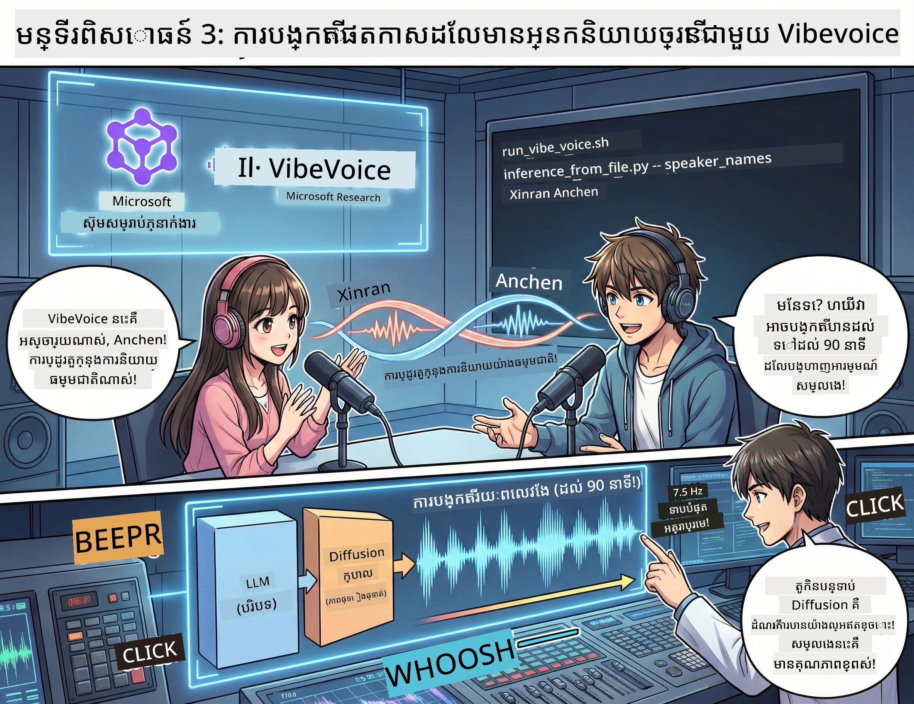

# ធាតុទី 3: ផ្តល់ជីវិតដល់ពិឃាតកាស​​របស់អ្នក 🎤



## ការសម្រួលចុងក្រោយ

អ្នកបានស្រាវជ្រាវប្រធានបទ។ អ្នកបានសរសេរស្ទាត់_SCRIPT។ ឥឡូវសម្រាប់កំពូលដែលមានផ្លែ៖ បម្លែងអត្ថបទរបស់អ្នកទៅជាសម្លេងពិឃាតកាសពិតជាមួយសំលេងដែលស្រដៀងនឹងមនុស្ស!

ណែនាំទៅកាន់ **VibeVoice** — ជា TTS (text-to-speech) មកពី Microsoft Research ដែលបើកចំហរដែលបង្កើត:
- 🎭 សំលេងដូចមនុស្សធម្មតា
- 👥 អ្នកនិយាយច្រើននាក់ (រហូតទៅ 4!)
- ⏱️ សម្លេងរយៈពេលយូរ (រហូតដល់ 90នាទី!)
- 🎵 ការច្រេីនដែលមានអារម្មណ៍ (មិនមែនជាសម្លេងយន្តប្រូប!)

នេះជាបច្ចេកវិទ្យាគ្រប់ក្រោមខាងក្រោយនៃពិឃាតកាសសינתេតិក។ យើងាធ្វើរបស់អ្នកឲ្យបាន!

## VibeVoice គឺអ្វី? (អ្វីដែលគួរឱ្យទាក់ទាញ)

VibeVoice គឺជាអំណោយពី Microsoft Research សម្រាប់សហគមន៍។ វាត្រូវបានរចនាពិសេសសម្រាប់សម្លេងសន្ទនាទម្រង់ពិឃាតកាស។

### ហេតុអ្វីបានជាវាពិសេស 🔥

* **⏱️ សម័យម៉ារ៉ាតុង**: បង្កើតសំលេងប្រកបដោយរហូតដល់ 90 នាទីដោយឈរតែកន្លងតែមួយ (នោះគឺជាព្រឹត្តិការណ៍ពិឃាតកាសពេញមួយភាគ!)
* **👥 តន្ត្រីអ្នកនិយាយច្រើន**: រហូតដល់ 4 សំលេងផ្សេងគ្នាមួយដែលរក្សាភាពវិនិច្ឆ័យខ្លួនឯង
* **⚡ ប្រសិទ្ធភាពខ្លាំង**: ប្រើអត្រាខ្នាតស្រទាប់ទាប 7.5 Hz ដើម្បីសន្សំថាមពលកុំព្យូទ័រ
* **🧠 សម្ភាសន៍ស្វ័យប្រវត្តិ**: ផ្គុំគ្នារវាង LLM (យល់បរិបទ) និងម៉ូដែល diffusion (បង្កើតសំលេងដែលស្រដៀង)
* **🎭 ទំនិញធម្មជាតិ**: ដោះស្រាយការចាប់អារម្មណ៍ច្រេីន, ពេលវេលាឈប់, និងបាញ់ចេញសន្ទនា ដោយស្វ័យប្រវត្តិ

ការបកប្រែ: VibeVoice មិនត្រឹមតែអានស្គ្រីបរបស់អ្នកប៉ុណ្ណោះទេ — វា *ធ្វើការសម្តែង* ដូចមនុស្សពិតៗកំពុងនិយាយ។

---

## មុនពេលអ្នកចាប់ផ្ដើម 🚀

**អ្វីដែលអ្នកត្រូវការ**:

* 🐍 **Python 3.10+** (អ្នកបានមាននេះពី ធាតុទី 1 & 2)
* 🚀 **uv** (កម្មវិធីគ្រប់គ្រងPackage Python លឿន — យើងនឹងតំឡើងវា)
* 📝 **ស្គ្រីបរបស់អ្នក**: ឯកសារ `podcast.txt` ពី Act 2 (នៅក្នុង `../03.Application/`)

**គន្លឹះជំនាញ**: ជំហាននេះត្រូវការតភ្ជាប់អ៊ីនធឺណិតល្អសម្រាប់ទាញយកម៉ូដែលដែលបានហ្វឺងជាមុន។ ចាប់កាហ្វេមួយកែវ! ☕

---

## ចាប់ផ្ដើម! វិធីងាយស្រួល 🎬

យើងបានធ្វើវាឲ្យសាមញ្ញណាស់។ ស្គ្រីប shell មួយធ្វើអ្វីគ្រប់យ៉ាង។

### ដំណើរការ

1. **ធ្វើឲ្យវាអាចដំណើរការ​បាន**:
```bash
chmod +x run_vibe_voice.sh
```

2. **រត់វា**:
```bash
./run_vibe_voice.sh
```

3. **រងចាំការព្យូរពេល** (នេះអាចចំណាយពីរប៉ុន្មាននាទីនៅលើការរត់ដំបូង)

### អ្វីកើតឡើងនៅពីក្រោយឆាក 🎭

ស្គ្រីបគឺដូចជាវិស្វករសម្លេងឯករាជ្យរបស់អ្នក:

1. **📥 ទាញយក VibeVoice**: គូសរចនាសម្ព័ន្ធ repo ផ្លូវការពី GitHub
2. **📦 តំឡើងឧបករណ៍ដែលត្រូវការ**: ប្រើ `uv pip` សម្រាប់ការតំឡើងកញ្ចប់យ៉ាងលឿន
3. **🎬 បង្កើតសម្លេង**: រត់ស្គ្រីប inference ជាមួយ:
   * `--model_path`: ម៉ូដែល VibeVoice-7B ដែលបានហ្វឺងជាមុន
   * `--txt_path`: ស្គ្រីប `podcast.txt` របស់អ្នក
   * `--speaker_names`: ដាក់ឈ្មោះសំលេង (Xinran & Anchen ជាគោលបំណង)

**លទ្ធផល**: ស្គ្រីបរបស់អ្នកក្លាយជាពិឃាតកាសពិតមួយភាគ! 🎉

---

## បេសកកម្មរបស់អ្នក 🎯

យើងធ្វើឱ្យវាពិបាកគួរឱ្យចាប់អារម្មណ៍:

### កិច្ចការ 1: បង្កើតមាតិកា
កែទម្រង់ `../03.Application/podcast.txt` ជាមួយសន្ទនា రะหว่างមនុស្សពីរនាក់។ ធ្វើអោយវាពីស្តីពីបច្ចេកវិទ្យា, ចំណង់ចំណូលចិត្ត, ឬអ្វីដែរ! គ្រាន់តែធ្វើឲ្យវាស៊ូសែនសន្ទនានោះ។

**ឧទាហរណ៍ទ្រង់ទ្រាយ**:
```
Speaker 1: Hey! Did you hear about the new AI model?
Speaker 2: No way! Tell me more!
Speaker 1: It's called...
```

### កិច្ចការ 2: បង្កើតសម្លេង
រត់ស្គ្រីបហើយមើលមន្តសាស្ត្រ។ ដំណើរការដំបូងនឹងចំណាយពេលច្រើនជាងគេ (ទាញយកម៉ូដែល)។

### កិច្ចការ 3: ស្ដាប់ និងវិភាគ
- តើវាស្តាប់ហើយមានអារម្មណ៍ធម្មជាតិទេ?
- តើអ្នកនិយាយមានសំលេងផ្សេងគ្នាទេ?
- តើការផ្លាស់ប្ដូរនិយាយរលូនទេ?
- មានមុនសម័យប្រដាប់យន្តណាមួយទេ?

### កិច្ចការ 4: សាកល្បង (សម្រាប់អ្នកដែលមានចិត្តក្លាហាន)
កែ `run_vibe_voice.sh` និងផ្លាស់ប្ដូរ `--speaker_names` ដើម្បីសាកល្បងការសម្របសម្រួលសំលេងផ្សេងៗ។ VibeVoice មានសំលេងដែលបានហ្វឺងជាមុនជាច្រើន!

**បញ្ហាបូណុស**: សាកល្បងសន្ទនានៅលើអ្នកនិយាយ 3 នាក់! 🎆

---

## រៀនបន្ថែម 📚

* **🏠 ទំព័រដើមគម្រោង**: [VibeVoice Official Site](https://microsoft.github.io/VibeVoice/)
* **🤗 ម៉ូដែលបានហ្វឺងជាមុន**: [Hugging Face - VibeVoice-7B](https://huggingface.co/vibevoice/VibeVoice-7B)
* **📖 អត្ថបទស្រាវជ្រាវ**: ជ្រៀតចូលទៅក្នុងបច្ចេកវិទ្យា (បើអ្នកចាប់អារម្មណ៍)

> **⚠️ ការមិនលេបលាន់ពីបច្ចេកវិទ្យា AI**: VibeVoice មានកម្លាំងខ្លាំង។ សូមប្រើវាដោយមានបាងឬទុកចិត្ត! កុំបង្កើត deepfakes ឬមាតិកាដែលបន្លំ។ បង្កើតអ្វីដែលកម្សាន្តនិងជួយអ្នកផ្សេង។ 🙏

---

## 🏆 អបអរសាទរ! អ្នកបានជោគជ័យ!

អ្នកបានបញ្ចប់ដំណើរពេញលេញ:
1. ✅ **ធាតុ 1**: បង្កើតភ្នាក់ងារ AI ជាមួយឧបករណ៍ផ្ទាល់ខ្លួន
2. ✅ **ធាតុ 2**: អង្គភាពគ្រប់គ្រងការងារជាច្រើនភ្នាក់ងារ
3. ✅ **ធាតុ 3**: បង្កើតសម្លេងពិឃាតកាសពិត

**ឥឡូវនេះអ្នកមាន**:
- ជំនួយការស្រាវជ្រាវ AI ដែលអាចប្រើបាន
- ដំណើរការផលិតពិឃាតកាសពេញលេញ
- ឯកសាសម្លេងពិតដែលអ្នកអាចចែករំលែកបាន

### តើអ្វីទៅបន្ទាប់? 🚀

**ចាប់ផ្ដើមផ្សព្វផ្សាយពិឃាតកាសរបស់អ្នក!**
- ផ្ទុកឡើងទៅវេទិកាពិឃាតកាស
- ចែករំលែកលើបណ្ដាញសង្គម
- បន្តកែសម្រួល និងបង្កើនគុណភាព

**បន្តសាងសង់!**
- សាកល្បងប្រធានបទប្លែកៗ
- សាកល្បងជាមួយអ្នកនិយាយច្រើនជាងនេះ
- បន្ថែមតន្ត្រីផ្ទៃខាងក្រោយ
- បង្កើតចំណុចប្រទាក់គេហទំព័រ
- អូតូម៉ាទ៊ីកអ្វីគ្រប់យ៉ាង

**ចែករំលែកការងាររបស់អ្នក!**
សម្គាល់ពួកយើង! បង្ហាញពិភពលោកអំពីអ្វីដែលអ្នកបានបង្កើត។ ជំនាន់វិវឌ្ឍន៍ពិឃាតកាស AI ចាប់ផ្តើមពីអ្នក។ 🎙️

---

**សំណួរ? យោបល់? រឿងជោគជ័យ?** ដាក់ពួកវាទៅក្នុងជជែកសិក្ខាសាលា!

**ស្វាគមន៍មកកាន់អនាគតនៃការបង្កើតមាតិកា។** 🌟

---

<!-- CO-OP TRANSLATOR DISCLAIMER START -->
**ការមិនទទួលខុសត្រូវ**:
ឯកសារនេះត្រូវបានបកប្រែដោយប្រើសេវាកម្មបកប្រែ AI [Co-op Translator](https://github.com/Azure/co-op-translator)។ ខណៈពេលយើងខិតខំដើម្បីភាពត្រឹមត្រូវ សូមយល់រួចថាការបកប្រែដោយស្វ័យប្រវត្តិអាចមានកំហុស ឬភាពមិនត្រឹមត្រូវ។ ឯកសារដើមក្នុងភាសាដើមគួរត្រូវបានចាត់ទុកថាជាប្រភពដែលអាចទុកចិត្តបាន។ សម្រាប់ព័ត៌មានដែលមានសារៈសំខាន់ យើងផ្តល់អនុសាសន៍ឱ្យប្រើសេវាបកប្រែដោយមនុស្សជាជំនាញ។ ពួកយើងមិនទទួលខុសត្រូវចំពោះការយល់ច្រឡំ ឬការបកស្រាយខុសណាមួយដែលកើតឡើងពីការប្រើប្រាស់បកប្រែនេះទេ។
<!-- CO-OP TRANSLATOR DISCLAIMER END -->