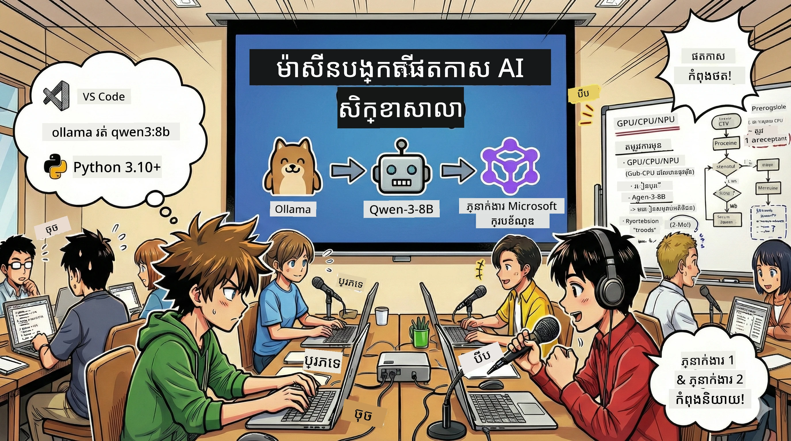

# 🎙️ សិក្ខាសាលា ស្ទូឌីយោ Podcast ដោយ AI



## ភារកិច្ចរបស់អ្នក

សូមស្វាគមន៍មកកាន់ **ស្ទូឌីយោ Podcast ដោយ AI**！អ្នកកំពុងតោះចេញផ្សាយ Podcast ស្តីពីបច្ចេកវិទ្យារបស់អ្នក «未来字节» —— ប៉ុន្តែមានរឿងមួយប្លែកៈ អ្នកនឹងបង្កើតក្រុមផលិតកម្មដែលដឹកនាំដោយ AI ដើម្បីជួយអ្នកបង្កើតវា។ អ្នកមិនចាំបាច់ធ្វើការស្រាវជ្រាវ ជាស្គ្រីប និងកាត់តសម្លេងដោយខ្លួនឯងឯងទៀតទេ។ ផ្ទុយទៅវិញ អ្នកនឹងក្លាយជាអ្នកផលិត Podcast ដែលមានអនុគ្រោះ AI តាមរយៈការសរសេរកូដ។

## បរិបទរឿង

សូមស្រមៃមើល៖ អ្នក និងមិត្តភក្តិចង់ចាប់ផ្តើមកម្មវិធី Podcast ស្តីពីនិន្នាការបច្ចេកវិទ្យាដែលគួរឲ្យចាប់អារម្មណ៍បំផុត ប៉ុន្តែគ្រប់គ្នាត្រូវរវល់ណាស់ជាមួយការសិក្សា ការងារ ឬជីវភាពប្រចាំថ្ងៃ។ ប្រសិនបើអ្នកអាចបង្កើតក្រុមអគ្គិប្រណីត (agents) ដោយ AI ដើម្បីបម្រើការងារដ៏ពិបាកនោះវិញ នឹងដូចម្តេច? អគ្គិប្រណីតមួយធ្វើការស្រាវជ្រាវ ប្រវត្តិទៀតសរសេរស្គ្រីបដែលទាក់ទាញ ហើយមួយផ្សេងទៀតបម្លែងអត្ថបទទៅជាការសន្ទនាដែលមានសំឡេងធម្មជាតិ និងហាប់ឈរ។ មើលទៅដូចរឿងវិទ្យាសាស្ត្ររស់? យើងនាំវាមកជាការពិត។

## អ្វីខ្លះដែលអ្នកនឹងរៀន

នៅចុងសិក្ខាសាលានេះ អ្នកនឹងដឹងពីរបៀប:
- 🤖 ដាក់ដំណើរការគំរូ AI នៅលើម៉ាស៊ីនរបស់អ្នក (គ្មានការចំណាយ API, មិនពឹងផ្អែកលើ cloud!)
- 🔧 សង់អគ្គិប្រណីត AI មុខវិជ្ជាជីវៈដែលអាចសហការកำរងារបាន
- 🎬 បង្កើតដំណើរការផលិត Podcast ពេញលេញ ពីគំនិតទៅសម្លេង

## ការធ្វើដំណើររបស់អ្នក៖ បីឆាក

ដូចជារឿងល្អណាមួយ យើងមានបីឆាក។ រៀងរាល់ឆាកនឹងសាងសង់ស្ទូឌីយោ Podcast ដោយ AI របស់អ្នក ជាជំហានៗ។

| 章节 | 你的任务 | 发生什么 | 解锁技能 |
|---------|-----------|--------------|----------------|
| **ឆាកទី ១** | [ស្គាល់ជំនួយការ AI របស់អ្នក](01.BuildAIAgentWithSLM.md) | អ្នកនឹងបានស្គាល់ពីរបៀបបង្កើតអគ្គិប្រណីតដែលអាចចាំបាច់ភ្លែត ផ្ដើមស្វែងរកបណ្តាញ និងដោះស្រាយបញ្ហា។ គិតពួកវា​ដូចជាអ្នកអនុវត្តស្រាវជ្រាវដែលមិន ever គេង។ | 🎯 សាងសង់អគ្គិប្រណីតដំបូងរបស់អ្នក<br>🛠️ ផ្ដល់អំណាចពិសេស(ឧបករណ៍!)<br>🧠 បង្រៀនវាឲ្យគិត<br>🌐 តភ្ជាប់វាទៅអ៊ីនធឺណិត |
| **ឆាកទី ២** | [បង្កើតក្រុមផលិតកម្មរបស់អ្នក](02.AIAgentOrchestrationAndWorkflows.md) | ឥឡូវរឿងកាន់តែគួរឲ្យចាប់អារម្មណ៍! អ្នកនឹងរៀបចំអគ្គិប្រណីតជាច្រើនឲ្យធ្វើការសហប្រតិបត្តិដូចជាក្រុម Podcast ពិតប្រាកដ។ មួយស្វែងរក, មួយសរសេរ, អ្នកអនុម័ត —— ក្រុមធ្វើការជួយគ្នាឲ្យជោគជ័យ។ | 🎭 សម្របសម្រួលអគ្គិប្រណីតជាច្រើន<br>🔄 សង់លំនើបអនុម័ត<br>🖥️ ប្រើផ្ទាំង DevUI សាកល្បង<br>✋ រក្សាការគ្រប់គ្រងដោយមនុស្ស |
| **ឆាកទី ៣** | [ធ្វើឲ្យ Podcast របស់អ្នកមានជីវិត](03.Multi-SpeakerPodcastGenerationWithVibeVoice.md) | ការស្និទ្ឋស្នាល! បម្លែងស្គ្រីបអត្ថបទរបស់អ្នកទៅជាសម្លេង Podcast ពិតប្រាកដដែលមានសំឡេងស្រដៀងនិងសន្ទនាធម្មជាតិ។ Podcast "未来字节" របស់អ្នកបានរៀបចំសម្រាប់ការបង្ហោះ! | 🎤 វិចិត្រសាស្ត្របម្លែងអត្ថបទទៅសំឡេង<br>👥 សម្លេងមនុស្សច្រើននាក់<br>⏱️ សម្លេងទំហំយូរ<br>🚀 ការជួសជុលស្វ័យប្រវត្តិពេញលេញ |

រៀងរាល់ឆាកនឹងបើកជំនាញថ្មីៗ។ ប្រសិនបើអ្នកក្លាហាន អ្នកអាចលោតមកមើលដោយមិនដាក់លំដាប់ ប៉ុន្តែយើងសូមណែនាំឲ្យរៀនតាមលំដាប់!

## តម្រូវការបរិយាកាស

សិក្ខាសាលានេះគាំទ្រជាមួយបរិក្ខារផ្សេងៗ៖
- **CPU**：សាកសមសម្រាប់ការប្រើប្រាស់សាកល្បង និងការប្រើប្រាស់តូចៗ
- **GPU**：ផ្តល់អនុសាសន៍សម្រាប់បរិស្ថានផលិតកម្ម，អាចបង្កើនល្បឿន推理យ៉ាងច្បាស់
- **NPU**：គាំទ្រការបង្កើនល្បឿនសម្រាប់ឧបករណ៍ប្រើប្រព័ន្ធប្រសាទជំនាន់ក្រោយ

## អ្វីដែលអ្នកត្រូវការ

### បញ្ជីកម្មវិធី ✅
- **Python 3.10+**（ភាសាកម្មវិធីរបស់អ្នក）
- **Ollama**（ដំណើរការគំរូ AI លើម៉ាស៊ីនរបស់អ្នក）
- **VS Code**（កម្មវិធីកែសម្រួលកូដរបស់អ្នក）
- **បន្ថែម Python**（ធ្វើឲ្យ VS Code ខឹងថ្លៃខ្លឹម）
- **Git**（សម្រាប់ទាញយកកូដ）

### សាកល្បងឧបករណ៍ 💻
- **តើខ្ញុំអាចដំណើរការ​បានទេ?**：8GB នៃ RAM，10GB ទំហំទំនេរ（អាចប្រើបាន，但អាចយឺត一些）
- **កំណត់ឧបករណ៍ល្អបំផុត**：16GB+ RAM，一块不错的 GPU（រត់បានរលូន！）
- **មាន NPU មែនទេ?**：那就更好了！解锁下一代性能 🚀

## ដាក់ស្ទូឌីយោរបស់អ្នក 🎬

### ជំហាន 1：អាប់ដេត Python

ធ្វើឲ្យប្រាកដថាអ្នកមាន Python 3.10 或更新版本：

```bash
python --version
# គួរតែបង្ហាញ Python 3.10.x ឬកំណែថ្មីជាងនេះ
```

គ្មាន Python？從 [python.org](https://python.org) 获取——它是免费的！

### ជំហាន 2：ទាញយក Ollama（你的 AI 模型运行器）

前往 [ollama.ai](https://ollama.ai) 下载适合你操作系统的 Ollama。把它想象成在本地运行 AI 模型的引擎。

检查是否准备就绪：

```bash
ollama --version
```

### ជំហាន 3：ទាញយកខួរក្បាល AI របស់អ្នក 🧠

是时候获取 Qwen-3-8B 模型了（就像雇佣你的第一个 AI 助手）：

```bash
ollama pull qwen3:8b
```

*នេះអាច需要几分钟。完美的咖啡时间！☕*

### ជំហាន 4：តម្លើង VS Code

如果你还没有，获取 [Visual Studio Code](https://code.visualstudio.com/)。这是最好的代码编辑器（不服来辩 😄）。

### ជំហាន 5：បន្ថែម Python

在 VS Code 中：
1. 按 `Ctrl+Shift+X`（Mac 上是 `Cmd+Shift+X`）
2. 搜索 "Python"
3. 安装官方的 Microsoft Python 扩展

### ជំហាន 6：大功告成！🎉

说真的，你准备好了。让我们构建一些 AI 魔法吧！

### ជំហាន 7：តម្លើង Microsoft Agent Framework 和相关包 📦

安装工作坊所需的所有依赖项：

```bash
pip install -r ./Installations/requirements.txt -U
```

*这将安装 Microsoft Agent Framework 和所有必要的包。喝杯咖啡吧 —— 首次安装可能需要几分钟！☕*

## ការណែនាំសិក្ខាសាលា

详细的项目结构、配置步骤和执行方法将在工作坊期间逐步讲解。

## ការជួយដោះស្រាយបញ្ហា（当事情出错时）🔧

### "អូ... ការទាញគំរូយឺតពេក！"
**解决方案**：使用 VPN 或配置 Ollama 镜像源。有时候网络就是不给力。

### "我的电脑快挂了！内存不足！"
**解决方案**：切换到更小的模型或调整 `num_ctx` 设置以使用更少内存。把它想象成给你的 AI 节食。

### "我能用 GPU 让它更快吗？"
**解决方案**：Ollama 会自动检测 GPU！只需确保你的 GPU 驱动是最新的。免费的速度提升！🏎️

## 额外资源（给好奇的你）📚

- [Ollama 文档](https://github.com/ollama/ollama) —— 深入了解本地 AI 模型
- [Microsoft Agent Framework](https://microsoft.github.io/autogen/) —— 了解更多关于构建智能体团队
- [Qwen 模型信息](https://qwenlm.github.io/) —— 认识你的 AI 助手的大脑

## អាជ្ញាប័ណ្ណ

MIT 许可证 —— 构建酷东西，分享它，让世界更美好！🌍

## 想要贡献？

发现了 bug？有想法？提交 Issue 或 PR！我们喜欢社区氛围。✨

---

<!-- CO-OP TRANSLATOR DISCLAIMER START -->
**Disclaimer**:
ឯកសារនេះត្រូវបានបកប្រែដោយប្រើសេវាកម្មបកប្រែ AI [Co-op Translator](https://github.com/Azure/co-op-translator)។ ខណៈពេលដែលយើងខិតខំស្វែងរកភាពត្រឹមត្រូវ សូមយកចិត្តទុកដាក់ថាការបកប្រែដោយស្វ័យប្រវត្តិអាចមានកំហុស ឬភាពមិនត្រឹមត្រូវ។ ឯកសារដើមក្នុងភាសាម្ចាស់គួរត្រូវបានចាត់ទុកថាជាប្រភពដែលទុកចិត្តបាន។ សម្រាប់ព័ត៌មានសំខាន់ៗ យើងសូមផ្តល់អនុសាសន៍ឱ្យប្រើការបកប្រែដោយអ្នកជំនាញមនុស្ស។ យើងមិនទទួលខុសត្រូវចំពោះការយល់ច្រឡំ ឬការបកស្រាយខុសណាមួយដែលកើតឡើងពីការប្រើប្រាស់ការបកប្រែនេះ។
<!-- CO-OP TRANSLATOR DISCLAIMER END -->