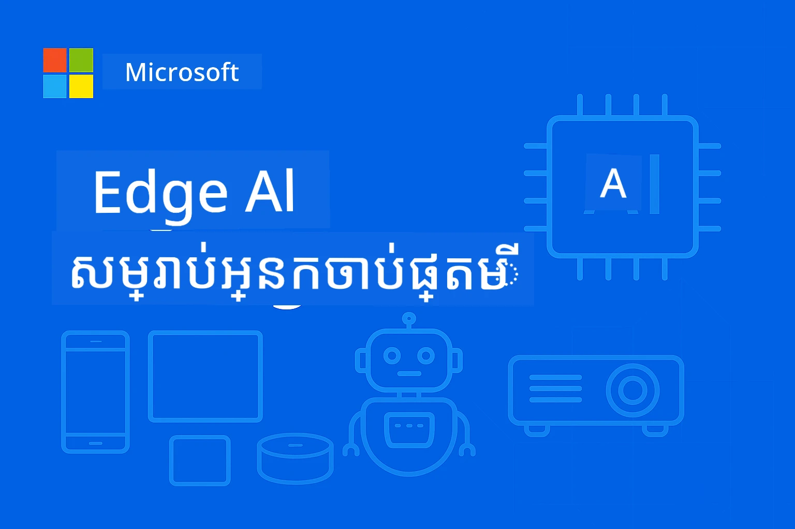

# សំណើមុខសម្រាប់ Edge AI សម្រាប់អ្នកចាប់ផ្តើម



សូមស្វាគមន៍មកកាន់ដំណើររបស់អ្នកទៅកាន់ **បញ្ញាសិប្បនិម្មិតមុខខ្នាត** – មធ្យោបាយបំភ្លឺយ៉ាងក្លាហានដែលនាំសមត្ថភាព AI ចូលបន្ទាន់ទៅកន្លែងដែលទិន្នន័យត្រូវបានបង្កើត និងត្រូវមានការសម្រេចចិត្ត។ សំណើមុខនេះនឹងបង្កើតមូលដ្ឋានសម្រាប់ការយល់ដឹងពីហេតុផលដែល Edge AI តំណាងឱ្យអនាគតនៃការគណនា​ឆ្លាតវៃ និងរបៀបដែលអ្នកអាចស្ទាត់ជំនាញក្នុងការអនុវត្តវា។

## Edge AI ជាអ្វី?

Edge AI តំណាងឱ្យការប្រែប្រួលមួយចម្បងពីកា្រគណនាទិន្នន័យ AI នៅលើពពកទៅជាបញ្ញាស្ថិតនៅលើឧបករណ៍ **នៅតំបន់ក្នុងឧបករណ៍**។ ជំនួសការផ្ញើទិន្នន័យទៅម៉ាស៊ីនបម្រើឆ្ងាយ Edge AI គ្រប់គ្រងព័ត៌មានដោយផ្ទាល់លើឧបករណ៍មុខខ្នាត – ទូរសព្ទដៃ, ឧបករណ៍ចាប់សញ្ញា IoT, ឧបករណ៍ឧស្សាហកម្ម, ឡានបើកដោយខ្លួនឯង និងប្រព័ន្ធភ្ជាប់នៅក្នុង។

### ទ្រឹស្តី Edge AI

```
Traditional AI:     Device → Cloud → Processing → Response → Device
Edge AI:           Device → Local Processing → Immediate Response
```

ការប្រែប្រួលនេះលុបចោលចំណាយពេលបញ្ជូនទៅពពក អនុញ្ញាតឱ្យមាន៖  
- **ចម្លើយទាន់ពេលវេលា** (ការ​ពន្យាពេលក្រោមមីល្លីវិនាទី)  
- **ភាពឯកជនកាន់តែខ្ពស់** (ទិន្នន័យមិនដែលចេញពីឧបករណ៍)  
- **ប្រតិបត្តិការទុកចិត្តបាន** (ដំណើរការបានដោយគ្មានអ៊ិនធឺរណែត)  
- **ហិរញ្ញវត្ថុកាត់បន្ថយ** (គ្មានការប្រើប្រាស់បណ្តាញ និងកម្រិតកុំព្យូទ័រពពកតិច)  

## ហេតុអ្វីបានជាពេលនេះ Edge AI មានសារៈសំខាន់

### ព្យុះខ្យល់ល្អបំផុតនៃការបង្កើតថ្មី

បច្ចេកវិទ្យាបីខ្នាតបានរួមបញ្ចូលគ្នាធ្វើឱ្យ Edge AI មិនត្រឹមតែក្នុងចំណោមមនុស្សបានទេ ប៉ុន្តែនៅកន្លែងដ៏សំខាន់៖

1. **វិវឌ្ឍន៍របស់ឧបករណ៍ការផលិត**: ចិបដែលទំនើប (Apple Silicon, Qualcomm Snapdragon, NVIDIA Jetson) បានដំណើរការ AI ក្នុងកញ្ចប់តូចនិងប្រើថាមពលល្អ  
2. **បំប៉នម៉ូឌែល**: ម៉ូឌែលភាសាស្រាល (SLMs) ដូចជា Phi-4, Gemma និង Mistral ផ្តល់សមត្ថភាព ៨០-៩០% នៃម៉ូឌែលធំ ក្នុងទំហំតិចតួច ១០-២០%  
3. **តម្រូវការពិភពអស៊ីវៈ**: អាជីវកម្មត្រូវការបញ្ញា AI ដែលទាន់ពេលវេលា ប្រកបដោយភាពឯកជន និងទុកចិត្តបាន ក្នុងនោះមិនអាចទទួលបានពីពពកបានទេ  

### ចំណុចបណ្ដាលពាណិជ្ជកម្មសំខាន់

**ភាពឯកជន និងការអនុវត្ត​តាម​ច្បាប់**  
- សុខាភិបាល៖ ទិន្នន័យអ្នកជំងឺត្រូវនៅលើកន្លែង (ការអនុវត្ត HIPAA)  
- ហិរញ្ញវត្ថុ៖ ការប្រតិបត្តិការទាមទារតំរូវឱ្យទិន្នន័យនៅក្នុងតំបន់ដែលកំណត់  
- ផលិតកម្ម៖ ដំណើរការផ្ទាល់ខ្លួនត្រូវការការពារពីការបង្ហាញ  

**តម្រូវការសមត្ថភាព**  
- ឡានបើកដោយខ្លួនឯង៖ ការសម្រេចចិត្តជីវិតសំខាន់ក្នុងម៉ីលីវិនាទី  
- ស្វ័យប្រវត្តិក្នុងឧស្សាហកម្ម៖ គ្រប់គ្រងគុណភាព និងត្រួតពិនិត្យសុវត្ថិភាពពេលវេលាពិត  
- ល្បែង និង AR/VR៖ បទពិសោធន៍ដែលចាំបាច់មិនមានការពន្យាពេលអាចចាប់អារម្មណ៍បាន  

**ប្រសិទ្ធភាពសេដ្ឋកិច្ច**  
- ទូរគមនាគមន៍៖ ការបញ្ចូលការស្កេនឧបករណ៍ IoT ទឹកប្រាក់រាប់លានត្រីលានក្នុងតំបន់  
- លក់រាយ៖ វិភាគក្នុងហាងដោយគ្មានថ្លៃបណ្តាញធំ  
- ក្រុងវៃឆ្លាត៖ បញ្ញាវែងលើឧបករណ៍រាប់ពាន់កន្លែង  

## ឧស្សាហកម្មដែលទទួលការផ្លាស់ប្តូរដោយ Edge AI

### 🏭 **ផលិតកម្ម និងឧស្សាហកម្ម 4.0**  
- **ការថែទាំទស្សន៍ទាយ**៖ ម៉ូឌែល AI លើឧបករណ៍ឧស្សាហកម្មទស្សន៍ទាយការខូចខាតមុនពេលវាលេចឡើង  
- **គ្រប់គ្រងគុណភាព**៖ ការរកព្រិលកំហុសពេលវេលាពិតលើខ្សែផលិត  
- **ត្រួតពិនិត្យសុវត្ថិភាព**៖ ការរកឃើញគ្រោះថ្នាក់និងឆ្លើយតបភ្លាមៗ  
- **សង្ស័យប្រព័ន្ធផ្គត់ផ្គង់**៖ គ្រប់គ្រងសារពើភ័ណ្ឌឆ្លាតវៃនៅគ្រប់ចំណុច  

**ទំព័រពិតប្រាកដ**៖ Siemens ប្រើ Edge AI សម្រាប់ការថែទាំទស្សន៍ទាយ កាត់បន្ថយពេលឈប់សម្រាកដោយ ៣០-៥០% និងថ្លៃថែទាំជាន់ខ្ពស់ដោយ ២៥%។

### 🏥 **សុខាភិបាល និងឧបករណ៍វេជ្ជសាស្ត្រ**  
- **រូបភាពវិនិច្ឆ័យ**៖ វិភាគតាម AI សំរាប់ X-ray និង MRI នៅកន្លែងព្យាបាល  
- **ត្រួតពិនិត្យអ្នកជំងឹក**៖ ការវាយតម្លៃសុខភាពបន្តដោយឧបករណ៍ស្លៀកពាក់  
- **ជំនួយប្រតិបត្ដិការ**៖ ជំនួយបន្ទាន់ពេលធ្វើបញ្ហារ  
- **ការស្រាវជ្រាវថ្នាំ**៖ ការគ្រប់គ្រងការប្រមូលផលម៉ូលេគុលដោយផ្ទាល់  

**ទំព័រពិតប្រាកដ**៖ ដំណោះស្រាយ Edge AI របស់ Philips អាចអនុញ្ញាតឱ្យគ្រូពេទ្យវិភាគការរីករាលដាលជម្ងឺបានរហូតដល់ ៤០% លឿនក្នុងពេលដែលរក្សាទំហំនៃការពិតបាន ៩៩%។

### 🚗 **ប្រព័ន្ធបើកបរដោយខ្លួនឯង និងដឹកជញ្ជូន**  
- **ឡានបើកដោយខ្លួនឯង**៖ ការសម្រេចចិត្តឆាប់រហ័ស​សម្រាប់ការរុករក និងសុវត្ថិភាព  
- **គ្រប់គ្រងចរាចរណ៍**៖ ការត្រួតពិនិត្យចំណុចចិញ្ចើមឆ្លាតវៃ និងបង្រួមចរាចរណ៍  
- **ប្រតិបត្តិការដំណើរការ​ក្រុមឡាន**៖ ការតម្រៀបផ្លូវ និងត្រួតពិនិត្យសុខភាពឡាន  
- **ល Loិចស្ទិច**៖ រូបមន្តរោងចក្រដំណើរការ និងប្រព័ន្ធដឹកជញ្ជូនដោយខ្លួនឯង  

**ទំព័រពិតប្រាកដ**៖ ប្រព័ន្ធ Full Self-Driving របស់ Tesla ប្រមូលសញ្ញាតែលើកន្លែង ដំណើរការសម្រេចចិត្ត ៤០+ ដុំក្នុងមួយវិនាទីសម្រាប់ការបើកបរដោយខ្លួនឯងមានសុវត្ថិភាព។

### 🏙️ **ក្រុងវៃឆ្លាត និងហិរញ្ញវត្ថុ**  
- **សុវត្ថិភាពសាធារណៈ**៖ ការរកឃើញគ្រោះមហន្តរាយ និងការឆ្លើយតបបន្ទាន់  
- **គ្រប់គ្រងថាមពល**៖ ការបង្រួមបណ្តាញចេតុង និងការរួមបញ្ចូលថាមពលធ្វើឡើងវិញ  
- **ត្រួតពិនិត្យបរិស្ថាន**៖ គុណភាពខ្យល់, កំហាប់សំឡេង និងតាមដានអាកាសធាតុ  
- **ការរៀបចំទីក្រុង**៖ វិភាគចរាចរណ៍ និងបង្រួមឧស្ម័នសំណង់  

**ទំព័រពិតប្រាកដ**៖ ខេត្តសិង្ហបុរីប្រើក្រុមឧបករណ៍ Edge AI ជាង ១០០,០០០ សំរាប់គ្រប់គ្រងចរាចរណ៍ កាត់បន្ថយពេលជិះឡើង ២៥%។

### 📱 **បច្ចេកវិទ្យាអ្នកប្រើ និងទូរសព្ទដៃ**  
- **AI ទូរស័ព្ទដៃ**៖ ការថតរូបកាន់តែប្រសើរ, ជំនួយផ្ដល់សំឡេង និងការប្តូរផ្ទាល់ខ្លួន  
- **ផ្ទះឆ្លាត**៖ ស្វ័យប្រវត្តិកម្ម និងប្រព័ន្ធសុវត្ថិភាព  
- **ឧបករណ៍ពាក់**៖ ត្រួតពិនិត្យសុខភាព និងបង្កើតទម្រង់អាយុចល័ត  
- **ល្បែង**៖ ការកែលម្អក្រាហ្វិកពេលវេលាពិត និងការអភិវឌ្ឍល្បែង  

**ទំព័រពិតប្រាកដ**៖ ម៉ាស៊ីន Neural Engine របស់ Apple ដំណើរការ ១៥.៨ ព្រៀលលានប្រតិបត្តិការក្នុងមួយវិនាទី ក្នុងតំបន់ ផ្តល់ជម្រើសដូចជា ការប្រែភាសាពេលវេលាពិត និងថតរូបកុំព្យូទ័រ។

## ម៉ូឌែលភាសាស្រាល៖ ម៉ាស៊ីនបញ្ជាថាមពលរបស់ Edge AI

### ម៉ូឌែលភាសាស្រាល (SLMs) ជាអ្វី?

SLMs គឺជា **ម៉ូឌែលដែលបានកាតថ្មង បំប៉ន និងត្រូវបានរចនាសម្រាប់ការផ្សព្វផ្សាយនៅលើកន្លែងខ្នាត**៖

- **Phi-4**: 14B ប៉ារ៉ាម៉ែត្រ, បំប៉នសម្រាប់សេចក្ដីថ្លែង និងបង្កើតកូដ  
- **Gemma 2B/7B**: ម៉ូឌែលប្រសិទ្ធភាពរបស់ Google សម្រាប់ភារកិច្ច NLP ចម្រុះ  
- **Mistral-7B**: ម៉ូឌែលម៉ាស៊ីនមានសមត្ថភាពខ្ពស់និងអាចប្រើសិទ្ធិជាអាជីវកម្ម  
- **Qwen Series**: ម៉ូឌែលភាសាតម្រួតម្ហោងរបស់ Alibaba ដែលមានភាពសមស្របសម្រាប់ការផ្សព្វផ្សាយលើទូរសព្ទដៃ  

### ខុសត្រូវរបស់ SLM

| សមត្ថភាព | ម៉ូឌែលភាសាធំ | ម៉ូឌែលភាសាស្រាល |
|------------|-----------------|-------------------|
| **ទំហំ** | 70B-405B ប៉ារ៉ាម៉ែត្រ | 1B-14B ប៉ារ៉ាម៉ែត្រ |
| **ចងចាំ** | 40-200GB RAM | 2-16GB RAM |
| **ល្បឿនចេញលទ្ធផល** | 2-10 វិនាទី | 50-500 មិល្លីវិនាទី |
| **ការប្រើប្រាស់** | ម៉ាស៊ីនបម្រើកម្រិតខ្ពស់ | ទូរសព្ទដៃ, ឧបករណ៍ភ្ជាប់ |
| **ថ្លៃដើម** | $1000s / ខែ | ថ្លៃឧបករណ៍មួយដង |
| **ភាពឯកជន** | ទិន្នន័យផ្ញើទៅពពក | ការបញ្ចូលដំណើរការនៅតំបន់ |

### ការសាកល្បងគុណភាពបច្ចុប្បន្ន

SLMs ថ្មីៗបង្ហាញសមត្ថភាពអស្ចារ្យ៖  
- **៩០% នៃសមត្ថភាព GPT-3.5** នៅច្រើនភារកិច្ច  
- **ការពិភាក្សាពេលវេលាពិត**  
- **បង្កើតកូដ និងកែប្រែបញ្ហា**  
- **បកប្រែភាសាច្រើន**  
- **វិភាគឯកសារ និងសេចក្ដីសង្ខេប**  

## គោលបំណងសិក្សា

ដោយបញ្ចប់វគ្គ EdgeAI សម្រាប់អ្នកចាប់ផ្តើមនេះ អ្នកនឹងអាច៖

### 🎯 **ចំណេះដឹងមូលដ្ឋាន**  
- យល់ដឹងពីមូលហេតុបច្ចេកទេស និងពាណិជ្ជកម្មនៅក្រោយការអនុម័ត Edge AI  
- ប្រៀបធៀបរចនាសម្ព័ន្ធ edge និង cloud AI និងករណីប្រើប្រាស់សមស្រប  
- កំណត់លក្ខណៈសម្បត្តិ និងសមត្ថភាពនៃគ្រួសារម៉ូឌែល SLMs ផ្សេងៗ  
- វិភាគតំរូវការថាមពលសម្រាប់ធ្វើ edge AI  

### 🛠️ **ជំនាញបច្ចេកទេស**  
- ប្រើប្រាស់ SLMs លើវេទិកាជាច្រើន (Windows, ទូរសព្ទដៃ, ឧបករណ៍ភ្ជាប់, cloud-edge hybrid)  
- បំប៉នម៉ូឌែលសម្រាប់កំណត់ edge ដោយប្រើការតម្លាភាព, ការព្រីន និងកាត់បន្ថយ  
- អនុវត្តកម្មវិធី Edge AI ដើម្បីផលិតជាមួយការត្រួតពិនិត្យ និងបង្រួម  
- បង្កើត​ប្រព័ន្ធភ្នាក់ងារច្រើន និងស៊ុមហៅមុខងារ​សម្រាប់workflow ស្មុគស្មាញ  

### 🏗️ **អនុវត្តផ្នែកជាក់ស្តែង**  
- បង្កើតកម្មវិធីជជែកជាមួយការប្តូរម៉ូឌែលក្នុងកន្លែង និងការគ្រប់គ្រងការសន្ទនា  
- អភិវឌ្ឍប្រព័ន្ធ RAG (Retrieval-Augmented Generation) ជាមួយការដំណើរការឯកសារក្នុងតំបន់  
- បង្កើតម៉ូឌែលរុទ័រដែលជ្រើសរើសម៉ូឌែល AI ជាក់លាក់ដោយឆ្លាតវៃ  
- រចនាស៊ុម API ដោយមានការចាក់បញ្ចូលស្ទ្រីម, ត្រួតពិនិត្យសុខភាព និងដោះស្រាយកំហុស  

### 🚀 **ការអនុវត្តក្នុងផលិតកម្ម**  
- បង្កើតបណ្ដាញ SLMOps សម្រាប់ការប្រើប្រាស់ម៉ូឌែល, សាកល្បង និងដាក់បញ្ចូល  
- អនុវត្តន៍វិធានការ​សុវត្ថិក្នុងកម្មវិធី Edge AI  
- រចនាគ្រឹះស្ថានដែលអាចបង្រួមឡើងបានចម្រុះរវាង edge និង cloud  
- បង្កើតយុទ្ធសាស្រ្តត្រួតពិនិត្យ និងថែទាំប្រព័ន្ធ Edge AI ផលិតកម្ម  

## លទ្ធផលការសិក្សា

បន្ទាប់ពីបញ្ចប់វគ្គ អ្នកនឹងមានសមត្ថភាព៖

### **ជំនាញ​បច្ចេកទេស**  
✅ **ដាក់អនុវត្តន៍ដំណោះស្រាយ Edge AI សម្រាប់ផលិតកម្ម** លើកន្លែង Windows, ទូរសព្ទដៃ និងឧបករណ៍ភ្ជាប់  
✅ **បំប៉នម៉ូឌែល AI សម្រាប់កំណត់ edge** អាចកាត់បន្ថយទំហំ ៧៥% និងរក្សាទុកការសម្តែងបាន ៨៥%  
✅ **បង្កើតប្រព័ន្ធភ្នាក់ងារឆ្លាត​ៗ** ពីការហៅមុខងារ និងកំណត់ការ​អធិប្បាយម៉ូឌែលច្រើន  
✅ **រចនាស្ថាបត្យកម្ម edge-cloud hybrid ដែលអាចបង្រួម** សម្រាប់កម្មវិធី​ក្រុមហ៊ុន  

### **ការអនុវត្តឧស្សាហកម្ម**  
✅ **រចនាដំណោះស្រាយផលិតកម្ម** សម្រាប់ការថែទាំទស្សន៍ទាយ និងគ្រប់គ្រងគុណភាព  
✅ **អភិវឌ្ឍកម្មវិធីសុខាភិបាល** ជាមួយការការពារ​ទិន្នន័យអ្នកជំងឺ  
✅ **បង្កើតប្រព័ន្ធរថយន្ដ** សម្រាប់សម្រេចចិត្តពេលវេលាពិត និងសុវត្ថិភាព  
✅ **បង្កើតហេរកស្ថានក្រុងឆ្លាតវៃ** សម្រាប់ចរាចរណ៍ សុវត្ថិភាព និងត្រួតពិនិត្យបរិស្ថាន  

### **ការរីកចម្រើនមុខរបរ**  
✅ **អ្នករចនាដំណោះស្រាយ EdgeAI**៖ រចនាយុទ្ធសាស្រ្ត Edge AI ទូលំទូលាយ  
✅ **វិស្វករម៉ាស៊ីនរៀន (ជំនាញ Edge)**៖ បំប៉ន និងដាក់អនុវត្តម៉ូឌែលសម្រាប់បរិស្ថាន edge  
✅ **អ្នកអភិវឌ្ឍ IoT AI**៖ បង្កើតប្រព័ន្ធ IoT ឆ្លាតវៃដោយមានដំណើរការបច្ចុប្បន្នក្នុងតំបន់  
✅ **អ្នកអភិវឌ្ឍ AI លើទូរសព្ទដៃ**៖ បង្កើតកម្មវិធីធ្វើ AI ដំណើរការផ្ទាល់ក្នុងទូរសព្ទដៃ  

## រចនាសម្ព័ន្ធវគ្គសិក្សា

វគ្គនេះអនុវត្តតាមវិធីសាស្រ្ត **រីកចម្រើនជាលំដាប់**៖

### **ជំហាន ១៖ មូលដ្ឋាន** (ម៉ូឌុល ០១-០២)  
បង្កើតការយល់ដឹង និងស្វែងរកគ្រួសារម៉ូឌែល  

### **ជំហាន ២៖ អនុវត្ត** (ម៉ូឌុល ០៣-០៤)  
ស្ទាត់ជំនាញក្នុងការដាក់អនុវត្ត និងកែប្រែ  

### **ជំហាន ៣៖ ផលិតកម្ម** (ម៉ូឌុល ០៥-០៦)  
ស្វែងយល់ SLMOps និងស៊ុមភ្នាក់ងារកម្រិតខ្ពស់  

### **ជំហាន ៤៖ ជំនាញជំនួញ** (ម៉ូឌុល ០៧-០៨)  
អនុវត្តលើវេទិកា និងគំរូគ្រប់គ្រាន់  

## វិចិត្រសមត្ថភាពជោគជ័យ

តាមដានការរីកចម្រើនរបស់អ្នកជាមួយលទ្ធផលនេះ៖

- **គម្រោងផ្ទាល់ខ្លួន**៖ ១០+ កម្មវិធីរួមបញ្ចូលផលិតកម្មគ្រប់ឧស្សាហកម្ម  
- **សន្ទូចទិន្នន័យសមត្ថភាព**៖ ម៉ូឌែលដំណើរការលឿនក្រោម ៥០០ មិល្លីវិនាទី  
- **គោលដៅដាក់ពង្រីក**៖ កម្មវិធីដំណើរការលើ Windows, ទូរសព្ទដៃ និងឧបករណ៍ភ្ជាប់  
- **ភាពរួមចំណែកសម្រាប់ក្រុមហ៊ុន**៖ ដំណោះស្រាយមានការត្រួតពិនិត្យ ការបង្រួម និងសុវត្ថិភាព  

## ការចាប់ផ្តើម

ភ្លឺទៅក្នុងការបំលែងការយល់ដឹងរបស់អ្នកអំពីការដាក់អនុវត្ត AI? ដំណើររបស់អ្នកចាប់ផ្តើមជាមួយ **[Module 01: EdgeAI Fundamentals](./Module01/README.md)** ដែលអ្នកនឹងស្វែងយល់ពីមូលដ្ឋានបច្ចេកទេសដែលធ្វើឱ្យ Edge AI អាចប្រើបាន និងពិនិត្យករណីសិក្សាពីអ្នកដឹកនាំឧស្សាហកម្ម។

**ជំហានបន្ទាប់**: [📚 Module 01 - EdgeAI Fundamentals →](./Module01/README.md)

---

**អនាគត AI គឺនៅតំបន់ ជាបន្ទាន់ និងមានភាពឯកជន។ ស្ទាត់ជំនាញ Edge AI ដើម្បីបង្កើតកម្មវិធីឆ្លាតវៃជំនាន់ក្រោយ។**

---

<!-- CO-OP TRANSLATOR DISCLAIMER START -->
**ការបដិសេធ**៖  
ឯកសារនេះត្រូវបានបកប្រែដោយប្រើសេវាកម្មបកប្រែ AI [Co-op Translator](https://github.com/Azure/co-op-translator)។ ខណៈដែលយើងខិតខំរកសុពលភាព ក៏សូមយកចិត្តទុកដាក់ថាការបកប្រែដោយស្វ័យប្រវត្តិសកម្មអាចមានកំហុស ឬភាពមិនត្រឹមត្រូវ។ ឯកសារដើមក្នុងភាសាតំណើបរាជ័យ គួរត្រូវបានគេពិចារណាទៅជាមូលដ្ឋានដែលមានអំណាច។ សម្រាប់ព័ត៌មានសំខាន់ៗ សូមផ្ដល់អនុសាសន៍ការបកប្រែដោយអ្នកជំនាញមនុស្ស។ យើងមិនទទួលខុសត្រូវចំពោះការយល់ច្រឡំ ឬការបកស្រាយខុសបាកបញ្ជាក់ពីការប្រើប្រាស់ការបកប្រែនេះឡើយ។
<!-- CO-OP TRANSLATOR DISCLAIMER END -->