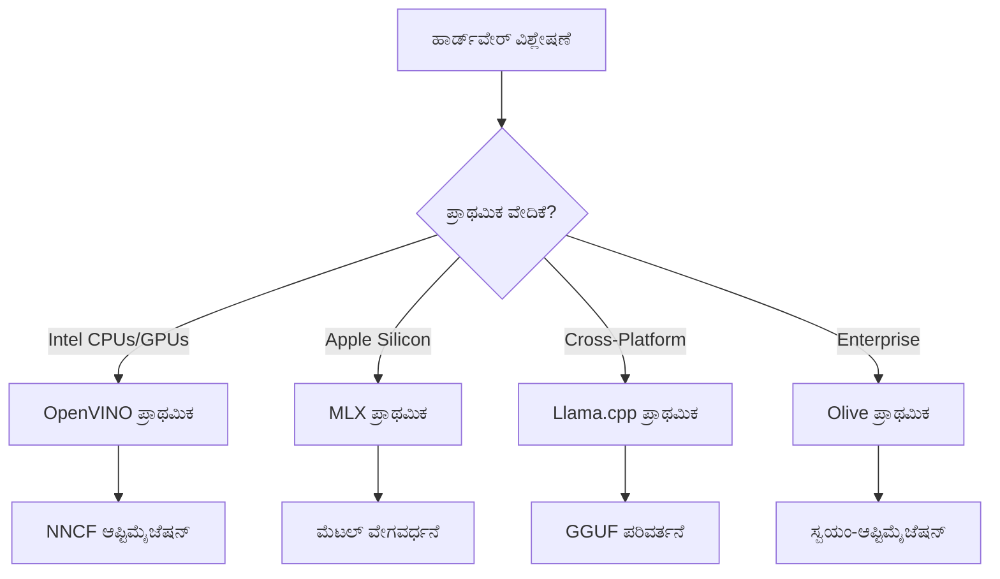
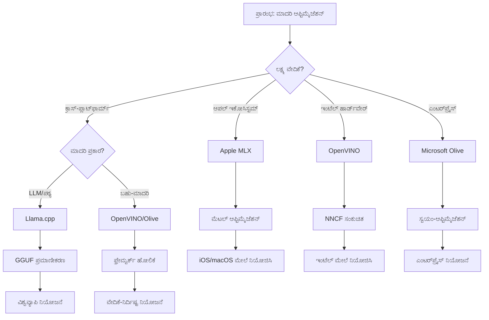
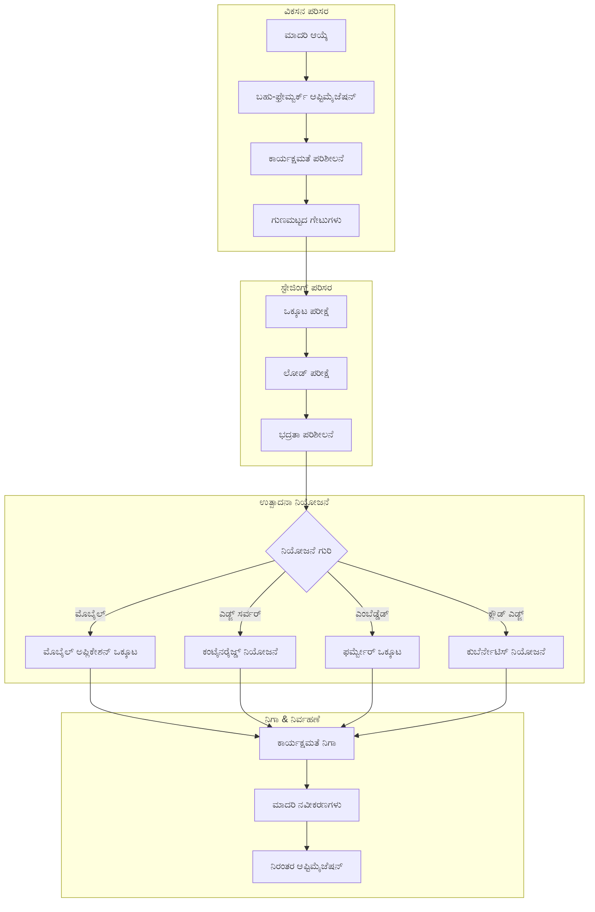

<!--
CO_OP_TRANSLATOR_METADATA:
{
  "original_hash": "6fbccc3e9d5911e3df32090724daac13",
  "translation_date": "2025-12-15T23:48:23+00:00",
  "source_file": "Module04/06.workflow-synthesis.md",
  "language_code": "kn"
}
-->
# ವಿಭಾಗ 6: ಎಡ್ಜ್ AI ಅಭಿವೃದ್ಧಿ ಕಾರ್ಯಪ್ರವಾಹ ಸಂಶ್ಲೇಷಣೆ

## ವಿಷಯಗಳ ಪಟ್ಟಿಯು
1. [ಪರಿಚಯ](../../../Module04)
2. [ಕಲಿಕೆಯ ಉದ್ದೇಶಗಳು](../../../Module04)
3. [ಒಕ್ಕೂಟ ಕಾರ್ಯಪ್ರವಾಹ ಅವಲೋಕನ](../../../Module04)
4. [ಫ್ರೇಮ್ವರ್ಕ್ ಆಯ್ಕೆ ಮ್ಯಾಟ್ರಿಕ್ಸ್](../../../Module04)
5. [ಉತ್ತಮ ಅಭ್ಯಾಸಗಳ ಸಂಶ್ಲೇಷಣೆ](../../../Module04)
6. [ನಿಯೋಜನೆ ತಂತ್ರಜ್ಞಾನ ಮಾರ್ಗದರ್ಶಿ](../../../Module04)
7. [ಕಾರ್ಯಕ್ಷಮತೆ ಆಪ್ಟಿಮೈಜೆಷನ್ ಕಾರ್ಯಪ್ರವಾಹ](../../../Module04)
8. [ಉತ್ಪಾದನಾ ಸಿದ್ಧತೆ ಪರಿಶೀಲನಾ ಪಟ್ಟಿ](../../../Module04)
9. [ಸಮಸ್ಯೆ ಪರಿಹಾರ ಮತ್ತು ಮೇಲ್ವಿಚಾರಣೆ](../../../Module04)
10. [ನಿಮ್ಮ ಎಡ್ಜ್ AI ಪೈಪ್ಲೈನ್ ಭವಿಷ್ಯ-ರಕ್ಷಣೆ](../../../Module04)

## ಪರಿಚಯ

ಎಡ್ಜ್ AI ಅಭಿವೃದ್ಧಿಗೆ ಅನೇಕ ಆಪ್ಟಿಮೈಜೆಷನ್ ಫ್ರೇಮ್ವರ್ಕ್‌ಗಳು, ನಿಯೋಜನೆ ತಂತ್ರಗಳು ಮತ್ತು ಹಾರ್ಡ್‌ವೇರ್ ಪರಿಗಣನೆಗಳ ಬಗ್ಗೆ ಸೂಕ್ಷ್ಮ ಜ್ಞಾನ ಅಗತ್ಯವಿದೆ. ಈ ಸಮಗ್ರ ಸಂಶ್ಲೇಷಣೆ Llama.cpp, Microsoft Olive, OpenVINO ಮತ್ತು Apple MLX ನಿಂದ ಜ್ಞಾನವನ್ನು ಒಟ್ಟುಗೂಡಿಸಿ, ಕಾರ್ಯಕ್ಷಮತೆಯನ್ನು ಗರಿಷ್ಠಗೊಳಿಸುವ, ಗುಣಮಟ್ಟವನ್ನು ಕಾಪಾಡುವ ಮತ್ತು ಯಶಸ್ವಿ ಉತ್ಪಾದನಾ ನಿಯೋಜನೆಯನ್ನು ಖಚಿತಪಡಿಸುವ ಒಕ್ಕೂಟ ಕಾರ್ಯಪ್ರವಾಹವನ್ನು ರಚಿಸುತ್ತದೆ.

ಈ ಕೋರ್ಸ್‌ನಲ್ಲಿ ನಾವು ಪ್ರತ್ಯೇಕ ಆಪ್ಟಿಮೈಜೆಷನ್ ಫ್ರೇಮ್ವರ್ಕ್‌ಗಳನ್ನು ಅನ್ವೇಷಿಸಿದ್ದೇವೆ, ಪ್ರತಿಯೊಂದು ತನ್ನದೇ ಆದ ಶಕ್ತಿಗಳು ಮತ್ತು ವಿಶೇಷ ಬಳಕೆ ಪ್ರಕರಣಗಳೊಂದಿಗೆ. ಆದಾಗ್ಯೂ, ನೈಜ ಜಗತ್ತಿನ ಎಡ್ಜ್ AI ಯೋಜನೆಗಳು ಬಹು ಫ್ರೇಮ್ವರ್ಕ್‌ಗಳಿಂದ ತಂತ್ರಗಳನ್ನು ಸಂಯೋಜಿಸುವುದು ಅಥವಾ ನಿರ್ದಿಷ್ಟ ನಿರ್ಬಂಧಗಳು ಮತ್ತು ಅಗತ್ಯಗಳಿಗೆ ಉತ್ತಮ ಫಲಿತಾಂಶ ನೀಡುವ ವಿಧಾನವನ್ನು ತೀರ್ಮಾನಿಸುವ ತಂತ್ರಾತ್ಮಕ ನಿರ್ಧಾರಗಳನ್ನು ತೆಗೆದುಕೊಳ್ಳುವುದು ಅಗತ್ಯವಿರುತ್ತದೆ.

ಈ ವಿಭಾಗವು ಎಲ್ಲಾ ಫ್ರೇಮ್ವರ್ಕ್‌ಗಳಿಂದ ಸಂಗ್ರಹಿಸಿದ ಜ್ಞಾನವನ್ನು ಕಾರ್ಯನಿರ್ವಹಣೀಯ ಕಾರ್ಯಪ್ರವಾಹಗಳು, ನಿರ್ಧಾರ ಮರಗಳು ಮತ್ತು ಉತ್ತಮ ಅಭ್ಯಾಸಗಳಾಗಿ ಸಂಶ್ಲೇಷಿಸುತ್ತದೆ, ಇದು ನಿಮಗೆ ಉತ್ಪಾದನಾ ಸಿದ್ಧ ಎಡ್ಜ್ AI ಪರಿಹಾರಗಳನ್ನು ಪರಿಣಾಮಕಾರಿಯಾಗಿ ಮತ್ತು ಪರಿಣಾಮಕಾರಿಯಾಗಿ ನಿರ್ಮಿಸಲು ಸಹಾಯ ಮಾಡುತ್ತದೆ. ನೀವು ಮೊಬೈಲ್ ಸಾಧನಗಳು, ಎम्बೆಡ್ಡೆಡ್ ಸಿಸ್ಟಮ್‌ಗಳು ಅಥವಾ ಎಡ್ಜ್ ಸರ್ವರ್‌ಗಳಿಗೆ ಆಪ್ಟಿಮೈಸ್ ಮಾಡುತ್ತಿದ್ದೀರಾ, ಈ ಮಾರ್ಗದರ್ಶಿ ನಿಮ್ಮ ಅಭಿವೃದ್ಧಿ ಜೀವನಚಕ್ರದಾದ್ಯಂತ ತಿಳಿವಳಿಕೆಯ ನಿರ್ಧಾರಗಳನ್ನು ತೆಗೆದುಕೊಳ್ಳಲು ತಂತ್ರಾತ್ಮಕ ಫ್ರೇಮ್ವರ್ಕ್ ಅನ್ನು ಒದಗಿಸುತ್ತದೆ.

## ಕಲಿಕೆಯ ಉದ್ದೇಶಗಳು

ಈ ವಿಭಾಗದ ಕೊನೆಯಲ್ಲಿ, ನೀವು ಸಾಧ್ಯವಾಗುತ್ತದೆ:

### ತಂತ್ರಾತ್ಮಕ ನಿರ್ಧಾರ ತೆಗೆದುಕೊಳ್ಳುವುದು
- ಯೋಜನೆ ಅಗತ್ಯಗಳು, ಹಾರ್ಡ್‌ವೇರ್ ನಿರ್ಬಂಧಗಳು ಮತ್ತು ನಿಯೋಜನೆ ಪರಿಸ್ಥಿತಿಗಳ ಆಧಾರದ ಮೇಲೆ ಅತ್ಯುತ್ತಮ ಆಪ್ಟಿಮೈಜೆಷನ್ ಫ್ರೇಮ್ವರ್ಕ್ ಅನ್ನು **ಮೌಲ್ಯಮಾಪನ ಮಾಡಿ ಮತ್ತು ಆಯ್ಕೆಮಾಡಿ**
- ಗರಿಷ್ಠ ಕಾರ್ಯಕ್ಷಮತೆಗಾಗಿ ಬಹು ಆಪ್ಟಿಮೈಜೆಷನ್ ತಂತ್ರಗಳನ್ನು ಸಂಯೋಜಿಸುವ **ಸಮಗ್ರ ಕಾರ್ಯಪ್ರವಾಹಗಳನ್ನು ವಿನ್ಯಾಸಗೊಳಿಸಿ**
- ವಿವಿಧ ಫ್ರೇಮ್ವರ್ಕ್‌ಗಳ ನಡುವೆ ಮಾದರಿ ನಿಖರತೆ, ನಿರ್ಣಯ ವೇಗ, ಮೆಮೊರಿ ಬಳಕೆ ಮತ್ತು ನಿಯೋಜನೆ ಸಂಕೀರ್ಣತೆಯ **ವ್ಯವಹಾರಗಳನ್ನು ಅಂದಾಜಿಸಿ**

### ಕಾರ್ಯಪ್ರವಾಹ ಏಕೀಕರಣ
- ಬಹು ಆಪ್ಟಿಮೈಜೆಷನ್ ಫ್ರೇಮ್ವರ್ಕ್‌ಗಳ ಶಕ್ತಿಗಳನ್ನು ಉಪಯೋಗಿಸುವ **ಒಕ್ಕೂಟ ಅಭಿವೃದ್ಧಿ ಪೈಪ್ಲೈನ್‌ಗಳನ್ನು ಅನುಷ್ಠಾನಗೊಳಿಸಿ**
- ವಿಭಿನ್ನ ಪರಿಸರಗಳಲ್ಲಿ ಸತತ ಮಾದರಿ ಆಪ್ಟಿಮೈಜೆಷನ್ ಮತ್ತು ನಿಯೋಜನೆಗಾಗಿ **ಪುನರಾವರ್ತನೀಯ ಕಾರ್ಯಪ್ರವಾಹಗಳನ್ನು ರಚಿಸಿ**
- ಆಪ್ಟಿಮೈಸ್ ಮಾಡಿದ ಮಾದರಿಗಳು ಉತ್ಪಾದನಾ ಅಗತ್ಯಗಳನ್ನು ಪೂರೈಸುವಂತೆ **ಗುಣಮಟ್ಟದ ಗೇಟುಗಳು ಮತ್ತು ಮಾನ್ಯತೆ ಪ್ರಕ್ರಿಯೆಗಳನ್ನು ಸ್ಥಾಪಿಸಿ**

### ಕಾರ್ಯಕ್ಷಮತೆ ಆಪ್ಟಿಮೈಜೆಷನ್
- ಪ್ರಮಾಣೀಕರಣ, ಪ್ರೂನಿಂಗ್ ಮತ್ತು ಹಾರ್ಡ್‌ವೇರ್-ನಿರ್ದಿಷ್ಟ ವೇಗವರ್ಧನೆ ತಂತ್ರಗಳನ್ನು ಬಳಸಿ **ವ್ಯವಸ್ಥಿತ ಆಪ್ಟಿಮೈಜೆಷನ್ ತಂತ್ರಗಳನ್ನು ಅನ್ವಯಿಸಿ**
- ವಿವಿಧ ಆಪ್ಟಿಮೈಜೆಷನ್ ಮಟ್ಟಗಳು ಮತ್ತು ನಿಯೋಜನೆ ಗುರಿಗಳಲ್ಲಿ ಮಾದರಿ ಕಾರ್ಯಕ್ಷಮತೆಯನ್ನು **ಮೇಲ್ವಿಚಾರಣೆ ಮಾಡಿ ಮತ್ತು ಬೆಂಚ್‌ಮಾರ್ಕ್ ಮಾಡಿ**
- CPU, GPU, NPU ಮತ್ತು ವಿಶೇಷ ಎಡ್ಜ್ ವೇಗವರ್ಧಕಗಳನ್ನು ಒಳಗೊಂಡ **ನಿರ್ದಿಷ್ಟ ಹಾರ್ಡ್‌ವೇರ್ ವೇದಿಕೆಗಳಿಗೆ ಆಪ್ಟಿಮೈಸ್ ಮಾಡಿ**

### ಉತ್ಪಾದನಾ ನಿಯೋಜನೆ
- ಬಹು ಮಾದರಿ ಫಾರ್ಮ್ಯಾಟ್‌ಗಳು ಮತ್ತು ನಿರ್ಣಯ ಎಂಜಿನ್‌ಗಳನ್ನು ಹೊಂದಿಕೊಳ್ಳುವ **ವಿಸ್ತರಿಸಬಹುದಾದ ನಿಯೋಜನೆ ವಾಸ್ತುಶಿಲ್ಪಗಳನ್ನು ವಿನ್ಯಾಸಗೊಳಿಸಿ**
- ಉತ್ಪಾದನಾ ಪರಿಸರಗಳಲ್ಲಿ ಎಡ್ಜ್ AI ಅಪ್ಲಿಕೇಶನ್‌ಗಳ **ಮೇಲ್ವಿಚಾರಣೆ ಮತ್ತು ದೃಶ್ಯೀಕರಣವನ್ನು ಅನುಷ್ಠಾನಗೊಳಿಸಿ**
- ಮಾದರಿ ನವೀಕರಣಗಳು, ಕಾರ್ಯಕ್ಷಮತೆ ಮೇಲ್ವಿಚಾರಣೆ ಮತ್ತು ವ್ಯವಸ್ಥೆ ಆಪ್ಟಿಮೈಜೆಷನ್‌ಗಾಗಿ **ನಿರ್ವಹಣಾ ಕಾರ್ಯಪ್ರವಾಹಗಳನ್ನು ಸ್ಥಾಪಿಸಿ**

### ಕ್ರಾಸ್-ಪ್ಲಾಟ್‌ಫಾರ್ಮ್ ಶ್ರೇಷ್ಠತೆ
- ವಿವಿಧ ಹಾರ್ಡ್‌ವೇರ್ ವೇದಿಕೆಗಳಲ್ಲಿ **ಆಪ್ಟಿಮೈಸ್ ಮಾಡಿದ ಮಾದರಿಗಳನ್ನು ನಿಯೋಜಿಸಿ** ಮತ್ತು ಸತತ ಕಾರ್ಯಕ್ಷಮತೆಯನ್ನು ಕಾಪಾಡಿ
- Windows, macOS, Linux, ಮೊಬೈಲ್ ಮತ್ತು ಎम्बೆಡ್ಡೆಡ್ ಸಿಸ್ಟಮ್‌ಗಳಿಗಾಗಿ **ವೇದಿಕೆ-ನಿರ್ದಿಷ್ಟ ಆಪ್ಟಿಮೈಜೆಷನ್‌ಗಳನ್ನು ನಿರ್ವಹಿಸಿ**
- ವಿಭಿನ್ನ ಎಡ್ಜ್ ಪರಿಸರಗಳಲ್ಲಿ ಸೌಕರ್ಯಪೂರ್ಣ ನಿಯೋಜನೆಗೆ **ಅಬ್ಸ್ಟ್ರಾಕ್ಷನ್ ಲೇಯರ್‌ಗಳನ್ನು ರಚಿಸಿ**

## ಒಕ್ಕೂಟ ಕಾರ್ಯಪ್ರವಾಹ ಅವಲೋಕನ

### ಹಂತ 1: ಅಗತ್ಯಗಳ ವಿಶ್ಲೇಷಣೆ ಮತ್ತು ಫ್ರೇಮ್ವರ್ಕ್ ಆಯ್ಕೆ

ಯಶಸ್ವಿ ಎಡ್ಜ್ AI ನಿಯೋಜನೆಯ ಮೂಲಭೂತವು ಸಂಪೂರ್ಣ ಅಗತ್ಯಗಳ ವಿಶ್ಲೇಷಣೆಯಿಂದ ಪ್ರಾರಂಭವಾಗುತ್ತದೆ, ಇದು ಫ್ರೇಮ್ವರ್ಕ್ ಆಯ್ಕೆ ಮತ್ತು ಆಪ್ಟಿಮೈಜೆಷನ್ ತಂತ್ರವನ್ನು ತಿಳಿಸುತ್ತದೆ.

#### 1.1 ಹಾರ್ಡ್‌ವೇರ್ ಮೌಲ್ಯಮಾಪನ

**ಪ್ರಮುಖ ಪರಿಗಣನೆಗಳು:**
- **CPU ವಾಸ್ತುಶಿಲ್ಪ**: x86, ARM, Apple Silicon ಸಾಮರ್ಥ್ಯಗಳು
- **ವೇಗವರ್ಧಕ ಲಭ್ಯತೆ**: GPU, NPU, VPU, ವಿಶೇಷ AI ಚಿಪ್‌ಗಳು
- **ಮೆಮೊರಿ ನಿರ್ಬಂಧಗಳು**: RAM ಮಿತಿಗಳು, ಸಂಗ್ರಹಣಾ ಸಾಮರ್ಥ್ಯ
- **ಶಕ್ತಿ ಬಜೆಟ್**: ಬ್ಯಾಟರಿ ಆಯುಷ್ಯ, ತಾಪಮಾನ ನಿರ್ಬಂಧಗಳು
- **ಸಂಪರ್ಕತೆ**: ಆಫ್‌ಲೈನ್ ಅಗತ್ಯಗಳು, ಬ್ಯಾಂಡ್‌ವಿಡ್ತ್ ಮಿತಿಗಳು

#### 1.2 ಅಪ್ಲಿಕೇಶನ್ ಅಗತ್ಯಗಳ ಮ್ಯಾಟ್ರಿಕ್ಸ್

| ಅಗತ್ಯ | Llama.cpp | Microsoft Olive | OpenVINO | Apple MLX |
|-------------|-----------|-----------------|----------|-----------|
| ಕ್ರಾಸ್-ಪ್ಲಾಟ್‌ಫಾರ್ಮ್ | ✅ ಅತ್ಯುತ್ತಮ | ⚡ ಉತ್ತಮ | ⚡ ಉತ್ತಮ | ❌ ಆಪಲ್ ಮಾತ್ರ |
| ಎಂಟರ್‌ಪ್ರೈಸ್ ಏಕೀಕರಣ | ⚡ ಮೂಲಭೂತ | ✅ ಅತ್ಯುತ್ತಮ | ✅ ಅತ್ಯುತ್ತಮ | ⚡ ಸೀಮಿತ |
| ಮೊಬೈಲ್ ನಿಯೋಜನೆ | ✅ ಅತ್ಯುತ್ತಮ | ⚡ ಉತ್ತಮ | ⚡ ಉತ್ತಮ | ✅ iOS ಅತ್ಯುತ್ತಮ |
| ರಿಯಲ್-ಟೈಮ್ ನಿರ್ಣಯ | ✅ ಅತ್ಯುತ್ತಮ | ✅ ಅತ್ಯುತ್ತಮ | ✅ ಅತ್ಯುತ್ತಮ | ✅ ಅತ್ಯುತ್ತಮ |
| ಮಾದರಿ ವೈವಿಧ್ಯತೆ | ✅ LLM ಕೇಂದ್ರೀಕೃತ | ✅ ಎಲ್ಲಾ ಮಾದರಿಗಳು | ✅ ಎಲ್ಲಾ ಮಾದರಿಗಳು | ✅ LLM ಕೇಂದ್ರೀಕೃತ |
| ಬಳಕೆ ಸುಲಭತೆ | ✅ ಸರಳ | ✅ ಸ್ವಯಂಚಾಲಿತ | ⚡ ಮಧ್ಯಮ | ✅ ಸರಳ |

### ಹಂತ 2: ಮಾದರಿ ತಯಾರಿ ಮತ್ತು ಆಪ್ಟಿಮೈಜೆಷನ್

#### 2.1 ವಿಶ್ವವ್ಯಾಪಿ ಮಾದರಿ ಮೌಲ್ಯಮಾಪನ ಪೈಪ್ಲೈನ್

```python
# ವಿಶ್ವವ್ಯಾಪಿ ಮಾದರಿ ಮೌಲ್ಯಮಾಪನ ಚಟುವಟಿಕೆ
class EdgeAIModelAssessment:
    def __init__(self, model_path, target_hardware):
        self.model_path = model_path
        self.target_hardware = target_hardware
        self.optimization_frameworks = []
        
    def assess_model_characteristics(self):
        """Analyze model size, architecture, and complexity"""
        return {
            'model_size': self.get_model_size(),
            'parameter_count': self.get_parameter_count(),
            'architecture_type': self.detect_architecture(),
            'quantization_compatibility': self.check_quantization_support()
        }
    
    def recommend_optimization_strategy(self):
        """Recommend optimal frameworks and techniques"""
        characteristics = self.assess_model_characteristics()
        
        if self.target_hardware.startswith('apple'):
            return self.mlx_optimization_strategy(characteristics)
        elif self.target_hardware.startswith('intel'):
            return self.openvino_optimization_strategy(characteristics)
        elif characteristics['model_size'] > 7_000_000_000:  # 7B+ ಪರಿಮಾಣಗಳು
            return self.enterprise_optimization_strategy(characteristics)
        else:
            return self.lightweight_optimization_strategy(characteristics)
```

#### 2.2 ಬಹು-ಫ್ರೇಮ್ವರ್ಕ್ ಆಪ್ಟಿಮೈಜೆಷನ್ ಪೈಪ್ಲೈನ್

**ಕ್ರಮಬದ್ಧ ಆಪ್ಟಿಮೈಜೆಷನ್ ವಿಧಾನ:**
1. **ಪ್ರಾಥಮಿಕ ಪರಿವರ್ತನೆ**: ಮಧ್ಯಂತರ ಫಾರ್ಮ್ಯಾಟ್‌ಗೆ ಪರಿವರ್ತಿಸಿ (ONNX ಸಾಧ್ಯವಾದರೆ)
2. **ಫ್ರೇಮ್ವರ್ಕ್-ನಿರ್ದಿಷ್ಟ ಆಪ್ಟಿಮೈಜೆಷನ್**: ವಿಶೇಷ ತಂತ್ರಗಳನ್ನು ಅನ್ವಯಿಸಿ
3. **ಕ್ರಾಸ್-ಮಾನ್ಯತೆ**: ಗುರಿ ವೇದಿಕೆಗಳ ಮೇಲೆ ಕಾರ್ಯಕ್ಷಮತೆಯನ್ನು ಪರಿಶೀಲಿಸಿ
4. **ಅಂತಿಮ ಪ್ಯಾಕೇಜಿಂಗ್**: ನಿಯೋಜನೆಗೆ ಸಿದ್ಧಪಡಿಸಿ

```bash
# ಬಹು-ಫ್ರೇಮ್ವರ್ಕ್ ಆಪ್ಟಿಮೈಜೆಷನ್ ಸ್ಕ್ರಿಪ್ಟ್
#!/bin/bash

MODEL_NAME="phi-3-mini"
BASE_MODEL="microsoft/Phi-3-mini-4k-instruct"

# ಹಂತ 1: ONNX ಪರಿವರ್ತನೆ (ವಿಶ್ವವ್ಯಾಪಿ)
python convert_to_onnx.py --model $BASE_MODEL --output models/onnx/

# ಹಂತ 2: ವೇದಿಕೆ-ನಿರ್ದಿಷ್ಟ ಆಪ್ಟಿಮೈಜೆಷನ್
if [[ "$TARGET_PLATFORM" == "intel" ]]; then
    # OpenVINO ಆಪ್ಟಿಮೈಜೆಷನ್
    python optimize_openvino.py --input models/onnx/ --output models/openvino/
elif [[ "$TARGET_PLATFORM" == "apple" ]]; then
    # MLX ಆಪ್ಟಿಮೈಜೆಷನ್
    python optimize_mlx.py --input $BASE_MODEL --output models/mlx/
elif [[ "$TARGET_PLATFORM" == "cross" ]]; then
    # Llama.cpp ಆಪ್ಟಿಮೈಜೆಷನ್
    python convert_to_gguf.py --input models/onnx/ --output models/gguf/
fi

# ಹಂತ 3: ಮಾನ್ಯತೆ
python validate_optimization.py --original $BASE_MODEL --optimized models/$TARGET_PLATFORM/
```

### ಹಂತ 3: ಕಾರ್ಯಕ್ಷಮತೆ ಮಾನ್ಯತೆ ಮತ್ತು ಬೆಂಚ್‌ಮಾರ್ಕಿಂಗ್

#### 3.1 ಸಮಗ್ರ ಬೆಂಚ್‌ಮಾರ್ಕಿಂಗ್ ಫ್ರೇಮ್ವರ್ಕ್

```python
class EdgeAIBenchmark:
    def __init__(self, optimized_models):
        self.models = optimized_models
        self.metrics = {
            'inference_time': [],
            'memory_usage': [],
            'accuracy_score': [],
            'throughput': [],
            'energy_consumption': []
        }
    
    def run_comprehensive_benchmark(self):
        """Execute standardized benchmarks across all optimized models"""
        test_inputs = self.generate_test_inputs()
        
        for model_framework, model_path in self.models.items():
            print(f"Benchmarking {model_framework}...")
            
            # ವಿಳಂಬ ಪರೀಕ್ಷೆ
            latency = self.measure_inference_latency(model_path, test_inputs)
            
            # ಮೆಮೊರಿ ಪ್ರೊಫೈಲಿಂಗ್
            memory = self.profile_memory_usage(model_path)
            
            # ನಿಖರತೆ ಪರಿಶೀಲನೆ
            accuracy = self.validate_model_accuracy(model_path, test_inputs)
            
            # ಥ್ರೂಪುಟ್ ವಿಶ್ಲೇಷಣೆ
            throughput = self.measure_throughput(model_path)
            
            self.record_metrics(model_framework, latency, memory, accuracy, throughput)
    
    def generate_optimization_report(self):
        """Create comprehensive comparison report"""
        report = {
            'recommendations': self.analyze_performance_trade_offs(),
            'deployment_guidance': self.generate_deployment_recommendations(),
            'monitoring_requirements': self.define_monitoring_metrics()
        }
        return report
```

## ಫ್ರೇಮ್ವರ್ಕ್ ಆಯ್ಕೆ ಮ್ಯಾಟ್ರಿಕ್ಸ್

### ಫ್ರೇಮ್ವರ್ಕ್ ಆಯ್ಕೆಗಾಗಿ ನಿರ್ಧಾರ ಮರ


### ಸಮಗ್ರ ಆಯ್ಕೆ ಮಾನದಂಡಗಳು

#### 1. ಪ್ರಾಥಮಿಕ ಬಳಕೆ ಪ್ರಕರಣ ಹೊಂದಾಣಿಕೆ

**ದೊಡ್ಡ ಭಾಷಾ ಮಾದರಿಗಳು (LLMs):**
- **Llama.cpp**: CPU-ಕೇಂದ್ರೀಕೃತ, ಕ್ರಾಸ್-ಪ್ಲಾಟ್‌ಫಾರ್ಮ್ ನಿಯೋಜನೆಗೆ ಅತ್ಯುತ್ತಮ
- **Apple MLX**: Apple Silicon ಮತ್ತು ಏಕೀಕೃತ ಮೆಮೊರಿಗಾಗಿ ಸೂಕ್ತ
- **OpenVINO**: NNCF ಆಪ್ಟಿಮೈಜೆಷನ್ ಹೊಂದಿರುವ ಇಂಟೆಲ್ ಹಾರ್ಡ್‌ವೇರ್‌ಗೆ ಅತ್ಯುತ್ತಮ
- **Microsoft Olive**: ಸ್ವಯಂಚಾಲಿತ ಎಂಟರ್‌ಪ್ರೈಸ್ ಕಾರ್ಯಪ್ರವಾಹಗಳಿಗೆ ಆದರ್ಶ

**ಬಹು-ಮೋಡಲ್ ಮಾದರಿಗಳು:**
- **OpenVINO**: ದೃಶ್ಯ, ಧ್ವನಿ ಮತ್ತು ಪಠ್ಯಕ್ಕೆ ಸಮಗ್ರ ಬೆಂಬಲ
- **Microsoft Olive**: ಸಂಕೀರ್ಣ ಪೈಪ್ಲೈನ್‌ಗಳಿಗೆ ಎಂಟರ್‌ಪ್ರೈಸ್-ಗ್ರೇಡ್ ಆಪ್ಟಿಮೈಜೆಷನ್
- **Llama.cpp**: ಪಠ್ಯ ಆಧಾರಿತ ಮಾದರಿಗಳಿಗೆ ಸೀಮಿತ
- **Apple MLX**: ಬಹು-ಮೋಡಲ್ ಅಪ್ಲಿಕೇಶನ್‌ಗಳಿಗೆ ಬೆಳವಣಿಗೆ ಬೆಂಬಲ

#### 2. ಹಾರ್ಡ್‌ವೇರ್ ವೇದಿಕೆ ಮ್ಯಾಟ್ರಿಕ್ಸ್

| ವೇದಿಕೆ | ಪ್ರಾಥಮಿಕ ಫ್ರೇಮ್ವರ್ಕ್ | ದ್ವಿತೀಯ ಆಯ್ಕೆ | ವಿಶೇಷ ವೈಶಿಷ್ಟ್ಯಗಳು |
|----------|------------------|------------------|---------------------|
| ಇಂಟೆಲ್ CPU/GPU | OpenVINO | Microsoft Olive | NNCF ಸಂಕುಚಿತ, ಇಂಟೆಲ್ ಆಪ್ಟಿಮೈಜೆಷನ್ |
| NVIDIA GPU | Microsoft Olive | OpenVINO | CUDA ವೇಗವರ್ಧನೆ, ಎಂಟರ್‌ಪ್ರೈಸ್ ವೈಶಿಷ್ಟ್ಯಗಳು |
| Apple Silicon | Apple MLX | Llama.cpp | ಮೆಟಲ್ ಶೇಡರ್ಸ್, ಏಕೀಕೃತ ಮೆಮೊರಿ |
| ARM ಮೊಬೈಲ್ | Llama.cpp | OpenVINO | ಕ್ರಾಸ್-ಪ್ಲಾಟ್‌ಫಾರ್ಮ್, ಕನಿಷ್ಠ ಅವಲಂಬನೆಗಳು |
| ಎಡ್ಜ್ TPU | OpenVINO | Microsoft Olive | ವಿಶೇಷ ವೇಗವರ್ಧಕ ಬೆಂಬಲ |
| ಎम्बೆಡ್ಡೆಡ್ ARM | Llama.cpp | OpenVINO | ಕನಿಷ್ಠ ಪಾದಚಿಹ್ನೆ, ಪರಿಣಾಮಕಾರಿ ನಿರ್ಣಯ |

#### 3. ಅಭಿವೃದ್ಧಿ ಕಾರ್ಯಪ್ರವಾಹ ಪ್ರಾಧಾನ್ಯತೆಗಳು

**ವೇಗದ ಪ್ರೋಟೋಟೈಪಿಂಗ್:**
1. **Llama.cpp**: ಅತ್ಯಂತ ವೇಗದ ಸೆಟ್‌ಅಪ್, ತಕ್ಷಣದ ಫಲಿತಾಂಶಗಳು
2. **Apple MLX**: ಸರಳ Python API, ವೇಗದ ಪುನರಾವರ್ತನೆ
3. **Microsoft Olive**: ಸ್ವಯಂಚಾಲಿತ ಆಪ್ಟಿಮೈಜೆಷನ್, ಕನಿಷ್ಠ ಸಂರಚನೆ
4. **OpenVINO**: ಹೆಚ್ಚು ಸಂಕೀರ್ಣ ಸೆಟ್‌ಅಪ್, ಸಮಗ್ರ ವೈಶಿಷ್ಟ್ಯಗಳು

**ಎಂಟರ್‌ಪ್ರೈಸ್ ಉತ್ಪಾದನೆ:**
1. **Microsoft Olive**: ಎಂಟರ್‌ಪ್ರೈಸ್ ವೈಶಿಷ್ಟ್ಯಗಳು, Azure ಏಕೀಕರಣ
2. **OpenVINO**: ಇಂಟೆಲ್ ಪರಿಸರ, ಸಮಗ್ರ ಸಾಧನಗಳು
3. **Apple MLX**: ಆಪಲ್-ನಿರ್ದಿಷ್ಟ ಎಂಟರ್‌ಪ್ರೈಸ್ ಅಪ್ಲಿಕೇಶನ್‌ಗಳು
4. **Llama.cpp**: ಸರಳ ನಿಯೋಜನೆ, ಸೀಮಿತ ಎಂಟರ್‌ಪ್ರೈಸ್ ವೈಶಿಷ್ಟ್ಯಗಳು

## ಉತ್ತಮ ಅಭ್ಯಾಸಗಳ ಸಂಶ್ಲೇಷಣೆ

### ವಿಶ್ವವ್ಯಾಪಿ ಆಪ್ಟಿಮೈಜೆಷನ್ ತತ್ವಗಳು

#### 1. ಪ್ರಗತಿಶೀಲ ಆಪ್ಟಿಮೈಜೆಷನ್ ತಂತ್ರ

```python
class ProgressiveOptimization:
    def __init__(self, base_model):
        self.base_model = base_model
        self.optimization_stages = [
            'baseline_measurement',
            'format_conversion',
            'quantization_optimization',
            'hardware_acceleration',
            'production_validation'
        ]
    
    def execute_progressive_optimization(self):
        """Apply optimization techniques incrementally"""
        
        # ಹಂತ 1: ಮೂಲಮಾಪನ
        baseline_metrics = self.measure_baseline_performance()
        
        # ಹಂತ 2: ಸ್ವರೂಪ ಪರಿವರ್ತನೆ
        converted_model = self.convert_to_optimal_format()
        conversion_metrics = self.measure_performance(converted_model)
        
        # ಹಂತ 3: ಪ್ರಮಾಣೀಕರಣ
        quantized_model = self.apply_quantization(converted_model)
        quantization_metrics = self.measure_performance(quantized_model)
        
        # ಹಂತ 4: ಹಾರ್ಡ್‌ವೇರ್ ವೇಗವರ್ಧನೆ
        accelerated_model = self.enable_hardware_acceleration(quantized_model)
        acceleration_metrics = self.measure_performance(accelerated_model)
        
        # ಹಂತ 5: ಮಾನ್ಯತೆ
        production_ready = self.validate_for_production(accelerated_model)
        
        return self.compile_optimization_report(
            baseline_metrics, conversion_metrics, 
            quantization_metrics, acceleration_metrics
        )
```

#### 2. ಗುಣಮಟ್ಟದ ಗೇಟ್ ಅನುಷ್ಠಾನ

**ನಿಖರತೆ ಸಂರಕ್ಷಣಾ ಗೇಟುಗಳು:**
- ಮೂಲ ಮಾದರಿ ನಿಖರತೆಯ >95% ಕಾಪಾಡಿ
- ಪ್ರತಿನಿಧಿ ಪರೀಕ್ಷಾ ಡೇಟಾಸೆಟ್‌ಗಳ ವಿರುದ್ಧ ಮಾನ್ಯತೆ ಮಾಡಿ
- ಉತ್ಪಾದನಾ ಮಾನ್ಯತೆಗಾಗಿ A/B ಪರೀಕ್ಷೆ ಅನುಷ್ಠಾನಗೊಳಿಸಿ

**ಕಾರ್ಯಕ್ಷಮತೆ ಸುಧಾರಣಾ ಗೇಟುಗಳು:**
- ಕನಿಷ್ಠ 2x ವೇಗ ಸುಧಾರಣೆ ಸಾಧಿಸಿ
- ಮೆಮೊರಿ ಪಾದಚಿಹ್ನೆಯನ್ನು ಕನಿಷ್ಠ 50% ಕಡಿಮೆ ಮಾಡಿ
- ನಿರ್ಣಯ ಸಮಯದ ಸತತತೆಯನ್ನು ಮಾನ್ಯತೆ ಮಾಡಿ

**ಉತ್ಪಾದನಾ ಸಿದ್ಧತೆ ಗೇಟುಗಳು:**
- ಲೋಡ್ ಅಡಿಯಲ್ಲಿ ಒತ್ತಡ ಪರೀಕ್ಷೆ ಪಾಸಾಗಲಿ
- ಸಮಯದೊಂದಿಗೆ ಸ್ಥಿರ ಕಾರ್ಯಕ್ಷಮತೆಯನ್ನು ತೋರಿಸಿ
- ಭದ್ರತೆ ಮತ್ತು ಗೌಪ್ಯತೆ ಅಗತ್ಯಗಳನ್ನು ಮಾನ್ಯತೆ ಮಾಡಿ

### ಫ್ರೇಮ್ವರ್ಕ್-ನಿರ್ದಿಷ್ಟ ಉತ್ತಮ ಅಭ್ಯಾಸಗಳ ಏಕೀಕರಣ

#### 1. ಪ್ರಮಾಣೀಕರಣ ತಂತ್ರ ಸಂಶ್ಲೇಷಣೆ

```python
# ಏಕೀಕೃತ ಪ್ರಮಾಣೀಕರಣ ವಿಧಾನ
class UnifiedQuantizationStrategy:
    def __init__(self, model, target_platform):
        self.model = model
        self.platform = target_platform
        
    def select_optimal_quantization(self):
        """Choose best quantization based on platform and requirements"""
        
        if self.platform == 'apple_silicon':
            return self.mlx_quantization_strategy()
        elif self.platform == 'intel_hardware':
            return self.openvino_quantization_strategy()
        elif self.platform == 'cross_platform':
            return self.llamacpp_quantization_strategy()
        else:
            return self.olive_quantization_strategy()
    
    def mlx_quantization_strategy(self):
        """Apple MLX-specific quantization"""
        return {
            'method': 'mlx_quantize',
            'precision': 'int4',
            'group_size': 64,
            'optimization_target': 'unified_memory'
        }
    
    def openvino_quantization_strategy(self):
        """OpenVINO NNCF quantization"""
        return {
            'method': 'nncf_quantize',
            'precision': 'int8',
            'calibration_method': 'post_training',
            'optimization_target': 'intel_hardware'
        }
```

#### 2. ಹಾರ್ಡ್‌ವೇರ್ ವೇಗವರ್ಧನೆ ಆಪ್ಟಿಮೈಜೆಷನ್

**CPU ಆಪ್ಟಿಮೈಜೆಷನ್ ಸಂಶ್ಲೇಷಣೆ:**
- **SIMD ಸೂಚನೆಗಳು**: ಫ್ರೇಮ್ವರ್ಕ್‌ಗಳಾದ್ಯಂತ ಆಪ್ಟಿಮೈಸ್ ಮಾಡಿದ ಕರ್ಣೆಲ್‌ಗಳನ್ನು ಉಪಯೋಗಿಸಿ
- **ಮೆಮೊರಿ ಬ್ಯಾಂಡ್‌ವಿಡ್ತ್**: ಕ್ಯಾಶೆ ಕಾರ್ಯಕ್ಷಮತೆಗೆ ಡೇಟಾ ವಿನ್ಯಾಸಗಳನ್ನು ಆಪ್ಟಿಮೈಸ್ ಮಾಡಿ
- **ಥ್ರೆಡಿಂಗ್**: ಸಂಪನ್ಮೂಲ ನಿರ್ಬಂಧಗಳೊಂದಿಗೆ ಸಮತೋಲನ ಸಾಧಿಸಿ

**GPU ವೇಗವರ್ಧನೆ ಉತ್ತಮ ಅಭ್ಯಾಸಗಳು:**
- **ಬ್ಯಾಚ್ ಪ್ರೊಸೆಸಿಂಗ್**: ಸೂಕ್ತ ಬ್ಯಾಚ್ ಗಾತ್ರಗಳೊಂದಿಗೆ ಗರಿಷ್ಠ ಥ್ರೂಪುಟ್
- **ಮೆಮೊರಿ ನಿರ್ವಹಣೆ**: GPU ಮೆಮೊರಿ ಹಂಚಿಕೆ ಮತ್ತು ವರ್ಗಾವಣೆಗಳನ್ನು ಆಪ್ಟಿಮೈಸ್ ಮಾಡಿ
- **ನಿಖರತೆ**: ಉತ್ತಮ ಕಾರ್ಯಕ್ಷಮತೆಗೆ FP16 ಬಳಸಿ (ಬೆಂಬಲಿಸಿದರೆ)

**NPU/ವಿಶೇಷ ವೇಗವರ್ಧಕ ಆಪ್ಟಿಮೈಜೆಷನ್:**
- **ಮಾದರಿ ವಾಸ್ತುಶಿಲ್ಪ**: ವೇಗವರ್ಧಕ ಸಾಮರ್ಥ್ಯಗಳಿಗೆ ಹೊಂದಿಕೊಳ್ಳುವಂತೆ ಮಾಡಿ
- **ಡೇಟಾ ಫ್ಲೋ**: ವೇಗವರ್ಧಕ ಕಾರ್ಯಕ್ಷಮತೆಗೆ ಇನ್‌ಪುಟ್/ಔಟ್‌ಪುಟ್ ಪೈಪ್ಲೈನ್‌ಗಳನ್ನು ಆಪ್ಟಿಮೈಸ್ ಮಾಡಿ
- **ಫಾಲ್ಬ್ಯಾಕ್ ತಂತ್ರಗಳು**: ಬೆಂಬಲಿಸದ ಕಾರ್ಯಾಚರಣೆಗಳಿಗೆ CPU ಫಾಲ್ಬ್ಯಾಕ್ ಅನುಷ್ಠಾನಗೊಳಿಸಿ

## ನಿಯೋಜನೆ ತಂತ್ರಜ್ಞಾನ ಮಾರ್ಗದರ್ಶಿ

### ವಿಶ್ವವ್ಯಾಪಿ ನಿಯೋಜನೆ ವಾಸ್ತುಶಿಲ್ಪ


### ವೇದಿಕೆ-ನಿರ್ದಿಷ್ಟ ನಿಯೋಜನೆ ಮಾದರಿಗಳು

#### 1. ಮೊಬೈಲ್ ನಿಯೋಜನೆ ತಂತ್ರಜ್ಞಾನ

```yaml
# Mobile Deployment Configuration
mobile_deployment:
  ios:
    framework: apple_mlx
    optimization:
      quantization: int4
      memory_mapping: true
      background_execution: limited
    packaging:
      format: mlx
      bundle_size: <50MB
      
  android:
    framework: llama_cpp
    optimization:
      quantization: q4_k_m
      threading: android_optimized
      memory_management: conservative
    packaging:
      format: gguf
      apk_size: <100MB
      
  cross_platform:
    framework: onnx_runtime
    optimization:
      quantization: int8
      execution_provider: cpu
    packaging:
      format: onnx
      shared_libraries: minimal
```

#### 2. ಎಡ್ಜ್ ಸರ್ವರ್ ನಿಯೋಜನೆ

```yaml
# Edge Server Deployment Configuration
edge_server:
  intel_based:
    framework: openvino
    optimization:
      quantization: int8
      acceleration: cpu_gpu_auto
      batch_processing: dynamic
    deployment:
      container: openvino_runtime
      orchestration: kubernetes
      scaling: horizontal
      
  nvidia_based:
    framework: microsoft_olive
    optimization:
      quantization: int4
      acceleration: cuda
      tensor_parallelism: true
    deployment:
      container: nvidia_triton
      orchestration: kubernetes
      scaling: gpu_aware
```

### ಕಂಟೈನರೈಜೆಷನ್ ಉತ್ತಮ ಅಭ್ಯಾಸಗಳು

```dockerfile
# Multi-Framework Edge AI Container
FROM ubuntu:22.04 as base

# Install common dependencies
RUN apt-get update && apt-get install -y \
    python3 \
    python3-pip \
    build-essential \
    cmake \
    && rm -rf /var/lib/apt/lists/*

# Framework-specific stages
FROM base as openvino
RUN pip install openvino nncf optimum[intel]

FROM base as llamacpp
RUN git clone https://github.com/ggerganov/llama.cpp.git \
    && cd llama.cpp && make LLAMA_OPENBLAS=1

FROM base as olive
RUN pip install olive-ai[auto-opt] onnxruntime-genai

# Production stage with selected framework
FROM openvino as production
COPY models/ /app/models/
COPY src/ /app/src/
WORKDIR /app

EXPOSE 8080
CMD ["python3", "src/inference_server.py"]
```

## ಕಾರ್ಯಕ್ಷಮತೆ ಆಪ್ಟಿಮೈಜೆಷನ್ ಕಾರ್ಯಪ್ರವಾಹ

### ವ್ಯವಸ್ಥಿತ ಕಾರ್ಯಕ್ಷಮತೆ ಟ್ಯೂನಿಂಗ್

#### 1. ಕಾರ್ಯಕ್ಷಮತೆ ಪ್ರೊಫೈಲಿಂಗ್ ಪೈಪ್ಲೈನ್

```python
class EdgeAIPerformanceProfiler:
    def __init__(self, model_path, framework):
        self.model_path = model_path
        self.framework = framework
        self.profiling_results = {}
    
    def comprehensive_profiling(self):
        """Execute comprehensive performance analysis"""
        
        # ಸಿಪಿಯು ಪ್ರೊಫೈಲಿಂಗ್
        cpu_profile = self.profile_cpu_usage()
        
        # ಮೆಮೊರಿ ಪ್ರೊಫೈಲಿಂಗ್
        memory_profile = self.profile_memory_usage()
        
        # ನಿರ್ಣಯ ವಿಳಂಬ
        latency_profile = self.profile_inference_latency()
        
        # ಥ್ರೂಪುಟ್ ವಿಶ್ಲೇಷಣೆ
        throughput_profile = self.profile_throughput()
        
        # ಶಕ್ತಿ ಬಳಕೆ (ಲಭ್ಯವಿದ್ದಲ್ಲಿ)
        energy_profile = self.profile_energy_consumption()
        
        return self.compile_performance_report(
            cpu_profile, memory_profile, latency_profile,
            throughput_profile, energy_profile
        )
    
    def identify_bottlenecks(self):
        """Automatically identify performance bottlenecks"""
        bottlenecks = []
        
        if self.profiling_results['cpu_utilization'] > 80:
            bottlenecks.append('cpu_bound')
        
        if self.profiling_results['memory_usage'] > 90:
            bottlenecks.append('memory_bound')
        
        if self.profiling_results['inference_variance'] > 20:
            bottlenecks.append('inconsistent_performance')
        
        return self.generate_optimization_recommendations(bottlenecks)
```

#### 2. ಸ್ವಯಂಚಾಲಿತ ಆಪ್ಟಿಮೈಜೆಷನ್ ಪೈಪ್ಲೈನ್

```python
class AutomatedOptimizationPipeline:
    def __init__(self, base_model, target_constraints):
        self.base_model = base_model
        self.constraints = target_constraints
        self.optimization_history = []
    
    def execute_optimization_search(self):
        """Systematically search optimization space"""
        
        optimization_candidates = [
            {'quantization': 'int8', 'pruning': 0.1},
            {'quantization': 'int4', 'pruning': 0.2},
            {'quantization': 'int8', 'acceleration': 'gpu'},
            {'quantization': 'int4', 'acceleration': 'npu'}
        ]
        
        best_configuration = None
        best_score = 0
        
        for config in optimization_candidates:
            optimized_model = self.apply_optimization(config)
            score = self.evaluate_optimization(optimized_model)
            
            if score > best_score and self.meets_constraints(optimized_model):
                best_score = score
                best_configuration = config
            
            self.optimization_history.append({
                'config': config,
                'score': score,
                'model': optimized_model
            })
        
        return best_configuration, self.optimization_history
```

### ಬಹು-ಉದ್ದೇಶ ಆಪ್ಟಿಮೈಜೆಷನ್

#### 1. ಎಡ್ಜ್ AI ಗೆ ಪಾರೆಟೋ ಆಪ್ಟಿಮೈಜೆಷನ್

```python
class ParetoOptimization:
    def __init__(self, objectives=['speed', 'accuracy', 'memory']):
        self.objectives = objectives
        self.pareto_frontier = []
    
    def find_pareto_optimal_solutions(self, optimization_results):
        """Identify Pareto-optimal configurations"""
        
        for result in optimization_results:
            is_dominated = False
            
            for frontier_point in self.pareto_frontier:
                if self.dominates(frontier_point, result):
                    is_dominated = True
                    break
            
            if not is_dominated:
                # ಮುಂಚೂಣಿಯಿಂದ ಆಳ್ವಿಕೆಗೊಂಡ ಬಿಂದುಗಳನ್ನು ತೆಗೆದುಹಾಕಿ
                self.pareto_frontier = [
                    point for point in self.pareto_frontier 
                    if not self.dominates(result, point)
                ]
                
                self.pareto_frontier.append(result)
        
        return self.pareto_frontier
    
    def recommend_configuration(self, user_preferences):
        """Recommend configuration based on user preferences"""
        
        weighted_scores = []
        for config in self.pareto_frontier:
            score = sum(
                user_preferences[obj] * config['metrics'][obj] 
                for obj in self.objectives
            )
            weighted_scores.append((score, config))
        
        return max(weighted_scores, key=lambda x: x[0])[1]
```

## ಉತ್ಪಾದನಾ ಸಿದ್ಧತೆ ಪರಿಶೀಲನಾ ಪಟ್ಟಿ

### ಸಮಗ್ರ ಉತ್ಪಾದನಾ ಮಾನ್ಯತೆ

#### 1. ಮಾದರಿ ಗುಣಮಟ್ಟ ಭರವಸೆ

```python
class ProductionReadinessValidator:
    def __init__(self, optimized_model, production_requirements):
        self.model = optimized_model
        self.requirements = production_requirements
        self.validation_results = {}
    
    def validate_model_quality(self):
        """Comprehensive model quality validation"""
        
        # ನಿಖರತೆ ಪರಿಶೀಲನೆ
        accuracy_result = self.validate_accuracy()
        
        # ಕಾರ್ಯಕ್ಷಮತೆ ಪರಿಶೀಲನೆ
        performance_result = self.validate_performance()
        
        # ದೃಢತೆ ಪರೀಕ್ಷೆ
        robustness_result = self.validate_robustness()
        
        # ಭದ್ರತಾ ಮೌಲ್ಯಮಾಪನ
        security_result = self.validate_security()
        
        # ಅನುಕೂಲತೆ ಪರಿಶೀಲನೆ
        compliance_result = self.validate_compliance()
        
        return self.compile_validation_report(
            accuracy_result, performance_result, robustness_result,
            security_result, compliance_result
        )
    
    def generate_certification_report(self):
        """Generate production certification report"""
        return {
            'model_signature': self.generate_model_signature(),
            'validation_timestamp': datetime.now(),
            'validation_results': self.validation_results,
            'deployment_approval': self.check_deployment_approval(),
            'monitoring_requirements': self.define_monitoring_requirements()
        }
```

#### 2. ಉತ್ಪಾದನಾ ನಿಯೋಜನೆ ಪರಿಶೀಲನಾ ಪಟ್ಟಿ

**ನಿಯೋಜನೆ ಪೂರ್ವ ಮಾನ್ಯತೆ:**
- [ ] ಮಾದರಿ ನಿಖರತೆ ಕನಿಷ್ಠ ಅಗತ್ಯಗಳನ್ನು ಪೂರೈಸುತ್ತದೆ (>95% ಮೂಲ)
- [ ] ಕಾರ್ಯಕ್ಷಮತೆ ಗುರಿಗಳು ಸಾಧಿಸಲಾಗಿದೆ (ವಿಲಂಬ, ಥ್ರೂಪುಟ್, ಮೆಮೊರಿ)
- [ ] ಭದ್ರತಾ ದುರ್ಬಲತೆಗಳನ್ನು ಮೌಲ್ಯಮಾಪನ ಮಾಡಿ ಮತ್ತು ತಡೆಗಟ್ಟಲಾಗಿದೆ
- [ ] ನಿರೀಕ್ಷಿತ ಲೋಡ್ ಅಡಿಯಲ್ಲಿ ಒತ್ತಡ ಪರೀಕ್ಷೆ ಪೂರ್ಣಗೊಂಡಿದೆ
- [ ] ವೈಫಲ್ಯ ದೃಶ್ಯಗಳನ್ನು ಪರೀಕ್ಷಿಸಿ ಮತ್ತು ಪುನಃಪ್ರಾಪ್ತಿ ಪ್ರಕ್ರಿಯೆಗಳನ್ನು ಮಾನ್ಯತೆ ಮಾಡಲಾಗಿದೆ
- [ ] ಮೇಲ್ವಿಚಾರಣೆ ಮತ್ತು ಎಚ್ಚರಿಕೆ ವ್ಯವಸ್ಥೆಗಳು ಸಂರಚಿಸಲಾಗಿದೆ
- [ ] ರೋಲ್ಬ್ಯಾಕ್ ಪ್ರಕ್ರಿಯೆಗಳು ಪರೀಕ್ಷಿಸಿ ದಾಖಲೆ ಮಾಡಲಾಗಿದೆ

**ನಿಯೋಜನೆ ಪ್ರಕ್ರಿಯೆ:**
- [ ] ಬ್ಲೂ-ಗ್ರೀನ್ ನಿಯೋಜನೆ ತಂತ್ರಜ್ಞಾನ ಅನುಷ್ಠಾನಗೊಳಿಸಲಾಗಿದೆ
- [ ] ಕ್ರಮೇಣ ಟ್ರಾಫಿಕ್ ಹೆಚ್ಚಿಸುವಿಕೆ ಸಂರಚಿಸಲಾಗಿದೆ
- [ ] ರಿಯಲ್-ಟೈಮ್ ಮೇಲ್ವಿಚಾರಣೆ ಡ್ಯಾಶ್‌ಬೋರ್ಡ್‌ಗಳು ಸಕ್ರಿಯವಾಗಿವೆ
- [ ] ಕಾರ್ಯಕ್ಷಮತೆ ಮೂಲರೇಖೆಗಳು ಸ್ಥಾಪಿಸಲಾಗಿದೆ
- [ ] ದೋಷ ದರ ಮಿತಿಗಳು ನಿರ್ಧರಿಸಲಾಗಿದೆ
- [ ] ಸ್ವಯಂಚಾಲಿತ ರೋಲ್ಬ್ಯಾಕ್ ಟ್ರಿಗರ್‌ಗಳು ಸಂರಚಿಸಲಾಗಿದೆ

**ನಿಯೋಜನೆ ನಂತರ ಮೇಲ್ವಿಚಾರಣೆ:**
- [ ] ಮಾದರಿ ತಿರುಗುಹೋಗುವಿಕೆ ಪತ್ತೆ ಸಕ್ರಿಯವಾಗಿದೆ
- [ ] ಕಾರ್ಯಕ್ಷಮತೆ ಕುಸಿತ ಎಚ್ಚರಿಕೆಗಳು ಸಂರಚಿಸಲಾಗಿದೆ
- [ ] ಸಂಪನ್ಮೂಲ ಬಳಕೆ ಮೇಲ್ವಿಚಾರಣೆ ಸಕ್ರಿಯವಾಗಿದೆ
- [ ] ಬಳಕೆದಾರ ಅನುಭವ ಮೌಲ್ಯಮಾಪನಗಳು ಟ್ರ್ಯಾಕ್ ಮಾಡಲಾಗುತ್ತಿದೆ
- [ ] ಮಾದರಿ ಆವೃತ್ತಿ ಮತ್ತು ವಂಶಾವಳಿ ನಿರ್ವಹಿಸಲಾಗಿದೆ
- [ ] ನಿಯಮಿತ ಮಾದರಿ ಕಾರ್ಯಕ್ಷಮತೆ ವಿಮರ್ಶೆಗಳು ನಿಗದಿಪಡಿಸಲಾಗಿದೆ

### ನಿರಂತರ ಏಕೀಕರಣ/ನಿರಂತರ ನಿಯೋಜನೆ (CI/CD)

```yaml
# Edge AI CI/CD Pipeline Configuration
edge_ai_pipeline:
  stages:
    - model_validation
    - optimization
    - testing
    - staging_deployment
    - production_deployment
    - monitoring
  
  model_validation:
    accuracy_threshold: 0.95
    performance_baseline: required
    security_scan: enabled
    
  optimization:
    frameworks:
      - llama_cpp
      - openvino
      - microsoft_olive
    validation:
      cross_validation: enabled
      performance_comparison: required
      
  testing:
    unit_tests: comprehensive
    integration_tests: full_pipeline
    load_tests: production_scale
    security_tests: comprehensive
    
  deployment:
    strategy: blue_green
    traffic_ramping: gradual
    rollback: automatic
    monitoring: real_time
```

## ಸಮಸ್ಯೆ ಪರಿಹಾರ ಮತ್ತು ಮೇಲ್ವಿಚಾರಣೆ

### ವಿಶ್ವವ್ಯಾಪಿ ಸಮಸ್ಯೆ ಪರಿಹಾರ ಫ್ರೇಮ್ವರ್ಕ್

#### 1. ಸಾಮಾನ್ಯ ಸಮಸ್ಯೆಗಳು ಮತ್ತು ಪರಿಹಾರಗಳು

**ಕಾರ್ಯಕ್ಷಮತೆ ಸಮಸ್ಯೆಗಳು:**
```python
class PerformanceTroubleshooter:
    def __init__(self, model_metrics):
        self.metrics = model_metrics
        
    def diagnose_performance_issues(self):
        """Systematic performance issue diagnosis"""
        
        issues = []
        
        # ಉನ್ನತ ವಿಳಂಬ ನಿರ್ಣಯ
        if self.metrics['avg_latency'] > self.metrics['target_latency']:
            issues.append(self.diagnose_latency_issues())
        
        # ಮೆಮೊರಿ ಬಳಕೆ ನಿರ್ಣಯ
        if self.metrics['memory_usage'] > self.metrics['memory_limit']:
            issues.append(self.diagnose_memory_issues())
        
        # ಥ್ರೂಪುಟ್ ನಿರ್ಣಯ
        if self.metrics['throughput'] < self.metrics['target_throughput']:
            issues.append(self.diagnose_throughput_issues())
        
        return self.generate_resolution_plan(issues)
    
    def diagnose_latency_issues(self):
        """Specific latency troubleshooting"""
        potential_causes = []
        
        if self.metrics['cpu_utilization'] > 80:
            potential_causes.append('cpu_bottleneck')
        
        if self.metrics['memory_bandwidth'] > 90:
            potential_causes.append('memory_bandwidth_limit')
        
        if self.metrics['model_size'] > self.metrics['optimal_size']:
            potential_causes.append('model_too_large')
        
        return {
            'issue': 'high_latency',
            'causes': potential_causes,
            'solutions': self.generate_latency_solutions(potential_causes)
        }
```

**ಫ್ರೇಮ್ವರ್ಕ್-ನಿರ್ದಿಷ್ಟ ಸಮಸ್ಯೆ ಪರಿಹಾರ:**

| ಸಮಸ್ಯೆ | Llama.cpp | Microsoft Olive | OpenVINO | Apple MLX |
|-------|-----------|-----------------|----------|-----------|
| ಮೆಮೊರಿ ಸಮಸ್ಯೆಗಳು | ಕಂಟೆಕ್ಸ್ಟ್ ಉದ್ದ ಕಡಿಮೆಮಾಡಿ | ಬ್ಯಾಚ್ ಗಾತ್ರ ಕಡಿಮೆಮಾಡಿ | ಕ್ಯಾಶಿಂಗ್ ಸಕ್ರಿಯಗೊಳಿಸಿ | ಮೆಮೊರಿ ಮ್ಯಾಪಿಂಗ್ ಬಳಸಿ |
| ನಿಧಾನ ನಿರ್ಣಯ | SIMD ಸಕ್ರಿಯಗೊಳಿಸಿ | ಪ್ರಮಾಣೀಕರಣ ಪರಿಶೀಲಿಸಿ | ಥ್ರೆಡಿಂಗ್ ಆಪ್ಟಿಮೈಸ್ ಮಾಡಿ | ಮೆಟಲ್ ಸಕ್ರಿಯಗೊಳಿಸಿ |
| ನಿಖರತೆ ನಷ್ಟ | ಹೆಚ್ಚಿನ ಪ್ರಮಾಣೀಕರಣ | QAT ಜೊತೆ ಮರುಶಿಕ್ಷಣ | ಕ್ಯಾಲಿಬ್ರೇಷನ್ ಹೆಚ್ಚಿಸಿ | ಪ್ರಮಾಣೀಕರಣ ನಂತರ ಸೂಕ್ಷ್ಮತೆ ಮಾಡಿ |
| ಹೊಂದಾಣಿಕೆ | ಮಾದರಿ ಫಾರ್ಮ್ಯಾಟ್ ಪರಿಶೀಲಿಸಿ | ಫ್ರೇಮ್ವರ್ಕ್ ಆವೃತ್ತಿ ಪರಿಶೀಲಿಸಿ | ಡ್ರೈವರ್‌ಗಳನ್ನು ನವೀಕರಿಸಿ | macOS ಆವೃತ್ತಿ ಪರಿಶೀಲಿಸಿ |

#### 2. ಉತ್ಪಾದನಾ ಮೇಲ್ವಿಚಾರಣೆ ತಂತ್ರಜ್ಞಾನ

```python
class EdgeAIMonitoring:
    def __init__(self, deployment_config):
        self.config = deployment_config
        self.metrics_collectors = []
        self.alerting_rules = []
    
    def setup_comprehensive_monitoring(self):
        """Configure comprehensive monitoring for Edge AI deployment"""
        
        # ಮಾದರಿ ಕಾರ್ಯಕ್ಷಮತೆ ಮೇಲ್ವಿಚಾರಣೆ
        self.setup_model_performance_monitoring()
        
        # ಮೂಲಸೌಕರ್ಯ ಮೇಲ್ವಿಚಾರಣೆ
        self.setup_infrastructure_monitoring()
        
        # ವ್ಯವಹಾರ ಮೌಲ್ಯಮಾಪನ ಮೇಲ್ವಿಚಾರಣೆ
        self.setup_business_metrics_monitoring()
        
        # ಭದ್ರತಾ ಮೇಲ್ವಿಚಾರಣೆ
        self.setup_security_monitoring()
    
    def setup_model_performance_monitoring(self):
        """Model-specific performance monitoring"""
        metrics = [
            'inference_latency_p50',
            'inference_latency_p95',
            'inference_latency_p99',
            'model_accuracy_drift',
            'prediction_confidence_distribution',
            'error_rate',
            'throughput_requests_per_second'
        ]
        
        for metric in metrics:
            self.add_metric_collector(metric)
            self.add_alerting_rule(metric)
    
    def detect_model_drift(self):
        """Automated model drift detection"""
        drift_indicators = [
            self.statistical_drift_detection(),
            self.performance_drift_detection(),
            self.data_distribution_shift_detection()
        ]
        
        return self.aggregate_drift_signals(drift_indicators)
```

### ಸ್ವಯಂಚಾಲಿತ ಸಮಸ್ಯೆ ಪರಿಹಾರ

```python
class AutomatedIssueResolution:
    def __init__(self, monitoring_system):
        self.monitoring = monitoring_system
        self.resolution_strategies = {}
    
    def handle_performance_degradation(self, alert):
        """Automated performance issue resolution"""
        
        if alert['type'] == 'high_latency':
            return self.resolve_latency_issue(alert)
        elif alert['type'] == 'high_memory_usage':
            return self.resolve_memory_issue(alert)
        elif alert['type'] == 'accuracy_drift':
            return self.resolve_accuracy_issue(alert)
        
    def resolve_latency_issue(self, alert):
        """Automated latency issue resolution"""
        resolution_steps = [
            'increase_cpu_allocation',
            'enable_model_caching',
            'reduce_batch_size',
            'switch_to_quantized_model'
        ]
        
        for step in resolution_steps:
            if self.apply_resolution_step(step):
                return f"Resolved latency issue with: {step}"
        
        return "Escalating to human operator"
```

## ನಿಮ್ಮ ಎಡ್ಜ್ AI ಪೈಪ್ಲೈನ್ ಭವಿಷ್ಯ-ರಕ್ಷಣೆ

### ಉದಯೋನ್ಮುಖ ತಂತ್ರಜ್ಞಾನಗಳ ಏಕೀಕರಣ

#### 1. ಮುಂದಿನ ತಲೆಮಾರಿನ ಹಾರ್ಡ್‌ವೇರ್ ಬೆಂಬಲ

```python
class FutureHardwareIntegration:
    def __init__(self):
        self.supported_accelerators = [
            'npu_next_gen',
            'quantum_processors',
            'neuromorphic_chips',
            'optical_processors'
        ]
    
    def design_adaptive_pipeline(self):
        """Create hardware-agnostic optimization pipeline"""
        
        pipeline = {
            'model_preparation': self.universal_model_preparation(),
            'hardware_detection': self.dynamic_hardware_detection(),
            'optimization_selection': self.adaptive_optimization_selection(),
            'performance_validation': self.hardware_agnostic_validation()
        }
        
        return pipeline
    
    def adaptive_optimization_selection(self):
        """Dynamically select optimization based on available hardware"""
        
        def optimize_for_hardware(model, available_hardware):
            if 'npu' in available_hardware:
                return self.npu_optimization(model)
            elif 'quantum' in available_hardware:
                return self.quantum_optimization(model)
            elif 'neuromorphic' in available_hardware:
                return self.neuromorphic_optimization(model)
            else:
                return self.fallback_optimization(model)
        
        return optimize_for_hardware
```

#### 2. ಮಾದರಿ ವಾಸ್ತುಶಿಲ್ಪ ಅಭಿವೃದ್ಧಿ

**ಉದಯೋನ್ಮುಖ ವಾಸ್ತುಶಿಲ್ಪಗಳಿಗೆ ಬೆಂಬಲ:**
- **ಮಿಶ್ರ ತಜ್ಞರು (MoE)**: ಕಾರ್ಯಕ್ಷಮತೆಯಿಗಾಗಿ ವಿರಳ ಮಾದರಿ ವಾಸ್ತುಶಿಲ್ಪಗಳು
- **ರಿಟ್ರಿವಲ್-ಆಗ್ಮೆಂಟೆಡ್ ಜನರೇಶನ್**: ಸಂಯೋಜಿತ ಮಾದರಿ + ಜ್ಞಾನ ಆಧಾರಿತ ವ್ಯವಸ್ಥೆಗಳು
- **ಬಹುಮಾಧ್ಯ ಮಾದರಿಗಳು**: ದೃಶ್ಯ + ಭಾಷೆ + ಧ್ವನಿ ಏಕೀಕರಣ
- **ಫೆಡರೇಟೆಡ್ ಲರ್ನಿಂಗ್**: ವಿತರಿತ ತರಬೇತಿ ಮತ್ತು ಆಪ್ಟಿಮೈಜೆಷನ್

```python
class NextGenModelSupport:
    def __init__(self):
        self.architecture_handlers = {
            'moe': self.handle_mixture_of_experts,
            'rag': self.handle_retrieval_augmented,
            'multimodal': self.handle_multimodal,
            'federated': self.handle_federated_learning
        }
    
    def handle_mixture_of_experts(self, model):
        """Optimize Mixture of Experts models for edge deployment"""
        optimization_strategy = {
            'expert_pruning': True,
            'routing_optimization': True,
            'expert_quantization': 'per_expert',
            'load_balancing': 'dynamic'
        }
        return self.apply_moe_optimization(model, optimization_strategy)
```

### ನಿರಂತರ ಕಲಿಕೆ ಮತ್ತು ಹೊಂದಿಕೆ

#### 1. ಆನ್‌ಲೈನ್ ಕಲಿಕೆ ಏಕೀಕರಣ

```python
class EdgeOnlineLearning:
    def __init__(self, base_model, learning_rate=0.001):
        self.base_model = base_model
        self.learning_rate = learning_rate
        self.adaptation_buffer = []
    
    def continuous_adaptation(self, new_data, feedback):
        """Continuously adapt model based on edge data"""
        
        # ಗೌಪ್ಯತೆ ರಕ್ಷಿಸುವ ಸ್ಥಳೀಯ ಹೊಂದಿಕೆ
        local_updates = self.compute_local_gradients(new_data, feedback)
        
        # ನಿರ್ಬಂಧಗಳೊಂದಿಗೆ ನವೀಕರಣಗಳನ್ನು ಅನ್ವಯಿಸಿ
        adapted_model = self.apply_constrained_updates(
            self.base_model, local_updates
        )
        
        # ಹೊಂದಿಕೆಯ ಗುಣಮಟ್ಟವನ್ನು ಪರಿಶೀಲಿಸಿ
        if self.validate_adaptation(adapted_model):
            self.base_model = adapted_model
            return True
        
        return False
    
    def federated_learning_participation(self):
        """Participate in federated learning while preserving privacy"""
        
        # ಸ್ಥಳೀಯ ಮಾದರಿ ನವೀಕರಣಗಳನ್ನು ಲೆಕ್ಕಹಾಕಿ
        local_updates = self.compute_private_updates()
        
        # ವ್ಯತ್ಯಾಸಗತ ಗೌಪ್ಯತೆ ರಕ್ಷಣೆ
        private_updates = self.apply_differential_privacy(local_updates)
        
        # ಫೆಡರೇಟೆಡ್ ಲರ್ನಿಂಗ್ ಸಂಯೋಜಕರೊಂದಿಗೆ ಹಂಚಿಕೊಳ್ಳಿ
        return self.share_updates(private_updates)
```

#### 2. ಸ್ಥಿರತೆ ಮತ್ತು ಹಸಿರು AI

```python
class GreenEdgeAI:
    def __init__(self, sustainability_targets):
        self.targets = sustainability_targets
        self.energy_monitor = EnergyMonitor()
    
    def optimize_for_sustainability(self, model):
        """Optimize model for minimal environmental impact"""
        
        optimization_objectives = [
            'minimize_energy_consumption',
            'maximize_hardware_utilization',
            'reduce_model_training_cost',
            'extend_device_lifetime'
        ]
        
        return self.multi_objective_green_optimization(
            model, optimization_objectives
        )
    
    def carbon_aware_deployment(self):
        """Deploy models considering carbon footprint"""
        
        deployment_strategy = {
            'prefer_renewable_energy_regions': True,
            'optimize_for_energy_efficiency': True,
            'minimize_data_transfer': True,
            'lifecycle_carbon_accounting': True
        }
        
        return deployment_strategy
```

## ಸಮಾರೋಪ

ಈ ಸಮಗ್ರ ಕಾರ್ಯಪ್ರವಾಹ ಸಂಶ್ಲೇಷಣೆ ಎಡ್ಜ್ AI ಆಪ್ಟಿಮೈಜೆಷನ್ ಜ್ಞಾನದ ಸಮಾಪ್ತಿಯನ್ನು ಪ್ರತಿನಿಧಿಸುತ್ತದೆ, ಎಲ್ಲಾ ಪ್ರಮುಖ ಆಪ್ಟಿಮೈಜೆಷನ್ ಫ್ರೇಮ್ವರ್ಕ್‌ಗಳಿಂದ ಉತ್ತಮ ಅಭ್ಯಾಸಗಳನ್ನು ಒಟ್ಟುಗೂಡಿಸಿ ಒಕ್ಕೂಟ, ಉತ್ಪಾದನಾ ಸಿದ್ಧ ವಿಧಾನವನ್ನು ರಚಿಸುತ್ತದೆ. ಈ ಮಾರ್ಗಸೂಚಿಗಳನ್ನು ಅನುಸರಿಸುವ ಮೂಲಕ, ನೀವು ಸಾಧ್ಯವಾಗುತ್ತದೆ:

**ಅತ್ಯುತ್ತಮ ಕಾರ್ಯಕ್ಷಮತೆ ಸಾಧಿಸಿ**: ವ್ಯವಸ್ಥಿತ ಫ್ರೇಮ್ವರ್ಕ್ ಆಯ್ಕೆ, ಪ್ರಗತಿಶೀಲ ಆಪ್ಟಿಮೈಜೆಷನ್ ಮತ್ತು ಸಮಗ್ರ ಮಾನ್ಯತೆಯ ಮೂಲಕ, ನಿಮ್ಮ ಎಡ್ಜ್ AI ಅಪ್ಲಿಕೇಶನ್‌ಗಳು ಗರಿಷ್ಠ ಕಾರ್ಯಕ್ಷಮತೆಯನ್ನು ನೀಡುವಂತೆ ಖಚಿತಪಡಿಸಿಕೊಳ್ಳಿ.

**ಉತ್ಪಾದನಾ ಸಿದ್ಧತೆ ಖಚಿತಪಡಿಸಿ**: ಸಮಗ್ರ ಪರೀಕ್ಷೆ, ಮೇಲ್ವಿಚಾರಣೆ ಮತ್ತು ಗುಣಮಟ್ಟದ ಗೇಟುಗಳೊಂದಿಗೆ, ನೈಜ ಪರಿಸರಗಳಲ್ಲಿ ವಿಶ್ವಾಸಾರ್ಹ ನಿಯೋಜನೆ ಮತ್ತು ಕಾರ್ಯಾಚರಣೆಯನ್ನು ಖಚಿತಪಡಿಸಿ.

**ದೀರ್ಘಕಾಲಿಕ ಯಶಸ್ಸನ್ನು ಕಾಪಾಡಿ**: ನಿರಂತರ ಮೇಲ್ವಿಚಾರಣೆ, ಸ್ವಯಂಚಾಲಿತ ಸಮಸ್ಯೆ ಪರಿಹಾರ ಮತ್ತು ಹೊಂದಿಕೆ ತಂತ್ರಗಳ ಮೂಲಕ ನಿಮ್ಮ ಎಡ್ಜ್ AI ಪರಿಹಾರಗಳನ್ನು ಕಾರ್ಯಕ್ಷಮ ಮತ್ತು ಪ್ರಸ್ತುತವಾಗಿರಿಸಿ.

**ನಿಮ್ಮ ಹೂಡಿಕೆಯನ್ನು ಭವಿಷ್ಯ-ರಕ್ಷಿಸಿ**: ಉದಯೋನ್ಮುಖ ತಂತ್ರಜ್ಞಾನಗಳು ಮತ್ತು ಅಗತ್ಯಗಳೊಂದಿಗೆ ಬೆಳೆಯುವಂತೆ ವಿನ್ಯಾಸಗೊಳಿಸಿದ ನಯವಾದ, ಹಾರ್ಡ್‌ವೇರ್-ಅಗ್ನೋಸ್ಟಿಕ್ ಪೈಪ್ಲೈನ್‌ಗಳನ್ನು ರೂಪಿಸಿ.

ಎಡ್ಜ್ AI ಕ್ಷೇತ್ರವು ವೇಗವಾಗಿ ಅಭಿವೃದ್ಧಿ ಹೊಂದುತ್ತಿದ್ದು, ಹೊಸ ಹಾರ್ಡ್‌ವೇರ್ ವೇದಿಕೆಗಳು, ಆಪ್ಟಿಮೈಜೆಷನ್ ತಂತ್ರಗಳು ಮತ್ತು ನಿಯೋಜನೆ ತಂತ್ರಗಳು ನಿಯಮಿತವಾಗಿ ಉದಯಿಸುತ್ತಿವೆ. ಈ ಸಂಶ್ಲೇಷಣೆ ಈ ಸಂಕೀರ್ಣತೆಯನ್ನು ನಾವಿಗೇಟ್ ಮಾಡಲು ಆಧಾರವನ್ನು ಒದಗಿಸುತ್ತದೆ, ಮತ್ತು ಉತ್ಪಾದನಾ ಪರಿಸರಗಳಲ್ಲಿ ನೈಜ ಮೌಲ್ಯವನ್ನು ನೀಡುವ ದೃಢ, ಪರಿಣಾಮಕಾರಿ ಮತ್ತು ನಿರ್ವಹಣೀಯ ಎಡ್ಜ್ AI ಪರಿಹಾರಗಳನ್ನು ನಿರ್ಮಿಸಲು ಸಹಾಯ ಮಾಡುತ್ತದೆ.
ನಿಮ್ಮ ನಿರ್ದಿಷ್ಟ ಅಗತ್ಯಗಳನ್ನು ಪೂರೈಸುವ ಮತ್ತು ಆ ಅಗತ್ಯಗಳು ಅಭಿವೃದ್ಧಿಯಾಗುತ್ತಾ ಹೋಗುವಂತೆ ಹೊಂದಿಕೊಳ್ಳುವ ಲವಚಿಕತೆಯನ್ನು ಕಾಪಾಡಿಕೊಳ್ಳುವ ಅತ್ಯುತ್ತಮ ಆಪ್ಟಿಮೈಜೆಷನ್ ತಂತ್ರವು ಉತ್ತಮವಾಗಿದೆ ಎಂದು ನೆನಪಿಡಿ. ತಿಳಿವಳಿಕೆಯ ನಿರ್ಧಾರಗಳನ್ನು ಕೈಗೊಳ್ಳಲು ಈ ಮಾರ್ಗಸೂಚಿಯನ್ನು ಒಂದು ರೂಪರೇಖೆಯಾಗಿ ಬಳಸಿ, ಆದರೆ ನಿಮ್ಮ ಆಯ್ಕೆಗಳನ್ನು ಪ್ರಾಯೋಗಿಕ ಪರೀಕ್ಷೆ ಮತ್ತು ವಾಸ್ತವಿಕ ಜಾಗತಿಕ ಅನುಭವದ ಮೂಲಕ ಸದಾ ಪರಿಶೀಲಿಸಿ.

## ➡️ ಮುಂದೇನು

- [07: Qualcomm QNN Framework Deep Dive](./07.QualcommQNN.md)

---

<!-- CO-OP TRANSLATOR DISCLAIMER START -->
**ಅಸ್ವೀಕರಣ**:  
ಈ ದಸ್ತಾವೇಜು AI ಅನುವಾದ ಸೇವೆ [Co-op Translator](https://github.com/Azure/co-op-translator) ಬಳಸಿ ಅನುವಾದಿಸಲಾಗಿದೆ. ನಾವು ನಿಖರತೆಯಿಗಾಗಿ ಪ್ರಯತ್ನಿಸುತ್ತಿದ್ದರೂ, ಸ್ವಯಂಚಾಲಿತ ಅನುವಾದಗಳಲ್ಲಿ ದೋಷಗಳು ಅಥವಾ ಅಸತ್ಯತೆಗಳು ಇರಬಹುದು ಎಂದು ದಯವಿಟ್ಟು ಗಮನಿಸಿ. ಮೂಲ ಭಾಷೆಯಲ್ಲಿರುವ ಮೂಲ ದಸ್ತಾವೇಜನ್ನು ಅಧಿಕೃತ ಮೂಲವೆಂದು ಪರಿಗಣಿಸಬೇಕು. ಮಹತ್ವದ ಮಾಹಿತಿಗಾಗಿ, ವೃತ್ತಿಪರ ಮಾನವ ಅನುವಾದವನ್ನು ಶಿಫಾರಸು ಮಾಡಲಾಗುತ್ತದೆ. ಈ ಅನುವಾದ ಬಳಕೆಯಿಂದ ಉಂಟಾಗುವ ಯಾವುದೇ ತಪ್ಪು ಅರ್ಥಮಾಡಿಕೊಳ್ಳುವಿಕೆ ಅಥವಾ ತಪ್ಪು ವಿವರಣೆಗಳಿಗೆ ನಾವು ಹೊಣೆಗಾರರಾಗುವುದಿಲ್ಲ.
<!-- CO-OP TRANSLATOR DISCLAIMER END -->