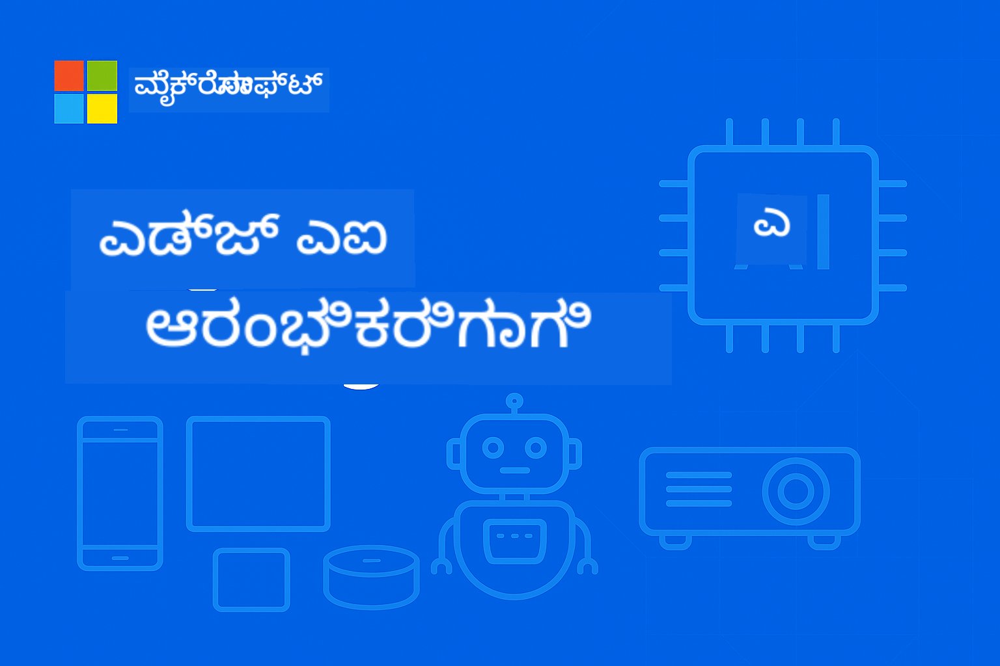

<!--
CO_OP_TRANSLATOR_METADATA:
{
  "original_hash": "ac31463ae3ed21a0ce83b0a351c23dd4",
  "translation_date": "2026-01-05T10:15:57+00:00",
  "source_file": "README.md",
  "language_code": "kn"
}
-->
# ಆರಂಭಿಕರಿಗಾಗಿ ಎಡ್ಜ್ಎಐ 




[](https://GitHub.com/microsoft/edgeai-for-beginners/graphs/contributors)
[](https://GitHub.com/microsoft/edgeai-for-beginners/issues)
[](https://GitHub.com/microsoft/edgeai-for-beginners/pulls)
[](http://makeapullrequest.com)

[](https://GitHub.com/microsoft/edgeai-for-beginners/watchers)
[](https://GitHub.com/microsoft/edgeai-for-beginners/fork)
[](https://GitHub.com/microsoft/edgeai-for-beginners/stargazers)


[](https://discord.gg/nTYy5BXMWG)

ಈ ಸಂಪನ್ಮೂಲಗಳನ್ನು ಬಳಸಲು ಪ್ರಾರಂಭಿಸುವ ಈ ಹಂತಗಳನ್ನು ಅನುಸರಿಸಿ:

1. **ರೆಪೊ ಫೋರ್ಕ್ ಮಾಡಿ**: ಕ್ಲಿಕ್ ಮಾಡಿ [](https://GitHub.com/microsoft/edgeai-for-beginners/fork)
2. **ರೆಪೊ ಕ್ಲೋನ್ ಮಾಡಿ**:   `git clone https://github.com/microsoft/edgeai-for-beginners.git`
3. [**ಏಜರ್ ಎಐ ಫೌಂಡ್ರಿ ಡಿಸ್ಕಾರ್ಡ್‌ಗೆ ಸೇರಿ, ಪರಿಣಿತರ ಮತ್ತು ಸಹ ಡೆವಲಪರ್‌ಗಳನ್ನು ಭೇಟಿ ಮಾಡಿ**](https://discord.com/invite/ByRwuEEgH4)


### 🌐 ಬಹು-ಭಾಷಾ ಬೆಂಬಲ

#### GitHub ಆಕ್ಷನ್ ಮೂಲಕ ಬೆಂಬಲಿತ (ಸ್ವಯಂಚಾಲಿತ ಮತ್ತು ಸದಾ ನವೀಕೃತ)

<!-- CO-OP TRANSLATOR LANGUAGES TABLE START -->
[Arabic](../ar/README.md) | [Bengali](../bn/README.md) | [Bulgarian](../bg/README.md) | [Burmese (Myanmar)](../my/README.md) | [Chinese (Simplified)](../zh/README.md) | [Chinese (Traditional, Hong Kong)](../hk/README.md) | [Chinese (Traditional, Macau)](../mo/README.md) | [Chinese (Traditional, Taiwan)](../tw/README.md) | [Croatian](../hr/README.md) | [Czech](../cs/README.md) | [Danish](../da/README.md) | [Dutch](../nl/README.md) | [Estonian](../et/README.md) | [Finnish](../fi/README.md) | [French](../fr/README.md) | [German](../de/README.md) | [Greek](../el/README.md) | [Hebrew](../he/README.md) | [Hindi](../hi/README.md) | [Hungarian](../hu/README.md) | [Indonesian](../id/README.md) | [Italian](../it/README.md) | [Japanese](../ja/README.md) | [Kannada](./README.md) | [Korean](../ko/README.md) | [Lithuanian](../lt/README.md) | [Malay](../ms/README.md) | [Malayalam](../ml/README.md) | [Marathi](../mr/README.md) | [Nepali](../ne/README.md) | [Nigerian Pidgin](../pcm/README.md) | [Norwegian](../no/README.md) | [Persian (Farsi)](../fa/README.md) | [Polish](../pl/README.md) | [Portuguese (Brazil)](../br/README.md) | [Portuguese (Portugal)](../pt/README.md) | [Punjabi (Gurmukhi)](../pa/README.md) | [Romanian](../ro/README.md) | [Russian](../ru/README.md) | [Serbian (Cyrillic)](../sr/README.md) | [Slovak](../sk/README.md) | [Slovenian](../sl/README.md) | [Spanish](../es/README.md) | [Swahili](../sw/README.md) | [Swedish](../sv/README.md) | [Tagalog (Filipino)](../tl/README.md) | [Tamil](../ta/README.md) | [Telugu](../te/README.md) | [Thai](../th/README.md) | [Turkish](../tr/README.md) | [Ukrainian](../uk/README.md) | [Urdu](../ur/README.md) | [Vietnamese](../vi/README.md)

> **ಸ್ಥಳೀಯವಾಗಿ ಕ್ಲೋನ್ ಮಾಡಲು ಇಚ್ಛಿಸುತ್ತೀರಾ?**

> ಈ ರೆಪೊದಲ್ಲಿ 50+ ಭಾಷಾ ಅನುವಾದಗಳಿವೆ, ಇದರಿಂದ ಡೌನ್ಲೋಡ್ ಗಾತ್ರವನ್ನು ಬಹಳಹೆಚ್ಚು ಮಾಡುತ್ತದೆ. ಅನುವಾದಗಳಿಲ್ಲದೆ ಕ್ಲೋನ್ ಮಾಡಲು sparse checkout ಬಳಸಿರಿ:  
> ```bash
> git clone --filter=blob:none --sparse https://github.com/microsoft/edgeai-for-beginners.git
> cd edgeai-for-beginners
> git sparse-checkout set --no-cone '/*' '!translations' '!translated_images'
> ```
> ಇದು ನಿಮಗೆ ಕೋರ್ಸ್ ಪೂರ್ಣಗೊಳಿಸಲು ಅಗತ್ಯವಿರುವ ಎಲ್ಲವನ್ನೂ Much ವೇಗವಾಗಿ ಡೌನ್ಲೋಡ್ ಮಾಡುವಂತೆ ನೀಡುತ್ತದೆ.  
<!-- CO-OP TRANSLATOR LANGUAGES TABLE END -->

**ನೀವು ಹೆಚ್ಚುವರಿ ಭಾಷಾ ಅನುವಾದಗಳನ್ನು ಬೆಂಬಲಿಸಲು ಆಸಕ್ತರಾಗಿದ್ದರೆ ಅವುಗಳನ್ನು ಇಲ್ಲಿ ಪಟ್ಟಿಮಾಡಲಾಗಿದೆ [ಇಲ್ಲಿ](https://github.com/Azure/co-op-translator/blob/main/getting_started/supported-languages.md)**
## ಪರಿಚಯ

**ಅರ್ಜಿ ಎಐ ಆರಂಭಿಕರಿಗೆ**ಗೆ ಸ್ವಾಗತ – ಎಡ್ಜ್ ಕೃತಕ ಬುದ್ಧಿಮತ್ತೆ ವೈಭವಶಾಲಿ ಜಗತ್ತಿನ ನಿಮ್ಮ ಸಕಲ ಯಾತ್ರೆ. ಈ ಕೋರ್ಸ್ ಶಕ್ತಿಶಾಲಿ AI ಸಾಮರ್ಥ್ಯಗಳು ಮತ್ತು ಗಾಳಿಯಿಂದ ನಿಮ್ಮೆಡೆಯಾಗಿ ನಿರ್ವಹಿಸುವಡೆ ಮಾಹಿತಿ ಸುತ್ತಲೂ ಮತ್ತು ತೀರ್ಮಾನಗಳನ್ನು ತೆಗೆದುಕೊಳ್ಳಬೇಕಾದ ಸ್ಥಳದಲ್ಲಿ ನೇರವಾಗಿ AI ಸಾಮರ್ಥ್ಯಗಳನ್ನು ಬಳಸಲು ಪ್ರಾಯೋಗಿಕ, ನಿಜ ಜಗತ್ತಿನ edge ಸಾಧನಗಳ ಡಿಪ್ಲಾಯ್ಮೆಂಟ್ ನಡುವೆ ಸೇತುಬಂಧವನ್ನು ನಿರ್ಮಿಸುತ್ತದೆ.

### ನೀವು ಏನು maîtrise ಮಾಡುತ್ತೀರಿ

ಈ ಕೋರ್ಸ್ ನೀವು ಮೂಲಭೂತ ಕಲ್ಪನೆಗಳಿಂದ ಉತ್ಪಾದನೆಗೆ ಸಿದ್ಧಗೊಂಡ ಅನುಷ್ಠಾನಗಳವರೆಗೆ ಕ್ರೀತಿಸುತ್ತದೆ, ಒಳಗೊಂಡಿರುವವು:
- ಎಡ್ಜ್ ಡಿಪ್ಲಾಯ್ಮೆಂಟ್‌ಗಾಗಿ ಒತ್ತಿಹೆಚ್ಚಿಸಲಾದ **ಚಿಕ್ಕ ಭಾಷೆ ಮಾದರಿಗಳು (SLMs)**
- ವೈವಿಧ್ಯಮಯ ವೇದಿಕೆಗಳಲ್ಲಿ **ಹಾರ್ಡ್‌ವೇರ್-ಆವರ್ತಿತ ಉತ್ಕೃಷ್ಟತೆ**
- **ನಿಜ ಕಾಲದ ಇನ್ಫರೆನ್ಸ್** ಗೌಪ್ಯತೆಯನ್ನು ಕಾಯ್ದುಕೊಳ್ಳುವ ಸಾಮರ್ಥ್ಯಗಳೊಂದಿಗೆ
- ಉದ್ಯಮ ಅನुप್ರಯೋಗಗಳಿಗಾಗಿ **ಉತ್ಪಾದನಾ ನಿಯೋಜನೆ** ತಂತ್ರಗಳು

### ಏಕೆ EdgeAI ಮುಖ್ಯವಾಗಿದೆ

ಎಡ್ಜ್ AI ಆಧುನಿಕ ಪ್ರಮುಖ ಸಮಸ್ಯೆಗಳಿಗೆ ಪರಿಹಾರ ನೀಡುವ ಪರಿಕಲ್ಪನೆ ಬದಲಾವಣೆಯನ್ನು ಪ್ರತಿನಿಧಿಸುತ್ತದೆ:
- **ಗೌಪ್ಯತೆ ಮತ್ತು ಭದ್ರತೆ**: ಕ್ಲೌಡ್ ಅನಾವರಣವಿಲ್ಲದೆ ಸ್ಥಳೀಯವಾಗಿ ಸುತ್ತಲೂ ಸಂವೇದನಾಶೀಲ ಮಾಹಿತಿಯನ್ನು ಸಂಸ್ಕರಿಸು
- **ನಿಜ-ಕಾಲದ ಕಾರ್ಯಕ್ಷಮತೆ**: ಸಮಯ-ಸಂವೇದನಾಶೀಲ ಅನ್ವಯಿಕೆಗಳಿಗೆ ಜಾಲತಾಣ ವಿಳಂಬವನ್ನು ಇಲ್ಲಾಗಿಸಲಾಗುತ್ತದೆ
- **ಖರ್ಚು ಪರಿಣಾಮಕಾರিতা**: ಬ್ಯಾಂಡ್‌ವಿಡ್ತ್ ಮತ್ತು ಕ್ಲೌಡ್ ಕಂಪ್ಯೂಟಿಂಗ್ ಖರ್ಚುಗಳನ್ನು ಕಡಿಮೆ ಮಾಡು
- **ದೃಢ ಕಾರ್ಯಾಚರಣೆಗಳು**: ಜಾಲತಾಣ ಬಿದ್ದಾಗಲೂ ಕಾರ್ಯಕ್ಷಮತೆಯನ್ನು ಕಾಯ್ದುಕೊಳ್ಳು
- **ನಿಯಾಮಕ ಅನುಕೂಲತೆ**: ಡೇಟಾ ಪ್ರಜಾಸತ್ತಾತ್ಮಕತೆಯನ್ನು ಪೂರೈಸು

### ಎಡ್ಜ್ AI

ಎಡ್ಜ್ AI ಎಂದರೆ AI ಆಲ್ಗೊರಿದಮ್‌ಗಳು ಮತ್ತು ಭಾಷಾ ಮಾದರಿಗಳನ್ನು ಸ್ಥಳೀಯವಾಗಿ ಸಂಸ್ಕರಿಸುವದು, ಡೇಟಾ ಉತ್ಪತ್ತಿಯಾದ ಸ್ಥಳದ ಹತ್ತಿರವಾದ ಹಾರ್ಡ್‌ವೇರ್‌ನಲ್ಲಿ, ಇನ್ಫರೆನ್ಸ್‌ಗಾಗಿ ಕ್ಲೌಡ್ ಸಂಪನ್ಮೂಲಗಳ ಅವಲಂಬನೆಯಿಲ್ಲದೆ. ಇದರಿಂದ ವಿಳಂಬ ಕಡಿಮೆ ಆಗುತ್ತದೆ, ಗೌಪ್ಯತೆ ಹೆಚ್ಚಾಗುತ್ತದೆ ಮತ್ತು ನಿಜ ಕಾಲದ ನಿರ್ಧಾರಗಳನ್ನು ತೆಗೆದುಕೊಳ್ಳಲು ಸಾಧ್ಯವಾಗುತ್ತದೆ.

### ಪ್ರಮುಖ ತತ್ತ್ವಗಳು:
- **ಡಿವೈಸ್ ಮೇಲೆ ಇನ್ಫ್ರೆನ್ಸ್**: AI ಮಾದರಿಗಳು ಎಡ್ಜ್ ಸಾಧನಗಳಲ್ಲಿ (ದೂರವಾಣಿ, ರೌಟರ್, ಮೈಕ್ರೋಕಂಟ್ರೋಲರ್, ಉದ್ಯಮದ ಪಿಸಿಗಳು) ನಡೆಯುತ್ತವೆ
- **ಆನ್‌ಲೈನ್ ಕಂಟಕವಿಲ್ಲದ ಕಾರ್ಯಸಾಧ್ಯತೆ**: ಸ್ಥಿರ ಇಂಟರ್ನೆಟ್ ಸಂಪರ್ಕವಿಲ್ಲದೆ ಕಾರ್ಯನಿರ್ವಹಿಸು
- **ಕಡಿಮೆ ವಿಳಂಬ**: ನಿಜ ಕಾಲದ ವ್ಯವಸ್ಥೆಗಳಿಗೆ ತಕ್ಷಣ ಪ್ರತಿಕ್ರಿಯೆಗಳು
- **ಡೆೇಟಾ ಪ್ರಜಾಸತ್ತಾತ್ಮಕತೆ**: ಸಂವೇದನಶೀಲ ಮಾಹಿತಿ ಸ್ಥಳೀಯದಲ್ಲಿಯೇ ಇರಿಸಿ ಭದ್ರತೆ ಮತ್ತು ನಿಯಮ ಪಾಲನೆಯನ್ನು ಸುಧಾರಿಸು

### ಚಿಕ್ಕ ಭಾಷೆ ಮಾದರಿಗಳು (SLMs)

Phi-4, Mistral-7B ಮತ್ತು Gemma ಮುಂತಾದ SLM ಗಳು ದೊಡ್ಡ LLM ಗಳಿಗಿಂತ ಹೆಚ್ಚು ಆಪ್ಟಿಮೈಸ್ ಮಾಡಲಾದ ಆವೃತ್ತಿಗಳು—ಶಿಕ್ಷಿತ ಅಥವಾ ದ್ರವೀಕರಿಸಲಾಗಿದ್ದು:  
- **ಕಡಿಮೆ ಮೆಮೊರಿ ಬಳಕೆ**: ಸೀಮಿತ ಎಡ್ಜ್ ಸಾಧನ ಮೆಮೊರಿಯನ್ನು ಪರಿಣಾಮಕಾರಿಯಾಗಿ ಬಳಸುವುದು  
- **ಕಡಿಮೆ ಗಣನೆ ಅಗತ್ಯ**: CPU ಮತ್ತು ಎಡ್ಜ್ GPU ಕಾರ್ಯಕ್ಷಮತೆಯ ಮೇಲೆ ಆಪ್ಟಿಮೈಸ್ ಮಾಡಲಾಗಿದೆ  
- **ವೇಗವಾದ ಪ್ರಾರಂಭ ಸಮಯ**: ಪ್ರತಿಕ್ರಿಯಾಶೀಲ ಅನ್ವಯಿಕೆಗಳಿಗೆ ವೇಗವಾಗಿ ಪ್ರಾರಂಭಿಸು  

ಇವು ಶಕ್ತಿಶಾಲಿ NLP ಸಾಮರ್ಥ್ಯಗಳನ್ನು ಪಡೆಯುತ್ತವೆ ಮತ್ತು ಈ ನಿರ್ಬಂಧಗಳನ್ನು ಪೂರೈಸುತ್ತವೆ:  
- **ಎಂಬೆಡ್ಡೆಡ್ ಸಿಸ್ಟಮ್‌ಗಳು**: IoT ಸಾಧನಗಳು ಮತ್ತು ಉದ್ಯಮ ನಿಯಂತ್ರಕಗಳು  
- **ಮೊಬೈಲ್ ಸಾಧನಗಳು**: ಆಫ್‌ಲೈನ್ ಸಾಮರ್ಥ್ಯಗಳೊಂದಿಗೆ ಸ್ಮಾರ್ಟ್‌ಫೋನುಗಳು ಮತ್ತು ಟ್ಯಾಬ್ಲೆಟ್‌ಗಳು  
- **IoT ಸಾಧನಗಳು**: ಸೀಮಿತ ಸಂಪನ್ಮೂಲಗಳ ಸಂವೇದಕಗಳು ಮತ್ತು ಸ್ಮಾರ್ಟ್ ಸಾಧನಗಳು  
- **ಎಡ್ಜ್ ಸರ್ವರ್‌ಗಳು**: ಸೀಮಿತ GPU ಸಂಪನ್ಮೂಲಗಳ ಸ್ಥಳೀಯ ಸಂಸ್ಕರಣಾ ಘಟಕಗಳು  
- **ಪರ್ಸನಲ್ ಕಂಪ್ಯೂಟರ್ಸ್**: ಡೆಸ್ಕ್‌ಟಾಪ್ ಮತ್ತು ಲ್ಯಾಪ್‌ಟಾಪ್ ನಿಯೋಜನೆ ಸಂದರ್ಭಗಳು  

## ಕೋರ್ಸ್ ಮಾಯೆಯಗಳು ಮತ್ತು ನಾವಿಗೇಶನ್

| ಮಾಯೆ | ವಿಷಯ | ಆಳವಲೋಕನ ಪ್ರದೇಶ | ಮುಖ್ಯ ವಿಷಯ | ಮಟ್ಟ | ಅವಧಿ |
|--------|-------|------------|-------------|--------|----------|
| [📖 00 ](./introduction.md) | [ಎಡ್ಜ್ಎಐಗೆ ಪರಿಚಯ](./introduction.md) | ಮೂಲ ಮತ್ತು ಸಾಂದರ್ಭಿಕತೆ | ಎಡ್ಜ್ಎಐ ಅವಲೋಕನ • ಉದ್ಯಮ ಅನ್ವಯಿಕೆಗಳು • SLM ಪರಿಚಯ • ಕಲಿಕೆಯ ಗುರಿಗಳು | ಆರಂಭಿಕ | 1-2 ಘಂಟೆಗಳು |
| [📚 01](../../Module01) | [ಎಡ್ಜ್ಎಐ ಮೂಲಭೂತಗಳು](./Module01/README.md) | ಕ್ಲೌಡ್ ವಿರುದ್ಧ ಎಡ್ಜ್ AI ಹೋಲಿಕೆ | ಎಡ್ಜ್ಎಐ ಮೂಲಭೂತಗಳು • ನಿಜ ಜಗತ್ತಿನ ಪ್ರಕರಣ ಅಧ್ಯಯನಗಳು • ಅನುಷ್ಠಾನ ಮಾರ್ಗದರ್ಶಿ • ಎಡ್ಜ್ ನಿಯೋಜನೆ | ಆರಂಭಿಕ | 3-4 ಘಂಟೆಗಳು |
| [🧠 02](../../Module02) | [SLM ಮಾದರಿ հիմಗಳು](./Module02/README.md) | ಮಾದರಿ ಕುಟುಂಬಗಳು ಮತ್ತು ವಾಸ್ತುಶಿಲ್ಪ | Phi ಕುಟುಂಬ • Qwen ಕುಟುಂಬ • Gemma ಕುಟುಂಬ • BitNET • μModel • Phi-Silica | ಆರಂಭಿಕ | 4-5 ಘಂಟೆಗಳು |
| [🚀 03](../../Module03) | [SLM ನಿಯೋಜನೆ ಅಭ್ಯಾಸ](./Module03/README.md) | ಸ್ಥಳೀಯ ಮತ್ತು ಕ್ಲೌಡ್ ನಿಯೋಜನೆ | ಮುಂದುವರೆದ ಅಧ್ಯಯನ • ಸ್ಥಳೀಯ ಪರಿಸರ • ಕ್ಲೌಡ್ ನಿಯೋಜನೆ | ಮಧ್ಯಮ | 4-5 ಘಂಟೆಗಳು |
| [⚙️ 04](../../Module04) | [ಮಾದರಿ ಉತ್ಕೃಷ್ಟತೆ ಟೂಲ್ಕಿಟ್](./Module04/README.md) | ಕ್ರಾಸ್-ಪ್ಲಾಟ್‌ಫಾರ್ಮ್ ಉತ್ಕೃಷ್ಟತೆ | ಪರಿಚಯ • Llama.cpp • Microsoft Olive • OpenVINO • Apple MLX • ಕಾರ್ಯಪ್ರವಾಹ ಸಂಶ್ಲೇಷಣೆ | ಮಧ್ಯಮ | 5-6 ಘಂಟೆಗಳು |
| [🔧 05](../../Module05) | [SLMOps ಉತ್ಪಾದನೆ](./Module05/README.md) | ಉತ್ಪಾದನಾ ಕಾರ್ಯಾಚರಣೆಗಳು | SLMOps ಪರಿಚಯ • ಮಾದರಿ ದ್ರವೀಕರಣ • ಸೂಕ್ಷ್ಮ-ಸಾಮರಸ್ಯ • ಉತ್ಪಾದನಾ ನಿಯೋಜನೆ | ಉನ್ನತ | 5-6 ಘಂಟೆಗಳು |
| [🤖 06](../../Module06) | [AI ಏಜಂಟ್ಗಳು ಮತ್ತು ಕಾರ್ಯ ಕರೆ](./Module06/README.md) | ಏಜಂಟ್ ಫ್ರೇಮ್‌ವರ್ಕ್‌ಗಳು ಮತ್ತು MCP | ಏಜಂಟ್ ಪರಿಚಯ • ಕಾರ್ಯ ಕರೆ • ಮಾದರಿ ಸಾಂದರ್ಭಿಕ ಪ್ರೋಟೋಕಾಲ್ | ಉನ್ನತ | 4-5 ಘಂಟೆಗಳು |
| [💻 07](../../Module07) | [ಪ್ಲಾಟ್‌ಫಾರ್ಮ್ ಅನುಷ್ಠಾನ](./Module07/README.md) | ಕ್ರಾಸ್-ಪ್ಲಾಟ್‌ಫಾರ್ಮ್ ಉದಾಹರಣೆಗಳು | AI ಟೂಲ್ಕಿಟ್ • ಫೌಂಡ್ರಿ ಲೋಕಲ್ • ವಿಂಡೋಸ್ ಅಭಿವೃದ್ಧಿ | ಉನ್ನತ | 3-4 ಘಂಟೆಗಳು |
| [🏭 08](../../Module08) | [ಫೌಂಡ್ರಿ ಲೋಕಲ್ ಟೂಲ್ಕಿಟ್](./Module08/README.md) | ಉತ್ಪಾದನಾ ಸಿದ್ಧ ಉದಾಹರಣೆಗಳು | నమೂನಾ ಅನ್ವಯಿಕೆಗಳು (ಕೆಳಗಿನ ವಿವರ ನೋಡಿ) | ತಜ್ಞ | 8-10 ಘಂಟೆಗಳು |

### 🏭 **ಮಾಯೆ 08: నమೂನಾ ಅನ್ವಯಿಕೆಗಳು**

- [01: REST ಚಾಟ್ ಕ್ವಿಕ್‌ಸ್ಟಾರ್ಟ್](./Module08/samples/01/README.md)
- [02: OpenAI SDK ಏಕಾಶಿಕೆ](./Module08/samples/02/README.md)
- [03: ಮಾದರಿ ಅನ್ವೇಷಣೆ ಮತ್ತು ಬೆಂಚ್‌ಮಾರ್ಕ್](./Module08/samples/03/README.md)
- [04: Chainlit RAG ಅನ್ವಯಿಕೆ](./Module08/samples/04/README.md)
- [05: ಬಹು-ಏಜೆಂಟ್ ಸಂಯೋಜನೆ](./Module08/samples/05/README.md)
- [06: ಮಾದರಿ-ವೈದ್ಯಮಾನಿ ರೂಟರ್](./Module08/samples/06/README.md)
- [07: ನೇರ API ಕ್ಲೈಯಂಟ್](./Module08/samples/07/README.md)
- [08: ವಿಂಡೋಸ್ 11 ಚಾಟ್ ಅಪ್ಲಿಕೇಶನ್](./Module08/samples/08/README.md)
- [09: ಬಹು-ಏಜೆಂಟ್ ವ್ಯವಸ್ಥೆಯ ಮುಂದುವರೆಸಿದ ರೂಪ](./Module08/samples/09/README.md)
- [10: ಫೌಂಡ್ರಿ ಟೂಲ್ಸ್ ಫ್ರೇಮ್‌ವರ್ಕ್](./Module08/samples/10/README.md)

### 🎓 **ಕಾರ್ಖಾನೆ: ಕೈಗನ್ನಡ ಕಲಿಕೆಯ ಮಾರ್ಗ**

ಉತ್ಪಾದನಾ ಸಿದ್ಧ ಅನುಷ್ಠಾನಗಳೊಂದಿಗೆ ಸಮಗ್ರ ಕೈಗನ್ನಡ ಕಾರ್ಯಾಗಾರ ಸಾಮಗ್ರಿಗಳು:

- **[ಕಾರ್ಖಾನೆ ಮಾರ್ಗದರ್ಶಿ](./Workshop/Readme.md)** - ಸಂಪೂರ್ಣ ಕಲಿಕೆಯ ಗುರಿಗಳು, ಫಲಿತಾಂಶ ಮತ್ತು ಸಂಪನ್ಮೂಲ ನಾವಿಗೇಶನ್
- **Python ನಮನಿಕೆಗಳು** (6 ಅಧಿವೇಶನಗಳು) - ಉತ್ತಮ ಅಭ್ಯಾಸಗಳು, ದೋಷ ನಿರ್ವಹಣೆ ಮತ್ತು ಸಮಗ್ರ ದಾಖಲೆಗಳೊಂದಿಗೆ ನವೀಕರಿಸಲಾಗಿದೆ
- **ಜ್ಯುಪಿಟರ್ ನೋಟುಬುಕ್‌ಗಳು** (8 ಸಂವಹನಾತ್ಮಕ) - ಹಂತ ಹಂತ ಟ್ಯುಟೋರಿಯಲ್ಸ್ ಬೆಂಚ್‌ಮಾರ್ಕ್ ಮತ್ತು ಕಾರ್ಯಕ್ಷಮತೆ ನಿಗಾದೇಶನೊಂದಿಗೆ
- **ಅಧಿವಾರ ಮಾರ್ಗದರ್ಶಿ** - ಪ್ರತಿ ಕಾರ್ಯಾಗಾರ ಅಧಿವೇಶನಗಳಿಗೆ ವಿವರವಾದ ಮಾರ್ಗದರ್ಶಿಗಳು
- **ಮಾನ್ಯತೆ ಸಾಧನಗಳು** - ಕೋಡ್ ಗುಣಮಟ್ಟವನ್ನು ಪರಿಶೀಲಿಸುವ ಮತ್ತು ಸ್ಮೋಕ್ ಪರೀಕ್ಷೆ ಚಲಿಸುವ ಸ್ಕ್ರಿಪ್ಟ್‌ಗಳು

**ನೀವು ನಿರ್ಮಿಸುವುದು:**
- ಸ್ಟ್ರೀಮಿಂಗ್ ಬೆಂಬಲದೊಂದಿಗೆ ಸ್ಥಳೀಯ AI ಚಾಟ್ ಅಪ್ಲಿಕೇಶನ್‌ಗಳು
- ಗುಣಮಟ್ಟ ಮೌಲ್ಯಮಾಪನ ಹೊಂದಿರುವ RAG ಪೈಪ್‌ಲೈನ್‌ಗಳು (RAGAS)
- ಬಹು-ಮಾದರಿ ಬೆಂಚ್‌ಮಾರ್ಕ್ ಮತ್ತು ಹೋಲಿಕೆ ಸಾಧನಗಳು
- ಬಹು-ಏಜೆಂಟ್ ಸಂಯೋಜನೆ ವ್ಯವಸ್ಥೆಗಳು
- ಕಾರ್ಯಾಧಾರಿತ ಆಯ್ಕೆ ಮೂಲಕ ಬುದ್ಧಿಶಾಲೀ ಮಾದರಿ ರೂಟಿಂಗ್

### 🎙️ **ಏಜೆಂಟಿಕ್ ಕಾರ್ಯಾಗಾರ: ಕೈಗನ್ನಡ - AI ಪಾಡ್‌ಕಾಸ್ಟ್ ಸ್ಟುಡಿಯೋ**

ಶೂನ್ಯದಿಂದ AI ಚಾಲಿತ ಪಾಡ್‌ಕಾಸ್ಟ್ ಉತ್ಪಾದನೆ ಪೈಪ್‌ಲೈನ್ ನಿರ್ಮಿಸಿ! ಈ immersive ಕಾರ್ಯಾಗಾರವು ನಿಮಗೆ ಬುದ್ಧಿವಂತಿಕೆಯಿಂದ ತುಂಬಿದ ಬಹು-ಏಜೆಂಟ್ ವ್ಯವಸ್ಥೆಯನ್ನು ರಚಿಸಲು ಕಲಿಸುತ್ತದೆ, ಅದು ಕಲ್ಪನೆಗಳನ್ನು ವೃತ್ತಿಪರ ಪಾಡ್‌ಕಾಸ್ಟ್ ಎಪಿಸೋಡ್ಗಳಾಗಿ ಪರಿವರ್ತಿಸುತ್ತದೆ.
**[🎬 ಎಐ ಪಾಡ್ಕಾಸ್ಟ್ ಸ್ಟುಡಿಯೋ ಕಾರಾಗೃಹ ಕಾರ್ಯಾಗಾರವನ್ನು ಪ್ರಾರಂಭಿಸಿ](./WorkshopForAgentic/README.md)**

**ನಿಮ್ಮ ಗುರಿ**: "Future Bytes" ಎಂಬ ಟೆಕ್ ಪಾಡ್ಕಾಸ್ಟ್ ಅನ್ನು ನೀವು ಸ್ವತಃ ನಿರ್ಮಿಸುವ এಐ ಏಜೆಂಟ್‌ಗಳಿಂದ ಸಂಪೂರ್ಣವಾಗಿ ಚಾಲಿತಗೊಳಿಸಿ. ಯಾವುದೇ ಕ್ಲೌಡ್ ಅವಲಂಬನೆ ಇಲ್ಲ, ಯಾವುದೇ API ವೆಚ್ಚವಿಲ್ಲ — ಎಲ್ಲವೂ ನಿಮ್ಮ ಯಂತ್ರದಲ್ಲಿ ಸ್ಥಳೀಯವಾಗಿ ಚಾಲಿತವಾಗುತ್ತದೆ.

**ಇದನ್ನು ವಿಶಿಷ್ಟವಾಗಿಸುವುದು:**
- **🤖 ನೈಸರ್ಗಿಕ ಬಹು-ಏಜೆಂಟ್ ಸಂಯೋಜನೆ** - ಸಂಶೋಧನೆ, ಬರಹ, ಮತ್ತು ಧ್ವನಿ ಉತ್ಪಾದನೆ ಮಾಡಲು ವಿಶೇಷೀಕೃತ AI ಏಜೆಂಟ್‌ಗಳನ್ನು ನಿರ್ಮಿಸಿ
- **🎯 ಸಂಪೂರ್ಣ ಉತ್ಪಾದನಾ ಪೈಪ್‌ಲೈನ್** - ವಿಷಯ ಆಯ್ಕೆದಿಂದ ಅಂತಿಮ ಪಾಡ್ಕಾಸ್ಟ್ ಧ್ವನಿ ಉತ್ಪಾದನೆಗೆ
- **💻 100% ಸ್ಥಳೀಯ ಜಾರಿಗೆ** - ಪ್ರೈವೇಸಿ ಮತ್ತು ನಿಯಂತ್ರಣಕ್ಕಾಗಿ Ollama ಮತ್ತು ಸ್ಥಳೀಯ ಮಾದರಿಗಳನ್ನು (Qwen-3-8B) ಬಳಸುತ್ತದೆ
- **🎤 ಪಠ್ಯದಿಂದ ಧ್ವನಿಗೆ ಪೂರ್ವಸಿದ್ಧತೆ** - ಸ್ಕ್ರಿಪ್ಟ್‌ಗಳನ್ನು ಸ್ವಾಭಾವಿಕ ಧ್ವನಿಯುಳ್ಳ ಬಹು-ಬಾಯ್ ಸಂಭಾಷಣೆಗಳಾಗಿ ಪರಿವರ್ತಿಸಿ
- **✋ ಮಾನವ-ನಿರಂತರ ಕಾರ್ಯವಾಹಿಗಳ ಸಂಯೋಜನೆ** - ಸ್ವಯಂಚಾಲಿತವಾಗಿರುವುದರೊಂದಿಗೆ ಗುಣಮಟ್ಟ ಖಾತ್ರಿ ಮಾಡುವ ಅನುಮೋದನಾ ಬಾಗಿಲುಗಳು

**ಮೂರು ಹಂತಗಳ ಕಲಿಕೆ ಪ್ರಯಾಣ:**

| ಹಂತ | ಧ್ಯೇಯ | ಮುಖ್ಯ ಕೌಶಲ್ಯಗಳು | ಅವಧಿ |
|-----|-------|------------|----------|
| **[ಹಂತ 1: ನಿಮ್ಮ AI ಸಹಾಯಕರನ್ನು ಪರಿಚಯಿಸಿ](./WorkshopForAgentic/md/01.BuildAIAgentWithSLM.md)** | ನಿಮ್ಮ ಮೊದಲ AI ಏಜೆಂಟ್ ನಿರ್ಮಿಸಿ | ಉಪಕರಣಗಳ ಸಂಯೋಜನೆ • ವೆಬ್ ಶೋಧನೆ • ಸಮಸ್ಯೆ ಪರಿಹಾರ • ಏಜೆಂಟಿಕ ವಿವೇಕ | 2-3 ಗಂಟೆಗಳು |
| **[ಹಂತ 2: ನಿಮ್ಮ ಉತ್ಪಾದನಾ ತಂಡವನ್ನು ಸೇರಿಸಿ](./WorkshopForAgentic/md/02.AIAgentOrchestrationAndWorkflows.md)** | ಅನೇಕ ಏಜೆಂಟ್‌ಗಳನ್ನು ಸಂಯೋಜಿಸಿ | ತಂಡ ಸಂಯೋಜನೆ • ಅನುಮೋದನಾ ಕಾರ್ಯವಾಹಿಗಳು • DevUI ಮುಖಪುಟ • ಮಾನವ ವೀಕ್ಷಣೆ | 3-4 ಗಂಟೆಗಳು |
| **[ಹಂತ 3: ನಿಮ್ಮ ಪಾಡ್ಕಾಸ್ಟ್ ಅನ್ನು ಬದುಕಿಲ್ಲಿ ತಂದು ಕೊಡು](./WorkshopForAgentic/md/03.Multi-SpeakerPodcastGenerationWithVibeVoice.md)** | ಪಾಡ್ಕಾಸ್ಟ್ ಧ್ವನಿಯನ್ನು ಉತ್ಪಾದಿಸಿ | ಪಠ್ಯದಿಂದ ಧ್ವನಿಗೆ • ಬಹು-ಸ್ಪೀಕರ್ ಸಂಶ್ಲೇಷಣೆ • ಉದ್ದನೆಯ ಧ್ವನಿ • ಸಂಪೂರ್ಣ ಸ್ವಯಂಚಾಲಿತತೆ | 2-3 ಗಂಟೆಗಳು |

**ಬಳಸಲು ತಂತ್ರಜ್ಞಾನಗಳು:**
- **Microsoft Agent Framework** - ಬಹು-ಏಜೆಂಟ್ ಸಂಯೋಜನೆ ಮತ್ತು ಸಹಕಾರ
- **Ollama** - ಸ್ಥಳೀಯ AI ಮಾದರಿ ರನ್‌ಟೈಮ್ (ಯಾವುದೇ ಕ್ಲೌಡ್ ಅವಶ್ಯಕವಿಲ್ಲ)
- **Qwen-3-8B** - agentic ಕಾರ್ಯಗಳಿಗೆ ಗುರಿಯಾಗಿರುವ ಉಚಿತ ಮೂಲ ಭಾಷಾ ಮಾದರಿ
- **ಪಠ್ಯ-ಮತ್ತು-ಧ್ವನಿ APIಗಳ** - ಪಾಡ್ಕಾಸ್ಟ್ ಉತ್ಪಾದನೆಗೆ ಸ್ವಾಭಾವಿಕ ಧ್ವನಿ ಸಂಶ್ಲೇಷಣೆ

**ಹಾರ್ಡ್‌ವೇರ್ ಬೆಂಬಲ:**
- ✅ **CPU ಮೋಡ್** - ಇತ್ತೀಚಿನ ಹೆಚ್ಚಿನ ಕಂಪ್ಯೂಟರ್‌ಗಳಲ್ಲೇ ಕೆಲಸ (8GB+ RAM ಶಿಫಾರಸು)
- 🚀 **GPU ವೇಗವರ್ಧನೆ** - NVIDIA/AMD GPUಗಳನ್ನು ಬಳಸಿಕೊಂಡು ಪ್ರಮುಖ ವೇಗ ಏರಿಕೆ
- ⚡ **NPU ಬೆಂಬಲ** - ಮುಂದಿನ ತಲೆಮಾರಿನ ನ್ಯೂರಲ್ ಪ್ರೋಸೆಸಿಂಗ್ ಯೂನಿಟ್ ವೇಗವರ್ಧನೆ

**ಪರಿಪೂರ್ಣವಾಗಿದೆ:**
- ಬಹು-ಏಜೆಂಟ್ AI ವ್ಯವಸ್ಥೆಗಳನ್ನು ಕಲಿಯುವ ಡೆವಲಪರ್‌ಗಳಿಗೆ
- AI ಸ್ವಯಂಚಾಲನೆ ಮತ್ತು ಕಾರ್ಯವಾಹಿಗಳಲ್ಲಿ ಆಸಕ್ತಿ ಇರುವ ಯಾರಿಗಾದರೂ
- AI ಸಹಾಯಿತ ಉತ್ಪಾದನೆ ಪ್ರಯೋಗಿಸುವ ವಿಷಯ ಸೃಷ್ಟಿಕರ್ತರಿಗೆ
- ಕಾರ್ಯತತ್ಗ AI ಸಂಯೋಜನೆ ರೂಪಗಳನ್ನು ಅಧ್ಯಯನ ಮಾಡುವ ವಿದ್ಯಾರ್ಥಿಗಳಿಗಾಗಿಯೂ

**ನಿರ್ಮಾಣವನ್ನು ಪ್ರಾರಂಭಿಸಿ**: [🎙️ ಎಐ ಪಾಡ್ಕಾಸ್ಟ್ ಸ್ಟುಡಿಯೋ ಕಾರ್ಯಾಗಾರ →](./WorkshopForAgentic/README.md)

### 📊 **ಕಲಿಕೆಯ ಪಥ ಸಾರಾಂಶ**
- **ಒಟ್ಟು ಅವಧಿ**: 36-45 ಗಂಟೆಗಳು
- **ಆರಂಭಿಕ ಪಥ**: ಘಟಕಗಳು 01-02 (7-9 ಗಂಟೆಗಳು)  
- **ಮಧ್ಯಮ ಪಥ**: ಘಟಕಗಳು 03-04 (9-11 ಗಂಟೆಗಳು)
- **ಅರೆಡುಪಟ್ಟಿ ಪಥ**: ಘಟಕಗಳು 05-07 (12-15 ಗಂಟೆಗಳು)
- **ತಜ್ಞರ ಪಥ**: ಘಟಕ 08 (8-10 ಗಂಟೆಗಳು)

## ನೀವು ನಿರ್ಮಿಸುವುದು

### 🎯 ಪ್ರಮುಖ ಕೌಶಲ್ಯಗಳು
- **ಎಡ್ಜ್ AI ವಾಯವ್ಯವಣೆ**: ಕ್ಲೌಡ್ ಸಂಯೋಜನೆಯೊಂದಿಗೆ ಸ್ಥಳೀಯ ಪ್ರಥಮ AI ವ್ಯವಸ್ಥೆ ವಿನ್ಯಾಸ
- **ಮಾದರಿ ಉತ್ತಮಗೊಳಿಸುವಿಕೆ**: ಎಡ್ಜ್ ಜಾರಿಗೆ ಮಾದರಿಗಳನ್ನು ಗಾತ್ರ ಮತ್ತು ವೇಗದ ವಶೀನನುಯೋಗದಿಂದ ಕ್ವಾಂಟೈಸ್ ಮಾಡಿ (85% ವೇಗವರ್ಧನೆ, 75% ಗಾತ್ರ ಕಡಿತ)
- **ಬಹು- ವೇದಿಕೆ ಜಾರಿಗೆ**: ವಿಂಡೋಸ್, ಮೊಬೈಲ್, ಅಂಟಿಸಿಕೊಂಡಿದೆ ಮತ್ತು ಕ್ಲೌಡ್-ಎಡ್ಜ್ ಸಂಯೋಜನೆ
- **ಉತ್ಪಾದನಾ ಕಾರ್ಯಾಚರಣೆಗಳು**: ಜಾಗೃತಿ, ಪ್ರಮಾಣೀಕರಣ, ಮತ್ತು ಎಡ್ಜ್ AI ನಿರ್ವಹಣೆ

### 🏗️ ಪ್ರಾಯೋಗಿಕ ಯೋಜನೆಗಳು
- **Foundry ಸ್ಥಳೀಯ ಚಾಟ್ ಅಪ್ಲಿಕೇಶನ್‌ಗಳು**: ಮಾದರಿ ಬದಲಾವಣೆಸುಲಭವಾದ ವಿಂಡೋಸ್ 11 ನೆಟಿವ್ ಆಪ್
- **ಬಹು-ಏಜೆಂಟ್ ವ್ಯವಸ್ಥೆಗಳು**: ಸಂಕೀರ್ಣ ಕಾರ್ಯವಾಹಿಗಳಿಗಾಗಿ ನಿರ್ವಹಣೆ ಮತ್ತು ವಿಶೇಷಜ್ಞ ಏಜೆಂಟ್ ಗಳು  
- **RAG ಅಪ್ಲಿಕೇಶನ್‌ಗಳು**: ಸ್ಥಳೀಯ ಡಾಕ್ಯುಮೆಂಟ್ ಪ್ರಕ್ರಿಯೆ ವಿಕ್ಟರ್ ಶೋಧದೊಂದಿಗೆ
- **ಮಾದರಿ ರೌಟರ್‌ಗಳು**: ಕಾರ್ಯ ವಿಶ್ಲೇಷಣೆಯ ಆಧಾರದ ಮೇಲೆ ಮಾದರಿಗಳನ್ನು ಔದ್ಯೋಗಿಕವಾಗಿ ಆಯ್ಕೆ ಮಾಡುವುದು
- **API ಫ್ರೇಮ್ವರ್ಕ್‌ಗಳು**: ಸ್ಟ್ರೀಮಿಂಗ್ ಮತ್ತು ಆರೋಗ್ಯ ವೀಕ್ಷಣೆಯೊಂದಿಗೆ ಉತ್ಪಾದನಾ-ತಯಾರಾಗಿರುವ ಕ್ಲೈಂಟ್‌ಗಳು
- **ಬಹು- ವೇದಿಕೆ ಉಪಕರಣಗಳು**: LangChain/Semantic Kernel ಸಮನ್ವಯ ಮಾದರಿಗಳು

### 🏢 ಕೈಗಾರಿಕಾ ಅನ್ವಯಿಕೆಗಳು
**ಉತ್ಪಾದನೆ** • **ಆರೋಗ್ಯ** • **ಸ್ವಯಂಚಾಲಿತ ವಾಹನಗಳು** • **ಸ್ಮಾರ್ಟ್ ನಗರಗಳು** • **ಮೊಬೈಲ್ ಅಪ್ಲಿಕೇಶನ್ಗಳು**

## ವೇಗವಾಗಿ ಪ್ರಾರಂಭಿಸಿ

**ಶಿಫಾರಸು ಮಾಡಲಾದ ಕಲಿಕೆಯ ಹಾದಿ** (ಒಟ್ಟು 20-30 ಗಂಟೆಗಳು):

0. **📖 ಪರಿಚಯ** ([Introduction.md](./introduction.md)): EdgeAI ನೆಲೆ, ಕೈಗಾರಿಕಾ ಪ್ರಾಸಂಗಿಕತೆ, ಕಲಿಕೆ ಫ್ರೇಮ್ವರ್ಕ್  
1. **📚 ಮೌಲಿಕ** (ಘಟಕಗಳು 01-02): EdgeAI ಸಂಪ್ರೇಮ ಮತ್ತು SLM ಮಾದರಿ ಕುಟುಂಬಗಳು  
2. **⚙️ ಉತ್ತಮಗೊಳಿಸುವಿಕೆ** (ಘಟಕಗಳು 03-04): ಜಾರಿಗೆ ಮತ್ತು ಕ್ವಾಂಟೈಸೇಶನ್ ಫ್ರೇಮ್ವರ್ಕ್  
3. **🚀 ಉತ್ಪಾದನೆ** (ಘಟಕಗಳು 05-06): SLM Ops + AI ಏಜೆಂಟ್‌ಗಳು + ಕಾರ್ಯಕಲಾಪ ಕರೆ  
4. **💻 ಜಾರಿಗೊಳಿಸುವಿಕೆ** (ಘಟಕಗಳು 07-08): ವೇದಿಕೆಯ ಉದಾಹರಣೆಗಳು + Foundry ಸ್ಥಳೀಯ ಉಪಕರಣಗಳು

ಪ್ರತಿ ಘಟಕದಲ್ಲೂ ತತ್ವ, ಹಸ್ತಚಾಲಿತ ವ್ಯಾಯಾಮಗಳು, ಮತ್ತು ಉತ್ಪಾದನಾ-ತಯಾರಾಗಿರುವ ಕೋಡ್ ಮಾದರಿಗಳು ಸೇರಿವೆ.

## ವೃತ್ತಿಜೀವನದ ಪ್ರಭಾವ

**ತಾಂತ್ರಿಕ ಪಾತ್ರಗಳು**: EdgeAI ಪರಿಹಾರ معماري • ML ಎಂಜಿನಿಯರ್ (ಎಡ್ಜ್) • IoT AI ಡೆವಲಪರ್ • ಮೊಬೈಲ್ AI ಡೆವಲಪರ್

**ಕೈಗಾರಿಕಾ ಕ್ಷೇತ್ರಗಳು**: ಉತ್ಪಾದನೆ 4.0 • ಆರೋಗ್ಯ ತಂತ್ರಜ್ಞಾನ • ಸ್ವಯಂಚಾಲಿತ ವ್ಯವಸ್ಥೆಗಳು • ಫಿನ್‌ಟೆಕ್ • ಗ್ರಾಹಕ ಎಲೆಕ್ಟ್ರಾನಿಕ್ಸ್

**ಪೋರ್ಟ್‌ಫೋಲಿಯೊ ಯೋಜನೆಗಳು**: ಬಹು-ಏಜೆಂಟ್ ವ್ಯವಸ್ಥೆಗಳು • ಉತ್ಪಾದನಾ RAG ಆ್ಯಪ್ಗಳು • ಕ್ರಾಸ್-ಪ್ಲಾಟ್‌ಫಾರ್ಮ್ ಜಾರಿ • ಕಾರ್ಯಕ್ಷಮತೆ ಉತ್ತಮಗೊಳಿಸುವಿಕೆ

## ಸಂಗ್ರಹಣೆಯ ರಚನೆ

```
edgeai-for-beginners/
├── 📖 introduction.md  # Foundation: EdgeAI Overview & Learning Framework
├── 📚 Module01-04/     # Fundamentals → SLMs → Deployment → Optimization  
├── 🔧 Module05-06/     # SLMOps → AI Agents → Function Calling
├── 💻 Module07/        # Platform Samples (VS Code, Windows, Jetson, Mobile)
├── 🏭 Module08/        # Foundry Local Toolkit + 10 Comprehensive Samples
│   ├── samples/01-06/  # Foundation: REST, SDK, RAG, Agents, Routing
│   └── samples/07-10/  # Advanced: API Client, Windows App, Enterprise Agents, Tools
├── 🌐 translations/    # Multi-language support (8+ languages)
└── 📋 STUDY_GUIDE.md   # Structured learning paths & time allocation
```

## ಕೋರ್ಸ್ ವೈಶಿಷ್ಟ್ಯಗಳು

✅ **ವಾಗಿ שטಮದ ಕಲಿಕೆ**: ತತ್ವ → ಅಭ್ಯಾಸ → ಉತ್ಪಾದನಾ ಜಾರಿಗೆ  
✅ **ನಿಜವಾದ ಪ್ರಕರಣ ಅಧ್ಯಯನಗಳು**: Microsoft, ಜಪಾನ್ ಏರ್‌ಲೈನ್ಸ್, ಕಾರ್ಯಾಲಯ ಅನುಷ್ಠಾನಗಳು  
✅ **ಹಸ್ತಚಾಲಿತ ಮಾದರಿಗಳು**: 50+ ಉದಾಹರಣೆಗಳು, 10 ಸಂಪೂರ್ಣ Foundry ಸ್ಥಳೀಯ ಪ್ರದರ್ಶನಗಳು  
✅ **ಕಾರ್ಯಕ್ಷಮತೆ ಮೇಲೆ ಕೇಂದ್ರೀಕರಣ**: 85% ವೇಗ ಸುಧಾರಣೆಗಳು, 75% ಗಾತ್ರ ಕಡಿತ  
✅ **ಬಹು- ವೇದಿಕೆಗಳು**: ವಿಂಡೋಸ್, ಮೊಬೈಲ್, ಅಂಟಿಸಿಕೊಂಡಿರುವ, ಕ್ಲೌಡ್-ಎಡ್ಜ್ ಸಂಯೋಜನೆ  
✅ **ಉತ್ಪಾದನಾ ತಯಾರಾಗಿರುವದು**: ವೀಕ್ಷಣೆ, ಪ್ರಮಾಣೀಕರಣ, ಭದ್ರತೆ, ಅನುಕೂಲಪಟು ಫ್ರೇಮ್ವರ್ಕ್‌ಗಳು

📖 **[ಅಧ್ಯಯನ ಮಾರ್ಗದರ್ಶಿ ಲಭ್ಯವಿದೆ](STUDY_GUIDE.md)**: ಸಮಯ ಹಂಚಿಕೆಯಿಂದ 20 ಗಂಟೆಗಳ ಕಲಿಕೆ ಮಾರ್ಗದರ್ಶಿ ಮತ್ತು ಸ್ವಮೂಲ್ಯಮಾಪನ ಸಾಧನಗಳು.

---

**EdgeAI ಭವಿಷ್ಯದ ಎಐ ಜಾರಿಗೆ ಪ್ರತಿನಿಧಿಸುತ್ತದೆ**: ಸ್ಥಳೀಯ-ಪ್ರಥಮ, ಗೌಪ್ಯತೆ ಕಾಪಾಡುವ, ಮತ್ತು ಪರಿಣಾಮಕಾರ್ತಿ. ಈ ಕೌಶಲ್ಯಗಳನ್ನು ಅಧ್ಯಯನ ಮಾಡಿ ಮುಂದಿನ ತಲೆಮಾರಿನ ಬುದ್ಧಿವಂತ ಅಪ್ಲಿಕೇಶನ್‌ಗಳನ್ನು ನಿರ್ಮಿಸಿ.

## ಇತರೆ ಕೋರ್ಸ್‌ಗಳು

ನಮ್ಮ ತಂಡ ಇತರೆ ಕೋರ್ಸ್‌ಗಳನ್ನು ಉತ್ಪಾದಿಸುತ್ತದೆ! ಪರಿಶೀಲಿಸಿ:

<!-- CO-OP TRANSLATOR OTHER COURSES START -->
### LangChain
[](https://aka.ms/langchain4j-for-beginners)
[](https://aka.ms/langchainjs-for-beginners?WT.mc_id=m365-94501-dwahlin)

---

### Azure / Edge / MCP / Agents
[](https://github.com/microsoft/AZD-for-beginners?WT.mc_id=academic-105485-koreyst)
[](https://github.com/microsoft/edgeai-for-beginners?WT.mc_id=academic-105485-koreyst)
[](https://github.com/microsoft/mcp-for-beginners?WT.mc_id=academic-105485-koreyst)
[](https://github.com/microsoft/ai-agents-for-beginners?WT.mc_id=academic-105485-koreyst)

---
 
### ಜನರೇಟಿವ್ AI ಸರಣಿ
[](https://github.com/microsoft/generative-ai-for-beginners?WT.mc_id=academic-105485-koreyst)
[-9333EA?style=for-the-badge&labelColor=E5E7EB&color=9333EA)](https://github.com/microsoft/Generative-AI-for-beginners-dotnet?WT.mc_id=academic-105485-koreyst)
[-C084FC?style=for-the-badge&labelColor=E5E7EB&color=C084FC)](https://github.com/microsoft/generative-ai-for-beginners-java?WT.mc_id=academic-105485-koreyst)
[-E879F9?style=for-the-badge&labelColor=E5E7EB&color=E879F9)](https://github.com/microsoft/generative-ai-with-javascript?WT.mc_id=academic-105485-koreyst)

---
 
### ಅಂಗಳ ಕಲಿಕೆ
[](https://aka.ms/ml-beginners?WT.mc_id=academic-105485-koreyst)
[](https://aka.ms/datascience-beginners?WT.mc_id=academic-105485-koreyst)
[](https://aka.ms/ai-beginners?WT.mc_id=academic-105485-koreyst)
[](https://github.com/microsoft/Security-101?WT.mc_id=academic-96948-sayoung)
[](https://aka.ms/webdev-beginners?WT.mc_id=academic-105485-koreyst)
[](https://aka.ms/iot-beginners?WT.mc_id=academic-105485-koreyst)
[](https://github.com/microsoft/xr-development-for-beginners?WT.mc_id=academic-105485-koreyst)

---
 
### ಕೋಪೈಲಟ್ ಸರಣಿ
[](https://aka.ms/GitHubCopilotAI?WT.mc_id=academic-105485-koreyst)
[](https://github.com/microsoft/mastering-github-copilot-for-dotnet-csharp-developers?WT.mc_id=academic-105485-koreyst)
[](https://github.com/microsoft/CopilotAdventures?WT.mc_id=academic-105485-koreyst)
<!-- CO-OP TRANSLATOR OTHER COURSES END -->

## ಸಹಾಯ ಪಡೆಯುವುದು

ನೀವು ಅडकಿಕೊಳ್ಳಿದೆಯೆ ಅಥವಾ AI ಆ್ಯಪ್‌ಗಳನ್ನು ನಿರ್ಮಿಸುವ ಬಗ್ಗೆ ಯಾವುದೇ ಪ್ರಶ್ನೆಗಳಿದ್ದರೆ, ಸೇರಿ:

[](https://discord.gg/nTYy5BXMWG)

ನೀವು ಉತ್ಪನ್ನ ಪ್ರತಿಕ್ರಿಯೆ ಅಥವಾ_Error_ ಗಳು ಇದ್ದರೆ ನಿರ್ಮಿಸುವಾಗ ಭೇಟಿ ನೀಡಿ:

[](https://aka.ms/foundry/forum)

---

<!-- CO-OP TRANSLATOR DISCLAIMER START -->
**ಕೃಪಣೆ**:
ಈ ದಾಖಲೆಯನ್ನು AI ಅನುವಾದ ಸೇವೆ [Co-op Translator](https://github.com/Azure/co-op-translator) ಬಳಸಿ ಅನುವಾದಿಸಲಾಗಿದೆ. ನಾವು‌ Accuracyಗಾಗಿ ಪ್ರಯತ್ನಿಸುವಾಗ, ಸ್ವಯಂಚಾಲಿತ ಅನುವಾದಗಳಲ್ಲಿ ತಪ್ಪುಗಳು ಅಥವಾ ಅಸತ್ಯತೆಗಳು ಇರಬಲ್ಲವು ಎಂಬುದನ್ನು ಗಮನಿಸಿ. ಮೂಲ ದಸ್ತಾವೇಜಿನ ಸ್ವತಂತ್ರ ಭಾಷೆವೇ ಅಧಿಕೃತ ಮೂಲವಾಗಿದೆ ಎಂದು ಪರಿಗಣಿಸಬೇಕು. ಮಹತ್ವಪೂರ್ಣ ಮಾಹಿತಿಗಾಗಿ ವೃತ್ತಿಪರ ಮಾನವ ಅನುವಾದವನ್ನು ಶಿಫಾರಸು ಮಾಡಲಾಗುತ್ತದೆ. ಈ ಅನುವಾದ ಬಳಕೆಯಿಂದ ಉಂಟಾಗುವ ಯಾವುದೇ ತಪ್ಪು ತಿಳಿವಳಿಕೆಗಳಿಗೆ ಅಥವಾ ವಕ್ರವ್ಯಾಖ್ಯಾನಗಳಿಗೆ ನಾವು ಜವಾಬ್ದಾರರಾಗುವುದಿಲ್ಲ.
<!-- CO-OP TRANSLATOR DISCLAIMER END -->