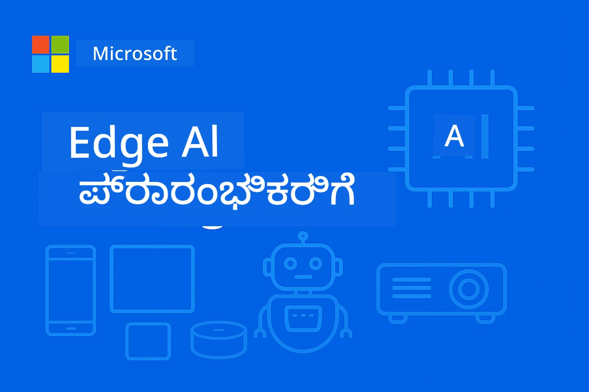

# ಆರಂಭಿಕರಿಗಾಗಿ ಎಡ್ಜ್ಐಎಐ 



[](https://GitHub.com/microsoft/edgeai-for-beginners/graphs/contributors)
[](https://GitHub.com/microsoft/edgeai-for-beginners/issues)
[](https://GitHub.com/microsoft/edgeai-for-beginners/pulls)
[](http://makeapullrequest.com)

[](https://GitHub.com/microsoft/edgeai-for-beginners/watchers)
[](https://GitHub.com/microsoft/edgeai-for-beginners/fork)
[](https://GitHub.com/microsoft/edgeai-for-beginners/stargazers)

[](https://discord.gg/nTYy5BXMWG)

ಈ ಸಂಪನ್ಮೂಲಗಳನ್ನು ಬಳಸಲು ಆರಂಭಿಸಲು ಈ ಹಂತಗಳನ್ನು ಅನುಸರಿಸಿ:

1. **Repositories ನ್ನು Fork ಮಾಡಿ**: ಕ್ಲಿಕ್ ಮಾಡಿ [](https://GitHub.com/microsoft/edgeai-for-beginners/fork)
2. **Repository ನ್ನು ಕ್ಲೋನ್ ಮಾಡಿ**:   `git clone https://github.com/microsoft/edgeai-for-beginners.git`
3. [**Azure AI Foundry Discord ಗೆ ಸೇರಿ ಮತ್ತು ತಜ್ಞರು ಮತ್ತು ఇతర ಅಭಿವೃದ್ಧಿದಾರರನ್ನು ಭೇಟಿಯಾಗಿರಿ**](https://discord.com/invite/ByRwuEEgH4)


### 🌐 ಬಹುಭಾಷಾ ಬೆಂಬಲ

#### GitHub Action (ಸ್ವಯಂಚಾಲಿತ ಮತ್ತು ಯಾವಾಗಲೂ تازه) ಮೂಲಕ ಬೆಂಬಲಿಸಲಾಗುತ್ತಿದೆ

<!-- CO-OP TRANSLATOR LANGUAGES TABLE START -->
[Arabic](../ar/README.md) | [Bengali](../bn/README.md) | [Bulgarian](../bg/README.md) | [Burmese (Myanmar)](../my/README.md) | [Chinese (Simplified)](../zh-CN/README.md) | [Chinese (Traditional, Hong Kong)](../zh-HK/README.md) | [Chinese (Traditional, Macau)](../zh-MO/README.md) | [Chinese (Traditional, Taiwan)](../zh-TW/README.md) | [Croatian](../hr/README.md) | [Czech](../cs/README.md) | [Danish](../da/README.md) | [Dutch](../nl/README.md) | [Estonian](../et/README.md) | [Finnish](../fi/README.md) | [French](../fr/README.md) | [German](../de/README.md) | [Greek](../el/README.md) | [Hebrew](../he/README.md) | [Hindi](../hi/README.md) | [Hungarian](../hu/README.md) | [Indonesian](../id/README.md) | [Italian](../it/README.md) | [Japanese](../ja/README.md) | [Kannada](./README.md) | [Korean](../ko/README.md) | [Lithuanian](../lt/README.md) | [Malay](../ms/README.md) | [Malayalam](../ml/README.md) | [Marathi](../mr/README.md) | [Nepali](../ne/README.md) | [Nigerian Pidgin](../pcm/README.md) | [Norwegian](../no/README.md) | [Persian (Farsi)](../fa/README.md) | [Polish](../pl/README.md) | [Portuguese (Brazil)](../pt-BR/README.md) | [Portuguese (Portugal)](../pt-PT/README.md) | [Punjabi (Gurmukhi)](../pa/README.md) | [Romanian](../ro/README.md) | [Russian](../ru/README.md) | [Serbian (Cyrillic)](../sr/README.md) | [Slovak](../sk/README.md) | [Slovenian](../sl/README.md) | [Spanish](../es/README.md) | [Swahili](../sw/README.md) | [Swedish](../sv/README.md) | [Tagalog (Filipino)](../tl/README.md) | [Tamil](../ta/README.md) | [Telugu](../te/README.md) | [Thai](../th/README.md) | [Turkish](../tr/README.md) | [Ukrainian](../uk/README.md) | [Urdu](../ur/README.md) | [Vietnamese](../vi/README.md)

> **ಸ್ಥಳೀಯವಾಗಿ ಕ್ಲೋನ್ ಮಾಡಬೇಕೆಂದು ಇಚ್ಛಿಸುತ್ತೀರಾ?**

> ಈ repository 50()+ ಭಾಷಾ ಅನುವಾದಗಳನ್ನು ಒಳಗೊಂಡಿದೆ, ಇದು ಡೌನ್‌ಲೋಡ್ ಗಾತ್ರವನ್ನು ಗಣನೀಯವಾಗಿ ಹೆಚ್ಚಿಸುತ್ತದೆ. ಅನುವಾದಗಳಿಲ್ಲದೆ ಕ್ಲೋನ್ ಮಾಡಲು sparse checkout ಬಳಸಿ:
> ```bash
> git clone --filter=blob:none --sparse https://github.com/microsoft/edgeai-for-beginners.git
> cd edgeai-for-beginners
> git sparse-checkout set --no-cone '/*' '!translations' '!translated_images'
> ```
> ಇದರಿಂದ ನಿಮಗೆ ಹೆಚ್ಚು ವೇಗವಾಗಿ ಡೌನ್‌ಲೋಡ್ ಮಾಡಿ ಕೋರ್ಸ್ ಮುಗಿಸುವ ನಿರ್ದಿಷ್ಟ ಅಗತ್ಯಗಳೆಲ್ಲವು ದೊರಕುತ್ತದೆ.
<!-- CO-OP TRANSLATOR LANGUAGES TABLE END -->

**ಹೆಚ್ಚಿನ ಅನುವಾದ ಭಾಷೆಗಳನ್ನು ಬೆಂಬಲಿಸಲು, ಅವುಗಳನ್ನು [ಇಲ್ಲಿ](https://github.com/Azure/co-op-translator/blob/main/getting_started/supported-languages.md) ಪಟ್ಟಿ ಮಾಡಲಾಗಿವೆ**

## ಪರಿಚಯ

**ಅರ್ಹರಿಗಾಗಿ ಎಡ್ಜ್ಐಎಐ** ಗೆ ಸ್ವಾಗತ – ಬದಲಾವಣೆಯ Edge ಕೃತಕ ಬುದ್ಧಿಮತ್ತೆಯ ಲೋಕಕ್ಕೆ ನಿಮ್ಮ ಸಂಪೂರ್ಣ ಪಯಣ. ಈ ಪಠ್ಯಕೋರ್ಸ್ ಶಕ್ತಿಶಾಲಿ AI ಸಾಮರ್ಥ್ಯಗಳನ್ನು ಮತ್ತು ಪ್ರಾಯೋಗಿಕ, ನಿಜದ ಜಗತ್ತಿನ edge ಸಾಧನಗಳ ಮೇಲೆ ನಿಯೋಜಿಸುವ ಜೋಡಣೆಯನ್ನು ಸೇರ್ಪಡೆಮಾಡುತ್ತದೆ, ಡೇಟಾ ಸೃಷ್ಟಿಸಲಾಗುವ ಮತ್ತು ನಿರ್ಧಾರಗಳು ತೆಗೆದುಕೊಳ್ಳಬೇಕಾದ ಸಹಜ ಸ್ಥಳದಲ್ಲಿ ನೇರವಾಗಿ AI ಯ ಸಾಮರ್ಥ್ಯವನ್ನು ಯುಜರ್‌ಗಳಿಗೆ ಒದಗಿಸುತ್ತದೆ.

### ನೀವು ಏನು ಕಲಿಯುತ್ತೀರಿ

ಈ ಕೋರ್ಸ್ ಮೌಲಿಕ ಸಿದ್ಧಾಂತಗಳಿಂದ ಉದ್ಯಮ ಸ್ಥಿತಿಗೆ ಸಿದ್ಧಪಡಿಸುವ ಅನುಷ್ಠಾನಗಳವರೆಗೂ ಸಾಗುತ್ತದೆ, ಒಳಗೊಂಡಿದೆ:
- **ಸಣ್ಣ ಭಾಷಾ ಮಾದರಿಗಳು (SLMs)** edge ನಿಯೋಜನಿಗೆ ವಿಶಿಷ್ಟಗೊಳಿಸಲಾಗಿದೆ
- **ಹಾರ್ಡ್‌ವೇರ್ ಜಾಗರೂಕತೆ ಆಧಾರಿತ ಪರಿಷ್ಕರಣೆ** ವಿಭಿನ್ನ ವೇದಿಕೆಗಳಲ್ಲಿ
- **ನಿಜ-ಕಾಲೀನ ಅನುಮಾನ** ಗೋಪ್ಯತೆ ರಕ್ಷಿಸುವ ಸಾಮರ್ಥ್ಯಗಳೊಂದಿಗೆ
- **ಉದ್ಯಮ ನಿರ್ವಹಣಾ ಯೋಜನೆಗಳು** ಉದ್ಯಮ ಅಪ್ಲಿಕೇಶನ್‌ಗಳಿಗೆ

### ಏಕೆ ಎಡ್ಜ್ಐಎಐ ಮಹತ್ವವಿದೆ

Edge AI ಒಂದು ಕ್ರಮೇಣ ಬದಲಾವಣೆಯನ್ನು ಪ್ರತಿನಿಧಿಸುತ್ತದೆ, ಅದು ಪ್ರಸ್ತುತ ತಲೆಮಾರುಗಳ ಪ್ರಮುಖ ಸವಾಲುಗಳನ್ನನು ಕಂಡುಹಿಡಿಯುತ್ತದೆ:
- **ಗೋಪ್ಯತೆ ಮತ್ತು ಭದ್ರತೆ**: ಸಂವೇದನಶೀಲ ಡೇಟಾವನ್ನು ಸ್ಥಳೀಯವಾಗಿ ಸಂಸ್ಕರಿಸಿ ಮേഘದಿಂದ ರಕ್ಷಿಸುವುದು
- **ನಿಜ-ಕಾಲೀನ ಕಾರ್ಯಕ್ಷಮತೆ**: ನಾನು ತುಂಬಾ ಸಮಯ ಅಗತ್ಯವಿರುವ ಅಪ್ಲಿಕೇಶನ್‌ಗಳಿಗೆ ನೆಟ್ವರ್ಕ್ ವಿಳಂಬವನ್ನು ದೂರ ಮಾಡುವುದು
- **ವೆಚ್ಚದ ದಕ್ಷತೆ**: ಬ್ಯಾಂಡ್‌ವಿಡ್ತ್ ಮತ್ತು ಮేఘ ಗಣಕ ವೆಚ್ಚ ಕಡಿಮೆ ಮಾಡುವುದು
- **ಮುಚ್ಚಳ ಕಾರ್ಯಾಚರಣೆಗಳು**: ನೆಟ್ವರ್ಕ್ ಸಮಸ್ಯೆ кезінде ಕಾರ್ಯ ನಿರ್ವಹಿಸುವ\Json
- **ನಿಯಂತ್ರಣ ನಿಯಮ ಪಾಲನೆ**: ಡೇಟಾ ಸ್ವಾಯತ್ತತ್ವಕ್ಕಾಗಿ ಅಗತ್ಯಗಳನ್ನು ಪೂರೈಸುವುದು

### ಎಡ್ಜ್ ಎಐ

Edge AI ಅಂದರೆ AI ಅಲ್ಗೋರಿದಮ್‌ಗಳು ಮತ್ತು ಭಾಷಾ ಮಾದರಿಗಳನ್ನು ಡೇಟಾ ಉತ್ಪತ್ತಿಯಾಗುವ ಹತ್ತಿರವೇ ಹಾರ್ಡ್‌ವೇರ್‌ನಲ್ಲಿ ಚಾಲನೆ ಮಾಡಲು ಮನ:ಮಾಧ್ಯಮ ವಶಪಡಿಸದೆ ಕಾರ್ಯಗತಗೊಳಿಸುವುದು. ಇದು ವಿಳಂಬವನ್ನು ಕಡಿಮೆ ಮಾಡುತ್ತದೆ, ಗೌಪ್ಯತೆಯನ್ನು ಹೆಚ್ಚು ಮಾಡುತ್ತದೆ ಮತ್ತು ನಿಜ-ಕಾಲೀನ ನಿರ್ಧಾರ ಕೈಗೊಳ್ಳುವಿಕೆಗೆ ಅವಕಾಶ ನೀಡುತ್ತದೆ.

### ಮುಖ್ಯ ತತ್ವಗಳು:
- **ಸಾಧನದ ಮೇಲೆ ನೇರ ಅನುಮಾನ**: AI ಮಾದರಿಗಳು edge ಸಾಧನಗಳ (ಫೋನ್‌ಗಳು, ರೂಟರ್‌ಗಳು, ಮೈಕ್ರೋಕಂಟ್ರೋಲರ್‌ಗಳು, ಕೈಗಾರಿಕಾ PCs) ಮೇಲೆ ಕಾರ್ಯನಿರ್ವಹಿಸುತ್ತವೆ
- **ಆಫ್‌ಲೈನ್ ಸಾಮರ್ಥ್ಯ**: ನಿರಂತರ ಇಂಟರ್ನೆಟ್ ಸಂಪರ್ಕವಿಲ್ಲದೆ ಕಾರ್ಯಾಚರಣೆ
- **ಕೆಳಗಿನ ವಿಳಂಬ**: ನಿಗದಿತ ಸಮಯ ವ್ಯವಸ್ಥೆಗಳಿಗೆ ತಕ್ಷಣದ ಪ್ರತಿಕ್ರಿಯೆಗಳು
- **ಡೇಟಾ ಸ್ವಾಯತ್ತತ್ವ**: ಸಂವೇದನಶೀಲ ಡೇಟಾವನ್ನು ಸ್ಥಳೀಯವಾಗಿ ಇಟ್ಟುಕೊಂಡು ಭದ್ರತೆ ಮತ್ತು ನಿಯಮ ಪಾಲನೆಯನ್ನು ಸುಧಾರಿಸುತ್ತದೆ

### ಸಣ್ಣ ಭಾಷಾ ಮಾದರಿಗಳು (SLMs)

Phi-4, Mistral-7B ಮತ್ತು Gemma ಹೀಗೆ SLMಗಳು ದೊಡ್ಡ LLMಗಳ ಸಂವರ್ಧಿತ ಆವೃತ್ತಿಗಳು—ಶಿಕ್ಷಣಗೊಳ್ಳಲಾದ ಅಥವಾ ಸಂಕುಚಿತಗೊಂಡ:
- **ಕಡಿಮೆಯಾದ ಮೆಮೊರಿ ಬಳಕೆ**: ಸೀಮಿತ edge ಸಾಧನ ಮೆಮೊರಿಯ ಪರಿಣಾಮಕಾರಿ ಉಪಯೋಗ
- **ಕಡಿಮೆ ಗಣನೆ ಬೇಡಿಕೆ**: CPU ಮತ್ತು edge GPU ಕಾರ್ಯಕ್ಷಮತೆಗೆ ತಕ್ಕಂತೆ ಪರಿಷ್ಕೃತ
- **ವೇಗವಾದ ಪ್ರಾರಂಭ ಸಮಯಗಳು**: ಪ್ರತಿಕ್ರಿಯಾಶೀಲ ಅಪ್ಲಿಕೇಶನ್‌ಗಳಿಗೆ ವೇಗದ ಪ್ರಾರಂಭ

ಅವು ಶಕ್ತಿಶಾಲಿ NLP ಸಾಮರ್ಥ್ಯಗಳನ್ನು ಅನ್ಲಾಕ್ ಮಾಡುತ್ತವೆ ಮತ್ತು ಇಲ್ಲಿಯ ಜಾನುವಾರುಗಳ ನಿರ್ಬಂಧಗಳನ್ನು ಹumine:

- **ಎಂಬೆಡ್ಡೆಡ್ ಸಿಸ್ಟಂಗಳು**: IoT ಸಾಧನಗಳು ಮತ್ತು ಕೈಗಾರಿಕಾ ನಿಯಂತ್ರಣಯಂತ್ರಗಳು
- **ಮೊಬೈಲ್ ಸಾಧನಗಳು**: ಸ್ಮಾರ್ಟ್‌ಫೋನ್ಗಳು ಮತ್ತು ಟ್ಯಾಬ್ಲೆಟ್‌ಗಳು ಆಫ್‌ಲೈನ್ ಸಾಮರ್ಥ್ಯಗಳೊಂದಿಗೆ
- **IoT ಸಾಧನಗಳು**: ಸಿಂಸೇರ್‌ಗಳು ಮತ್ತು ಸೀಮಿತ ಸಂಪನ್ಮೂಲಗಳನ್ನು ಒಳಗೊಂಡ ಸ್ಮಾರ್ಟ್ ಸಾಧನಗಳು
- **ಎಡ್ಜ್ ಸರ್ವರ್‌ಗಳು**: ಸೀಮಿತ GPU ಸಂಪನ್ಮೂಲಗಳೊಂದಿಗೆ ಸ್ಥಳೀಯ ಪ್ರಕ್ರಿಯೆ ಘಟಕಗಳು
- **ವೈಯಕ್ತಿಕ ಕಂಪ್ಯೂಟರ್‌ಗಳು**: ಡೆಸ್ಕ್‌ಟಾಪ್ ಮತ್ತು ಲ್ಯಾಪ್‌ಟಾಪ್ ನಿಯೋಜನಾ ದೃಶ್ಯಗಳು

## ಕೋರ್ಸ್ ಮೋಡ್ಯೂಲುಗಳು ಮತ್ತು ನ್ಯಾವಿಗೇಷನ್

| ಮೋಡ್ಯೂಲು | ವಿಷಯ | ಗಮನಾರ್ಹ ಕ್ಷೇತ್ರ | ಪ್ರಮುಖ ವಿಷಯ | ಮಟ್ಟ | ಅವಧಿ |
|--------|-------|------------|-------------|--------|----------|
| [📖 00 ](./introduction.md) | [EdgeAI ಗೆ ಪರಿಚಯ](./introduction.md) | יסוד ಮತ್ತು ಹಿನ್ನೆಲೆ | ಎಡ್ಜ್ಐಎಐ ಅವಲೋಕನ • ಕೈಗಾರಿಕಾ ಅಪ್ಲಿಕೇಶನ್‌ಗಳು • SLM ಪರಿಚಯ • ಕಲಿಕೆ ಉದ್ದೇಶಗಳು | ಆರಂಭಿಕ | 1-2 ಘಂ |
| [📚 01](../../Module01) | [EdgeAI ಮೂಲಲಕ್ಷಣಗಳು](./Module01/README.md) | ಕ್ಲೌಡ್ vs ಎಡ್ಜ್ ಎಐ ಹೋಲಿಕೆ | ಎಡ್ಜ್ಐಎಐ ಮೂಲಗಳು • ನಿಜಜೀವನ ಪ್ರಕರಣ ಅಧ್ಯಯನಗಳ • ಅನುಷ್ಠಾನ ಮಾರ್ಗದರ್ಶಿ • ಎಡ್ಜ್ ನಿಯೋಜನೆ | ಆರಂಭಿಕ | 3-4 ಘಂ |
| [🧠 02](../../Module02) | [SLM ಮಾದರಿ ಆಧಾರಗಳು](./Module02/README.md) | ಮಾದರಿ ಕುಟುಂಬಗಳು ಮತ್ತು ವಿನ್ಯಾಸ | ಫೈ ಗುಂಪು • ಕ್ವೆನ್ ಗುಂಪು • ಜೆಮ್ಮಾ ಗುಂಪು • BitNET • μModel • ಫೈ-ಶಿಲಿಕಾ | ಆರಂಭಿಕ | 4-5 ಘಂ |
| [🚀 03](../../Module03) | [SLM ನಿಯೋಜನೆ ಅಭ್ಯಾಸ](./Module03/README.md) | ಸ್ಥಳೀಯ ಮತ್ತು ಕ್ಲೌಡ್ ನಿಯೋಜನೆ | ಒದಗಿಸಿದ ಅಭ್ಯಾಸಗಳು • ಸ್ಥಳೀಯ ಪರಿಸರ • ಕ್ಲೌಡ್ ನಿಯೋಜನೆ | ಮಧ್ಯಮ | 4-5 ಘಂ |
| [⚙️ 04](../../Module04) | [ಮಾದರಿ ಪರಿಷ್ಕರಣೆ ಸಾಧನ](./Module04/README.md) | ಕ್ರಾಸ್-ಪ್ಲಾಟ್‌ಫಾರ್ಮ್ ಪರಿಷ್ಕರಣೆ | ಪರಿಚಯ • Llama.cpp • Microsoft Olive • OpenVINO • Apple MLX • ಕೆಲಸ ಪ್ರಕ್ರಿಯೆ ಸಂಯೋಜನೆ | ಮಧ್ಯಮ | 5-6 ಘಂ |
| [🔧 05](../../Module05) | [SLMOps ಪ್ರೊಡಕ್ಷನ್](./Module05/README.md) | ಉತ್ಪಾದನಾ ಕಾರ್ಯಾಚರಣೆಗಳು | SLMOps ಪರಿಚಯ • ಮಾದರಿ ಸಂಕುಚಿತ • ಸೂಕ್ಷ್ಮ-ಗುಣೋಪಯೋಗಿ ಬದಲಾವಣೆ • ಉತ್ಪಾದನಾ ನಿಯೋಜನೆ | ಉನ್ನತ | 5-6 ಘಂ |
| [🤖 06](../../Module06) | [AI ಏಜೆಂಟರು ಮತ್ತು ಫಂಕ್ಷನ್ ಕಾಲಿಂಗ್](./Module06/README.md) | ಏಜೆಂಟ್ ರೂಪರೇಖೆಗಳು ಮತ್ತು MCP | ಏಜೆಂಟ್ ಪರಿಚಯ • ಫಂಕ್ಷನ್ ಕಾಲಿಂಗ್ • ಮಾದರಿ ಪ್ರಾಸಂಗಿಕ ಪ್ರೋಟೋಕಾಲ್ | ಉನ್ನತ | 4-5 ಘಂ |
| [💻 07](../../Module07) | [ವೇದಿಕೆ ಅನುಷ್ಠಾನ](./Module07/README.md) | ಕ್ರಾಸ್-ಪ್ಲಾಟ್‌ಫಾರ್ಮ್ ಉದಾಹರಣೆಗಳು | AI ಸಾಧನಗಳು • ಫೌಂಡ್ರಿ ಸ್ಥಳೀಯ • ವಿಂಡೋಸ್ ಅಭಿವೃದ್ಧಿ | ಉನ್ನತ | 3-4 ಘಂ |
| [🏭 08](../../Module08) | [ಫೌಂಡ್ರಿ ಸ್ಥಳೀಯ ಸಾಧನಗಳು](./Module08/README.md) | ಉತ್ಪನ್ನ-ಾವೃತ್ತಿ ಉದಾಹರಣೆಗಳು | ಉದಾಹರಣೆ ಅಪ್ಲಿಕೇಶನ್‌ಗಳು (ಕೆಳಗಿನ ವಿವರ ನೋಡಿ) | ಪರಿಣತ | 8-10 ಘಂ |

### 🏭 **ಮೋಡ್ಯೂಲು 08: ಉದಾಹರಣಾ ಅಪ್ಲಿಕೇಶನ್‌ಗಳು**

- [01: REST ಚಾಟ್ ತ್ವರಿತ ಪ್ರಾರಂಭ](./Module08/samples/01/README.md)
- [02: OpenAI SDK ಏಕೀಕರಣ](./Module08/samples/02/README.md)
- [03: ಮಾದರಿ ಅನ್ವೇಷಣೆ ಮತ್ತು ಬೆಂಚ್‌ಮಾರ್ಕಿಂಗ್](./Module08/samples/03/README.md)
- [04: Chainlit RAG ಅಪ್ಲಿಕೇಶನ್](./Module08/samples/04/README.md)
- [05: ಬಹು ಏಜೆಂಟ್ ಸಂಚಲನೆ](./Module08/samples/05/README.md)
- [06: ಮಾದರಿ-ಆಸರೆ ಟೂಲ್ ರೂಟರ್](./Module08/samples/06/README.md)
- [07: ನೇರ API ಕ್ಲೈಂಟ್](./Module08/samples/07/README.md)
- [08: ವಿಂಡೋಸ್ 11 ಚಾಟ್ ಆಪ್](./Module08/samples/08/README.md)
- [09: ಆಧುನಿಕ ಬಹು ಏಜೆಂಟ್ ವ್ಯವಸ್ಥೆ](./Module08/samples/09/README.md)
- [10: ಫೌಂಡ್ರಿ ಟೂಲ್ಸ್ ಫ್ರೇಮ್ವರ್ಕ್](./Module08/samples/10/README.md)

### 🎓 **ಭಾಗವಹಿಸುವ ಕಾರ್ಯಾಗಾರ: ಕೈಯಿಂದ ಕಲಿಕೆ ಮಾರ್ಗ**

ಉತ್ಪಾದನಾ-ಪ್ರಸ್ತುತ ಅನುಷ್ಠಾನಗಳೊಂದಿಗೆ ಸಮಗ್ರ ಕೈಯಿಂದ ಕಾರ್ಯಾಗಾರ ಸಾಮಗ್ರಿಗಳು:

- **[ಕಾರ್ಯಾಗಾರ ಮಾರ್ಗದರ್ಶಿ](./Workshop/Readme.md)** - ಪೂರ್ಣ ತರಬೇತಿ ಗುರಿಗಳು, ಫಲಿತಾಂಶಗಳು ಮತ್ತು ಸಂಪನ್ಮೂಲ ನ್ಯಾವಿಗೇಷನ್
- **ಪೈಥಾನ್ ಉದಾಹರಣೆಗಳು** (6 ಅಧಿವೇಶನಗಳು) - ಉತ್ತಮ ಅಭ್ಯಾಸಗಳು, ದೋಷ ನಿರ್ವಹಣೆ, ಪೂರಕ ದಾಖಲಾತಿ ಒಂದಾಗಿ ನವೀಕರಿಸಲಾಗಿದೆ
- **ಜುಪಿಟರ್ ನೋಟ್‌ಬುಕ್‌ಗಳು** (8 ಪರಸ್ಪರ ಕ್ರಿಯಾತ್ಮಕ) - ಹಂತ ಹಂತದ ಮಾರ್ಗದರ್ಶಿಗಳು, ಬೆಂಚ್‌ಮಾರ್ಕ್‌ಗಳು ಮತ್ತು ಕಾರ್ಯಕ್ಷಮತೆ ನಿಗಾದಾನಗಳು
- **ಅಧಿವೇಶನ ಮಾರ್ಗದರ್ಶಿಗಳು** - ಪ್ರತಿ ಕಾರ್ಯಾಗಾರ ಅಧಿವೇಶನಕ್ಕೆ ವಿವರವಾದ ಮಾರ್ಕ್‌ಡೌನ್ ಮಾರ್ಗದರ್ಶಿಗಳು
- **ಚೇತನ ಸಾಧನಗಳು** - ಕೋಡ್ ಗುಣಮಟ್ಟ ಪರಿಶೀಲನೆ ಮತ್ತು ಸ್ಮೋಕ್ ಟೆಸ್ಟ್‌ಗಳನ್ನು ನಡೆಸುವ ಸ್ಕ್ರಿಪ್ಟ್‌ಗಳು

**ನೀವು ನಿರ್ಮಿಸುವುದು:**
- ಸ್ಟ್ರೀಮಿಂಗ್ ಬೆಂಬಲದೊಂದಿಗೆ ಸ್ಥಳೀಯ AI ಚಾಟ್ ಅಪ್ಲಿಕೇಶನ್‌ಗಳು
- ಗುಣಮಟ್ಟ ಮೌಲ್ಯಮಾಪನದೊಂದಿಗೆ RAG ಪೈಪ್ಲೈನ್‌ಗಳು (RAGAS)
- ಬಹು ಮಾದರಿ ಬೆಂಚ್‌ಮಾರ್ಕಿಂಗ್ ಮತ್ತು ಹೋಲಿಕೆ ಸಾಧನಗಳು
- ಬಹು ಏಜೆಂಟ್ ಸಂಚಲನೆ ವ್ಯವಸ್ಥೆಗಳು
- ಕಾರ್ಯಾಧಾರಿತ ಆಯ್ಕೆಮಾಡಿಕೊಳ್‌ವುದಕ್ಕಾಗಿ ಬುದ್ಧಿವಂತ ಮಾದರಿ ರೂಟಿಂಗ್

### 🎙️ **ಏಜೆಂಟಿಕ್ ಕಾರ್ಯಾಗಾರ: ಕೈಯಿಂದ - AI ಪೋಡ್‌ಕಾಸ್ಟ್ ಸ್ಟುಡಿಯೋ**

ಬಾಗಿ ಪೂರ್ಣಬದ್ಧ ಬಹು ಏಜೆಂಟ್ ವ್ಯವಸ್ಥೆಯನ್ನು ರಚಿಸುವ, ಕಲ್ಪನೆಗಳನ್ನು ಪ್ರೊಫೆಷನಲ್ ಪೋಡ್‌ಕಾಸ್ಟ್ ಎಪಿಸೋಡ್‌ಗಳಾಗಿ ಪರಿವರ್ತಿಸುವ AI ಚಾಲಿತ ಪೋಡ್‌ಕಾಸ್ಟ್ ಉತ್ಪಾದನಾ ಪೈಪ್ಲೈನ್‌ಗೆ ಕೈಹತ್ತು ನಿರ್ಮಿಸಿ!
**[🎬 ಎಐ ಪಾಡ್‌ಕಾಸ್ಟ್ ಸ್ಟೂಡಿಯೋ ವರ್ಕ್‌ಶಾಪ್ ಆರಂಭಿಸಿ](./WorkshopForAgentic/README.md)**

**ನಿಮ್ಮ ಮಿಷನ್**: "Future Bytes" ಅನ್ನು ಪ್ರಾರಂಭಿಸಿ — ನೀವು ಸ್ವತಃ ನಿರ್ಮಿಸುವ ಸಂಪೂರ್ಣವಾಗಿ AI ಏಜೆಂಟ್‌ಗಳು ಚಾಲಿತ ಟೆಕ್ ಪಾಡ್‌ಕಾಸ್ಟ್. ಯಾವುದೇ ಕ್ಲೌಡ್ ಅವಲಂಬನೆ ಇಲ್ಲ, API ವೆಚ್ಚಗಳು ಇಲ್ಲ — ಎಲ್ಲವೂ ನಿಮ್ಮ ಯಂತ್ರದಲ್ಲಿ ಸ್ಥಳೀಯವಾಗಿ ನಡೀತವೆ.

**ಇದನ್ನು ವೈಶಿಷ್ಟ್ಯಮಯ ಮಾಡುವುದು:**
- **🤖 ನಿಜವಾದ ಬಹು-ಏಜೆಂಟ್ ವ್ಯವಸ್ಥಾಪನೆ** - ಸಂಶೋಧನೆ, ಬರವಣಿಗೆ ಮತ್ತು ಧ್ವನಿಸುತ್ತದೆ ಉತ್ಪತ್ತಿ ಮಾಡುವ ವಿಶೇಷ AI ಏಜೆಂಟ್‌ಗಳನ್ನು ನಿರ್ಮಿಸಿ  
- **🎯 ಸಂಪೂರ್ಣ ಉತ್ಪಾದನಾ ಪೈಪ್ಲೈನ್** - ವಿಷಯ ಆಯ್ಕೆಮತ್ತು ಅಂತಿಮ ಪಾಡ್‌ಕಾಸ್ಟ್ ಧ್ವನಿ ಔಟ್‌ಪುಟ್  
- **💻 100% ಸ್ಥಳೀಯ ನಿಯೋಜನೆ** - ಒಲ್ಲಾಮಾ ಮತ್ತು ಸ್ಥಳೀಯ ಮಾದರಿಗಳನ್ನು (Qwen-3-8B) ಬಳಸಿ ಸಂಪೂರ್ಣ ಗೌಪ್ಯತೆ ಮತ್ತು ನಿಯಂತ್ರಣ  
- **🎤 ಪಠ್ಯ-ಇಂದ-ಧ್ವನಿ ಸಂಯೋಜನೆ** - ಸ್ಕ್ರಿಪ್ಟ್‌ಗಳನ್ನು ನೈಸರ್ಗಿಕ ಶ್ರವಣೀಯ ಬಹು-ಸ್ವರ ಸಂಭಾಷಣೆಯಲ್ಲಿ ಪರಿವರ್ತಿಸಿ  
- **✋ ಮಾನವ-ನಿಯಂತ್ರಿತ ಕಾರ್ಯಪ ಪ್ರಕಟಣೆಗಳು** - ಗುಣಮಟ್ಟವನ್ನು ಖಾತರಿಪಡಿಸಲು ಅನುಮೋದನೆ ಗೇಟುಗಳು ಕಡತವಾಗಿ ಸ್ವಯಂಚಾಲಿತೆಯನ್ನು ಕಾಯ್ದುಕೊಳ್ಳುತ್ತವೆ  

**ಮೂರು ಅಧ್ಯಾಯದ ಕಲಿಕೆಯ ಪ್ರಯಾಣ:**

| ಅಧ್ಯಾಯ | ಗಮನ | ಮುಖ್ಯ ಕೌಶಲ್ಯಗಳು | ಅವಧಿ |
|-----|-------|------------|----------|
| **[ಅಧ್ಯಾಯ 1: ನಿಮ್ಮ AI ಸಹಾಯಕులను ಭೇಟಿಯಾಗಿರಿ](./WorkshopForAgentic/md/01.BuildAIAgentWithSLM.md)** | ನಿಮ್ಮ ಮೊದಲ AI ಏಜೆಂಟ್ ನಿರ್ಮಿಸಿ | ಸಾಧನ ಸಂಯೋಜನೆ • ವೆಬ್ ಶೋಧನೆ • ಸಮಸ್ಯೆ ಪರಿಹಾರ • ಏಜೆಂಟ್ ತರ್ಕ | 2-3 ಗಂಟೆಗಳು |
| **[ಅಧ್ಯಾಯ 2: ನಿಮ್ಮ ಉತ್ಪಾದನಾ ತಂಡವನ್ನು ಜೋಡಿಸಿ](./WorkshopForAgentic/md/02.AIAgentOrchestrationAndWorkflows.md)** | ಬಹು-ಏಜೆಂಟ್ ಗಳನ್ನು ವ್ಯವಸ್ಥಾಪಿಸಿ | ತಂಡ ಸಂಯೋಜನೆ • ಅನುಮೋದನೆ ಕಾರ್ಯಪ್ರವಾಹಗಳು • ಡೆವ್ಇಯುಐ ಇಂಟರ್‌ಫೇಸ್ • ಮಾನವ ಮೇಲ್ವಿಚಾರಣೆ | 3-4 ಗಂಟೆಗಳು |
| **[ಅಧ್ಯಾಯ 3: ನಿಮ್ಮ ಪಾಡ್‌ಕಾಸ್ಟ್‌ಗೆ ಜೀವಂತಿಕೆ ಕೊಡಿ](./WorkshopForAgentic/md/03.Multi-SpeakerPodcastGenerationWithVibeVoice.md)** | ಪಾಡ್‌ಕಾಸ್ಟ್ ಧ್ವನಿ ಉತ್ಪತ್ತಿ | ಪಠ್ಯ-ಇಂದ-ಧ್ವನಿ • ಬಹು-ಸ್ವರ ಸಂಶ್ಲೇಷಣೆ • ಟದ್ದೀರ್ಘ ಔಡಿಯೋ • ಸಂಪೂರ್ಣ ಸ್ವಯಂಚಾಲನೆ | 2-3 ಗಂಟೆಗಳು |

**ಬಳಸುವ ತಂತ್ರಜ್ಞಾನಗಳು:**
- **Microsoft ಏಜೆಂಟ್ ಫ್ರೇಮ್ವರ್ಕ್** - ಬಹು-ಏಜೆಂಟ್ ವ್ಯವಸ್ಥಾಪನೆ ಮತ್ತು ಸಂಯೋಜನೆ  
- **Ollama** - ಸ್ಥಳೀಯ AI ಮಾದರಿ ರನ್‌ಟೈಮ್ (ಕ್ಲೌಡ್ ಅಗತ್ಯವಿಲ್ಲ)  
- **Qwen-3-8B** - ಏಜೆಂಟಿಕ್ ಕಾರ್ಯಗಳಿಗೆ ಆಪ್ಟಿಮೈಸ್ ಮಾಡಲಾದ ಓಪನ್-ಸೋರ್ಸ್ ಭಾಷಾ ಮಾದರಿ  
- **ಪಠ್ಯ-ಇಂದ-ಧ್ವನಿ APIಗಳು** - ಪಾಡ್‌ಕಾಸ್ಟ್ ಉತ್ಪಾದನಗಾಗಿ ನೈಸರ್ಗಿಕ ಧ್ವನಿ ಸಂಶ್ಲೇಷಣೆ  

**ಹಾರ್ಡ್‌ವೇರ್ ಬೆಂಬಲ:**
- ✅ **CPU ಮೋಡ್** - ಯಾವುದೇ თანამედೋರುಕ ಗಣಕಯಂತ್ರದಲ್ಲಿ ಕಾರ್ಯನಿರ್ವಹಿಸುತ್ತದೆ (8GB+ RAM ಶಿಫಾರಸು)  
- 🚀 **GPU ವೇಗವರ್ಧನೆ** - NVIDIA/AMD GPU ಗಳೊಂದಿಗೆ ಇನ್ಫರೆನ್ಸ್ ಅತ್ಯಂತ ವೇಗವಾಗಿ  
- ⚡ **NPU ಬೆಂಬಲ** - ಮುಂದಿನ ತಲಾಗುವ ನ್ಯೂರಲ್ ಪ್ರೊಸيسಿಂಗ್ ಯೂನಿಟ್ ವೇಗವರ್ಧನೆ  

**ಅತ್ಯುತ್ತಮವಾಗಿ:**
- ಬಹು-ಏಜೆಂಟ್ AI ವ್ಯವಸ್ಥೆಗಳ ಕಲಿಕೆಗೆ ಡೆವಲಪರ್‌ಗಳು  
- AI ಸ್ವಯಂಚಾಲನೆ ಮತ್ತು ಕಾರ್ಯಪ್ರವಾಹಗಳಲ್ಲಿ ಆಸಕ್ತರು  
- AI-ಸಹಾಯಕ ಉತ್ಪಾದನೆ ಅನ್ವೇಷಿಸುವ ವಿಷಯ ರಚನೆಗಾರರು  
- ಕಾರ್ಯನಿರ್ವಹಣಾತ್ಮಕ AI ವ್ಯವಸ್ಥೆಗಳ ಓದುಗ ವಿದ್ಯಾರ್ಥಿಗಳು  

**ಆರಂಭಿಸಿ ನಿರ್ಮಿಸು**: [🎙️ ಎಐ ಪಾಡ್‌ಕಾಸ್ಟ್ ಸ್ಟೂಡಿಯೋ ವರ್ಕ್‌ಶಾಪ್ →](./WorkshopForAgentic/README.md)

### 📊 **ಕಲಿಕೆಗೆ ಮಾರ್ಗಸೂಚಿ**

- **ಒಟ್ಟು ಅವಧಿ**: 36-45 ಗಂಟೆಗಳು  
- **ಪ್ರಾಥಮಿಕ ಮಾರ್ಗ**: ಮೊಡ್ಯೂಲ್‌ಗಳು 01-02 (7-9 ಗಂಟೆಗಳು)  
- **ಮಧ್ಯಮ ಮಾರ್ಗ**: ಮೊಡ್ಯೂಲ್‌ಗಳು 03-04 (9-11 ಗಂಟೆಗಳು)  
- **ಅತ್ಯಾಧುನಿಕ ಮಾರ್ಗ**: ಮೊಡ್ಯೂಲ್‌ಗಳು 05-07 (12-15 ಗಂಟೆಗಳು)  
- **ನಿಪುಣ ಮಾರ್ಗ**: ಮೊಡ್ಯೂಲ್ 08 (8-10 ಗಂಟೆಗಳು)  

## ನೀವು ಏನು ನಿರ್ಮಿಸುವಿರಿ

### 🎯 ಮುಖ್ಯ ಕೌಶಲ್ಯಗಳು  
- **ಎಡ್ಜ್ ಎಐ ಸ್ಥಾಪನೆ**: ಕ್ಲೌಡ್ ಸಂಯೋಜನೆಯೊಂದಿಗೆ ಸ್ಥಳೀಯ-ಪ್ರಥಮ AI ವ್ಯವಸ್ಥೆಗಳ ವಿನ್ಯಾಸ  
- **ಮಾದರಿ ಆಪ್ಟಿಮೈಸೇಶನ್**: ಎಡ್ಜ್ ನಿಯೋಜನೆಗಾಗಿ ಮಾದರಿಗಳನ್ನು ಕ್ವಾಂಟೈಸು ಮತ್ತು ಸಂಕೋಚಿಸು (85% ವೇಗ ವೃದ್ಧಿ, 75% ಗಾತ್ರ ಕಡಿತ)  
- **ಬಹು-ಪ್ಲಾಟ್‌ಫಾರ್ಮ್ ನಿಯೋಜನೆ**: ವಿಂಡೋವ್ಸ್, ಮೊಬೈಲ್,.embedded ಮತ್ತು ಕ್ಲೌಡ್-ಎಡ್ಜ್ ಸಂಕ್ರಮಣ ವ್ಯವಸ್ಥೆಗಳು  
- **ಉತ್ಪಾದನಾ ಕಾರ್ಯಾಚರಣೆಗಳು**: ಎಡ್ಜ್ AI ನ ಮೌಲ್ಯಾಂಕನ, ಸ್ಕೇಲಿಂಗ್ ಮತ್ತು ನಿರ್ವಹಣೆ  

### 🏗️ ಪ್ರಾಯೋಗಿಕ ಯೋಜನೆಗಳು  
- **Foundry ಸ್ಥಳೀಯ ಚಾಟ್ ಅಪ್ಲಿಕೇಶನ್ ಗಳು**: ಮಾದರಿ ಬದಲಾವಣೆ ಹೊಂದಿರುವ ವಿಂಡೋವ್ಸ್ 11 ಮೂಲ ಆಪ್  
- **ಬಹು-ಏಜೆಂಟ್ ಪದ್ದತಿಗಳು**: ಸಂಕೀರ್ಣ ಕಾರ್ಯಪ್ರವಾಹಗಳಿಗಾಗಿ ತಜ್ಞ ಏಜೆಂಟ್‌ಗಳೊಂದಿಗೆ ಸಂಯೋಜಕ  
- **RAG ಅಪ್ಲಿಕೇಶನ್ ಗಳು**: ಸ್ಥಳೀಯ ಡಾಕ್ಯುಮೆಂಟ್ ಸಂಸ್ಕರಣೆ ಮತ್ತು ವೆಕ್ಟರ್ ಹುಡುಕು  
- **ಮಾದರಿ ರೌಟರ್‌ಗಳು**: ಕಾರ್ಯ ವಿಶ್ಲೇಷಣೆಯ ಆಧಾರದ ಮೇಲೆ ಮಾದರಿ ಆಯ್ಕೆ ಮಾಡುವ ಬುದ್ಧಿವಂತಿಕೆ  
- **API ಫ್ರೇಮ್ವರ್ಕ್‌ಗಳು**: ಸ್ಟ್ರೀಮಿಂಗ್ ಮತ್ತು ಆರೋಗ್ಯ ಹಣಕುವ ಬಳಕೆದಾರರ  
- **ಕ್ರಾಸ್-ಪ್ಲాట్‌ಫಾರ್ಮ್ ಸಾಧನಗಳು**: LangChain/Semantic Kernel ಸಂಯೋಜನೆ ಮಾದರಿಗಳು  

### 🏢 ಉದ್ಯಮ ಅನ್ವಯಿಕೆಗಳು  
**ತಯಾರಿಕೆ** • **ಆರೋಗ್ಯ ಸೇವೆಗಳು** • **ಸ್ವಯಂಚಾಲಿತ ವಾಹನಗಳು** • **ಬುದ್ಧಿವಂತ ನಗರಗಳು** • **ಮೊಬೈಲ್ ಅಪ್ಲಿಕೇಶನ್ ಗಳು**  

## ತ್ವರಿತ ಪ್ರಾರಂಭ

**ಶಿಫಾರಸುಮಾಡಲಾದ ಕಲಿಕೆ ಮಾರ್ಗ** (ಒಟ್ಟು 20-30 ಗಂಟೆಗಳು):  

0. **📖 ಪರಿಚಯ** ([Introduction.md](./introduction.md)): EdgeAI ಆಧಾರ + ಉದ್ಯಮ ಸಂದರ್ಭ + ಕಲಿಕೆ ಸುಳಿವು  
1. **📚 ಆಧಾರ** (ಮಾಡ್ಯೂಲ್‌ಗಳು 01-02): EdgeAI ಕಲ್ಪನೆಗಳು + SLM ಮಾದರಿ ಕುಟುಂಬಗಳು  
2. **⚙️ ಆಪ್ಟಿಮೈಸೇಶನ್** (ಮಾಡ್ಯೂಲ್‌ಗಳು 03-04): ನಿಯೋಜನೆ + ಕ್ವಾಂಟೈಸೇಶನ್ ಫ್ರೇಮ್ವರ್ಕ್‌ಗಳು  
3. **🚀 ಉತ್ಪಾದನೆ** (ಮಾಡ್ಯೂಲ್‌ಗಳು 05-06): SLMOps + AI ಏಜೆಂಟ್‌ಗಳು + ಕಾರ್ಯ ಆಲೇಖನ  
4. **💻 ಅನುಷ್ಠಾನ** (ಮಾಡ್ಯೂಲ್‌ಗಳು 07-08): ವೇದಿಕೆ ಮಾದರಿಗಳು + Foundry ಸ್ಥಳೀಯ ಉಪಕರಣಗಳು  

ಪ್ರತಿ ಮಾಡ್ಯೂಲ್ ಸಿದ್ಧಾಂತ, ಕೈಯಲ್ಲಿ ಅಭ್ಯಾಸ ಮತ್ತು ಉತ್ಪಾದನಾ ತಯಾರಾದ ಕೋಡ್ ಉದಾಹರಣೆಗಳನ್ನೊಳಗೊಂಡಿದೆ.

## ವೃತ್ತಿ ಪ್ರಭಾವ

**ತಂತ್ರಜ್ಞಾನ ಪಾತ್ರಗಳು**: EdgeAI ಪರಿಹಾರ ವಿನ್ಯಾಸಕಾರ• ML ಎಂಜಿನಿಯರ್ (ಎಡ್ಜ್) • IoT AI ಡೆವಲಪರ್ • ಮೊಬೈಲ್ AI ಡೆವಲಪರ್  

**ಉದ್ಯಮ ಕ್ಷೇತ್ರಗಳು**: ತಯಾರಿಕೆ 4.0 • ಆರೋಗ್ಯ ತಂತ್ರಜ್ಞಾನ • ಸ್ವಯಂಚಾಲಿತ ವ್ಯವಸ್ಥೆಗಳು • ಫಿನ್‌ಟೆಕ್ • ಗ್ರಾಹಕ ಎಲೆಕ್ಟ್ರಾನಿಕ್ಸ್  

**ಪೋರ್ಟ್‌ಫೋಲಿಯೊ ಯೋಜನೆಗಳು**: ಬಹು ಏಜೆಂಟ್ ವ್ಯವಸ್ಥೆಗಳು • ಉತ್ಪಾದನಾ RAG ಅಪ್ಲಿಕೇಶನ್‌ಗಳು • ಕ್ರಾಸ್-ಪ್ಲಾಟ್‌ಫಾರ್ಮ್ ನಿಯೋಜನೆ • ಕಾರ್ಯಕ್ಷಮತೆಯ ಆಪ್ಟಿಮೈಸೇಶನ್  

## ರೆಪೊಸಿಟರಿ ರಚನೆ

```
edgeai-for-beginners/
├── 📖 introduction.md  # Foundation: EdgeAI Overview & Learning Framework
├── 📚 Module01-04/     # Fundamentals → SLMs → Deployment → Optimization  
├── 🔧 Module05-06/     # SLMOps → AI Agents → Function Calling
├── 💻 Module07/        # Platform Samples (VS Code, Windows, Jetson, Mobile)
├── 🏭 Module08/        # Foundry Local Toolkit + 10 Comprehensive Samples
│   ├── samples/01-06/  # Foundation: REST, SDK, RAG, Agents, Routing
│   └── samples/07-10/  # Advanced: API Client, Windows App, Enterprise Agents, Tools
├── 🌐 translations/    # Multi-language support (8+ languages)
└── 📋 STUDY_GUIDE.md   # Structured learning paths & time allocation
```

## ಕೋರ್ಸ್ ಮುಖ್ಯಾಂಶಗಳು

✅ **ಕ్రమೇಣ ಕಲಿಕೆ**: ತತ್ವ → ಅಭ್ಯಾಸ → ಉತ್ಪಾದನಾ ನಿಯೋಜನೆ  
✅ **ನಿಜವಾದ ಪ್ರಕರಣ ಅಧ್ಯಯನಗಳು**: ಮೈಕ್ರೋಸೋಫ್ಟ್, ಜೆಪಾನ್ ಏರ್‌ಲೈನ್ಸ್, ಉದ್ಯಮ ಅನುಷ್ಠಾನಗಳು  
✅ **ಹಾಕಿ-ಮಾಡಿ ಮಾದರಿಗಳು**: 50+ ಉದಾಹರಣೆಗಳು, 10 ಸಂಪೂರ್ಣ Foundry ಸ್ಥಳೀಯ ಡೆಮೋಗಳು  
✅ **ಕಾರ್ಯಕ್ಷಮತೆಯ ಗಮನ**: 85% ವೇಗ ಸುಧಾರಣೆಗಳು, 75% ಗಾತ್ರ ಕಡಿತಗಳು  
✅ **ಬಹು-ಪ್ಲಾಟ್‌ಫಾರ್ಮ್**: ವಿಂडೋವ್ಸ್, ಮೊಬೈಲ್, ಎम्बೆಡ್ಡೆಡ್, ಕ್ಲೌಡ್-ಎಡ್ಜ್ ಹೈಬ್ರಿಡ್  
✅ **ಉತ್ಪಾದನಾ ಸಿದ್ಧತೆ**: ಗಮನಿಕೆ, ವಿಸ್ತರಣೆ, ಸುರಕ್ಷತೆ, ಪಾಲನೆ ಫ್ರೇಮ್ವರ್ಕ್‌ಗಳು  

📖 **[ಅಧ್ಯಯನ ಮಾರ್ಗದರಶಕ ಲಭ್ಯವಿದೆ](STUDY_GUIDE.md)**: 20 ಗಂಟೆಗಳ ರಚಿತ ಕಲಿಕೆ ಮಾರ್ಗ ಮತ್ತು ಸ್ವ-ಮೌಲ್ಯಮಾಪನ ಸಾಧನಗಳೊಂದಿಗೆ.

---

**EdgeAI ಭವಿಷ್ಯದ AI ನಿಯೋಜನೆಯನ್ನು ಪ್ರತಿನಿಧಿಸುತ್ತದೆ**: ಸ್ಥಳೀಯ-ಪ್ರಥಮ, ಗೌಪ್ಯತೆ ಕಾಯ್ದುಕೊಳ್ಳುವ, ಮತ್ತು ಪರಿಣಾಮಕಾರಿ. ಬುದ್ಧಿವಂತ ಅಪ್ಲಿಕೇಶನ್‌ಗಳ ಮುಂದಿನ ತಲೆಮಾರನ್ನು ನಿರ್ಮಿಸಲು ಈ ಕೌಶಲ್ಯಗಳನ್ನು ಅಭ್ಯಾಸ ಮಾಡಿ.

## ಇತರ ಕೋರ್ಸ್‌ಗಳು

ನಮ್ಮ ತಂಡ ಇತರೆ ಕೋರ್ಸ್‌ಗಳನ್ನು ಉತ್ಪಾದಿಸುತ್ತದೆ! ಪರಿಶೀಲಿಸಿ:

<!-- CO-OP TRANSLATOR OTHER COURSES START -->
### ಲಾಂಗ್‌ಚೈನ್  
[](https://aka.ms/langchain4j-for-beginners)  
[](https://aka.ms/langchainjs-for-beginners?WT.mc_id=m365-94501-dwahlin)  

---

### ಅಝುರ್ / ಎಡ್ಜ್ / MCP / ಏಜೆಂಟ್‌ಗಳು  
[](https://github.com/microsoft/AZD-for-beginners?WT.mc_id=academic-105485-koreyst)  
[](https://github.com/microsoft/edgeai-for-beginners?WT.mc_id=academic-105485-koreyst)  
[](https://github.com/microsoft/mcp-for-beginners?WT.mc_id=academic-105485-koreyst)  
[](https://github.com/microsoft/ai-agents-for-beginners?WT.mc_id=academic-105485-koreyst)  

---

### ಜನರೇಟಿವ್ AI ಸರಣಿಗಳು  
[](https://github.com/microsoft/generative-ai-for-beginners?WT.mc_id=academic-105485-koreyst)  
[-9333EA?style=for-the-badge&labelColor=E5E7EB&color=9333EA)](https://github.com/microsoft/Generative-AI-for-beginners-dotnet?WT.mc_id=academic-105485-koreyst)  
[-C084FC?style=for-the-badge&labelColor=E5E7EB&color=C084FC)](https://github.com/microsoft/generative-ai-for-beginners-java?WT.mc_id=academic-105485-koreyst)  
[-E879F9?style=for-the-badge&labelColor=E5E7EB&color=E879F9)](https://github.com/microsoft/generative-ai-with-javascript?WT.mc_id=academic-105485-koreyst)  

---

### ಕೋರ್ ಕಲಿಕೆ  
[](https://aka.ms/ml-beginners?WT.mc_id=academic-105485-koreyst)  
[](https://aka.ms/datascience-beginners?WT.mc_id=academic-105485-koreyst)  
[](https://aka.ms/ai-beginners?WT.mc_id=academic-105485-koreyst)  
[](https://github.com/microsoft/Security-101?WT.mc_id=academic-96948-sayoung)  
[](https://aka.ms/webdev-beginners?WT.mc_id=academic-105485-koreyst)  
[](https://aka.ms/iot-beginners?WT.mc_id=academic-105485-koreyst)  
[](https://github.com/microsoft/xr-development-for-beginners?WT.mc_id=academic-105485-koreyst)  

---

### ಕೋಪಾಯ್ಲಟ್ ಸರಣಿಗಳು  
[](https://aka.ms/GitHubCopilotAI?WT.mc_id=academic-105485-koreyst)
[](https://github.com/microsoft/mastering-github-copilot-for-dotnet-csharp-developers?WT.mc_id=academic-105485-koreyst)
[](https://github.com/microsoft/CopilotAdventures?WT.mc_id=academic-105485-koreyst)
<!-- CO-OP TRANSLATOR OTHER COURSES END -->

## ಸಹಾಯ ಪಡೆಯುವುದು

ನೀವು ಅडकಿದಿದ್ದರೆ ಅಥವಾ AI ಅಪ್ಲಿಕೇಶನ್‌ಗಳನ್ನು ನಿರ್ಮಿಸುವ ಬಗ್ಗೆ ಯಾವುದೇ ಪ್ರಶ್ನೆಗಳಿದ್ದರೆ, ಸೇರಿ:

[](https://discord.gg/nTYy5BXMWG)

ನೀವು ಉತ್ಪನ್ನ ಪ್ರತಿಕ್ರಿಯೆ ಅಥವಾ ನಿರ್ಮಿಸುವಾಗ ದೋಷಗಳನ್ನು ಹೊಂದಿದ್ದರೆ ಭೇಟಿ ನೀಡಿ:

[](https://aka.ms/foundry/forum)

---

<!-- CO-OP TRANSLATOR DISCLAIMER START -->
**ತಪಸಣಿ**:  
ಈ ದಸ್ತಾವೇಜನ್ನು AI ಅನುವಾದ ಸೇವೆ [Co-op Translator](https://github.com/Azure/co-op-translator) ಬಳಸಿ ಅನುವಾದಿಸಲಾಗಿದೆ. ನಾವು ನಿಖರತೆಗೆ ಪ್ರಯತ್ನಿಸುತ್ತಿದ್ದರೂ, ಸ್ವಯಂಚಾಲಿತ ಅನುವಾದಗಳಲ್ಲಿ ತಪ್ಪುಗಳು ಅಥವಾ ಅಸತ್ಯತೆಯುಂಟಾಗಬಹುದು ಎನ್ನುವುದನ್ನು ದಯವಿಟ್ಟು ಗಮನಿಸಿ. ಮೂಲ ಭಾಷೆಯ ಈ ದಸ್ತಾವೇಜನ್ನು ಅಧಿಕೃತ ಮೂಲವೆಂದು ಪರಿಗಣಿಸುವುದು ಅನುಕೂಲಕರ. ಮಹತ್ವಪೂರ್ಣ ಮಾಹಿತಿಗಾಗಿ ವೃತ್ತಿಪರ ಮಾನವ ಅನುವಾದವನ್ನು ಶಿಫಾರಸು ಮಾಡಲಾಗುತ್ತದೆ. ಈ ಅನುವಾದ ಬಳಕೆಯಿಂದ ಉಂಟಾಗುವ ಯಾವುದೇ ಅರ್ಥಪರಿಪಾಟಿ ತಪ್ಪುಗಳು ಅಥವಾ ತಪ್ಪು ಗ್ರಹಿಕೆಗಳಿಗೆ ನಾವು ಹೊಣೆಗಾರರಲ್ಲ.
<!-- CO-OP TRANSLATOR DISCLAIMER END -->