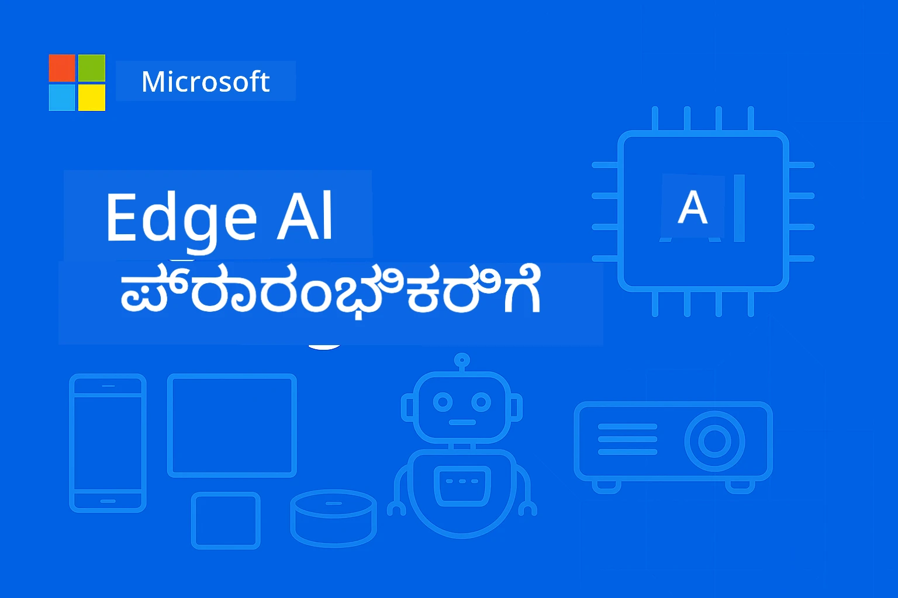

# ಆರಂಭಿಕರಿಗಾಗಿ ಎಡ್ಜ್‌ಎಐ




[](https://GitHub.com/microsoft/edgeai-for-beginners/graphs/contributors)
[](https://GitHub.com/microsoft/edgeai-for-beginners/issues)
[](https://GitHub.com/microsoft/edgeai-for-beginners/pulls)
[](http://makeapullrequest.com)

[](https://GitHub.com/microsoft/edgeai-for-beginners/watchers)
[](https://GitHub.com/microsoft/edgeai-for-beginners/fork)
[](https://GitHub.com/microsoft/edgeai-for-beginners/stargazers)


[](https://discord.gg/nTYy5BXMWG)

ಈ ಸಂಪನ್ಮೂಲಗಳನ್ನು ಬಳಸುವುದನ್ನು ಪ್ರಾರಂಭಿಸಲು ಈ ಹಂತಗಳನ್ನು ಅನುಸರಿಸಿ:

1. **ರಿಪೊಸಿಟೋರಿಯನ್ನು ಫೋರ್ಕ್ ಮಾಡಿ**: ಕ್ಲಿಕ್ಕಿಸಿ [](https://GitHub.com/microsoft/edgeai-for-beginners/fork)
2. **ರಿಪೊಸಿಟೋರಿಯನ್ನು ಕ್ಲೋನ್ ಮಾಡಿ**: `git clone https://github.com/microsoft/edgeai-for-beginners.git`
3. [**ಅಜೂರ್ ಎಐ ಫೌಂಡ್ರಿ ಡಿಸ್ಕೋರ್ಡ್‌ನೊಂದಿಗೆ ಸೇರಿ, ತಜ್ಞರು ಮತ್ತು ಸಹ ಅಭಿವಿಕಾಸಕರನ್ನು ಭೇಟಿ ಮಾಡಿ**](https://discord.com/invite/ByRwuEEgH4)


### 🌐 ಬಹುಭಾಷಾ ಬೆಂಬಲ

#### GitHub ಕ್ರಿಯೆಯಿಂದ ಬೆಂಬಲಿತ (ಸ್ವಯಂಚಾಲಿತ ಮತ್ತು ಶಾಶ್ವತನವೀಕರಿಸಬಹುದಾದ)

<!-- CO-OP TRANSLATOR LANGUAGES TABLE START -->
[ಅರೇಬಿಕ್](../ar/README.md) | [ಬೆಂಗಾಲಿ](../bn/README.md) | [ಬುಲ್ಗೇರಿಯನ್](../bg/README.md) | [ಬರ್ಮೀಸ್ (ಮ್ಯಾಂಮರ್)](../my/README.md) | [ಚೈನೀಸ್ (ಸಂಪುಟಿತ)](../zh-CN/README.md) | [ಚೈನೀಸ್ (ಸಾಂಪ್ರದಾಯಿಕ, ಹಾಂಗ್ ಕಾಂಗ್)](../zh-HK/README.md) | [ಚೈನೀಸ್ (ಸಾಂಪ್ರದಾಯಿಕ, मकಾವ್)](../zh-MO/README.md) | [ಚైనೀಸ್ (ಸಾಂಪ್ರದಾಯಿಕ, ತைவಾನ್)](../zh-TW/README.md) | [ಕ್ರೊಯೇಶಿಯನ್](../hr/README.md) | [ಚෙක්](../cs/README.md) | [ಡ್ಯಾನಿಷ್](../da/README.md) | [ಡಚ್](../nl/README.md) | [ಎಸ್ಟೋನಿಯನ್](../et/README.md) | [ಫಿನ್ನಿಷ್](../fi/README.md) | [ಫ್ರೆಂಚ್](../fr/README.md) | [ಜರ್ಮನ್](../de/README.md) | [ಗ್ರೀಕ್](../el/README.md) | [ಹಿಬ್ರೂ](../he/README.md) | [ಹಿಂದಿ](../hi/README.md) | [ಹಂಗೇರಿಯನ್](../hu/README.md) | [ಇಂಡೋನೇಶಿಯನ್](../id/README.md) | [ಇಟಾಲಿಯನ್](../it/README.md) | [ಜಾಪನೀಸ್](../ja/README.md) | [ಕನ್ನಡ](./README.md) | [ಖ್ಮೇರ್](../km/README.md) | [ಕೊರಿಯನ್](../ko/README.md) | [ಲಿಥುವೇನಿಯನ್](../lt/README.md) | [ಮಲಯ್](../ms/README.md) | [ಮಲಯಾಳಂ](../ml/README.md) | [ಮರಾಠಿ](../mr/README.md) | [ನೆಪಾಲಿ](../ne/README.md) | [ನೈಜೇರಿಯನ್ ಪಿಡ್ಜಿನ್](../pcm/README.md) | [ನಾರ್ವೇಜಿಯನ್](../no/README.md) | [ಪರ್ಷಿಯನ್ (ಫಾರ್ಸಿ)](../fa/README.md) | [ಪೋಲಿಷ್](../pl/README.md) | [ಪೋರ್ಚುಗೀಸ್ (ಬ್ರೆಜಿಲ್)](../pt-BR/README.md) | [ಪೋರ್ಚುಗೀಸ್ (ಪೋರ್ಚುಗಲ್)](../pt-PT/README.md) | [ಪಂಜಾಬಿ (ಗುರ್ಮುಖಿ)](../pa/README.md) | [ರೊಮೇನಿಯನ್](../ro/README.md) | [ರಷ್ಯನ್](../ru/README.md) | [ಸರ್ಬಿಯನ್ (ಸಿರಿಲಿಕ್)](../sr/README.md) | [ಸ್ಲೋವಾಕ್](../sk/README.md) | [ಸ್ಲೋವೇನಿಯನ್](../sl/README.md) | [ಸ್ಪ್ಯಾನಿಷ್](../es/README.md) | [ಸ್ವಾಹಿಲಿ](../sw/README.md) | [ಸ್ವೀಡಿಶ್](../sv/README.md) | [ಟಗಾಲೋಗ್ (ಫಿಲಿಪಿಯನ್)](../tl/README.md) | [ತಮಿಳು](../ta/README.md) | [ತೆಲುಗು](../te/README.md) | [ಥೈ](../th/README.md) | [ಟರ್ಕಿಷ್](../tr/README.md) | [ಉಕ್ರಮೇನಿಯನ್](../uk/README.md) | [ಉರ್ತು](../ur/README.md) | [ವಿಯೇಟ್ನಾಮೀಸ್](../vi/README.md)

> **ಸ್ಥಳೀಯವಾಗಿ ಕ್ಲೋನ್ ಮಾಡುವುದು ಇಷ್ಟವೇ?**
>
> ಈ ರಿಪೊಸಿಟೋರಿ 50+ ಭಾಷಾ ಅನುವಾದಗಳನ್ನು ಒಳಗೊಂಡಿದೆ, ಇದು ಡೌನ್‌ಲೋಡ್ ಗಾತ್ರವನ್ನು ಬಹಳ ಹೆಚ್ಚಿಸುತ್ತದೆ. ಅನುವಾದಗಳಿಲ್ಲದೆ ಕ್ಲೋನ್ ಮಾಡಲು, ಸ್ಪಾರ್ಸ್ ಔಟ್‌ಚೆಕ್ ಬಳಸಿ:
>
> **ಬ್ಯಾಶ್ / ಮ್ಯಾಕೋಎಸ್ / ಲಿನಕ್ಸ್:**
> ```bash
> git clone --filter=blob:none --sparse https://github.com/microsoft/edgeai-for-beginners.git
> cd edgeai-for-beginners
> git sparse-checkout set --no-cone '/*' '!translations' '!translated_images'
> ```
>
> **CMD (ವಿಂಡೋಸ್):**
> ```cmd
> git clone --filter=blob:none --sparse https://github.com/microsoft/edgeai-for-beginners.git
> cd edgeai-for-beginners
> git sparse-checkout set --no-cone "/*" "!translations" "!translated_images"
> ```
>
> ಇದು ನಿಮಗೆ ಕೋರ್ಸ್ ಅನ್ನು ಮುಗಿಸಲು ಬೇಕಾಗಿರುವ ಎಲ್ಲಾ ವಿಷಯಗಳನ್ನು much ವೇಗವಾಗಿ ಡೌನ್‌ಲೋಡ್ ಮಾಡಲು ಸಹಾಯ ಮಾಡುತ್ತದೆ.
<!-- CO-OP TRANSLATOR LANGUAGES TABLE END -->

**ಅದ್ಹೇಗೆ ಇನ್ನಷ್ಟು ಅನುವಾದ ಭಾಷೆಗಳನ್ನು ಬೆಂಬಲಿಸಲು ಬಯಸಿದರೆ, ಅವುಗಳನ್ನು ಇಲ್ಲಿ ಪಟ್ಟಿ ಮಾಡಲಾಗಿದೆ [here](https://github.com/Azure/co-op-translator/blob/main/getting_started/supported-languages.md)**
## ಪರಿಚಯ

**ಎಡ್ಜ್‌ಎಐ ಫಾರ್ ಆರಂಭಿಕರು** ಗೆ ಸ್ವಾಗತ – ಇದು ಎಡ್ಜ್ ಆರ್ಟಿಫಿಷಿಯಲ್ ಇಂಟಲಿಜೆನ್ಸ್ ಸೃಷ್ಟಿಸುವ ಪರಿವರ್ತನಾ ಲೋಕದಲ್ಲಿ ನಿಮ್ಮ ಸಮಗ್ರ ಪ್ರಯಾಣವಾಗಿದೆ. ಈ ಕೋರ್ಸ್ ಶಕ್ತಿಶಾಲಿ ಎಐ ಸಾಮರ್ಥ್ಯಗಳನ್ನು ಮತ್ತು ಬಳಕೆಯಲ್ಲಿರುವ ಎಡ್ಜ್ ಸಾಧನಗಳಲ್ಲಿ ಪ್ರಾಯೋಗಿಕ, ವಾಸ್ತವಿಕ ಜಾರಿ ನಡುವೆ ಸೇತುವೆ ಮಾಡುತ್ತದೆ, ಮಾಹಿತಿಯನ್ನು ಉತ್ಪಾದಿಸುವ ಸ್ಥಳದಲ್ಲೇ ನೀತಿ ತಯಾರಿಸುವ ಪ್ರತ್ಯಕ್ಷ ಸಾಮರ್ಥ್ಯವನ್ನು ನಿಮಗೆಂಟುಮಾಡುತ್ತದೆ.

### ನೀವು ಅರಿತುಕೊಳ್ಳುವವುಗಳು

ಈ ಕೋರ್ಸ್ ಮೂಲಭೂತ ತತ್ವಗಳಿಂದ ಪ್ರೊಡಕ್ಷನ್-ಸಿದ್ಧ ಜಾರಿಗೆ ತರುವವರೆಗೆ ಕವರ್ ಮಾಡುತ್ತದೆ:
- ಎಡ್ಜ್ ಜಾರಿಗೆ ಆಪ್ಟಿಮೈಸ್ ಮಾಡಲಾದ **ಸಣ್ಣ ಭಾಷಾ ಮಾದರಿಗಳು (SLMs)**
- ವಿವಿಧ ವೇದಿಕೆಗಳಲ್ಲಿ **ಹಾರ್ಡ್‌ವೇರ್-ಅवेयर ಆಪ್ಟಿಮೈಸೇಶನ್**
- **ಗोप್ಯತೆ ಕಾಯುವ ಸಾಮರ್ಥ್ಯಗಳೊಂದಿಗೆ ರಿಯಲ್-ಟೈಮ್ ಇನ್ಫರೆನ್ಸ್**
- ಉದ್ಯಮ ಅನ್ವಯಿಕೆಗಳಿಗೆ **ಪ್ರೊಡಕ್ಷನ್ ಜಾರಿಗೆ ತಂತ್ರಗಳು**

### ಎಡ್ಜ್‌ಎಐ ಯಾಕೆ ಪ್ರಮುಖ

ಎಡ್ಜ್ ಎಐ ಹೆಚ್ಚು ಆಧುನಿಕ ಸವಾಲುಗಳನ್ನು ಎದುರಿಸುವ ಪರಿವರ್ತನೆಯ ನಿಯಮವನ್ನು ಪ್ರತಿನಿಧಿಸುತ್ತದೆ:
- **ಗೋಪ್ಯತೆ ಮತ್ತು ಸುರಕ್ಷತೆ**: ಕ್ಲೌಡ್ ಅನಾವರಣವಿಲ್ಲದೆ ಸ್ಥಳೀಯವಾಗಿ ಸಂವೇದನಾಶೀಲ ಡೇಟಾವನ್ನು ಪ್ರಕ್ರಿಯೆ ಮಾಡುವುದು
- **ರಿಯಲ್-ಟೈಮ್ ಕಾರ್ಯಕ್ಷಮತೆ**: ಸಮಯ-ಆವಶ್ಯಕ ಅನ್ವಯಿಕೆಗಳಿಗಾಗಿ ಜಾಲತಾಣ ವಿಳಂಬವನ್ನು ತಪ್ಪಿಸುವುದು
- **ಖರ್ಚು ಪರಿಣಾಮಕಾರಿತ್ವ**: ಬ್ಯಾಂಡ್‌ವಿಡ್ತ್ ಮತ್ತು ಕ್ಲೌಡ್ ಗಣನೆಯ ವೆಚ್ಚವನ್ನು ಕಡಿಮೆಯಾಗಿಸುವುದು
- **ಸ್ಥಿತಿಸ್ಥಾಪಕ ಕಾರ್ಯಾಚರಣೆಗಳು**: ಜಾಲತಾಣ ಬಿದ್ದು ಹೋಗುವ ಸಂದರ್ಭದಲ್ಲಿ ಕಾರ್ಯನಿರ್ವಹಣೆಯನ್ನು ಕಾಪಾಡುವುದು
- **ನಿಯಂತ್ರಣ ಅನುಕೂಲತೆ**: ಡೇಟಾ ಸುವೆಸಾಕ್ಷತಾ ಅವಶ್ಯಕತೆಗಳನ್ನು ಪೂರ್ವಗಿಸಲಾಗುವುದು

### ಎಡ್ಜ್ ಎಐ

ಎಡ್ಜ್ ಎಐ ಎಂದರೆ ಹಾರ್ಡ್‌ವೇರ್‌ನಲ್ಲಿ ಸ್ಥಳೀಯವಾಗಿ ಎಐ ಅಲ್ಗಿತಮ್ಗಳು ಮತ್ತು ಭಾಷಾ ಮಾದರಿಗಳನ್ನು ನಡಿಸುವುದಾಗಿದೆ, ಅಲ್ಲಿ ಡೇಟಾ ಉತ್ಪತ್ತಿಯಾಗುತ್ತದೆ, ಮತ್ತು ಇನ್ಫರೆನ್ಸ್‌ಗಾಗಿ ಕ್ಲೌಡ್ ಸಂಪನ್ಮೂಲಗಳ ಮೇಲೆ ಅವಲಂಬಿಸದೇ ಇರುತ್ತದೆ. ಇದು ವಿಳಂಬವನ್ನು ಕಡಿಮೆ ಮಾಡುತ್ತದೆ, ಗೌಪ್ಯತೆಯನ್ನು ಹೆಚ್ಚಿಸುತ್ತದೆ, ಮತ್ತು ರಿಯಲ್-ಟೈಮ್ ನಿರ್ಧಾರ ಮಾಡುವಿಕೆಯನ್ನು ಸಕ್ರಿಯಗೊಳಿಸುತ್ತದೆ.

### ಮೂಲ ತತ್ವಗಳು:
- **ಡಿವೈಸ್ ಮೇಲೆ ಇನ್ಫರೆನ್ಸ್**: ಎಐ ಮಾದರಿಗಳು ಎಡ್ಜ್ ಸಾಧನಗಳ ಮೇಲೆ (ಫೋನ್‌ಗಳು, ರೌಟರ್‌ಗಳು, ಮೈಕ್ರೋಕಂಟ್ರೋಲರ್‌ಗಳು, ಕೈಗಾರಿಕಾ ಪಿಸಿಗಳು) ನಡೆಯುತ್ತವೆ
- **ಆಫ್‌ಲೈನ್ ಸಾಮರ್ಥ್ಯ**: ನಿರಂತರ ಇಂಟರ್‌ನೆಟ್ ಸಂಪರ್ಕ ಇಲ್ಲದೆ ಕಾರ್ಯನಿರ್ವಹಿಸುತ್ತದೆ
- **ಕಡಿಮೆ ವಿಳಂಬ**: ರಿಯಲ್-ಟೈಮ್ ವ್ಯವಸ್ಥೆಗಳಿಗೆ ತಕ್ಷಣದ ಪ್ರತಿಕ್ರಿಯೆ
- **ಡೇಟಾ ಸುವೆಸಾಕ್ಷತೆ**: ಸಂವೇದನಾಶೀಲ ಮಾಹಿತಿಯನ್ನು ಸ್ಥಳೀಯವಾಗಿ ಇಟ್ಟುಕೊಂಡು ಸುರಕ್ಷತೆ ಮತ್ತು ಅನುಕೂಲತೆಯನ್ನು ಸುಧಾರಣೆ ಮಾಡುತ್ತದೆ

### ಸಣ್ಣ ಭಾಷಾ ಮಾದರಿಗಳು (SLMs)

Phi-4, Mistral-7B ಮತ್ತು Gemma ಮಿತು LLMs ಬೃಹತ್ ಮಾದರಿಗಳ ಪರಿಷ್ಕೃತ ಆವೃತ್ತಿಗಳು—ತರಬೇತಿ ಅಥವಾ ಡಿಸ್ಟಿಲ್ಲೇಷನ್ ಮೂಲಕ:
- **ಕಡಿಮೆ ಮೆಮೊರಿ ವಸತಿಗೊಳಿಸುವಿಕೆ**: ಸೀಮಿತ ಎಡ್ಜ್ ಸಾಧನ ಮೆಮೊರಿಯನ್ನು ಸಮರ್ಥವಾಗಿ ಬಳಸುವುದು
- **ಕಡಿಮೆ ಗಣನೆ ಬೇಡಿಕೆ**: CPU ಮತ್ತು ಎಜ್ GPU ಕಾರ್ಯಕ್ಷಮತೆಯಿಗಾಗಿ ಆಪ್ಟಿಮೈಸ್ ಮಾಡಲಾಗಿದೆ
- **ವೇಗವಾದ ಆರಂಭ ಸಮಯಗಳು**: ಪ್ರತಿಕ್ರಿಯಾಶೀಲ ಅನ್ವಯಿಕೆಗಳಿಗೆ ತ್ವರಿತ ಆರಂಭ

ಇವು ಶಕ್ತಿಶಾಲಿ ನ್ಯಾಚುರಲ್ ಲ್ಯಾಂಗ್ವೇಜ್ ಪ್ರೊಸೆಸಿಂಗ್ ಸಾಮರ್ಥ್ಯಗಳನ್ನು ಬಿಡುಗಡೆ ಮಾಡುತ್ತವೆ, ಜೊತೆಗೆ ಈ ನಿರ್ಬಂಧಗಳನ್ನು ಪೂರೈಸುತ್ತವೆ:
- **ಎಂಬರ್‌ಡಡ್ ವ್ಯವಸ್ಥೆಗಳು**: ಐಒಟಿ ಸಾಧನಗಳು ಮತ್ತು ಕೈಗಾರಿಕಾ ನಿಯಂತ್ರಕಗಳು
- **ಮೊಬೈಲ್ ಸಾಧನಗಳು**: ಆಫ್‌ಲೈನ್ ಕಾರ್ಯ ಸಾಧ್ಯತೆಗಳೊಂದಿಗೆ ಸ್ಮಾರ್ಟ್‌ಫೋನ್ ಮತ್ತು ಟ್ಯಾಬ್ಲೆಟ್‌ಗಳು
- **ಐಒಟಿ ಸಾಧನಗಳು**: ಸೀಮಿತ ಸಂಪನ್ಮೂಲಗಳ ಸೆಂಸರ್‌ಗಳು ಮತ್ತು ಸ್ಮಾರ್ಟ್ ಸಾಧನಗಳು
- **ಎಡ್ಜ್ ಸರ್ವರ್‌ಗಳು**: ಸೀಮಿತ GPU ಸಂಪನ್ಮೂಲಗಳ ಸ್ಥಳೀಯ ಪ್ರాసೆಸಿಂಗ್ ಘಟಕಗಳು
- **ವೈಯಕ್ತಿಕ ಕಂಪ್ಯೂಟರ್‌ಗಳು**: ಡೆಸ್ಕ್‌ಟಾಪ್ ಮತ್ತು ಲ್ಯಾಪ್‌ಟಾಪ್ ಜಾರಿ ದೃಶ್ಯಗಳು

## ಪಾಠ್ಯಕ್ರಮ ಘಟಕಗಳು ಮತ್ತು ನವಿಗೇಶನ್

| ಘಟಕ | ವಿಷಯ | ಪ್ರಾಮುಖ್ಯ ಕ್ಷೇತ್ರ | ಮುಖ್ಯ ವಿಷಯ | ಮಟ್ಟ | ಅವಧಿ |
|--------|-------|------------|-------------|--------|----------|
| [📖 00 ](./introduction.md) | [ಎಡ್ಜ್‌ಎಐಗೆ ಪರಿಚಯ](./introduction.md) | ತಳಹದಿ ಮತ್ತು ಸನ್ನಿವೇಶ | ಎಡ್ಜ್‌ಎಐ ಸಂಕ್ಷಿಪ್ತ ವಿವರಣೆ • ಉದ್ಯಮ ಅನ್ವಯಿಕೆಗಳು • SLM ಪರಿಚಯ • ಕಲಿಕೆ ಉದ್ದೇಶಗಳು | ಆರಂಭಿಕ | 1-2 ಗಂಟೆಗಳು |
| [📚 01](../../Module01) | [ಎಡ್ಜ್‌ಎಐ ಮೂಲಭೂತಗಳು](./Module01/README.md) | ಕ್ಲೌಡ್ ವಿರುದ್ಧ ಎಡ್ಜ್ ಎಐ ಹೋಲಿಕೆ | ಎಡ್ಜ್‌ಎಐ ಮೂಲಭೂತಗಳು • ವಾಸ್ತವ ಕಥೆಗಳು • ಜಾರಿಗೊಳಿಸುವಿಕೆ ಮಾರ್ಗದರ್ಶಕ • ಎಡ್ಜ್ ಜಾರಿ | ಆರಂಭಿಕ | 3-4 ಗಂಟೆಗಳು |
| [🧠 02](../../Module02) | [SLM ಮಾದರಿ ಪೈದಾರು](./Module02/README.md) | ಮಾದರಿ ಕುಟುಂಬಗಳು ಮತ್ತು ಸಾಗಣೆ | ಫೈ ಕುಟುಂಬ • ಕ್ವೆನ್ ಕುಟುಂಬ • ಜೆಮ್ಮಾ ಕುಟುಂಬ • ಬಿಟ್‌ನೆಟ್ • μಮಾಡಲ್ • ಫೈ-ಸಿಲಿಕಾ | ಆರಂಭಿಕ | 4-5 ಗಂಟೆಗಳು |
| [🚀 03](../../Module03) | [SLM ಜಾರಿಗೆ ಅಭ್ಯಾಸ](./Module03/README.md) | ಸ್ಥಳೀಯ ಮತ್ತು ಕ್ಲೌಡ್ ಜಾರಿ | ಉನ್ನತ ಕಲಿಕೆ • ಸ್ಥಳೀಯ ಪರಿಸರೆ • ಕ್ಲೌಡ್ ಜಾರಿ | ಮಧ್ಯಮ | 4-5 ಗಂಟೆಗಳು |
| [⚙️ 04](../../Module04) | [ಮಾದರಿ ಆಪ್ಟಿಮೈಸೇಶನ್ ಉಪಕರಣ]((./Module04/README.md)) | ಪ್ಲಾಟ್‌ಫಾರ್ಮ್-ಮೀರಿ ಆಪ್ಟಿಮೈಸೇಶನ್ | ಪರಿಚಯ • ಲ್ಲಾಮಾ.cpp • ಮೈಕ್ರೋಸಾಫ್ಟ್ ಒಲಿವ್ • ಓಪನ್‌ವಿನೋ • ಆಪಲ್ ಎಂಎಲ್ಎಕ್ಸ • ಕಾರ್ಯಪ್ರವಾಹ ಸಂಶ್ಲೇಷಣೆ | ಮಧ್ಯಮ | 5-6 ಗಂಟೆಗಳು |
| [🔧 05](../../Module05) | [SLMOps ಉತ್ಪಾದನೆ](./Module05/README.md) | ಉತ್ಪಾದನಾ ಕಾರ್ಯಾಚರಣೆಗಳು | SLMOps ಪರಿಚಯ • ಮಾದರಿ ಡಿಸ್ಟಿಲ್ಲೇಷನ್ • ಸೂಕ್ಷ್ಮ-ಸಂರಚನೆ • ಉತ್ಪಾದನಾ ಜಾರಿ | ಅಭಿವೃದ್ಧಿಪಡಿತ | 5-6 ಗಂಟೆಗಳು |
| [🤖 06](../../Module06) | [ಎಐ ಏಜೆಂಟ್ಸ್ ಮತ್ತು ಫಂಕ್ಷನ್ ಕರೆ](./Module06/README.md) | ಏಜೆಂಟ್ ಕಾರ್ಯರೂಪಗಳು ಮತ್ತು MCP | ಏಜೆಂಟ್ ಪರಿಚಯ • ಫಂಕ್ಷನ್ ಕರೆ • ಮಾದರಿ ಸನ್ನಿವೇಶ ಪ್ರೋಟೋಕಾಲ್ | ಅಭಿವೃದ್ಧಿಪಡಿತ | 4-5 ಗಂಟೆಗಳು |
| [💻 07](../../Module07) | [ವೇದಿಕೆ ಜಾರಿಗೆ](./Module07/README.md) | ಪ್ಲಾಟ್‌ಫಾರ್ಮ್ ಮಾದರಿ ಉದಾಹರಣೆಗಳು | ಎಐ ಉಪಕರಣಗಳು • ಫೌಂಡ್ರಿ ಸ್ಥಳೀಯ • ವಿನ್‌ಡೋಸ್ ಅಭಿವೃದ್ಧಿ | ಅಭಿವೃದ್ಧಿಪಡಿತ | 3-4 ಗಂಟೆಗಳು |
| [🏭 08](../../Module08) | [ಫೌಂಡ್ರಿ ಸ್ಥಳೀಯ ಉಪಕರಣಗಳು](./Module08/README.md) | ಉತ್ಪಾದನೆ-ಸಿದ್ಧ ಮಾದರಿ ಉದಾಹರಣೆಗಳು | ಮಾದರಿ ಅನ್ವಯಿಕೆಗಳು (ಕೆಳಗಿನ ವಿವರಗಳನ್ನೊಡ್ಡಿ ನೋಡಿ) | ಪರಿಣತಿ | 8-10 ಗಂಟೆಗಳು |

### 🏭 **ಘಟಕ 08: ಮಾದರಿ ಅನ್ವಯಿಕೆಗಳು**

- [01: REST ಚಾಟ್ ತ್ವರಿತ ಪ್ರಾರಂಭ](./Module08/samples/01/README.md)
- [02: OpenAI SDK ಸಮನ್ವಯ](./Module08/samples/02/README.md)
- [03: ಮಾದರಿ ಅನ್ವೇಷಣೆ ಮತ್ತು ಹೋಲಿಕೆ](./Module08/samples/03/README.md)
- [04: ಚೇನ್ಲಿಟ್ RAG ಅನ್ವಯಿಕೆ](./Module08/samples/04/README.md)
- [05: ಬಹು-ಏಜೆಂಟ್ ಸಂಯೋಜನೆ](./Module08/samples/05/README.md)
- [06: ಮಾದರಿಗಳು-ಎಂದು ಇನ್ಸ್ಟ್ರುಮೆಂಟ್ ರೌಟರ್](./Module08/samples/06/README.md)
- [07: ನೇರ API ಕ್ಲೈಂಟ್](./Module08/samples/07/README.md)
- [08: ವಿಂಡೋಸ್ 11 ಚಾಟ್ ಅಪ್ಲಿಕೇಶನ್](./Module08/samples/08/README.md)
- [09: ಉನ್ನತ ಬಹು-ಏಜೆಂಟ್ ವ್ಯವಸ್ಥೆ](./Module08/samples/09/README.md)
- [10: ಫೌಂಡ್ರಿ ಉಪಕರಣ ಚಟುವಟಿಕೆ](./Module08/samples/10/README.md)

### 🎓 **ವರ್ಕ್‌ಶಾಪ್: ಕೈಯಲ್ಲಿ ಕಲಿಕೆ ಮಾರ್ಗ**

ಉತ್ಪಾದನೆ-ಸಿದ್ಧ ಜಾರಿಗೆ ಸಂಪೂರ್ಣ ಕೈಯಲ್ಲಿ ಕೆಲಸ ಮಾಡುವ ವರ್ಕ್‌ಶಾಪ್ ಉಪಕರಣಗಳು:

- **[ವರ್ಕ್‌ಶಾಪ್ ಮಾರ್ಗದರ್ಶಕ](./Workshop/Readme.md)** - ಸಂಪೂರ್ಣ ಕಲಿಕೆ ಉದ್ದೇಶಗಳು, ಫಲಿತಾಂಶಗಳು ಮತ್ತು ಸಂಪನ್ಮೂಲ ನವಿಗೇಶನ್
- **ಪೈಥಾನ್ ಮಾದರಿಗಳು** (6 ಅಧಿವೇಶನಗಳು) - ಉತ್ತಮ ಅಭ್ಯಾಸಗಳು, ದೋಷ ನಿರ್ವಹಣೆ ಮತ್ತು ಸಂಪೂರ್ಣ ದಾಖಲಾತಿ ಸಂಶೋಧನೆ
- **ಜುಪಿಟರ್ ನೋಟ್ಬುಕ್‌ಗಳು** (8 ಸಂವಾದಾತ್ಮಕ) - ಹಂತ ಹಂತದ ಪಾಠಗಳು, ಹೋಲಿಕೆ ಮತ್ತು ಕಾರ್ಯಕ್ಷಮತೆ ನಿರೀಕ್ಷಣೆ
- **ಅಧಿವೇಶನ ಮಾರ್ಗದರ್ಶಕಗಳು** - ಪ್ರತಿಯೊಂದು ವರ್ಕ್‌ಶಾಪ್ ಅಧಿವೇಶನದ ವಿವರವಾದ ಮಾರ್ಗದರ್ಶಿಗಳು
- **ಮಾನ್ಯತೆ ಉಪಕರಣಗಳು** - ಕೋಡ್ ಗುಣಮಟ್ಟವನ್ನು ಪರಿಶೀಲಿಸಲು ಮತ್ತು ಸ್ಮೋಕ್ ಟೆಸ್ಟ್‌ಗಳನ್ನು ನಡೆಸಲು ಸ್ಕ್ರಿಪ್ಟ್‌ಗಳು

**ನೀವು ನಿರ್ಮಿಸುವುದೇನು:**
- ಸ್ಟ್ರೀಮಿಂಗ್ ಬೆಂಬಲದೊಂದಿಗೆ ಸ್ಥಳೀಯ ಎಐ ಚಾಟ್ ಅಪ್ಲಿಕೇಶನ್‌ಗಳು
- ಗುಣಮಟ್ಟ ಮೌಲ್ಯಮಾಪನದೊಂದಿಗೆ RAG ಪೈಪ್ಲೈನ್ಗಳು (RAGAS)
- ಬಹು-ಮಾದರಿ ಹೋಲಿಕೆ ಮತ್ತು ಹೋಲಿಕೆ ಉಪಕರಣಗಳು
- ಬಹು-ಏಜೆಂಟ್ ಸಂಯೋಜನೆ ವ್ಯವಸ್ಥೆಗಳು
- ಕಾರ್ಯಾಧಾರಿತ ಆಯ್ಕೆಗಾಗಿ ಬುದ್ಧಿವಂತ ಮಾದರಿ ರೌಟಿಂಗ್

### 🎙️ **ಏಜೆಂಟಿಕ್ ವರ್ಕ್‌ಶಾಪ್: ಕೈಯಲ್ಲಿ - ಎಐ ಪೊಡ್‌ಕಾಸ್ಟ್ ಸ್ಟುಡಿಯೋ**
ಶೂನ್ಯದಿಂದ AI-ಚಾಲಿತ ಪಾಡ್ಕಾಸ್ಟ್ ಉತ್ಪಾದನಾ ಪೈಪ್‌ಲೈನ್ ನಿರ್ಮಿಸಿ! ಈ ಆಳವಾದ ಕಾರ್ಯಾಗಾರವು ನೀವು ಸಂಪೂರ್ಣ ಬಹು-ಏಜೆಂಟ್ ವ್ಯವಸ್ಥೆಯನ್ನು ರಚಿಸುವುದನ್ನು ಕಲಿಸುತ್ತದೆ, ಇದು ಆಲೋಚನೆಗಳನ್ನು ವೃತ್ತಿ ಪಾಡ್ಕಾಸ್ಟ್ ಎಪಿಸೋಡ್ಗಳಾಗಿ ಪರಿವರ್ತಿಸುತ್ತದೆ.

**[🎬 AI ಪಾಡ್ಕಾಸ್ಟ್ ಸ್ಟುಡಿಯೋ ಕಾರ್ಯಾಗಾರವನ್ನು ಪ್ರಾರಂಭಿಸಿ](./WorkshopForAgentic/README.md)**

**ನಿಮ್ಮ ಮಿಷನ್**: "Future Bytes" ಎಂಬ ಚಿಪ್ಪಿರುವ ಎಐ ಏಜೆಂಟ್‌ಗಳು ಸಂಪೂರ್ಣವಾಗಿ ಚಾಲಿತವಿರುವ ಸాంకೇತಿಕ ಪಾಡ್ಕಾಸ್ಟ್ ಅನ್ನು ಪ್ರಾರಂಭಿಸಿ. ತಮ್ಮ ಕಂಪ್ಯೂಟರ್‌ನಲ್ಲಿ ಎಲ್ಲವನ್ನೂ ಸ್ಥಳೀಯವಾಗಿ ಚಲಿಸುವಂತೆ ಮಾಡು; ಯಾವುದೇ ಕ್ಲೌಡ್ ಅವಲಂಬನೆಗಳು ಅಥವಾ API ವೆಚ್ಚಗಳಿಲ್ಲ.

**ಈ ವೈಶಿಷ್ಟ್ಯವೇನು:**
- **🤖 ನಿಜವಾದ ಬಹು-ಏಜೆಂಟ್ ಸಂಯೋಜನೆ** - ಸಂಶೋಧನೆ, ಬರವಣಿಗೆ, ಧ್ವನಿ ಉತ್ಪಾದನೆಗಾಗಿ ವಿಶಿಷ್ಟ ಎಐ ಏಜೆಂಟ್‌ಗಳನ್ನು ನಿರ್ಮಿಸಿ
- **🎯 ಸಂಪೂರ್ಣ ಉತ್ಪಾದನಾ ಪೈಪ್‌ಲೈನ್** - ವಿಷಯ ಆಯ್ಕೆಯಿಂದ ಅಂತಿಮ ಪಾಡ್ಕಾಸ್ಟ್ ಧ್ವನಿ ಔಟ್‌ಪುಟ್ ಗೆ
- **💻 100% ಸ್ಥಳೀಯ ನಿಯೋಜನೆ** - ಸಂಪೂರ್ಣ ಗೌಪ್ಯತೆ ಮತ್ತು ನಿಯಂತ್ರಣಗಾಗಿ Ollama ಮತ್ತು ಸ್ಥಳೀಯ ಮಾದರಿಗಳನ್ನು (Qwen-3-8B) ಬಳಸುತ್ತದೆ
- **🎤 ವಚನ-ದಿಂದ-ಧ್ವನಿ ಸಮನ್ವಯ** - ಸ್ಕ್ರಿಪ್ಟ್‌ಗಳನ್ನು ನೈಸರ್ಗಿಕ ಶಬ್ದದ ಬಹು-ವಕ್ತೃ ಸಂವಾದಗಳಾಗಿ ಪರಿವರ್ತಿಸಿ
- **✋ ಮಾನವ-ಇನ್-ದಿ- ಲೂಪ್ ಕಾರ್ಯಪ್ರವಾಹಗಳು** - ಗುಣಮಟ್ಟವನ್ನು ಖಚಿತಪಡಿಸುವ ಅನುಮೋದನಾ ದ್ವಾರಗಳು, ಸ್ವಯಂಚಾಲನೆಯೊಂದಿಗೆ

**ಮೂರು ಅಂಕಗಳ ಕಲಿಕೆ ಪ್ರಯಾಣ:**

| ಅಂಕ | ಗಮನ | ಮುಖ್ಯ ಕೌಶಲ್ಯಗಳು | ಅವಧಿ |
|-----|-------|------------|----------|
| **[ಅಂಕ 1: ನಿಮ್ಮ AI ಸಹಾಯಕರನ್ನು ಪರಿಚಯಿಸಿ](./WorkshopForAgentic/md/01.BuildAIAgentWithSLM.md)** | ನಿಮ್ಮ ಮೊದಲ AI ಏಜೆಂಟ್ ನಿರ್ಮಿಸಿ | ಉಪಕರಣ ಸಂಯೋಜನೆ • ವೆಬ್ ಹುಡುಕಾಟ • ಸಮಸ್ಯೆ ಪರಿಹಾರ • ಏಜೆಂಟಿಕ್ ವಿವರಣೆ | 2-3 ಗಂಟೆಗಳು |
| **[ಅಂಕ 2: ನಿಮ್ಮ ಉತ್ಪಾದನಾ ತಂಡವನ್ನು ಸಂಯೋಜಿಸಿ](./WorkshopForAgentic/md/02.AIAgentOrchestrationAndWorkflows.md)** | ಬಹು ಏಜೆಂಟ್ ಗಳ ಸಂಯೋಜನೆ | ತಂಡ ಸಮನ್ವಯ • ಅನುಮೋದನಾ ಕಾರ್ಯಪ್ರವಾಹಗಳು • DevUI ಇಂಟರ್ಫೇಸ್ • ಮಾನವ ಮೇಲ್ವಿಚಾರಣೆ | 3-4 ಗಂಟೆಗಳು |
| **[ಅಂಕ 3: ನಿಮ್ಮ ಪಾಡ್ಕಾಸ್ಟ್ ಗೆ ಜೀವ ಕೊಡಿ](./WorkshopForAgentic/md/03.Multi-SpeakerPodcastGenerationWithVibeVoice.md)** | ಪಾಡ್ಕಾಸ್ಟ್ ಧ್ವನಿಯನ್ನು ಉತ್ಪಾದಿಸಿ | ವಚನ-ದಿಂದ-ಧ್ವನಿ • ಬಹು-ವಕ್ತೃ ಸಂಶ್ಲೇಷಣೆ • ದೀರ್ಘ-ರೂಪ ಧ್ವನಿ • ಸಂಪೂರ್ಣ ಸ್ವಯಂಚಾಲನೆ | 2-3 ಗಂಟೆಗಳು |

**ಬಳಸಿರುವ ತಂತ್ರಜ್ಞಾನಗಳು:**
- **Microsoft ಏಜೆಂಟ್ ಫ್ರೇಮ್‌ವರ್ಕ್** - ಬಹು ಏಜೆಂಟ್ ಸಂಯೋಜನೆ ಮತ್ತು ಸಮನ್ವಯ
- **Ollama** - ಸ್ಥಳೀಯ AI ಮಾದರಿ ರನ್‌ಟೈಮ್ (ಕ್ಲೌಡ್ ಅಗತ್ಯವಿಲ್ಲ)
- **Qwen-3-8B** - ಏಜೆಂಟಿಕ್ ಕಾರ್ಯಗಳಿಗೆ ಆಪ್ಟಿಮೈಸ್ ಮಾಡಲಾದ ಓಪನ್-ಸೋರ್ಸ್ ಭಾಷಾ ಮಾದರಿ
- **ಟೆಕ್ಸ್ಟ್-ಟು-ಸ್ಪೀಚ್ APIಗಳು** - ಪಾಡ್ಕಾಸ್ಟ್ ಉತ್ಪಾದನೆಗಾಗಿ ನೈಸರ್ಗಿಕ ಧ್ವನಿ ಸಂಶ್ಲೇಷಣೆ

**ಹಾರ್ಡ್‌ವೇರ್ ಬೆಂಬಲ:**
- ✅ **CPU ಮೋಡ್** - ಯಾವುದೇ ಆಧುನಿಕ ಕಂಪ್ಯೂಟರ್‌ನಲ್ಲಿ ಕಾರ್ಯನಿರ್ವಹಿಸುತ್ತದೆ (8GB+ RAM ಶಿಫಾರಸ್ಸು)
- 🚀 **GPU ವೇಗವರ್ಧನೆ** - NVIDIA/AMD GPU ಗಳೊಂದಿಗೆ ಬಹಳ ವೇಗವಾದ ನಿರ್ಣಯ
- ⚡ **NPU ಬೆಂಬಲ** - ಮುಂದಿನ ತಲೆಮಾರಿಗೆ ನಿಯೂರಲ್ ಪ್ರಾಸೆಸಿಂಗ್ ಯುನಿಟ್ ವೇಗವರ್ಧನೆ

**ಪೂರ್ಣವಾಗಿ ಸೂಕ್ತ:**
- ಬಹು-ಏಜೆಂಟ್ AI ವ್ಯವಸ್ಥೆಗಳನ್ನು ಕಲಿಯುತ್ತಿರುವ ಅಭಿವೃದ್ಧಿಪಡಿತರು
- ಎಐ ಸ್ವಯಂಚಾಲನೆ ಮತ್ತು ಕಾರ್ಯಪ್ರವಾಹಗಳಲ್ಲಿ ಆಸಕ್ತಿ ಹೊಂದಿರುವವರು
- AI ಸಹಾಯಕರುಗಳೊಂದಿಗೆ ಉತ್ಪಾದನೆ ಅನ್ವೇಷಿಸುವ ವಿಷಯ ಸೃಷ್ಟಿಕರ್ತರು
- ಪರಿಣಾಮಕಾರಿ AI ಸಂಯೋಜನಾ ಮಾದರಿಗಳನ್ನು ಅಧ್ಯಯನ ಮಾಡುತ್ತಿರುವ ವಿದ್ಯಾರ್ಥಿಗಳು

**ನಿರ್ಮಿಸಲು ಪ್ರಾರಂಭಿಸಿ**: [🎙️ AI ಪಾಡ್ಕಾಸ್ಟ್ ಸ್ಟುಡಿಯೋ ಕಾರ್ಯಾಗಾರ →](./WorkshopForAgentic/README.md)

### 📊 **ಕಲಿಕೆಯ ಮಾರ್ಗಸೂಚಿ ಸಮಾರಿ**
- **ಒಟ್ಟು ಅವಧಿ**: 36-45 ಗಂಟೆಗಳು
- **ಪ್ರಾರಂಭಿಕ ಮಾರ್ಗ**: ಘಟಕ 01-02 (7-9 ಗಂಟೆಗಳು)  
- **ಮಧ್ಯಮ ಮಟ್ಟದ ಮಾರ್ಗ**: ಘಟಕ 03-04 (9-11 ಗಂಟೆಗಳು)
- **ಪ್ರಗತಿಶೀಲ ಮಾರ್ಗ**: ಘಟಕ 05-07 (12-15 ಗಂಟೆಗಳು)
- **ನಿಪುಣ ಮಾರ್ಗ**: ಘಟಕ 08 (8-10 ಗಂಟೆಗಳು)

## ನೀವು ನಿರ್ಮಿಸುವುದು

### 🎯 ಮುಖ್ಯ ಸಾಮರ್ಥ್ಯಗಳು
- **ಎಡ್ಜ್ AI ವಾಸ್ತುಶಿಲ್ಪ**: ಕ್ಲೌಡ್ ಏಕೀಕರಣದೊಂದಿಗೆ ಸ್ಥಳೀಯ-ಪ್ರಥಮ AI ವ್ಯವಸ್ಥೆಗಳು ವಿನ್ಯಾಸಗೊಳಿಸಿ
- **ಮಾದರಿ ಆಪ್ಟಿಮೈಜೆಷನ್**: ಎಡ್ಜ್ ನಿಯೋಜನೆಗಾಗಿ ಮಾದರಿಗಳನ್ನು ಗುಣಾತ್ಮಕ ಮತ್ತು ಸಂಕುಚಿತಗೊಳಿಸಿ (85% ವೇಗ ಹೆಚ್ಚಳ, 75% ಗಾತ್ರ ಕಡಿತ)
- **ಬහු-ಮಂಚ ನಿಯೋಜನೆ**: ವಿಂಡೋಸ್, ಮೊಬೈಲ್, ಎम्बೆಡ್ಡೆಡ್ ಮತ್ತು ಕ್ಲೌಡ್-ಎಡ್ಜ್ ಸಂಯೋಜಿತ ವ್ಯವಸ್ಥೆಗಳು
- **ಉತ್ಪಾದನಾ ಕಾರ್ಯಾಚರಣೆಗಳು**: ಎಡ್ಜ್ AI ವೀಕ್ಷಣೆ, ಸ್ಕೇಲಿಂಗ್ ಮತ್ತು ನಿರ್ವಹಣೆ

### 🏗️ ಅಭ್ಯಾಸ ಯೋಜನೆಗಳು
- **ಫೌಂಡ್ರಿ ಲೋಕಲ್ ಚಾಟ್ ಅಪ್ಲಿಕೇಶನ್ಗಳು**: ವಿಂಡೋಸ್ 11 ನೇಟಿವ್ ಅಪ್ಲಿಕೇಶನ್ ಮಾದರಿ ಬದಲಾವಣೆ ಸಮೇತ  
- **ಬಹು-ಏಜೆಂಟ್ ವ್ಯವಸ್ಥೆಗಳು**: ಸಂಕೀರ್ಣ ಕಾರ್ಯಪ್ರವಾಹಗಳಿಗಾಗಿ ನಿಪುಣ ಏಜೆಂಟ್ ಗಳ ಸಂಯೋಜನೆ  
- **RAG ಅಪ್ಲಿಕೇಶನ್ಗಳು**: ಸ್ಥಳೀಯ ದಾಖಲೆ ಸಂಸ್ಕರಣೆ ಮತ್ತು ವೆಕ್ಟರ್ ಹುಡುಕಾಟ
- **ಮಾದರಿ ರೌಟರ್‌ಗಳು**: ಕಾರ್ಯ ವಿಶ್ಲೇಷಣೆಯದಂತೆ ಮಾದರಿಗಳಲ್ಲಿ ಬುದ್ಧಿವಂತ ಆಯ್ಕೆ
- **API ಫ್ರೇಮ್‌ವರ್ಕ್‌ಗಳು**: ಸ್ಟ್ರೀమಿಂಗ್ ಮತ್ತು ಆರೋಗ್ಯ ನಿಗಾವಣೆಯೊಂದಿಗೆ ಉತ್ಪಾದನಾ-ಸಿದ್ದ ಕ್ಲೈಂಟ್‌ಗಳು
- **ಬහු-ಮಂಚ ಉಪಕರಣಗಳು**: LangChain/Semantic Kernel ಸಂಘಟನಾ ಮಾದರಿಗಳು

### 🏢 ಉದ್ಯಮ ಅನ್ವಯಿಕೆಗಳು
**ಉತ್ಪಾದನೆ** • **ಆರೋಗ್ಯಸೇವೆಗಳು** • **ಸ್ವಯಂಚಾಲಿತ ವಾಹನಗಳು** • **ಸ್ಮಾರ್ಟ್ ನಗರಗಳು** • **ಮೊಬೈಲ್ ಅಪ್ಲಿಕೇಶನ್ಗಳು**

## ಶುರುಮಾಡಿಕೊಳ್ಳಿ

**ಶಿಫಾರಸು ಮಾಡಿದ ಕಲಿಕೆ ಮಾರ್ಗ** (ಒಟ್ಟು 20-30 ಗಂಟೆಗಳು):

0. **📖 ಪರಿಚಯ** ([Introduction.md](./introduction.md)): EdgeAI ನೆಲೆಮನೆ + ಉದ್ಯಮ ಹಿನ್ನೆಲೆ + ಕಲಿಕೆ ಚಟುವಟಿಕೆಗಳು
1. **📚 ಬೆಸ್ಮೆಂಟು** (ಘಟಕ 01-02): EdgeAI ತತ್ವಗಳು + SLM ಮಾದರಿ ಕುಟುಂಬಗಳು
2. **⚙️ ಆಪ್ಟಿಮೈಜೆಷನ್** (ಘಟಕ 03-04): ನಿಯೋಜನೆ + ಗುಣಾತ್ಮಕ ಚಟುವಟಿಕೆಗಳು  
3. **🚀 ಉತ್ಪಾದನೆ** (ಘಟಕ 05-06): SLMOps + AI ಏಜೆಂಟ್ ಗಳ + ಕಾರ್ಯ ಕರೆಗಳು
4. **💻 ಅನುಷ್ಠಾನ** (ಘಟಕ 07-08): ಮಂಚ ಉದಾಹರಣೆಗಳು + ಫೌಂಡ್ರಿ ಲೋಕಲ್ ಉಪಕರಣಗಳ ಸಾರಾಂಶ

ಪ್ರತಿ ಘಟಕದಲ್ಲೂ ತತ್ತ್ವ, ಕೈಗಳನ್ನು-ಕಾಯ್ದು ಅಭ್ಯಾಸಗಳು ಮತ್ತು ಉತ್ಪಾದನಾ-ಸಿದ್ಧ ಕೋಡ್ ಉದಾಹರಣೆಗಳು ಸೇರಿವೆ.

## ಉದ್ಯೋಗ ಪ್ರಭಾವ

**ತಾಂತ್ರಿಕ ಪಾತ್ರಗಳು**: EdgeAI ಬಗೆಗಿನ ಪರಿಹಾರದ ವಾಸ್ತುಶಿಲ್ಪಿ • ML ಎಂಜಿನಿಯರ್ (ಎಡ್ಜ್) • IoT AI ಅಭಿವೃದ್ಧಿದಾರ • ಮೊಬೈಲ್ AI ಅಭಿವೃದ್ಧಿದಾರ

**ಉದ್ಯಮ ಕ್ಷೇತ್ರಗಳು**: ಉತ್ಪಾದನೆ 4.0 • ಆರೈಕೆ ತಂತ್ರಜ್ಞಾನ • ಸ್ವಯಂಚಾಲಿತ ವ್ಯವಸ್ಥೆಗಳು • ಫಿನ್ಟೆಕ್ • ಗ್ರಾಹಕ ಎಲೆಕ್ಟ್ರಾನಿಕ್ಸ್

**ಪೋರ್ಟ್‌ಫೋಲಿಯೊ ಯೋಜನೆಗಳು**: ಬಹು-ಏಜೆಂಟ್ ವ್ಯವಸ್ಥೆಗಳು • ಉತ್ಪಾದನಾ RAG ಅಪ್ಲಿಕೇಶನ್ಗಳು • ಬೃಹತ್-ಮಂಚ ನಿಯೋಜನೆ • ಕಾರ್ಯಕ್ಷಮತೆ ಆಪ್ಟಿಮೈಜೆಷನ್

## ಸಂಗ್ರಹಣೆ ರಚನೆ

```
edgeai-for-beginners/
├── 📖 introduction.md  # Foundation: EdgeAI Overview & Learning Framework
├── 📚 Module01-04/     # Fundamentals → SLMs → Deployment → Optimization  
├── 🔧 Module05-06/     # SLMOps → AI Agents → Function Calling
├── 💻 Module07/        # Platform Samples (VS Code, Windows, Jetson, Mobile)
├── 🏭 Module08/        # Foundry Local Toolkit + 10 Comprehensive Samples
│   ├── samples/01-06/  # Foundation: REST, SDK, RAG, Agents, Routing
│   └── samples/07-10/  # Advanced: API Client, Windows App, Enterprise Agents, Tools
├── 🌐 translations/    # Multi-language support (8+ languages)
└── 📋 STUDY_GUIDE.md   # Structured learning paths & time allocation
```

## ಕೋರ್ಸ್ ವಿಶೇಷತೆಗಳು

✅ **ಕ್ರಮೇಣ ಕಲಿಕೆ**: ತತ್ತ್ವ → ಅಭ್ಯಾಸ → ಉತ್ಪಾದನಾ ನಿಯೋಜನೆ  
✅ **ನಿಜವಾದ ಪ್ರಕರಣ ಅಧ್ಯಯನಗಳು**: Microsoft, ಜಪಾನಿಯ ವಿಮಾನ ಸಂಸ್ಥೆ, ಉದ್ಯಮ ಅನುಷ್ಠಾನಗಳು  
✅ **ಕೈಗಳ ಮೇಲೆ ಉದಾಹರಣೆಗಳು**: 50+ ಉದಾಹರಣೆಗಳು, 10 ಪೂರ್ಣ ಫೌಂಡ್ರಿ ಲೋಕಲ್ ಡೆಮೋಗಳು  
✅ **ಕಾರ್ಯಕ್ಷಮತೆ ಮೇಲೆ ಧ್ಯಾನ**: 85% ವೇಗ ಸುಧಾರಣೆಗಳು, 75% ಗಾತ್ರ ಕಡಿತಗಳು  
✅ **ಬಹು-ಮಂಚ**: ವಿಂಡೋಸ್, ಮೊಬೈಲ್, ಸಂಯೋಜಿತ, ಕ್ಲೌಡ್-ಎಡ್ಜ್ ಸಂಯೋಜಿತ  
✅ **ಉತ್ಪಾದನಾ ಸಿದ್ಧತೆ**: ವೀಕ್ಷಣೆ, ಸ್ಕೇಲಿಂಗ್, ಭದ್ರತೆ, ಅನುಕೂಲತೆ ಚಟುವಟಿಕೆಗಳು

📖 **[ಕಲಿಕಾ ಮಾರ್ಗದರ್ಶಿ ಲಭ್ಯವಿದೆ](STUDY_GUIDE.md)**: ಸಮಯ ವಿತರಣೆಯ ಮಾರ್ಗದರ್ಶನ ಮತ್ತು ಸ್ವ-ಮೌಲ್ಯಮಾಪನ ಉಪಕರಣಗಳೊಂದಿಗೆ ರಚಿಸಲಾದ 20-ಗಂಟೆಗಳ ಕಲಿಕೆ ಮಾರ್ಗ.

---

**EdgeAI ಎಂದರೆ AI ನಿಯೋಜನೆಯ ಭವಿಷ್ಯ**: ಸ್ಥಳೀಯ-ಪ್ರಥಮ, ಗೌಪ್ಯತಾ ಸಂರಕ್ಷಣೆ, ಮತ್ತು ಪರಿಣಾಮಕಾರಿ. ಈ ಕೌಶಲ್ಯಗಳನ್ನು ಆಳವಾಗಿ ಕಲಿಯಿರಿ, ಮುಂದಿನ ತಲೆಮಾರಿಗೆ ಬುದ್ಧಿವಂತ ಅಪ್ಲಿಕೇಶನ್‌ಗಳನ್ನು ನಿರ್ಮಿಸಲು.

## ಇತರೆ ಕೋರ್ಸುಗಳು

ನಮ್ಮ ತಂಡ ಇತರೆ ಕೋರ್ಸುಗಳನ್ನು ಉತ್ಪಾದಿಸುತ್ತದೆ! ಪರಿಶೀಲಿಸಿ:

<!-- CO-OP TRANSLATOR OTHER COURSES START -->
### LangChain
[](https://aka.ms/langchain4j-for-beginners)
[](https://aka.ms/langchainjs-for-beginners?WT.mc_id=m365-94501-dwahlin)
[](https://github.com/microsoft/langchain-for-beginners?WT.mc_id=m365-94501-dwahlin)
---

### Azure / Edge / MCP / ಎಜೆಂಟ್ ಗಳು
[](https://github.com/microsoft/AZD-for-beginners?WT.mc_id=academic-105485-koreyst)
[](https://github.com/microsoft/edgeai-for-beginners?WT.mc_id=academic-105485-koreyst)
[](https://github.com/microsoft/mcp-for-beginners?WT.mc_id=academic-105485-koreyst)
[](https://github.com/microsoft/ai-agents-for-beginners?WT.mc_id=academic-105485-koreyst)

---
 
### ತಯಾರಕ AI ಸರಣಿ
[](https://github.com/microsoft/generative-ai-for-beginners?WT.mc_id=academic-105485-koreyst)
[-9333EA?style=for-the-badge&labelColor=E5E7EB&color=9333EA)](https://github.com/microsoft/Generative-AI-for-beginners-dotnet?WT.mc_id=academic-105485-koreyst)
[-C084FC?style=for-the-badge&labelColor=E5E7EB&color=C084FC)](https://github.com/microsoft/generative-ai-for-beginners-java?WT.mc_id=academic-105485-koreyst)
[-E879F9?style=for-the-badge&labelColor=E5E7EB&color=E879F9)](https://github.com/microsoft/generative-ai-with-javascript?WT.mc_id=academic-105485-koreyst)

---
 
### ಮೂಲ ಕಲಿಕೆ
[](https://aka.ms/ml-beginners?WT.mc_id=academic-105485-koreyst)
[](https://aka.ms/datascience-beginners?WT.mc_id=academic-105485-koreyst)
[](https://aka.ms/ai-beginners?WT.mc_id=academic-105485-koreyst)
[](https://github.com/microsoft/Security-101?WT.mc_id=academic-96948-sayoung)
[](https://aka.ms/webdev-beginners?WT.mc_id=academic-105485-koreyst)
[](https://aka.ms/iot-beginners?WT.mc_id=academic-105485-koreyst)
[](https://github.com/microsoft/xr-development-for-beginners?WT.mc_id=academic-105485-koreyst)

---
 
### ಕೋಪ್‌ಯಾಜರ್ ಸರಣಿ
[](https://aka.ms/GitHubCopilotAI?WT.mc_id=academic-105485-koreyst)
[](https://github.com/microsoft/mastering-github-copilot-for-dotnet-csharp-developers?WT.mc_id=academic-105485-koreyst)
[](https://github.com/microsoft/CopilotAdventures?WT.mc_id=academic-105485-koreyst)
<!-- CO-OP TRANSLATOR OTHER COURSES END -->

## ಸಹಾಯ ಪಡೆಯುವುದು

ನೀವು ಅಡಚಣೆಗೆ ಸಿಕ್ಕಿದ್ದರೆ ಅಥವಾ AI ಆ್ಯಪ್ಗಳು ನಿರ್ಮಿಸುವುದರ ಬಗ್ಗೆ ಯಾವುದೇ ಪ್ರಶ್ನೆಗಳಿದ್ದರೆ, ಸೇರಿ:

[](https://discord.gg/nTYy5BXMWG)

ನೀವು ಉತ್ಪನ್ನದ ಪ್ರತಿಕ್ರಿಯೆ ಅಥವಾ ನಿರ್ಮಿಸುವ ವೇಳೆ ದೋಷಗಳನ್ನು ಹೊಂದಿದ್ದರೆ ಭೇಟಿ ನೀಡಿ:

[](https://aka.ms/foundry/forum)

---

<!-- CO-OP TRANSLATOR DISCLAIMER START -->
**ಅस्वೀಕರಣ**:  
ಈ ದಾಖಲೆ AI ಅನುವಾದ ಸೇವೆ [Co-op Translator](https://github.com/Azure/co-op-translator) ಬಳಸಿ ಅನುವಾದಿಸಲಾಗಿದೆ. ನಾವು ನಿಖರತೆಗಾಗಿ ಪ್ರಯತ್ನಿಸುವರೂ, ಸ್ವಯಂಚಾಲಿತ ಅನುವಾದಗಳಲ್ಲಿ ತಪ್ಪುಗಳು ಅಥವಾ ಅಸಂಪೂರ್ಣತೆಗಳಾಗಬಹುದು ಎಂಬುದನ್ನು ದಯವಿಟ್ಟು ಗಮನಿಸಿ. ಮೂಲ ಭಾಷೆಯಲ್ಲಿರುವ ಮೊದಲಿನ ದಾಖಲೆವನ್ನು ಅಧಿಕಾರಪೂರ್ಣ ಮೂಲವಾಗಿ ಪರಿಗಣಿಸಬೇಕು. ಪ್ರಮುಖ ಮಾಹಿತಿ ಗಳಿಗಾಗಿ, ವೃತ್ತಿಪರ ಮಾನವನ ಅನುವಾದವನ್ನು ಸೂಚಿಸಲಾಗುತ್ತದೆ. ಈ ಅನುವಾದ ಬಳಕೆಯಿಂದ ಉಂಟಾಗುವ ಯಾವುದೇ ದೂರುಗಳು ಅಥವಾ ತಪ್ಪು ಅರ್ಥಕಳಿಕೆಗಳಿಗೆ ನಾವು ಹೊಣೆಗಾರರಾಗುವುದಿಲ್ಲ.
<!-- CO-OP TRANSLATOR DISCLAIMER END -->