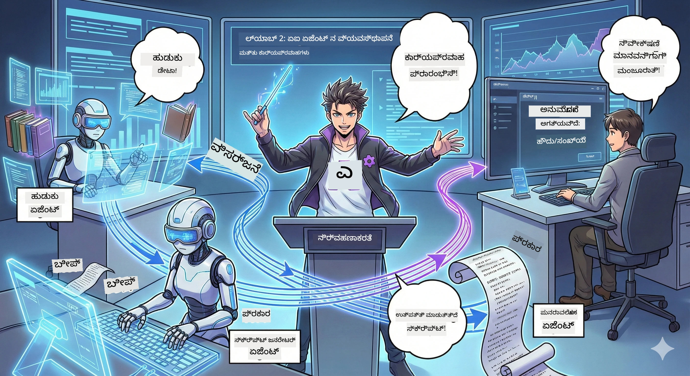

<!--
CO_OP_TRANSLATOR_METADATA:
{
  "original_hash": "93f84b804ced67c5cd017c3c4bb476ff",
  "translation_date": "2026-01-05T11:57:41+00:00",
  "source_file": "WorkshopForAgentic/md/02.AIAgentOrchestrationAndWorkflows.md",
  "language_code": "kn"
}
-->
# ಈಗೆ 2: ನಿಮ್ಮ ಪಾಡ್‌ಕ್ಯಾಸ್ಟ್ ಉತ್ಪಾದನಾ ತಂಡವನ್ನು ಸೇರಿಸಿ 🎬



## ಕಥೆ ಗಡೆಯುತ್ತದೆ

ಆಲೆಕ್ಸ್ (ನಿಮ್ಮ AI ಸಹಾಯಕನು ಈಗೆ 1 ರಲ್ಲಿ) ಅದ್ಭುತ, ಆದರೆ ಒಬ್ಬ ಏಜೆಂಟ್ ಪೂರ್ಣ ಪಾಡ್‌ಕ್ಯಾಸ್ಟ್ ಸ್ಟುಡಿಯೊವನ್ನು ನಿರ್ವಹಿಸಲು ಸಾಧ್ಯವಿಲ್ಲ. ನಿಮಗೆ ಒಂದು *ಟೀಮ್* ಬೇಕು:
- 🔍 **ಸಂಧಾನ ಏಜೆಂಟ್**: ಇಂಟರ್ನೆಟ್‌ನಲ್ಲಿ تازಾ ಮಾಹಿತಿಯನ್ನು ಹುಡುಕುವವರು
- ✍️ **ಸ್ಕ್ರಿಪ್ಟ್ ಏಜೆಂಟ್**: ಸಂಶೋಧನೆಯನ್ನು ಆಕರ್ಷಕ ಸಂಭಾಷಣೆಯಾಗಿ ರೂಪಿಸುವವರು
- 👤 **ನೀವು (ಸಂಪಾದಕ)**: ಸ್ಕ್ರಿಪ್ಟ್‌ಗಳನ್ನು ಅಂಗೀಕರಿಸುವಿರಿ ಅಥವಾ ಮರುಲೇಖನಕ್ಕಾಗಿ ತಿರುಗಿಸುತ್ತೀರಿ

ಸ್ವಾಗತ **AI ಏಜೆಂಟ್ ಸಂಯೋಜನೆಗೆ** — ಇಲ್ಲಿ ನೀವು ನಿಮ್ಮ ಸ್ವಂತ AI ತಂಡದ ನಿರ್ದೇಶಕನಾಗುತ್ತೀರಿ. ಅವೆಂಜರ್ಸ್ ಎಂದು ಊಹಿಸಿಕೊಳ್ಳಿ, ಆದರೆ ಪಾಡ್‌ಕ್ಯಾಸ್ಟ್ ಉತ್ಪಾದನೆಗೆ.

## ಏನು ಸಂಯೋಜನೆ? (ಸರಳ ಆವೃತ್ತಿ)

ನೀವು ಒಂದು ರೆಸ್ಟೊರೆಂಟ್ ನಡಿಸುತ್ತಿದ್ದೀರಾ ಎಂದು ಊಹಿಸಿ. ನೀವು ಎಲ್ಲವನ್ನೂ עצמಕ್ಕೆ ಮಾಡುತ್ತೀರಾ? ಇಲ್ಲ, ನಿಮ್ಮ ಬಳಿ:
- 🍳 ಶೆಫ್ ಅಡುಗೆ ಮಾಡುವವರು
- 👨‍🍳 ಸೂಸ್ ಶೆಫ್ ಸಿದ್ಧಪಡಿಸುವವರು
- 👩‍🍳 ಸರ್ವರ್ ತಲುಪಿಸುವವರು

ಸಂಯೋಜನೆ ಅಂದರೆ AI ಜೊತೆ ಇದೇ ಕಲ್ಪನೆ. ಪ್ರತಿ ಏಜೆಂಟ್ ಒಂದು ಪರಿಣತಿ ಹೊಂದಿದ್ದು, ನೀವು ಅವರನ್ನು ದೊಡ್ಡ ಗುರಿಗಳನ್ನು ಸಾಧಿಸಲು ಒಗ್ಗೂಡಿಸುತ್ತೀರಿ. ಒಂದೇ ಏಜೆಂಟ್‌ನ್ನು ಹೊಡೆಯುವುದಿಲ್ಲ, ಕೆಲಸ ವೇಗವಾಗಿ ಮಾಡಲಾಗುತ್ತದೆ.

### ಬ್ಯಾಂಡ್ ಲಗ್ಗಣೆ 🎸

ನಿಮ್ಮ AI ಏಜೆಂಟ್‌ಗಳು ಒಂದು ಬ್ಯಾಂಡ್ ಹೌದು:
- **ಮುಖ್ಯ ಗಾಯಕ**: ಗ್ರಾಹಕ ಮುಂಭಾಗದ ಕಾರ್ಯಗಳನ್ನು ಕೈಗೊಳ್ಳುವ ಮುಖ್ಯ ಏಜೆಂಟ್
- **ಡ್ರಮ್ಮರ್**: ರಿದಮ್ ಕಾಯುವವರು, ಹಿನ್ನಲೆ ಪ್ರಕ್ರಿಯೆಗಳನ್ನು ನಿರ್ವಹಿಸುವವರು
- **ಬಾಸ್ ಪ್ಲೇಯರ್**: ಎಲ್ಲರಿಗೂ ಬೆಂಬಲ ನೀಡುವವರು, ಡೇಟಾವನ್ನು ಕಮ್ಮಿ ಮಾಡಿತ್ತವರು
- **ನೀವು (ಬ್ಯಾಂಡ್ ಮ್ಯಾನೇಜರ್)**: ಎಲ್ಲರನ್ನೂ ಸಂಯೋಜಿಸುವವರು!

ಸಂಯೋಜನೆ ಇಲ್ಲದೆ? ಕೇವಲ ಶಬ್ದ. ಸಂಯೋಜನೆ ಇದ್ದರೆ? ಸುಂದರ ಸಂಗೀತ.

### ಇದು ಏಕೆ ಮಹತ್ವದ್ದಾಗಿದೆ

ಒಂದು AI ಏಜೆಂಟ್ ಎಲ್ಲವೂ ಮಾಡಲು ಪ್ರಯತ್ನಿಸಿದರೆ = ದಣಿವು. ವಿಶೇಷವಾದ ಏಜೆಂಟ್‌ಗಳು ಒಟ್ಟಿಗೆ ಕೆಲಸ ಮಾಡಿದರೆ = ಕಾರ್ಯದಕ್ಷತೆ! 🚀

**ನಿಜವಾದ ಮಾತು**: ನೀವು ಒಂಟಿಯಾಗಿ ಪಾಡ್‌ಕ್ಯಾಸ್ಟ್ ಸಂಶೋಧನೆ, ಬರವಣಿಗೆ ಮತ್ತು ಸಂಪಾದನೆ ಮಾಡಲು ಪ್ರಯತ್ನಿಸಿದ್ದೀರಾ? ಅದರೇ ದುಃಖಕರ. ಸಂಯೋಜನೆಯಿಂದ ಪ್ರತಿ ಏಜೆಂಟ್ ತನ್ನ ತಲೆಗೆ ಸೂಕ್ತ ಕಾರ್ಯಗಳನ್ನು ನಿಭಾಯಿಸುತ್ತದೆ. ನೀವು ಕೊನೆ ನಿರ್ಧಾರಗಳನ್ನು ಮಾಡಲು ಮಾತ್ರ ಉಳಿದಿದ್ದೀರಿ.

**ವಾಸ್ತವ ಉದಾಹರಣೆ**: ಚಟುವಟಿಕೆ ಬೆಂಬಲ ಬಾಟ್ಸ್ ಟెక్కಿ ಬಿಲ್ಲಿಂಗ್ ಮತ್ತು ತಾಂತ್ರಿಕ ಸಮಸ್ಯೆಗಳ ನಡುವಿನ ವ್ಯತ್ಯಾಸವನ್ನು ತಿಳಿದು ಮಾನವರನ್ನು ಕರೆಸಲು ಎಲ್ಲ ಶಿಫಾರಸುಗಳನ್ನು ಮಾಡುತ್ತವೆ. ಅದೇ ಸಂಯೋಜನೆ!

## ಏಜೆಂಟ್ ಮತ್ತು ವರ್ಕ್ಫ್ಲೋ: ವ್ಯತ್ಯಾಸವೇನು?

ಇನ್ನು, ಇದನ್ನು ಇಷ್ಟು ತಿಳಿದುಕೊಳ್ಳಿ:

### 🤖 AI ಏಜೆಂಟ್ = ಜಾಜ್ ಸಂಗೀತಗಾರ  
- **ತಾತ್ಕಾಲಿಕ ನಿರ್ಧಾರಗಳನ್ನು** ತಾಳಲು ಓರಟಾದಂತಿರುವುದು
- **ತಂತ್ರಗಳನ್ನು** ಉಪಯೋಗಿಸಿ ಪರಿಹಾರಗಳನ್ನು ಅನಾಯಾಸವಾಗಿ ಮಾಡುವುದು
- **ಬುದ್ಧಿವಂತ LLM ಮೆದುಳು** ಹೊಂದಿರುವವರು
- **ನೀವು ಏನು Toss ಮಾಡುವೆಯೋ ಅದನ್ನು ಹೊಂದಿಕೊಳ್ಳುವವರು**

### 🎵 ವರ್ಕ್ಫ್ಲೋ = ಕ್ಲಾಸಿಕಲ್ ಸಂಗೀತದ ಸಂಘಟನೆ  
- **ಸ್ಕೋರ್ (ಪೂರ್ವನಿರ್ಧಾರಿತ ಹಂತಗಳನ್ನು) ಅನುಸರಿಸುವುದು**
- **ಭವಿಷ್ಯ ನಿಲುವಿನ ಮಾರ್ಗ**
- **ಬಹು ಏಜೆಂಟ್‌ಗಳು, ಮಾನವರು, ವ್ಯವಸ್ಥೆಗಳ ಸಮನ್ವಯ**
- **ರೆಸಿಪಿಯ ರೀತಿಯಲ್ಲಿ ಸಮರ್ಪಕವಾಗಿ ನಿರ್ಮಿತ**

**ಮಾಜಿಕ್**: ವರ್ಕ್ಫ್ಲೋಗಳು ಏಜೆಂಟ್‌ಗಳನ್ನು *ಸಂಯೋಜಿಸುತ್ತವೆ*! ನೀವು ಒಂದು ವರ್ಕ್ಫ್ಲೋ ನಿರ್ಮಿಸುತ್ತೀರಿ, ಅದು ಏಜೆಂಟ್‌ಗಳಿಗೆ ಯಾವಾಗ ತಮ್ಮ ಪಾತ್ರವನ್ನು ವಹಿಸುವುದೇ ತಿಳಿಸುತ್ತದೆ. ಎರಡರಲ್ಲಿಯೂ ಅತ್ಯುತ್ತಮ. 🎭

## ನಿಮ್ಮ AI ತಂಡವನ್ನು ಸಂಯೋಜಿಸುವ ಮೂರು ವಿಧಾನಗಳು

### 1. 🎯 ಕೇಂದ್ರಿತ (ನೀವು ಬಾಸ್)

ಒಂದು ಮುಖ್ಯ ಏಜೆಂಟ್ ಎಲ್ಲಾ ನಿರ್ಧಾರಗಳನ್ನು ತೆಗೆದುಕೊಳ್ಳುತ್ತದೆ. ನೀವು ಒಬ್ಬ ತಂಡವನ್ನು ನಿರ್ವಹಿಸುವಂತೆಂದು ಭಾವಿಸಿ — ನೀವು ಯಾರು ಏನು ಮತ್ತು ಯಾಕೆ ಮಾಡುವುದೆನೆ ತಿಳಿಸುತ್ತೀರಿ.

**ಲಾಭಗಳು**:
- ✅ ಸ್ಪಷ್ಟ ನಾಯಕತ್ವ (ಎಲ್ಲಾ ಗೊಂದಲ ಇಲ್ಲ)
- ✅ ಸತತ ನಿರ್ಧಾರಗಳು
- ✅ ಸುಲಭವಾಗಿ ಡಿಬಗ್ ಮಾಡಬಹುದು

**ಬಳಸಲು**:
- ಗ್ರಾಹಕ ಸೇವಾ ಮಾರ್ಗದರ್ಶನ ("ಇದು ಬಿಲ್ಲಿಂಗ್ ಆಗಿದೆಯಾ ಅಥವಾ ತಾಂತ್ರಿಕ ಬೆಂಬಲ?")
- ವಿಷಯ ಅಂಗೀಕಾರ workflows ("ಸ್ಕ್ರಿಪ್ಟ್ ಪಾಸ್ ಆಗಿದೆಯಾ?")
- ಪಾಡ್‌ಕ್ಯಾಸ್ಟ್ ಉತ್ಪಾದನೆ (ನಾವು ನಿರ್ಮಿಸುತ್ತಿರುವುದು!)

### 2. 🤝 ವಿಕೇಂದ್ರೀಕೃತ (ಏಜೆಂಟ್‌ಗಳು ಸ್ವಯಂ ಸಂಘಟನೆ)

ಏಜೆಂಟ್‌ಗಳು ನೇರವಾಗಿ ಪರಸ್ಪರ ಸಂವಾದ ಮಾಡುತ್ತವೆ ಮತ್ತು ಸಮೂಹವಾಗಿ ನಿರ್ಣಯಗಳನ್ನು ತೆಗೆದುಕೊಳ್ಳುತ್ತವೆ. ಸಂಭಾಷಣೆ ಗುಂಪಿನಿಂದ ಎಲ್ಲರೂ ಸಂಯೋಜಿಸುವಂತೆ.

**ಲಾಭಗಳು**:
- ✅ ಸುಲಭವಾಗಿ ವಿಸ್ತಾರಗೊಳ್ಳುತ್ತದೆ (ಎಲ್ಲಾ ಸಮಯದಲ್ಲಿ ಹೆಚ್ಚಿಸಬಹುದು)
- ✅ ಒಬ್ಬರ ತಪ್ಪಿಲ್ಲದ ಪಾಯಿಂಟ್ ಇಲ್ಲ
- ✅ ಸಹಭಾಗಿತ್ವ ಸಹಜ

**ಬಳಸಲು**:
- ಸಂಶೋಧನಾ ತಂಡಗಳು (ಪ್ರತಿ ಏಜೆಂಟ್ ವಿಭಿನ್ನ ಸಾಧನಗಳನ್ನು ಅನ್ವೇಷಿಸುತ್ತದೆ)
- ಚಿಂತನ ಸત્રಗಳು
- ವಿತರಿತ ಸಮಸ್ಯೆ ಪರಿಹಾರ

### 3. 🔀 ಸಂಯೋಜಿತ (ಎರಡರಲ್ಲಿಯೂ ಉತ್ತಮ)

ನೀವು ಒಟ್ಟು ದಿಕ್ಕೆ ನೀಡುತ್ತೀರಿ, ಆದರೆ ಏಜೆಂಟ್‌ಗಳು ಸ್ವಯಂ ಸಂಘಟಿಸಲು ಸ್ವಾತಂತ್ರ್ಯವಿದೆ. CEO ಆಗಿ ನಿಮ್ಮ ತಂಡವನ್ನು ನಂಬಿದಂತಾಗಿದೆ.

**ಸರಿಯಾಗಿ:** ನಿಯಂತ್ರಣ ಮತ್ತು ಲವಚೀತನತೆಗೆ ಎರಡೂ ಬೇಕಾದ ಸಂಕೀರ್ಣ ಯೋಜನೆಗಳಿಗೆ.

## ಮೈಕ್ರೋಸಾಫ್ಟ್ ಏಜೆಂಟ್ ಫ್ರೇಂವರ್ಕ್: ನಿಮ್ಮ ಸಂಯೋಜನಾ ಸಲಕರಣೆ 🧰

ಬದಲಿಸುವ ಸಮಯ! ನೀವು ಏನು ಬಳಸುವಿರಿ:

### ನಿರ್ಮಾಣ ಘಟಕಗಳು

#### 1. 🧱 ನಿರ್ವಹಕರು (ನಿಮ್ಮ ಕಾರ್ಮಿಕರು)
- **ಏನಾಗಿರುವುದೋ**: ವೈಯಕ್ತಿಕ ಪ್ರಕ್ರಿಯೆ ಘಟಕಗಳು — ಏಜೆಂಟ್ಸ್ ಅಥವಾ ಕಸ್ಟಮ್ ಲಾಜಿಕ್ ಆಗಬಹುದು
- **ಏನು ಮಾಡುತ್ತದೆ**: ಇನ್ಪುಟ್ ತೆಗೆದುಕೊಳ್ಳಿ, ಕೆಲಸ ಮಾಡಿ, ಔಟ್‌ಪುಟ್ ಕೊಡಿ
- **ಅವರ ಬಗ್ಗೆ ಯೋಚಿಸಿ**: ಅಸೆಂಬ್ಲಿ ಲೈನ್‌ನ ಕಾರ್ಯಾಗಾರಗಳು

#### 2. ➡️ ಎಡ್ಜ್‌ಗಳು (ಸಂಪರ್ಕಗಳು)
- **ಏನೆಯಾದರೂ**: ನಿರ್ವಹಕರ ನಡುವೆ ಮಾರ್ಗಗಳು
- **ಏನು ಮಾಡುತ್ತದೆ**: ಸಂದೇಶ ಹರಿವು ನಿಯಂತ್ರಣ ("A ನಂತರ B ಗೆ ಹೋಗಿ")
- **ಅವರ ಬಗ್ಗೆ ಯೋಚಿಸಿ**: ಫ್ಲೋಚಾರ್ಟ್‌ನ ತಿರುಗು ತಿರುಗು ಕಾಣಿಕೆಗಳು

#### 3. 🗺️ ವರ್ಕ್ಫ್ಲೋಗಳು (ಮುಖ್ಯ ಯೋಜನೆ)
- **ಏನೆಯಾದರೂ**: ನಿರ್ವಹಕರು + ಎಡ್ಜ್‌ಗಳ ಸಂಪೂರ್ಣ ಗ್ರಾಫ್
- **ಏನು ಮಾಡುತ್ತದೆ**: ಪ್ರಾರಂಭದಿಂದ ಅಂತ್ಯವರೆಗೆ ಪ್ರಕ್ರಿಯೆಯನ್ನು ವ್ಯಾಖ್ಯಾನಿಸುವುದು
- **ಅವರ ಬಗ್ಗೆ ಯೋಚಿಸಿ**: ನಿಮ್ಮ ಉತ್ಪಾದನಾ ಪೈಪ್ಲೈನ್ ಬ್ಲೂಪ್ರಿಂಟ್

### ನೀವು ಇಷ್ಟಪಡುವ ಕುಲಂಗಳು

**🛡️ ಪ್ರಕಾರ ಭದ್ರತೆ**: ಏಜೆಂಟ್‌ಗಳ ನಡುವೆ ಸಂದೇಶಗಳು ಪ್ರಕಾರ-ಪರಿಶೀಲಿತವಾಗಿವೆ. "ಅಯ್ಯೋ, ತಪ್ಪು ಡೇಟಾ ಪ್ರಕಾರ" ಅಚ್ಚರಿ ಇಲ್ಲ.

**🔀 ಲವಚೀತಾ ಮಾರ್ಗದರ್ಶನ**:  
- "If-then" ದಶರ್ ಗಳು ("ಅಂಗೀಕರಿಸಿದರೆ ಪ್ರಕಟಿಸಿ; ಇಲ್ಲದಿದ್ದರೆ ಮರುಲೇಖನ")
- ಸಮಾಂತರ ಪ್ರಕ್ರಿಯೆ (ಬಹು ಏಜೆಂಟ್‌ಗಳು ಒಂದೇ ಸಮಯದಲ್ಲಿ ಕೆಲಸ ಮಾಡುವುದು)
- ಡೈನಾಮಿಕ್ ಮಾರ್ಗಗಳು (ಫಲಿತಾಂಶಗಳ ಆಧಾರದಲ್ಲಿ ವರ್ಕ್ಫ್ಲೋ ಹೊಂದಿಕೊಳ್ಳುವುದು)

**🔌 ಬಾಹ್ಯ ಎಂಟರ್‌ಗ್ರೇಷನ್**:
- APIಗಳಿಗೆ ಸಂಪರ್ಕ
- ಮಾನವನ ಪ್ರತಿಷ್ಠಿತ ನಿಯಂತ್ರಣ (ನೀವು ಪ್ರಕಟಿಸುವ ಮೊದಲು ಅಂಗೀಕರಿಸುವಿರಿ)
- ವಿನಂತಿ/ಪ್ರತಿಕ್ರಿಯೆ ಹರಿವು ನಿರ್ಮಾಣ

**💾 ಚೆಕ್‌ಪಾಯಿಂಟಿಂಗ್**: ಪ್ರಗತಿಯನ್ನು ಉಳಿಸಿ! ಏನಾದರು ಕ್ರ್ಯಾಶ್ ಆಗಿದ್ರೆ, ಅಲ್ಲಿ ಪ್ರಕ್ರಿಯೆ ಮುಂದುವರಿಸಿ.

**🤝 ಬಹು ಏಜೆಂಟ್ ಸಂಯೋಜನೆ**:
- ಏಜೆಂಟ್‌ಗಳನ್ನು ಕ్రమವಾಗಿ ಚಾಲನೆ ಮಾಡಿ (A → B → C)
- ಅವುಗಳನ್ನು ಸಮಾಂತರವಾಗಿ ನಡೆಯಿಸಲು ಮಾಡಿ (A + B + C ಒಟ್ಟಿಗೆ)
- ಏಜೆಂಟ್‌ಗಳ ನಡುವೆ ಹಸ್ತಾಂತರ
- ಸಹಕಾರಿಯಾದ ಪ್ರಕ್ರಿಯೆ

## ಅತ್ಯುತ್ತಮ ಅಭ್ಯಾಸಗಳು (ಪ್ರೋ ಸಲಹೆಗಳು) 🎯

### 1. ಮಾರುಕಟ್ಟೆ ಮಾಡಿರಿ  
ಪ್ರತಿ ಏಜೆಂಟ್ ಒಬ್ಬ ಕೆಲಸವನ್ನು ಅತ್ಯುತ್ತಮವಾಗಿ ಮಾಡಬೇಕು. "ಸೂಪರ್ ಏಜೆಂಟ್" ತಯಾರಿಸಬೇಡಿ — ಡಿಬಗ್ ಮಾಡಲು ಸಮಸ್ಯೆ ಆಗಬಹುದು.

### 2. ವೈಫಲ್ಯಗಳಿಗೆ ಯೋಜನೆ ಮಾಡಿ  
ಏಜೆಂಟ್‌ಗಳು ತಪ್ಪು ಮಾಡಬಹುದು. ಜಾಲತಾಣವು ವಿಫಲವಾಗಬಹುದು. ದೋಷ ನಿರ್ವಹಣೆ ಮತ್ತು ಬ್ಯಾಕಪ್ ಯೋಜನೆಗಳನ್ನು ನಿರ್ಮಿಸಿ. ಭವಿಷ್ಯದ ನೀವು ಧನ್ಯವಾದ ಹೇಳುತ್ತೀರಿ.

### 3. ಎಲ್ಲವನ್ನೂ ಗಮನಿಸಿ  
ನಿಮ್ಮ ಏಜೆಂಟ್‌ಗಳು ಏನು ಮಾಡುತ್ತಿವೆ ಎಂದು ಹಾದುಹೋಗಿ. DevUI ಬಳಸಿ (ನಾವು ಇದನ್ನು ಹೊಂದಿಕೊಳ್ಳಲಿದ್ದೇವೆ!) ವರ್ಕ್ಫ್ಲೋಗಳನ್ನು ಕಾರ್ಯದಲ್ಲಿಡಿ.

### 4. ಸಂದೇಶದ ಗಾತ್ರವನ್ನು ಅನುಕೂಲಗೊಳಿಸಿ  
ಎರಡು ಏಜೆಂಟ್‌ಗಳ ನಡುವೆ ಭಾರೀ ಕಡತಗಳನ್ನು ಕಳುಹಿಸಬೇಡಿ. ವೇಗಕ್ಕೆ ಸಂದೇಶಗಳನ್ನು ಲಘು ಮತ್ತು ಸುಗಮವಾಗಿರಿಸಿ.

### 5. ಸರಿಯಾದ ಮಾದರಿಯನ್ನು ಆಯ್ಕೆಮಾಡಿ  
ನಿಯೋರ್ಸಣ ಬೇಕೆ? ಕೇಂದ್ರಿತದಾಗಿರಿ. ಹೆಚ್ಚು ವಿಸ್ತಾರ ಬೇಕೆ? ವಿಕೇಂದ್ರೀಕೃತವಾಗಿರಿ. ಆಯ್ಕೆ ಮಾಡಲು ಸಾಧ್ಯವಿಲ್ಲವೇ? ಸಂಯೋಜಿತವಾಗಿರಿ!

## DevUI: ನಿಮ್ಮ ವರ್ಕ್ಫ್ಲೋ ಡಿಬಗ್ಗರ್ 🔍

### DevUI ಎಂದರೇನು?

DevUI ಒಂದು ಆಟದ ಮೈದಾನಂತಿದೆ ನಿಮ್ಮ ಏಜೆಂಟ್‌ಗಳು ಮತ್ತು ವರ್ಕ್ಫ್ಲೋಗಳನ್ನು ಪರೀಕ್ಷಿಸಲು. ಇದು ಒಂದು ವೆಬ್ ಇಂಟರ್ಫೇಸ್, ನೀವು ಇಲ್ಲಿ ನೋಡಬಹುದು:
- 👀 ನಿಮ್ಮ ವರ್ಕ್ಫ್ಲೋ ಕಾರ್ಯದಲ್ಲಿ ಹೇಗೆ ನಡೆಯುತ್ತದೆಯೋ
- 💬 ಏಜೆಂಟ್‌ಗಳ ಜೊತೆ ನೇರವಾಗಿ ಚಾಟ್ ಮಾಡಬಹುದು
- 🔍 ದೋಷ ಕಂಡುಹಿಡಿಯಿರಿ
- 📊 ಟ್ರೇಸ್‌ಗಳು ಮತ್ತು ಪ್ರಭಾವ ಮೌಲ್ಯಗಳನ್ನು ನೋಡಿ

> **ಉಪಯೋಗಿಸಬೇಕಾಗಿದೆ**: DevUI ಅಭಿವೃದ್ಧಿಗಾಗಿ ಮಾತ್ರ! ಉತ್ಪಾದನೆಯಲ್ಲಿ ಬಳಸಬೇಡಿ. ನಿಮ್ಮ ಸ್ಥಳೀಯ ಪರೀಕ್ಷಾ ಪರಿಸರವೆಂದು ಭಾವಿಸಿ.

### ಇದನ್ನು ಅದ್ಭುತವಾಗಿಸುತ್ತೇನು

- **🖥️ ಇಂಟರಾಕ್ಟಿವ್ ವೆಬ್ UI**: ಕ್ಲಿಕ್ ಮಾಡಿ, ಬರೆದು, ಪರೀಕ್ಷಿಸಿ — ಯಾವುದೇ ಕಮಾಂಡ್ ಲೈನ್ ಅಗತ್ಯವಿಲ್ಲ
- **📁 ಡ್ರ್ಯಾಗ್-ಅಂಡ್-ಡ್ರಾಪ್ ಸಿದ್ಧ**: ಕಡತಗಳನ್ನು ಅಪ್ಲೋಡ್ ಮಾಡಿ, ವಿಭಿನ್ನ ಇನ್ಪುಟ್‌ಗಳೊಂದಿಗೆ ಪರೀಕ್ಷಿಸಿ
- **📂 ಸ್ವಯಂಚಾಲಿತ ಪತ್ತೆ**: ಫೋಲ್ಡರ್‌ಗೆ ಮುಟ್ಟಿ, ಎಲ್ಲಾ ಏಜೆಂಟ್‌ಗಳನ್ನು ಸ್ವತಃ ಕಂಡುಹಿಡಿಯುತ್ತದೆ
- **📋 ನೋ-ಸೆಟಪ್ ಮೋಡ್**: ಕೋಡ್‌ನಲ್ಲಿ ಏಜೆಂಟ್‌ಗಳನ್ನು ನೋಂದಾಯಿಸಿ, ಫೋಲ್ಡರ್ ಅವಶ್ಯಕತೆ ಇಲ್ಲ
- **🔌 OpenAI ಹೊಂದಿಕೊಳ್ಳುವಿಕೆ**: OpenAI SDK ಜತೆ ಕೆಲಸ ಮಾಡುತ್ತದೆ (ಹೊಂದಿಕೊಳ್ಳುವಿಕೆಯ ವಿಶೇಷತೆ!)
- **👁️ ಟ್ರೇಸಿಂಗ್ ಒಳಗೊಂಡಿದೆ**: ನಿಮ್ಮ ಏಜೆಂಟ್‌ಗಳು ಏನು ಮಾಡುತ್ತಿದ್ದಾರೆ ಕಂಡುಕೊಳ್ಳಿ

### ಇನ್ಪುಟ್ ಹೇಗೆ ಕೆಲಸ ಮಾಡುತ್ತದೆ

DevUI ಇನ್ಪುಟ್‌ಗಳನ್ನು ಕುಶಲವಾಗಿ ತೆಗೆದುಕೊಳ್ಳುತ್ತದೆ:

- **ಏಜೆಂಟ್‌ಗಳನ್ನು ಪರೀಕ್ಷಿಸುತ್ತಿದ್ದೀರಾ?** ನಿಮಗೆ ಪಠ್ಯ ಬಾಕ್ಸ್‌ಗಳು ಮತ್ತು ಕಡತ ಅಪ್ಲೋಡ್ ಬಟನ್‌ಗಳು ದೊರಕುತ್ತವೆ
- **ವರ್ಕ್ಫ್ಲೋಗಳನ್ನು ಪರೀಕ್ಷಿಸುತ್ತಿದ್ದೀರಾ?** ನಿಮ್ಮ ವರ್ಕ್ಫ್ಲೋ ಯಾವ ಇನ್ಪುಟ್‌ಗಳನ್ನು ನಿರೀಕ್ಷಿಸುತ್ತದೆ ಆಧರಿಸಿ UI ಸ್ವಯಂ ಉತ್ಪಾದಿಸುತ್ತದೆ

ಇದು ಮಾಯಾಜಾಲವಲ್ಲ, ಆದರೆ ಉತ್ತಮ ಕೋಡ್ ಆಗಿದೆ. ✨

## ನಿಮ್ಮ ಗುರಿಗಳು: ಪಾಡ್‌ಕ್ಯಾಸ್ಟ್ ಸ್ಟುಡಿಯೋ ನಿರ್ಮಿಸಿ 🎬

### ಗುರಿ 1: DevUI ಸಾಥಿ ಒಬ್ಬ ಏಜೆಂಟ್ ರಚಿಸಿ

📂 [01.AgentDevUI](../../../../WorkshopForAgentic/code/02.Workflow/01.AgentDevUI)

**ಸುಂದರ ಸವಾಲು**: ಸಂಪೂರ್ಣ ತಂಡ ನಿರ್ಮಿಸುವ ಮುಂಚೆ, ಒಬ್ಬ ಏಜೆಂಟ್ ಜೊತೆಗೆ DevUI ಪರೀಕ್ಷಿಸಿ: ವೆಬ್ ಹುಡುಕಾಟ ತಜ್ಞ.

**ನೀವು ನಿರ್ಮಿಸುತ್ತಿರುವುದು**: ಪಾಡ್‌ಕ್ಯಾಸ್ಟ್ ವಿಷಯಗಳಿಗಾಗಿ ಇಂಟರ್ನೆಟ್ ಹುಡುಕುವ ಸಂಶೋಧನಾ ಏಜೆಂಟ್. ನೀವು DevUI ವೆಬ್ ಇಂಟರ್ಫೇಸ್‌ ಅನ್ನು `http://localhost:8090` ನಲ್ಲಿ ಪರೀಕ್ಷಿಸಲಿದ್ದೀರಿ.

**ಕೌಶಲಗಳು ನೀವು ಕಲಿಯುವಿರಿ**:  
- 🚀 DevUI ನಲ್ಲಿ ಏಜೆಂಟ್‌ಗಳ ಪ್ರಾರಂಭ
- 🔍 ಏಜೆಂಟ್ ಪ್ರತಿಕ್ರಿಯೆಗಳ ನೇರ ಕಾಲ ಪರೀಕ್ಷೆ
- 🛠️ ಕಸ್ಟಮ್ ಉಪಕರಣಗಳ ನಿರ್ಮಾಣ (ವೆಬ್ ಹುಡುಕಾಟ)
- 📊 ದೋಷಾ ದಾರೋಹಣವನ್ನು ಸಕ್ರಿಯಪಡಿಸುವುದು
- 🖥️ ಇಂಟರಾಕ್ಟಿವ್ ವೆಬ್ UI ಬಳಕೆ

**ಕೋಡ್**:  
- `agent.py`: OllamaChatClient ಬಳಸಿ Qwen‌ಗೆ ಸಂಪರ್ಕಿಸುವ ನಿಮ್ಮ SearchAgent
- `web_search()` ಉಪಕರಣ ಕಾರ್ಯಕ್ಷಮತೆ ಅನುಷ್ಠಾನ
- `serve()` ಮೂಲಕ ಪ್ರಾರಂಭ: DevUI ಸ್ವಯಂಚಾಲಿತವಾಗಿ ತೆರೆಯುತ್ತದೆ

**ವಿಜಯದ ಶರತ್ತು**: ನಿಮ್ಮ ಏಜೆಂಟ್‌ಗೆ "AI ನಲ್ಲಿ ಏನು ಟ್ರೆಂಡಿಂಗ್ ಆಗುತ್ತಿದೆ?" ಎಂದು ಕೇಳಿ, ಅದು ವೆಬ್ ಹುಡುಕುವುದನ್ನು ನೋಡಿ! 🎉

### ಗುರಿ 2: ಬಹು ಏಜೆಂಟ್ ವರ್ಕ್ಫ್ಲೋ ರಚಿಸಿ

📂 [02.WorkflowDevUI](../../../../WorkshopForAgentic/code/02.Workflow/02.WorkflowDevUI)

**ಸುಂದರ ಸವಾಲು**: ಈಗ ನಿಜವಾದ ಆನಂದ ಆರಂಭ. ಪಾಡ್‌ಕ್ಯಾಸ್ಟ್ ಉತ್ಪಾದನಾ ಪೂರ್ಣ ವರ್ಕ್ಫ್ಲೋ ರಚಿಸಿ:
1. 🔍 **ಹುಡುಕಾಟ ಏಜೆಂಟ್** → ನಿಮ್ಮ ವಿಷಯವನ್ನು ಸಂಶೋಧನೆ ಮಾಡುತ್ತದೆ
2. ✍️ **ಸ್ಕ್ರಿಪ್ಟ್ ಏಜೆಂಟ್** → ಎರಡು ಹೋಸ್ಟ್‌ಗಳ ಸಂಭಾಷಣೆಯನ್ನು ಬರೆಯುತ್ತದೆ (ಚೈನೀಸ್‌ನಲ್ಲಿ!)
3. 👤 **ಪರಿಶೀಲನೆ ನಿರ್ವಹಕರು** → ನಿಮ್ಮ ಅಂಗೀಕಾರ ಅಥವಾ ತಿರಸ್ಕಾರ ಕೇಳುತ್ತಾರೆ
4. 🔄 **ಮರುಕಳುಹಿಕೆ** → ತಿರಸ್ಕರಿಸಿದರೆ ನಿಮ್ಮ ಅಭಿಪ್ರಾಯದ ಆಧಾರದಲ್ಲಿ ಮರುಲೇಖನ

**ಕೌಶಲಗಳು ನೀವು ಕಲಿಯುವಿರಿ**:  
- 🧱 ವಿಭಿನ್ನ ಕೆಲಸಗಳಿಗೆ ವಿಶೇಷ ಏಜೆಂಟ್‌ಗಳನ್ನು ರಚಿಸುವುದು  
- 🔗 WorkflowBuilder ಮೂಲಕ ಏಜೆಂಟ್‌ಗಳನ್ನು ಸಂಪರ್ಕಿಸುವುದು  
- 🔀 ಮಾನವನ ನಿಯಂತ್ರಣದ ಅಂಗೀಕಾರ ಲೂಪ್ಗಳನ್ನು ಅನುಷ್ಠಾನಗೊಳಿಸುವುದು  
- 🚦 ಶರ್ತೊಂದಿಗೆ ಮಾರ್ಗದರ್ಶನ (ಅಂಗೀಕೃತ ಅಥವಾ ತಿರಸ್ಕೃತ)  
- 🔧 ವ್ಯಾಪಾರ ಲಾಜಿಕ್‌ಗೆ ಕಸ್ಟಮ್ ನಿರ್ವಹಕರನ್ನು ನಿರ್ಮಿಸುವುದು  

**ವರ್ಕ್ಫ್ಲೋ**:  
```
SearchAgent → ScriptAgent → ReviewExecutor
                             ↑          ↓ (if rejected)
                             ←─────────
```
  
**ಕೋಡ್:**
- `search_agent/agent.py`: ನಿಮ್ಮ ಸಂಶೋಧನಾ ತಜ್ಞ
- `generate_script_agent/agent.py`: ನಿಮ್ಮ ಸ್ಕ್ರಿಪ್ಟ್ ಬರಹಗಾರ (ಚೈನೀಸ್‌ನಲ್ಲಿ ಬರೆಯುತ್ತಾನೆ!)
- `workflow/workflow.py`: ಸಂಯೋಜನಾ ಮಾಯಾಜಾಲ ಇಲ್ಲಿ ನಡೆಯುತ್ತದೆ
- `main.py`: DevUI ನಲ್ಲಿ ಎಲ್ಲವನ್ನೂ ಪ್ರಾರಂಭಿಸುತ್ತದೆ

**ವಿಜಯದ ಶರತ್ತು**: ವಿಷಯ ಒದಗಿಸಿ, ಸ್ಕ್ರಿಪ್ಟ್ ಪರಿಶೀಲಿಸಿ, ಒಂದು ಬಾರಿ ತಿರಸ್ಕರಿಸಿ ಲೂಪ್ ಪರೀಕ್ಷಿಸಿ, ನಂತರ ಅಂಗೀಕಾರ ನೀಡಿ! 🎉

### ಗುರಿ 3: ಕൺಸೋಲ್ ಅಪ್ಲಿಕೇಶನ್ ನಿರ್ಮಿಸಿ

📂 [03.Application](../../../../WorkshopForAgentic/code/02.Workflow/03.Application)

**ಸುಂದರ ಸವಾಲು**: ನಿಮ್ಮ DevUI workflows ಅನ್ನು ಬಣ್ಣದ ಔಟ್‌ಪುಟ್, ಲೋಡಿಂಗ್ ಸ್ಪಿನ್ನರ್‌ಗಳೊಂದಿಗೆ ಮತ್ತು ಕಡತ ಉಳಿಸುವ ವ್ಯವಸ್ಥೆಯೊಂದಿಗೆ ಸ್ಫಟಿಕ terminal ಅಪ್ಲಿಕೇಶನ್ ಆಗಿ ರೂಪಾಂತರಿಸಿ. ಇದು ಉತ್ಪಾದನೆಗೆ ಸಿದ್ಧ!

**ಕೌಶಲಗಳು ನೀವು ಕಲಿಯುವಿರಿ**:  
- ⚡ DevUI ಇಲ್ಲದೆ ಪ್ರೋಗ್ರಾಮಾಡಿಸಿಕೊಂಡು ವರ್ಕ್ಫ್ಲೋ ಚಾಲನೆ  
- 📡 ಈವೆಂಟ್ ಚಾಲಿತ ವಾಸ್ತವಶಾಸ್ತ್ರ ಸೃಷ್ಟಿ  
- 🎨 ಸುಂದರ ಟರ್ಮಿನಲ್ UI ನಿರ್ಮಾಣ (ಬಣ್ಣಗಳು, ಸ್ಪಿನ್ನರ್‌ಗಳು, ಪ್ರಗತಿ ಮಂಡಲಗಳು)  
- 💾 ಅಂತಿಮ ಸ್ಕ್ರಿಪ್ಟ್ ಗಳನ್ನು ಕಡತಗಳಲ್ಲಿ ಉಳಿಸುವುದು  
- 🔄 Python asyncio ಬಳಸಿ ಅಸಿಂಕ್ರೋನಸ್ ವರ್ಕ್ಫ್ಲೋ ನಿರ್ವಹಣೆ  

**ಕೆಲಸದ ವಿವರಣೆ**:  
1. ಪಾಡ್‌ಕ್ಯಾಸ್ಟ್ ವಿಷಯವನ್ನು ಕೇಳುತ್ತದೆ  
2. ನೇರ ಪ್ರಗತಿಯನ್ನ ತೋರಿಸುತ್ತದೆ ("ಹುಡುಕಾಟ ಏಜೆಂಟ್ ಕಾರ್ಯನಿರ್ವಹಿಸುತ್ತಿದೆ...")  
3. ಬಣ್ಣದೊಂದಿಗೆ ಸೃಷ್ಟಿಸಿದ ಸ್ಕ್ರಿಪ್ಟ್ ತೋರಿಸುತ್ತದೆ  
4. ನಿಮ್ಮ ಅಂಗೀಕಾರ ಕೇಳುತ್ತದೆ  
5. ಅಂಗೀಕೃತ ಸ್ಕ್ರಿಪ್ಟ್ನ್ನು `podcast.txt`ಕ್ಕೆ ಉಳಿಸುತ್ತದೆ  

**ಕೋಡ್**:  
- `podcast_app.py`: ಮುಖ್ಯ ಅಪ್ಲಿಕೇಶನ್ ಮತ್ತು ಈವೆಂಟ್ ನಿರ್ವಹಣೆ  
- `workflow.py`: ಗುರಿ 2 ರ workflow ಮರುಬಳಕೆ  
- ಈವೆಂಟ್‌ಗಳನ್ನು ಹ್ಯಾಂಡಲ್ ಮಾಡುತ್ತದೆ: `AgentRunUpdateEvent`, `RequestInfoEvent`, `WorkflowOutputEvent`  
- ANSI ಬಣ್ಣಗಳು ಬಳಸಿ ಟರ್ಮಿನಲ್ ಸ್ಟೈಲಿಂಗ್  

**ವಿಜಯದ ಶರತ್ತು**: ಅಪ್ಲಿಕೇಶನ್ ಚಲಾಯಿಸಿ, ಪಾಡ್‌ಕ್ಯಾಸ್ಟ್ ಸ್ಕ್ರಿಪ್ಟ್ ರಚಿಸಿ ಮತ್ತು ಉಳಿಸಿಕೊಂಡಿರುವುದನ್ನು ನೋಡಿ! ನಿಜವಾದ ಉಪಕರಣವನ್ನು ನಿರ್ಮಿಸಿದ್ದೀರಿ. 🚀

## ನೀವು ಮತ್ತಿನ್ನೂ ಕಲಿತಿರುವುದು 🏆

ಈ ನಂತರ ನೀವು:  

- ✅ ಅನೇಕ AI ಏಜೆಂಟ್‌ಗಳನ್ನು ಬಾಸ್ ಹೀಗೇ ಸಂಯೋಜಿಸಲು  
- ✅ ಕ್ರಮವಾಗಿ ಮತ್ತು ಶರ್ತಾತ್ಮಕ ಲಾಜಿಕ್ ಇದ್ದ workflows ನಿರ್ಮಿಸಲು  
- ✅ ಮಾನವರ ಅಂಗೀಕಾರ checkpoints ಸೇರಿಸಲು  
- ✅ DevUI ಬಳಸಿ workflows ಅನ್ನು ಪರೀಕ್ಷಿಸಿ ಡಿಬಗ್ ಮಾಡಿಕೊಳ್ಳಲು  
- ✅ ಉತ್ಪಾದನೆಗೆ ಸಿದ್ಧ ಕൺಸೋಲ್ ಅಪ್ಲಿಕೇಶನ್‌ಗಳನ್ನು ಸೃಷ್ಟಿಸಲು  
- ✅ ಸಂಕೀರ್ಣ ವ್ಯವಸ್ಥೆಗಳಲ್ಲಿ ದೋಷಗಳನ್ನು ಶ್ರದ್ಧೆಯಿಂದ ನಿರ್ವಹಿಸಲು  
- ✅ ಯಾವುದೇ ಯೋಜನೆಗೆ ಸರಿಯಾದ ಸಂಯೋಜನಾ ಮಾದರಿಯನ್ನು ಆಯ್ಕೆಮಾಡಲು

## ವಿಷಯಗಳು ಕುಸಿದಾಗ 🔧

### "ನನ್ನ ವರ್ಕ್ಫ್ಲೋ ತುಂಬಾ ಸಂಕೀರ್ಣವಾಗಿದೆ!"
**ಸರಿ ಮಾಡುವುದು**: ಅದನ್ನು ಚಿಕ್ಕ ಚಿಕ್ಕ ಉಪ-ವರ್ಕ್ಫ್ಲೋಗಳಾಗಿ ವಿಭಜಿಸಿ. ಪ್ರತಿ ವರ್ಕ್ಫ್ಲೋ ಒಬ್ಬ ಕಾರ್ಯವನ್ನು ಚೆನ್ನಾಗಿ ಮಾಡಬೇಕು. ಅವುಗಳನ್ನು ಸರಪಳಿ ಮೊದಲು ಸೇರಿಸಿ.

### "ನಾನು ಏನಾಗುತ್ತಿರುವುದನ್ನು ಟ್ರ್ಯಾಕ್ ಮಾಡಲು ಆಗುತ್ತಿಲ್ಲ!"
**ಸರಿ ಮಾಡುವುದು**: ವರ್ಕ್ಫ್ಲೋ ಚೆಕ್‌ಪಾಯಿಂಟಿಂಗ್ ಬಳಸಿ ಸ್ಥಿತಿಯನ್ನು ಉಳಿಸಿ. DevUI ನಲ್ಲಿ ಟ್ರೇಸಿಂಗ್ ಸಕ್ರಿಯಗೊಳಿಸಿ ಪ್ರತಿ ಹಂತವನ್ನು ನೋಡಿ.

### "ಒಂದೊಂದು ಏಜೆಂಟ್ ಟ್ರಂಟು ಆಗಿದ್ರೆ ಎಲ್ಲವೂ ಕುಗ್ಗುತ್ತದೆ!"
**ಸರಿ ಮಾಡುವುದು**: ದೋಷ ಮಿತಿಗಳನ್ನು ಸೇರಿಸಿ. ಪ್ರತಿ ಏಜೆಂಟ್ ತನ್ನ ತಪ್ಪುಗಳನ್ನು ನಿರ್ವಹಿಸಿ ಬ್ಯಾಕ್ಅಪ್ ಪ್ರಕ್ರಿಯೆಯನ್ನು ಹೊಂದಿರಬೇಕು.

### "ಇದು ತುಂಬಾ ನಿಧಾನವಾಗಿದೆ"
**ಸರಿ ಮಾಡುವುದು**: ಏಜೆಂಟ್‌ಗಳು ಸಮಾಂತರವಾಗಿ ಚಲಿಸಬಹುದೇ ನೋಡಿ? ಕ್ರಮಬದ್ಧ workflows ಸುಲಭ ಆದರೆ ನಿಧಾನವಾಗಿವೆ. ಸಮಂತರಾತ್ಮಕತೆಯ ಅವಕಾಶಗಳ ಹುಡುಕಿ!

## ಸಹಾಯಕ ಸಂಪನ್ಮೂಲಗಳು 🔗

- [Workflow Docs](https://learn.microsoft.com/en-us/agent-framework/user-guide/workflows/overview) — ಅಧಿಕೃತ ಮೈಕ್ರೋಸಾಫ್ಟ್ ಮಾರ್ಗದರ್ಶಿಗಳು  
- [Orchestration Patterns](https://www.ibm.com/think/topics/ai-agent-orchestration) — IBM ನಿಂದ ವಿವರಣೆ  
- [Agent Framework GitHub](https://github.com/microsoft/agent-framework) — ಮೂಲ ಕೋಡ್ ಅನ್ವೇಷಿಸಿ  
- [ಕೋಡ್ ಉದಾಹರಣೆಗಳು](https://github.com/microsoft/agent-framework/tree/main/python/samples) — ಇಲ್ಲಿರಿಂದ ಆಕಾರಗಳನ್ನು ಕದ್ದು ಕೊಳ್ಳಿ

---

**ಫೈನಲ್‌ಗೆ ಸಿದ್ಧವಾ?** ನಿಮಗೆ ನಿಮ್ಮ ಸ್ಕ್ರಿಪ್ಟ್ ಸಿಕ್ಕಿದೆ. ಈಗ ಅದನ್ನು ನಿಜವಾದ ಧ್ವನಿಯಾಗಿ ಪರಿವರ್ತಿಸೋಣ! → [ಅಧ್ಯಾಯ 3: ನಿಮ್ಮ ಪೋಡ್‌קאಸ್ಟ್‌ಗೆ ಜೀವನುಕುಡಿ](03.Multi-SpeakerPodcastGenerationWithVibeVoice.md) 🎤

---

**ಮುಂದಕ್ಕೆ ಸಾಗಲಾರಿಗೆ? ಗೊಂದಲವೇ? ಉತ್ತೇಜಿತವಾಗಿದ್ದೀರಾ?** ಕಾರ್ಯಾಗಾರ ಚಾಟ್‌ನಲ್ಲಿ ಹಂಚಿಕೊಳ್ಳಿ! ನಾವು ಎಲ್ಲರೂ ಒಟ್ಟಾಗಿ ಕಲಿಯುತ್ತಿದ್ದೇವೆ. 🚀

---

<!-- CO-OP TRANSLATOR DISCLAIMER START -->
**ತ್ಯಾಜ್ಯ ಸಂಕೇತ**:  
ಈ ದಸ್ತಾವೇಜು AI ಭಾಷಾಂತರ ಸೇವೆ [ಕೋ-ಒಪ್ ಟ್ರಾನ್ಸ್‌ಲೇಟರ್](https://github.com/Azure/co-op-translator) ಬಳಸಿ ಭಾಷಾಂತರಿಸಲಾಗಿದೆ. ನಾವು ನಿಖರತೆಯನ್ನು ಸಾಧಿಸಲು ಪ್ರಯತ್ನಿಸುತ್ತಿದ್ದರೂ, ಸ್ವಯಂಚಾಲಿತ ಭಾಷಾಂತರಗಳು ದೋಷಗಳು ಅಥವಾ ಅಸತ್ಯತೆಗಳನ್ನು ಒಳಗೊಂಡಿರಬಹುದು ಎಂಬುದನ್ನು ದಯವಿಟ್ಟು ಗಮನದಲ್ಲಿಡಿ. ಮೂಲ ದಸ್ತಾವೇಜಿನ ಮೂಲಭಾಷೆಯ ಪ್ರತಿಯನ್ನು ಅಧಿಕೃತ ಮೂಲ ಎಂದು ಪರಿಗಣಿಸಬೇಕು. ಪ್ರಮುಖ ಮಾಹಿತಿಗಾಗಿ ವೃತ್ತಿಪರ ಮಾನವ ಭಾಷಾಂತರವನ್ನು ಶಿಫಾರಸು ಮಾಡಲಾಗುತ್ತದೆ. ಈ ಭಾಷಾಂತರ ಉಪಯೋಗದಿಂದ ಉಂಟಾಗುವ ಯಾವುದೇ misunderstanding ಅಥವಾ ತಪ್ಪು ಅರ್ಥಗರ್ಭಿತತೆಗಾಗಿ ನಾವು ಜವಾಬ್ದಾರಿಯಾಗುವುದಿಲ್ಲ.
<!-- CO-OP TRANSLATOR DISCLAIMER END -->