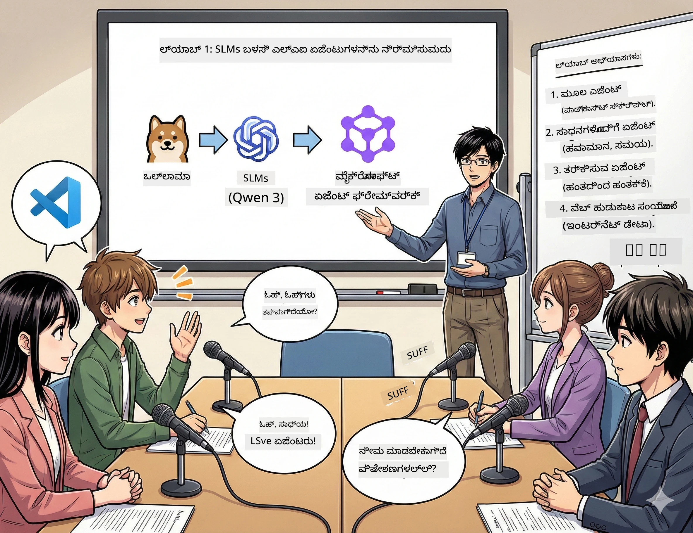

# 第一 ಅಧ್ಯಾಯ: ನಿಮ್ಮ AI ಸಂಶೋಧನಾ ಸಹಾಯಕರನ್ನು ತಿಳಿದುಕೊಳ್ಳಿ 🤖

## ಸವಾಲು

ನೀವು ಹೊಸ "ಭವಿಷ್ಯದ ಬೈಟ್" ತಂತ್ರಜ್ಞಾನ ಪಾಡ್ ಕ್ಯಾಸ್ಟ್ ಅನ್ನು ಬಿಡುಗಡೆ ಮಾಡುತ್ತಿದ್ದೀರಿ. ಮೊದಲ ಗಳಿಗೆ ಇತ್ತೀಚಿನ AI ಸಾಧನೆಗಳನ್ನು ಕುರಿತು ಇದೆ, ಆದರೆ ನಿಮಗೆ 24 ಗಂಟೆಗಳಷ್ಟೇ ಸಿಗುತ್ತದೆ:
1. ವಿಷಯವನ್ನು ಸಂಶೋಧಿಸುವುದು
2. ವಿಶ್ವಾಸಾರ್ಹ ಮೂಲಗಳನ್ನು ಹುಡುಕುವುದು
3. ಆಕರ್ಷಕ ಪಠ್ಯವನ್ನು ಬರೆಯುವುದು
4. ಅದನ್ನು ನೈಸರ್ಗಿಕವಾಗಿ ಕೇಳಿಸುವುದು

**ಕಥಾ ತಿರುವು**: ನೀವು ಇದನ್ನು ಒಂಟಿಯಾಗಿ ಮಾಡಬೇಕಾಗಿಲ್ಲ. ನೀವು ಮೊದಲ AI ಸಹಾಯಕರನ್ನು ನಿರ್ಮಿಸಲು ಹೇಗುತ್ತಿದ್ದೀರಿ, ಅದು ಇದನ್ನು ಎಲ್ಲವನ್ನೂ ಮಾಡಲು ಸಹಾಯ ಮಾಡುತ್ತದೆ. ಅದನ್ನು Alex ಎಂದು ಕರೆಯೋಣ — ನೀವು ಎಂದಿಗೂ ದಣಿವಾಗದ ಸಂಶೋಧನಾ ಪಾಲುದಾರ, ಯಾವಾಗಲೂ ಊರಿನ ಅಗತ್ಯವಿಲ್ಲ.

## ಇಲಿ ಭಾಷಾ ಮಾದರಿಗಳನ್ನು ಯಾಕೆ ಆರಿಸುವುದು? (ಚಿತ್ರರವಣಿಗೆ: ಅವು ಅತ್ಯುತ್ತಮ)

ಎಲ್ಲಾ ಸಣ್ಣ ಭಾಷಾ ಮಾದರಿಗಳನ್ನು (SLM) ನಿಮ್ಮದೇ ಕಂಪ್ಯೂಟರ್‌ನಲ್ಲಿ ಚಲಿಸುವ ವೈಯಕ್ತಿ AI ಎಂದುಕೊಳ್ಳಿ. ಯಾವ ಮೇಘ ಸೇವೆಗಳೂ ಇಲ್ಲ, ಮಾಸಿಕ ಶುಲ್ಕಗಳೂ ಇಲ್ಲ, ಯಾವುದೇ ಶಂಕಾಸ್ಪದ ಡೇಟಾ ಹಂಚಿಕೆಯನ್ನು ಅನುಭವಿಸಬೇಡಿ.

**SLM ಗಳು ಏಕೆ ಅಂತಹ🔥 :**
- **🏠 ನಿಮ್ಮ ಯಂತ್ರದಲ್ಲಿ ಓಡುತ್ತವೆ**: ಲ್ಯಾಪ್‌ಟಾಪ್, ಡೆಸ್ಕ್‌ಟಾಪ್‌, ಇಲ್ಲವಾದರೆ ಶಕ್ತಿ ತುಂಬಿದ ರಾಸ್ಪ್ಬೆರ್ರಿ ಪೈ
- **💸 ನಿರಂತರ ವೆಚ್ಚವಿಲ್ಲ**: ಯಾವುದೇ API ಶುಲ್ಕ ನಿಮ್ಮ ಸಂಚಯವನ್ನು ತಿಂದು ಹೋಗುವುದಿಲ್ಲ
- **🔒 ಗೌಪ್ಯತೆ ಮೊದಲನೆಯದು**: ನಿಮ್ಮ ಡೇಟಾ ಯಾವಾಗಲೂ ನಿಮ್ಮ ಸಾಧನದಿಂದ ಹೊರ ಹೋಗಲಾರದು
- **⚡ ಬಿಸಿರಾಗದ ವೇಗ**: ಜಾಲವಿಲಂಬ ಇಲ್ಲದೆ ತಕ್ಷಣ ಸ್ಪಂದನೆ
- **🪦 ಬಹಳ ಹಗುರವಾದದು**: 10 ಬಿಲ್ಲಿಯನ್-100 ಬಿಲಿಯನ್ ಪ್ಯಾರಾಮೀಟರ್‌ಗಳು ದೊಡ್ಡ ಮಾದರಿಗಳ 1000 ಬಿಲಿಯನ್ ಗಳಿಗೆ ವಿರುದ್ಧ

**ಜನಪ್ರಿಯ SLM ಗಳು**: Qwen 3, Phi-4, Gemma 3 (ಈ ಕಾರ್ಯಾಗಾರದಲ್ಲಿ Qwen ಬಳಕೆ ಮಾಡಲಾಗಿದೆ)

## ನಿಮ್ಮ ಉಪಕರಣಗಳ ಶ್ರೇಣಿ

### Ollama: ನಿಮ್ಮ AI ಮಾದರಿ ವ್ಯವಸ್ಥಾಪಕ

[Ollama](https://ollama.com/) ಒಂದು AI ಮಾದರಿಯ ಸ್ಟೀಮ್ ಹಾಗೆ ಇದೆ. ಸರಳ ಆಜ್ಞೆಗಳ ಮೂಲಕ ಮಾದರಿಗಳನ್ನು ಡೌನ್ ಲೋಡ್ ಮಾಡಿ, ಚಲಿಸಲು ಮತ್ತು ನಿರ್ವಹಿಸಲು.

**ದಕ್ಷಿಣತೆಗಳು:**
- ಯಾವುದೇ ಮಾದರಿಯನ್ನು ಡೌನ್ ಲೋಡ್ ಮತ್ತು ಚಲಿಸುವುದು ಏಕ ಆಜ್ಞೆಯೊಂದಿಗೆ
- Mac, Windows, Linux ಗಾಗಿ ಹೊಂದಿಕೆಯಾಗುತ್ತದೆ
- ನಿಮ್ಮ ಬಳಿ GPU ಇದ್ದರೆ ಸ್ವಯಂಚಾಲಿತವಾಗಿ ಬಳಸುತ್ತದೆ
- ಮೆಮೊರಿ ಅತ್ಯಂತ ಉಳಿವೂ

### Microsoft Agent Framework: ಮಾಯಾಜಾಲ ನಡೆಯುವ ಸ್ಥಳ

[Microsoft Agent Framework](https://github.com/microsoft/agent-framework) ನಿಮ್ಮ AI ಏಜೆಂಟ್‌ಗಳನ್ನು ನಿರ್ಮಿಸಲು ಆಟದ ನಗರ, ಅವು ಸಹ ಮಾಡಬಹುದು:

- 💬 ಸಂಭಾಷಣೆ ಮಾಡೋದು ಮತ್ತು ನೀವು ಮಾತನಾಡಿದ ವಿಷಯವನ್ನು ನೆನಪಿಡಲು
- 🛠️ ಕಸ್ಟಮ್ ಉಪಕರಣಗಳನ್ನು ಬಳಸದಂತೆ (ಉದಾ: ಜಾಲವನ್ನು ಹುಡುಕುವುದು ಅಥವಾ ಹವಾಮಾನ ನೋಡುವುದು)
- 🧠 ಸಂಕೀರ್ಣ ಸಮಸ್ಯೆಗಳನ್ನು ಹಂತ ಹಂತವಾಗಿ ಆಲೋಚಿಸುವುದಕ್ಕೆ
- 🤝 ಟೀಮ್ ಆಗಿ ಇತರ ಏಜೆಂಟ್‌ಗಳೊಂದಿಗೆ ಸಹಕಾರ ಮಾಡುವುದು
- 🔌 ವಿಭಿನ್ನ AI ಸೇವೆಗಳಗೆ ಸಂಪರ್ಕವಾಗುವುದು (OpenAI, Ollama, Azure)

**ಘಟಕಗಳನ್ನು ನಿರ್ಮಿಸುವುದು:**
- **ಏಜೆಂಟ್ ಗಳು (Agents)**: ನಿರ್ದಿಷ್ಟ ಕಾರ್ಯಗಳುಳ್ಳ AI ಸಹಾಯಕರಾಗಿ
- **ಉಪಕರಣಗಳು (Tools)**: ನೀವು ಅವರಿಗೆ ನೀಡುವ ವಿಶೇಷ ಶಕ್ತಿ
- **ಮೆಮೊರಿ (Memory)**: ಅವರು ನಿಮ್ಮ ಸಂಭಾಷಣೆಯನ್ನು ಮರೆತುಹೋಗದಂತೆ
- **ತರ್ಕ (Reasoning)**: ಅವರನ್ನು ಕೇವಲ ಪ್ರತಿಕ್ರಿಯೆ ನೀಡದೆ ಆಲೋಚಿಸಲು ಬೋಧಿಸುವುದು

## ನಿಮ್ಮ ತರಬೇತಿ ಮೋಂಟಾಜ್: 4 ಕಾರ್ಯಗಳು

### ಕಾರ್ಯ 1: ನಿಮ್ಮ ಮೊದಲ ಏಜೆಂಟ್ ರಚಿಸಿ

📓 [ನೋಟ್ಬುಕ್ ತೆರೆಯಿರಿ](../../code/01.BasicAgent/00.BasicAgent-agent.ipynb)

**ಕಾರ್ಯ**: Alex ಅನ್ನು ನಿರ್ಮಿಸಿ, ನಿಮ್ಮ ಪಾಡ್ ಕ್ಯಾಸ್ಟ್ ಪಠ್ಯ ರಚಿಸುವ AI. Alex ಎರಡು ಹೋಸ್ಟ್‌ಗಳು ತಂತ್ರಜ್ಞಾನ ವಿಷಯ ಚರ್ಚಿಸುವ ಸಂಭಾಷಣೆ ಸೃಷ್ಟಿಸಬೇಕು.

**ನೀವು ಕಲಿಯಲಿರುವುದು:**
- AI ಏಜೆಂಟ್ ಅನ್ನು ಪ್ರೇರೇಪಿಸುವುದು (ಸೋಮವಾರ ಬೆಳಿಗ್ಗೆ ಎದ್ದruikthaneಕ್ಕಿಂತ ಸುಲಭ)
- ಅದಕ್ಕೆ ವ್ಯಕ್ತಿತ್ವ ಮತ್ತು ನಿರ್ದೇಶನ ನೀಡುವುದು
- ನಿಜವಾದ ಪಾಡ್ ಕ್ಯಾಸ್ಟ್ ಪಠ್ಯವನ್ನು ಸೃಷ್ಟಿಸುವುದು
- ಅದರ ಪ್ರತಿಕ್ರಿಯೆಗಳನ್ನು ತಿಳಿದುಕೊಳ್ಳುವುದು

**ಸಲುವಾಗಿ**: Alex ನಿಮ್ಮ "ಭವಿಷ್ಯದ ಬೈಟ್" AI ಕುರಿತ ಪ್ರಥಮ ಪ್ರಯೋಗ ಶೃಂಗಕ್ಕೆ ಪಠ್ಯ ಸೃಷ್ಟಿಸಬೇಕು! 🎯

### ಕಾರ್ಯ 2: Alex ಗೆ ಸಲಕರಣೆಗಳು (ಉಪಕರಣಗಳು!)

📓 [ನೋಟ್ಬುಕ್ ತೆರೆಯಿರಿ](../../code/01.BasicAgent/01.BasicAgent-tools.ipynb)

**ಕಾರ್ಯ**: Alex ಬುದ್ಧಿವಂತ ಆದರೆ ಅವನಿಗೆ ಇಂದಿನ ಹವಾಮಾನ ಅಥವಾ ಈಗ ಗಂಟೆ ಏನು ಎಂಬುದರ ತಿಳಿವಳಿಕೆ ಇಲ್ಲ. ಇದನ್ನು ಉದ್ಗಾರಿಸಲು ಅದಕ್ಕೆ ಉಪಕರಣಗಳನ್ನು ಕೊಡೋಣ!

**ನೀವು ಕಲಿಯಲಿರುವುದು:**
- ಕಸ್ಟಮ್ ಪೈಥಾನ್ ಫಂಕ್ಷನ್‌ಗಳನ್ನು "ಉಪಕರಣಗಳು" ರೂಪದಲ್ಲಿ ನಿರ್ಮಿಸುವುದು
- ಯಾವಾಗ ಯಾವ ಉಪಕರಣವನ್ನು ಬಳಸಬೇಕೆಂದು Alex ಗೆ ತಾನು ತೀರ್ಮಾನಿಸುವಂತೆ ಮಾಡುವುದು
- ಅದು ಸ್ವತಃ ಸಮಸ್ಯೆಗಳನ್ನು ಪರಿಹರಿಸುವುದನ್ನು ಗಮನಿಸುವುದು
- ಹಲವಾರು ಉಪಕರಣಗಳನ್ನು ಸೇರಿಸಿ ಸಂಕೀರ್ಣ ಕಾರ್ಯಗಳನ್ನು ಪೂರ್ಣಗೊಳಿಸುವುದು

**ಸಲುವಾಗಿ**: "ಟೋಕಿಯೋ ಹವಾಮಾನ ಹೇಗಿದೆ?" ಎಂದು ಕೇಳಿದಾಗ Alex ತಾನಾಗಿ ಉತ್ತರ ಹುಡುಕಬೇಕು! ☁️

### ಕಾರ್ಯ 3: Alex ಗೆ ಆಲೋಚನೆ ಕಲಿಸಿ

📓 [ನೋಟ್ಬುಕ್ ತೆರೆಯಿರಿ](../../code/01.BasicAgent/02.BasicAgent-reasoning.ipynb)

**ಕಾರ್ಯ**: Alex ತನ್ನ ಕೆಲಸದ ಪ್ರಕ್ರಿಯೆಯನ್ನು ತೋರಿಸಬೇಕು. ಸಮಸ್ಯೆ ಪರಿಹರಿಸುವಾಗ ನೀವು ಅದನ್ನು *ಹೊಂದುತ್ತಿರುವ* ರೀತಿಯನ್ನು ನೋಡಬೇಕು, ಕೇವಲ ಉತ್ತರವಲ್ಲ.

**ನೀವು ಕಲಿಯಲಿರುವುದು:**
- "ತರ್ಕದ ಮೋಡ್" ಅನ್ನು ಆಕ್ಟಿವೇಟ್ ಮಾಡುವುದು (ಗಣಿತ ತರಗತಿಯಿಂದ ನಿಮ್ಮ ಕೆಲಸ ತೋರಿಸುವಂತೆ)
- Alex ರ ಹಂತ ಹಂತದ ಆಲೋಚನೆ ಪ್ರಕ್ರಿಯೆಯನ್ನು ನೋಡುವುದು
- ಚೇನ್ ಆಲೋಚನೆ ಸೂಚನೆಗಳನ್ನು ತಿಳಿದುಕೊಳ್ಳುವುದು
- Alex ಗೊಂದಲಕ್ಕೊಳಗಾದಾಗ ಡಿಬಗ್ ಮಾಡುವುದು

**ಸಲುವಾಗಿ**: ಕಠಿಣ ಗಣಿತ ಪ್ರಶ್ನೆಯನ್ನು ಕೇಳಿ ಮತ್ತು Alex ಅದರ ಆಲೋಚನೆಯನ್ನು ನೋಡಿ! 🧠

### ಕಾರ್ಯ 4: Alex ನವರನ್ನು ಇಂಟರ್ ನೆಟ್ ಗೆ ಸಂಪರ್ಕಿಸಿ

📓 [ನೋಟ್ಬುಕ್ ತೆರೆಯಿರಿ](../../code/01.BasicAgent/03.BasicAgent-websearch.ipynb)

**ಕಾರ್ಯ**: Alex ನ ತಿಳಿವು ಕೆಲವು ದಿನಾಂಕದಿಂದ ಇದ್ದುದು. ನವೀನ ಮಾಹಿತಿಗಾಗಿ ಅದನ್ನು ಜಾಲಕ್ಕೆ ಸಂಪರ್ಕಿಸೋಣ!

**ನೀವು ಕಲಿಯಲಿರುವುದು:**
- ಕಸ್ಟಮ್ ವೆಬ್ ಹುಡುಕಾಟ ಉಪಕರಣ ನಿರ್ಮಿಸುವುದು
- ಬಿಡುಗಡೆಗೊಳಿಸಿದ API ಇಂಟಿಗ್ರೇಟ್ ಮಾಡುವುದು
- ಜಾಲದ ದೋಷಗಳನ್ನು ಶಾಂತವಾಗಿ ನಿರ್ವಹಿಸುವುದು
- Alex ತರಬೇತಿ ಡೇಟಾದ ಹೊರಗಿನ ಮಾಹಿತಿ ಪಡೆಯುವುದು

**ಸಲುವಾಗಿ**: ಇಂದಿನ ತಂತ್ರಜ್ಞಾನ ಸುದ್ದಿಯನ್ನು ಕೇಳಿ ಮತ್ತು ನವೀನ ಫಲಿತಾಂಶಗಳನ್ನು ಪಡೆಯಿರಿ! 📰

## ಪ್ರಾರಂಭಿಸುವ ಮುನ್ನ 🚀

**ಅಗತ್ಯ ಸಾಮಗ್ರಿಗಳು**:
- Python 3.10+ ಇನ್ಸ್ಟಾಲ್ ಆಗಿರಬೇಕು
- Ollama ಓಡುತ್ತಿರಬೇಕು (ಪರಿಶೀಲಿಸಲು `ollama --version` ಬಳಸಿ)
- Python ವಿಸ್ತರಣೆಗಳನ್ನು ಹೊಂದಿರುವ VS Code
- ಕನಿಷ್ಟ 8GB ಮೆಮೊರಿ (ಸರಾಗಿಸಬೇಕಾದರೆ 16GB ಅಗತ್ಯ)

## ಕಾರ್ಯ ಕ್ರಮ

ಸಂಪೂರ್ಣ ಅನುಭವಕ್ಕಾಗಿ ನೋಟ್ಬುಕ್ ಗಳನ್ನು ಕ್ರಮವಾಗಿ ಪೂರ್ಣಗೊಳಿಸಿ:

1. [00.BasicAgent-agent.ipynb](../../code/01.BasicAgent/00.BasicAgent-agent.ipynb) —— Alex (ನಿಮ್ಮ ಪ್ರಥಮ ಏಜೆಂಟ್) ನಿಮಗೆ ಪರಿಚಯ
2. [01.BasicAgent-tools.ipynb](../../code/01.BasicAgent/01.BasicAgent-tools.ipynb) —— ಅಪ್ಗ್ರೇಡ್ ಸಮಯ!
3. [02.BasicAgent-reasoning.ipynb](../../code/01.BasicAgent/02.BasicAgent-reasoning.ipynb) —— Alex ಗೆ ಆಲೋಚನೆ ಕಲಿಸು
4. [03.BasicAgent-websearch.ipynb](../../code/01.BasicAgent/03.BasicAgent-websearch.ipynb) —— ಇಂಟರ್ ನೆಟ್ ಪ್ರವೇಶವನ್ನು ಅನ್ಲಾಕ್ ಮಾಡಿ!

## ನೀವು ಏನು ನೈಪುಣ್ಯ ಪಡೆದುಕೊಳ್ಳುತ್ತೀರಿ

ಮೊದಲ ಅಧ್ಯಾಯ ಮುಗಿಸಿದ ಮೇಲೆ, ನೀವು ಮುಂದೆ ಮಾಡಬಲ್ಲಿರಿ:

- ✅ ನಿಮ್ಮದೇ ಸಾಧನದಲ್ಲಿ AI ಮಾದರಿಗಳನ್ನು ಚಾಲನೆಯಲ್ಲಿ ಇಡಬಹುದು (ಮೇಘವಿಲ್ಲದೆ!)
- ✅ ಕಸ್ಟಮ್ ವ್ಯಕ್ತಿತ್ವ ಮತ್ತು ಕೌಶಲ್ಯದೊಂದಿಗೆ ಏಜೆಂಟ್‌ಗಳನ್ನು ನಿರ್ಮಿಸಬಹುದು
- ✅ ಏಜೆಂಟ್‌ಗಳಿಗೆ ಕಾರ್ಯಗಳನ್ನು ಪರಿಹರಿಸಲು ಉಪಕರಣಗಳನ್ನು ನೀಡಬಹುದು
- ✅ ಏಜೆಂಟ್‌ಗಳು ತಮ್ಮ ತರ್ಕ ಪ್ರಕ್ರಿಯೆಗಳನ್ನು ಪ್ರದರ್ಶಿಸಲು ಕಲಿಸಬಹುದು
- ✅ ಏಜೆಂಟ್‌ಗಳನ್ನು ಬಾಹ್ಯ ಡೇಟಾ ಮೂಲಗಳ ಜೊತೆ ಸಂಪರ್ಕಿಸಲು ಸಾಧ್ಯ
- ✅ ಸಮಸ್ಯೆಗಳಾಗುವಾಗ ಡಿಬಗ್ ಮಾಡಬಹುದು

## ಸಮಸ್ಯೆಗಳು ಬಂದಾಗ (ಮತ್ತು ಏಗೆ ಸರಿಪಡಿಸು)🔧

### "Alex ಲೋಡ್ ಆಗುತ್ತಿಲ್ಲ! ಮೆಮೊರಿ ಕಡಿಮೆಯಾಗಿದೆ!"
**ತೊರೆಯುವದಕ್ಕೆ:** ನಿಮ್ಮ ಕಂಪ್ಯೂಟರ್ ಒತ್ತಡದಲ್ಲಿದೆ. ಬೇರೆ ಆ್ಯಪ್ಲಿಕೇಶನ್‌ಗಳನ್ನು ಮುಚ್ಚಿ ಅಥವಾ ಶ್ರೇಷ್ಠವಾದ ಸಣ್ಣ ಮಾದರಿಗೆ ಬದಲಿಸಿ. ಕನಿಷ್ಟ 8GB ಮೆಮೊರಿ ಅಗತ್ಯ.

### "Alex ತುಂಬಾ ನಿಧಾನವಾಗಿದೆ"
**ತೊರೆಯುವದಕ್ಕೆ:** Ollama ಸೆಟ್ಟಿಂಗ್ಸ್ ನಲ್ಲಿ GPU ವೇಗಾ ಸಕ್ರಿಯಮಾಡಿ. ಅಥವಾ ವಿಭಾಗ ವಿಂಡೋ ಗಾತ್ರವನ್ನು ಕಡಿಮೆ ಮಾಡಿ. ವೇಗದ ದೂತದ ಮೋಡ್ ಸಕ್ರಿಯ! 🏎️

### "ಉಪಕರಣಗಳು ಕೆಲಸ ಮಾಡುತ್ತಿಲ್ಲ!"
**ತೊರೆಯುವದಕ್ಕೆ:** ನಿಮ್ಮ ಫಂಕ್ಷನ್ ಸಹಿತಿಯನ್ನು ಪರಿಶೀಲಿಸಿ. Alex ಗೆ ಉಪಕರಣದ ಕಾರ್ಯವನ್ನು ತಿಳಿಯಲು ಸರಿಯಾದ ಪ್ರಕಾರ ಸೂಚನೆಗಳು ಅಗತ್ಯವಿದೆ. ಇದನ್ನು ಸ್ಪಷ್ಟ ಆದೇಶ ನೀಡಿ ಇಲ್ಲಿ ಭಾವಿಸಿ.

## ಉಪಯುಕ್ತ ಲಿಂಕುಗಳು 🔗

- [Agent Framework ಡಾಕ್ಯುಮೆಂಟೇಶನ್](https://github.com/microsoft/agent-framework) —— ಅಧಿಕೃತ ಮಾರ್ಗದರ್ಶಿ ಮತ್ತು ಉದಾಹರಣೆಗಳು
- [Ollama ಮಾದರಿ ಗ್ರಂಥಾಲಯ](https://ollama.com/library) —— ಎಲ್ಲ ಲಭ್ಯವಿರುವ ಮಾದರಿಗಳನ್ನು ಬ್ರೌಸ್ ಮಾಡಿ
- [Qwen ಮಾದರಿ](https://ollama.com/library/qwen3) —— ನಿಮ್ಮ AI ಸಹಾಯಕರ ಮೆದುಳು
- [ಕೋಡ್ ಉದಾಹರಣೆಗಳು](https://github.com/microsoft/agent-framework/tree/main/python/samples) —— ಇಲ್ಲಿ ಇಲ್ಲಿಂದ ಪ್ರೇರಣೆ ಪಡೆಯಿರಿ

## ಮುಂದಿನ ಹಂತ: ಎರಡನೇ ಅಧ್ಯಾಯ 🎬

ನೀವು ಏಜೆಂಟ್ ಹೊಂದಿದ್ದೀರಿ. ಆದರೆ ನೀವು ಏಜೆಂಟ್ ಗಳ ತಂಡ ಹೊಂದಿದ್ದರೆ? ಎರಡನೇ ಅಧ್ಯಾಯದಲ್ಲಿ ನೀವು ಸಂಪೂರ್ಣ ಪಾಡ್ ಕ್ಯಾಸ್ಟ್ ತಂಡವನ್ನು ನಿರ್ಮಿಸುವಿರಿ:
- **ಸಂಶೋಧನೆ ಏಜೆಂಟ್**: ಅತ್ಯುತ್ತಮ ಮೂಲಗಳನ್ನು ಹುಡುಕು
- **ಲೇಖನ ಏಜೆಂಟ್**: ಪರಿಪೂರ್ಣ ಪಠ್ಯ ಸೃಷ್ಟಿಸಿ
- **ಸಂಪಾದನೆ (ನೀವು!)**: ಅನುಮೋದನೆ ಅಥವಾ ಬದಲಾವಣೆ ಕೇಳಿ

ನಾವು ಕೆಲವು AI ಮಾಯಾಜಾಲಗಳನ್ನು ಸಂಯೋಜಿಸೋಣ! → [ಎರಡನೇ ಅಧ್ಯಾಯ: ನಿಮ್ಮ ನಿರ್ಮಾಣ ತಂಡವನ್ನು ಸಂಘಟಿಸುವುದು](02.AIAgentOrchestrationAndWorkflows.md)

---

**ಸಂಕಷ್ಟದಲ್ಲಿದ್ದೀರಾ?** ಕಾರ್ಯಾಗಾರದಲ್ಲಿ ಪ್ರಶ್ನಿಸಿರಿ. ನಾವು ಒಟ್ಟಿಗೆ ಕಲಿಯೋಣ! 🙌

---

<!-- CO-OP TRANSLATOR DISCLAIMER START -->
**ನಿರಾಕರಣಾ ಘೋಷಣೆ**:  
ಈ ದಾಖಲೆ AI ಅನುವಾದ ಸೇವೆ [Co-op Translator](https://github.com/Azure/co-op-translator) ಬಳಸಿ ಅನುವಾದಿಸಲಾಗಿದೆ. ನಾವು ಶುದ್ಧತೆಯನ್ನು ಸಾಧಿಸಲು ಪ್ರಯತ್ನಿಸುವಾಗಲೂ, ಸ್ವಯಂಚಾಲಿತ ಅನುವಾದಗಳಲ್ಲಿ ತಪ್ಪುಗಳು ಅಥವಾ ಅಸತ್ಯತೆಗಳು ಇರಬಹುದು ಎಂಬುದನ್ನು ದಯವಿಟ್ಟು ಗಮನದಲ್ಲಿರಿಸಿಕೊಳ್ಳಿ. ಮೂಲ ಭಾಷೆಯಲ್ಲಿನ ಮೂಲ ದಾಖಲೆ ಅಧಿಕಾರಪ್ರಾಪ್ತ ಮೂಲವಾಗಿರಬೇಕು. ಮಹತ್ವಪೂರ್ಣ ಮಾಹಿತಿಗಾಗಿ, ವೃತ್ತಿಪರ ಮಾನವ ಅನುವಾದವನ್ನು ಶಿಫಾರಸು ಮಾಡಲಾಗುತ್ತದೆ. ಈ ಅನುವಾದ ಬಳಕೆಯಿಂದ ಉಂಟಾಗುವ ಯಾವುದೇ ತಿಪ್ಪಣಿಗಳು ಅಥವಾ ತಪ್ಪು ವ್ಯಾಖ್ಯಾನಗಳಿಗೆ ನಾವು ಜವಾಬ್ದಾರಿಗಳಲ್ಲ.
<!-- CO-OP TRANSLATOR DISCLAIMER END -->