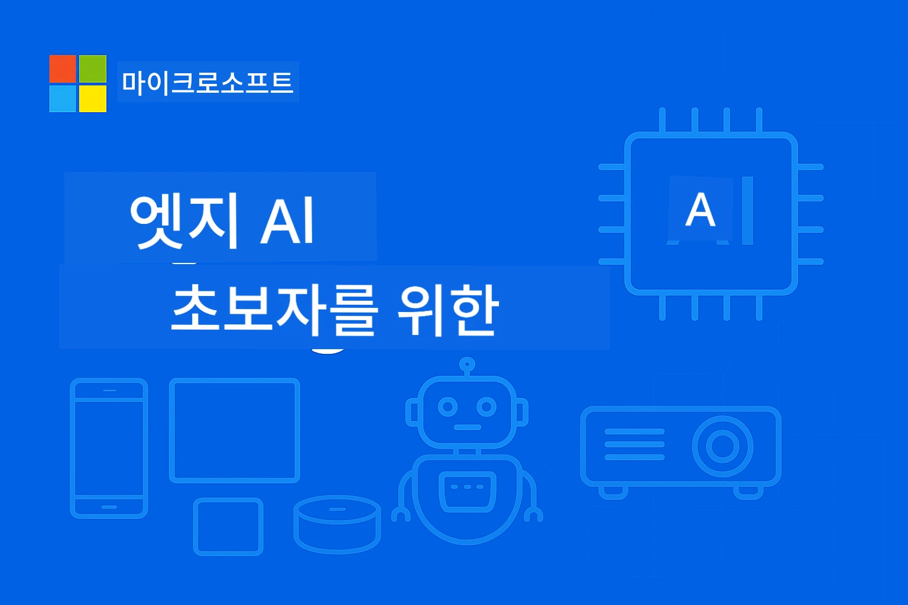

# EdgeAI for Beginners 




[](https://GitHub.com/microsoft/edgeai-for-beginners/graphs/contributors)
[](https://GitHub.com/microsoft/edgeai-for-beginners/issues)
[](https://GitHub.com/microsoft/edgeai-for-beginners/pulls)
[](http://makeapullrequest.com)

[](https://GitHub.com/microsoft/edgeai-for-beginners/watchers)
[](https://GitHub.com/microsoft/edgeai-for-beginners/fork)
[](https://GitHub.com/microsoft/edgeai-for-beginners/stargazers)


[](https://discord.gg/nTYy5BXMWG)

이 리소스를 사용하여 시작하려면 다음 단계를 따르세요:

1. **저장소 포크하기**: 클릭 [](https://GitHub.com/microsoft/edgeai-for-beginners/fork)
2. **저장소 클론하기**:   `git clone https://github.com/microsoft/edgeai-for-beginners.git`
3. [**Azure AI Foundry Discord에 가입하여 전문가 및 동료 개발자 만나기**](https://discord.com/invite/ByRwuEEgH4)


### 🌐 다국어 지원

#### GitHub Action을 통한 지원 (자동 및 항상 최신 상태 유지)

<!-- CO-OP TRANSLATOR LANGUAGES TABLE START -->
[Arabic](../ar/README.md) | [Bengali](../bn/README.md) | [Bulgarian](../bg/README.md) | [Burmese (Myanmar)](../my/README.md) | [Chinese (Simplified)](../zh-CN/README.md) | [Chinese (Traditional, Hong Kong)](../zh-HK/README.md) | [Chinese (Traditional, Macau)](../zh-MO/README.md) | [Chinese (Traditional, Taiwan)](../zh-TW/README.md) | [Croatian](../hr/README.md) | [Czech](../cs/README.md) | [Danish](../da/README.md) | [Dutch](../nl/README.md) | [Estonian](../et/README.md) | [Finnish](../fi/README.md) | [French](../fr/README.md) | [German](../de/README.md) | [Greek](../el/README.md) | [Hebrew](../he/README.md) | [Hindi](../hi/README.md) | [Hungarian](../hu/README.md) | [Indonesian](../id/README.md) | [Italian](../it/README.md) | [Japanese](../ja/README.md) | [Kannada](../kn/README.md) | [Korean](./README.md) | [Lithuanian](../lt/README.md) | [Malay](../ms/README.md) | [Malayalam](../ml/README.md) | [Marathi](../mr/README.md) | [Nepali](../ne/README.md) | [Nigerian Pidgin](../pcm/README.md) | [Norwegian](../no/README.md) | [Persian (Farsi)](../fa/README.md) | [Polish](../pl/README.md) | [Portuguese (Brazil)](../pt-BR/README.md) | [Portuguese (Portugal)](../pt-PT/README.md) | [Punjabi (Gurmukhi)](../pa/README.md) | [Romanian](../ro/README.md) | [Russian](../ru/README.md) | [Serbian (Cyrillic)](../sr/README.md) | [Slovak](../sk/README.md) | [Slovenian](../sl/README.md) | [Spanish](../es/README.md) | [Swahili](../sw/README.md) | [Swedish](../sv/README.md) | [Tagalog (Filipino)](../tl/README.md) | [Tamil](../ta/README.md) | [Telugu](../te/README.md) | [Thai](../th/README.md) | [Turkish](../tr/README.md) | [Ukrainian](../uk/README.md) | [Urdu](../ur/README.md) | [Vietnamese](../vi/README.md)

> **로컬에서 클론하기를 선호하나요?**

> 이 저장소에는 50개 이상의 언어 번역이 포함되어 있어 다운로드 크기가 상당히 큽니다. 번역 없이 클론하려면 sparse checkout을 사용하세요:
> ```bash
> git clone --filter=blob:none --sparse https://github.com/microsoft/edgeai-for-beginners.git
> cd edgeai-for-beginners
> git sparse-checkout set --no-cone '/*' '!translations' '!translated_images'
> ```
> 이렇게 하면 훨씬 빠른 다운로드로 강의를 완수하는 데 필요한 모든 것이 제공됩니다.
<!-- CO-OP TRANSLATOR LANGUAGES TABLE END -->

**추가 지원되는 번역 언어가 필요하면 [여기](https://github.com/Azure/co-op-translator/blob/main/getting_started/supported-languages.md)에서 확인하세요**
## 소개

**EdgeAI for Beginners**에 오신 것을 환영합니다 – Edge 인공지능의 혁신적 세계로 안내하는 포괄적 여정입니다. 이 과정은 강력한 AI 역량과 엣지 기기에서의 실질적이고 실제적인 배포 간의 격차를 해소하여, 데이터가 생성되고 의사결정이 이루어져야 하는 현장에서 AI의 잠재력을 직접 활용할 수 있게 합니다.

### 여러분이 습득할 내용

이 과정은 기본 개념에서부터 생산 준비 완료 수준 구현까지 다루며, 다음을 포함합니다:
- 엣지 배포에 최적화된 **소형 언어 모델(SLM)**
- 다양한 플랫폼에 맞춘 **하드웨어 인지 최적화**
- **실시간 추론**과 개인 정보 보호 기능
- 엔터프라이즈 애플리케이션을 위한 **생산 배포 전략**

### 왜 EdgeAI가 중요한가

Edge AI는 현대의 중요한 도전 과제를 해결하는 패러다임 전환을 의미합니다:
- **개인정보 보호 및 보안**: 클라우드 노출 없이 민감한 데이터를 로컬에서 처리
- **실시간 성능**: 시간 중요한 애플리케이션을 위한 네트워크 지연 제거
- **비용 효율성**: 대역폭 및 클라우드 컴퓨팅 비용 절감
- **탄력적 운영**: 네트워크 장애 시에도 기능 유지
- **규제 준수**: 데이터 주권 요구사항 충족

### Edge AI

Edge AI는 데이터가 생성되는 장소 근처 하드웨어에서 AI 알고리즘과 언어 모델을 로컬로 실행하는 것을 의미하며, 추론을 위해 클라우드 자원에 의존하지 않습니다. 이는 지연 시간을 줄이고 개인 정보 보호를 강화하며 실시간 의사결정을 가능하게 합니다.

### 핵심 원칙:
- **온디바이스 추론**: AI 모델은 폰, 라우터, 마이크로컨트롤러, 산업용 PC 등 엣지 기기에서 실행
- **오프라인 기능**: 지속적인 인터넷 연결 없이 작동 가능
- **저지연**: 실시간 시스템에 적합한 즉각적인 응답
- **데이터 주권**: 민감한 데이터를 로컬에 보관해 보안 및 규정 준수 향상

### 소형 언어 모델(SLM)

Phi-4, Mistral-7B, Gemma와 같은 SLM은 대형 LLM을 훈련 또는 증류하여 최적화한 버전으로:
- **메모리 사용량 감소**: 제한된 엣지 기기 메모리를 효율적으로 사용
- **컴퓨팅 요구량 감소**: CPU 및 엣지 GPU 성능에 맞게 최적화
- **빠른 시작 시간**: 반응형 애플리케이션을 위한 신속한 초기화

다음과 같은 제약을 충족하면서 강력한 NLP 역량을 제공합니다:
- **임베디드 시스템**: IoT 장치 및 산업용 제어기
- **모바일 기기**: 오프라인 기능이 있는 스마트폰 및 태블릿
- **IoT 기기**: 제한된 리소스를 갖춘 센서 및 스마트 장치
- **엣지 서버**: 제한된 GPU 자원을 가진 로컬 처리 유닛
- **개인용 컴퓨터**: 데스크탑과 노트북 배포 시나리오

## 강좌 모듈 및 탐색

| 모듈 | 주제 | 집중 영역 | 주요 내용 | 수준 | 소요 시간 |
|--------|-------|------------|-------------|--------|----------|
| [📖 00 ](./introduction.md) | [EdgeAI 소개](./introduction.md) | 기초 및 맥락 | EdgeAI 개요 • 산업 적용 사례 • SLM 소개 • 학습 목표 | 초급 | 1-2 시간 |
| [📚 01](../../Module01) | [EdgeAI 기초](./Module01/README.md) | 클라우드 vs 엣지 AI 비교 | EdgeAI 기본 원리 • 실제 사례 연구 • 구현 가이드 • 엣지 배포 | 초급 | 3-4 시간 |
| [🧠 02](../../Module02) | [SLM 모델 기초](./Module02/README.md) | 모델 패밀리 및 아키텍처 | Phi 패밀리 • Qwen 패밀리 • Gemma 패밀리 • BitNET • μModel • Phi-Silica | 초급 | 4-5 시간 |
| [🚀 03](../../Module03) | [SLM 배포 실습](./Module03/README.md) | 로컬 및 클라우드 배포 | 고급 학습 • 로컬 환경 • 클라우드 배포 | 중급 | 4-5 시간 |
| [⚙️ 04](../../Module04) | [모델 최적화 도구 모음](./Module04/README.md) | 크로스 플랫폼 최적화 | 소개 • Llama.cpp • Microsoft Olive • OpenVINO • Apple MLX • 워크플로우 합성 | 중급 | 5-6 시간 |
| [🔧 05](../../Module05) | [SLMOps 생산 운영](./Module05/README.md) | 생산 운영 | SLMOps 소개 • 모델 증류 • 미세 조정 • 생산 배포 | 고급 | 5-6 시간 |
| [🤖 06](../../Module06) | [AI 에이전트 및 함수 호출](./Module06/README.md) | 에이전트 프레임워크 및 MCP | 에이전트 소개 • 함수 호출 • 모델 컨텍스트 프로토콜 | 고급 | 4-5 시간 |
| [💻 07](../../Module07) | [플랫폼 구현](./Module07/README.md) | 크로스 플랫폼 샘플 | AI 도구 세트 • Foundry 로컬 • 윈도우 개발 | 고급 | 3-4 시간 |
| [🏭 08](../../Module08) | [Foundry 로컬 도구 모음](./Module08/README.md) | 생산 준비 샘플 | 샘플 애플리케이션 (아래 상세 참조) | 전문가 | 8-10 시간 |

### 🏭 **모듈 08: 샘플 애플리케이션**

- [01: REST 채팅 빠른 시작](./Module08/samples/01/README.md)
- [02: OpenAI SDK 통합](./Module08/samples/02/README.md)
- [03: 모델 발견 및 벤치마킹](./Module08/samples/03/README.md)
- [04: Chainlit RAG 애플리케이션](./Module08/samples/04/README.md)
- [05: 멀티 에이전트 오케스트레이션](./Module08/samples/05/README.md)
- [06: 모델-툴 라우터](./Module08/samples/06/README.md)
- [07: 직접 API 클라이언트](./Module08/samples/07/README.md)
- [08: 윈도우 11 채팅 앱](./Module08/samples/08/README.md)
- [09: 고급 멀티 에이전트 시스템](./Module08/samples/09/README.md)
- [10: Foundry 도구 프레임워크](./Module08/samples/10/README.md)

### 🎓 **워크숍: 실습 학습 경로**

생산 준비 완료 구현을 포함한 종합적인 실습 워크숍 자료:

- **[워크숍 가이드](./Workshop/Readme.md)** - 완전한 학습 목표, 결과 및 리소스 탐색
- **파이썬 샘플** (6 세션) - 모범 사례, 오류 처리, 종합 문서 개선판
- **주피터 노트북** (8개 인터랙티브) - 단계별 튜토리얼과 벤치마크, 성능 모니터링
- **세션 가이드** - 각 워크숍 세션의 상세 마크다운 가이드
- **검증 도구** - 코드 품질 확인 및 스모크 테스트 스크립트

**여러분이 만들게 될 것들:**
- 스트리밍 지원을 갖춘 로컬 AI 채팅 애플리케이션
- 품질 평가 기능(RAGAS)이 포함된 RAG 파이프라인
- 멀티 모델 벤치마킹 및 비교 도구
- 멀티 에이전트 오케스트레이션 시스템
- 작업 기반 선택을 지원하는 지능형 모델 라우팅

### 🎙️ **Agentic 워크숍: 실습 - AI 팟캐스트 스튜디오**

AI 기반 팟캐스트 제작 파이프라인을 처음부터 구축하세요! 이 몰입형 워크숍은 아이디어를 전문적인 팟캐스트 에피소드로 변환하는 완전한 멀티 에이전트 시스템을 만드는 방법을 가르쳐줍니다.
**[🎬 AI 팟캐스트 스튜디오 워크숍 시작하기](./WorkshopForAgentic/README.md)**

**당신의 미션**: 직접 구축한 AI 에이전트만으로 완전 구동되는 기술 팟캐스트 "Future Bytes"를 출시하세요. 클라우드 의존성이나 API 비용 없이 모든 작업이 여러분의 기기에서 로컬로 실행됩니다.

**독특한 점:**
- **🤖 진짜 다중 에이전트 오케스트레이션** - 연구, 글쓰기, 오디오 제작을 하는 전문 AI 에이전트 구축
- **🎯 완전한 제작 파이프라인** - 주제 선정부터 최종 팟캐스트 오디오 출력까지
- **💻 100% 로컬 배포** - Ollama와 로컬 모델(Qwen-3-8B) 사용으로 완벽한 개인 정보 보호 및 제어 가능
- **🎤 텍스트-음성 변환 통합** - 스크립트를 자연스러운 멀티 스피커 대화로 변환
- **✋ 인간 참여 워크플로우** - 승인 단계를 통해 품질 유지와 자동화의 균형 실현

**3막 학습 여정:**

| 막 | 초점 | 주요 기술 | 소요 시간 |
|-----|-------|------------|----------|
| **[1막: AI 어시스턴트 만나기](./WorkshopForAgentic/md/01.BuildAIAgentWithSLM.md)** | 첫 AI 에이전트 구축 | 도구 통합 • 웹 검색 • 문제 해결 • 에이전트적 추론 | 2-3시간 |
| **[2막: 제작 팀 구성](./WorkshopForAgentic/md/02.AIAgentOrchestrationAndWorkflows.md)** | 다중 에이전트 오케스트레이션 | 팀 조정 • 승인 워크플로우 • DevUI 인터페이스 • 인간 감독 | 3-4시간 |
| **[3막: 팟캐스트 생생하게 만들기](./WorkshopForAgentic/md/03.Multi-SpeakerPodcastGenerationWithVibeVoice.md)** | 팟캐스트 오디오 생성 | 텍스트-음성 • 멀티 스피커 합성 • 장시간 오디오 • 완전 자동화 | 2-3시간 |

**사용 기술:**
- **Microsoft Agent Framework** - 다중 에이전트 오케스트레이션 및 조율
- **Ollama** - 로컬 AI 모델 런타임(클라우드 불필요)
- **Qwen-3-8B** - 에이전트 작업에 최적화된 오픈소스 언어 모델
- **텍스트-음성 API** - 팟캐스트 생성용 자연스러운 음성 합성

**하드웨어 지원:**
- ✅ **CPU 모드** - 최신 PC(8GB+ RAM 권장)에서 작동
- 🚀 **GPU 가속** - NVIDIA/AMD GPU로 대폭 빠른 추론
- ⚡ **NPU 지원** - 차세대 신경처리장치 가속

**적합 대상:**
- 다중 에이전트 AI 시스템을 배우는 개발자
- AI 자동화 및 워크플로우에 관심 있는 모든 사람
- AI 보조 제작을 탐구하는 콘텐츠 제작자
- 실무 AI 오케스트레이션 패턴을 공부하는 학생

**지금 시작하기**: [🎙️ AI 팟캐스트 스튜디오 워크숍 →](./WorkshopForAgentic/README.md)

### 📊 **학습 경로 요약**
- **전체 소요 시간**: 36-45시간
- **초급 경로**: 모듈 01-02 (7-9시간)  
- **중급 경로**: 모듈 03-04 (9-11시간)
- **고급 경로**: 모듈 05-07 (12-15시간)
- **전문가 경로**: 모듈 08 (8-10시간)

## 여러분이 만들게 될 것

### 🎯 핵심 역량
- **엣지 AI 아키텍처**: 클라우드 연동이 가능한 로컬 우선 AI 시스템 설계
- **모델 최적화**: 엣지 배포를 위한 모델 양자화 및 압축(속도 85% 향상, 크기 75% 감소)
- **다중 플랫폼 배포**: 윈도우, 모바일, 임베디드, 클라우드-엣지 하이브리드 시스템
- **운영 관리**: 운영 중 엣지 AI 모니터링, 확장, 유지 관리

### 🏗️ 실전 프로젝트
- **Foundry 로컬 채팅 앱**: 모델 전환 기능을 갖춘 윈도우 11 네이티브 앱
- **다중 에이전트 시스템**: 복잡한 워크플로우를 위한 코디네이터 및 전문 에이전트  
- **RAG 애플리케이션**: 로컬 문서 처리 및 벡터 검색
- **모델 라우터**: 작업 분석에 따른 지능적 모델 선택
- **API 프레임워크**: 스트리밍 및 상태 모니터링을 갖춘 프로덕션 클라이언트
- **크로스 플랫폼 도구**: LangChain/Semantic Kernel 통합 패턴

### 🏢 산업별 응용 분야
**제조** • **헬스케어** • **자율 주행 차량** • **스마트 시티** • **모바일 앱**

## 빠른 시작

**추천 학습 경로** (총 20-30시간):

0. **📖 소개** ([Introduction.md](./introduction.md)): EdgeAI 기초 + 산업 배경 + 학습 프레임워크
1. **📚 기초** (모듈 01-02): EdgeAI 개념 + SLM 모델군
2. **⚙️ 최적화** (모듈 03-04): 배포 + 양자화 프레임워크  
3. **🚀 프로덕션** (모듈 05-06): SLMOps + AI 에이전트 + 함수 호출
4. **💻 구현** (모듈 07-08): 플랫폼 예제 + Foundry 로컬 툴킷

각 모듈은 이론, 실습, 프로덕션 수준 코드 샘플로 구성됩니다.

## 경력 영향

**기술 직무**: EdgeAI 솔루션 아키텍트 • 엣지 ML 엔지니어 • IoT AI 개발자 • 모바일 AI 개발자

**산업 분야**: 제조 4.0 • 헬스케어 기술 • 자율 시스템 • 핀테크 • 소비자 전자제품

**포트폴리오 프로젝트**: 다중 에이전트 시스템 • 프로덕션 RAG 앱 • 크로스 플랫폼 배포 • 성능 최적화

## 저장소 구조

```
edgeai-for-beginners/
├── 📖 introduction.md  # Foundation: EdgeAI Overview & Learning Framework
├── 📚 Module01-04/     # Fundamentals → SLMs → Deployment → Optimization  
├── 🔧 Module05-06/     # SLMOps → AI Agents → Function Calling
├── 💻 Module07/        # Platform Samples (VS Code, Windows, Jetson, Mobile)
├── 🏭 Module08/        # Foundry Local Toolkit + 10 Comprehensive Samples
│   ├── samples/01-06/  # Foundation: REST, SDK, RAG, Agents, Routing
│   └── samples/07-10/  # Advanced: API Client, Windows App, Enterprise Agents, Tools
├── 🌐 translations/    # Multi-language support (8+ languages)
└── 📋 STUDY_GUIDE.md   # Structured learning paths & time allocation
```

## 과정 하이라이트

✅ **점진적 학습**: 이론 → 실습 → 프로덕션 배포  
✅ **실제 사례 연구**: Microsoft, 일본항공, 기업 도입 사례  
✅ **핸즈온 샘플**: 50+ 예제, 10개 종합 Foundry Local 데모  
✅ **성능 집중**: 85% 속도 향상, 75% 크기 감소  
✅ **다중 플랫폼**: 윈도우, 모바일, 임베디드, 클라우드-엣지 하이브리드  
✅ **프로덕션 준비 완료**: 모니터링, 확장, 보안, 준수 프레임워크

📖 **[학습 가이드 제공](STUDY_GUIDE.md)**: 20시간 구조화된 학습 경로로 시간 배분 및 자기평가 도구 포함.

---

**EdgeAI는 AI 배포의 미래입니다**: 로컬 우선, 개인정보 보호, 효율적. 이 기술을 익혀 차세대 지능형 애플리케이션을 구축하세요.

## 기타 과정

저희 팀에서 제작한 다른 과정들도 확인해 보세요!

<!-- CO-OP TRANSLATOR OTHER COURSES START -->
### LangChain
[](https://aka.ms/langchain4j-for-beginners)
[](https://aka.ms/langchainjs-for-beginners?WT.mc_id=m365-94501-dwahlin)

---

### Azure / Edge / MCP / Agents
[](https://github.com/microsoft/AZD-for-beginners?WT.mc_id=academic-105485-koreyst)
[](https://github.com/microsoft/edgeai-for-beginners?WT.mc_id=academic-105485-koreyst)
[](https://github.com/microsoft/mcp-for-beginners?WT.mc_id=academic-105485-koreyst)
[](https://github.com/microsoft/ai-agents-for-beginners?WT.mc_id=academic-105485-koreyst)

---
 
### 생성 AI 시리즈
[](https://github.com/microsoft/generative-ai-for-beginners?WT.mc_id=academic-105485-koreyst)
[-9333EA?style=for-the-badge&labelColor=E5E7EB&color=9333EA)](https://github.com/microsoft/Generative-AI-for-beginners-dotnet?WT.mc_id=academic-105485-koreyst)
[-C084FC?style=for-the-badge&labelColor=E5E7EB&color=C084FC)](https://github.com/microsoft/generative-ai-for-beginners-java?WT.mc_id=academic-105485-koreyst)
[-E879F9?style=for-the-badge&labelColor=E5E7EB&color=E879F9)](https://github.com/microsoft/generative-ai-with-javascript?WT.mc_id=academic-105485-koreyst)

---
 
### 핵심 학습
[](https://aka.ms/ml-beginners?WT.mc_id=academic-105485-koreyst)
[](https://aka.ms/datascience-beginners?WT.mc_id=academic-105485-koreyst)
[](https://aka.ms/ai-beginners?WT.mc_id=academic-105485-koreyst)
[](https://github.com/microsoft/Security-101?WT.mc_id=academic-96948-sayoung)
[](https://aka.ms/webdev-beginners?WT.mc_id=academic-105485-koreyst)
[](https://aka.ms/iot-beginners?WT.mc_id=academic-105485-koreyst)
[](https://github.com/microsoft/xr-development-for-beginners?WT.mc_id=academic-105485-koreyst)

---
 
### 코파일럿 시리즈
[](https://aka.ms/GitHubCopilotAI?WT.mc_id=academic-105485-koreyst)
[](https://github.com/microsoft/mastering-github-copilot-for-dotnet-csharp-developers?WT.mc_id=academic-105485-koreyst)
[](https://github.com/microsoft/CopilotAdventures?WT.mc_id=academic-105485-koreyst)
<!-- CO-OP TRANSLATOR OTHER COURSES END -->

## 도움 받기

AI 앱 개발에 대해 막히거나 질문이 있을 경우 다음에 참여하세요:

[](https://discord.gg/nTYy5BXMWG)

제품 관련 피드백이나 빌드 중 오류가 있을 경우 다음을 방문하세요:

[](https://aka.ms/foundry/forum)

---

<!-- CO-OP TRANSLATOR DISCLAIMER START -->
**면책 조항**:  
이 문서는 AI 번역 서비스 [Co-op Translator](https://github.com/Azure/co-op-translator)를 사용하여 번역되었습니다. 정확성을 위해 최선을 다하고 있지만, 자동 번역에는 오류나 부정확한 내용이 포함될 수 있으니 유의하시기 바랍니다. 원문은 권위 있는 출처로 간주되어야 합니다. 중요한 정보의 경우 전문 인력에 의한 번역을 권장합니다. 이 번역의 사용으로 인한 오해나 잘못된 해석에 대해 당사는 책임을 지지 않습니다.
<!-- CO-OP TRANSLATOR DISCLAIMER END -->