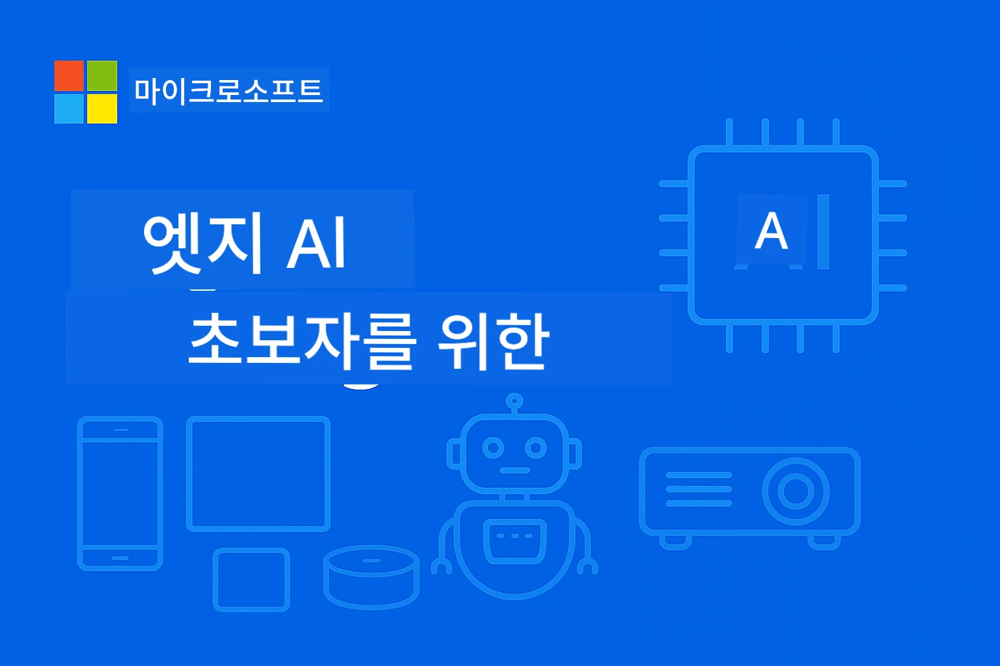

# 초보자를 위한 EdgeAI




[](https://GitHub.com/microsoft/edgeai-for-beginners/graphs/contributors)
[](https://GitHub.com/microsoft/edgeai-for-beginners/issues)
[](https://GitHub.com/microsoft/edgeai-for-beginners/pulls)
[](http://makeapullrequest.com)

[](https://GitHub.com/microsoft/edgeai-for-beginners/watchers)
[](https://GitHub.com/microsoft/edgeai-for-beginners/fork)
[](https://GitHub.com/microsoft/edgeai-for-beginners/stargazers)


[](https://discord.gg/nTYy5BXMWG)

다음 단계를 따라 이 리소스를 시작하세요:

1. **저장소 포크하기**: 클릭 [](https://GitHub.com/microsoft/edgeai-for-beginners/fork)
2. **저장소 클론하기**: `git clone https://github.com/microsoft/edgeai-for-beginners.git`
3. [**Azure AI Foundry Discord에 참여하여 전문가와 동료 개발자 만나기**](https://discord.com/invite/ByRwuEEgH4)


### 🌐 다국어 지원

#### GitHub 액션을 통해 지원됨 (자동화 및 항상 최신 유지)

<!-- CO-OP TRANSLATOR LANGUAGES TABLE START -->
[아랍어](../ar/README.md) | [벵골어](../bn/README.md) | [불가리아어](../bg/README.md) | [버마어 (미얀마)](../my/README.md) | [중국어 (간체)](../zh-CN/README.md) | [중국어 (번체, 홍콩)](../zh-HK/README.md) | [중국어 (번체, 마카오)](../zh-MO/README.md) | [중국어 (번체, 대만)](../zh-TW/README.md) | [크로아티아어](../hr/README.md) | [체코어](../cs/README.md) | [덴마크어](../da/README.md) | [네덜란드어](../nl/README.md) | [에스토니아어](../et/README.md) | [핀란드어](../fi/README.md) | [프랑스어](../fr/README.md) | [독일어](../de/README.md) | [그리스어](../el/README.md) | [히브리어](../he/README.md) | [힌디어](../hi/README.md) | [헝가리어](../hu/README.md) | [인도네시아어](../id/README.md) | [이탈리아어](../it/README.md) | [일본어](../ja/README.md) | [칸나다어](../kn/README.md) | [크메르어](../km/README.md) | [한국어](./README.md) | [리투아니아어](../lt/README.md) | [말레이어](../ms/README.md) | [말라얄람어](../ml/README.md) | [마라티어](../mr/README.md) | [네팔어](../ne/README.md) | [나이지리아 피진](../pcm/README.md) | [노르웨이어](../no/README.md) | [페르시아어 (파르시)](../fa/README.md) | [폴란드어](../pl/README.md) | [포르투갈어 (브라질)](../pt-BR/README.md) | [포르투갈어 (포르투갈)](../pt-PT/README.md) | [펀자브어 (구르무키)](../pa/README.md) | [루마니아어](../ro/README.md) | [러시아어](../ru/README.md) | [세르비아어 (키릴문자)](../sr/README.md) | [슬로바키아어](../sk/README.md) | [슬로베니아어](../sl/README.md) | [스페인어](../es/README.md) | [스와힐리어](../sw/README.md) | [스웨덴어](../sv/README.md) | [타갈로그어 (필리피노)](../tl/README.md) | [타밀어](../ta/README.md) | [텔루구어](../te/README.md) | [태국어](../th/README.md) | [터키어](../tr/README.md) | [우크라이나어](../uk/README.md) | [우르두어](../ur/README.md) | [베트남어](../vi/README.md)

> **로컬 클론 선호하시나요?**
>
> 이 저장소에는 50개 이상 언어 번역이 포함되어 있어 다운로드 크기가 크게 증가합니다. 번역 없이 클론하려면 스파스 체크아웃을 사용하세요:
>
> **Bash / macOS / Linux:**
> ```bash
> git clone --filter=blob:none --sparse https://github.com/microsoft/edgeai-for-beginners.git
> cd edgeai-for-beginners
> git sparse-checkout set --no-cone '/*' '!translations' '!translated_images'
> ```
>
> **CMD (Windows):**
> ```cmd
> git clone --filter=blob:none --sparse https://github.com/microsoft/edgeai-for-beginners.git
> cd edgeai-for-beginners
> git sparse-checkout set --no-cone "/*" "!translations" "!translated_images"
> ```
>
> 이 방법으로 훨씬 빠른 다운로드로 강의를 완료하는 데 필요한 모든 파일을 받을 수 있습니다.
<!-- CO-OP TRANSLATOR LANGUAGES TABLE END -->

**추가 번역 지원이 필요한 경우 [여기](https://github.com/Azure/co-op-translator/blob/main/getting_started/supported-languages.md)에서 확인하세요**
## 소개

<strong>초보자를 위한 EdgeAI</strong>에 오신 것을 환영합니다 – Edge 인공지능의 변혁적인 세계를 포괄적으로 탐색하는 여정입니다. 이 강의는 강력한 AI 역량과 실제 엣지 디바이스에서의 배포 사이의 간극을 연결해, 데이터가 생성되고 의사결정이 이루어져야 하는 바로 그 지점에서 AI의 잠재력을 활용하도록 돕습니다.

### 여러분이 습득할 내용

이 강의는 기본 개념부터 프로덕션 준비 구현까지 다루며:
- 엣지 배포에 최적화된 **소형 언어 모델(SLM)**
- 다양한 플랫폼에 맞춘 **하드웨어 인지 최적화**
- **개인정보 보호 기능을 갖춘 실시간 추론**
- 기업용 애플리케이션을 위한 **생산 배포 전략**

### 왜 EdgeAI가 중요한가요

Edge AI는 다음과 같은 현대의 중요한 문제들을 해결하는 패러다임 전환입니다:
- **개인정보 및 보안**: 민감한 데이터를 클라우드 노출 없이 로컬에서 처리
- **실시간 성능**: 시간에 민감한 애플리케이션을 위해 네트워크 지연 제거
- **비용 효율성**: 대역폭 및 클라우드 컴퓨팅 비용 절감
- **탄력적 운영**: 네트워크 장애 시에도 기능 유지
- **규제 준수**: 데이터 주권 요구사항 충족

### 엣지 AI란

Edge AI는 데이터가 생성되는 지점 가까이의 하드웨어에서 AI 알고리즘과 언어 모델을 클라우드 리소스에 의존하지 않고 로컬로 실행하는 것을 의미합니다. 지연을 줄이고, 개인정보를 향상하며, 실시간 의사결정을 가능하게 합니다.

### 기본 원칙:
- **디바이스 내 추론**: AI 모델이 엣지 디바이스(휴대폰, 라우터, 마이크로컨트롤러, 산업용 PC)에서 실행
- **오프라인 기능**: 지속적인 인터넷 연결 없이 작동
- **낮은 지연**: 실시간 시스템에 적합한 즉각적인 반응
- **데이터 주권**: 민감한 데이터를 로컬에 보관하여 보안 및 컴플라이언스 향상

### 소형 언어 모델(SLM)

Phi-4, Mistral-7B, Gemma 같은 SLM은 더 큰 LLM에서 최적화된 버전으로:
- **메모리 사용 감소**: 제한된 엣지 디바이스 메모리를 효율적으로 사용
- **연산 요구 감소**: CPU 및 엣지 GPU 성능에 최적화
- **빠른 시작 시간**: 응답성을 위한 신속한 초기화

다음과 같은 제약 조건에도 강력한 NLP 기능을 제공합니다:
- **임베디드 시스템**: IoT 장치 및 산업용 컨트롤러
- **모바일 디바이스**: 오프라인 지원 스마트폰 및 태블릿
- **IoT 장치**: 제한된 리소스의 센서 및 스마트 기기
- **엣지 서버**: 제한된 GPU 리소스를 가진 로컬 처리 유닛
- **퍼스널 컴퓨터**: 데스크탑 및 노트북 배포 시나리오

## 강의 모듈 및 탐색

| 모듈 | 주제 | 중점 영역 | 주요 내용 | 수준 | 소요 시간 |
|--------|-------|------------|-------------|--------|----------|
| [📖 00 ](./introduction.md) | [EdgeAI 소개](./introduction.md) | 기초 및 배경 | EdgeAI 개요 • 산업 응용 • SLM 소개 • 학습 목표 | 초급 | 1-2 시간 |
| [📚 01](../../Module01) | [EdgeAI 기본](./Module01/README.md) | 클라우드와 엣지 AI 비교 | EdgeAI 기초 • 실제 사례 연구 • 구현 가이드 • 엣지 배포 | 초급 | 3-4 시간 |
| [🧠 02](../../Module02) | [SLM 모델 기초](./Module02/README.md) | 모델 패밀리 및 아키텍처 | Phi 패밀리 • Qwen 패밀리 • Gemma 패밀리 • BitNET • μModel • Phi-Silica | 초급 | 4-5 시간 |
| [🚀 03](../../Module03) | [SLM 배포 실습](./Module03/README.md) | 로컬 및 클라우드 배포 | 고급 학습 • 로컬 환경 • 클라우드 배포 | 중급 | 4-5 시간 |
| [⚙️ 04](../../Module04) | [모델 최적화 도구](./Module04/README.md) | 크로스 플랫폼 최적화 | 소개 • Llama.cpp • Microsoft Olive • OpenVINO • Apple MLX • 워크플로우 종합 | 중급 | 5-6 시간 |
| [🔧 05](../../Module05) | [SLMOps 프로덕션](./Module05/README.md) | 운영 생산 | SLMOps 소개 • 모델 증류 • 미세 조정 • 프로덕션 배포 | 고급 | 5-6 시간 |
| [🤖 06](../../Module06) | [AI 에이전트 및 함수 호출](./Module06/README.md) | 에이전트 프레임워크 및 MCP | 에이전트 소개 • 함수 호출 • 모델 컨텍스트 프로토콜 | 고급 | 4-5 시간 |
| [💻 07](../../Module07) | [플랫폼 구현](./Module07/README.md) | 크로스 플랫폼 샘플 | AI 도구 키트 • Foundry Local • Windows 개발 | 고급 | 3-4 시간 |
| [🏭 08](../../Module08) | [Foundry Local 도구 키트](./Module08/README.md) | 프로덕션 준비 샘플 | 샘플 애플리케이션 (아래 세부 내용 참조) | 전문가 | 8-10 시간 |

### 🏭 **모듈 08: 샘플 애플리케이션**

- [01: REST 채팅 빠른 시작](./Module08/samples/01/README.md)
- [02: OpenAI SDK 통합](./Module08/samples/02/README.md)
- [03: 모델 발견 및 벤치마킹](./Module08/samples/03/README.md)
- [04: Chainlit RAG 애플리케이션](./Module08/samples/04/README.md)
- [05: 멀티 에이전트 오케스트레이션](./Module08/samples/05/README.md)
- [06: 도구로서의 모델 라우터](./Module08/samples/06/README.md)
- [07: 직접 API 클라이언트](./Module08/samples/07/README.md)
- [08: Windows 11 채팅 앱](./Module08/samples/08/README.md)
- [09: 고급 멀티 에이전트 시스템](./Module08/samples/09/README.md)
- [10: Foundry 도구 프레임워크](./Module08/samples/10/README.md)

### 🎓 **워크숍: 실습 학습 경로**

프로덕션 준비 구현이 포함된 포괄적 실습 워크숍 자료:

- **[워크숍 가이드](./Workshop/Readme.md)** - 완전한 학습 목표, 결과 및 리소스 탐색
- **Python 샘플** (6 세션) - 최신 모범 사례, 오류 처리 및 상세 문서 포함
- **Jupyter 노트북** (8개 인터랙티브) - 단계별 튜토리얼, 벤치마크 및 성능 모니터링
- **세션 가이드** - 각 워크숍 세션에 대한 상세 마크다운 가이드
- **검증 도구** - 코드 품질 확인 및 스모크 테스트 스크립트

**여러분이 만들 프로젝트:**
- 스트리밍 지원 로컬 AI 채팅 애플리케이션
- 품질 평가(RAGAS)를 포함한 RAG 파이프라인
- 멀티 모델 벤치마킹 및 비교 도구
- 멀티 에이전트 오케스트레이션 시스템
- 작업 기반 선택 지능형 모델 라우팅

### 🎙️ **Agentic 실습 워크숍: AI 팟캐스트 스튜디오**
처음부터 AI 기반 팟캐스트 제작 파이프라인을 구축하세요! 이 몰입형 워크숍에서는 아이디어를 전문 팟캐스트 에피소드로 변환하는 완전한 다중 에이전트 시스템을 만드는 방법을 배웁니다.

**[🎬 AI 팟캐스트 스튜디오 워크숍 시작하기](./WorkshopForAgentic/README.md)**

**당신의 임무**: "Future Bytes"를 출범시키세요 — 전적으로 직접 구축한 AI 에이전트가 구동하는 기술 팟캐스트입니다. 클라우드 의존 없음, API 비용 없음 — 모든 것이 로컬에서 실행됩니다.

**이 워크숍의 특별한 점:**
- **🤖 진짜 다중 에이전트 오케스트레이션** - 연구, 작성, 오디오 제작을 담당하는 전문 AI 에이전트 구축
- **🎯 완전한 제작 파이프라인** - 주제 선정부터 최종 팟캐스트 오디오 출력까지
- **💻 100% 로컬 배포** - Ollama 및 로컬 모델(Qwen-3-8B) 사용으로 완전한 개인정보 보호 및 제어
- **🎤 텍스트-음성 변환 통합** - 자연스러운 다중 화자 대화로 대본 변환
- **✋ 휴먼 인 더 루프 워크플로우** - 승인 단계를 통해 품질 보장 및 자동화 유지

**3막으로 이루어진 학습 여정:**

| 막 | 중점 | 주요 기술 | 소요 시간 |
|-----|-------|------------|----------|
| **[막 1: AI 도우미 만나기](./WorkshopForAgentic/md/01.BuildAIAgentWithSLM.md)** | 첫 AI 에이전트 만들기 | 도구 통합 • 웹 검색 • 문제 해결 • 에이전트 추론 | 2-3 시간 |
| **[막 2: 제작 팀 구성](./WorkshopForAgentic/md/02.AIAgentOrchestrationAndWorkflows.md)** | 다중 에이전트 오케스트레이션 | 팀 조율 • 승인 워크플로우 • DevUI 인터페이스 • 인간 감독 | 3-4 시간 |
| **[막 3: 팟캐스트 실현](./WorkshopForAgentic/md/03.Multi-SpeakerPodcastGenerationWithVibeVoice.md)** | 팟캐스트 오디오 생성 | 텍스트-음성 변환 • 다중 화자 합성 • 장편 오디오 • 완전 자동화 | 2-3 시간 |

**사용 기술:**
- **Microsoft Agent Framework** - 다중 에이전트 오케스트레이션 및 조율
- **Ollama** - 로컬 AI 모델 런타임 (클라우드 불필요)
- **Qwen-3-8B** - 에이전트 작업에 최적화된 오픈소스 언어 모델
- **텍스트-음성 API** - 팟캐스트 생성용 자연스러운 음성 합성

**하드웨어 지원:**
- ✅ **CPU 모드** - 최신 컴퓨터에서 작동 (8GB 이상 RAM 권장)
- 🚀 **GPU 가속** - NVIDIA/AMD GPU로 훨씬 빠른 추론 속도
- ⚡ **NPU 지원** - 차세대 뉴럴 프로세싱 유닛 가속

**추천 대상:**
- 다중 에이전트 AI 시스템 학습자
- AI 자동화 및 워크플로우에 관심 있는 분
- AI 지원 제작을 탐험하는 콘텐츠 제작자
- 실용적 AI 오케스트레이션 패턴을 공부하는 학생

**지금 시작하기**: [🎙️ AI 팟캐스트 스튜디오 워크숍 →](./WorkshopForAgentic/README.md)

### 📊 **학습 경로 요약**
- **전체 소요 시간**: 36-45 시간
- **초급 경로**: 모듈 01-02 (7-9시간)  
- **중급 경로**: 모듈 03-04 (9-11시간)
- **고급 경로**: 모듈 05-07 (12-15시간)
- **전문가 경로**: 모듈 08 (8-10시간)

## 구축할 내용

### 🎯 핵심 역량
- **엣지 AI 아키텍처**: 클라우드 통합과 함께 로컬 우선 AI 시스템 설계
- **모델 최적화**: 엣지 배포용 모델 양자화 및 압축 (속도 85% 향상, 크기 75% 축소)
- **다중 플랫폼 배포**: 윈도우, 모바일, 임베디드, 클라우드-엣지 하이브리드 시스템
- **운영 및 유지보수**: 엣지 AI 모니터링, 확장 및 유지 관리

### 🏗️ 실무 프로젝트
- **Foundry 로컬 채팅 앱**: 모델 전환 기능이 포함된 윈도우 11 네이티브 앱
- **다중 에이전트 시스템**: 전문 에이전트들과 복잡한 워크플로우 조율자
- **RAG 애플리케이션**: 벡터 검색을 통한 로컬 문서 처리
- **모델 라우터**: 작업 분석에 따른 모델 지능형 선택
- **API 프레임워크**: 스트리밍 및 상태 모니터링을 갖춘 실무용 클라이언트
- **크로스플랫폼 도구**: LangChain/Semantic Kernel 통합 패턴

### 🏢 산업 적용 분야
<strong>제조업</strong> • <strong>의료</strong> • **자율 주행 차량** • **스마트 시티** • **모바일 앱**

## 빠른 시작

**권장 학습 경로** (총 20-30시간):

0. **📖 소개** ([Introduction.md](./introduction.md)): EdgeAI 기초 + 산업 맥락 + 학습 프레임워크
1. **📚 기초** (모듈 01-02): EdgeAI 개념 + SLM 모델 패밀리
2. **⚙️ 최적화** (모듈 03-04): 배포 + 양자화 프레임워크  
3. **🚀 프로덕션** (모듈 05-06): SLMOps + AI 에이전트 + 함수 호출
4. **💻 구현** (모듈 07-08): 플랫폼 샘플 + Foundry Local 툴킷

각 모듈은 이론, 실습, 프로덕션 준비 코드 샘플 포함.

## 경력 영향

**기술 직무**: EdgeAI 솔루션 아키텍트 • ML 엔지니어 (엣지) • IoT AI 개발자 • 모바일 AI 개발자

**산업 분야**: 제조 4.0 • 헬스케어 기술 • 자율 시스템 • 핀테크 • 소비자 가전

**포트폴리오 프로젝트**: 다중 에이전트 시스템 • 프로덕션 RAG 앱 • 크로스플랫폼 배포 • 성능 최적화

## 저장소 구조

```
edgeai-for-beginners/
├── 📖 introduction.md  # Foundation: EdgeAI Overview & Learning Framework
├── 📚 Module01-04/     # Fundamentals → SLMs → Deployment → Optimization  
├── 🔧 Module05-06/     # SLMOps → AI Agents → Function Calling
├── 💻 Module07/        # Platform Samples (VS Code, Windows, Jetson, Mobile)
├── 🏭 Module08/        # Foundry Local Toolkit + 10 Comprehensive Samples
│   ├── samples/01-06/  # Foundation: REST, SDK, RAG, Agents, Routing
│   └── samples/07-10/  # Advanced: API Client, Windows App, Enterprise Agents, Tools
├── 🌐 translations/    # Multi-language support (8+ languages)
└── 📋 STUDY_GUIDE.md   # Structured learning paths & time allocation
```

## 강좌 하이라이트

✅ **점진적 학습**: 이론 → 실습 → 프로덕션 배포  
✅ **실제 사례 연구**: 마이크로소프트, 일본항공, 기업 도입 사례  
✅ **실습 예제**: 50개 이상 예제, 10개 종합 Foundry Local 데모  
✅ **성능 중점**: 85% 속도 향상, 75% 크기 감소  
✅ **다중 플랫폼**: 윈도우, 모바일, 임베디드, 클라우드-엣지 하이브리드  
✅ **프로덕션 준비**: 모니터링, 확장, 보안, 컴플라이언스 프레임워크

📖 **[학습 가이드 제공](STUDY_GUIDE.md)**: 20시간 구조화 학습 경로와 시간 배분 안내 및 자기 평가 도구 포함.

---

**EdgeAI는 AI 배포의 미래를 대표합니다**: 로컬 우선, 개인정보 보호, 그리고 효율성. 이 기술들을 마스터하여 차세대 지능형 애플리케이션을 구축하세요.

## 다른 강좌

저희 팀은 다른 강좌도 제공합니다! 확인해보세요:

<!-- CO-OP TRANSLATOR OTHER COURSES START -->
### LangChain
[](https://aka.ms/langchain4j-for-beginners)
[](https://aka.ms/langchainjs-for-beginners?WT.mc_id=m365-94501-dwahlin)
[](https://github.com/microsoft/langchain-for-beginners?WT.mc_id=m365-94501-dwahlin)
---

### Azure / Edge / MCP / 에이전트
[](https://github.com/microsoft/AZD-for-beginners?WT.mc_id=academic-105485-koreyst)
[](https://github.com/microsoft/edgeai-for-beginners?WT.mc_id=academic-105485-koreyst)
[](https://github.com/microsoft/mcp-for-beginners?WT.mc_id=academic-105485-koreyst)
[](https://github.com/microsoft/ai-agents-for-beginners?WT.mc_id=academic-105485-koreyst)

---
 
### 생성 AI 시리즈
[](https://github.com/microsoft/generative-ai-for-beginners?WT.mc_id=academic-105485-koreyst)
[-9333EA?style=for-the-badge&labelColor=E5E7EB&color=9333EA)](https://github.com/microsoft/Generative-AI-for-beginners-dotnet?WT.mc_id=academic-105485-koreyst)
[-C084FC?style=for-the-badge&labelColor=E5E7EB&color=C084FC)](https://github.com/microsoft/generative-ai-for-beginners-java?WT.mc_id=academic-105485-koreyst)
[-E879F9?style=for-the-badge&labelColor=E5E7EB&color=E879F9)](https://github.com/microsoft/generative-ai-with-javascript?WT.mc_id=academic-105485-koreyst)

---
 
### 핵심 학습
[](https://aka.ms/ml-beginners?WT.mc_id=academic-105485-koreyst)
[](https://aka.ms/datascience-beginners?WT.mc_id=academic-105485-koreyst)
[](https://aka.ms/ai-beginners?WT.mc_id=academic-105485-koreyst)
[](https://github.com/microsoft/Security-101?WT.mc_id=academic-96948-sayoung)
[](https://aka.ms/webdev-beginners?WT.mc_id=academic-105485-koreyst)
[](https://aka.ms/iot-beginners?WT.mc_id=academic-105485-koreyst)
[](https://github.com/microsoft/xr-development-for-beginners?WT.mc_id=academic-105485-koreyst)

---
 
### 코파일럿 시리즈
[](https://aka.ms/GitHubCopilotAI?WT.mc_id=academic-105485-koreyst)
[](https://github.com/microsoft/mastering-github-copilot-for-dotnet-csharp-developers?WT.mc_id=academic-105485-koreyst)
[](https://github.com/microsoft/CopilotAdventures?WT.mc_id=academic-105485-koreyst)
<!-- CO-OP TRANSLATOR OTHER COURSES END -->

## 도움 받기

AI 애플리케이션 개발에 어려움을 겪거나 질문이 있으면 다음에 참여하세요:

[](https://discord.gg/nTYy5BXMWG)

제품 피드백이나 개발 중 오류가 발생하면 다음을 방문하세요:

[](https://aka.ms/foundry/forum)

---

<!-- CO-OP TRANSLATOR DISCLAIMER START -->
**면책 조항**:  
이 문서는 AI 번역 서비스 [Co-op Translator](https://github.com/Azure/co-op-translator)를 사용하여 번역되었습니다. 정확성을 위해 노력하고 있으나, 자동 번역에는 오류나 부정확성이 포함될 수 있음을 유의하시기 바랍니다. 원본 문서의 원어가 권위 있는 자료로 간주되어야 합니다. 중요한 정보의 경우 전문적인 인간 번역을 권장합니다. 본 번역 사용으로 인한 오해나 잘못된 해석에 대해 당사는 책임을 지지 않습니다.
<!-- CO-OP TRANSLATOR DISCLAIMER END -->