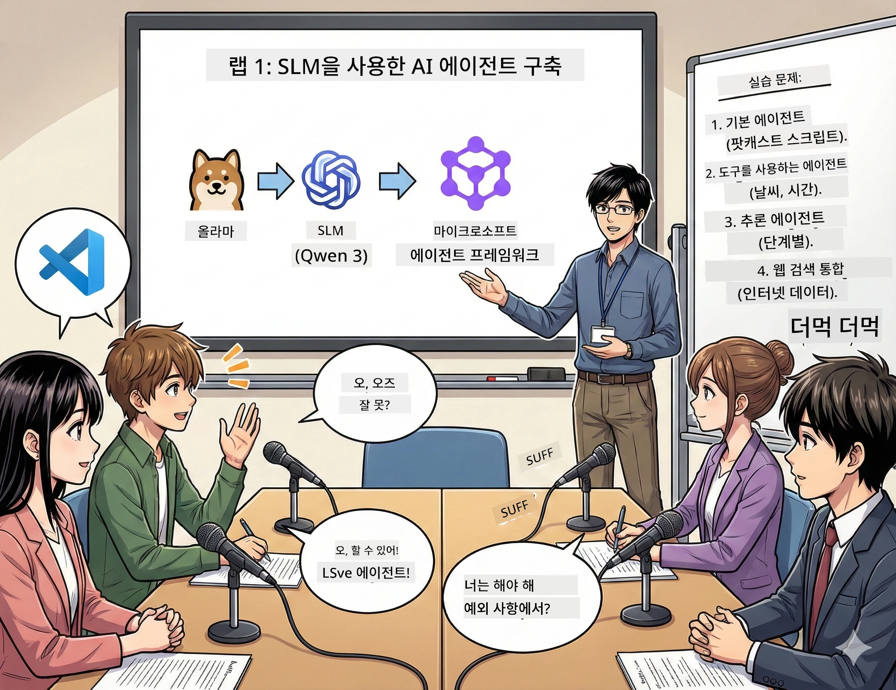

<!--
CO_OP_TRANSLATOR_METADATA:
{
  "original_hash": "7868fa418386aa7167bea3ff5ba8390b",
  "translation_date": "2026-01-05T12:49:14+00:00",
  "source_file": "WorkshopForAgentic/md/01.BuildAIAgentWithSLM.md",
  "language_code": "ko"
}
-->
# Act 1: Meet Your AI Research Assistant 🤖

## The Challenge

당신은 새로운 기술 팟캐스트 "Future Bytes"를 시작합니다. 1회 에피소드는 최신 AI 혁신에 관한 내용인데, 24시간 안에:
1. 주제 조사하기
2. 신뢰할 수 있는 출처 찾기
3. 흥미로운 대본 작성하기
4. 자연스럽게 들리도록 만들기

**반전**: 혼자 할 필요 없어요. 지금부터 이 모든 걸 도와줄 첫 AI 비서를 만들 거예요. 그 이름은 Alex — 잠 필요 없는 지칠 줄 모르는 연구 파트너입니다.

## Why Small Language Models? (Spoiler: They're Awesome)

Small Language Models(SLM)를 당신 컴퓨터에 사는 개인 AI라고 생각하세요. 클라우드도 없고, 월별 요금도 없으며, 수상한 데이터 공유도 없어요.

**SLM이 🔥인 이유:**
- **🏠 내 기기에서 실행**: 노트북, 데스크톱, 심지어 강력한 라즈베리파이까지
- **💸 비용 제로**: API 비용 같은 건 걱정할 필요 없어요
- **🔒 프라이버시 우선**: 데이터가 절대 기기를 떠나지 않아요
- **⚡ 초고속 반응**: 인터넷 지연 없이 즉각 답변
- **🪦 가벼움**: 10억~100억 개 매개변수, 대형 모델 1000억 개 매개변수 대비 훨씬 적음

**대표 SLM들**: Qwen 3, Phi-4, Gemma 3 (이번 워크숍에선 Qwen 사용)

## Your Toolkit

### Ollama: Your AI Model Manager

[Ollama](https://ollama.com/)는 AI 모델의 스팀과 같아요. 모델을 간단한 명령으로 다운로드하고 실행, 관리할 수 있습니다.

**멋진 점:**
- 한 명령어로 모델 다운로드 및 실행
- Mac, Windows, Linux 지원
- GPU가 있다면 자동으로 사용
- 메모리 초절약

### Microsoft Agent Framework: Where the Magic Happens

[Microsoft Agent Framework](https://github.com/microsoft/agent-framework)는 다음을 할 수 있는 AI 에이전트를 만드는 놀이터입니다:

- 💬 대화하고 대화 내용을 기억
- 🛠️ 맞춤 도구(웹 검색, 날씨 확인 등) 사용
- 🧠 복잡한 문제를 단계별로 생각
- 🤝 다른 에이전트와 협업
- 🔌 다양한 AI 공급자(OpenAI, Ollama, Azure) 연결

**구성 요소:**
- **Agents**: 특정 업무를 수행하는 AI 비서
- **Tools**: 특별한 기능 부여
- **Memory**: 대화 내용을 잊지 않도록 저장
- **Reasoning**: 단순 답변이 아닌 사고 과정 학습

## Your Training Montage: 4 Missions

### Mission 1: Create Your First Agent

📓 [Open Notebook](../code/01.BasicAgent/00.BasicAgent-agent.ipynb)

**목표**: 팟캐스트 대본 작가 AI인 Alex를 만드세요. Alex는 두 진행자가 기술 주제로 대화하는 대본을 만듭니다.

**배울 것:**
- AI 에이전트를 깨우는 방법 (월요일 아침 깨우기보다 쉬워요)
- 개성과 지시사항 부여
- 실제 팟캐스트 대본 생성
- 답변 이해

**성공 조건**: Alex가 AI에 관한 "Future Bytes" 파일럿 에피소드 대본 생성 🎯

### Mission 2: Give Alex Superpowers (Tools!)

📓 [Open Notebook](../code/01.BasicAgent/01.BasicAgent-tools.ipynb)

**목표**: Alex는 똑똑하지만 오늘 날씨나 시간 같은 건 몰라요. 도구를 부여해 해결하세요!

**배울 것:**
- 맞춤 파이썬 함수로 "도구" 만들기
- Alex가 언제 어떤 도구를 쓸지 결정하게 하기
- 자율적으로 문제 해결하는 모습 보기
- 여러 도구 결합해 복잡한 작업 처리하기

**성공 조건**: "도쿄 날씨 어때?" 질문에 Alex가 직접 해결! ☁️

### Mission 3: Teach Alex to Think

📓 [Open Notebook](../code/01.BasicAgent/02.BasicAgent-reasoning.ipynb)

**목표**: Alex가 문제 해결 과정을 보여주도록 만드세요. 답만 아니라 생각 과정을 보고 싶어요.

**배울 것:**
- "추론 모드" 활성화하기 (수학 풀이 보여주기 같은 원리)
- Alex의 사고 과정 단계별 확인
- 연쇄 사고 유도(chain-of-thought) 이해
- 혼란스러울 때 디버깅하기

**성공 조건**: 까다로운 수학 문제 물어보고 Alex가 생각하는 모습 보기 🧠

### Mission 4: Connect Alex to the Internet

📓 [Open Notebook](../code/01.BasicAgent/03.BasicAgent-websearch.ipynb)

**목표**: Alex 지식은 최신이 아닙니다. 실시간 정보 위해 웹 연결하세요!

**배울 것:**
- 맞춤형 웹 검색 도구 만들기
- 외부 API 통합
- 네트워크 오류를 우아하게 처리
- Alex 훈련 데이터 밖 정보 획득

**성공 조건**: 오늘의 기술 뉴스를 물어보고 최신 결과 받기! 📰

## Before You Start 🚀

**필요한 도구:**
- Python 3.10 이상 설치
- Ollama 실행 중(확인: `ollama --version`)
- Python 확장 설치된 VS Code
- 최소 8GB RAM (부드러운 사용 원하면 16GB)

## Mission Order

전체 스토리를 위해 노트북 순서대로 따라가세요:

1. [00.BasicAgent-agent.ipynb](../code/01.BasicAgent/00.BasicAgent-agent.ipynb) — Alex 만나기 (첫 에이전트)
2. [01.BasicAgent-tools.ipynb](../code/01.BasicAgent/01.BasicAgent-tools.ipynb) — 기능 강화하기!
3. [02.BasicAgent-reasoning.ipynb](../code/01.BasicAgent/02.BasicAgent-reasoning.ipynb) — Alex에게 사고 가르치기
4. [03.BasicAgent-websearch.ipynb](../code/01.BasicAgent/03.BasicAgent-websearch.ipynb) — 인터넷 연결 완료!

## What You'll Master

Act 1이 끝나면 다음을 할 수 있습니다:

- ✅ 직접 하드웨어에서 AI 모델 실행(클라우드 필요 없음!)
- ✅ 맞춤 개성 및 능력 가진 에이전트 생성
- ✅ 현실 문제 해결할 도구 제공
- ✅ 에이전트가 추론 과정 보여주도록 만들기
- ✅ 외부 데이터 소스 연결
- ✅ 문제 발생 시 디버그

## When Things Break (And How to Fix Them) 🔧

### "Alex가 안 열려요! 메모리 부족!"
**해결법**: 컴퓨터가 버거워하고 있어요. 다른 앱 닫거나 작은 모델로 바꿔 보세요. 8GB RAM이 최소입니다.

### "Alex 진짜 느려요"
**해결법**: Ollama 설정에서 GPU 가속 활성화. 또는 컨텍스트 창 크기 줄이기. 속도 전설 모드 켜짐! 🏎️

### "도구들이 작동하지 않아요!"
**해결법**: 함수 시그니처를 다시 확인하세요. Alex가 도구 기능을 이해하려면 정확한 타입 힌트가 필요해요. 명확한 지시사항 주는 것과 같아요.

## Helpful Links 🔗

- [Agent Framework Docs](https://github.com/microsoft/agent-framework) — 공식 가이드와 예제
- [Ollama Model Library](https://ollama.com/library) — 모든 모델 확인
- [Qwen Model](https://ollama.com/library/qwen3) — AI 두뇌 만나기
- [Code Examples](https://github.com/microsoft/agent-framework/tree/main/python/samples) — 아이디어 참고

## Next Up: Act 2 🎬

당신에겐 한 명의 에이전트가 있어요. 그런데 여러 명이 팀으로 협력하면 어떨까요? Act 2에서 팟캐스트 전체 제작 팀을 만들 거예요:
- **Researcher Agent**: 최고의 출처 찾기
- **Writer Agent**: 완벽한 대본 작성  
- **Editor (당신!)**: 승인하거나 수정 요청

AI 마법을 펼쳐 봅시다! → [Act 2: Assemble Your Production Team](02.AIAgentOrchestrationAndWorkflows.md)

---

**막히셨나요?** 워크숍 동안 질문하세요. 모두 함께 배우고 있습니다! 🙌

---

<!-- CO-OP TRANSLATOR DISCLAIMER START -->
**면책 조항**:  
이 문서는 AI 번역 서비스 [Co-op Translator](https://github.com/Azure/co-op-translator)를 사용하여 번역되었습니다. 정확성을 위해 최선을 다하고 있으나, 자동 번역에는 오류나 부정확성이 있을 수 있음을 유의하시기 바랍니다. 원문 문서가 권위 있는 출처임을 참고하시기 바라며, 중요한 정보의 경우 전문적인 인간 번역을 권장합니다. 본 번역의 사용으로 인한 오해 또는 잘못된 해석에 대해 당사는 책임을 지지 않습니다.
<!-- CO-OP TRANSLATOR DISCLAIMER END -->