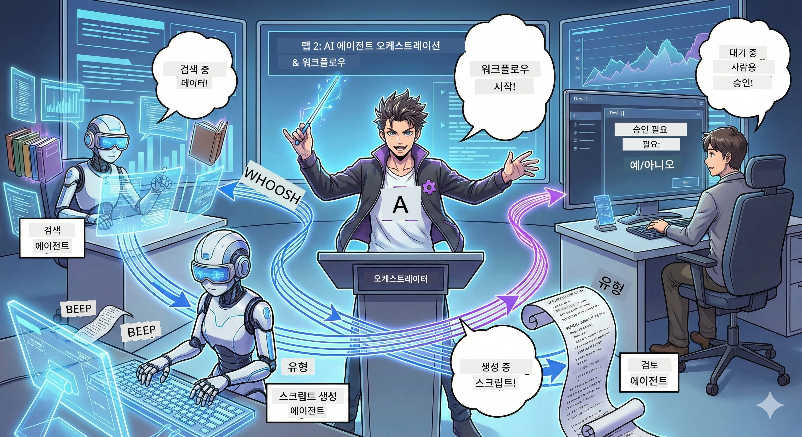

# Act 2: 팟캐스트 제작 팀 구성하기 🎬



## 스토리가 더욱 흥미진진해진다

Alex(Act 1의 AI 어시스턴트)는 훌륭하지만, 한 명의 에이전트가 전체 팟캐스트 스튜디오를 운영할 수는 없습니다. 여러분에겐 *팀*이 필요합니다:  
- 🔍 **리서치 에이전트**: 신선한 정보를 인터넷에서 탐색  
- ✍️ **스크립트 에이전트**: 리서치를 매력적인 대화로 전환  
- 👤 **여러분 (편집자)**: 스크립트를 승인하거나 재작성 요청  

여러분은 이제 **AI 에이전트 오케스트레이션**의 감독입니다 — 여러분만의 AI 팀을 지휘하는 감독 역할을 맡게 됩니다. 마블의 어벤져스처럼, 팟캐스트 제작을 위한 팀입니다.

## 에이전트 오케스트레이션이란? (간단한 버전)

레스토랑을 운영한다고 상상해 보세요. 모든 일을 혼자 다 하지 않죠?  
- 🍳 요리사가 요리하고  
- 👨‍🍳 수셰프가 준비하고  
- 👩‍🍳 서버가 음식 배달을 담당합니다  

에이전트 오케스트레이션도 똑같은 원리로 AI들이 역할별로 분담하고, 여러분은 이들을 조율해 더 큰 목표를 이룹니다. 어느 한 에이전트가 과부하되지 않고 작업이 더 빠르게 진행됩니다.

### 밴드 비유 🎸

여러분의 AI 에이전트들은 밴드와 같습니다:  
- **리드 싱어**: 고객 대면 업무를 주로 담당하는 메인 에이전트  
- **드러머**: 리듬을 유지하며 백그라운드 처리를 담당  
- **베이스 연주자**: 모두를 지원하며 데이터를 가져옵니다  
- **여러분 (밴드 매니저)**: 모든 것을 조율합니다!  

조율 없이? 그냥 소음입니다. 조율이 있으면? 아름다운 음악이 만들어집니다.

### 왜 이게 중요한가

한 AI 에이전트가 모든 것을 하려고 하면 = 번아웃. 전문화된 에이전트들이 협력하면 = 효율성 폭발! 🚀

**현실적인 이야기**: 여러분 혼자 리서치, 글쓰기, 편집을 하려고 했던 경험 기억나나요? 정말 힘들죠. 오케스트레이션을 사용하면 각 에이전트가 자신이 잘하는 일을 맡고 여러분은 최종 결정을 내리면 됩니다.

**실제 사례**: 고객 지원 봇들이 청구 문제와 기술 문제를 구분해 처리하고, 필요할 때 사람에게 연결해 주는 것. 이것이 바로 오케스트레이션입니다!

## 에이전트와 워크플로의 차이점?

이렇게 생각해 보세요:

### 🤖 AI 에이전트 = 재즈 뮤지션
- **듣고 상황에 맞춰 즉흥적으로 결정**함  
- **도구를 이용해 해결책을 즉석에서 만듬**  
- **LLM 두뇌로 사고**  
- **주어진 상황에 적응**

### 🎵 워크플로 = 클래식 음악을 연주하는 오케스트라  
- **악보(미리 정의된 단계)를 따라 수행**  
- **예측 가능한 실행 경로**  
- **여러 에이전트, 사람, 시스템을 조율**  
- **레시피처럼 구조화됨**

**마법같은 점**: 워크플로가 에이전트를 *오케스트레이션*합니다! 여러분은 에이전트가 언제 어떤 역할을 할지 워크플로를 구축합니다. 두 세계의 장점을 모두 누리는 셈이죠. 🎭

## AI 팀을 조율하는 3가지 방법

### 1. 🎯 중앙 집중식 (여러분이 보스)

한 명의 메인 에이전트가 모든 결정을 내립니다. 여러분이 팀을 관리하는 것처럼 누가 무엇을 언제 할지 결정합니다.

**장점**:  
- ✅ 명확한 리더십 (혼란 없음)  
- ✅ 일관된 결정  
- ✅ 디버깅 용이  

**사용처**:  
- 고객 서비스 라우팅 ("이거 청구 문제인가, 기술 지원인가?")  
- 콘텐츠 승인 워크플로 ("이 스크립트 통과했나?")  
- 팟캐스트 제작 (바로 우리가 만드는 것!)

### 2. 🤝 분산식 (에이전트가 자율적으로 조율)

에이전트들이 서로 직접 소통하며 그룹으로 문제를 해결합니다. 모두가 소통하는 그룹 채팅 같죠.

**장점**:  
- ✅ 손쉬운 확장 (더 많은 에이전트를 언제든 추가)  
- ✅ 단일 실패 지점 없음  
- ✅ 자연스러운 에이전트 협업  

**사용처**:  
- 리서치 팀 (각 에이전트가 다른 소스를 탐색)  
- 브레인스토밍 세션  
- 분산 문제 해결  

### 3. 🔀 하이브리드 (둘 다 장점 활용)

여러분이 전체 방향을 제시하지만 에이전트들은 세부 작업을 자율적으로 조율합니다. 팀을 믿는 CEO 같은 모습입니다.

**완벽한 상황**: 통제와 유연성이 모두 필요한 복잡한 프로젝트에 안성맞춤.

## Microsoft 에이전트 프레임워크: 여러분의 오케스트레이션 도구 🧰

이제 만들어 봅시다! 사용할 요소입니다:

### 구성 요소

#### 1. 🧱 실행자 (작업자)
- **무엇인가요?**: 개별 처리 단위 — 에이전트나 커스텀 로직일 수 있습니다  
- **무엇을 하나요?**: 입력을 받아 작업 후 출력 생성  
- **비유하자면?**: 조립라인의 작업대

#### 2. ➡️ 엣지 (연결 고리)
- **무엇인가요?**: 실행자 간 경로  
- **무엇을 하나요?**: 메시지 흐름 제어 ("A 다음에 B로 이동")  
- **비유하자면?**: 플로우차트의 화살표

#### 3. 🗺️ 워크플로 (마스터 플랜)
- **무엇인가요?**: 실행자 + 엣지의 완전한 그래프  
- **무엇을 하나요?**: 시작부터 끝까지 전체 프로세스 정의  
- **비유하자면?**: 생산 파이프라인 청사진

### 멋진 기능들

**🛡️ 타입 안정성**: 에이전트 간 메시지가 타입 검사됩니다. “앗, 데이터 종류가 틀렸어” 같은 실수 없음.

**🔀 유연한 라우팅**:  
- 조건문 ("승인되면 출판, 아니면 재작성")  
- 병렬 처리 (여러 에이전트 동시에 작업)  
- 동적 경로 (결과에 따라 워크플로 변경)

**🔌 외부 통합**:  
- API 연결  
- 사람 승인 체크포인트(출판 전 검토)  
- 요청/응답 흐름 구축

**💾 체크포인트**: 진행 상태 저장! 장애 시 다시 이어서 시작 가능.

**🤝 다중 에이전트 조율**:  
- 순차 실행 (A → B → C)  
- 병렬 실행 (A + B + C 동시에)  
- 에이전트 간 작업 인계  
- 협력적 처리

## 베스트 프랙티스 (전문가 팁) 🎯

### 1. 모듈화 유지  
각 에이전트는 한 가지를 정말 잘하도록 하세요. 모든 것을 하는 슈퍼 에이전트는 디버깅할 때 후회합니다.

### 2. 실패에 대비  
에이전트는 실수하고, 네트워크는 가끔 끊깁니다. 오류 처리와 백업 계획을 꼭 세우세요. 미래의 여러분이 감사를 표할 겁니다.

### 3. 모든 것을 모니터링  
에이전트가 무엇을 하는지 추적하세요. DevUI(곧 다룰 예정!)로 워크플로 실행 상태를 확인하세요.

### 4. 메시지 크기 최적화  
에이전트 간에 거대한 파일을 넘기지 마세요. 메시지는 빠른 처리를 위해 가볍고 간결하게 유지하세요.

### 5. 적절한 패턴 선택  
통제가 필요하면 중앙집중식, 확장이 필요하면 분산식, 고민되면 하이브리드!

## DevUI: 워크플로 디버거 🔍

### DevUI란?

DevUI는 에이전트와 워크플로를 테스트하는 놀이터 같은 웹 인터페이스입니다. 여기서:  
- 👀 워크플로 진행 상황 실시간 확인  
- 💬 에이전트와 직접 대화  
- 🔍 문제 발생 시 디버깅  
- 📊 추적 및 성능 지표 보기

> **중요**: DevUI는 개발용입니다! 운영 환경에선 사용하지 마세요. 로컬 테스트 환경으로 생각하세요.

### DevUI가 좋은 이유

- **🖥️ 인터랙티브 웹 UI**: 클릭, 타이핑, 테스트 — 커맨드라인 필요 없음  
- **📁 드래그 앤 드롭 지원**: 파일 업로드, 다양한 입력 테스트  
- **📂 자동 발견**: 폴더를 지정하면 모든 에이전트를 자동으로 발견  
- **📋 무설정 모드**: 코드 내에서 에이전트를 등록, 폴더 구조 불필요  
- **🔌 OpenAI 호환**: OpenAI SDK와 호환 가능  
- **👁️ 내장 추적 기능**: 에이전트가 무슨 일을 하는지 자세히 볼 수 있음

### 입력은 이렇게 작동

DevUI는 입력에 스마트합니다:  
- **에이전트 테스트 시**: 텍스트 박스와 파일 업로드 버튼을 제공합니다  
- **워크플로 테스트 시**: 워크플로가 요구하는 입력 필드를 자동 생성합니다

마법 같지만, 그냥 좋은 코드일 뿐입니다. ✨

## 미션: 팟캐스트 스튜디오 만들기 🎬

### 미션 1: DevUI로 단일 에이전트 생성

📂 [01.AgentDevUI](../../../../WorkshopForAgentic/code/02.Workflow/01.AgentDevUI)

**도전 과제**: 팀을 만들기 전에, DevUI로 웹 검색 전문 단일 에이전트를 시험해 봅니다.

**만드는 것**:  
인터넷에서 팟캐스트 주제를 검색하는 리서치 에이전트. `http://localhost:8090`에서 DevUI 웹 인터페이스로 테스트.

**배울 기술**:  
- 🚀 DevUI에서 에이전트 실행  
- 🔍 에이전트 응답 실시간 테스트  
- 🛠️ 커스텀 도구(웹 검색) 제작  
- 📊 문제 분석용 추적 기능 활성화  
- 🖥️ 인터랙티브 웹 UI 사용

**코드**:  
- `agent.py`: 웹 검색 능력을 갖춘 SearchAgent  
- OllamaChatClient를 이용해 Qwen과 연결  
- `web_search()` 툴 함수 구현  
- `serve()`로 실행, 자동으로 DevUI 오픈

**성공 조건**: "AI에서 지금 뜨는 트렌드는 뭐야?"라고 물어보면 에이전트가 웹에서 검색하는 것을 볼 수 있음 🎉

### 미션 2: 다중 에이전트 워크플로 구축

📂 [02.WorkflowDevUI](../../../../WorkshopForAgentic/code/02.Workflow/02.WorkflowDevUI)

**도전 과제**: 진짜 재미 시작! 완전한 팟캐스트 제작 워크플로를 구축하세요:  
1. 🔍 **검색 에이전트** → 주제 조사  
2. ✍️ **스크립트 에이전트** → 두 진행자 대화문 작성 (중국어!)  
3. 👤 **검토 실행자** → 여러분이 승인 또는 거절 요청  
4. 🔄 **루프 백** → 거절 시 피드백에 따라 재작성

**배울 기술**:  
- 🧱 전문화된 에이전트 제작  
- 🔗 WorkflowBuilder로 에이전트 연결  
- 🔀 승인 루프 구현 (사람 개입!)  
- 🚦 조건부 라우팅 (승인 vs 거절)  
- 🔧 업무 로직용 커스텀 실행자 제작

**워크플로**:  
```
SearchAgent → ScriptAgent → ReviewExecutor
                             ↑          ↓ (if rejected)
                             ←─────────
```
  
**코드**:  
- `search_agent/agent.py`: 리서치 전문 에이전트  
- `generate_script_agent/agent.py`: 중국어로 스크립트 작성  
- `workflow/workflow.py`: 오케스트레이션 구현  
- `main.py`: DevUI에서 실행 시작

**성공 조건**: 주제를 주고 스크립트를 검토 후 한 번 거절해 루프를 테스트, 이후 승인 성공! 🎉

### 미션 3: 콘솔 앱 만들기

📂 [03.Application](../../../../WorkshopForAgentic/code/02.Workflow/03.Application)

**도전 과제**: DevUI 워크플로를 멋진 터미널 앱으로 전환하기 — 컬러 출력, 로딩 스피너, 파일 저장 기능 포함. 바로 프로덕션급 앱!

**배울 기술**:  
- ⚡ 코드로 워크플로 실행 (DevUI 없이)  
- 📡 이벤트 중심 아키텍처 + 스트리밍  
- 🎨 컬러, 스피너, 진행바 등 아름다운 터미널 UI  
- 💾 최종 스크립트를 파일로 저장  
- 🔄 asyncio로 비동기 워크플로 처리

**앱 동작**:  
1. 팟캐스트 주제 입력 요청  
2. 진행 상황 실시간 표시 ("검색 에이전트 작업 중...")  
3. 생성된 스크립트 컬러로 출력  
4. 승인 여부 질문  
5. 승인 시 `podcast.txt`로 저장

**코드**:  
- `podcast_app.py`: 이벤트 핸들링 담당 메인 앱  
- `workflow.py`: 미션 2 워크플로 재사용  
- 이벤트 처리: `AgentRunUpdateEvent`, `RequestInfoEvent`, `WorkflowOutputEvent`  
- ANSI 컬러로 터미널 스타일링

**성공 조건**: 앱 실행 후 팟캐스트 스크립트를 만들어 파일로 저장! 실제 도구 완성 🚀

## 여러분이 마스터한 것들 🏆

Act 2를 마친 후, 여러분은:

- ✅ 여러 AI 에이전트를 능숙하게 오케스트레이션 가능  
- ✅ 순차적이면서도 조건부 로직이 포함된 워크플로 구축 가능  
- ✅ 사람 승인 체크포인트 추가 가능  
- ✅ DevUI로 워크플로 테스트 및 디버깅 가능  
- ✅ 프로덕션용 콘솔 애플리케이션 제작 가능  
- ✅ 복잡한 시스템에서 오류를 우아하게 처리 가능  
- ✅ 어떤 프로젝트든 적절한 오케스트레이션 패턴 선택 가능

## 문제가 생기면 🔧

### "내 워크플로가 너무 복잡해!"
**해결책**: 더 작은 서브 워크플로로 분할하세요. 각 워크플로는 한 가지 일을 잘 하도록 만드세요. 필요하면 연결해서 사용.

### "무슨 일이 벌어지는지 추적이 안 돼!"
**해결책**: 워크플로 체크포인트를 활용해 상태를 저장하세요. DevUI에서 추적 기능을 켜서 모든 단계를 확인하세요.

### "한 에이전트 오류로 전체가 멈춰!"
**해결책**: 오류 경계(error boundaries)를 추가하세요. 각 에이전트가 실패를 자체 처리하고 대체 동작을 갖도록 하세요.

### "너무 느려!"
**해결책**: 병렬로 실행 가능한 에이전트가 있나요? 순차 워크플로는 쉽지만 느립니다. 병렬화 기회를 찾으세요!

## 도움되는 자료 🔗

- [Workflow Docs](https://learn.microsoft.com/en-us/agent-framework/user-guide/workflows/overview) — 공식 Microsoft 가이드  
- [Orchestration Patterns](https://www.ibm.com/think/topics/ai-agent-orchestration) — IBM의 오케스트레이션 개념  
- [Agent Framework GitHub](https://github.com/microsoft/agent-framework) — 소스 코드 보기
- [Code Examples](https://github.com/microsoft/agent-framework/tree/main/python/samples) — 여기서 패턴을 가져가세요

---

**마지막 준비 되었나요?** 스크립트가 준비되었습니다. 이제 실제 오디오로 만들어 봅시다! → [Act 3: Bring Your Podcast to Life](03.Multi-SpeakerPodcastGenerationWithVibeVoice.md) 🎤

---

**막혔나요? 헷갈리나요? 신나나요?** 워크숍 채팅에서 공유하세요! 모두 함께 배우고 있습니다. 🚀

---

<!-- CO-OP TRANSLATOR DISCLAIMER START -->
**면책 조항**:  
이 문서는 AI 번역 서비스 [Co-op Translator](https://github.com/Azure/co-op-translator)를 사용하여 번역되었습니다. 정확성을 위해 최선을 다하고 있으나, 자동 번역에는 오류나 부정확한 부분이 있을 수 있음을 양지하시기 바랍니다. 원본 문서의 원어 자료가 권위 있는 출처로 간주되어야 합니다. 중요한 정보의 경우 전문 인력에 의한 번역을 권장합니다. 본 번역 사용으로 인해 발생하는 오해나 잘못된 해석에 대해서는 당사가 책임지지 않습니다.
<!-- CO-OP TRANSLATOR DISCLAIMER END -->