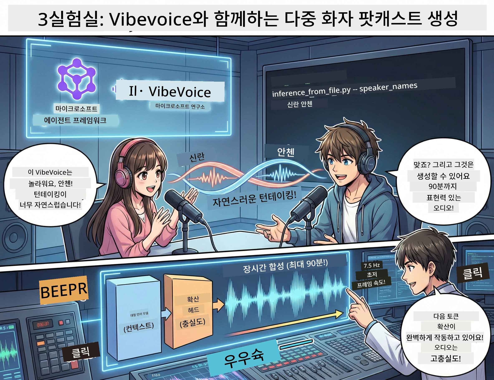

# 제3막: 당신의 팟캐스트에 생명을 불어넣기 🎤



## 대단원

주제를 조사했습니다. 스크립트를 작성했습니다. 이제 꽃을 더할 시간: 현실적인 목소리로 글을 진짜 팟캐스트 오디오로 변환하세요!

소개합니다 **VibeVoice** —— 마이크로소프트 연구소의 오픈소스 TTS(텍스트 음성 변환) 마법으로, 다음을 만듭니다:
- 🎭 자연스럽고 유창한 대화
- 👥 여러 화자 (최대 4명!)
- ⏱️ 장시간 형식 오디오 (최대 90분!)
- 🎵 표현력이 풍부한 전달 (로봇 음성이 아님!)

이는 합성 팟캐스트 뒤에 있는 기술입니다. 함께 만들어 봅시다!

## VibeVoice란? (멋진 것)

VibeVoice는 마이크로소프트 연구소가 세상에 선사하는 선물입니다. 팟캐스트 스타일 대화형 오디오 전용으로 설계되었습니다.

### 왜 멋진가 🔥

* **⏱️ 마라톤 세션**: 최대 90분의 연속 음성 생성 (한 편의 완전한 팟캐스트 에피소드!)
* **👥 다중 화자 마법**: 최대 4개의 각기 다른 목소리, 일관된 개성 보유
* **⚡ 초고속**: 7.5Hz의 매우 낮은 프레임 속도로 연산 절감
* **🧠 스마트 오디오**: LLM(맥락 이해)과 확산 모델(리얼한 오디오 생성)의 조합
* **🎭 자연스럽고 유연함**: 화자 교대, 멈춤, 대화 리듬 자동 처리

**요약**: VibeVoice는 단순히 스크립트를 읽는 것이 아니라 *사람처럼 말하는* 것처럼 연기합니다.

---

## 시작 전에 🚀

**필요한 것들**:

* 🐍 **Python 3.10 이상** (1막과 2막에서 이미 갖고 있습니다)
* 🚀 **uv** (빠른 Python 패키지 관리자 — 설치할 것입니다)
* 📝 **당신의 스크립트**: 2막에서 만든 `podcast.txt` 파일 (`../03.Application/` 위치)

**프로 팁**: 이 단계는 사전 훈련된 모델 다운로드에 좋은 인터넷 연결이 필요합니다. 커피 한 잔 하세요!☕

---

## 시작하기! 쉬운 방법 🎬

우리는 이것을 매우 간단하게 만들었습니다. 하나의 셸 스크립트가 모든 걸 처리합니다.

### 과정

1. **실행 가능하게 만들기**:
```bash
chmod +x run_vibe_voice.sh
```

2. **스크립트 실행하기**:
```bash
./run_vibe_voice.sh
```

3. **마법을 기다리기** (첫 실행은 몇 분 걸릴 수 있음)

### 내부에서 일어나는 일 🎭

이 스크립트는 기본적으로 자동화된 오디오 엔지니어입니다:

1. **📥 VibeVoice 다운로드**: GitHub에서 공식 저장소 클론
2. **📦 의존성 설치**: `uv pip`을 사용하여 초고속 패키지 설치
3. **🎬 오디오 생성**: 추론 스크립트 실행, 다음 옵션 사용:
   * `--model_path`: 사전 훈련된 VibeVoice-7B 모델 경로
   * `--txt_path`: 당신의 `podcast.txt` 스크립트 경로
   * `--speaker_names`: 음성 배정 (기본은 Xinran과 Anchen)

**결과**: 당신의 스크립트가 진짜 팟캐스트 에피소드로 바뀝니다!🎉

---

## 당신의 과제 🎯

재미를 더해 봅시다:

### 과제 1: 콘텐츠 만들기
두 사람이 나누는 대화 형식으로 `../03.Application/podcast.txt`를 편집하세요. 주제는 기술, 취미 뭐든 좋습니다! 대화 형식으로 만드세요.

**형식 예시**:
```
说话人 1：嘿！你听说新的 AI 模型了吗？
说话人 2：不会吧！告诉我更多！
说话人 1：它叫...
```

### 과제 2: 오디오 생성
스크립트를 실행하고 마법이 일어나는 걸 지켜보세요. 첫 실행은 모델 다운로드 때문에 시간이 더 걸릴 수 있습니다.

### 과제 3: 청취 및 분석
- 자연스러운가요?
- 화자마다 목소리가 다른가요?
- 말이 자연스럽게 이어지나요?
- 로봇 음성 같은 부분이 있나요?

### 과제 4: 실험 (용감한 분들께)
`run_vibe_voice.sh`를 편집하여 `--speaker_names`를 변경해 다양한 목소리 조합을 시도해 보세요. VibeVoice에는 여러 사전 훈련된 목소리가 있습니다!

**보너스 챌린지**: 세 명 화자 대화 시도!🎆

---

## 더 알아보기 📚

* **🏠 프로젝트 홈페이지**: [VibeVoice 공식 웹사이트](https://microsoft.github.io/VibeVoice/)
* **🤗 사전 훈련 모델**: [Hugging Face - VibeVoice-7B](https://huggingface.co/vibevoice/VibeVoice-7B)
* **📖 연구 논문**: 기술 깊이 이해하기(관심 있으면)

> **⚠️ 책임감 있는 AI 알림**: VibeVoice는 강력합니다. 윤리적으로 사용하세요! 딥페이크나 오해의 소지가 있는 콘텐츠는 만들지 마세요. 사람들에게 도움이 되는 멋진 걸 만드세요.🙏

---

## 🏆 축하합니다! 해냈습니다!

당신은 방금 전체 과정을 완료했습니다:
1. ✅ **1막**: 맞춤형 도구로 AI 에이전트 빌드
2. ✅ **2막**: 다중 에이전트 워크플로우 편성
3. ✅ **3막**: 진짜 팟캐스트 오디오 생성

**당신이 지금 가진 것**:
- 유용한 AI 연구 도우미
- 완벽한 팟캐스트 제작 워크플로우
- 공유할 수 있는 진짜 오디오 파일

### 다음 단계? 🚀

**팟캐스트 출시!**
- 팟캐스트 플랫폼에 업로드
- 소셜 미디어에서 공유
- 반복하며 개선

**계속 빌드하세요!**
- 다양한 주제 시도
- 더 많은 화자 실험
- 배경 음악 추가
- 웹 인터페이스 구축
- 전체 과정 자동화

**당신의 작품을 자랑하세요!**
우리를 태그하세요! 당신이 만든 것을 세상에 보여주세요. AI 팟캐스트 혁명은 당신으로부터 시작됩니다.🎙️

---

**질문? 아이디어? 성공 이야기?** 워크숍 채팅에서 공유하세요!

**콘텐츠 창작의 미래에 오신 것을 환영합니다.** 🌟

---

<!-- CO-OP TRANSLATOR DISCLAIMER START -->
**면책 조항**:  
이 문서는 AI 번역 서비스 [Co-op Translator](https://github.com/Azure/co-op-translator)를 사용하여 번역되었습니다. 정확성을 위해 최선을 다하고 있으나, 자동 번역에는 오류나 부정확성이 포함될 수 있음을 유의하시기 바랍니다. 원본 문서의 원어 버전을 권위 있는 출처로 간주해야 합니다. 중요한 정보의 경우 전문 인간 번역을 권장합니다. 본 번역의 사용으로 인한 어떠한 오해나 잘못된 해석에 대해서도 당사는 책임을 지지 않습니다.
<!-- CO-OP TRANSLATOR DISCLAIMER END -->