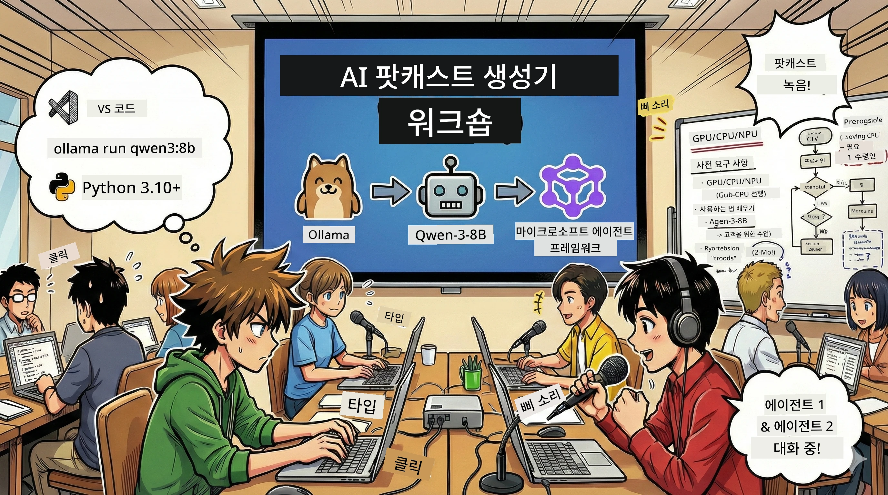

<!--
CO_OP_TRANSLATOR_METADATA:
{
  "original_hash": "aa775a734bda4590ecbe3a94a3b62197",
  "translation_date": "2026-01-05T17:31:11+00:00",
  "source_file": "WorkshopForAgentic/translation/zh-cn/README.md",
  "language_code": "ko"
}
-->
# 🎙️ AI 팟캐스트 스튜디오 워크숍



## 당신의 임무

**AI 팟캐스트 스튜디오**에 오신 것을 환영합니다! 당신은 곧 자신의 기술 팟캐스트 「미래 바이트」를 시작할 것입니다 — 단, 여기 변화가 있습니다: 당신은 AI 기반 제작 팀을 구축하여 이를 도울 것입니다. 끝없는 연구, 스크립트 작성, 오디오 편집이 필요하지 않습니다. 대신 프로그래밍을 통해 AI 초능력을 가진 팟캐스트 제작자가 될 것입니다.

## 스토리 배경

상상해보세요: 당신과 친구들이 가장 멋진 기술 트렌드에 관한 팟캐스트를 시작하고 싶지만, 모두가 공부, 일 또는 생활로 바쁩니다. 만약 AI 에이전트 팀이 무거운 작업을 대신해준다면 어떨까요? 하나는 주제를 조사하고, 다른 하나는 매력적인 스크립트를 작성하며, 세 번째는 텍스트를 자연스럽고 흐름 좋은 대화로 변환합니다. SF 같나요? 현실로 만들어 봅시다.

## 당신이 배우게 될 것

워크숍이 끝날 때, 당신은 다음을 알게 될 것입니다:
- 🤖 자체 로컬 AI 모델 배포하기 (API 비용 없음, 클라우드 의존 없음!)
- 🔧 실제 협업하는 전문 AI 에이전트 구축하기
- 🎬 아이디어에서 오디오까지 완전한 팟캐스트 제작 과정 만들기

## 당신의 여정: 삼막극

좋은 이야기처럼, 우리는 세 막을 갖고 있습니다. 각 막은 당신의 AI 팟캐스트 스튜디오를 단계적으로 구축합니다:

| 장 | 당신의 임무 | 무슨 일이 일어나는지 | 해금되는 기술 |
|---------|-----------|--------------|----------------|
| **첫 번째 막** | [당신의 AI 비서 알아보기](01.BuildAIAgentWithSLM.md) | 채팅하고, 웹 검색하고, 문제를 해결할 수 있는 AI 에이전트를 만드는 방법을 발견합니다. 이들을 잠들지 않는 연구 인턴으로 생각하세요. | 🎯 첫 번째 에이전트 구축<br>🛠️ 초능력 부여(도구!)<br>🧠 사고법 가르치기<br>🌐 인터넷 연결 |
| **두 번째 막** | [제작 팀 구성하기](02.AIAgentOrchestrationAndWorkflows.md) | 이제 재미있어집니다! 여러 AI 에이전트가 진짜 팟캐스트 팀처럼 협력하도록 조율합니다. 한 명은 조사하고, 다른 한 명은 작성하며, 당신은 승인합니다 — 팀워크로 꿈을 이룹니다. | 🎭 여러 에이전트 조율<br>🔄 승인 워크플로우 구축<br>🖥️ DevUI 인터페이스 사용해 테스트<br>✋ 인간 통제 유지 |
| **세 번째 막** | [팟캐스트를 생생하게 만들기](03.Multi-SpeakerPodcastGenerationWithVibeVoice.md) | 피날레! 텍스트 스크립트를 사실적인 음성 및 자연스러운 대화가 있는 실제 팟캐스트 오디오로 변환합니다. 당신의 「미래 바이트」 팟캐스트가 발행 준비 완료! | 🎤 텍스트 음성 변환 마법<br>👥 다중 화자 음성<br>⏱️ 장시간 포맷 오디오<br>🚀 완전 자동화 |

각 막마다 새로운 능력이 해금됩니다. 용감하다면 건너뛰어도 되지만, 순서대로 배우길 권합니다!

## 환경 요구사항

이 워크숍은 다양한 하드웨어 환경을 지원합니다:
- **CPU**: 테스트 및 소규모 사용에 적합
- **GPU**: 프로덕션 환경에 추천, 추론 속도 크게 향상
- **NPU**: 차세대 신경망 처리 장치 가속 지원

## 필요한 것

### 소프트웨어 목록 ✅
- **Python 3.10+** (당신의 프로그래밍 언어)
- **Ollama** (머신 위에서 AI 모델 실행기)
- **VS Code** (코드 편집기)
- **Python 확장** (VS Code를 똑똑하게)
- **Git** (코드 받기 위해)

### 하드웨어 점검 💻
- **저 실행 가능한가요?**: 8GB 메모리, 10GB 사용 가능 공간 (사용 가능하지만 좀 느릴 수 있음)
- **이상적인 구성**: 16GB 이상 메모리, 좋은 GPU (원활한 실행!)
- **NPU가 있나요?**: 좋습니다! 차세대 성능이 해금됩니다 🚀

## 스튜디오 구축 🎬

### 1단계: Python 업그레이드

Python 3.10 이상이 설치되어 있는지 확인하세요:

```bash
python --version
# Python 3.10.x 이상 버전을 표시해야 합니다
```

Python이 없나요? [python.org](https://python.org)에서 무료로 받으세요!

### 2단계: Ollama 받기 (당신의 AI 모델 실행기)

운영 체제에 맞는 Ollama를 [ollama.ai](https://ollama.ai)에서 다운로드하세요. 로컬에서 AI 모델을 실행하는 엔진이라고 생각하세요.

준비 상태 확인:

```bash
ollama --version
```

### 3단계: 당신의 AI 두뇌 다운로드 🧠

Qwen-3-8B 모델을 받으실 차례입니다 (첫 AI 비서를 고용하는 것과 같습니다):

```bash
ollama pull qwen3:8b
```

*몇 분 걸릴 수 있습니다. 완벽한 커피 타임!☕*

### 4단계: VS Code 설치

아직 없다면 [Visual Studio Code](https://code.visualstudio.com/)를 받으세요. 최고의 코드 편집기입니다 (반박 불가 😄).

### 5단계: Python 확장 설치

VS Code에서:
1. `Ctrl+Shift+X` (Mac은 `Cmd+Shift+X`) 누르기
2. "Python" 검색
3. Microsoft 공식 Python 확장 설치

### 6단계: 모두 완료!🎉

진짜 준비됐습니다. AI 마법을 만들어봅시다!

### 7단계: Microsoft Agent Framework 및 관련 패키지 설치 📦

워크숍에 필요한 모든 의존성 설치:

```bash
pip install -r ./Installations/requirements.txt -U
```

*Microsoft Agent Framework와 필요한 모든 패키지가 설치됩니다. 첫 설치에는 몇 분 걸릴 수 있으니 커피 한 잔 하세요!☕*

## 워크숍 안내

자세한 프로젝트 구조, 설정 단계와 실행 방법은 워크숍 중에 단계별로 설명됩니다.

## 문제 해결 (문제가 생겼을 때) 🔧

### "아, 모델 다운로드가 너무 느려요!"
**해결법**: VPN 사용하거나 Ollama 미러 서버 설정. 네트워크가 문제일 수도 있습니다.

### "컴퓨터가 버티질 못해요! 메모리가 부족해요!"
**해결법**: 더 작은 모델을 쓰거나 `num_ctx` 설정을 조절해 메모리 사용량 줄이기. AI에게 다이어트를 시키는 셈입니다.

### "GPU를 사용해서 더 빠르게 할 수 있나요?"
**해결법**: Ollama는 GPU를 자동으로 감지합니다! GPU 드라이버가 최신인지 확인만 하세요. 무료 속도 향상!🏎️

## 추가 자료 (호기심 많은 당신을 위해) 📚

- [Ollama 문서](https://github.com/ollama/ollama) — 로컬 AI 모델 심층 탐구
- [Microsoft Agent Framework](https://microsoft.github.io/autogen/) — 에이전트 팀 구축에 관한 더 많은 정보
- [Qwen 모델 정보](https://qwenlm.github.io/) — AI 비서 두뇌 알아보기

## 라이선스

MIT 라이선스 — 멋진 것을 만들고 공유해 세상을 더 아름답게! 🌍

## 기여하고 싶나요?

버그 발견? 아이디어가 있나요? 이슈 또는 PR을 제출하세요! 우리는 커뮤니티를 사랑합니다.✨

---

<!-- CO-OP TRANSLATOR DISCLAIMER START -->
**면책 조항**:  
이 문서는 AI 번역 서비스 [Co-op Translator](https://github.com/Azure/co-op-translator)를 사용하여 번역되었습니다. 정확성을 위해 노력하고 있으나, 자동 번역에는 오류나 부정확한 내용이 포함될 수 있음을 유의해 주시기 바랍니다. 원문 문서가 권위 있는 출처로 간주되어야 합니다. 중요한 정보의 경우 전문적인 인간 번역을 권장합니다. 본 번역 사용으로 인해 발생하는 오해나 잘못된 해석에 대해 당사는 책임을 지지 않습니다.
<!-- CO-OP TRANSLATOR DISCLAIMER END -->