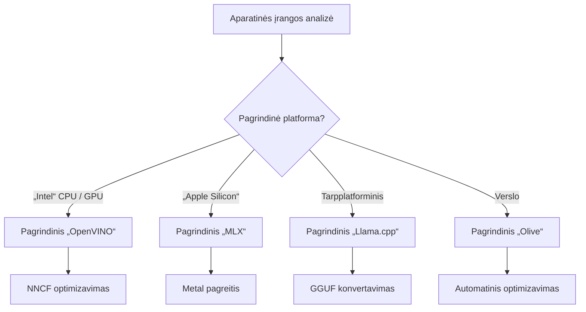
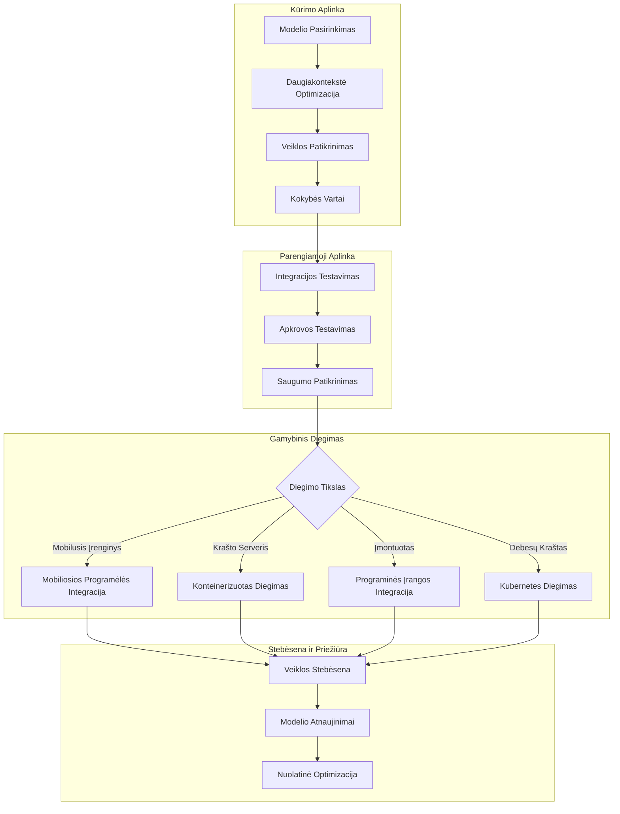

# 6 skyrius: Edge AI kūrimo proceso santrauka

## Turinys
1. [Įvadas](#įvadas)
2. [Mokymosi tikslai](#mokymosi-tikslai)
3. [Vieningos darbo eigos apžvalga](#vieningos-darbo-eigos-apžvalga)
4. [Sistemų pasirinkimo matrica](#karkaso-pasirinkimo-matrica)
5. [Geriausių praktikų santrauka](#geriausių-praktikų-santrauka)
6. [Diegimo strategijos gidas](#diegimo-strategijos-vadovas)
7. [Veiklos optimizavimo darbo eiga](#veiklos-optimizavimo-darbo-eiga)
8. [Parengimo gamybai kontrolinis sąrašas](#produkcinio-paruošimo-kontrolinis-sąrašas)
9. [Klaidų taisymas ir stebėsena](#gedimų-diagnostika-ir-stebėjimas)
10. [Ateities suderinamumas jūsų Edge AI proceso](#ateities-pasiruošimas-jūsų-edge-ai-srautui)

## Įvadas

Edge AI kūrimas reikalauja išmanymo apie kelis optimizavimo karkasus, diegimo strategijas ir techninės įrangos svarstymus. Ši išsami santrauka apjungia žinias iš Llama.cpp, Microsoft Olive, OpenVINO ir Apple MLX, kad sukurtų vieningą darbo eigą, maksimaliai efektyvią, palaikančią kokybę ir užtikrinančią sėkmingą gamybinį diegimą.

Per šį kursą tyrinėjome atskirus optimizavimo karkasus, kiekvienas su unikaliomis stiprybėmis ir specializuotomis panaudojimo sritimis. Tačiau realūs Edge AI projektai dažnai reikalauja derinti kelių karkasų metodus arba priimti strateginius sprendimus, kuris požiūris geriausiai atitiks specifinius apribojimus ir reikalavimus.

Šiame skyriuje apibendriname kolektyvias visas karkasų žinias į veiksmingas darbo eigas, sprendimų medžius ir geriausias praktikas, leidžiančias efektyviai ir veiksmingai kurti gamybai paruoštus Edge AI sprendimus. Nesvarbu, ar optimizuojate mobiliesiems įrenginiams, įterptosioms sistemoms ar edge serveriams, šis gidas suteikia strateginį karkasą pagrįstiems sprendimams jūsų kūrimo cikle.

## Mokymosi tikslai

Baigę šį skyrių, galėsite:

### Strateginis sprendimų priėmimas
- **Įvertinti ir pasirinkti** optimalų optimizavimo karkasą pagal projekto reikalavimus, techninės įrangos apribojimus ir diegimo scenarijus
- **Sukurti išsamias darbo eigas**, integruojančias kelis optimizavimo metodus maksimaliam efektyvumui
- **Įvertinti kompromisus** tarp modelio tikslumo, spartos, atminties sunaudojimo ir diegimo sudėtingumo skirtinguose karkasuose

### Darbo eigos integracija
- **Įgyvendinti vieningas kūrimo eigas**, išnaudojančias kelių optimizavimo karkasų privalumus
- **Kurti pakartojamas darbo eigas** nuosekliam modelių optimizavimui ir diegimui skirtingose aplinkose
- **Įdiegti kokybės patikrinimus** ir validacijos procesus, užtikrinančius, kad optimizuoti modeliai atitiktų gamybos reikalavimus

### Veiklos optimizavimas
- **Taikyti sistemingas optimizavimo strategijas** naudojant kvantavimą, pjovimą ir įrangai pritaikytas pagreitėjimo technikas
- **Stebėti ir lyginti** modelių veikimą skirtinguose optimizavimo lygiuose ir diegimo tiksluose
- **Optimizuoti pagal konkrečias techninės įrangos platformas**, įskaitant CPU, GPU, NPU ir specializuotus edge pagreitintuvus

### Gamybinis diegimas
- **Sukurti mastelio skalės diegimo architektūras**, palaikančias kelis modelio formatus ir inferencijos variklius
- **Įdiegti stebėjimą ir stebėseną** Edge AI programoms gamybos aplinkose
- **Nustatyti priežiūros darbo eigas** modelių atnaujinimams, veiklos stebėsenai ir sistemos optimizavimui

### Kryžminė platformų meistriškumas
- **Diegti optimizuotus modelius** įvairiose techninės įrangos platformose, išlaikant nuoseklų veikimą
- **Tvarkyti platformų specifines optimizacijas** Windows, macOS, Linux, mobilioms ir įterptosioms sistemoms
- **Kurti abstrakcijos sluoksnius**, leidžiančius sklandų diegimą skirtingose edge aplinkose

## Vieningos darbo eigos apžvalga

### 1 etapas: Reikalavimų analizė ir karkaso pasirinkimas

Sėkmingo Edge AI diegimo pagrindas prasideda nuo kruopščios reikalavimų analizės, formuojančios karkaso pasirinkimą ir optimizavimo strategiją.

#### 1.1 techninės įrangos įvertinimas


**Pagrindiniai svarstymai:**
- **CPU architektūra**: x86, ARM, Apple Silicon galimybės
- **Pagreitintuvo prieinamumas**: GPU, NPU, VPU, specializuoti AI lustai
- **Atminties apribojimai**: RAM ribos, saugyklos talpa
- **Energijos biudžetas**: baterijos veikimo laikas, terminiai apribojimai
- **Ryšys**: neprisijungimo reikalavimai, pralaidumo ribojimai

#### 1.2 Programos reikalavimų matrica

| Reikalavimas | Llama.cpp | Microsoft Olive | OpenVINO | Apple MLX |
|-------------|-----------|-----------------|----------|-----------|
| Kryžminė platforma | ✅ Puiku | ⚡ Gerai | ⚡ Gerai | ❌ Tik Apple |
| Įmonės integracija | ⚡ Pagrindinė | ✅ Puiku | ✅ Puiku | ⚡ Ribota |
| Mobilusis diegimas | ✅ Puiku | ⚡ Gerai | ⚡ Gerai | ✅ iOS puiku |
| Realus laiko inferencija | ✅ Puiku | ✅ Puiku | ✅ Puiku | ✅ Puiku |
| Modelio įvairovė | ✅ LLM Fokusas | ✅ Visi modeliai | ✅ Visi modeliai | ✅ LLM Fokusas |
| Naudojimo paprastumas | ✅ Paprasta | ✅ Automatizuota | ⚡ Vidutiniška | ✅ Paprasta |

### 2 etapas: Modelio paruošimas ir optimizavimas

#### 2.1 Universalios modelio vertinimo darbo eiga

```python
# Universali modelio vertinimo sistema
class EdgeAIModelAssessment:
    def __init__(self, model_path, target_hardware):
        self.model_path = model_path
        self.target_hardware = target_hardware
        self.optimization_frameworks = []
        
    def assess_model_characteristics(self):
        """Analyze model size, architecture, and complexity"""
        return {
            'model_size': self.get_model_size(),
            'parameter_count': self.get_parameter_count(),
            'architecture_type': self.detect_architecture(),
            'quantization_compatibility': self.check_quantization_support()
        }
    
    def recommend_optimization_strategy(self):
        """Recommend optimal frameworks and techniques"""
        characteristics = self.assess_model_characteristics()
        
        if self.target_hardware.startswith('apple'):
            return self.mlx_optimization_strategy(characteristics)
        elif self.target_hardware.startswith('intel'):
            return self.openvino_optimization_strategy(characteristics)
        elif characteristics['model_size'] > 7_000_000_000:  # 7 mlrd. ir daugiau parametrų
            return self.enterprise_optimization_strategy(characteristics)
        else:
            return self.lightweight_optimization_strategy(characteristics)
```

#### 2.2 Daugiakarkasinė optimizavimo darbo eiga

**Sekli optimizavimo tvarka:**
1. **Pradinis konvertavimas**: konvertuoti į tarpinį formatą (kai įmanoma, ONNX)
2. **Specifinis optimizavimas pagal karkasą**: taikyti specializuotas technikas
3. **Kryžminė validacija**: patikrinti veikimą tikslinėse platformose
4. **Galutinis pakavimas**: paruošti diegimui

```bash
# Daugiaplatformis optimizavimo scenarijus
#!/bin/bash

MODEL_NAME="phi-3-mini"
BASE_MODEL="microsoft/Phi-3-mini-4k-instruct"

# 1 etapas: ONNX konvertavimas (universalus)
python convert_to_onnx.py --model $BASE_MODEL --output models/onnx/

# 2 etapas: platformai specifinė optimizacija
if [[ "$TARGET_PLATFORM" == "intel" ]]; then
    # OpenVINO optimizavimas
    python optimize_openvino.py --input models/onnx/ --output models/openvino/
elif [[ "$TARGET_PLATFORM" == "apple" ]]; then
    # MLX optimizavimas
    python optimize_mlx.py --input $BASE_MODEL --output models/mlx/
elif [[ "$TARGET_PLATFORM" == "cross" ]]; then
    # Llama.cpp optimizavimas
    python convert_to_gguf.py --input models/onnx/ --output models/gguf/
fi

# 3 etapas: patikrinimas
python validate_optimization.py --original $BASE_MODEL --optimized models/$TARGET_PLATFORM/
```

### 3 etapas: Veiklos patikrinimas ir lyginamoji analizė

#### 3.1 Išsamus lyginamosios analizės karkasas

```python
class EdgeAIBenchmark:
    def __init__(self, optimized_models):
        self.models = optimized_models
        self.metrics = {
            'inference_time': [],
            'memory_usage': [],
            'accuracy_score': [],
            'throughput': [],
            'energy_consumption': []
        }
    
    def run_comprehensive_benchmark(self):
        """Execute standardized benchmarks across all optimized models"""
        test_inputs = self.generate_test_inputs()
        
        for model_framework, model_path in self.models.items():
            print(f"Benchmarking {model_framework}...")
            
            # Vėlinimo testavimas
            latency = self.measure_inference_latency(model_path, test_inputs)
            
            # Atminties profilavimas
            memory = self.profile_memory_usage(model_path)
            
            # Tikslumo patikrinimas
            accuracy = self.validate_model_accuracy(model_path, test_inputs)
            
            # Pralaidumo analizė
            throughput = self.measure_throughput(model_path)
            
            self.record_metrics(model_framework, latency, memory, accuracy, throughput)
    
    def generate_optimization_report(self):
        """Create comprehensive comparison report"""
        report = {
            'recommendations': self.analyze_performance_trade_offs(),
            'deployment_guidance': self.generate_deployment_recommendations(),
            'monitoring_requirements': self.define_monitoring_metrics()
        }
        return report
```

## Karkaso pasirinkimo matrica

### Sprendimų medis karkaso pasirenkimui

```mermaid
graph TD
    A[Start: Modelio optimizavimas] --> B{Tikslinė platforma?}
    
    B -->|„Apple“ ekosistema| C[Apple MLX]
    B -->|„Intel“ aparatinė įranga| D[OpenVINO]
    B -->|Kliūčių nepaisanti (Cross-Platform)| E{Modelio tipas?}
    B -->|Įmonė| F[Microsoft Olive]
    
    E -->|LLM / Tekstas| G[Llama.cpp]
    E -->|Multi-modalinis| H[OpenVINO / Olive]
    
    C --> I[Metal optimizavimas]
    D --> J[NNCF suspaudimas]
    F --> K[Automatinė optimizacija]
    G --> L[GGUF kvantizacija]
    H --> M[Framework palyginimas]
    
    I --> N[Diegti iOS/macOS]
    J --> O[Diegti „Intel“]
    K --> P[Įmonės diegimas]
    L --> Q[Universali diegimas]
    M --> R[Platformai būdingas diegimas]
```

### Išsamūs pasirinkimo kriterijai

#### 1. Pagrindinė panaudojimo sritis

**Dideli kalbos modeliai (LLM):**
- **Llama.cpp**: geriausias CPU orientuotam, kryžminiam diegimui
- **Apple MLX**: optimalus Apple Silicon su vieninga atmintimi
- **OpenVINO**: puikus Intel įrangai su NNCF optimizavimu
- **Microsoft Olive**: idealus įmonių procesams su automatizacija

**Daugiamodaliniai modeliai:**
- **OpenVINO**: išsami palaikymas vaizdui, garsui ir tekstui
- **Microsoft Olive**: įmonių lygmens optimizacija sudėtingoms darbo eigoms
- **Llama.cpp**: ribota tik teksto modeliams
- **Apple MLX**: auganti daugiamodalių programų palaikymas

#### 2. Techninės įrangos platformų matrica

| Platforma | Pagrindinis karkasas | Antrinis pasirinkimas | Specializuotos funkcijos |
|----------|------------------|------------------|---------------------|
| Intel CPU/GPU | OpenVINO | Microsoft Olive | NNCF suspaudimas, Intel optimizacija |
| NVIDIA GPU | Microsoft Olive | OpenVINO | CUDA pagreitinimas, įmonių funkcijos |
| Apple Silicon | Apple MLX | Llama.cpp | Metal šešėliai, vieninga atmintis |
| ARM mobilieji | Llama.cpp | OpenVINO | Kryžminė platforma, minimalios priklausomybės |
| Edge TPU | OpenVINO | Microsoft Olive | Specializuota pagreitinimo palaikymas |
| Įterptieji ARM | Llama.cpp | OpenVINO | Minimalus apkrovimas, efektyvus inferencijos vykdymas |

#### 3. Kūrio darbo eigos nuostatos

**Greitas prototipavimas:**
1. **Llama.cpp**: greičiausias paruošimas, iš karto rezultatai

2. **Apple MLX**: Paprastas Python API, greita iteracija
3. **Microsoft Olive**: Automatinė optimizacija, minimali konfigūracija
4. **OpenVINO**: Sudėtingesnis nustatymas, išsamios funkcijos

**Verslo produkcija:**
1. **Microsoft Olive**: Verslo funkcijos, Azure integracija
2. **OpenVINO**: Intel ekosistema, išsamūs įrankiai
3. **Apple MLX**: Apple specifinės verslo programos
4. **Llama.cpp**: Paprastas diegimas, ribotos verslo funkcijos

## Geriausių praktikų santrauka

### Universali optimizavimo principai

#### 1. Progresyvi optimizavimo strategija

```python
class ProgressiveOptimization:
    def __init__(self, base_model):
        self.base_model = base_model
        self.optimization_stages = [
            'baseline_measurement',
            'format_conversion',
            'quantization_optimization',
            'hardware_acceleration',
            'production_validation'
        ]
    
    def execute_progressive_optimization(self):
        """Apply optimization techniques incrementally"""
        
        # 1 etapas: Pradinio lygio matavimas
        baseline_metrics = self.measure_baseline_performance()
        
        # 2 etapas: Formato konvertavimas
        converted_model = self.convert_to_optimal_format()
        conversion_metrics = self.measure_performance(converted_model)
        
        # 3 etapas: Kvanatavimas
        quantized_model = self.apply_quantization(converted_model)
        quantization_metrics = self.measure_performance(quantized_model)
        
        # 4 etapas: Aparatinis pagreitinimas
        accelerated_model = self.enable_hardware_acceleration(quantized_model)
        acceleration_metrics = self.measure_performance(accelerated_model)
        
        # 5 etapas: Patvirtinimas
        production_ready = self.validate_for_production(accelerated_model)
        
        return self.compile_optimization_report(
            baseline_metrics, conversion_metrics, 
            quantization_metrics, acceleration_metrics
        )
```

#### 2. Kokybės vartų įgyvendinimas

**Tikslumo išsaugojimo vartai:**
- Išlaikyti >95% originalaus modelio tikslumo
- Patikrinti su reprezentatyviais testų duomenų rinkiniais
- Įdiegti A/B testavimą produkcijos patvirtinimui

**Veiklos gerinimo vartai:**
- Pasiekti minimalų 2x greičio pagerėjimą
- Sumažinti atminties naudojimą bent 50%
- Patikrinti inferencijos laiko pastovumą

**Produkcinio paruošimo vartai:**
- Praeiti apkrovos streso testus
- Demonstruoti stabilų veikimą per laiką
- Patikrinti saugumo ir privatumo reikalavimus

### Specifinių karkasų geriausių praktikų integracija

#### 1. Kvantizacijos strategijos santrauka

```python
# Vieningas kiekybinimo metodas
class UnifiedQuantizationStrategy:
    def __init__(self, model, target_platform):
        self.model = model
        self.platform = target_platform
        
    def select_optimal_quantization(self):
        """Choose best quantization based on platform and requirements"""
        
        if self.platform == 'apple_silicon':
            return self.mlx_quantization_strategy()
        elif self.platform == 'intel_hardware':
            return self.openvino_quantization_strategy()
        elif self.platform == 'cross_platform':
            return self.llamacpp_quantization_strategy()
        else:
            return self.olive_quantization_strategy()
    
    def mlx_quantization_strategy(self):
        """Apple MLX-specific quantization"""
        return {
            'method': 'mlx_quantize',
            'precision': 'int4',
            'group_size': 64,
            'optimization_target': 'unified_memory'
        }
    
    def openvino_quantization_strategy(self):
        """OpenVINO NNCF quantization"""
        return {
            'method': 'nncf_quantize',
            'precision': 'int8',
            'calibration_method': 'post_training',
            'optimization_target': 'intel_hardware'
        }
```

#### 2. Aparatinio pagreitinimo optimizavimas

**CPU optimizavimo santrauka:**
- **SIMD instrukcijos**: Naudoti optimizuotus branduolius per karkasus
- **Atminties pralaidumas**: Optimizuoti duomenų išdėstymą spartinančiam talpyklą
- **Dauginimas**: Subalansuoti lygiagretumą su išteklių apribojimais

**GPU pagreitinimo gerosios praktikos:**
- **Paketo apdorojimas**: Maksimaliai padidinti pralaidumą su tinkamu paketo dydžiu
- **Atminties valdymas**: Optimizuoti GPU atminties paskirstymą ir perkėlimus
- **Tiksliųjų skaičiavimų tikslumas**: Naudoti FP16, kai palaikoma, geresniam našumui

**NPU/Specializuoto pagreitinimo optimizavimas:**
- **Modelio architektūra**: Užtikrinti suderinamumą su pagreitintojo galimybėmis
- **Duomenų srautas**: Optimizuoti įvesties/išvesties procesus pagreitintojo efektyvumui
- **Atsarginės strategijos**: Įdiegti CPU atsarginį režimą nepalaikomoms operacijoms

## Diegimo strategijos vadovas

### Universali diegimo architektūra



### Platformai specifiniai diegimo modeliai

#### 1. Mobiliojo diegimo strategija

```yaml
# Mobile Deployment Configuration
mobile_deployment:
  ios:
    framework: apple_mlx
    optimization:
      quantization: int4
      memory_mapping: true
      background_execution: limited
    packaging:
      format: mlx
      bundle_size: <50MB
      
  android:
    framework: llama_cpp
    optimization:
      quantization: q4_k_m
      threading: android_optimized
      memory_management: conservative
    packaging:
      format: gguf
      apk_size: <100MB
      
  cross_platform:
    framework: onnx_runtime
    optimization:
      quantization: int8
      execution_provider: cpu
    packaging:
      format: onnx
      shared_libraries: minimal
```

#### 2. Edge serverio diegimas

```yaml
# Edge Server Deployment Configuration
edge_server:
  intel_based:
    framework: openvino
    optimization:
      quantization: int8
      acceleration: cpu_gpu_auto
      batch_processing: dynamic
    deployment:
      container: openvino_runtime
      orchestration: kubernetes
      scaling: horizontal
      
  nvidia_based:
    framework: microsoft_olive
    optimization:
      quantization: int4
      acceleration: cuda
      tensor_parallelism: true
    deployment:
      container: nvidia_triton
      orchestration: kubernetes
      scaling: gpu_aware
```

### Konteinerizacijos geriausios praktikos

```dockerfile
# Multi-Framework Edge AI Container
FROM ubuntu:22.04 as base

# Install common dependencies
RUN apt-get update && apt-get install -y \
    python3 \
    python3-pip \
    build-essential \
    cmake \
    && rm -rf /var/lib/apt/lists/*

# Framework-specific stages
FROM base as openvino
RUN pip install openvino nncf optimum[intel]

FROM base as llamacpp
RUN git clone https://github.com/ggerganov/llama.cpp.git \
    && cd llama.cpp && make LLAMA_OPENBLAS=1

FROM base as olive
RUN pip install olive-ai[auto-opt] onnxruntime-genai

# Production stage with selected framework
FROM openvino as production
COPY models/ /app/models/
COPY src/ /app/src/
WORKDIR /app

EXPOSE 8080
CMD ["python3", "src/inference_server.py"]
```

## Veiklos optimizavimo darbo eiga

### Sistemingas veiklos derinimas

#### 1. Veiklos profilaktikos procesas

```python
class EdgeAIPerformanceProfiler:
    def __init__(self, model_path, framework):
        self.model_path = model_path
        self.framework = framework
        self.profiling_results = {}
    
    def comprehensive_profiling(self):
        """Execute comprehensive performance analysis"""
        
        # CPU profilavimas
        cpu_profile = self.profile_cpu_usage()
        
        # Atminties profilavimas
        memory_profile = self.profile_memory_usage()
        
        # Spėjimo delsimas
        latency_profile = self.profile_inference_latency()
        
        # Pralaidumo analizė
        throughput_profile = self.profile_throughput()
        
        # Energijos suvartojimas (kur prieinama)
        energy_profile = self.profile_energy_consumption()
        
        return self.compile_performance_report(
            cpu_profile, memory_profile, latency_profile,
            throughput_profile, energy_profile
        )
    
    def identify_bottlenecks(self):
        """Automatically identify performance bottlenecks"""
        bottlenecks = []
        
        if self.profiling_results['cpu_utilization'] > 80:
            bottlenecks.append('cpu_bound')
        
        if self.profiling_results['memory_usage'] > 90:
            bottlenecks.append('memory_bound')
        
        if self.profiling_results['inference_variance'] > 20:
            bottlenecks.append('inconsistent_performance')
        
        return self.generate_optimization_recommendations(bottlenecks)
```

#### 2. Automatinės optimizacijos procesas

```python
class AutomatedOptimizationPipeline:
    def __init__(self, base_model, target_constraints):
        self.base_model = base_model
        self.constraints = target_constraints
        self.optimization_history = []
    
    def execute_optimization_search(self):
        """Systematically search optimization space"""
        
        optimization_candidates = [
            {'quantization': 'int8', 'pruning': 0.1},
            {'quantization': 'int4', 'pruning': 0.2},
            {'quantization': 'int8', 'acceleration': 'gpu'},
            {'quantization': 'int4', 'acceleration': 'npu'}
        ]
        
        best_configuration = None
        best_score = 0
        
        for config in optimization_candidates:
            optimized_model = self.apply_optimization(config)
            score = self.evaluate_optimization(optimized_model)
            
            if score > best_score and self.meets_constraints(optimized_model):
                best_score = score
                best_configuration = config
            
            self.optimization_history.append({
                'config': config,
                'score': score,
                'model': optimized_model
            })
        
        return best_configuration, self.optimization_history
```

### Daugiatikslių optimizavimas

#### 1. Pareto optimizavimas Edge AI

```python
class ParetoOptimization:
    def __init__(self, objectives=['speed', 'accuracy', 'memory']):
        self.objectives = objectives
        self.pareto_frontier = []
    
    def find_pareto_optimal_solutions(self, optimization_results):
        """Identify Pareto-optimal configurations"""
        
        for result in optimization_results:
            is_dominated = False
            
            for frontier_point in self.pareto_frontier:
                if self.dominates(frontier_point, result):
                    is_dominated = True
                    break
            
            if not is_dominated:
                # Pašalinti dominuojančius taškus iš ribos
                self.pareto_frontier = [
                    point for point in self.pareto_frontier 
                    if not self.dominates(result, point)
                ]
                
                self.pareto_frontier.append(result)
        
        return self.pareto_frontier
    
    def recommend_configuration(self, user_preferences):
        """Recommend configuration based on user preferences"""
        
        weighted_scores = []
        for config in self.pareto_frontier:
            score = sum(
                user_preferences[obj] * config['metrics'][obj] 
                for obj in self.objectives
            )
            weighted_scores.append((score, config))
        
        return max(weighted_scores, key=lambda x: x[0])[1]
```

## Produkcinio paruošimo kontrolinis sąrašas

### Išsamaus produkcijos patvirtinimas

#### 1. Modelio kokybės užtikrinimas

```python
class ProductionReadinessValidator:
    def __init__(self, optimized_model, production_requirements):
        self.model = optimized_model
        self.requirements = production_requirements
        self.validation_results = {}
    
    def validate_model_quality(self):
        """Comprehensive model quality validation"""
        
        # Tikslumo tikrinimas
        accuracy_result = self.validate_accuracy()
        
        # Veikimo patikrinimas
        performance_result = self.validate_performance()
        
        # Atsparumo testavimas
        robustness_result = self.validate_robustness()
        
        # Saugumo vertinimas
        security_result = self.validate_security()
        
        # Atitikties patikra
        compliance_result = self.validate_compliance()
        
        return self.compile_validation_report(
            accuracy_result, performance_result, robustness_result,
            security_result, compliance_result
        )
    
    def generate_certification_report(self):
        """Generate production certification report"""
        return {
            'model_signature': self.generate_model_signature(),
            'validation_timestamp': datetime.now(),
            'validation_results': self.validation_results,
            'deployment_approval': self.check_deployment_approval(),
            'monitoring_requirements': self.define_monitoring_requirements()
        }
```

#### 2. Produkcijos diegimo kontrolinis sąrašas

**Išankstinis diegimo patvirtinimas:**
- [ ] Modelio tikslumas atitinka minimalius reikalavimus (>95% pradinės vertės)
- [ ] Pasiekti veiklos tikslai (vėlinimas, pralaidumas, atmintis)
- [ ] Įvertintos ir sumažintos saugumo spragos
- [ ] Atlikti streso testai pagal numatomą apkrovą
- [ ] Išbandyti gedimų scenarijai ir patvirtintos atkūrimo procedūros
- [ ] Suformuoti stebėjimo ir perspėjimų sistemos
- [ ] Išbandytos ir dokumentuotos atšaukimo procedūros

**Diegimo procesas:**
- [ ] Įdiegta mėlynosios–žaliosios diegimo strategija
- [ ] Konfigūruotas palaipsnis srauto didinimas
- [ ] Veikia realaus laiko stebėjimo prietaisų skydeliai
- [ ] Sukurtos veiklos pradinės ribos
- [ ] Apibrėžti klaidų dažnio slenksčiai
- [ ] Suveikia automatinio atšaukimo trigeriai

**Po diegimo stebėjimas:**
- [ ] Įjungta modelio nuokrypio aptikimas
- [ ] Suformuoti veiklos pablogėjimo perspėjimai
- [ ] Įjungtas resursų naudojimo stebėjimas
- [ ] Sekami naudotojų patirties matavimai
- [ ] Prižiūrima modelio versijavimas ir kilmė
- [ ] Suplanuoti reguliariai modelio veiklos peržiūros

### Nuolatinė integracija / Nuolatinis diegimas (CI/CD)

```yaml
# Edge AI CI/CD Pipeline Configuration
edge_ai_pipeline:
  stages:
    - model_validation
    - optimization
    - testing
    - staging_deployment
    - production_deployment
    - monitoring
  
  model_validation:
    accuracy_threshold: 0.95
    performance_baseline: required
    security_scan: enabled
    
  optimization:
    frameworks:
      - llama_cpp
      - openvino
      - microsoft_olive
    validation:
      cross_validation: enabled
      performance_comparison: required
      
  testing:
    unit_tests: comprehensive
    integration_tests: full_pipeline
    load_tests: production_scale
    security_tests: comprehensive
    
  deployment:
    strategy: blue_green
    traffic_ramping: gradual
    rollback: automatic
    monitoring: real_time
```

## Gedimų diagnostika ir stebėjimas

### Universali gedimų diagnostikos sistema

#### 1. Dažnos problemos ir sprendimai

**Veiklos problemos:**
```python
class PerformanceTroubleshooter:
    def __init__(self, model_metrics):
        self.metrics = model_metrics
        
    def diagnose_performance_issues(self):
        """Systematic performance issue diagnosis"""
        
        issues = []
        
        # Aukšto delsos diagnozė
        if self.metrics['avg_latency'] > self.metrics['target_latency']:
            issues.append(self.diagnose_latency_issues())
        
        # Atminties naudojimo diagnozė
        if self.metrics['memory_usage'] > self.metrics['memory_limit']:
            issues.append(self.diagnose_memory_issues())
        
        # Pralaidumo diagnozė
        if self.metrics['throughput'] < self.metrics['target_throughput']:
            issues.append(self.diagnose_throughput_issues())
        
        return self.generate_resolution_plan(issues)
    
    def diagnose_latency_issues(self):
        """Specific latency troubleshooting"""
        potential_causes = []
        
        if self.metrics['cpu_utilization'] > 80:
            potential_causes.append('cpu_bottleneck')
        
        if self.metrics['memory_bandwidth'] > 90:
            potential_causes.append('memory_bandwidth_limit')
        
        if self.metrics['model_size'] > self.metrics['optimal_size']:
            potential_causes.append('model_too_large')
        
        return {
            'issue': 'high_latency',
            'causes': potential_causes,
            'solutions': self.generate_latency_solutions(potential_causes)
        }
```

**Karkaso specifinė diagnostika:**

| Problema | Llama.cpp | Microsoft Olive | OpenVINO | Apple MLX |
|---------|-----------|-----------------|----------|-----------|
| Atminties problemos | Sumažinti konteksto ilgį | Sumažinti paketo dydį | Įjungti talpyklą | Naudoti atminties žemėlapius |
| Lėtas inferencijos greitis | Įjungti SIMD | Tikrinti kvantizaciją | Optimizuoti dauginimą | Įjungti Metal |
| Tikslumo sumažėjimas | Didesnė kvantizacija | Pertreniruoti su QAT | Didinti kalibraciją | Tikslinti po kvantizacijos |
| Suderinamumas | Tikrinti modelio formatą | Patikrinti karkaso versiją | Atnaujinti tvarkykles | Tikrinti macOS versiją |

#### 2. Produkcijos stebėjimo strategija

```python
class EdgeAIMonitoring:
    def __init__(self, deployment_config):
        self.config = deployment_config
        self.metrics_collectors = []
        self.alerting_rules = []
    
    def setup_comprehensive_monitoring(self):
        """Configure comprehensive monitoring for Edge AI deployment"""
        
        # Modelio veikimo stebėjimas
        self.setup_model_performance_monitoring()
        
        # Infrastruktūros stebėjimas
        self.setup_infrastructure_monitoring()
        
        # Verslo rodiklių stebėjimas
        self.setup_business_metrics_monitoring()
        
        # Saugumo stebėjimas
        self.setup_security_monitoring()
    
    def setup_model_performance_monitoring(self):
        """Model-specific performance monitoring"""
        metrics = [
            'inference_latency_p50',
            'inference_latency_p95',
            'inference_latency_p99',
            'model_accuracy_drift',
            'prediction_confidence_distribution',
            'error_rate',
            'throughput_requests_per_second'
        ]
        
        for metric in metrics:
            self.add_metric_collector(metric)
            self.add_alerting_rule(metric)
    
    def detect_model_drift(self):
        """Automated model drift detection"""
        drift_indicators = [
            self.statistical_drift_detection(),
            self.performance_drift_detection(),
            self.data_distribution_shift_detection()
        ]
        
        return self.aggregate_drift_signals(drift_indicators)
```

### Automatinis problemų sprendimas

```python
class AutomatedIssueResolution:
    def __init__(self, monitoring_system):
        self.monitoring = monitoring_system
        self.resolution_strategies = {}
    
    def handle_performance_degradation(self, alert):
        """Automated performance issue resolution"""
        
        if alert['type'] == 'high_latency':
            return self.resolve_latency_issue(alert)
        elif alert['type'] == 'high_memory_usage':
            return self.resolve_memory_issue(alert)
        elif alert['type'] == 'accuracy_drift':
            return self.resolve_accuracy_issue(alert)
        
    def resolve_latency_issue(self, alert):
        """Automated latency issue resolution"""
        resolution_steps = [
            'increase_cpu_allocation',
            'enable_model_caching',
            'reduce_batch_size',
            'switch_to_quantized_model'
        ]
        
        for step in resolution_steps:
            if self.apply_resolution_step(step):
                return f"Resolved latency issue with: {step}"
        
        return "Escalating to human operator"
```

## Ateities pasiruošimas jūsų Edge AI srautui

### Naująsias technologijas integracija

#### 1. Naujos kartos aparatinės įrangos palaikymas

```python
class FutureHardwareIntegration:
    def __init__(self):
        self.supported_accelerators = [
            'npu_next_gen',
            'quantum_processors',
            'neuromorphic_chips',
            'optical_processors'
        ]
    
    def design_adaptive_pipeline(self):
        """Create hardware-agnostic optimization pipeline"""
        
        pipeline = {
            'model_preparation': self.universal_model_preparation(),
            'hardware_detection': self.dynamic_hardware_detection(),
            'optimization_selection': self.adaptive_optimization_selection(),
            'performance_validation': self.hardware_agnostic_validation()
        }
        
        return pipeline
    
    def adaptive_optimization_selection(self):
        """Dynamically select optimization based on available hardware"""
        
        def optimize_for_hardware(model, available_hardware):
            if 'npu' in available_hardware:
                return self.npu_optimization(model)
            elif 'quantum' in available_hardware:
                return self.quantum_optimization(model)
            elif 'neuromorphic' in available_hardware:
                return self.neuromorphic_optimization(model)
            else:
                return self.fallback_optimization(model)
        
        return optimize_for_hardware
```

#### 2. Modelio architektūros evoliucija

**Palaikymas naujoms architektūroms:**
- **Mišrių ekspertų (MoE)**: Sparse modelių architektūros efektyvumui
- **Duomenų paieškos generavimas**: Hibridinis modelis + žinių bazės sistemos
- **Multimodaliniai modeliai**: Vaizdo + Kalbos + Garso integracija
- **Federuoto mokymosi**: Išskirtinis mokymas ir optimizacija

```python
class NextGenModelSupport:
    def __init__(self):
        self.architecture_handlers = {
            'moe': self.handle_mixture_of_experts,
            'rag': self.handle_retrieval_augmented,
            'multimodal': self.handle_multimodal,
            'federated': self.handle_federated_learning
        }
    
    def handle_mixture_of_experts(self, model):
        """Optimize Mixture of Experts models for edge deployment"""
        optimization_strategy = {
            'expert_pruning': True,
            'routing_optimization': True,
            'expert_quantization': 'per_expert',
            'load_balancing': 'dynamic'
        }
        return self.apply_moe_optimization(model, optimization_strategy)
```

### Nuolatinis mokymasis ir prisitaikymas

#### 1. Internetinio mokymosi integracija

```python
class EdgeOnlineLearning:
    def __init__(self, base_model, learning_rate=0.001):
        self.base_model = base_model
        self.learning_rate = learning_rate
        self.adaptation_buffer = []
    
    def continuous_adaptation(self, new_data, feedback):
        """Continuously adapt model based on edge data"""
        
        # Privatumą sauganti vietinė adaptacija
        local_updates = self.compute_local_gradients(new_data, feedback)
        
        # Taikyti atnaujinimus su apribojimais
        adapted_model = self.apply_constrained_updates(
            self.base_model, local_updates
        )
        
        # Patikrinti adaptacijos kokybę
        if self.validate_adaptation(adapted_model):
            self.base_model = adapted_model
            return True
        
        return False
    
    def federated_learning_participation(self):
        """Participate in federated learning while preserving privacy"""
        
        # Apskaičiuoti vietinius modelio atnaujinimus
        local_updates = self.compute_private_updates()
        
        # Diferencinės privatumo apsauga
        private_updates = self.apply_differential_privacy(local_updates)
        
        # Dalintis su federuoto mokymosi koordinatoriumi
        return self.share_updates(private_updates)
```

#### 2. Tvarumas ir Žaliasis AI

```python
class GreenEdgeAI:
    def __init__(self, sustainability_targets):
        self.targets = sustainability_targets
        self.energy_monitor = EnergyMonitor()
    
    def optimize_for_sustainability(self, model):
        """Optimize model for minimal environmental impact"""
        
        optimization_objectives = [
            'minimize_energy_consumption',
            'maximize_hardware_utilization',
            'reduce_model_training_cost',
            'extend_device_lifetime'
        ]
        
        return self.multi_objective_green_optimization(
            model, optimization_objectives
        )
    
    def carbon_aware_deployment(self):
        """Deploy models considering carbon footprint"""
        
        deployment_strategy = {
            'prefer_renewable_energy_regions': True,
            'optimize_for_energy_efficiency': True,
            'minimize_data_transfer': True,
            'lifecycle_carbon_accounting': True
        }
        
        return deployment_strategy
```

## Išvada

Ši išsami darbo eigos santrauka atspindi EdgeAI optimizavimo žinių viršūnę, sujungdama geriausias praktikas iš visų pagrindinių optimizavimo karkasų į vieningą, produkcijai paruoštą požiūrį. Vadovaudamiesi šiomis gairėmis, galėsite:

**Pasiekti optimalų našumą**: Pasirenkant sistemingai karkasą, taikant progresyvią optimizaciją ir išsamų patvirtinimą, užtikrinant, kad jūsų Edge AI programos veiktų maksimaliai efektyviai.

**Užtikrinti produkcinį pasiruošimą**: Išsamūs testavimai, stebėjimas ir kokybės vartai garantuoja patikimą diegimą ir veikimą realiomis sąlygomis.

**Išlaikyti ilgalaikę sėkmę**: Nuolatinis stebėjimas, automatinis problemų sprendimas ir prisitaikymo strategijos padės išlaikyti jūsų Edge AI sprendimus efektyvius ir aktualius.

**Ateities investicijų apsauga**: Sukuriant lanksčius, aparatūros nepriklausomus srautus, kurie gali vystytis kartu su naujomis technologijomis ir reikalavimais.

Edge AI sritis sparčiai vystosi, reguliariai pasirodo naujos aparatinės platformos, optimizavimo metodai ir diegimo strategijos. Ši santrauka suteikia pagrindą orientuotis šioje sudėtingoje srityje, kuriant patikimus, efektyvius ir prižiūrimus Edge AI sprendimus, kurie suteikia realią vertę produkcinėse aplinkose.

Atminkite, kad geriausia optimizavimo strategija yra ta, kuri atitinka jūsų konkrečius reikalavimus ir leidžia išlikti lankstiems prisitaikyti prie kintančių poreikių. Naudokite šį vadovą kaip pagrindą priimant apgalvotus sprendimus, bet visada tikrinkite savo pasirinkimus empiriniu testavimu ir realaus pasaulio diegimo patirtimi.


## ➡️ Kas toliau


- [07: Qualcomm QNN karkaso išsamus nagrinėjimas](./07.QualcommQNN.md)

---

<!-- CO-OP TRANSLATOR DISCLAIMER START -->
**Atsakomybės apribojimas**:
Šis dokumentas buvo išverstas naudojant dirbtinio intelekto vertimo paslaugą [Co-op Translator](https://github.com/Azure/co-op-translator). Nors siekiame tikslumo, prašome atkreipti dėmesį, kad automatiniai vertimai gali turėti klaidų ar netikslumų. Originalus dokumentas jo gimtąja kalba laikomas autoritetingu šaltiniu. Svarbiai informacijai rekomenduojama naudoti profesionalų žmogiškąjį vertimą. Mes neatsakome už jokius nesusipratimus ar neteisingą interpretaciją, kilusią naudojantis šiuo vertimu.
<!-- CO-OP TRANSLATOR DISCLAIMER END -->