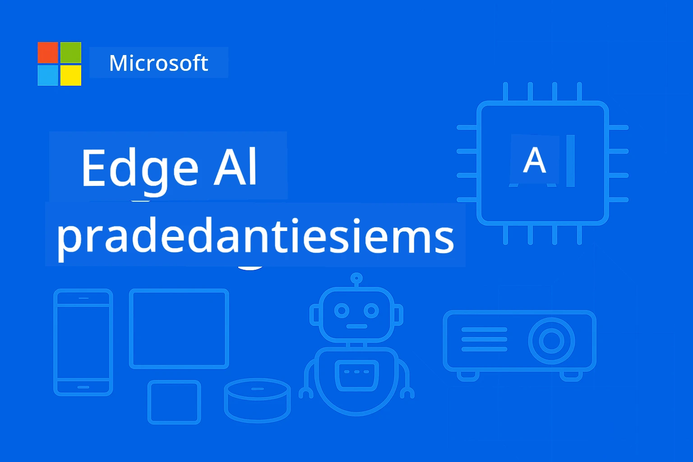

# EdgeAI pradedantiesiems




[](https://GitHub.com/microsoft/edgeai-for-beginners/graphs/contributors)
[](https://GitHub.com/microsoft/edgeai-for-beginners/issues)
[](https://GitHub.com/microsoft/edgeai-for-beginners/pulls)
[](http://makeapullrequest.com)

[](https://GitHub.com/microsoft/edgeai-for-beginners/watchers)
[](https://GitHub.com/microsoft/edgeai-for-beginners/fork)
[](https://GitHub.com/microsoft/edgeai-for-beginners/stargazers)


[](https://discord.gg/nTYy5BXMWG)

Sekite šiuos veiksmus, kad pradėtumėte naudotis šiomis ištekliais:

1. **Darykite šakę iš saugyklos**: Spustelėkite [](https://GitHub.com/microsoft/edgeai-for-beginners/fork)
2. **Klonuokite saugyklą**: `git clone https://github.com/microsoft/edgeai-for-beginners.git`
3. [**Prisijunkite prie Azure AI Foundry Discord ir susitikite su ekspertais bei kitais kūrėjais**](https://discord.com/invite/ByRwuEEgH4)


### 🌐 Daugiakalbė palaikymas

#### Palaikoma per GitHub Action (automatinis ir visada atnaujintas)

<!-- CO-OP TRANSLATOR LANGUAGES TABLE START -->
[Arabic](../ar/README.md) | [Bengali](../bn/README.md) | [Bulgarian](../bg/README.md) | [Burmese (Myanmar)](../my/README.md) | [Chinese (Simplified)](../zh-CN/README.md) | [Chinese (Traditional, Hong Kong)](../zh-HK/README.md) | [Chinese (Traditional, Macau)](../zh-MO/README.md) | [Chinese (Traditional, Taiwan)](../zh-TW/README.md) | [Croatian](../hr/README.md) | [Czech](../cs/README.md) | [Danish](../da/README.md) | [Dutch](../nl/README.md) | [Estonian](../et/README.md) | [Finnish](../fi/README.md) | [French](../fr/README.md) | [German](../de/README.md) | [Greek](../el/README.md) | [Hebrew](../he/README.md) | [Hindi](../hi/README.md) | [Hungarian](../hu/README.md) | [Indonesian](../id/README.md) | [Italian](../it/README.md) | [Japanese](../ja/README.md) | [Kannada](../kn/README.md) | [Khmer](../km/README.md) | [Korean](../ko/README.md) | [Lithuanian](./README.md) | [Malay](../ms/README.md) | [Malayalam](../ml/README.md) | [Marathi](../mr/README.md) | [Nepali](../ne/README.md) | [Nigerian Pidgin](../pcm/README.md) | [Norwegian](../no/README.md) | [Persian (Farsi)](../fa/README.md) | [Polish](../pl/README.md) | [Portuguese (Brazil)](../pt-BR/README.md) | [Portuguese (Portugal)](../pt-PT/README.md) | [Punjabi (Gurmukhi)](../pa/README.md) | [Romanian](../ro/README.md) | [Russian](../ru/README.md) | [Serbian (Cyrillic)](../sr/README.md) | [Slovak](../sk/README.md) | [Slovenian](../sl/README.md) | [Spanish](../es/README.md) | [Swahili](../sw/README.md) | [Swedish](../sv/README.md) | [Tagalog (Filipino)](../tl/README.md) | [Tamil](../ta/README.md) | [Telugu](../te/README.md) | [Thai](../th/README.md) | [Turkish](../tr/README.md) | [Ukrainian](../uk/README.md) | [Urdu](../ur/README.md) | [Vietnamese](../vi/README.md)

> **Norite klonuoti vietoje?**
>
> Ši saugykla apima daugiau nei 50 kalbų vertimų, todėl ženkliai padidėja atsisiuntimo dydis. Klonuoti be vertimų, naudokite riboto klonavimo funkciją (sparse checkout):
>
> **Bash / macOS / Linux:**
> ```bash
> git clone --filter=blob:none --sparse https://github.com/microsoft/edgeai-for-beginners.git
> cd edgeai-for-beginners
> git sparse-checkout set --no-cone '/*' '!translations' '!translated_images'
> ```
>
> **CMD (Windows):**
> ```cmd
> git clone --filter=blob:none --sparse https://github.com/microsoft/edgeai-for-beginners.git
> cd edgeai-for-beginners
> git sparse-checkout set --no-cone "/*" "!translations" "!translated_images"
> ```
>
> Tai suteikia viską, ko jums reikia kursui užbaigti ir žymiai spartesniam atsisiuntimui.
<!-- CO-OP TRANSLATOR LANGUAGES TABLE END -->

**Jei norite papildomų palaikomų vertimų kalbų, jos išvardytos [čia](https://github.com/Azure/co-op-translator/blob/main/getting_started/supported-languages.md)**
## Įvadas

Sveiki atvykę į **EdgeAI pradedantiesiems** – jūsų visapusiška kelionė į transformuojantį Edge Dirbtinio Intelekto pasaulį. Šis kursas sujungia galingas DI galimybes su praktiniu, realaus pasaulio diegimu ant periferinių įrenginių, suteikdamas jums galimybę pasinaudoti DI potencialu tiesiogiai ten, kur generuojami duomenys ir kur reikia priimti sprendimus.

### Ko išmoksite

Šis kursas ves jus nuo pagrindinių sąvokų iki gamybai paruoštų sprendimų, apimdamas:
- **Maži kalbos modeliai (SLM)**, optimizuoti periferiniam diegimui
- **Įrangos suvokimas optimizavimas** įvairiose platformose
- **Realaus laiko apdorojimas** su privatumo apsaugos galimybėmis
- **Gamybinis diegimas** įmonių taikymams

### Kodėl EdgeAI svarbus

Edge DI reiškia paradigmą, sprendžiančią svarbias šiuolaikines problemas:
- **Privatumas ir saugumas**: apdorokite jautrius duomenis vietoje, be debesijos
- **Realaus laiko našumas**: pašalinkite tinklo delsą laikui jautrioms programoms
- **Sąnaudų efektyvumas**: sumažinkite pralaidumo ir debesijos išlaidas
- **Atsparios operacijos**: išlikite veiksmingi nutrūkus tinklui
- **Reguliacinė atitiktis**: atitinkite duomenų suvereniteto reikalavimus

### Edge DI

Edge DI reiškia DI algoritmų ir kalbos modelių paleidimą vietoje ant įrangos, arti duomenų generavimo vietos be priklausomybės nuo debesijos išteklių dėl apdorojimo. Tai sumažina delsą, pagerina privatumą ir leidžia priimti sprendimus realiu laiku.

### Pagrindiniai principai:
- **Vietinis apdorojimas**: DI modeliai veikia ant periferinių įrenginių (telefonai, maršrutizatoriai, mikrovaldikliai, pramoniniai kompiuteriai)
- **Veikimas be interneto**: veikia be nuolatinio interneto ryšio
- **Maža delsos trukmė**: momentiniai atsakymai tinka realaus laiko sistemoms
- **Duomenų suverenitetas**: jautrių duomenų saugojimas vietoje, gerinant saugumą ir atitiktį

### Maži kalbos modeliai (SLM)

SLM, tokie kaip Phi-4, Mistral-7B ir Gemma, yra optimizuotos didelių LLM versijos – apmokytos ar distiliuotos:
- **Sumažintas atminties poreikis**: efektyvus ribotos periferinės atminties naudojimas
- **Mažesnė skaičiavimo apkrova**: optimizuoti CPU ir periferinių GPU našumui
- **Greitas paleidimas**: greita inicializacija reaguojančioms programoms

Jie atveria galingas NLP galimybes atsižvelgiant į:
- **Įterptines sistemas**: IoT įrenginiai ir pramoniniai valdikliai
- **Mobilias įrenginius**: išmanieji telefonai ir planšetės be interneto galimybių
- **IoT įrenginius**: jutikliai ir išmanieji įrenginiai su ribotais resursais
- **Periferinius serverius**: vietiniai apdorojimo vienetai su ribotais GPU resursais
- **Asmeninius kompiuterius**: stacionariai ir nešiojami kompiuteriai

## Kurso moduliai ir navigacija

| Modulis | Tema | Dėmesio sritis | Pagrindinė medžiaga | Lygis | Trukmė |
|--------|-------|------------|-------------|--------|----------|
| [📖 00 ](./introduction.md) | [Įvadas į EdgeAI](./introduction.md) | Pagrindai ir kontekstas | EdgeAI apžvalga • Pramonės taikymai • SLM įvadas • Mokymosi tikslai | Pradedantiesiems | 1-2 val. |
| [📚 01](../../Module01) | [EdgeAI pagrindai](./Module01/README.md) | Debesijos ir periferijos DI palyginimas | EdgeAI pagrindai • Realūs atvejai • Įgyvendinimo vadovas • Periferijos diegimas | Pradedantiesiems | 3-4 val. |
| [🧠 02](../../Module02) | [SLM modelių pagrindai](./Module02/README.md) | Modelių šeimos ir architektūra | Phi šeima • Qwen šeima • Gemma šeima • BitNET • μModel • Phi-Silica | Pradedantiesiems | 4-5 val. |
| [🚀 03](../../Module03) | [SLM diegimo praktika](./Module03/README.md) | Vietinis ir debesijos diegimas | Pažangus mokymasis • Vietinė aplinka • Debesijos diegimas | Vidutinio lygio | 4-5 val. |
| [⚙️ 04](../../Module04) | [Modelių optimizavimo įrankiai](./Module04/README.md) | Kryžminė platformų optimizacija | Įvadas • Llama.cpp • Microsoft Olive • OpenVINO • Apple MLX • Darbo eigų sintezė | Vidutinio lygio | 5-6 val. |
| [🔧 05](../../Module05) | [SLMOps gamyboje](./Module05/README.md) | Gamybos operacijos | SLMOps įvadas • Modelių distiliavimas • Tobulinimas • Gamybinis diegimas | Pažengęs | 5-6 val. |
| [🤖 06](../../Module06) | [DI agentai ir funkcijų iškvietimas](./Module06/README.md) | Agentų karkasai ir MCP | Agentų įvadas • Funkcijų iškvietimas • Modelių konteksto protokolas | Pažengęs | 4-5 val. |
| [💻 07](../../Module07) | [Platformų įgyvendinimas](./Module07/README.md) | Kryžminės platformos pavyzdžiai | DI įrankių rinkinys • Foundry Local • Windows kūrimas | Pažengęs | 3-4 val. |
| [🏭 08](../../Module08) | [Foundry Local įrankių rinkinys](./Module08/README.md) | Gamybiniai pavyzdžiai | Pavyzdinės programos (žr. žemiau) | Ekspertas | 8-10 val. |

### 🏭 **Modulis 08: Pavyzdinės programos**

- [01: REST Chat greitas pradžia](./Module08/samples/01/README.md)
- [02: OpenAI SDK integracija](./Module08/samples/02/README.md)
- [03: Modelių aptikimas ir testavimas](./Module08/samples/03/README.md)
- [04: Chainlit RAG programa](./Module08/samples/04/README.md)
- [05: Multi-agento orkestracija](./Module08/samples/05/README.md)
- [06: Modeliai kaip įrankių maršrutizatorius](./Module08/samples/06/README.md)
- [07: Tiesioginis API klientas](./Module08/samples/07/README.md)
- [08: Windows 11 pokalbių programa](./Module08/samples/08/README.md)
- [09: Pažangi daugiagentinė sistema](./Module08/samples/09/README.md)
- [10: Foundry įrankių karkasas](./Module08/samples/10/README.md)

### 🎓 **Dirbtuvės: Praktinis mokymosi kelias**

Išsamios praktinės dirbtuvės su gamybai paruoštais įgyvendinimais:

- **[Dirbtuvių vadovas](./Workshop/Readme.md)** – Mokymosi tikslai, rezultatai ir išteklių navigacija
- **Python pavyzdžiai** (6 sesijos) – Atnaujinti geriausios praktikos, klaidų tvarkymo ir išsamios dokumentacijos
- **Jupyter užrašų knygelės** (8 interaktyvios) – Žingsnis po žingsnio pamokos su testais ir našumo stebėsena
- **Sesijų vadovai** – Išsamūs markdown vadovai kiekvienai dirbtuvių sesijai
- **Patvirtinimo įrankiai** – Skriptai kodo kokybės tikrinimui ir greitiems testams

**Ką kursite:**
- Vietines DI pokalbių programas su srautinio perdavimo palaikymu
- RAG grandines su kokybės vertinimu (RAGAS)
- Daugelio modelių vertinimo ir palyginimo įrankius
- Multi-agento orchestravimo sistemas
- Išmanų modelių maršrutizavimą užduočių pagrindu

### 🎙️ **Dirbtuvės Agentic: Praktinės - DI Podcast studija**
Sukurkite nuo nulio AI varomą podcastų kūrimo sistemą! Šios įtraukiančios dirbtuvės moko, kaip sukurti pilną kelių agentų sistemą, kuri idėjas paverčia profesionaliais podcastų epizodais.

**[🎬 Pradėkite AI Podcast Studio dirbtuves](./WorkshopForAgentic/README.md)**

**Jūsų misija**: Paleiskite „Future Bytes“ — technologijų podcastą, kurį visiškai valdo AI agentai, kuriuos sukursite patys. Nėra jokios debesijos priklausomybės, jokių API mokesčių — viskas veikia lokaliai jūsų kompiuteryje.

**Kas daro tai unikalu:**
- **🤖 Tikroviška kelių agentų koordinacija** – sukurkite specializuotus AI agentus, kurie atlieka tyrimus, rašo ir kuria garso įrašus
- **🎯 Pilnas kūrimo procesas** – nuo temos parinkimo iki galutinio podcasto garso įrašo
- **💻 100 % lokalus įdiegimas** – naudoja Ollama ir vietinius modelius (Qwen-3-8B) tam, kad užtikrintų privatumą ir visišką kontrolę
- **🎤 Teksto į kalbą integracija** – paverskite scenarijus į natūraliai skambančias daugialypių balsų diskusijas
- **✋ Žmonių dalyvavimo procesai** – patvirtinimo taškai garantuoja kokybę nepakeisdami automatizacijos

**Mokymosi kelionė trims veiksmams:**

| Veiksmas | Fokusas | Esminiai įgūdžiai | Trukmė |
|-----|-------|------------|----------|
| **[1 veiksmas: Susipažinkite su savo AI asistentais](./WorkshopForAgentic/md/01.BuildAIAgentWithSLM.md)** | Sukurkite pirmąjį AI agentą | Įrankių integracija • Interneto paieška • Problemų sprendimas • Agentų pagrįstas mąstymas | 2-3 val. |
| **[2 veiksmas: Suformuokite savo kūrimo komandą](./WorkshopForAgentic/md/02.AIAgentOrchestrationAndWorkflows.md)** | Koordinuokite kelis agentus | Komandos koordinavimas • Patvirtinimo darbo eiga • DevUI sąsaja • Žmogiškoji priežiūra | 3-4 val. |
| **[3 veiksmas: Prikelkite savo podcastą gyvybei](./WorkshopForAgentic/md/03.Multi-SpeakerPodcastGenerationWithVibeVoice.md)** | Generuokite podcasto garso įrašą | Teksto į kalbą • Daugiabalsis sintezavimas • Ilgų formų garsas • Pilna automatizacija | 2-3 val. |

**Naudojamos technologijos:**
- **Microsoft Agent Framework** – kelių agentų koordinavimas ir valdymas
- **Ollama** – vietinis AI modelių vykdymas (nereikia debesijos)
- **Qwen-3-8B** – atviro kodo kalbos modelis, optimizuotas agentų užduotims
- **Teksto į kalbą API** – natūralus balso sintezavimas podcastų kūrimui

**Techninė įranga:**
- ✅ **CPU režimas** – veikia bet kuriame moderniame kompiuteryje (rekomenduojama 8GB+ RAM)
- 🚀 **GPU pagreitinimas** – žymiai spartesnis apdorojimas su NVIDIA/AMD GPU
- ⚡ **NPU palaikymas** – naujos kartos neuroninių procesorių pagreitinimas

**Puikiai tinka:**
- Vystytojams, mokantiems kelių agentų AI sistemas
- Visų, besidominčių AI automatizacija ir darbo procesais
- Turinį kuriančioms asmenybėms, tyrinėjančioms AI pagalbą kūrime
- Studentams, studijuojantiems praktines AI koordinacijos schemas

**Pradėkite kurti**: [🎙️ The AI Podcast Studio dirbtuves →](./WorkshopForAgentic/README.md)

### 📊 **Mokymosi kelio santrauka**
- **Bendras trukmė**: 36-45 valandos
- **Pradedančiųjų kelias**: moduliai 01-02 (7-9 val.)
- **Vidutinio lygio kelias**: moduliai 03-04 (9-11 val.)
- **Pažengusio lygio kelias**: moduliai 05-07 (12-15 val.)
- **Eksperto kelias**: modulis 08 (8-10 val.)

## Ką jūs kursite

### 🎯 Pagrindiniai gebėjimai
- **Edge AI architektūra**: projektuokite vietinius AI sprendimus su debesijos integracija
- **Modelių optimizavimas**: kvantizuokite ir suspauskite modelius kraštiniam diegimui (85 % spartesnis veikimas, 75 % mažesnis dydis)
- **Daugiaplatforminis diegimas**: Windows, mobiliosios, įterptos ir debesijos-krašto hibridinės sistemos
- **Produkcijos operacijos**: kraštinių AI sistemų stebėjimas, mastelio keitimas ir palaikymas

### 🏗️ Praktiniai projektai
- **Foundry vietinės pokalbių programos**: Windows 11 gimtoji programa su modelių perjungimu
- **Kelių agentų sistemos**: koordinatorius su specialistų agentais sudėtingiems darbo procesams
- **RAG taikymas**: vietinis dokumentų apdorojimas su vektorine paieška
- **Modelių maršrutizatoriai**: išmanus modelių parinkimas pagal užduočių analizę
- **API karkasai**: gamybai paruošti klientai su transliacija ir veiklos stebėsena
- **Skaidrūs įrankiai**: LangChain/Semantic Kernel integracijos šablonai

### 🏢 Pramonės taikymas
**Gamyba** • **Sveikatos priežiūra** • **Autonominiai automobiliai** • **Išmanieji miestai** • **Mobiliosios programėlės**

## Greitas pradžia

**Rekomenduojamas mokymosi kelias** (20-30 val. iš viso):

0. **📖 Įvadas** ([Introduction.md](./introduction.md)): EdgeAI pagrindai + pramonės kontekstas + mokymosi sistema
1. **📚 Pagrindai** (moduliai 01-02): EdgeAI koncepcijos + SLM modelių šeimos
2. **⚙️ Optimizavimas** (moduliai 03-04): diegimas + kvantizavimo karkasai
3. **🚀 Produkcija** (moduliai 05-06): SLMOps + AI agentai + funkcijų iškvietimas
4. **💻 Įgyvendinimas** (moduliai 07-08): platformos pavyzdžiai + Foundry Local įrankių rinkinys

Kiekviename modulyje yra teorija, praktinės užduotys ir gamybai paruošti kodo pavyzdžiai.

## Karjeros poveikis

**Techninės pozicijos**: EdgeAI sprendimų architektas • ML inžinierius (kraštas) • IoT AI kūrėjas • Mobiliosios AI kūrėjas

**Pramonės sektoriai**: Gamyba 4.0 • Sveikatos technologijos • Autonominės sistemos • FinTech • Vartotojų elektronika

**Portfolio projektai**: kelių agentų sistemos • gamybos RAG programos • daugiaplatformis diegimas • našumo optimizavimas

## Saugyklos struktūra

```
edgeai-for-beginners/
├── 📖 introduction.md  # Foundation: EdgeAI Overview & Learning Framework
├── 📚 Module01-04/     # Fundamentals → SLMs → Deployment → Optimization  
├── 🔧 Module05-06/     # SLMOps → AI Agents → Function Calling
├── 💻 Module07/        # Platform Samples (VS Code, Windows, Jetson, Mobile)
├── 🏭 Module08/        # Foundry Local Toolkit + 10 Comprehensive Samples
│   ├── samples/01-06/  # Foundation: REST, SDK, RAG, Agents, Routing
│   └── samples/07-10/  # Advanced: API Client, Windows App, Enterprise Agents, Tools
├── 🌐 translations/    # Multi-language support (8+ languages)
└── 📋 STUDY_GUIDE.md   # Structured learning paths & time allocation
```

## Kurso akcentai

✅ **Progresyvus mokymasis**: teorija → praktika → gamybos diegimas  
✅ **Tikros bylos analizė**: Microsoft, Japan Airlines, įmonių diegimai  
✅ **Praktiniai pavyzdžiai**: 50+ pavyzdžių, 10 visapusiškų Foundry Local demonstracijų  
✅ **Dėmesys našumui**: 85 % spartesnis veikimas, 75 % mažesnis dydis  
✅ **Daugiaplatformis**: Windows, mobiliosios, įterptos, debesijos-krašto hibridinės sistemos  
✅ **Gamybai paruošta**: stebėsena, mastelio keitimas, saugumo, atitikties karkasai

📖 **[Studijų vadovas prieinamas](STUDY_GUIDE.md)**: struktūruotas 20 valandų mokymosi kelias su laiko planavimo ir savęs vertinimo įrankiais.

---

**EdgeAI reprezentuoja AI diegimo ateitį**: vietinis pirmiausia, saugantis privatumą ir efektyvus. Įvaldykite šiuos įgūdžius, kad kurtumėte kitą kartą išmaniųjų programų.

## Kiti kursai

Mūsų komanda kuria ir kitus kursus! Pažiūrėkite:

<!-- CO-OP TRANSLATOR OTHER COURSES START -->
### LangChain
[](https://aka.ms/langchain4j-for-beginners)
[](https://aka.ms/langchainjs-for-beginners?WT.mc_id=m365-94501-dwahlin)
[](https://github.com/microsoft/langchain-for-beginners?WT.mc_id=m365-94501-dwahlin)
---

### Azure / Edge / MCP / Agentai
[](https://github.com/microsoft/AZD-for-beginners?WT.mc_id=academic-105485-koreyst)
[](https://github.com/microsoft/edgeai-for-beginners?WT.mc_id=academic-105485-koreyst)
[](https://github.com/microsoft/mcp-for-beginners?WT.mc_id=academic-105485-koreyst)
[](https://github.com/microsoft/ai-agents-for-beginners?WT.mc_id=academic-105485-koreyst)

---
 
### Generatyvinis AI serija
[](https://github.com/microsoft/generative-ai-for-beginners?WT.mc_id=academic-105485-koreyst)
[-9333EA?style=for-the-badge&labelColor=E5E7EB&color=9333EA)](https://github.com/microsoft/Generative-AI-for-beginners-dotnet?WT.mc_id=academic-105485-koreyst)
[-C084FC?style=for-the-badge&labelColor=E5E7EB&color=C084FC)](https://github.com/microsoft/generative-ai-for-beginners-java?WT.mc_id=academic-105485-koreyst)
[-E879F9?style=for-the-badge&labelColor=E5E7EB&color=E879F9)](https://github.com/microsoft/generative-ai-with-javascript?WT.mc_id=academic-105485-koreyst)

---
 
### Pagrindinis mokymasis
[](https://aka.ms/ml-beginners?WT.mc_id=academic-105485-koreyst)
[](https://aka.ms/datascience-beginners?WT.mc_id=academic-105485-koreyst)
[](https://aka.ms/ai-beginners?WT.mc_id=academic-105485-koreyst)
[](https://github.com/microsoft/Security-101?WT.mc_id=academic-96948-sayoung)
[](https://aka.ms/webdev-beginners?WT.mc_id=academic-105485-koreyst)
[](https://aka.ms/iot-beginners?WT.mc_id=academic-105485-koreyst)
[](https://github.com/microsoft/xr-development-for-beginners?WT.mc_id=academic-105485-koreyst)

---
 
### Copilot serija
[](https://aka.ms/GitHubCopilotAI?WT.mc_id=academic-105485-koreyst)
[](https://github.com/microsoft/mastering-github-copilot-for-dotnet-csharp-developers?WT.mc_id=academic-105485-koreyst)
[](https://github.com/microsoft/CopilotAdventures?WT.mc_id=academic-105485-koreyst)
<!-- CO-OP TRANSLATOR OTHER COURSES END -->

## Pagalbos gavimas

Jei užstringate arba turite klausimų apie dirbtinio intelekto programėlių kūrimą, prisijunkite prie:

[](https://discord.gg/nTYy5BXMWG)

Jei turite produkto atsiliepimų arba klaidų, susijusių su kūrimu, apsilankykite:

[](https://aka.ms/foundry/forum)

---

<!-- CO-OP TRANSLATOR DISCLAIMER START -->
**Atsakomybės atsisakymas**:  
Šis dokumentas buvo išverstas naudojant dirbtinio intelekto vertimo paslaugą [Co-op Translator](https://github.com/Azure/co-op-translator). Nors stengiamės užtikrinti tikslumą, atkreipkite dėmesį, kad automatizuoti vertimai gali turėti klaidų ar netikslumų. Originalus dokumentas jo gimtąja kalba turėtų būti laikomas autoritetingu šaltiniu. Svarbiai informacijai rekomenduojama kreiptis į profesionalų vertėją. Mes neatsakome už bet kokius nesusipratimus ar neteisingus interpretavimus, atsiradusius naudojant šį vertimą.
<!-- CO-OP TRANSLATOR DISCLAIMER END -->