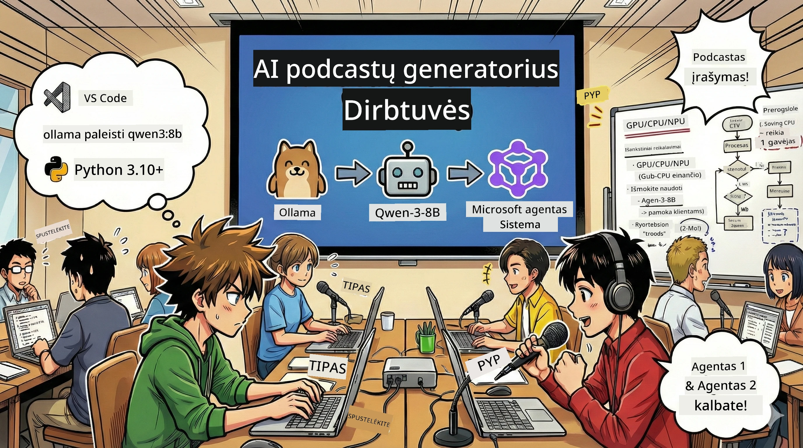
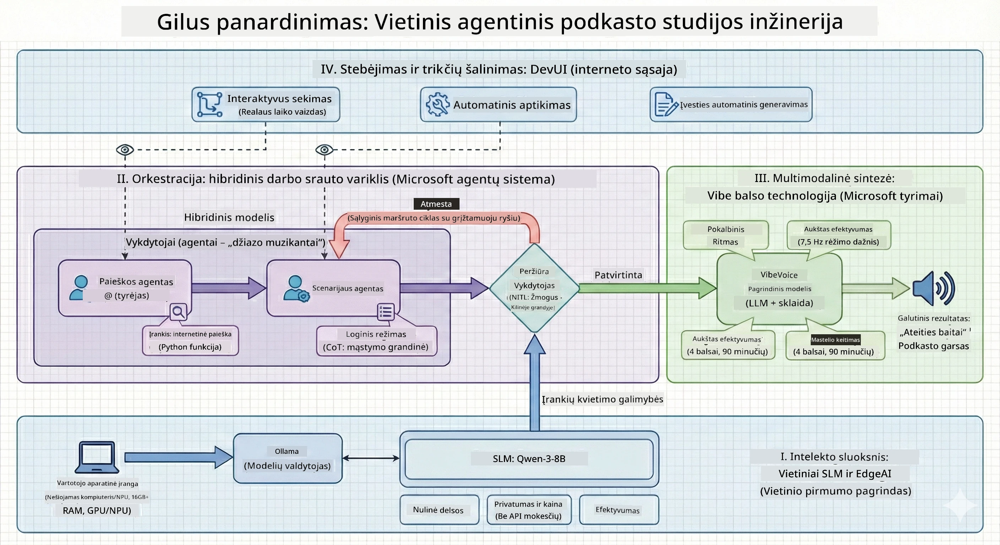

<!--
CO_OP_TRANSLATOR_METADATA:
{
  "original_hash": "f94e745264597bc5d8df967ead2eff97",
  "translation_date": "2026-01-05T10:58:44+00:00",
  "source_file": "WorkshopForAgentic/README.md",
  "language_code": "lt"
}
-->
# 🎙️ AI Podcast Studijos Dirbtuvės

> 🌏 [中文版 (Kinų Versija)](translation/zh-cn/README.md)



## Tavo Misija

Sveiki atvykę į **AI Podcast Studiją**! Ketini pradėti savo technologijų podcastą pavadinimu "Future Bytes" — bet štai pokštas: tu sukursi AI varomą gamybos komandą, kuri padės tau jį sukurti. Nebereikės valandų valandas tyrinėti, rašyti scenarijų ir redaguoti garso įrašų. Vietoje to koduosi ir tapsi podcasto režisieriumi su AI supergaliomis.

## Istorija

Įsivaizduok: tu ir tavo draugai norite pradėti podcastą apie pačius įdomiausius technologijų trendus, bet visi užsiėmę mokykla, darbu ar gyvenimu. Kas, jei galėtum sukurti AI agentų komandą, kuri atliktų sunkų darbą? Vienas agentas tyrinėja temas, kitas rašo įtraukiančius scenarijus, o trečias paverčia tekstą natūraliomis pokalbių intonacijomis. Skamba kaip mokslinė fantastika? Padarykime tai realybe.

## Ko Išmoksi

Po šių dirbtuvių tu sužinosi, kaip:
- 🤖 Diegti savo vietinį AI modelį (be API mokesčių ir debesijos priklausomybės!)
- 🔧 Kurti specializuotus AI agentus, kurie tikrai bendradarbiauja
- 🎬 Sukurti pilną podcasto gamybos procesą nuo idėjos iki garso

## Tavo Kelionė: Trys Veiksmai



Kaip ir kiekvienoje geroje istorijoje, yra trys veiksmai. Kiekvienas po truputį kuria tavo AI podcast studiją:

| Epizodas | Tavo Užduotis | Kas Įvyksta | Įgyjamos Įgūdžiai |
|---------|-----------|--------------|----------------|
| **Veiksmas 1** | [Susipažink su AI Asistentais](md/01.BuildAIAgentWithSLM.md) | Sužinai, kaip sukurti AI agentus, kurie gali bendrauti, ieškoti internete ir net spręsti problemas. Galvok apie juos kaip apie tavo tyrimų praktikantus, kurie niekada nemiega. | 🎯 Sukurk pirmą agentą<br>🛠️ Suteik jam supergalias (įrankius!)<br>🧠 Išmok jį mąstyti<br>🌐 Prijunk prie interneto |
| **Veiksmas 2** | [Sukurk Gamybos Komandą](md/02.AIAgentOrchestrationAndWorkflows.md) | Dabar tampa įdomiau! Organizuoji kelių AI agentų darbą kaip tikra podcasto komanda. Vienas tyrinėja, kitas rašo, tu patvirtini — komandiniais darbais pasieki svajonę. | 🎭 Koordinuok kelis agentus<br>🔄 Kurk patvirtinimo darbo eigas<br>🖥️ Išbandyk su DevUI sąsaja<br>✋ Laikyk žmones kontrolėje |
| **Veiksmas 3** | [Įkūnyk Podcastą](md/03.Multi-SpeakerPodcastGenerationWithVibeVoice.md) | Finalas! Paversk savo tekstinius scenarijus tikru podcasto garsu su realistiniu balsu ir natūraliais pokalbiais. Tavo podcastas "Future Bytes" pasiruošęs startuoti! | 🎤 Tekstas į kalbą<br>👥 Keli kalbėtojai<br>⏱️ Ilgo formato garsas<br>🚀 Viso proceso automatizavimas |

Kiekvienas veiksmas atrakina naujas galimybes. Jei drąsu, gali praleisti, bet rekomenduojame sekti istoriją!

## Aplinkos Reikalavimai

Šios dirbtuvės palaiko įvairius techninius aplinkos tipus:
- **CPU**: tinka testavimui ir mažoms apkrovoms
- **GPU**: rekomenduojama produkcijai, žymiai pagreitina inferenciją
- **NPU**: palaiko naujos kartos neuroninių procesorių pagreitį

## Ko Tau Reikės

### Programinė Įranga ✅
- **Python 3.10+** (Tavo programavimo kalba)
- **Ollama** (Vykdo AI modelius tavo mašinoje)
- **VS Code** (Tavo kodo redaktorius)
- **Python priedas** (Apšvies VS Code)
- **Git** (Kodo atsiėmimui)

### Aparatūra 💻
- **Ar galiu paleisti?**: 8GB RAM, 10GB laisvos vietos (veikia, bet gali būti lėtai)
- **Idealus variantas**: 16GB+ RAM, geras GPU (sklandus darbas!)
- **Turi NPU?**: Dar geriau! Naujos kartos našumas atrakintas 🚀

## Paruošk Studiją 🎬

### 1 Žingsnis: Python Paruošimas

Įsitikink, kad turi Python 3.10 ar naujesnį:

```bash
python --version
# Turėtų rodyti Python 3.10.x arba naujesnę versiją
```
  
Neturi Pythono? Parsisiųsk jį iš [python.org](https://python.org) — jis nemokamas!

### 2 Žingsnis: Atsisiųsk Ollama (tavo AI modelių vykdytoją)

Eik į [ollama.ai](https://ollama.ai) ir atsisiųsk Ollama pagal savo OS. Galvok apie tai kaip variklį, kuris vykdo tavo AI modelius vietoje.

Patikrink, ar jis veikia:

```bash
ollama --version
```
  
### 3 Žingsnis: Parsisiųsk savo AI Smegenis 🧠

Laikas parsisiųsti Qwen-3-8B modelį (tai kaip pirmojo AI asistento samdymas):

```bash
ollama pull qwen3:8b
```
  
*Tai gali užtrukti kelias minutes. Puikus metas kavos pertraukai! ☕*

### 4 Žingsnis: Įdiek VS Code

Jei dar neturi, parsisiųsk [Visual Studio Code](https://code.visualstudio.com/). Tai pats geriausias kodo redaktorius (priimk iššūkį 😄).

### 5 Žingsnis: Python Priedas

VS Code:
1. Paspausk `Ctrl+Shift+X` (arba `Cmd+Shift+X` Mac)
2. Ieškok „Python“
3. Įdiek oficialų Microsoft Python priedą

### 6 Žingsnis: Viskas Paruošta! 🎉

Nuo šiol esi pasirengęs kurti AI magiją!

### 7 Žingsnis: Įdiek Microsoft Agent Framework ir Susijusius Paketus 📦

Įdiek visas reikiamas priklausomybes šiam kursui:

```bash
pip install -r ./Installations/requirements.txt -U
```
  
*Tai įdiegs Microsoft Agent Framework ir visus reikalingus paketus. Pasiimk kavos — pirmas diegimas gali užtrukti kelias minutes! ☕*

## Dirbtuvių Instrukcijos

Detali projekto struktūra, konfigūravimo žingsniai ir vykdymo metodai bus paaiškinti žingsnis po žingsnio dirbtuvių metu.

## Problemų Šalinimas (Kai Kas Nesiseka) 🔧

### „Ugh, modelio atsisiuntimas užtrunka amžinybę!“  
**Sprendimas**: Naudok VPN arba konfigūruok Ollama su veidrodiniu šaltiniu. Kartais internetas tiesiog negerai elgiasi.

### „Mano kompiuteris žlunga! Atminties trūksta!“  
**Sprendimas**: Perjunk į mažesnį modelį arba pakeisk `num_ctx` nustatymus, kad naudotų mažiau atminties. Galvok taip – įdėjai AI ant dietos.

### „Ar galiu pagreitinti su savo GPU?“  
**Sprendimas**: Ollama automatiškai aptinka GPU! Tiesiog įsitikink, kad GPU tvarkyklės atnaujintos. Nemokamas greičio boostas! 🏎️

## Papildomi Ištekliai (Smalsiems) 📚

- [Ollama Dokumentacija](https://github.com/ollama/ollama) — Gilus žvilgsnis į vietinius AI modelius  
- [Microsoft Agent Framework](https://microsoft.github.io/autogen/) — Sužinok daugiau apie agentų komandų kūrimą  
- [Qwen Modelio Informacija](https://qwenlm.github.io/) — Susipažink su savo AI asistento smegenimis

## Licencija

MIT Licencija — Kurk nuostabius dalykus, dalinkis, gerink pasaulį! 🌍

## Nori Prisidėti?

Radai klaidą? Turi idėją? Palik Issue arba PR! Mes mėgstame bendruomenės dvasią. ✨

---

<!-- CO-OP TRANSLATOR DISCLAIMER START -->
**Atsakomybės apribojimas**:  
Šis dokumentas buvo išverstas naudojant dirbtinio intelekto vertimo paslaugą [Co-op Translator](https://github.com/Azure/co-op-translator). Nors siekiame tikslumo, atkreipkite dėmesį, kad automatizuoti vertimai gali turėti klaidų ar netikslumų. Originalus dokumentas jo gimtąja kalba turėtų būti laikomas autoritetingu šaltiniu. Kritinei informacijai rekomenduojama naudoti profesionalų žmogaus vertimą. Mes neatsakome už jokią neteisingą supratimą ar klaidingas interpretacijas, kylančias dėl šio vertimo naudojimo.
<!-- CO-OP TRANSLATOR DISCLAIMER END -->