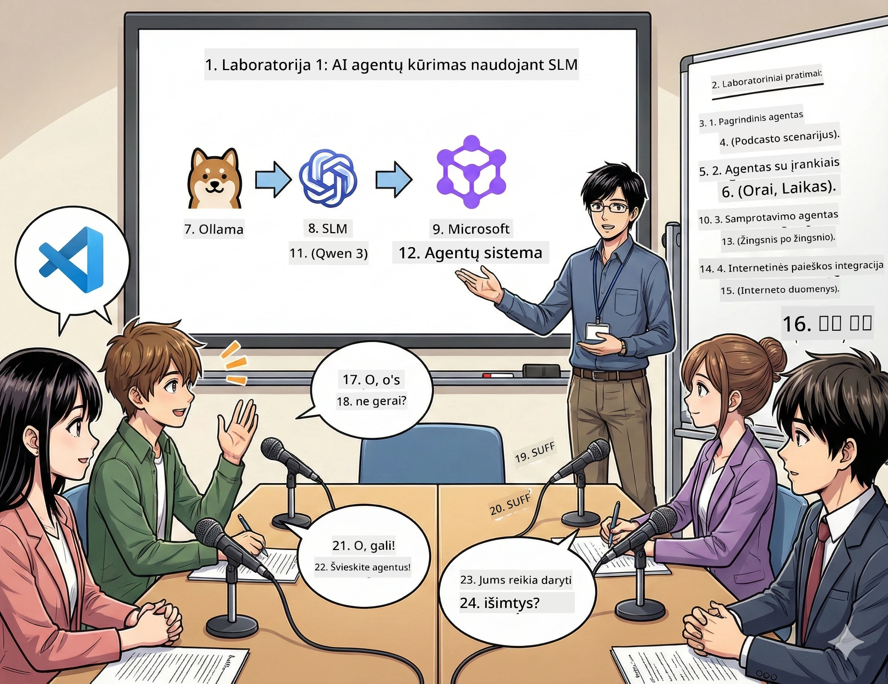

# Veiksmas 1: Susipažinkite su savo AI tyrimų asistentu 🤖

## Iššūkis

Jūs pradedate "Future Bytes," savo naują technologijų podcastą. 1-asis epizodas apie naujausius AI proveržius, bet turite 24 valandas, kad:
1. Ištirtumėte temą
2. Surastumėte patikimus šaltinius
3. Parašytumėte įtaigų scenarijų
4. Padarytumėte, kad skambėtų natūraliai

**Siurprizas**: Jums nereikia to daryti vienam. Jūs ketinate sukurti savo pirmąjį AI asistentą, kuris gali padėti su visa tai. Pavadinkime jį Alekss — jūsų neišsenkantis tyrimų partneris, kuris niekada nemiega.

## Kodėl Maži Kalbos Modeliai? (Pasisakymas: Jų vertė milžiniška)

Įsivaizduokite Mažus Kalbos Modelius (SLM) kaip jūsų asmeninį AI, kuris gyvena *jūsų* kompiuteryje. Nėra debesies, jokių mėnesinių mokesčių, jokių abejotinų duomenų dalijimosi.

**Kodėl SLM yra 🔥:**
- **🏠 Veikia jūsų įrenginyje**: Nešiojamas, stacionarus, net galingas Raspberry Pi
- **💸 Nėra nuolatinių kaštų**: Nėra API mokesčių, kurie suvalgytų jūsų pietų pinigus
- **🔒 Privatumą pirmiausia**: Jūsų duomenys niekada neišeina iš įrenginio
- **⚡ Žaibiškai greiti**: Nėra interneto delsos, momentiniai atsakymai
- **🪦 Lengvi**: 1B-10B parametrų vs 100B+ didesniems modeliams

**Populiarūs SLM**: Qwen 3, Phi-4, Gemma 3 (šiame užsiėmime naudojame Qwen)

## Jūsų Įrankių Rinkinys

### Ollama: Jūsų AI modelių valdymas

[Ollama](https://ollama.com/) yra tarsi Steam AI modeliams. Atsisiųskite, paleiskite ir valdykite modelius su paprastomis komandomis.

**Kas daro tai šaunu:**
- Viena komanda atsisiųsti ir paleisti bet kurį modelį
- Veikia Mac, Windows, Linux
- Automatiškai naudoja jūsų GPU, jei jis yra
- Labai efektyvus atminties naudojimas

### Microsoft Agent Framework: Ten, kur vyksta magija

[Microsoft Agent Framework](https://github.com/microsoft/agent-framework) yra jūsų žaidimų aikštelė kuriant AI agentus, kurie gali:

- 💬 Kalbėtis ir atsiminti, apie ką kalbėjote
- 🛠️ Naudoti pasirinktinius įrankius (pvz., naršyti internete ar tikrinti orą)
- 🧠 Spręsti sudėtingas problemas žingsnis po žingsnio
- 🤝 Dirbti su kitais agentais kaip komanda
- 🔌 Jungtis prie skirtingų AI tiekėjų (OpenAI, Ollama, Azure)

**Pagrindiniai komponentai:**
- **Agentai**: Jūsų AI asistentai su konkrečiomis užduotimis
- **Įrankiai**: Specialios galimybės, kurias jiems suteikiate
- **Atmintis**: Kad jie nepamirštų jūsų pokalbio
- **Mąstymas**: Mokymas galvoti, ne tik atsakinėti

## Jūsų Mokymosi Montažas: 4 Misijos

### Misija 1: Sukurkite savo pirmąjį agentą

📓 [Atidaryti užrašų knygelę](../code/01.BasicAgent/00.BasicAgent-agent.ipynb)

**Tikslas**: Sukurkite Alekss, jūsų podcasto scenarijų rašytojo AI. Alekss turi generuoti dialogą tarp dviejų vedėjų, aptarinėjančių technologijų temas.

**Ko išmoksite**:
- Kaip pažadinti AI agentą (tai lengviau nei pirmadienį keltis)
- Suteikti jam asmenybę ir nurodymus
- Padaryti, kad generuotų tikrus podcasto scenarijus
- Suprasti, ką jis jums grąžina

**Pergalės sąlyga**: Alekss sukuria scenarijų jūsų "Future Bytes" pilotiniam epizodui apie AI! 🎯

### Misija 2: Suteikite Alekss supergalias (Įrankius!)

📓 [Atidaryti užrašų knygelę](../code/01.BasicAgent/01.BasicAgent-tools.ipynb)

**Tikslas**: Alekss yra protingas, bet nežino šiandienos oro ar valandos. Ištaisykite tai suteikdami jam įrankių!

**Ko išmoksite**:
- Kurti pasirinktines Python funkcijas kaip "įrankius"
- Leisti Alekss nuspręsti *kada* naudoti kurį įrankį
- Stebėti, kaip jis savarankiškai sprendžia problemas
- Derinti kelis įrankius sudėtingoms užduotims

**Pergalės sąlyga**: Paklauskite "Koks oras Tokijuje?" ir Alekss pats tai išsiaiškina! ☁️

### Misija 3: Išmokykite Alekss mąstyti

📓 [Atidaryti užrašų knygelę](../code/01.BasicAgent/02.BasicAgent-reasoning.ipynb)

**Tikslas**: Padarykite, kad Alekss rodytų savo sprendimą. Spręsdami problemas norite matyti *kaip* jis mąsto, o ne tik atsakymą.

**Ko išmoksite**:
- Įjungti "mąstymo režimą" (tai kaip parodyti savo darbą matematikos pamokoje)
- Matyti Alekss žingsnis po žingsnio mąstymo procesą
- Suprasti grandininį mąstymą (chain-of-thought prompting)
- Taisyti klaidas, kai Alekss supainioja

**Pergalės sąlyga**: Užduokite sudėtingą matematikos uždavinį ir stebėkite, kaip Alekss jį išsprendžia! 🧠

### Misija 4: Prijunkite Alekss prie interneto

📓 [Atidaryti užrašų knygelę](../code/01.BasicAgent/03.BasicAgent-websearch.ipynb)

**Tikslas**: Alekss žinios turi ribą. Prijunkite jį prie interneto, kad gautumėte realaus laiko informaciją!

**Ko išmoksite**:
- Sukurti pasirinktinį interneto paieškos įrankį
- Integruoti išorinius API
- Tvarkyti tinklo klaidas elegantiškai
- Gauti info už Alekss mokymo duomenų ribų

**Pergalės sąlyga**: Paklauskite apie šiandienos technologijų naujienas ir gaukite šviežią informaciją! 📰

## Prieš pradedant 🚀

**Reikalinga įranga**:
- Įdiegta Python 3.10+
- Veikia Ollama (patikrinkite su `ollama --version`)
- VS Code su Python plėtiniu
- Bent 8GB RAM (16GB, jei norite sklandaus darbo)

## Misijų tvarka

Sekite užrašų knygeles iš eilės, kad gautumėte pilną istoriją:

1. [00.BasicAgent-agent.ipynb](../code/01.BasicAgent/00.BasicAgent-agent.ipynb) — Susipažinkite su Alekss (jūsų pirmuoju agentu)
2. [01.BasicAgent-tools.ipynb](../code/01.BasicAgent/01.BasicAgent-tools.ipynb) — Laikas stiprinti!
3. [02.BasicAgent-reasoning.ipynb](../code/01.BasicAgent/02.BasicAgent-reasoning.ipynb) — Išmokykite Alekss mąstyti
4. [03.BasicAgent-websearch.ipynb](../code/01.BasicAgent/03.BasicAgent-websearch.ipynb) — Interneto prieiga atrakinta!

## Ką įvaldysite

Po 1 veiksmo galėsite:

- ✅ Vykdyti AI modelius savo aparatinėje įrangoje (be debesies!)
- ✅ Kurti agentus su pasirinktine asmenybe ir gebėjimais
- ✅ Suteikti agentams įrankius spręsti realaus pasaulio problemas
- ✅ Padaryti, kad agentai rodytų savo mąstymo procesą
- ✅ Prijungti agentus prie išorinių duomenų šaltinių
- ✅ Taisyti klaidas, kai kas nors nepavyksta

## Kai kas nors sugenda (Ir kaip taisyti) 🔧

### "Aleksas nesikrauna! Nepakanka atminties!"
**Sprendimas**: Jūsų kompiuteris sunkiai tvarkosi. Pabandykite uždaryti kitas programas arba pereiti prie mažesnio modelio. 8GB RAM — tai minimalus norma.

### "Aleksas veikia taip lėtai"
**Sprendimas**: Įjunkite GPU pagreitį Ollama nustatymuose. Arba sumažinkite konteksto lango dydį. Įjungtas greičio režimas! 🏎️

### "Įrankiai neveikia!"
**Sprendimas**: Patikrinkite savo funkcijų parašus. Alekss turi gauti aiškias tipų užuominas, kad suprastų, ką daro įrankis. Galvokite apie tai kaip aiškių nurodymų davimą.

## Naudingos Nuorodos 🔗

- [Agent Framework dokumentacija](https://github.com/microsoft/agent-framework) — Oficialūs vadovai ir pavyzdžiai
- [Ollama Modelių Biblioteka](https://ollama.com/library) — Naršykite prieinamus modelius
- [Qwen Modelis](https://ollama.com/library/qwen3) — Susipažinkite su savo AI smegenimis
- [Kodo pavyzdžiai](https://github.com/microsoft/agent-framework/tree/main/python/samples) — Pasisemkite idėjų čia

## Kitas žingsnis: 2 veiksmas 🎬

Jūs turite vieną agentą. O ką jei turėtumėte *komandą* agentų, dirbančių kartu? 2 veiksme kursite visą savo podcasto kūrimo komandą:
- **Tyrimų agentas**: Randa geriausius šaltinius
- **Rašymo agentas**: Kuria tobulą scenarijų  
- **Redaktorius (Jūs!)**: Patvirtina ar paprašo pakeitimų

Pakvieskime AI magiją į Jūsų komandą! → [2 veiksmas: Surinkite savo gamybos komandą](02.AIAgentOrchestrationAndWorkflows.md)

---

**Įstringote?** Užduokite klausimus dirbant užsiėmime. Mokomės kartu! 🙌

---

<!-- CO-OP TRANSLATOR DISCLAIMER START -->
**Atsakomybės apribojimas**:
Šis dokumentas buvo išverstas naudojant dirbtinio intelekto vertimo paslaugą [Co-op Translator](https://github.com/Azure/co-op-translator). Nors siekiame tikslumo, atkreipkite dėmesį, kad automatizuoti vertimai gali turėti klaidų ar netikslumų. Originalus dokumentas gimtąja kalba turėtų būti laikomas autoritetingu šaltiniu. Svarbiai informacijai rekomenduojamas profesionalus žmogaus vertimas. Mes neatsakome už bet kokius nesusipratimus ar klaidingas interpretacijas, kylančias naudojant šį vertimą.
<!-- CO-OP TRANSLATOR DISCLAIMER END -->