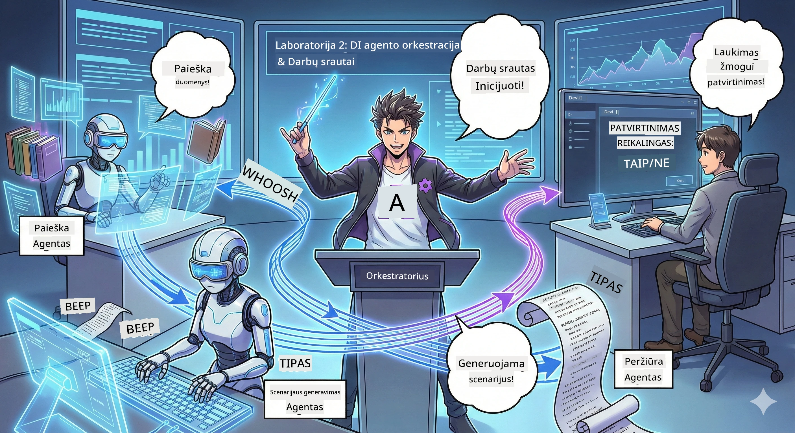

<!--
CO_OP_TRANSLATOR_METADATA:
{
  "original_hash": "93f84b804ced67c5cd017c3c4bb476ff",
  "translation_date": "2026-01-05T11:52:38+00:00",
  "source_file": "WorkshopForAgentic/md/02.AIAgentOrchestrationAndWorkflows.md",
  "language_code": "lt"
}
-->
# 2 veiksmas: Surinkite savo podcastų gamybos komandą 🎬



## Siužetas gilėja

Aleksas (jūsų AI asistentas iš 1 veiksmo) yra puikus, bet vienas agentas negali valdyti visos podcastų studijos. Jums reikia *komandos*:
- 🔍 **Tyrimų agentas**: Ieško internete naujos informacijos
- ✍️ **Scenarijaus agentas**: Paverčia tyrimus į įdomų dialogą
- 👤 **Jūs (Redaktorius)**: Patvirtina scenarijus arba siunčia juos perrašyti

Sveiki atvykę į **AI agentų orkestravimą** — čia jūs tampate savo AI komandos režisieriumi. Galvokite apie tai kaip „Keršytojus“, tik podcastų gamybai.

## Kas yra agentų orkestravimas? (Paprasta versija)

Įsivaizduokite, kad valdote restoraną. Jūs juk visko nedarote vienas, tiesa? Jūs turite:
- 🍳 Šefą, kuris gamina
- 👨‍🍳 Padedantį šefą, kuris ruošia
- 👩‍🍳 Padavėją, kuris tiekia

Agentų orkestravimas yra ta pati idėja, bet su AI. Kiekvienas agentas specializuojasi, o jūs koordinuojate juos, kad pasiektumėte didesnius tikslus. Nė vienas agentas nėra perkrautas, o darbas daromas greičiau.

### Grupės analogija 🎸

Jūsų AI agentai yra kaip grupė:
- **Vokalistas**: Pagrindinis agentas, dirbantis su klientu  
- **Būgnininkas**: Laiko ritmą, atlieka foninius veiksmus  
- **Bosistas**: Palaiko visus, renka duomenis  
- **Jūs (Grupės vadybininkas)**: Koordinuojate viską!

Be koordinacijos? Tiktai triukšmas. Su orkestravimu? Graži muzika.

### Kodėl tai svarbu

Vienas AI agentas, bandantis viską daryti = perdegimas. Specializuoti agentai dirba kartu = atverta efektyvumo jėga! 🚀

**Tikri žodžiai**: Prisiminkite, kaip bandėte tyrinėti, rašyti IR redaguoti savo podcastą vienas? Taip, tai nėra smagu. Su orkestravimu kiekvienas agentas atlieka tai, ką jis moka geriausiai. Jūs tik priimate galutinius sprendimus.

**Tikras pavyzdys**: Klientų aptarnavimo botai, kurie žino, kada tvarkyti sąskaitų klausimus, techninę pagalbą arba kada perduoti žmogui. Tai yra orkestravimas!

## Agentas vs. Darbo eiga: Kuo skiriasi?

Galvokite taip:

### 🤖 AI agentas = džiazo muzikantas  
- **Priima sprendimus čia ir dabar** pagal tai, ką girdi  
- **Improvizuoja** sprendimus naudodamasis savo įrankiais  
- **Mąsto** su LLM smegenimis  
- **Prisitaiko** prie bet ko, ką jam pateikiate

### 🎵 Darbo eiga = orkestracijos klasikinė muzika  
- **Laikosi partijos** (iš anksto apibrėžtų žingsnių)  
- **Nuspėjamas** vykdymo kelias  
- **Koordinuoja** kelis agentus, žmones, sistemas  
- **Struktūruota** kaip receptas

**Magija**: Darbo eigos *orchestruoja* agentus! Jūs kuriate darbo eigą, kuri nurodo agentams, kada atliekti savo dalį. Geriausia iš abiejų pasaulių. 🎭

## Trys būdai koordinuoti AI komandą

### 1. 🎯 Centralizuotas (Jūs bosas)

Vienas pagrindinis agentas priima visus sprendimus. Galvokite apie tai kaip komandos vadybą — jūs nusprendžiate, kas ką daro ir kada.

**Privalumai**:  
- ✅ Aiški lyderystė (be painiavos)  
- ✅ Nuoseklūs sprendimai  
- ✅ Lengva derinti klaidas

**Naudokite**:  
- Klientų aptarnavimo maršrutizavimui („Ar tai sąskaitos ar techninė pagalba?“)  
- Turinys patvirtinimo darbo eigoms („Ar šis scenarijus tinkamas?“)  
- Podcastų gamybai (kaip tik ką dabar statome!)

### 2. 🤝 Decentralizuotas (Agentai savarankiškai organizuojasi)

Agentai bendrauja tiesiogiai vieni su kitais ir sprendžia klausimus kartu. Kaip grupės pokalbio kambarys, kur visi koordinuojasi.

**Privalumai**:  
- ✅ Lengvai plečiamas (galima pridėti agentų bet kada)  
- ✅ Nėra vienos gedimo vietos  
- ✅ Natūrali agentų bendradarbiavimo aplinka

**Naudokite**:  
- Tyrimų grupėms (kiekvienas agentas tiria skirtingus šaltinius)  
- Idėjų generavimo sesijoms  
- Paskirstytam problemų sprendimui

### 3. 🔀 Hibridinis (Geriausia iš abiejų pasaulių)

Jūs nustatote bendrą kryptį, tačiau agentai turi laisvę patys organizuotis užduotyse. Kaip generalinis direktorius, kuris pasitiki savo komanda.

**Puikiai tinka**: Sudėtingiems projektams, kuriuose reikia ir kontrolės, ir lankstumo.

## Microsoft agentų karkasas: Jūsų orkestravimo įrankių dėžė 🧰

Laikas statyti! Štai ką naudosite:

### Statybiniai blokai

#### 1. 🧱 Executoriai (Jūsų darbininkai)  
- **Kas jie yra**: Individualūs apdorojimo vienetai – gali būti agentai arba tinkinti logikos moduliai  
- **Ką jie daro**: Priima įvestį, atlieka darbą, išveda rezultatą  
- **Galvokite apie juos kaip**: stoteles gamybos linijoje

#### 2. ➡️ Kraštai (Ryšiai)  
- **Kas jie yra**: Keliai tarp executorijų  
- **Ką jie daro**: Valdo žinučių srautą („Po A eik į B“)  
- **Galvokite apie juos kaip**: rodykles srauto diagramoje

#### 3. 🗺️ Darbo eigos (Meistrų planas)  
- **Kas jos yra**: Viso executorijų ir kraštų grafas  
- **Ką jos daro**: Apibrėžia visą procesą nuo pradžios iki pabaigos  
- **Galvokite apie jas kaip**: jūsų gamybos linijos planą

### Puikios funkcijos, kurias įsimylėsite

**🛡️ Tipų saugumas**: Žinutės tarp agentų tikrinamos tipais. Nėra „ups, neteisingas duomenų tipas“ siurprizų.

**🔀 Lanksti maršrutizacija**:  
- Jei-tais atvejais („Jei patvirtinta, publikuoti; jei ne, perrašyti“)  
- Lygiagretus apdorojimas (daug agentų dirba vienu metu)  
- Dinaminiai keliai (darbo eiga prisitaiko pagal rezultatus)

**🔌 Išorinė integracija**:  
- Prisijungimas prie API  
- Žmogaus įterpimas į procesą (patvirtinate prieš publikavimą)  
- Užklausų/atsakymų srautų kūrimas

**💾 Taškų išsaugojimas**: Išsaugokite pažangą! Jei kažkas sugenda, pradėkite ten, kur baigėte.

**🤝 Daugiaagentinė koordinacija**:  
- Vykdykite agentus viena po kitos (A → B → C)  
- Vykdykite lygiagrečiai (A + B + C vienu metu)  
- Perduokite tarp agentų  
- Bendradarbiaukite procese

## Geriausios praktikos (Profesionalūs patarimai) 🎯

### 1. Laikykite modularumą  
Kiekvienas agentas turi daryti TIK VIENĄ dalyką labai gerai. Nedarykite „super agento“, kuris viską daro – gailėsitės derindami klaidas.

### 2. Rinkitės gedimų valdymą  
Agentai klysta. Tinklai gedsta. Įtraukite klaidų valdymą ir atsarginius planus. Ateities jūs jums padėkosite.

### 3. Stebėkite viską  
Sekite, ką daro jūsų agentai. Naudokite DevUI (apie tai kalbėsime!), kad matytumėte darbo eigas veikiant.

### 4. Optimizuokite žinučių dydį  
Nesiųskite milžiniškų failų tarp agentų. Laikykite žinutes lengvas ir greitas.

### 5. Pasirinkite tinkamą modelį  
Reikia kontrolės? Pasirinkite centralizuotą. Reikia mastelio? Pasirinkite decentralizuotą. Negalite apsispręsti? Pasirinkite hibridinį!

## DevUI: Jūsų darbo eigų derintojas 🔍

### Kas yra DevUI?

DevUI – kaip žaidimų aikštelė, skirta testuoti jūsų agentus ir darbo eigas. Tai internetinė sąsaja, kur galite:  
- 👀 Stebėti savo darbo eigą veikimo metu  
- 💬 Palaikyti pokalbį su agentais tiesiogiai  
- 🔍 Derinti, kai kas nors nepavyksta  
- 📊 Matyti žingsnių seką ir našumo rodiklius

> **Svarbu**: DevUI skirtas tik kūrimui! Nenaudokite gamyboje. Galvokite apie tai kaip vietinę testavimo aplinką.

### Kodėl jis toks puikus

- **🖥️ Interaktyvus internetinis UI**: Spustelėkite, rašykite, testuokite – be komandų eilutės  
- **📁 Drag-and-Drop palaikymas**: Įkelkite failus, testuokite su skirtinga įvestimi  
- **📂 Automatinis agentų aptikimas**: Nukreipkite DevUI į katalogą, jis automatiškai suras visus jūsų agentus  
- **📋 Be konfigūracijos režimas**: Registruokite agentus kode, katalogas nereikalingas  
- **🔌 Suderinamas su OpenAI**: Veikia su OpenAI SDK (suderinamumas – pliusas!)  
- **👁️ Sekimo įrankis įmontuotas**: Matykite, ką tiksliai agentai daro

### Kaip veikia įvestys

DevUI smart apie įvestis:  

- **Testuojate agentus?** Gaunate tekstinius laukelius ir failų įkėlimo mygtukus  
- **Testuojate darbo eigas?** UI automatiškai generuoja įvedimo laukus pagal tai, ko reikia darbo eigai

Tai atrodo kaip magija, bet tai geras kodas. ✨

## Jūsų misijos: Sukurkite podcastų studiją 🎬

### Misija 1: Sukurkite vieną agentą su DevUI

📂 [01.AgentDevUI](../../../../WorkshopForAgentic/code/02.Workflow/01.AgentDevUI)

**Iššūkis**: Prieš statydami visą komandą, išbandykime DevUI su vienu agentu: interneto paieškos specialistu.

**Ką kuriate**:  
Tyrimų agentą, kuris gali ieškoti internete podcastų temų. Testuosite jį DevUI internetinėje sąsajoje adresu `http://localhost:8090`.

**Įgūdžiai, kuriuos išmoksite**:  
- 🚀 Paleisti agentus DevUI  
- 🔍 Tikrinti agentų atsakymus realiu laiku  
- 🛠️ Kurti specialius įrankius (internetinė paieška)  
- 📊 Įgalinti stebėjimą klaidų derinimui  
- 🖥️ Naudoti interaktyvų internetinį UI

**Kodas**:  
- `agent.py`: Jūsų SearchAgent su internetinės paieškos supergalia  
- Naudoja OllamaChatClient prisijungimui prie Qwen  
- Įdiegia `web_search()` įrankio funkciją  
- Paleidžia su `serve()` – automatiškai atsidaro DevUI

**Pergalės sąlyga**: Paklauskite agento „Kas šiuo metu populiaru AI srityje?“ ir stebėkite, kaip jis ieško internete! 🎉

### Misija 2: Sukurkite daugiaagentinę darbo eigą

📂 [02.WorkflowDevUI](../../../../WorkshopForAgentic/code/02.Workflow/02.WorkflowDevUI)

**Iššūkis**: Dabar prasideda tikras azartas! Sukurkite pilną podcastų gamybos darbo eigą su:  
1. 🔍 **Paieškos agentu** → Tiriate savo temą  
2. ✍️ **Scenarijaus agentu** → Rašo dialogą tarp dviejų vedėjų (kinų kalba!)  
3. 👤 **Peržiūros vykdytoju** → Paprašo jūsų patvirtinti arba atmesti  
4. 🔄 **Grąžinimu į kilpą** → Jei atmesta, perrašo pagal jūsų atsiliepimus

**Įgūdžiai, kuriuos išmoksite**:  
- 🧱 Kurti specializuotus agentus skirtingoms užduotims  
- 🔗 Jungti agentus per WorkflowBuilder  
- 🔀 Įgyvendinti patvirtinimo kilpas (žmogus procese!)  
- 🚦 Sąlyginė maršrutizacija (patvirtinta vs atmesta)  
- 🔧 Kurti specialius vykdytojus verslo logikai

**Darbo eiga**:  
```
SearchAgent → ScriptAgent → ReviewExecutor
                             ↑          ↓ (if rejected)
                             ←─────────
```
  
**Kodas**:  
- `search_agent/agent.py`: Jūsų tyrimų specialistas  
- `generate_script_agent/agent.py`: Jūsų scenarijaus rašytojas (rašo kinų kalba!)  
- `workflow/workflow.py`: Čia vyksta orkestravimo magija  
- `main.py`: Paleidžia viską DevUI

**Pergalės sąlyga**: Įveskite temą, peržiūrėkite scenarijų, kartą atmesti, kad patikrintumėte kilpą, tada patvirtinkite! 🎉

### Misija 3: Sukurkite konsolinę programą

📂 [03.Application](../../../../WorkshopForAgentic/code/02.Workflow/03.Application)

**Iššūkis**: Paimkite savo darbo eigą iš DevUI ir paverskite ją elegantiška terminalo programa su spalvotu išvedimu, įkėlimo indikatoriais ir failų išsaugojimu. Tai pasiruošimas gamybai!

**Įgūdžiai, kuriuos išmoksite**:  
- ⚡ Programiškai paleisti darbo eigas (be DevUI)  
- 📡 Įvykių varoma architektūra su srautiniu duomenų perdavimu  
- 🎨 Kurti gražias terminalo sąsajas (spalvos, indikatoriai, pažangos juostos)  
- 💾 Išsaugoti galutinius scenarijus į failus  
- 🔄 Valdyti asinchronines darbo eigas su Python asyncio

**Kaip veikia programa**:  
1. Paprašo podcasto temos  
2. Rodo realaus laiko eigą („Paieškos agentas dirba...“)  
3. Rodo sugeneruotą scenarijų su spalvomis  
4. Klaus apie jūsų patvirtinimą  
5. Išsaugo patvirtintą scenarijų faile `podcast.txt`

**Kodas**:  
- `podcast_app.py`: Jūsų pagrindinė programa su įvykių valdymu  
- `workflow.py`: Vėl naudoja darbo eigą iš Misijos 2  
- Tvarko įvykius: `AgentRunUpdateEvent`, `RequestInfoEvent`, `WorkflowOutputEvent`  
- Naudoja ANSI spalvas terminalo stiliui

**Pergalės sąlyga**: Paleiskite programą, sukurkite podcasto scenarijų ir pamatykite, kaip jis išsaugomas! Jūs sukūrėte tikrą įrankį. 🚀

## Ko išmokote 🏆

Po 2 veiksmo jūs mokate:

- ✅ Orkestruoti kelis AI agentus kaip bosas  
- ✅ Kurti darbo eigas su nuoseklia IR sąlygine logika  
- ✅ Įtraukti žmogaus patvirtinimo kontrolės taškus  
- ✅ Naudoti DevUI testavimui ir derinimui  
- ✅ Kurti gamybinio lygio konsolines programas  
- ✅ Tvarkyti klaidas sudėtingose sistemose  
- ✅ Pasirinkti tinkamą orkestravimo modelį bet kuriam projektui

## Kai kažkas sugenda 🔧

### „Mano darbo eiga per sudėtinga!“  
**Sprendimas**: Padalinkite ją į mažesnes sub-darbo eigas. Kiekviena eiga turi gerai atlikti TIK VIENĄ funkciją. Jei reikia, jas sujunkite.

### „Negaliu sekti, kas vyksta!“  
**Sprendimas**: Naudokite darbo eigos checkpoint’us, kad išsaugotumėte būseną. Įgalinkite DevUI sekimą, kad matytumėte kiekvieną žingsnį.

### „Vieno agente klaida viską sulaužo!“  
**Sprendimas**: Pridėkite klaidų dublius. Kiekvienas agentas turi savarankiškai tvarkyti savo klaidas ir turėti atsarginį elgesį.

### „Tai veikia labai lėtai“  
**Sprendimas**: Ar yra agentų, kuriuos galima vykdyti lygiagrečiai? Nuoseklios darbo eigos yra paprastos, bet lėtos. Ieškokite galimybių lygiagretumui!

## Naudingos nuorodos 🔗

- [Darbo eigų dokumentacija](https://learn.microsoft.com/en-us/agent-framework/user-guide/workflows/overview) — oficialūs Microsoft vadovai  
- [Orkestravimo modeliai](https://www.ibm.com/think/topics/ai-agent-orchestration) — IBM požiūris  
- [Agentų karkasas GitHub](https://github.com/microsoft/agent-framework) — peržiūrėkite šaltinį
- [Kodo pavyzdžiai](https://github.com/microsoft/agent-framework/tree/main/python/samples) — Pasinaudokite čia esančiomis šablonų idėjomis

---

**Pasiruošę finišui?** Jūsų scenarijus paruoštas. Dabar paverskime jį tikru garsu! → [3 veiksmas: atgaivinkite savo podcastą](03.Multi-SpeakerPodcastGenerationWithVibeVoice.md) 🎤

---

**Įstrigote? Supainiojote? Susijaudinote?** Pasidalinkite dirbtuvėse pokalbių lange! Mokomės kartu. 🚀

---

<!-- CO-OP TRANSLATOR DISCLAIMER START -->
**Atsakomybės apribojimas**:  
Šis dokumentas buvo išverstas naudojant dirbtinio intelekto vertimo paslaugą [Co-op Translator](https://github.com/Azure/co-op-translator). Nors stengiamės užtikrinti tikslumą, prašome atkreipti dėmesį, kad automatizuoti vertimai gali turėti klaidų ar netikslumų. Originalus dokumentas jo gimtąja kalba turėtų būti laikomas autoritetingu šaltiniu. Svarbios informacijos atveju rekomenduojama profesionali žmogaus atlikta vertimo paslauga. Mes neatsakome už jokius nesusipratimus ar klaidingas interpretacijas, kilusias dėl šio vertimo naudojimo.
<!-- CO-OP TRANSLATOR DISCLAIMER END -->