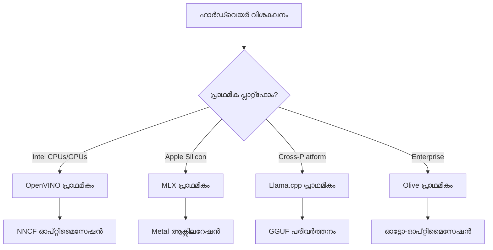
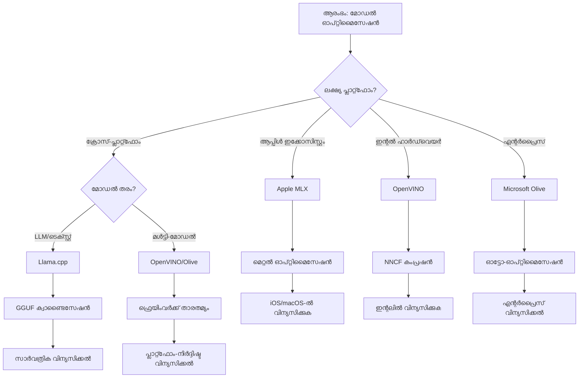
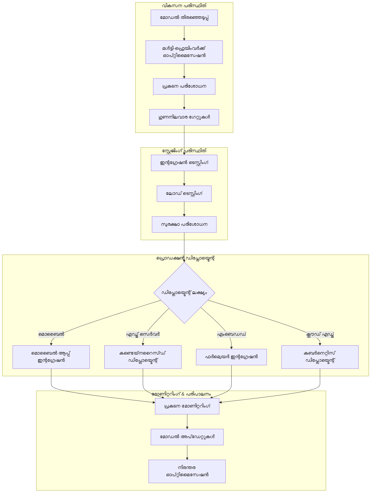

<!--
CO_OP_TRANSLATOR_METADATA:
{
  "original_hash": "6fbccc3e9d5911e3df32090724daac13",
  "translation_date": "2025-12-15T23:46:20+00:00",
  "source_file": "Module04/06.workflow-synthesis.md",
  "language_code": "ml"
}
-->
# Section 6: എഡ്ജ് AI വികസന പ്രവൃത്തി പ്രവാഹ സംയോജനം

## Table of Contents
1. [പരിചയം](../../../Module04)
2. [പഠന ലക്ഷ്യങ്ങൾ](../../../Module04)
3. [ഏകീകൃത പ്രവൃത്തി പ്രവാഹ അവലോകനം](../../../Module04)
4. [ഫ്രെയിംവർക്ക് തിരഞ്ഞെടുപ്പ് മാട്രിക്സ്](../../../Module04)
5. [മികച്ച പ്രാക്ടീസുകളുടെ സംയോജനം](../../../Module04)
6. [പ്രവർത്തന തന്ത്ര മാർഗ്ഗനിർദ്ദേശം](../../../Module04)
7. [പ്രകടന മെച്ചപ്പെടുത്തൽ പ്രവൃത്തി പ്രവാഹം](../../../Module04)
8. [ഉത്പാദന സജ്ജതാ ചെക്ക്ലിസ്റ്റ്](../../../Module04)
9. [പ്രശ്നപരിഹാരം மற்றும் നിരീക്ഷണം](../../../Module04)
10. [നിങ്ങളുടെ എഡ്ജ് AI പൈപ്പ്‌ലൈൻ ഭാവി-സുരക്ഷ](../../../Module04)

## പരിചയം

എഡ്ജ് AI വികസനം നിരവധി മെച്ചപ്പെടുത്തൽ ഫ്രെയിംവർക്കുകൾ, വിന്യാസ തന്ത്രങ്ങൾ, ഹാർഡ്‌വെയർ പരിഗണനകൾ എന്നിവയുടെ സങ്കീർണ്ണമായ മനസ്സിലാക്കലിനെ ആവശ്യപ്പെടുന്നു. Llama.cpp, Microsoft Olive, OpenVINO, Apple MLX എന്നിവയിൽ നിന്നുള്ള അറിവുകൾ സംയോജിപ്പിച്ച്, കാര്യക്ഷമത പരമാവധി ആക്കുകയും ഗുണനിലവാരം നിലനിർത്തുകയും വിജയകരമായ ഉത്പാദന വിന്യാസം ഉറപ്പാക്കുകയും ചെയ്യുന്ന ഏകീകൃത പ്രവൃത്തി പ്രവാഹം ഈ സമഗ്ര സംയോജനമാണ്.

ഈ കോഴ്സിൽ, ഓരോ മെച്ചപ്പെടുത്തൽ ഫ്രെയിംവർക്കും അതിന്റെ പ്രത്യേക ശക്തികളും പ്രത്യേക ഉപയോഗ കേസുകളും ഉള്ളതായി പരിശോധിച്ചിട്ടുണ്ട്. എന്നാൽ യഥാർത്ഥ എഡ്ജ് AI പ്രോജക്ടുകൾ പലപ്പോഴും പല ഫ്രെയിംവർക്കുകളിൽ നിന്നുള്ള സാങ്കേതിക വിദ്യകൾ സംയോജിപ്പിക്കേണ്ടതോ, പ്രത്യേക നിയന്ത്രണങ്ങൾക്കും ആവശ്യങ്ങൾക്കും ഏറ്റവും നല്ല ഫലങ്ങൾ നൽകുന്ന സമീപനം തിരഞ്ഞെടുക്കേണ്ടതോ ആവശ്യമുണ്ട്.

ഈ വിഭാഗം എല്ലാ ഫ്രെയിംവർക്കുകളിലെയും സമാഹൃത ജ്ഞാനം പ്രായോഗിക പ്രവൃത്തി പ്രവാഹങ്ങളായി, തീരുമാനമെടുക്കൽ മരങ്ങളായി, മികച്ച പ്രാക്ടീസുകളായി സംയോജിപ്പിക്കുന്നു, ഇത് നിങ്ങൾക്ക് ഉത്പാദന സജ്ജമായ എഡ്ജ് AI പരിഹാരങ്ങൾ കാര്യക്ഷമവും ഫലപ്രദവുമായ രീതിയിൽ നിർമ്മിക്കാൻ സഹായിക്കും. നിങ്ങൾ മൊബൈൽ ഉപകരണങ്ങൾക്കായി, എംബെഡഡ് സിസ്റ്റങ്ങൾക്കായി, എഡ്ജ് സർവറുകൾക്കായി മെച്ചപ്പെടുത്തുകയാണെങ്കിൽ, ഈ മാർഗ്ഗനിർദ്ദേശം വികസന ജീവിതചക്രം മുഴുവൻ ബോധപൂർവ്വമായ തീരുമാനങ്ങൾ എടുക്കാനുള്ള തന്ത്രപരമായ ഫ്രെയിംവർക്കാണ്.

## പഠന ലക്ഷ്യങ്ങൾ

ഈ വിഭാഗം അവസാനിക്കുമ്പോൾ, നിങ്ങൾക്ക് സാധിക്കുമെന്ന്:

### തന്ത്രപരമായ തീരുമാനമെടുക്കൽ
- പ്രോജക്ട് ആവശ്യങ്ങൾ, ഹാർഡ്‌വെയർ നിയന്ത്രണങ്ങൾ, വിന്യാസ സാഹചര്യങ്ങൾ അടിസ്ഥാനമാക്കി ഏറ്റവും അനുയോജ്യമായ മെച്ചപ്പെടുത്തൽ ഫ്രെയിംവർക്ക് വിലയിരുത്തുകയും തിരഞ്ഞെടുക്കുകയും ചെയ്യുക
- പരമാവധി കാര്യക്ഷമതയ്ക്കായി പല മെച്ചപ്പെടുത്തൽ സാങ്കേതിക വിദ്യകളും സംയോജിപ്പിക്കുന്ന സമഗ്ര പ്രവൃത്തി പ്രവാഹങ്ങൾ രൂപകൽപ്പന ചെയ്യുക
- വ്യത്യസ്ത ഫ്രെയിംവർക്കുകളിൽ മോഡൽ കൃത്യത, ഇൻഫറൻസ് വേഗം, മെമ്മറി ഉപയോഗം, വിന്യാസ സങ്കീർണ്ണത എന്നിവയുടെ ഇടയിൽ വ്യാപാര-ഓഫുകൾ വിലയിരുത്തുക

### പ്രവൃത്തി പ്രവാഹ സംയോജനം
- പല മെച്ചപ്പെടുത്തൽ ഫ്രെയിംവർക്കുകളുടെ ശക്തികൾ പ്രയോജനപ്പെടുത്തുന്ന ഏകീകൃത വികസന പൈപ്പ്‌ലൈൻകൾ നടപ്പിലാക്കുക
- വ്യത്യസ്ത പരിസ്ഥിതികളിൽ സ്ഥിരതയുള്ള മോഡൽ മെച്ചപ്പെടുത്തലിനും വിന്യാസത്തിനും പുനരുത്പാദനയോഗ്യമായ പ്രവൃത്തി പ്രവാഹങ്ങൾ സൃഷ്ടിക്കുക
- മെച്ചപ്പെടുത്തിയ മോഡലുകൾ ഉത്പാദന ആവശ്യകതകൾ പാലിക്കുന്നുണ്ടെന്ന് ഉറപ്പാക്കാൻ ഗുണനിലവാര ഗേറ്റുകളും സാധുതാ പ്രക്രിയകളും സ്ഥാപിക്കുക

### പ്രകടന മെച്ചപ്പെടുത്തൽ
- ക്വാണ്ടൈസേഷൻ, പ്രൂണിംഗ്, ഹാർഡ്‌വെയർ-നിർദ്ദിഷ്ട ആക്സിലറേഷൻ സാങ്കേതിക വിദ്യകൾ ഉപയോഗിച്ച് സിസ്റ്റമാറ്റിക് മെച്ചപ്പെടുത്തൽ തന്ത്രങ്ങൾ പ്രയോഗിക്കുക
- വ്യത്യസ്ത മെച്ചപ്പെടുത്തൽ നിലകളിലും വിന്യാസ ലക്ഷ്യങ്ങളിലും മോഡൽ പ്രകടനം നിരീക്ഷിക്കുകയും ബഞ്ച്മാർക്ക് ചെയ്യുകയും ചെയ്യുക
- CPU, GPU, NPU, പ്രത്യേക എഡ്ജ് ആക്സിലറേറ്ററുകൾ ഉൾപ്പെടെയുള്ള പ്രത്യേക ഹാർഡ്‌വെയർ പ്ലാറ്റ്‌ഫോമുകൾക്കായി മെച്ചപ്പെടുത്തുക

### ഉത്പാദന വിന്യാസം
- പല മോഡൽ ഫോർമാറ്റുകളെയും ഇൻഫറൻസ് എഞ്ചിനുകളെയും ഉൾക്കൊള്ളുന്ന സ്കെയിലബിൾ വിന്യാസ ആർക്കിടെക്ചറുകൾ രൂപകൽപ്പന ചെയ്യുക
- ഉത്പാദന പരിസ്ഥിതികളിൽ എഡ്ജ് AI ആപ്ലിക്കേഷനുകൾക്കായി നിരീക്ഷണവും ദൃശ്യവൽക്കരണവും നടപ്പിലാക്കുക
- മോഡൽ അപ്‌ഡേറ്റുകൾ, പ്രകടന നിരീക്ഷണം, സിസ്റ്റം മെച്ചപ്പെടുത്തലുകൾക്കായി പരിപാലന പ്രവൃത്തി പ്രവാഹങ്ങൾ സ്ഥാപിക്കുക

### ക്രോസ്-പ്ലാറ്റ്‌ഫോം മികവ്
- സ്ഥിരതയുള്ള പ്രകടനം നിലനിർത്തിക്കൊണ്ട് വ്യത്യസ്ത ഹാർഡ്‌വെയർ പ്ലാറ്റ്‌ഫോമുകളിൽ മെച്ചപ്പെടുത്തിയ മോഡലുകൾ വിന്യസിക്കുക
- Windows, macOS, Linux, മൊബൈൽ, എംബെഡഡ് സിസ്റ്റങ്ങൾ എന്നിവയ്ക്കുള്ള പ്ലാറ്റ്‌ഫോം-നിർദ്ദിഷ്ട മെച്ചപ്പെടുത്തലുകൾ കൈകാര്യം ചെയ്യുക
- വ്യത്യസ്ത എഡ്ജ് പരിസ്ഥിതികളിൽ സുതാര്യമായ വിന്യാസം സാധ്യമാക്കുന്ന അബ്സ്ട്രാക്ഷൻ ലെയറുകൾ സൃഷ്ടിക്കുക

## ഏകീകൃത പ്രവൃത്തി പ്രവാഹ അവലോകനം

### ഘട്ടം 1: ആവശ്യകതകൾ വിശകലനം, ഫ്രെയിംവർക്ക് തിരഞ്ഞെടുപ്പ്

വിജയകരമായ എഡ്ജ് AI വിന്യാസത്തിന് അടിസ്ഥാനമായത് വിശദമായ ആവശ്യകതകൾ വിശകലനമാണ്, ഇത് ഫ്രെയിംവർക്ക് തിരഞ്ഞെടുപ്പിനും മെച്ചപ്പെടുത്തൽ തന്ത്രത്തിനും മാർഗ്ഗനിർദ്ദേശം നൽകുന്നു.

#### 1.1 ഹാർഡ്‌വെയർ വിലയിരുത്തൽ

**പ്രധാന പരിഗണനകൾ:**
- **CPU ആർക്കിടെക്ചർ**: x86, ARM, Apple Silicon ശേഷികൾ
- **ആക്സിലറേറ്റർ ലഭ്യത**: GPU, NPU, VPU, പ്രത്യേക AI ചിപുകൾ
- **മെമ്മറി നിയന്ത്രണങ്ങൾ**: RAM പരിധികൾ, സംഭരണ ശേഷി
- **പവർ ബജറ്റ്**: ബാറ്ററി ആയുസ്സ്, താപ നിയന്ത്രണങ്ങൾ
- **കണക്ടിവിറ്റി**: ഓഫ്‌ലൈൻ ആവശ്യകതകൾ, ബാൻഡ്‌വിഡ്ത്ത് പരിധികൾ

#### 1.2 ആപ്ലിക്കേഷൻ ആവശ്യകത മാട്രിക്സ്

| ആവശ്യകത | Llama.cpp | Microsoft Olive | OpenVINO | Apple MLX |
|-------------|-----------|-----------------|----------|-----------|
| ക്രോസ്-പ്ലാറ്റ്‌ഫോം | ✅ മികച്ചത് | ⚡ നല്ലത് | ⚡ നല്ലത് | ❌ ആപ്പിൾ മാത്രം |
| എന്റർപ്രൈസ് ഇന്റഗ്രേഷൻ | ⚡ അടിസ്ഥാന | ✅ മികച്ചത് | ✅ മികച്ചത് | ⚡ പരിമിതം |
| മൊബൈൽ വിന്യാസം | ✅ മികച്ചത് | ⚡ നല്ലത് | ⚡ നല്ലത് | ✅ iOS മികച്ചത് |
| റിയൽ-ടൈം ഇൻഫറൻസ് | ✅ മികച്ചത് | ✅ മികച്ചത് | ✅ മികച്ചത് | ✅ മികച്ചത് |
| മോഡൽ വൈവിധ്യം | ✅ LLM കേന്ദ്രീകൃതം | ✅ എല്ലാ മോഡലുകളും | ✅ എല്ലാ മോഡലുകളും | ✅ LLM കേന്ദ്രീകൃതം |
| ഉപയോഗസൗകര്യം | ✅ ലളിതം | ✅ സ്വയം പ്രവർത്തനം | ⚡ മിതമായ | ✅ ലളിതം |

### ഘട്ടം 2: മോഡൽ തയ്യാറാക്കലും മെച്ചപ്പെടുത്തലും

#### 2.1 സർവത്ര മോഡൽ വിലയിരുത്തൽ പൈപ്പ്‌ലൈൻ

```python
# സർവത്ര മോഡൽ വിലയിരുത്തൽ ഘടന
class EdgeAIModelAssessment:
    def __init__(self, model_path, target_hardware):
        self.model_path = model_path
        self.target_hardware = target_hardware
        self.optimization_frameworks = []
        
    def assess_model_characteristics(self):
        """Analyze model size, architecture, and complexity"""
        return {
            'model_size': self.get_model_size(),
            'parameter_count': self.get_parameter_count(),
            'architecture_type': self.detect_architecture(),
            'quantization_compatibility': self.check_quantization_support()
        }
    
    def recommend_optimization_strategy(self):
        """Recommend optimal frameworks and techniques"""
        characteristics = self.assess_model_characteristics()
        
        if self.target_hardware.startswith('apple'):
            return self.mlx_optimization_strategy(characteristics)
        elif self.target_hardware.startswith('intel'):
            return self.openvino_optimization_strategy(characteristics)
        elif characteristics['model_size'] > 7_000_000_000:  # 7B+ പാരാമീറ്ററുകൾ
            return self.enterprise_optimization_strategy(characteristics)
        else:
            return self.lightweight_optimization_strategy(characteristics)
```

#### 2.2 ബഹു-ഫ്രെയിംവർക്ക് മെച്ചപ്പെടുത്തൽ പൈപ്പ്‌ലൈൻ

**ക്രമാനുസൃത മെച്ചപ്പെടുത്തൽ സമീപനം:**
1. **ആദ്യ പരിവർത്തനം**: ഇടനില ഫോർമാറ്റിലേക്ക് പരിവർത്തനം (സാധ്യമായപ്പോൾ ONNX)
2. **ഫ്രെയിംവർക്ക്-നിർദ്ദിഷ്ട മെച്ചപ്പെടുത്തൽ**: പ്രത്യേക സാങ്കേതിക വിദ്യകൾ പ്രയോഗിക്കുക
3. **ക്രോസ്-വാലിഡേഷൻ**: ലക്ഷ്യ പ്ലാറ്റ്‌ഫോമുകളിൽ പ്രകടനം പരിശോധിക്കുക
4. **അവസാന പാക്കേജിംഗ്**: വിന്യാസത്തിനായി തയ്യാറാക്കുക

```bash
# മൾട്ടി-ഫ്രെയിംവർക്ക് ഓപ്റ്റിമൈസേഷൻ സ്ക്രിപ്റ്റ്
#!/bin/bash

MODEL_NAME="phi-3-mini"
BASE_MODEL="microsoft/Phi-3-mini-4k-instruct"

# ഘട്ടം 1: ONNX പരിവർത്തനം (സാർവത്രികം)
python convert_to_onnx.py --model $BASE_MODEL --output models/onnx/

# ഘട്ടം 2: പ്ലാറ്റ്ഫോം-നിർദിഷ്ട ഓപ്റ്റിമൈസേഷൻ
if [[ "$TARGET_PLATFORM" == "intel" ]]; then
    # OpenVINO ഓപ്റ്റിമൈസേഷൻ
    python optimize_openvino.py --input models/onnx/ --output models/openvino/
elif [[ "$TARGET_PLATFORM" == "apple" ]]; then
    # MLX ഓപ്റ്റിമൈസേഷൻ
    python optimize_mlx.py --input $BASE_MODEL --output models/mlx/
elif [[ "$TARGET_PLATFORM" == "cross" ]]; then
    # Llama.cpp ഓപ്റ്റിമൈസേഷൻ
    python convert_to_gguf.py --input models/onnx/ --output models/gguf/
fi

# ഘട്ടം 3: സാധുത പരിശോധന
python validate_optimization.py --original $BASE_MODEL --optimized models/$TARGET_PLATFORM/
```

### ഘട്ടം 3: പ്രകടന സാധുതയും ബഞ്ച്മാർക്കിംഗും

#### 3.1 സമഗ്ര ബഞ്ച്മാർക്കിംഗ് ഫ്രെയിംവർക്ക്

```python
class EdgeAIBenchmark:
    def __init__(self, optimized_models):
        self.models = optimized_models
        self.metrics = {
            'inference_time': [],
            'memory_usage': [],
            'accuracy_score': [],
            'throughput': [],
            'energy_consumption': []
        }
    
    def run_comprehensive_benchmark(self):
        """Execute standardized benchmarks across all optimized models"""
        test_inputs = self.generate_test_inputs()
        
        for model_framework, model_path in self.models.items():
            print(f"Benchmarking {model_framework}...")
            
            # വൈകിയിരിപ്പ് പരിശോധന
            latency = self.measure_inference_latency(model_path, test_inputs)
            
            # മെമ്മറി പ്രൊഫൈലിംഗ്
            memory = self.profile_memory_usage(model_path)
            
            # കൃത്യത സ്ഥിരീകരണം
            accuracy = self.validate_model_accuracy(model_path, test_inputs)
            
            # ത്രൂപുട്ട് വിശകലനം
            throughput = self.measure_throughput(model_path)
            
            self.record_metrics(model_framework, latency, memory, accuracy, throughput)
    
    def generate_optimization_report(self):
        """Create comprehensive comparison report"""
        report = {
            'recommendations': self.analyze_performance_trade_offs(),
            'deployment_guidance': self.generate_deployment_recommendations(),
            'monitoring_requirements': self.define_monitoring_metrics()
        }
        return report
```

## ഫ്രെയിംവർക്ക് തിരഞ്ഞെടുപ്പ് മാട്രിക്സ്

### ഫ്രെയിംവർക്ക് തിരഞ്ഞെടുപ്പിനുള്ള തീരുമാനമരങ്ങൾ


### സമഗ്ര തിരഞ്ഞെടുപ്പ് മാനദണ്ഡങ്ങൾ

#### 1. പ്രാഥമിക ഉപയോഗകേസ് പൊരുത്തം

**വലിയ ഭാഷാ മോഡലുകൾ (LLMs):**
- **Llama.cpp**: CPU കേന്ദ്രീകൃതം, ക്രോസ്-പ്ലാറ്റ്‌ഫോം വിന്യാസത്തിന് മികച്ചത്
- **Apple MLX**: ആപ്പിൾ സിലിക്കണിനായി ഏകീകൃത മെമ്മറിയോടെ അനുയോജ്യം
- **OpenVINO**: NNCF മെച്ചപ്പെടുത്തലോടെ ഇൻറൽ ഹാർഡ്‌വെയറിന് മികച്ചത്
- **Microsoft Olive**: ഓട്ടോമേഷൻ ഉള്ള എന്റർപ്രൈസ് പ്രവൃത്തി പ്രവാഹങ്ങൾക്ക് അനുയോജ്യം

**ബഹുമുഖ മോഡലുകൾ:**
- **OpenVINO**: ദൃശ്യ, ശബ്ദ, ടെക്സ്റ്റ് എന്നിവയ്ക്ക് സമഗ്ര പിന്തുണ
- **Microsoft Olive**: സങ്കീർണ്ണ പൈപ്പ്‌ലൈൻകൾക്കുള്ള എന്റർപ്രൈസ്-ഗ്രേഡ് മെച്ചപ്പെടുത്തൽ
- **Llama.cpp**: ടെക്സ്റ്റ് അടിസ്ഥാനമാക്കിയ മോഡലുകൾക്ക് പരിമിതം
- **Apple MLX**: ബഹുമുഖ ആപ്ലിക്കേഷനുകൾക്കായി വളരുന്ന പിന്തുണ

#### 2. ഹാർഡ്‌വെയർ പ്ലാറ്റ്‌ഫോം മാട്രിക്സ്

| പ്ലാറ്റ്‌ഫോം | പ്രാഥമിക ഫ്രെയിംവർക്ക് | ദ്വിതീയ ഓപ്ഷൻ | പ്രത്യേക സവിശേഷതകൾ |
|----------|------------------|------------------|---------------------|
| ഇൻറൽ CPU/GPU | OpenVINO | Microsoft Olive | NNCF കംപ്രഷൻ, ഇൻറൽ മെച്ചപ്പെടുത്തൽ |
| NVIDIA GPU | Microsoft Olive | OpenVINO | CUDA ആക്സിലറേഷൻ, എന്റർപ്രൈസ് സവിശേഷതകൾ |
| ആപ്പിൾ സിലിക്കൺ | Apple MLX | Llama.cpp | മെറ്റൽ ഷേഡറുകൾ, ഏകീകൃത മെമ്മറി |
| ARM മൊബൈൽ | Llama.cpp | OpenVINO | ക്രോസ്-പ്ലാറ്റ്‌ഫോം, കുറഞ്ഞ ആശ്രിതത്വം |
| എഡ്ജ് TPU | OpenVINO | Microsoft Olive | പ്രത്യേക ആക്സിലറേറ്റർ പിന്തുണ |
| എംബെഡഡ് ARM | Llama.cpp | OpenVINO | കുറഞ്ഞ ഫുട്പ്രിന്റ്, കാര്യക്ഷമ ഇൻഫറൻസ് |

#### 3. വികസന പ്രവൃത്തി പ്രവാഹ മുൻഗണനകൾ

**വേഗത്തിലുള്ള പ്രോട്ടോടൈപ്പിംഗ്:**
1. **Llama.cpp**: ഏറ്റവും വേഗം സജ്ജീകരണം, ഉടൻ ഫലങ്ങൾ
2. **Apple MLX**: ലളിതമായ Python API, വേഗത്തിലുള്ള ആവർത്തനം
3. **Microsoft Olive**: സ്വയം പ്രവർത്തനം, കുറഞ്ഞ കോൺഫിഗറേഷൻ
4. **OpenVINO**: കൂടുതൽ സങ്കീർണ്ണമായ സജ്ജീകരണം, സമഗ്ര സവിശേഷതകൾ

**എന്റർപ്രൈസ് ഉത്പാദനം:**
1. **Microsoft Olive**: എന്റർപ്രൈസ് സവിശേഷതകൾ, Azure ഇന്റഗ്രേഷൻ
2. **OpenVINO**: ഇൻറൽ ഇക്കോസിസ്റ്റം, സമഗ്ര ഉപകരണങ്ങൾ
3. **Apple MLX**: ആപ്പിൾ-നിർദ്ദിഷ്ട എന്റർപ്രൈസ് ആപ്ലിക്കേഷനുകൾ
4. **Llama.cpp**: ലളിതമായ വിന്യാസം, പരിമിത എന്റർപ്രൈസ് സവിശേഷതകൾ

## മികച്ച പ്രാക്ടീസുകളുടെ സംയോജനം

### സർവത്ര മെച്ചപ്പെടുത്തൽ സിദ്ധാന്തങ്ങൾ

#### 1. പുരോഗമനാത്മക മെച്ചപ്പെടുത്തൽ തന്ത്രം

```python
class ProgressiveOptimization:
    def __init__(self, base_model):
        self.base_model = base_model
        self.optimization_stages = [
            'baseline_measurement',
            'format_conversion',
            'quantization_optimization',
            'hardware_acceleration',
            'production_validation'
        ]
    
    def execute_progressive_optimization(self):
        """Apply optimization techniques incrementally"""
        
        # ഘട്ടം 1: അടിസ്ഥാന അളവ്
        baseline_metrics = self.measure_baseline_performance()
        
        # ഘട്ടം 2: ഫോർമാറ്റ് പരിവർത്തനം
        converted_model = self.convert_to_optimal_format()
        conversion_metrics = self.measure_performance(converted_model)
        
        # ഘട്ടം 3: ക്വാണ്ടൈസേഷൻ
        quantized_model = self.apply_quantization(converted_model)
        quantization_metrics = self.measure_performance(quantized_model)
        
        # ഘട്ടം 4: ഹാർഡ്‌വെയർ വേഗത വർദ്ധന
        accelerated_model = self.enable_hardware_acceleration(quantized_model)
        acceleration_metrics = self.measure_performance(accelerated_model)
        
        # ഘട്ടം 5: സാധുത പരിശോധന
        production_ready = self.validate_for_production(accelerated_model)
        
        return self.compile_optimization_report(
            baseline_metrics, conversion_metrics, 
            quantization_metrics, acceleration_metrics
        )
```

#### 2. ഗുണനിലവാര ഗേറ്റ് നടപ്പാക്കൽ

**കൃത്യത സംരക്ഷണ ഗേറ്റുകൾ:**
- യഥാർത്ഥ മോഡൽ കൃത്യതയുടെ >95% നിലനിർത്തുക
- പ്രതിനിധി ടെസ്റ്റ് ഡാറ്റാസെറ്റുകൾക്കെതിരെ സാധുത പരിശോധിക്കുക
- ഉത്പാദന സാധുതയ്ക്കായി A/B ടെസ്റ്റിംഗ് നടപ്പാക്കുക

**പ്രകടന മെച്ചപ്പെടുത്തൽ ഗേറ്റുകൾ:**
- കുറഞ്ഞത് 2x വേഗം മെച്ചപ്പെടുത്തൽ നേടുക
- മെമ്മറി ഫുട്പ്രിന്റ് കുറഞ്ഞത് 50% കുറയ്ക്കുക
- ഇൻഫറൻസ് സമയ സ്ഥിരത സാധൂകരിക്കുക

**ഉത്പാദന സജ്ജതാ ഗേറ്റുകൾ:**
- ലോഡിൽ സ്ട്രെസ് ടെസ്റ്റിംഗ് കടന്നുപോകുക
- സമയത്തിനുള്ളിൽ സ്ഥിരതയുള്ള പ്രകടനം കാണിക്കുക
- സുരക്ഷയും സ്വകാര്യതാ ആവശ്യകതകളും സാധൂകരിക്കുക

### ഫ്രെയിംവർക്ക്-നിർദ്ദിഷ്ട മികച്ച പ്രാക്ടീസുകളുടെ സംയോജനം

#### 1. ക്വാണ്ടൈസേഷൻ തന്ത്ര സംയോജനം

```python
# ഏകീകൃത ക്വാണ്ടൈസേഷൻ സമീപനം
class UnifiedQuantizationStrategy:
    def __init__(self, model, target_platform):
        self.model = model
        self.platform = target_platform
        
    def select_optimal_quantization(self):
        """Choose best quantization based on platform and requirements"""
        
        if self.platform == 'apple_silicon':
            return self.mlx_quantization_strategy()
        elif self.platform == 'intel_hardware':
            return self.openvino_quantization_strategy()
        elif self.platform == 'cross_platform':
            return self.llamacpp_quantization_strategy()
        else:
            return self.olive_quantization_strategy()
    
    def mlx_quantization_strategy(self):
        """Apple MLX-specific quantization"""
        return {
            'method': 'mlx_quantize',
            'precision': 'int4',
            'group_size': 64,
            'optimization_target': 'unified_memory'
        }
    
    def openvino_quantization_strategy(self):
        """OpenVINO NNCF quantization"""
        return {
            'method': 'nncf_quantize',
            'precision': 'int8',
            'calibration_method': 'post_training',
            'optimization_target': 'intel_hardware'
        }
```

#### 2. ഹാർഡ്‌വെയർ ആക്സിലറേഷൻ മെച്ചപ്പെടുത്തൽ

**CPU മെച്ചപ്പെടുത്തൽ സംയോജനം:**
- **SIMD നിർദ്ദേശങ്ങൾ**: ഫ്രെയിംവർക്കുകൾക്കിടയിൽ മെച്ചപ്പെടുത്തിയ കർണലുകൾ പ്രയോജനപ്പെടുത്തുക
- **മെമ്മറി ബാൻഡ്‌വിഡ്ത്ത്**: കാഷെ കാര്യക്ഷമതയ്ക്കായി ഡാറ്റ ലേഔട്ടുകൾ മെച്ചപ്പെടുത്തുക
- **ത്രെഡിംഗ്**: വിഭജനം റിസോഴ്‌സ് നിയന്ത്രണങ്ങളുമായി ബാലൻസ് ചെയ്യുക

**GPU ആക്സിലറേഷൻ മികച്ച പ്രാക്ടീസുകൾ:**
- **ബാച്ച് പ്രോസസ്സിംഗ്**: അനുയോജ്യമായ ബാച്ച് വലുപ്പങ്ങളോടെ ത്രൂപുട്ട് പരമാവധി ആക്കുക
- **മെമ്മറി മാനേജ്മെന്റ്**: GPU മെമ്മറി അലോക്കേഷൻ, ട്രാൻസ്ഫറുകൾ മെച്ചപ്പെടുത്തുക
- **പ്രിസിഷൻ**: മികച്ച പ്രകടനത്തിനായി FP16 പിന്തുണ ഉപയോഗിക്കുക

**NPU/പ്രത്യേക ആക്സിലറേറ്റർ മെച്ചപ്പെടുത്തൽ:**
- **മോഡൽ ആർക്കിടെക്ചർ**: ആക്സിലറേറ്റർ ശേഷികളുമായി പൊരുത്തം ഉറപ്പാക്കുക
- **ഡാറ്റ ഫ്ലോ**: ആക്സിലറേറ്റർ കാര്യക്ഷമതയ്ക്കായി ഇൻപുട്ട്/ഔട്ട്പുട്ട് പൈപ്പ്‌ലൈൻ മെച്ചപ്പെടുത്തുക
- **ഫാൾബാക്ക് തന്ത്രങ്ങൾ**: പിന്തുണയില്ലാത്ത പ്രവർത്തനങ്ങൾക്ക് CPU ഫാൾബാക്ക് നടപ്പാക്കുക

## വിന്യാസ തന്ത്ര മാർഗ്ഗനിർദ്ദേശം

### സർവത്ര വിന്യാസ ആർക്കിടെക്ചർ


### പ്ലാറ്റ്‌ഫോം-നിർദ്ദിഷ്ട വിന്യാസ മാതൃകകൾ

#### 1. മൊബൈൽ വിന്യാസ തന്ത്രം

```yaml
# Mobile Deployment Configuration
mobile_deployment:
  ios:
    framework: apple_mlx
    optimization:
      quantization: int4
      memory_mapping: true
      background_execution: limited
    packaging:
      format: mlx
      bundle_size: <50MB
      
  android:
    framework: llama_cpp
    optimization:
      quantization: q4_k_m
      threading: android_optimized
      memory_management: conservative
    packaging:
      format: gguf
      apk_size: <100MB
      
  cross_platform:
    framework: onnx_runtime
    optimization:
      quantization: int8
      execution_provider: cpu
    packaging:
      format: onnx
      shared_libraries: minimal
```

#### 2. എഡ്ജ് സർവർ വിന്യാസം

```yaml
# Edge Server Deployment Configuration
edge_server:
  intel_based:
    framework: openvino
    optimization:
      quantization: int8
      acceleration: cpu_gpu_auto
      batch_processing: dynamic
    deployment:
      container: openvino_runtime
      orchestration: kubernetes
      scaling: horizontal
      
  nvidia_based:
    framework: microsoft_olive
    optimization:
      quantization: int4
      acceleration: cuda
      tensor_parallelism: true
    deployment:
      container: nvidia_triton
      orchestration: kubernetes
      scaling: gpu_aware
```

### കണ്ടെയ്‌നറൈസേഷൻ മികച്ച പ്രാക്ടീസുകൾ

```dockerfile
# Multi-Framework Edge AI Container
FROM ubuntu:22.04 as base

# Install common dependencies
RUN apt-get update && apt-get install -y \
    python3 \
    python3-pip \
    build-essential \
    cmake \
    && rm -rf /var/lib/apt/lists/*

# Framework-specific stages
FROM base as openvino
RUN pip install openvino nncf optimum[intel]

FROM base as llamacpp
RUN git clone https://github.com/ggerganov/llama.cpp.git \
    && cd llama.cpp && make LLAMA_OPENBLAS=1

FROM base as olive
RUN pip install olive-ai[auto-opt] onnxruntime-genai

# Production stage with selected framework
FROM openvino as production
COPY models/ /app/models/
COPY src/ /app/src/
WORKDIR /app

EXPOSE 8080
CMD ["python3", "src/inference_server.py"]
```

## പ്രകടന മെച്ചപ്പെടുത്തൽ പ്രവൃത്തി പ്രവാഹം

### സിസ്റ്റമാറ്റിക് പ്രകടന ട്യൂണിംഗ്

#### 1. പ്രകടന പ്രൊഫൈലിംഗ് പൈപ്പ്‌ലൈൻ

```python
class EdgeAIPerformanceProfiler:
    def __init__(self, model_path, framework):
        self.model_path = model_path
        self.framework = framework
        self.profiling_results = {}
    
    def comprehensive_profiling(self):
        """Execute comprehensive performance analysis"""
        
        # CPU പ്രൊഫൈലിംഗ്
        cpu_profile = self.profile_cpu_usage()
        
        # മെമ്മറി പ്രൊഫൈലിംഗ്
        memory_profile = self.profile_memory_usage()
        
        # ഇൻഫറൻസ് ലാറ്റൻസി
        latency_profile = self.profile_inference_latency()
        
        # ത്രൂപുട്ട് വിശകലനം
        throughput_profile = self.profile_throughput()
        
        # ഊർജ്ജ ഉപഭോഗം (ലഭ്യമായിടത്ത്)
        energy_profile = self.profile_energy_consumption()
        
        return self.compile_performance_report(
            cpu_profile, memory_profile, latency_profile,
            throughput_profile, energy_profile
        )
    
    def identify_bottlenecks(self):
        """Automatically identify performance bottlenecks"""
        bottlenecks = []
        
        if self.profiling_results['cpu_utilization'] > 80:
            bottlenecks.append('cpu_bound')
        
        if self.profiling_results['memory_usage'] > 90:
            bottlenecks.append('memory_bound')
        
        if self.profiling_results['inference_variance'] > 20:
            bottlenecks.append('inconsistent_performance')
        
        return self.generate_optimization_recommendations(bottlenecks)
```

#### 2. സ്വയം പ്രവർത്തിക്കുന്ന മെച്ചപ്പെടുത്തൽ പൈപ്പ്‌ലൈൻ

```python
class AutomatedOptimizationPipeline:
    def __init__(self, base_model, target_constraints):
        self.base_model = base_model
        self.constraints = target_constraints
        self.optimization_history = []
    
    def execute_optimization_search(self):
        """Systematically search optimization space"""
        
        optimization_candidates = [
            {'quantization': 'int8', 'pruning': 0.1},
            {'quantization': 'int4', 'pruning': 0.2},
            {'quantization': 'int8', 'acceleration': 'gpu'},
            {'quantization': 'int4', 'acceleration': 'npu'}
        ]
        
        best_configuration = None
        best_score = 0
        
        for config in optimization_candidates:
            optimized_model = self.apply_optimization(config)
            score = self.evaluate_optimization(optimized_model)
            
            if score > best_score and self.meets_constraints(optimized_model):
                best_score = score
                best_configuration = config
            
            self.optimization_history.append({
                'config': config,
                'score': score,
                'model': optimized_model
            })
        
        return best_configuration, self.optimization_history
```

### ബഹു-ലക്ഷ്യ മെച്ചപ്പെടുത്തൽ

#### 1. എഡ്ജ് AI-ക്കുള്ള പാരറ്റോ മെച്ചപ്പെടുത്തൽ

```python
class ParetoOptimization:
    def __init__(self, objectives=['speed', 'accuracy', 'memory']):
        self.objectives = objectives
        self.pareto_frontier = []
    
    def find_pareto_optimal_solutions(self, optimization_results):
        """Identify Pareto-optimal configurations"""
        
        for result in optimization_results:
            is_dominated = False
            
            for frontier_point in self.pareto_frontier:
                if self.dominates(frontier_point, result):
                    is_dominated = True
                    break
            
            if not is_dominated:
                # ഫ്രണ്ടിയറിൽ നിന്ന് ആധിപത്യമുള്ള പോയിന്റുകൾ നീക്കം ചെയ്യുക
                self.pareto_frontier = [
                    point for point in self.pareto_frontier 
                    if not self.dominates(result, point)
                ]
                
                self.pareto_frontier.append(result)
        
        return self.pareto_frontier
    
    def recommend_configuration(self, user_preferences):
        """Recommend configuration based on user preferences"""
        
        weighted_scores = []
        for config in self.pareto_frontier:
            score = sum(
                user_preferences[obj] * config['metrics'][obj] 
                for obj in self.objectives
            )
            weighted_scores.append((score, config))
        
        return max(weighted_scores, key=lambda x: x[0])[1]
```

## ഉത്പാദന സജ്ജതാ ചെക്ക്ലിസ്റ്റ്

### സമഗ്ര ഉത്പാദന സാധുത

#### 1. മോഡൽ ഗുണനിലവാര ഉറപ്പ്

```python
class ProductionReadinessValidator:
    def __init__(self, optimized_model, production_requirements):
        self.model = optimized_model
        self.requirements = production_requirements
        self.validation_results = {}
    
    def validate_model_quality(self):
        """Comprehensive model quality validation"""
        
        # കൃത്യതാ പരിശോധന
        accuracy_result = self.validate_accuracy()
        
        # പ്രകടന പരിശോധന
        performance_result = self.validate_performance()
        
        # ദൃഢതാ പരിശോധന
        robustness_result = self.validate_robustness()
        
        # സുരക്ഷാ വിലയിരുത്തൽ
        security_result = self.validate_security()
        
        # അനുസരണ പരിശോധന
        compliance_result = self.validate_compliance()
        
        return self.compile_validation_report(
            accuracy_result, performance_result, robustness_result,
            security_result, compliance_result
        )
    
    def generate_certification_report(self):
        """Generate production certification report"""
        return {
            'model_signature': self.generate_model_signature(),
            'validation_timestamp': datetime.now(),
            'validation_results': self.validation_results,
            'deployment_approval': self.check_deployment_approval(),
            'monitoring_requirements': self.define_monitoring_requirements()
        }
```

#### 2. ഉത്പാദന വിന്യാസ ചെക്ക്ലിസ്റ്റ്

**വിന്യാസത്തിന് മുമ്പുള്ള സാധുത:**
- [ ] മോഡൽ കൃത്യത കുറഞ്ഞത് >95% അടിസ്ഥാനത്തിന്
- [ ] പ്രകടന ലക്ഷ്യങ്ങൾ (ലേറ്റൻസി, ത്രൂപുട്ട്, മെമ്മറി) കൈവരിച്ചത്
- [ ] സുരക്ഷാ ദുർബലതകൾ വിലയിരുത്തി പരിഹരിച്ചു
- [ ] പ്രതീക്ഷിച്ച ലോഡിൽ സ്ട്രെസ് ടെസ്റ്റിംഗ് പൂർത്തിയായി
- [ ] പരാജയ സാഹചര്യങ്ങൾ പരീക്ഷിച്ചു, പുനരുദ്ധാരണ നടപടികൾ സാധൂകരിച്ചു
- [ ] നിരീക്ഷണവും അലർട്ടിംഗും സജ്ജീകരിച്ചു
- [ ] റോള്ബാക്ക് നടപടികൾ പരീക്ഷിച്ചു, രേഖപ്പെടുത്തി

**വിന്യാസ പ്രക്രിയ:**
- [ ] ബ്ലൂ-ഗ്രീൻ വിന്യാസ തന്ത്രം നടപ്പിലാക്കി
- [ ] ഗതാഗതം ക്രമാതീതമായി വർദ്ധിപ്പിക്കാൻ ക്രമീകരിച്ചു
- [ ] റിയൽ-ടൈം നിരീക്ഷണ ഡാഷ്ബോർഡുകൾ സജീവം
- [ ] പ്രകടന അടിസ്ഥാനരേഖകൾ സ്ഥാപിച്ചു
- [ ] പിശക് നിരക്ക് പരിധികൾ നിർവ്വചിച്ചു
- [ ] സ്വയം പ്രവർത്തിക്കുന്ന റോള്ബാക്ക് ട്രിഗറുകൾ ക്രമീകരിച്ചു

**വിന്യാസാനന്തര നിരീക്ഷണം:**
- [ ] മോഡൽ ഡ്രിഫ്റ്റ് കണ്ടെത്തൽ സജീവം
- [ ] പ്രകടന കുറവ് അലർട്ടുകൾ ക്രമീകരിച്ചു
- [ ] റിസോഴ്‌സ് ഉപയോഗ നിരീക്ഷണം സജ്ജമാക്കി
- [ ] ഉപയോക്തൃ അനുഭവ മെട്രിക്‌സ് ട്രാക്ക് ചെയ്യുന്നു
- [ ] മോഡൽ വേർഷനിംഗ്, ലിനിയേജ് പരിപാലിക്കുന്നു
- [ ] സ്ഥിരം മോഡൽ പ്രകടന അവലോകനങ്ങൾ ഷെഡ്യൂൾ ചെയ്തു

### തുടർച്ചയായ ഇന്റഗ്രേഷൻ/തുടർച്ചയായ വിന്യാസം (CI/CD)

```yaml
# Edge AI CI/CD Pipeline Configuration
edge_ai_pipeline:
  stages:
    - model_validation
    - optimization
    - testing
    - staging_deployment
    - production_deployment
    - monitoring
  
  model_validation:
    accuracy_threshold: 0.95
    performance_baseline: required
    security_scan: enabled
    
  optimization:
    frameworks:
      - llama_cpp
      - openvino
      - microsoft_olive
    validation:
      cross_validation: enabled
      performance_comparison: required
      
  testing:
    unit_tests: comprehensive
    integration_tests: full_pipeline
    load_tests: production_scale
    security_tests: comprehensive
    
  deployment:
    strategy: blue_green
    traffic_ramping: gradual
    rollback: automatic
    monitoring: real_time
```

## പ്രശ്നപരിഹാരം மற்றும் നിരീക്ഷണം

### സർവത്ര പ്രശ്നപരിഹാര ഫ്രെയിംവർക്ക്

#### 1. സാധാരണ പ്രശ്നങ്ങളും പരിഹാരങ്ങളും

**പ്രകടന പ്രശ്നങ്ങൾ:**
```python
class PerformanceTroubleshooter:
    def __init__(self, model_metrics):
        self.metrics = model_metrics
        
    def diagnose_performance_issues(self):
        """Systematic performance issue diagnosis"""
        
        issues = []
        
        # ഉയർന്ന വൈകിയുള്ള രോഗനിർണയം
        if self.metrics['avg_latency'] > self.metrics['target_latency']:
            issues.append(self.diagnose_latency_issues())
        
        # മെമ്മറി ഉപയോഗം രോഗനിർണയം
        if self.metrics['memory_usage'] > self.metrics['memory_limit']:
            issues.append(self.diagnose_memory_issues())
        
        # ത്രൂപുട്ട് രോഗനിർണയം
        if self.metrics['throughput'] < self.metrics['target_throughput']:
            issues.append(self.diagnose_throughput_issues())
        
        return self.generate_resolution_plan(issues)
    
    def diagnose_latency_issues(self):
        """Specific latency troubleshooting"""
        potential_causes = []
        
        if self.metrics['cpu_utilization'] > 80:
            potential_causes.append('cpu_bottleneck')
        
        if self.metrics['memory_bandwidth'] > 90:
            potential_causes.append('memory_bandwidth_limit')
        
        if self.metrics['model_size'] > self.metrics['optimal_size']:
            potential_causes.append('model_too_large')
        
        return {
            'issue': 'high_latency',
            'causes': potential_causes,
            'solutions': self.generate_latency_solutions(potential_causes)
        }
```

**ഫ്രെയിംവർക്ക്-നിർദ്ദിഷ്ട പ്രശ്നപരിഹാരം:**

| പ്രശ്നം | Llama.cpp | Microsoft Olive | OpenVINO | Apple MLX |
|-------|-----------|-----------------|----------|-----------|
| മെമ്മറി പ്രശ്നങ്ങൾ | കോൺടെക്സ്റ്റ് നീളം കുറയ്ക്കുക | ബാച്ച് വലുപ്പം കുറയ്ക്കുക | കാഷിംഗ് സജീവമാക്കുക | മെമ്മറി മാപ്പിംഗ് ഉപയോഗിക്കുക |
| മന്ദഗതിയിലുള്ള ഇൻഫറൻസ് | SIMD സജീവമാക്കുക | ക്വാണ്ടൈസേഷൻ പരിശോധിക്കുക | ത്രെഡിംഗ് മെച്ചപ്പെടുത്തുക | മെറ്റൽ സജീവമാക്കുക |
| കൃത്യത നഷ്ടം | ഉയർന്ന ക്വാണ്ടൈസേഷൻ | QAT ഉപയോഗിച്ച് പുന:പരിശീലനം | കലിബ്രേഷൻ വർദ്ധിപ്പിക്കുക | പോസ്റ്റ്-ക്വാണ്ടൈസേഷൻ ഫൈൻ-ട്യൂൺ ചെയ്യുക |
| പൊരുത്തക്കേട് | മോഡൽ ഫോർമാറ്റ് പരിശോധിക്കുക | ഫ്രെയിംവർക്ക് പതിപ്പ് പരിശോധിക്കുക | ഡ്രൈവർ അപ്ഡേറ്റ് ചെയ്യുക | macOS പതിപ്പ് പരിശോധിക്കുക |

#### 2. ഉത്പാദന നിരീക്ഷണ തന്ത്രം

```python
class EdgeAIMonitoring:
    def __init__(self, deployment_config):
        self.config = deployment_config
        self.metrics_collectors = []
        self.alerting_rules = []
    
    def setup_comprehensive_monitoring(self):
        """Configure comprehensive monitoring for Edge AI deployment"""
        
        # മോഡൽ പ്രകടന നിരീക്ഷണം
        self.setup_model_performance_monitoring()
        
        # അടിസ്ഥാനസൗകര്യ നിരീക്ഷണം
        self.setup_infrastructure_monitoring()
        
        # ബിസിനസ് മെട്രിക്‌സ് നിരീക്ഷണം
        self.setup_business_metrics_monitoring()
        
        # സുരക്ഷാ നിരീക്ഷണം
        self.setup_security_monitoring()
    
    def setup_model_performance_monitoring(self):
        """Model-specific performance monitoring"""
        metrics = [
            'inference_latency_p50',
            'inference_latency_p95',
            'inference_latency_p99',
            'model_accuracy_drift',
            'prediction_confidence_distribution',
            'error_rate',
            'throughput_requests_per_second'
        ]
        
        for metric in metrics:
            self.add_metric_collector(metric)
            self.add_alerting_rule(metric)
    
    def detect_model_drift(self):
        """Automated model drift detection"""
        drift_indicators = [
            self.statistical_drift_detection(),
            self.performance_drift_detection(),
            self.data_distribution_shift_detection()
        ]
        
        return self.aggregate_drift_signals(drift_indicators)
```

### സ്വയം പ്രവർത്തിക്കുന്ന പ്രശ്ന പരിഹാരം

```python
class AutomatedIssueResolution:
    def __init__(self, monitoring_system):
        self.monitoring = monitoring_system
        self.resolution_strategies = {}
    
    def handle_performance_degradation(self, alert):
        """Automated performance issue resolution"""
        
        if alert['type'] == 'high_latency':
            return self.resolve_latency_issue(alert)
        elif alert['type'] == 'high_memory_usage':
            return self.resolve_memory_issue(alert)
        elif alert['type'] == 'accuracy_drift':
            return self.resolve_accuracy_issue(alert)
        
    def resolve_latency_issue(self, alert):
        """Automated latency issue resolution"""
        resolution_steps = [
            'increase_cpu_allocation',
            'enable_model_caching',
            'reduce_batch_size',
            'switch_to_quantized_model'
        ]
        
        for step in resolution_steps:
            if self.apply_resolution_step(step):
                return f"Resolved latency issue with: {step}"
        
        return "Escalating to human operator"
```

## നിങ്ങളുടെ എഡ്ജ് AI പൈപ്പ്‌ലൈൻ ഭാവി-സുരക്ഷ

### ഉയർന്ന സാങ്കേതികവിദ്യകളുടെ സംയോജനം

#### 1. അടുത്ത തലമുറ ഹാർഡ്‌വെയർ പിന്തുണ

```python
class FutureHardwareIntegration:
    def __init__(self):
        self.supported_accelerators = [
            'npu_next_gen',
            'quantum_processors',
            'neuromorphic_chips',
            'optical_processors'
        ]
    
    def design_adaptive_pipeline(self):
        """Create hardware-agnostic optimization pipeline"""
        
        pipeline = {
            'model_preparation': self.universal_model_preparation(),
            'hardware_detection': self.dynamic_hardware_detection(),
            'optimization_selection': self.adaptive_optimization_selection(),
            'performance_validation': self.hardware_agnostic_validation()
        }
        
        return pipeline
    
    def adaptive_optimization_selection(self):
        """Dynamically select optimization based on available hardware"""
        
        def optimize_for_hardware(model, available_hardware):
            if 'npu' in available_hardware:
                return self.npu_optimization(model)
            elif 'quantum' in available_hardware:
                return self.quantum_optimization(model)
            elif 'neuromorphic' in available_hardware:
                return self.neuromorphic_optimization(model)
            else:
                return self.fallback_optimization(model)
        
        return optimize_for_hardware
```

#### 2. മോഡൽ ആർക്കിടെക്ചർ പരിണാമം

**ഉയർന്ന സാങ്കേതിക ആർക്കിടെക്ചറുകൾക്കുള്ള പിന്തുണ:**
- **മിശ്ര വിദഗ്ധർ (MoE)**: കാര്യക്ഷമതയ്ക്കായി സ്പാർസ് മോഡൽ ആർക്കിടെക്ചറുകൾ
- **റിട്രീവൽ-ഓഗ്മെന്റഡ് ജനറേഷൻ**: ഹൈബ്രിഡ് മോഡൽ + നോളജ് ബേസ് സിസ്റ്റങ്ങൾ
- **ബഹുമുഖ മോഡലുകൾ**: ദൃശ്യ + ഭാഷ + ശബ്ദ സംയോജനം
- **ഫെഡറേറ്റഡ് ലേണിംഗ്**: വിതരണ പരിശീലനവും മെച്ചപ്പെടുത്തലും

```python
class NextGenModelSupport:
    def __init__(self):
        self.architecture_handlers = {
            'moe': self.handle_mixture_of_experts,
            'rag': self.handle_retrieval_augmented,
            'multimodal': self.handle_multimodal,
            'federated': self.handle_federated_learning
        }
    
    def handle_mixture_of_experts(self, model):
        """Optimize Mixture of Experts models for edge deployment"""
        optimization_strategy = {
            'expert_pruning': True,
            'routing_optimization': True,
            'expert_quantization': 'per_expert',
            'load_balancing': 'dynamic'
        }
        return self.apply_moe_optimization(model, optimization_strategy)
```

### തുടർച്ചയായ പഠനവും അനുയോജ്യമായ മാറ്റങ്ങളും

#### 1. ഓൺലൈൻ പഠന സംയോജനം

```python
class EdgeOnlineLearning:
    def __init__(self, base_model, learning_rate=0.001):
        self.base_model = base_model
        self.learning_rate = learning_rate
        self.adaptation_buffer = []
    
    def continuous_adaptation(self, new_data, feedback):
        """Continuously adapt model based on edge data"""
        
        # സ്വകാര്യത സംരക്ഷിക്കുന്ന പ്രാദേശിക അനുയോജനം
        local_updates = self.compute_local_gradients(new_data, feedback)
        
        # നിയന്ത്രണങ്ങളോടെ അപ്ഡേറ്റുകൾ പ്രയോഗിക്കുക
        adapted_model = self.apply_constrained_updates(
            self.base_model, local_updates
        )
        
        # അനുയോജനത്തിന്റെ ഗുണമേന്മ പരിശോധിക്കുക
        if self.validate_adaptation(adapted_model):
            self.base_model = adapted_model
            return True
        
        return False
    
    def federated_learning_participation(self):
        """Participate in federated learning while preserving privacy"""
        
        # പ്രാദേശിക മോഡൽ അപ്ഡേറ്റുകൾ കണക്കാക്കുക
        local_updates = self.compute_private_updates()
        
        # വ്യത്യാസപരമായ സ്വകാര്യത സംരക്ഷണം
        private_updates = self.apply_differential_privacy(local_updates)
        
        # ഫെഡറേറ്റഡ് ലേണിംഗ് കോർഡിനേറ്ററുമായി പങ്കിടുക
        return self.share_updates(private_updates)
```

#### 2. സുസ്ഥിരതയും ഗ്രീൻ AIയും

```python
class GreenEdgeAI:
    def __init__(self, sustainability_targets):
        self.targets = sustainability_targets
        self.energy_monitor = EnergyMonitor()
    
    def optimize_for_sustainability(self, model):
        """Optimize model for minimal environmental impact"""
        
        optimization_objectives = [
            'minimize_energy_consumption',
            'maximize_hardware_utilization',
            'reduce_model_training_cost',
            'extend_device_lifetime'
        ]
        
        return self.multi_objective_green_optimization(
            model, optimization_objectives
        )
    
    def carbon_aware_deployment(self):
        """Deploy models considering carbon footprint"""
        
        deployment_strategy = {
            'prefer_renewable_energy_regions': True,
            'optimize_for_energy_efficiency': True,
            'minimize_data_transfer': True,
            'lifecycle_carbon_accounting': True
        }
        
        return deployment_strategy
```

## സമാപനം

ഈ സമഗ്ര പ്രവൃത്തി പ്രവാഹ സംയോജനം എഡ്ജ് AI മെച്ചപ്പെടുത്തൽ അറിവിന്റെ സമാഹാരമാണ്, എല്ലാ പ്രധാന മെച്ചപ്പെടുത്തൽ ഫ്രെയിംവർക്കുകളിലെയും മികച്ച പ്രാക്ടീസുകൾ ഏകീകൃത ഉത്പാദന-സജ്ജ സമീപനത്തിലേക്ക് കൊണ്ടുവരുന്നു. ഈ മാർഗ്ഗനിർദ്ദേശങ്ങൾ പാലിച്ചാൽ, നിങ്ങൾക്ക് സാധിക്കും:

**പരമാവധി പ്രകടനം നേടുക**: സിസ്റ്റമാറ്റിക് ഫ്രെയിംവർക്ക് തിരഞ്ഞെടുപ്പ്, പുരോഗമനാത്മക മെച്ചപ്പെടുത്തൽ, സമഗ്ര സാധുത എന്നിവ വഴി നിങ്ങളുടെ എഡ്ജ് AI ആപ്ലിക്കേഷനുകൾ പരമാവധി കാര്യക്ഷമത നൽകും.

**ഉത്പാദന സജ്ജത ഉറപ്പാക്കുക**: വിശകലനപരമായ പരിശോധന, നിരീക്ഷണം, ഗുണനിലവാര ഗേറ്റുകൾ എന്നിവയിലൂടെ യഥാർത്ഥ ലോക പരിസ്ഥിതികളിൽ വിശ്വസനീയമായ വിന്യാസവും പ്രവർത്തനവും ഉറപ്പാക്കുക.

**ദീർഘകാല വിജയവും നിലനിർത്തുക**: തുടർച്ചയായ നിരീക്ഷണം, സ്വയം പ്രവർത്തിക്കുന്ന പ്രശ്ന പരിഹാരം, അനുയോജ്യമായ മാറ്റ തന്ത്രങ്ങൾ വഴി നിങ്ങളുടെ എഡ്ജ് AI പരിഹാരങ്ങൾ പ്രകടനക്ഷമവും പ്രസക്തവുമായ നിലയിൽ നിലനിർത്തുക.

**നിങ്ങളുടെ നിക്ഷേപം ഭാവി-സുരക്ഷിതമാക്കുക**: ഉയർന്ന സാങ്കേതികവിദ്യകളും ആവശ്യകതകളും അനുസരിച്ച് വികസിക്കാവുന്ന, ഹാർഡ്‌വെയർ-അഗ്നോസ്റ്റിക് പൈപ്പ്‌ലൈൻകൾ രൂപകൽപ്പന ചെയ്യുക.

എഡ്ജ് AI രംഗം വേഗത്തിൽ വികസിക്കുന്നു, പുതിയ ഹാർഡ്‌വെയർ പ്ലാറ്റ്‌ഫോമുകൾ, മെച്ചപ്പെടുത്തൽ സാങ്കേതിക വിദ്യകൾ, വിന്യാസ തന്ത്രങ്ങൾ നിരന്തരം ഉദയം ചെയ്യുന്നു. ഈ സംയോജനം ഈ സങ്കീർണ്ണത നയിക്കുന്നതിനുള്ള അടിസ്ഥാനമാണ്, ശക്തമായ, കാര്യക്ഷമമായ, പരിപാലനയോഗ്യമായ എഡ്ജ് AI പരിഹാരങ്ങൾ നിർമ്മിച്ച് യഥാർത്ഥ മൂല്യം ഉത്പാദിപ്പിക്കാൻ സഹായിക്കുന്നു.
നിങ്ങളുടെ പ്രത്യേക ആവശ്യകതകൾ പൂർണ്ണമാക്കുകയും ആ ആവശ്യകതകൾ വികസിക്കുന്നതനുസരിച്ച് അനുയോജ്യമായ മാറ്റങ്ങൾ വരുത്താനുള്ള സൗകര്യം നിലനിർത്തുകയും ചെയ്യുന്ന ഏറ്റവും മികച്ച ഓപ്റ്റിമൈസേഷൻ തന്ത്രമാണ് ഓർമ്മിക്കേണ്ടത്. വിവരസമ്പന്നമായ തീരുമാനങ്ങൾ എടുക്കുന്നതിനുള്ള ഒരു ഘടനയായി ഈ ഗൈഡ് ഉപയോഗിക്കുക, എന്നാൽ നിങ്ങളുടെ തിരഞ്ഞെടുപ്പുകൾ എപ്പോഴും പ്രായോഗിക പരിശോധനയുടെയും യാഥാർത്ഥ്യ ലോക വിന്യാസാനുഭവത്തിന്റെയും മുഖാന്തിരം സ്ഥിരീകരിക്കുക.

## ➡️ അടുത്തത് എന്താണ്

- [07: Qualcomm QNN Framework Deep Dive](./07.QualcommQNN.md)

---

<!-- CO-OP TRANSLATOR DISCLAIMER START -->
**അസൂയാപത്രം**:  
ഈ രേഖ AI വിവർത്തന സേവനം [Co-op Translator](https://github.com/Azure/co-op-translator) ഉപയോഗിച്ച് വിവർത്തനം ചെയ്തതാണ്. നാം കൃത്യതയ്ക്ക് ശ്രമിച്ചിട്ടുണ്ടെങ്കിലും, സ്വയം പ്രവർത്തിക്കുന്ന വിവർത്തനങ്ങളിൽ പിശകുകൾ അല്ലെങ്കിൽ തെറ്റുകൾ ഉണ്ടാകാമെന്ന് ദയവായി ശ്രദ്ധിക്കുക. അതിന്റെ മാതൃഭാഷയിലുള്ള യഥാർത്ഥ രേഖ അധികാരപരമായ ഉറവിടമായി കണക്കാക്കപ്പെടണം. നിർണായക വിവരങ്ങൾക്ക്, പ്രൊഫഷണൽ മനുഷ്യ വിവർത്തനം ശുപാർശ ചെയ്യപ്പെടുന്നു. ഈ വിവർത്തനം ഉപയോഗിക്കുന്നതിൽ നിന്നുണ്ടാകുന്ന ഏതെങ്കിലും തെറ്റിദ്ധാരണകൾക്കോ തെറ്റായ വ്യാഖ്യാനങ്ങൾക്കോ ഞങ്ങൾ ഉത്തരവാദികളല്ല.
<!-- CO-OP TRANSLATOR DISCLAIMER END -->