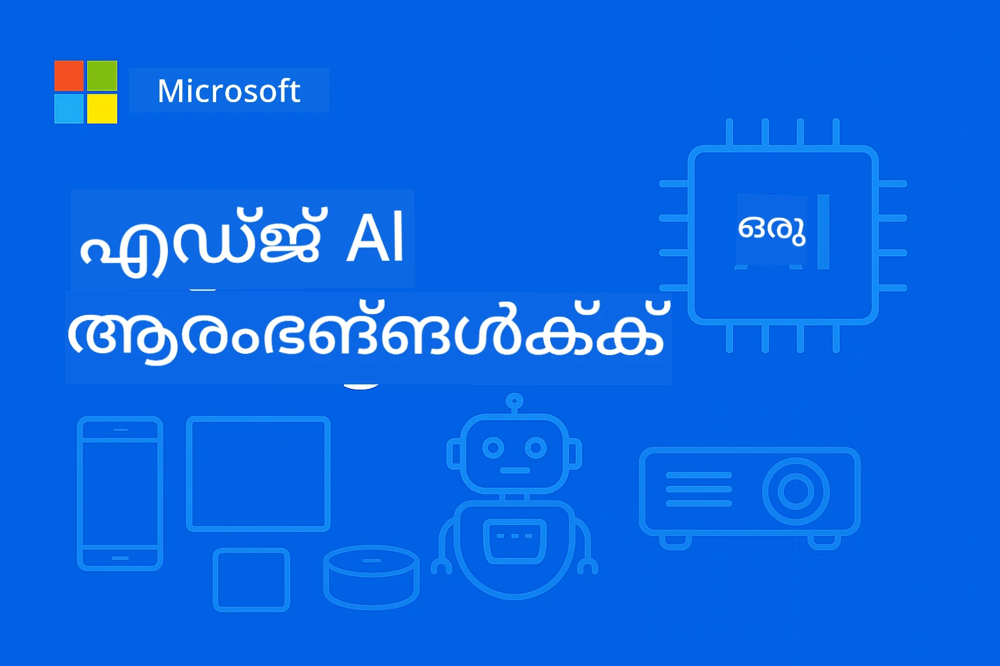

# എഡ്ജ്‌എഐ പുതിയവര്‍ക്കുമായി




[](https://GitHub.com/microsoft/edgeai-for-beginners/graphs/contributors)
[](https://GitHub.com/microsoft/edgeai-for-beginners/issues)
[](https://GitHub.com/microsoft/edgeai-for-beginners/pulls)
[](http://makeapullrequest.com)

[](https://GitHub.com/microsoft/edgeai-for-beginners/watchers)
[](https://GitHub.com/microsoft/edgeai-for-beginners/fork)
[](https://GitHub.com/microsoft/edgeai-for-beginners/stargazers)


[](https://discord.gg/nTYy5BXMWG)

ഈ സ്രോതസ്സുകള്‍ ഉപയോഗിച്ച് ആരംഭിക്കാന്‍ ഈ ഘട്ടങ്ങള്‍ പിന്തുടരുക:

1. **റിപ്പോസിറ്ററി ഫോർക്കുചെയ്യുക**: ക്ലിക്ക് ചെയ്യുക [](https://GitHub.com/microsoft/edgeai-for-beginners/fork)
2. **റിപ്പോസിറ്ററി ക്ലേൺ ചെയ്യുക**:   `git clone https://github.com/microsoft/edgeai-for-beginners.git`
3. [**Azure AI Foundry Discord-ലേക്ക് ചേരുക, വിദഗ്ധരും മറ്റു വികസിപ്പക്കാരും കാണുക**](https://discord.com/invite/ByRwuEEgH4)


### 🌐 ബഹുവിഭാഷ പിന്തുണ

#### GitHub Action വഴി പിന്തുണ ലഭ്യമാക്കുന്നു (സ്വയംഭരണവും എല്ലായിപ്പോഴും പുതുക്കിയതും)

<!-- CO-OP TRANSLATOR LANGUAGES TABLE START -->
[Arabic](../ar/README.md) | [Bengali](../bn/README.md) | [Bulgarian](../bg/README.md) | [Burmese (Myanmar)](../my/README.md) | [Chinese (Simplified)](../zh-CN/README.md) | [Chinese (Traditional, Hong Kong)](../zh-HK/README.md) | [Chinese (Traditional, Macau)](../zh-MO/README.md) | [Chinese (Traditional, Taiwan)](../zh-TW/README.md) | [Croatian](../hr/README.md) | [Czech](../cs/README.md) | [Danish](../da/README.md) | [Dutch](../nl/README.md) | [Estonian](../et/README.md) | [Finnish](../fi/README.md) | [French](../fr/README.md) | [German](../de/README.md) | [Greek](../el/README.md) | [Hebrew](../he/README.md) | [Hindi](../hi/README.md) | [Hungarian](../hu/README.md) | [Indonesian](../id/README.md) | [Italian](../it/README.md) | [Japanese](../ja/README.md) | [Kannada](../kn/README.md) | [Korean](../ko/README.md) | [Lithuanian](../lt/README.md) | [Malay](../ms/README.md) | [Malayalam](./README.md) | [Marathi](../mr/README.md) | [Nepali](../ne/README.md) | [Nigerian Pidgin](../pcm/README.md) | [Norwegian](../no/README.md) | [Persian (Farsi)](../fa/README.md) | [Polish](../pl/README.md) | [Portuguese (Brazil)](../pt-BR/README.md) | [Portuguese (Portugal)](../pt-PT/README.md) | [Punjabi (Gurmukhi)](../pa/README.md) | [Romanian](../ro/README.md) | [Russian](../ru/README.md) | [Serbian (Cyrillic)](../sr/README.md) | [Slovak](../sk/README.md) | [Slovenian](../sl/README.md) | [Spanish](../es/README.md) | [Swahili](../sw/README.md) | [Swedish](../sv/README.md) | [Tagalog (Filipino)](../tl/README.md) | [Tamil](../ta/README.md) | [Telugu](../te/README.md) | [Thai](../th/README.md) | [Turkish](../tr/README.md) | [Ukrainian](../uk/README.md) | [Urdu](../ur/README.md) | [Vietnamese](../vi/README.md)

> **പ്രാദേശികമായി ക്ലോൺ ചെയ്യാൻ ആഗ്രഹിക്കുന്നുണ്ടോ?**

> ഈ റിപോസിറ്ററിയിൽ 50-ലധികം ഭാഷാ പരിഭാഷകൾ ഉൾപ്പെട്ടിരിക്കുന്നു, ഇത് ഡൗൺലോഡിന്റെ വലുപ്പം വളരെ വർദ്ധിപ്പിക്കുന്നു. പരിഭാഷകളില്ലാതെ ക്ലോൺ ചെയ്യാൻ sparse checkout ഉപയോഗിക്കുക:
> ```bash
> git clone --filter=blob:none --sparse https://github.com/microsoft/edgeai-for-beginners.git
> cd edgeai-for-beginners
> git sparse-checkout set --no-cone '/*' '!translations' '!translated_images'
> ```
> നിങ്ങൾക്ക് കോഴ്‌സ് പൂർത്തിയാക്കാന്‍ ആവശ്യമായ എല്ലാ വസ്തുനിഷ്ഠങ്ങളും ഇത് വേഗമായി ലഭിക്കും.
<!-- CO-OP TRANSLATOR LANGUAGES TABLE END -->

**കൂടുതൽ ഭാഷാ പരിഭാഷകൾ പിന്തുണയ്ക്കണമെന്ന് നിങ്ങൾ ആഗ്രഹിക്കുന്നുവെങ്കിൽ അവ ഇവിടെ [ഇവിടെ](https://github.com/Azure/co-op-translator/blob/main/getting_started/supported-languages.md) കാണാം**
## പരിചയം

**എഡ്ജ്‌എഐ ഫോർ ബിഗിനേഴ്‌സ്**-ലേക്ക് സ്വാഗതം – എഡ്ജ് ആർട്ടിഫിഷ്യൽ ഇന്റലിജൻസ് എന്ന രൂപാന്തരോക്ത ലോകത്തിലേക്കുള്ള നിങ്ങളുടെ സമഗ്രമായ യാത്ര. ശക്തമായ AI ശേഷികളും പ്രായോഗികമായ, യാഥാർത്ഥ്യ-ആധാരമായ എഡ്ജ് ഉപകരണങ്ങളിൽ പ്രയോഗം എന്നിവ തമ്മിലുള്ള ഇടവേള ഈ കോഴ്സ് മറികടക്കുന്നു, ഡാറ്റ ഉൽപ്പാദിപ്പിക്കുന്നിടത്തും തീരുമാനങ്ങൾ എടുക്കേണ്ടിടത്തും നേരിട്ട് AIന്റെ സാധ്യതകൾ കൈവരിക്കാൻ നിങ്ങളെ സാമർത്ഥ്യമാക്കുന്നു.

### നിങ്ങൾ ആർക്കാവുന്നത്

ഈ കോഴ്സ് അടിസ്ഥാന സങ്കൽപങ്ങളിൽ നിന്ന് പ്രോഡക്ഷൻ-സജ്ജമായ നടപ്പാക്കലുകളിലേക്കു കൊണ്ടുപോകുന്നു, ഉൾപ്പെടെ:
- **എഡ്ജ് വിന്യാസത്തിനായി ഒപ്റ്റിമൈസ് ചെയ്ത ചെറിയ ഭാഷാ മോഡലുകൾ (SLMs)**
- **പ്ലാറ്റ്‌ഫോമുകളുടെ വ്യത്യസ്തത ഫലപ്രദമായി കണക്കിലെടുക്കുന്ന ഹാർഡ്‌വെയർ അറിവ്**
- **സ്വകാര്യത സംരക്ഷിക്കുന്ന ശേഷിയുള്ള ലൈവ് ഇൻഫറൻസുകൾ**
- **ആരംഭകപ്രവർത്തനങ്ങൾക്ക് ഉത്തമമായ ഉത്പാദന വിന്യാസ തന്ത്രങ്ങള്‍**

### എഡ്ജ് എഐയുടെ പ്രാധാന്യം

എഡ്ജ് എഐ പ്രസ്തുത ആധുനികപ്രശ്നങ്ങളിലേക്ക് ഒരു വിപ്ലവകരമായ പരിഹാരമായി മാറുന്നു:
- **സ്വകാര്യത & സുരക്ഷ**: ക്ലൗഡിൽ വിസ്താരമില്ലാതെ ജരഗ്ഗ വിഷയങ്ങൾ ലൊക്കലായി പ്രോസസ് ചെയ്യുക
- **ൽവേഷൻ സമയ പ്രകടനം**: സമയം-സങ്കീർണ്ണ ആപ്ലിക്കേഷനുകൾക്കായി നെറ്റ്‌വർക്ക് ലേഷൻസി ഒഴിവാക്കുക
- **ച്ചെലവ് കുറഞ്ഞതായി**: ബാന്റ്വിഡ്ത്ത്, ക്ലൗഡ് കംപ്യൂട്ടിംഗ് ചെലവുകൾ കുറയ്ക്കുക
- **സ്ഥിരതയുള്ള പ്രവർത്തനം**: നെറ്റ്‌വർക്ക് അപ്രാപ്യത സമയങ്ങളിൽ പ്രവർത്തനം നിലനിർത്തുക
- **നിയന്ത്രണാനുസൃതവണവ്**: ഡാറ്റ സോവർണ്‍റിയുടെ ആവശ്യകതകൾ പാലിക്കുക

### എഡ്ജ് എഐ

എഡ്ജ് എഐ പ്രാദേശിക ഹാർഡ്‌വെയറിൽ, ഡാറ്റ ഉണ്ടാകുന്ന അടുത്ത് AI ആൽഗോറിതങ്ങൾക്കും ഭാഷാ മോഡലുകൾക്കും ഓടുകയാണ്. ഇൻഫറൻസിനായി ക്ലൗഡ് വിഭവങ്ങളിലുള്ള ആശ്രയം ഇല്ലാതാക്കുന്നു. ഇത് വൈകുന്നതിന്റെ കുറയും, സ്വകാര്യത മെച്ചപ്പെടുത്തും, തൽസമയ തീരുമാനം എടുക്കൽ സാദ്ധ്യമാക്കും.

### പ്രധാന സിദ്ധാന്തങ്ങൾ:
- **ഓൺ-ഡിവൈസ് ഇൻഫറൻസ്സ്**: എഡ്ജ് ഉപകരണങ്ങളിൽ (ഫോൺസ്, റൂട്ടറുകൾ, മൈക്രോകൺട്രോളറുകൾ, വ്യവസായ പിസികളിൽ) AI മോഡലുകൾ ഓടുന്നത്
- **ഓഫ്‌ലൈൻ ശേഷി**: സ്ഥിരമായ ഇന്റർനെറ്റ് ബന്ധം ഇല്ലാതെ പ്രവർത്തനശേഷി
- **കുറഞ്ഞ വൈകവ്**: തൽസമയ പ്രതികരണങ്ങൾക്കായി അനുയോജ്യം
- **ഡാറ്റ സോവർൺറിറ്റി**: ജരഗ്ഗ വിഷയങ്ങളെ പ്രാദേശികമായി സൂക്ഷിച്ച് സുരക്ഷയും നിയമാനുസൃതതയും മെച്ചപ്പെടുത്തുന്നു

### ചെറിയ ഭാഷാ മോഡലുകൾ (SLMs)

Phi-4, Mistral-7B, Gemma പോലുള്ള SLMകൾ വലിയ LLM-കളുടെ ഒപ്റ്റിമൈസ് ചെയ്ത പതിപ്പുകളാണ്—ശിക്ഷണമോ ഡിസ്റിലേഷൻ ചെയ്തോ:
- **മെമ്മറി നേരവ് കുറയ്ക്കൽ**: എഡ്ജ് ഉപകരണങ്ങളുടെ പരിധിത മെമ്മറി ഫലപ്രദമായി ഉപയോഗിക്കുന്നു
- **കമ്പ്യൂട്ട് ആവശ്യം കുറഞ്ഞു**: CPU ഉം എഡ്ജ് GPU- ഉം ഫലപ്രദമായി ഉപയോഗിക്കാൻ ഒപ്റ്റിമൈസ് ചെയ്തിരിക്കുന്നു
- **ത്വരിത ആരംഭ സമയം**: പ്രതികരണപരമായ ആപ്ലിക്കേഷനുകൾക്കായി ദ്രുത തുടക്കം

അവക്കായി ശക്തമായ NLP ശേഷികൾ തുറക്കുന്നു, ഒരു നിരവധി നിയന്ത്രണങ്ങൾ പാലിച്ച്:
- **എംബെഡഡ് സിസ്റ്റങ്ങൾ**: IoT ഉപകരണങ്ങളും വ്യവസായ നിയന്ത്രണസംവിധാനങ്ങളും
- **മൊബൈൽ ഉപകരണങ്ങൾ**: ഓഫ്ലൈൻ കഴിവുള്ള സ്മാർട്ട്ഫോണുകളും ടാബ്ലറ്റുകളും
- **IoT ഉപകരണങ്ങൾ**: പരിമിത സാമ്പത്തിക സഹായമുള്ള സെൻസറുകളും സ്മാർട്ട് ഉപകരണങ്ങളും
- **എഡ്ജ് സെർവറുകൾ**: പരിധിത GPU വിഭവങ്ങളുള്ള പ്രാദേശിക പ്രോസസ്സിംഗ് യൂണിറ്റുകൾ
- **പേഴ്‌സണൽ കമ്പ്യൂട്ടറുകൾ**: ഡെസ്ക്ടോപ്, ലാപ്പ്‌ടോപ്പ് വിന്യാസ സംരഭങ്ങള്‍

## കോഴ്‌സ് മോഡ്യൂളുകളും നാവിഗേഷനും

| മോഡ്യൂള്‍ | വിഷയം | ശ്രദ്ധ കേന്ദ്രീകരിക്കുന്ന മേഖല | പ്രധാന ഉള്ളടക്കം | നില | ദൈര്‍ഘ്യം |
|--------|-------|------------|-------------|--------|----------|
| [📖 00 ](./introduction.md) | [എഡ്ജ്‌എഐക്ക് പരിചയം](./introduction.md) | അടിസ്ഥാനവും സാന്ദ്ബ്ഭവും | എഡ്ജ്‌എഐ അവലോകനം • വ്യവസായ അപ്ലിക്കേഷനുകൾ • SLM പരിചയം • പഠന ലക്ഷ്യങ്ങൾ | പുതിയവർ | 1-2 മണിക്കൂർ |
| [📚 01](../../Module01) | [എഡ്ജ്‌എഐ അടിസ്ഥാനങ്ങൾ](./Module01/README.md) | ക്ലൗഡ് vs എഡ്ജ് എഐ താരതമ്യം | എഡ്ജ്‌എഐ അടിസ്ഥാനങ്ങൾ • യാഥാർഥ കെയ്സ് സ്റ്റഡികൾ • നടപ്പാക്കൽ മാർഗ നിർദ്ദേശങ്ങൾ • എഡ്ജ് വിന്യാസം | പുതിയവർ | 3-4 മണിക്കൂർ |
| [🧠 02](../../Module02) | [SLM മോഡൽ അടിസ്ഥാനങ്ങൾ](./Module02/README.md) | മോഡൽ കുടുംബങ്ങൾ & ഘടന | Phi കുടുംബം • Qwen കുടുംബം • Gemma കുടുംബം • BitNET • μModel • Phi-Silica | പുതിയവർ | 4-5 മണിക്കൂർ |
| [🚀 03](../../Module03) | [SLM വിന്യാസ പ്രാക്ടീസ്](./Module03/README.md) | പ്രാദേശികവും ക്ലൗഡും വിന്യാസം | കൂടുതൽ പഠനം • പ്രാദേശിക പരിസ്ഥിതി • ക്ലൗഡ് വിന്യാസം | മദ്ധ്യത്തെളിവുള്ള | 4-5 മണിക്കൂർ |
| [⚙️ 04](../../Module04) | [മോഡൽ ഒപ്റ്റിമൈസേഷൻ ഉപകരണങ്ങൾ](./Module04/README.md) | പല പ്ലാറ്റ്‌ഫോമുകളിലും ഒപ്റ്റിമൈസേഷൻ | പരിചയം • Llama.cpp • Microsoft Olive • OpenVINO • Apple MLX • വർക്‌ഫ്ലോ സംയോജനം | മദ്ധ്യത്തെളിവുള്ള | 5-6 മണിക്കൂർ |
| [🔧 05](../../Module05) | [SLMOps ഉത്പാദനം](./Module05/README.md) | ഉത്പാദന പ്രവർത്തനങ്ങൾ | SLMOps പരിചയം • മോഡൽ ഡിസ്റിലേഷൻ • ഫൈൻ-ട്യൂണിങ് • ഉത്പാദന വിന്യാസം | പുരോഗമിച്ചവർ | 5-6 മണിക്കൂർ |
| [🤖 06](../../Module06) | [AI ഏജന്റുമാർ & ഫംക്ഷൻ കോൾ](./Module06/README.md) | ഏജന്റ് ഘടനകൾ & MCP | ഏജന്റ് പരിചയം • ഫംക്ഷൻ കോൾ • മോഡൽ കോൺടെകസ്റ്റ് പ്രോട്ടോക്കോൾ | പുരോഗമിച്ചവർ | 4-5 മണിക്കൂർ |
| [💻 07](../../Module07) | [പ്ലാറ്റ്ഫോം നടപ്പാക്കൽ](./Module07/README.md) | പല പ്ലാറ്റ്‌ഫോമുകളിലുമുള്ള സാമ്പിളുകൾ | AI ടൂൾകിറ്റ് • ഫൗണ്ടറി ലൊക്കൽ • വിൻഡോസ് ഡവലപ്പ്മെന്റ് | പുരോഗമിച്ചവർ | 3-4 മണിക്കൂർ |
| [🏭 08](../../Module08) | [ഫൗണ്ടറി ലോക്കൽ ടൂൾകിറ്റ്](./Module08/README.md) | ഉത്പാദന-സജ്ജ സാമ്പിളുകൾ | സാമ്പിൾ അപ്ലിക്കേഷനുകൾ (താഴെ വിശദീകരണം കാണുക) | വിദഗ്ദ്ധർ | 8-10 മണിക്കൂർ |

### 🏭 **മോഡ്യൂള്‍ 08: സാമ്പിൾ അപ്ലിക്കേഷനുകൾ**

- [01: REST ചാറ്റ് ക്വിക്കറ്റ് സ്റ്റാർട്ട്](./Module08/samples/01/README.md)
- [02: OpenAI SDK സംയോജനം](./Module08/samples/02/README.md)
- [03: മോഡൽ കണ്ടെത്തലും ബഞ്ച്മാർക്കും](./Module08/samples/03/README.md)
- [04: Chainlit RAG അപ്ലിക്കേഷൻ](./Module08/samples/04/README.md)
- [05: മൾട്ടി-ഏജന്റ് ഓർക്കസ്ട്രേഷൻ](./Module08/samples/05/README.md)
- [06: മോഡൽസ്-ആസ്-ടൂൾസ് റൂട്ടർ](./Module08/samples/06/README.md)
- [07: നേരിട്ട് API ക്ലയന്റ്](./Module08/samples/07/README.md)
- [08: Windows 11 ചാറ്റ് ആപ്പ്](./Module08/samples/08/README.md)
- [09: പ്രോഗ്രസീവ് മൾട്ടി-ഏജന്റ് സിസ്റ്റം](./Module08/samples/09/README.md)
- [10: ഫൌണ്ടറി ടൂൾസ് ഫ്രെയിംവർക്ക്](./Module08/samples/10/README.md)

### 🎓 **വർക്ക്ഷോപ്പ്: ഹാൻഡ്‌സോൺ പഠന പാത**

ഉത്പാദന-സജ്ജമായ നടപ്പാക്കലുകളോടെ സമഗ്രമായ പ്രായോഗിക വർക്ക്ഷോപ്പ് വസ്തുക്കൾ:

- **[വർക്ക്ഷോപ്പ് ഗൈഡ്](./Workshop/Readme.md)** - പഠന ലക്ഷ്യങ്ങൾ, ഫലം, സ്രോതസ്സ് നാവിഗേഷൻ സമ്പൂർണ്ണം
- **Python സാമ്പിളുകൾ** (6 സെഷനുകൾ) - മികച്ച രീതികളും പിശക് കൈകാര്യം ചെയ്യലും സമ്പൂർണ രേഖപ്പെടലും ഒപ്പം അപ്ഡേറ്റ് ചെയ്‌തിരിക്കുന്നു
- **Jupyter നോട്ട്ബുക്കുകൾ** (8 ഇന്ററാക്ടീവ്) - ബഞ്ച്മാർക്കുകളും പ്രകടന നിരീക്ഷണവും ഉള്ള ഘട്ടം ഘട്ടമായ ട്യൂട്ടോറിയലുകൾ
- **സെഷൻ ഗൈഡുകൾ** - ഓരോ വേർഷോപ്പിന്റെയും വിശദമായ മാർക്ഡൗൺ ഗൈഡുകൾ
- **വാലിഡേഷൻ ഉപകരണങ്ങൾ** - കോഡ് ഗുണനിലവാരം പരിശോധിച്ച് സ്മോക്ക് ടെസ്റ്റുകൾ ഓടിക്കുന്ന സ്ക്രിപ്റ്റുകൾ

**നിങ്ങൾ നിർമ്മിക്കും:**
- സ്‌ട്രിമിംഗ് പിന്തുണയുള്ള പ്രാദേശിക AI ചാറ്റ് ആപ്ലിക്കേഷനുകൾ
- ഗുണമേന്മാ വിലയിരുത്തലുള്ള RAG പൈപ്പ്‌ലൈൻകൾ (RAGAS)
- മൾട്ടി-മോഡൽ ബഞ്ച്മാർക്കിംഗ്, താരതമ്യ ഉപകരണങ്ങൾ
- മൾട്ടി ഏജന്റ് ഓർക്കസ്ട്രേഷൻ സിസ്റ്റങ്ങൾ
- ടാസ്ക് അധിഷ്ഠിത തിരഞ്ഞെടുപ്പോടെ ബുദ്ധിമുട്ടുള്ള മോഡൽ റൂട്ടിംഗ്

### 🎙️ ** ഏജന്റിക് വർക്ക്ഷോപ്പിനായി: ഹാൻഡ്‌സ്-ഓൺ - AI പോഡ്‌കാസ്റ്റ് സ്റ്റുഡിയോ**

വരുത്തലുകൾക്കായി സമ്പൂർണ മൾട്ടീ-ഏജന്റ് സിസ്റ്റം നിർമ്മിച്ച് ഒരു AI-ഓദ്യോഗിക പോഡ്കാസ്റ്റ് നിർമ്മാണ പൈപ്പ്‌ലൈൻ ആരംഭിക്കുക! ഈ സജീവമായ വർക്ക്ഷോപ്പ് ആശയങ്ങളെ പ്രൊഫഷണൽ പോഡ്‌കാസ്റ്റ് എപ്പിസോഡുകളായി മാറ്റുന്നതിൽ നിങ്ങളെ വളർത്തും.
**[🎬 AI പോഡ്കാസ്റ്റ് സ്റ്റുഡിയോ വർക്‌ഷോപ്പ് ആരംഭിക്കുക](./WorkshopForAgentic/README.md)**

**നിങ്ങളുടെ ദൗത്യം**: "Future Bytes" എന്ന ഒരു ടെക് പോഡ്കാസ്റ്റ് ആരംഭിക്കുക — നിങ്ങൾ തന്നെയാണ് നിർമ്മിക്കുന്ന AI ഏജന്റുമാർ മുഴുവൻ നിയന്ത്രിക്കുന്നതും. ക്ലൗഡ് ആശ്രിത മുറിവുകളും API ചെലവുകളും ഇല്ലാതെ — എല്ലാം നിങ്ങളുടെ മെഷീനിൽ തന്നെ പ്രവർത്തിക്കുന്നു.

**ഇത് പ്രത്യേകമാക്കുന്നത് എന്തെല്ലാം:**
- **🤖 യഥാർത്ഥ മൾട്ടി-ഏജന്റ് ഓർക്കസ്ട്രേഷൻ** - ഗവേഷണവും എഴുത്തും ഓഡിയോ தயாரിക്കലും നടത്തുന്ന പ്രത്യേക AI ഏജന്റുമാർ നിർമ്മിക്കുക 
- **🎯 പൂർണ്ണ ഉത്പാദന പൈപ്പ്ലൈൻ** - വിഷയം തിരഞ്ഞെടുക്കുന്നതോടെ തുടങ്ങിയുള്ള അന്തിമ പോഡ്കാസ്റ്റ് ഓഡിയോ ഔട്ട്പുട്ട് വരെ
- **💻 100% ലൊക്കൽ ഡിപ്ലോയ്മെന്റ്** - പൂർണ്ണ സ്വകാര്യതക്കും നിയന്ത്രണത്തിനും Ollamaയും ലോക്കൽ മോഡലുകളും (Qwen-3-8B) ഉപയോഗിക്കുന്നു
- **🎤 ടെക്സ്റ്റ്-ടു-സ്പീച്ച് ഇന്റഗ്രേഷൻ** - സ്‌ക്രിപ്റ്റുകളെ സ്വാഭാവികമായ ബഹുസംവാദം സംസാരിക്കുന്ന ഓഡിയോയാക്കിയെടുക്കുക 
- **✋ ഹ്യൂമണിന്‍-ഇൻ-ദി-ലൂപ്പ് വർക്ഫ്‌ളോസ്** - അനുവാദം നൽകുന്ന ഗേറ്റുകൾ ഓട്ടോമേഷൻ നിലനിര്‍ത്തിയ സാഹചര്യത്തിൽ ഗുണമേൻമ ഉറപ്പാക്കുന്നു

**മൂന്ന്-അഭിനയം ലേർണിംഗ് യാത്ര:**

| અભિનાયം | ദൃಷ್ಟിക്കേന്ദ്രീകരിക്കുക | പ്രധാന നൈപുണ്യങ്ങൾ | ദൈർഘ്യം |
|-----|-------|------------|----------|
| **[അഭിനയം 1: നിങ്ങളുടെ AI സഹായികളെ കാണുക](./WorkshopForAgentic/md/01.BuildAIAgentWithSLM.md)** | നിങ്ങളുടെ ആദ്യ AI ഏജന്റ് നിർമ്മിക്കുക | ടൂൾ ഇന്റഗ്രേഷൻ • വെബ് തിരയൽ • പ്രശ്ന പരിഹാരം • ഏജന്റിക് ന്യായീകരണം | 2-3 മണിക്കൂർ |
| **[അഭിനയം 2: നിങ്ങളുടെ ഉത്പാദന ടീം ചേർക്കുക](./WorkshopForAgentic/md/02.AIAgentOrchestrationAndWorkflows.md)** | നിരവധി ഏജന്റുമാരെ ഏകീകരിക്കുക | ടീം ഏകോപനം • അംഗീകൃത പ്രവർത്തനങ്ങൾ • DevUI ഇന്റർഫേസ് • മനുഷ്യ അവലോകനം | 3-4 മണിക്കൂർ |
| **[അഭിനയം 3: നിങ്ങളുടെ പോഡ്കാസ്റ്റ് ജീവനോടെ വരുത്തുക](./WorkshopForAgentic/md/03.Multi-SpeakerPodcastGenerationWithVibeVoice.md)** | പോഡ്കാസ്റ്റ് ഓഡിയോ സൃഷ്ടിക്കുക | ടെക്സ്റ്റ്-ടു-സ്പീച്ച് • ബഹുസംവാദം • ദീർഘകാല ഓഡിയോ • പൂർണ്ണ ഓട്ടോമേഷൻ | 2-3 മണിക്കൂർ |

**ഉപയോഗിച്ച സാങ്കേതികവിദ്യകൾ:**
- **Microsoft Agent Framework** - മൾട്ടി-ഏജന്റ് ഓർക്കസ്ട്രേഷൻ, ഏകോപനം
- **Ollama** - ലോക്കൽ AI മോഡൽ റൺടൈം (ക്ലൗഡിന് വേണ്ടിയില്ല)
- **Qwen-3-8B** - ഏജന്റിക് ടാസ്ക്കുകൾക്കായി ഒപ്പൺ സോഴ്സ് ലാംഗ്വേജ് മോഡൽ
- **ടെക്സ്റ്റ്-ടു-സ്പീച്ച് APIകൾ** - പോഡ്കാസ്റ്റ് സൃഷ്ടിക്കാനുള്ള സ്വാഭാവിക ശബ്ദ നിർമ്മാണം

**ഹാർഡ്‌വെയർ പിന്തുണ:**
- ✅ **CPU മോഡ്** - ഏതൊരു ആധുനിക കമ്പ്യൂട്ടറിലും പ്രവർത്തിക്കും (8GB+ RAM ശുപാർശ ചെയ്യുന്നു)
- 🚀 **GPU അച്ചൽപ്പിക്കൽ** - NVIDIA/AMD GPUകളുമായി ഗണ്യമായ വേഗത വർധന
- ⚡ **NPU പിന്തുണ** - അടുത്ത തലമുറ നാരവികാസ് പ്രോസസിംഗ് യൂണിറ്റ്

**ഏറ്റവും അനുയോജ്യം:**
- മൾട്ടി-ഏജന്റ് AI സിസ്റ്റം പഠിക്കുന്നത് അഭിരുചിയുള്ള ഡെവലപ്പർമാർക്ക്
- AI ഓട്ടോമേഷൻ, വർക്ഫ്‌ളോസ് ഇഷ്ടപ്പെടുന്നവർക്ക്
- AI സഹായത്തോടെഉത്പാദനം അന്വേഷിക്കുന്ന ഉള്ളടക്കം സൃഷ്ടിക്കുന്നവർക്ക്
- പ്രായോഗിക AI ഓർക്കസ്ട്രേഷൻ മാതൃകകൾ പഠിക്കുന്ന വിദ്യാർത്ഥികൾക്ക്

**നിർമ്മാണം ആരംഭിക്കുക**: [🎙️ AI പോഡ്കാസ്റ്റ് സ്റ്റുഡിയോ വർക്‌ഷോപ്പ് →](./WorkshopForAgentic/README.md)

### 📊 **പഠനപാത സാരാംശം**
- **മൊത്തം ദൈർഘ്യം**: 36-45 മണിക്കൂർ
- **ആരുംബം പാത**: മഡ്യൂൾ 01-02 (7-9 മണിക്കൂർ)  
- **മധ്യമ പാത**: മഡ്യൂൾ 03-04 (9-11 മണിക്കൂർ)
- **ഉന്നത പാത**: മഡ്യൂൾ 05-07 (12-15 മണിക്കൂർ)
- **വിദഗ്ധൻ പാത**: മഡ്യൂൾ 08 (8-10 മണിക്കൂർ)

## നിങ്ങൾ നിർമ്മിക്കുന്നത്

### 🎯 പ്രധാന കഴിവുകൾ
- **എഡ്ജ് AI ആർക്കിടെക്ചർ**: ക്ലൗഡ് സംയോജിതമായ ലൊക്കൽ-ഫസ്റ്റ് AI സിസ്റ്റങ്ങൾ രൂപകൽപ്പന ചെയ്‌ത്
- **മോഡൽ ഓപ്റ്റിമൈസേഷൻ**: എഡ്ജ് ഡിപ്ലോയ്മെന്റ് ഗുണഭോക്ത സാന്ദ്രതയ്ക്കായി മോഡലുകൾ ക്വാണ്ടൈസ് ചെയ്ത് ഞെക്കൽ (85% വേഗം വർധന, 75% വലിപ്പ കുറവ്)
- **മൾട്ടി-പ്ലാറ്റ്‌ഫോമും ഡിപ്ലോയ്മെൻറും**: വിൻഡോസ്, മൊബൈൽ, എംബെഡഡ്, ക്ലൗഡ്-എഡ്ജ് ഹൈബ്രിഡ് സിസ്റ്റങ്ങൾ
- **ഉത്പാദന പ്രവർത്തനങ്ങൾ**: എഡ്ജ് AIയുടെ നിരീക്ഷണം, വലുതാക്കൽ, പരിരക്ഷ

### 🏗️ പ്രായോഗിക പദ്ധതികൾ
- **Foundry Local ചാറ്റ് ആപ്പുകൾ**: മോഡൽ മാറ്റം സജ്ജീകരിച്ച വിൻഡോസ് 11 സ്വദേശ ആപ്ലിക്കേഷൻ
- **മൾട്ടി-ഏജന്റ് സിസ്റ്റങ്ങൾ**: പ്രാവീണ്യ ഏജന്റുമാരുള്ള ഏകോപകൻ  
- **RAG ആപ്പുകൾ**: ലോക്കൽ ഡോക്യൂമെന്റ് പ്രോസസിംഗ്, വെക്ടർ തിരയൽ
- **മോഡൽ റൂട്ടറുകൾ**: ടാസ്‌ക് വിശകലന അടിസ്ഥാനത്തിൽ മോഡലുകൾ തിരഞ്ഞെടുക്കൽ
- **API ഫ്രെയിംവർക്ക്**: പ്രൊഡക്ഷൻ-സജ്ജമായ ക്ലയന്റുകൾ, സ്ട്രീമിങ്ങും ആരോഗ്യ നിരീക്ഷണവും
- **ക്രോസ്-പ്ലാറ്റ്‌ഫോം ടൂൾസ്**: LangChain/Semantic Kernel ഇന്റഗ്രേഷൻ മാതൃകകൾ

### 🏢 വ്യവസായ ഉപയോഗങ്ങൾ
**നിർമ്മാണം** • **ആരോഗ്യം** • **സ്വയംഭരണ വാഹനങ്ങൾ** • **സ്മാർട്ട് നഗരങ്ങൾ** • **മൊബൈൽ ആപ്പുകൾ**

## വേഗത്തിൽ ആരംഭിക്കുക

**ശുപാർശ ചെയ്ത പഠനപാത** (20-30 മണിക്കൂർ മൊത്തം):

0. **📖 പരിചയം** ([Introduction.md](./introduction.md)): EdgeAI അടിസ്ഥാനം + വ്യവസായ സാഹചര്യവും + പഠന ചട്ടക്കൂട്
1. **📚 അടിസ്ഥാനങ്ങൾ** (മഡ്യൂൾ 01-02): EdgeAI ആശയങ്ങൾ + SLM മോഡൽ കുടുംബങ്ങൾ
2. **⚙️ ഓപ്റ്റിമൈസേഷൻ** (മഡ്യൂൾ 03-04): ഡിപ്ലോയ്മെന്റ് + ക്വാണ്ടൈസേഷൻ ഫ്രെയിംവർക്കുകൾ  
3. **🚀 ഉത്പാദനം** (മഡ്യൂൾ 05-06): SLMOps + AI ഏജന്റുമാർ + ഫംഗ്ഷൻ കോളിംഗ്
4. **💻 നടപ്പിലാക്കൽ** (മഡ്യൂൾ 07-08): പ്ലാറ്റ്‌ഫോം സാമ്പിളുകൾ + Foundry Local ടൂൾകിറ്റ്

ഓരോ മഡ്യൂളും സിദ്ധാന്തം, പ്രായോഗിക വ്യായാമങ്ങൾ, ഉത്പാദന-സജ്ജമായ കോഡ് ഉദാഹരണങ്ങൾ ഉള്‍പ്പെടുത്തുന്നു.

## തൊഴിൽ സ്വാധീനം

**സാങ്കേതിക പദവി**: EdgeAI സൊല്യൂഷൻസ് ആർക്കിടെക്റ്റ് • ML എഞ്ചിനീയർ (എഡ്ജ്) • IoT AI ഡെവലപ്പർ • മൊബൈൽ AI ഡെവലപ്പർ

**വ്യവസായ മേഖലകൾ**: നിർമ്മാണം 4.0 • ആരോഗ്യ സാങ്കേതിക വിദ്യ • സ്വയംഭരണ സിസ്റ്റങ്ങൾ • ഫിൻടെക് • ഉപഭോക്തൃ ഇലക്ട്രാനിക്സ്

**പോർട്ട്ഫോളിയോ പദ്ധതികൾ**: മൾട്ടി-ഏജന്റ് സിസ്റ്റങ്ങൾ • ഉത്പാദന RAG ആപ്പുകൾ • ക്രോസ്സ്-പ്ലാറ്റ്‌ഫോം ഡിപ്ലോയ്മെന്റ് • പ്രകടന ഓപ്റ്റിമൈസേഷൻ

## റിപ്പോസിറ്ററി ഘടന

```
edgeai-for-beginners/
├── 📖 introduction.md  # Foundation: EdgeAI Overview & Learning Framework
├── 📚 Module01-04/     # Fundamentals → SLMs → Deployment → Optimization  
├── 🔧 Module05-06/     # SLMOps → AI Agents → Function Calling
├── 💻 Module07/        # Platform Samples (VS Code, Windows, Jetson, Mobile)
├── 🏭 Module08/        # Foundry Local Toolkit + 10 Comprehensive Samples
│   ├── samples/01-06/  # Foundation: REST, SDK, RAG, Agents, Routing
│   └── samples/07-10/  # Advanced: API Client, Windows App, Enterprise Agents, Tools
├── 🌐 translations/    # Multi-language support (8+ languages)
└── 📋 STUDY_GUIDE.md   # Structured learning paths & time allocation
```

## കോഴ്‌സ് ഹൈലൈറ്റ്

✅ **പ്രോഗ്രസ്സീവ് ലേർണിംഗ്**: സിദ്ധാന്തം → പ്രായോഗികം → ഉത്പാദന ഡിപ്ലോയ്മെന്റ്  
✅ **യഥാർത്ഥ കേസ് സ്റ്റഡികൾ**: Microsoft, ജപ്പാൻ എയർലൈൻസ്, എന്റർപ്രൈസ് നടപ്പിലാക്കലുകൾ  
✅ **പ്രായോഗിക സാമ്പിളുകൾ**: 50+ ഉദാഹരണങ്ങൾ, 10 ആഴത്തിലുള്ള Foundry Local ഡെമോകൾ  
✅ **പ്രകടന കേന്ദ്രീകൃതം**: 85% വേഗം വർധന, 75% വലിപ്പ കുറവ്  
✅ **മൾട്ടി-പ്ലാറ്റ്‌ഫോം**: വിൻഡോസ്, മൊബൈൽ, എംബെഡഡ്, ക്ലൗഡ്-എഡ്ജ് ഹൈബ്രിഡ്  
✅ **ഉത്പാദനത്തിനുള്ള സജ്ജം**: നിരീക്ഷണം, വലുതാക്കൽ, സുരക്ഷ, അനുസരണ ചട്ടങ്ങൾ

📖 **[പഠന മാർഗ്ഗദർശനം ലഭ്യമാണ്](STUDY_GUIDE.md)**: 20 മണിക്കൂർ ഘടനാത്മക പഠനപാത സമയം അനുവദനവും സ്വയം-അവലോകന ഉപകരണങ്ങളും ഉൾപ്പെടുന്നു.

---

**EdgeAI ഭാവിയിലെ AI ഡിപ്ലോയ്മെന്റിനാണ് പ്രതിനിധാനം ചെയ്യുന്നത്**: ലൊക്കൽ-ഫസ്റ്റ്, സ്വകാര്യത സംരക്ഷിക്കുന്ന, കാര്യക്ഷമം. ഈ നൈപുണ്യങ്ങളെ കൈവരിച്ച് അടുത്ത തലമുറ ബുദ്ധിമുട്ടുള്ള ആപ്ലിക്കേഷനുകൾ നിർമ്മിക്കുക.

## മറ്റ് കോഴ്‌സുകൾ

ഞങ്ങളുടെ ടീം മറ്റ് കോഴ്‌സുകളും ഉണ്ടാക്കുന്നു! പരിശോധിക്കുക:

<!-- CO-OP TRANSLATOR OTHER COURSES START -->
### LangChain
[](https://aka.ms/langchain4j-for-beginners)
[](https://aka.ms/langchainjs-for-beginners?WT.mc_id=m365-94501-dwahlin)
[](https://github.com/microsoft/langchain-for-beginners?WT.mc_id=m365-94501-dwahlin)
---

### Azure / Edge / MCP / Agents
[](https://github.com/microsoft/AZD-for-beginners?WT.mc_id=academic-105485-koreyst)
[](https://github.com/microsoft/edgeai-for-beginners?WT.mc_id=academic-105485-koreyst)
[](https://github.com/microsoft/mcp-for-beginners?WT.mc_id=academic-105485-koreyst)
[](https://github.com/microsoft/ai-agents-for-beginners?WT.mc_id=academic-105485-koreyst)

---
 
### ജനറേറ്റീവ് AI സീരീസ്
[](https://github.com/microsoft/generative-ai-for-beginners?WT.mc_id=academic-105485-koreyst)
[-9333EA?style=for-the-badge&labelColor=E5E7EB&color=9333EA)](https://github.com/microsoft/Generative-AI-for-beginners-dotnet?WT.mc_id=academic-105485-koreyst)
[-C084FC?style=for-the-badge&labelColor=E5E7EB&color=C084FC)](https://github.com/microsoft/generative-ai-for-beginners-java?WT.mc_id=academic-105485-koreyst)
[-E879F9?style=for-the-badge&labelColor=E5E7EB&color=E879F9)](https://github.com/microsoft/generative-ai-with-javascript?WT.mc_id=academic-105485-koreyst)

---
 
### കേന്ദ്ര പഠനം
[](https://aka.ms/ml-beginners?WT.mc_id=academic-105485-koreyst)
[](https://aka.ms/datascience-beginners?WT.mc_id=academic-105485-koreyst)
[](https://aka.ms/ai-beginners?WT.mc_id=academic-105485-koreyst)
[](https://github.com/microsoft/Security-101?WT.mc_id=academic-96948-sayoung)
[](https://aka.ms/webdev-beginners?WT.mc_id=academic-105485-koreyst)
[](https://aka.ms/iot-beginners?WT.mc_id=academic-105485-koreyst)
[](https://github.com/microsoft/xr-development-for-beginners?WT.mc_id=academic-105485-koreyst)

---
 
### Copilot സീരീസ്
[](https://aka.ms/GitHubCopilotAI?WT.mc_id=academic-105485-koreyst)
[](https://github.com/microsoft/mastering-github-copilot-for-dotnet-csharp-developers?WT.mc_id=academic-105485-koreyst)
[](https://github.com/microsoft/CopilotAdventures?WT.mc_id=academic-105485-koreyst)
<!-- CO-OP TRANSLATOR OTHER COURSES END -->

## സഹായം നേടുക

നിങ്ങള്‍ തടഞ്ഞുപോയോ AI ആപ്പുകള്‍ നിര്‍മ്മിക്കുന്നതിലുള്ള ഏതെങ്കിലും ചോദ്യങ്ങള്‍ ഉണ്ടോ എങ്കില്‍, ചേരുക:

[](https://discord.gg/nTYy5BXMWG)

ഉൽപ്പന്ന ആത്മാലോചനയോ പിഴവുകളോ ഉണ്ടെങ്കിൽ നിർമിക്കുമ്പോൾ സന്ദർശിക്കുക:

[](https://aka.ms/foundry/forum)

---

<!-- CO-OP TRANSLATOR DISCLAIMER START -->
**അസ്റ്റി കുറിപ്പ്**:  
ഈ രേഖ AI പരിഭാഷ സേവനമായ [Co-op Translator](https://github.com/Azure/co-op-translator) ഉപയോഗിച്ച് പരിഭാഷപ്പെടുത്തിയതാണ്. 정확തയിൽ ഞങ്ങൾ പരിശ്രമിക്കുന്നതായിരുന്നാലും, സ്വയം നിര്‍മ്മിത പരിഭാഷകളിൽ പിശകുകൾ അല്ലെങ്കിൽ അസ്ഥിരതകൾ ഉണ്ടാകാമെന്നുറപ്പിക്കണം. മुळ എഴുത്തിലുള്ള രേഖയാണ് അധികാരപ്രദമായ ഉറവിടം എന്ന് കണക്കാക്കേണ്ടതാണ്. നിർണായകമായ വിവരങ്ങൾക്ക്, പ്രൊഫഷണൽ മനുഷ്യ പരിഭാഷ ശുപാർശ ചെയ്യപ്പെടുന്നു. ഈ പരിഭാഷയുടെ ഉപയോഗത്തിൽ നിന്നുണ്ടാകുന്ന ബോധവിലക്കുകൾക്കും തെറ്റിദ്ധാരണകൾക്കും ഞങ്ങൾ ഉത്തരവാദികളല്ല.
<!-- CO-OP TRANSLATOR DISCLAIMER END -->