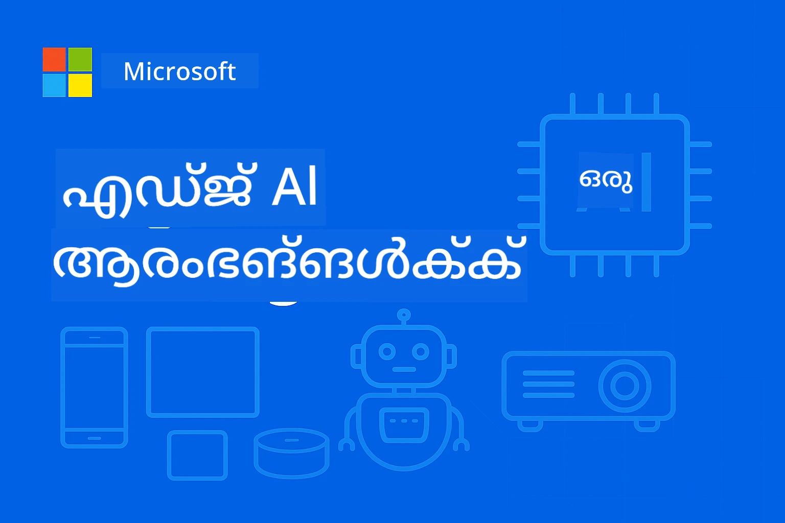

# ആരംഭക്കാർക്ക് വേണ്ടി EdgeAI




[](https://GitHub.com/microsoft/edgeai-for-beginners/graphs/contributors)
[](https://GitHub.com/microsoft/edgeai-for-beginners/issues)
[](https://GitHub.com/microsoft/edgeai-for-beginners/pulls)
[](http://makeapullrequest.com)

[](https://GitHub.com/microsoft/edgeai-for-beginners/watchers)
[](https://GitHub.com/microsoft/edgeai-for-beginners/fork)
[](https://GitHub.com/microsoft/edgeai-for-beginners/stargazers)


[](https://discord.gg/nTYy5BXMWG)

ഈ വിഭവങ്ങൾ ഉപയോഗിച്ച് തുടങ്ങാൻ താഴെയുള്ള ഘട്ടങ്ങൾ പിന്തുടരുക:

1. **റിപ്പോസിടറി ഫ്രോക്ക് ചെയ്‌തു**: ക്ലിക്ക് ചെയ്യുക [](https://GitHub.com/microsoft/edgeai-for-beginners/fork)
2. **റിപ്പോസിടറി ക്ലോൺ ചെയ്‌തു**:   `git clone https://github.com/microsoft/edgeai-for-beginners.git`
3. [**Azure AI Foundry Discord-ൽ ചേരുക ഡെവലപ്പർമാരെയും വിദഗ്ധരെയും കണ്ടുമുട്ടാൻ**](https://discord.com/invite/ByRwuEEgH4)


### 🌐 ബഹുഭാഷാ പിന്തുണ

#### GitHub ആക്ഷനിലൂടെ പിന്തുണ (സ്വയംകൃതവും എപ്പോഴും പുതുക്കലോടെ)

<!-- CO-OP TRANSLATOR LANGUAGES TABLE START -->
[Arabic](../ar/README.md) | [Bengali](../bn/README.md) | [Bulgarian](../bg/README.md) | [Burmese (Myanmar)](../my/README.md) | [Chinese (Simplified)](../zh-CN/README.md) | [Chinese (Traditional, Hong Kong)](../zh-HK/README.md) | [Chinese (Traditional, Macau)](../zh-MO/README.md) | [Chinese (Traditional, Taiwan)](../zh-TW/README.md) | [Croatian](../hr/README.md) | [Czech](../cs/README.md) | [Danish](../da/README.md) | [Dutch](../nl/README.md) | [Estonian](../et/README.md) | [Finnish](../fi/README.md) | [French](../fr/README.md) | [German](../de/README.md) | [Greek](../el/README.md) | [Hebrew](../he/README.md) | [Hindi](../hi/README.md) | [Hungarian](../hu/README.md) | [Indonesian](../id/README.md) | [Italian](../it/README.md) | [Japanese](../ja/README.md) | [Kannada](../kn/README.md) | [Khmer](../km/README.md) | [Korean](../ko/README.md) | [Lithuanian](../lt/README.md) | [Malay](../ms/README.md) | [Malayalam](./README.md) | [Marathi](../mr/README.md) | [Nepali](../ne/README.md) | [Nigerian Pidgin](../pcm/README.md) | [Norwegian](../no/README.md) | [Persian (Farsi)](../fa/README.md) | [Polish](../pl/README.md) | [Portuguese (Brazil)](../pt-BR/README.md) | [Portuguese (Portugal)](../pt-PT/README.md) | [Punjabi (Gurmukhi)](../pa/README.md) | [Romanian](../ro/README.md) | [Russian](../ru/README.md) | [Serbian (Cyrillic)](../sr/README.md) | [Slovak](../sk/README.md) | [Slovenian](../sl/README.md) | [Spanish](../es/README.md) | [Swahili](../sw/README.md) | [Swedish](../sv/README.md) | [Tagalog (Filipino)](../tl/README.md) | [Tamil](../ta/README.md) | [Telugu](../te/README.md) | [Thai](../th/README.md) | [Turkish](../tr/README.md) | [Ukrainian](../uk/README.md) | [Urdu](../ur/README.md) | [Vietnamese](../vi/README.md)

> **പ്രാദേശികമായി ക്ളോൺ ചെയ്യാൻ ആഗ്രഹമുണ്ടോ?**
>
> ഈ റിപ്പോസിടറിയിൽ 50+ ഭാഷാ പരിഭാഷകൾ ഉൾക്കൊള്ളുന്നതിന്റെ ഫലമായി ഡൗൺലോഡ് വലുപ്പം ഗണ്യമായി വർധിക്കുന്നു. പരിഭാഷകൾ ഇല്ലാതെ ക്ലോൺ ചെയ്യാൻ sparse checkout ഉപയോഗിക്കുക:
>
> **Bash / macOS / Linux:**
> ```bash
> git clone --filter=blob:none --sparse https://github.com/microsoft/edgeai-for-beginners.git
> cd edgeai-for-beginners
> git sparse-checkout set --no-cone '/*' '!translations' '!translated_images'
> ```
>
> **CMD (Windows):**
> ```cmd
> git clone --filter=blob:none --sparse https://github.com/microsoft/edgeai-for-beginners.git
> cd edgeai-for-beginners
> git sparse-checkout set --no-cone "/*" "!translations" "!translated_images"
> ```
>
> ഇത് നിങ്ങൾക്ക് കോഴ്സ് പൂർത്തിയാക്കുന്നതിനുള്ള എല്ലാ വസ്തുക്കളും വേഗതയേറിയ ഡൗൺലോഡ് गति കൂടെ നൽകും.
<!-- CO-OP TRANSLATOR LANGUAGES TABLE END -->

**കൂടുതൽ പരിഭാഷാ ഭാഷകൾ ആവശ്യമാണെങ്കിൽ അവ ഇവിടെ [ലിസ്റ്റുചെയ്തിരിക്കുന്നു](https://github.com/Azure/co-op-translator/blob/main/getting_started/supported-languages.md)**
## ভূমിക

**EdgeAI for Beginners**-ലേക്ക് സ്വാഗതം – എഡ്ജ് കൃത്രിമബുദ്ധിമുട്ടുകളുടെ പരിവർത്തനത്മക ലോകത്തിലേക്കുള്ള നിങ്ങളുടെ സമഗ്രയാത്ര. ഈ കോഴ്‌സ് ശക്തമായ AI കഴിവുകളും യാഥാർത്ഥ്യത്തിൽ, എജ്ജ് ഉപകരണങ്ങളിൽ പ്രായോഗികമായി വിന്യസിക്കൽ എന്നിവ തമ്മിലുള്ള വ്യത്യാസം മറികടക്കുന്നു, ഡാറ്റ സൃഷ്ടിക്കുന്നിടത്തും തീരുമാനങ്ങൾ എടുക്കേണ്ടിടത്തും നേരിട്ട് AI-യുടെ ശേഷി പ്രയോജനപ്പെടുത്താൻ കഴിവേകുന്നു.

### നിങ്ങൾ അഭ്യസിക്കാനിരിക്കുന്നതു

ഈ കോഴ്‌സ് അടിസ്ഥാന ആശയങ്ങളിൽ നിന്ന് ഉത്പാദന-സജ്ജമായ നടപ്പാക്കലുകൾ വരെ നിങ്ങളുടെ വഴി തീർക്കുന്നു, ഉൾകൊള്ളുന്നവ:
- എജ്ജ് വിന്യാസത്തിന് അനുയോജ്യമായ **ചെറിയ ഭാഷാ മോഡലുകൾ (SLMs)**
- വ്യത്യസ്ത പ്ലാറ്റ്‌ഫോമുകളിൽ **ഹാർഡ്‌വെയർ-അറിയുന്ന ഓപ്റ്റിമൈസേഷൻ**
- **പരിഗണനാപരമായ ശേഷിയുള്ള** റിയൽ-ടൈം ഇൻഫറൻസ്
- എന്റർപ്രൈസ് ആപ്ലിക്കേഷനുകൾക്കായുള്ള **ഉത്പാദന വിന്യാസ തന്ത്രങ്ങൾ**

### എഡ്ജ് AI എന്തിനാണ് പ്രധാന്യം

എഡ്ജ് AI ഏറ്റവും പ്രാധാന്യമുള്ള ആധുനിക പ്രശ്നങ്ങളെ നേരിടുന്ന ഒരു പാരഡിഗം മാറ്റമാണ്:
- **സ്വകാര്യത & സുരക്ഷ**: ക്ലൗഡ് പ്രതികരണം ഇല്ലാതെ ലൊക്കൽ ഡാറ്റ പ്രോസസ് ചെയ്യുന്നു
- **റിയൽ-ടൈം പ്രവർത്തനം**: സമയോচিত ആപ്ലിക്കേഷനുകൾക്ക് നെറ്റ്‌വർക്കിന്റെ വൈകിപ്പിക്കൽ ഇല്ലാതാക്കുന്നു
- **വിലയകുറവ്**: ബാൻഡ്‌വിഡ്ത്തും ക്ലൗഡ് കംപ്യൂട്ടിങ്ങും കുറയ്ക്കുന്നു
- **സ്ഥിരപ്രവർത്തനം**: നെറ്റ്‌വർക്ക് അപ്രാപ്യമായപ്പോൾ പ്രവർത്തനം നിലനിർത്തുന്നു
- **നിയമാനുസരണം**: ഡാറ്റ പ്രാദേശികനിയമങ്ങൾ പാലിക്കുന്നു

### എഡ്ജ് AI

എഡ്ജ് AI എന്നത് ഡാറ്റ സൃഷ്ടിക്കുന്നിടത്തുകൂടി അനുബന്ധമായ ഹാർഡ്‌വെയറിൽ AI ആൾഗോരിതങ്ങൾ—യന്ത്ര ഭാഷാ മോഡലുകളും—പ്രവർത്തനത്തിനായി ക്ലൗഡ് ഉറവിടങ്ങളിലേക്ക് ആശ്രയിക്കാതെ ഓടിക്കുക എന്നതാണ്. ഇത് വൈകിപ്പിക്കൽ കുറയ്ക്കുകയും സ്വകാര്യത മെച്ചപ്പെടുത്തുകയും യഥാർത്ഥ സമയ തീരുമാനങ്ങൾ എടുക്കാൻ സഹായിക്കുകയും ചെയ്യുന്നു.

### പ്രധാനം:
- **ഉപകരണത്തിൽ തന്നെ ഇൻഫറൻസ്**: എജ്ജ് ഉപകരണങ്ങളിൽ AI മോഡലുകൾ (ഫോണുകൾ, റൗട്ടറുകൾ, മൈക്രോകൺട്രോളറുകൾ, വ്യവസായ PCs) ഓടുന്നു
- **ഓഫ്‌ലൈൻ സാധുത**: സ്ഥിരമായ ഇന്റർനെറ്റ് കണക്ഷൻ ഇല്ലാതെ പ്രവർത്തനം
- **തീവ്‌രം കുറഞ്ഞ വൈകിപ്പിക്കൽ**: യഥാർത്ഥ-സമയ സംവിധാനങ്ങൾക്ക് അനുയോജ്യമായ ഉടൻ പ്രതികരണങ്ങൾ
- **ഡാറ്റ പ്രാദേശികത**: സങ്കടിപ്പിച്ച ഡാറ്റ പ്രാദേശികമായി സൂക്ഷിക്കുന്നു, സുരക്ഷയും അനുസരണയും മെച്ചപ്പെട്ടു

### ചെറിയ ഭാഷാ മോഡലുകൾ (SLMs)

Phi-4, Mistral-7B, Gemma പോലുള്ള SLMകൾ വലിയ LLMs-এর ഓപ്റ്റിമൈസ്ഡ് പതിപ്പുകളാണ്—പ്രശ്രയിക്കുന്നതോ ഡിസ്റ്റിൽ ചെയ്തതോ:
- **കുറഞ്ഞ മെമ്മറി ഉപയോഗം**: പരിമിതമായ എജ്ജ് ഉപകരണ മെമ്മറി കാര്യക്ഷമമായി ഉപയോഗിക്കുക
- **കുറഞ്ഞ കംപ്യൂട്ട് ആവശ്യകത**: CPU, എജ്ജ് GPU പ്രകടനത്തിനായി ഓപ്റ്റിമൈസ്ഡ്
- **വേഗത്തിലുള്ള ആരംഭം**: പ്രതികരിക്കാനും വേഗത്തിൽ തുടങ്ങി പ്രവർത്തിക്കാൻ

ഇവ ശക്തമായ NLP കഴിവുകൾ തുറന്നു നൽകുന്നു കൂടാതെ ചേരുന്നു:
- **എംബെഡഡ് സിസ്റ്റങ്ങൾ**: IoT ഉപകരണങ്ങളും വ്യവസായ നിയന്ത്രണങ്ങളും
- **മൊബൈൽ ഉപകരണങ്ങൾ**: ഓഫ്‌ലൈൻ കഴിവുള്ള സ്മാർട്ട്‌ഫോണുകൾ, ടാബ്‌ളറ്റുകൾ
- **IoT ഉപകരണങ്ങൾ**: പരിമിതായ വിഭവങ്ങളുള്ള സെൻസറുകളും സ്മാർട്ട് ഉപകരണങ്ങളും
- **എഡ്ജ് സെർവർകൾ**: പരിമിത GPU വിഭവങ്ങളുള്ള ലൊക്കൽ പ്രോസസ്സിംഗ് യൂണിറ്റുകൾ
- **പേഴ്സണൽ കമ്പ്യൂട്ടറുകൾ**: ഡെസ്‌ക്‌ടോപ്പ്, ലാപ്‌ടോപ്പ് വിന്യാസങ്ങൾ

## കോഴ്‌സ് മൊഡ്യൂളുകളും നാവിഗേഷനും

| മൊഡ്യൂൾ | വിഷയം | ശ്രദ്ധ കേന്ദ്രം | പ്രധാന ഉള്ളടക്കം | നില | ദൈർഘ്യം |
|--------|-------|------------|-------------|--------|----------|
| [📖 00 ](./introduction.md) | [EdgeAI പരിചയം](./introduction.md) | അടിസ്ഥാനവും സാന്ദർഭ്യവും | EdgeAI അവലോകനം • വ്യവസായ ആപ്ലിക്കേഷനുകൾ • SLM പരിചയം • പഠന ലക്ഷ്യങ്ങൾ | ആരംഭക്കാർ | 1-2 മണിക്കൂർ |
| [📚 01](../../Module01) | [EdgeAI അടിസ്ഥാനങ്ങൾ](./Module01/README.md) | ക്ലൗഡ്-എഡ്ജ് AI താരതമ്യം | EdgeAI അടിസ്ഥാനങ്ങൾ • യഥാർത്ഥ സംഭവകേസുകൾ • നടപ്പാക്കൽ മാർഗ്ഗനിർദ്ദേശം • എഡ്ജ് വിന്യാസം | ആരംഭക്കാർ | 3-4 മണിക്കൂർ |
| [🧠 02](../../Module02) | [SLM മോഡൽ അടിസ്ഥാനങ്ങൾ](./Module02/README.md) | മോഡൽ കുടുംബങ്ങളും ഘടനയും | Phi കുടുംബം • Qwen കുടുംബം • Gemma കുടുംബം • BitNET • μModel • Phi-Silica | ആരംഭക്കാർ | 4-5 മണിക്കൂർ |
| [🚀 03](../../Module03) | [SLM വിന്യാസ വ്യവഹാരം](./Module03/README.md) | ലൊക്കൽ & ക്ലൗഡ് വിന്യാസം | ആധികാരിക പഠനം • ലൊക്കൽ അന്തരീക്ഷം • ക്ലൗഡ് വിന്യാസം | ഇടത്തരം | 4-5 മണിക്കൂർ |
| [⚙️ 04](../../Module04) | [മോഡൽ ഓപ്റ്റിമൈസേഷൻ ടൂൾകിറ്റ്](./Module04/README.md) | ക്രോസ്-പ്ലാറ്റ്‌ഫോം ഒപ്റ്റിമൈസേഷൻ | പരിചയം • Llama.cpp • Microsoft Olive • OpenVINO • Apple MLX • വർക്‌ഫ്ലോ സംക്ഷേപണം | ഇടത്തരം | 5-6 മണിക്കൂർ |
| [🔧 05](../../Module05) | [SLMOps ഉത്പാദനം](./Module05/README.md) | ഉത്പാദന പ്രവർത്തനങ്ങൾ | SLMOps പരിചയം • മോഡൽ ഡിസ്റ്റില്ലേഷൻ • ഫൈൻ ട്യൂണിങ് • ഉത്പാദന വിന്യാസം | ഉയർന്ന | 5-6 മണിക്കൂർ |
| [🤖 06](../../Module06) | [AI ഏജന്റുകളും ഫംഗ്ഷൻ കോൾ ചെയ്യലും](./Module06/README.md) | ഏജന്റ് ഫ്രെയിംവർക്ക് & MCP | ഏജന്റ് പരിചയം • ഫംഗ്ഷൻ കോൾ • മോഡൽ സാന്ദർഭ പ്രോട്ടോക്കോൾ | ഉയർന്ന | 4-5 മണിക്കൂർ |
| [💻 07](../../Module07) | [പ്ലാറ്റ്‌ഫോം നടപ്പാക്കൽ](./Module07/README.md) | ക്രോസ്-പ്ലാറ്റ്‌ഫോം സാമ്പിളുകൾ | AI ടൂൾകിറ്റ് • ഫൗണ്ട്രി ലൊക്കൽ • Windows ഡെവലപ്പ്മെന്റ് | ഉയർന്ന | 3-4 മണിക്കൂർ |
| [🏭 08](../../Module08) | [ഫൗണ്ട്രി ലൊക്കൽ ടൂൾകിറ്റ്](./Module08/README.md) | ഉത്പാദന-സജ്ജ സാമ്പിളുകൾ | സാമ്പിൾ ആപ്ലിക്കേഷനുകൾ (താഴെ വിശദീകരിച്ചിരിക്കുന്നു) | വിദഗ്ധൻ | 8-10 മണിക്കൂർ |

### 🏭 **മൊഡ്യൂൾ 08: സാമ്പിൾ ആപ്ലിക്കേഷനുകൾ**

- [01: REST ചാറ്റ് ക്വിക്ക്‌സ്റ്റാർട്ട്](./Module08/samples/01/README.md)
- [02: OpenAI SDK സംയോജനം](./Module08/samples/02/README.md)
- [03: മോഡൽ കണ്ടെത്തൽ & ബെഞ്ച്മാർക്കിംഗ്](./Module08/samples/03/README.md)
- [04: Chainlit RAG ആപ്ലിക്കേഷൻ](./Module08/samples/04/README.md)
- [05: മൾട്ടി ഏജന്റ് ഓർക്കസ്‌ട്രേഷൻ](./Module08/samples/05/README.md)
- [06: മോഡൽ-ആസ്-ടൂൾസ് റൗട്ടർ](./Module08/samples/06/README.md)
- [07: ഡയരക്ട് API ക്ലയന്റ്](./Module08/samples/07/README.md)
- [08: Windows 11 ചാറ്റ് ആപ്പ്](./Module08/samples/08/README.md)
- [09: ആഡ്വാൻസ്ഡ് മൾട്ടി-ഏജന്റ് സിസ്റ്റം](./Module08/samples/09/README.md)
- [10: ഫൗണ്ട്രി ടൂൾസ് ഫ്രെയിംവർക്ക്](./Module08/samples/10/README.md)

### 🎓 **വർക്‌ഷോപ്പ്: ഹാൻഡ്‌സ്-ഓൺ പഠന പാത**

ഉത്പാദന സജ്ജ നടപ്പാക്കലുകളോടുകൂടിയ സമഗ്ര ഹാന്റ്സ്-ഓൺ വർക്‌ഷോപ്പ് സാമഗ്രികൾ:

- **[വർക്‌ഷോപ്പ് ഗൈഡ്](./Workshop/Readme.md)** - പൂർണ്ണ പഠന ലക്ഷ്യങ്ങൾ, ഫലങ്ങൾ, വിഭവങ്ങൾ നാവിഗേഷൻ
- **Python സാമ്പിളുകൾ** (6 സെഷനുകൾ) - മികച്ച രീതികളും പിശക് കൈകാര്യം തീർച്ചയും സമഗ്ര ഡോക്യുമെന്റേഷനും
- **Jupyter നിന്നോട്ട്ബുക്കുകൾ** (8 ഇന്ററാക്ടീവ്) - സ്റ്റെപ്പ്-ബൈ-സ്‌റ്റെപ്പ് ട്യൂട്ടോറിയലുകൾ ബെഞ്ച്മാർക്കുകളും പ്രകടന നിരീക്ഷണവും ഉള്ളവ
- **സെഷൻ ഗൈഡുകൾ** - ഓരോ വർക്‌ഷോപ്പ് സെഷനും വിശദമായ മാർക്ക്‌ഡൗൺ ഗൈഡുകൾ
- **വാലിഡേഷൻ ടൂളുകൾ** - കോഡ് നിലവാര പരിശോധനക്കും സ്മോക്ക് ടെസ്റ്റുകൾ നടത്താനുമായി സ്ക്രിപ്റ്റുകൾ

**നിങ്ങൾ നിർമ്മിക്കാൻ പോകുന്നത്:**
- സ്ട്രീമിങ്ങ് പിന്തുണയുള്ള ലൊക്കൽ AI ചാറ്റ് ആപ്ലിക്കേഷനുകൾ
- ഗുണമേന്മയാണ് വിലയിരുത്തുന്ന RAG പൈപ്പ്ലൈനുകൾ (RAGAS)
- മൾട്ടി-മോഡൽ ബെഞ്ച്മാർക്കിംഗ് & താരതമ്യ ടൂളുകൾ
- മൾട്ടി- ഏജന്റ് ഓർക്കസ്‌ട്രേഷൻ സിസ്റ്റങ്ങൾ
- ടാസ്ക്-അടിസ്ഥാന സെലക്ഷനോടെ ബുദ്ധിമുട്ടുള്ള മോഡൽ റൗട്ടിംഗ്

### 🎙️ **ഏജന്റിക്‌ക്കായുള്ള വർക്‌ഷോപ്പ്: ഹാൻഡ്‌സ്-ഓൺ - AI പോഡ്‌കാസ്റ്റ് സ്റ്റുഡിയോ**
തുടക്കം മുതൽ തന്നെ എഐ ശക്തിയുള്ള പോഡ്കാസ്റ്റ് നിർമ്മാണ പൈപ്പ്ലൈൻ രൂപപ്പെടുത്തൂ! ആശയങ്ങളെ പ്രൊഫഷണൽ പോഡ്കാസ്റ്റ് എപിസോഡുകളാക്കി മാറ്റുന്ന സമഗ്രമായ മൾട്ടി-ഏജന്റ് സിസ്റ്റം സൃഷ്ടിക്കുന്നത് ഈ ഇൻമഴീവായ വർക്‌ഷോപ്പിൽ പഠിപ്പിക്കുന്നു.

**[🎬 സ്റ്റാർട്ട് ദി എഐ പോഡ്കാസ്റ്റ് സ്റ്റูഡിയോ വർക്‌ഷോപ്പ്](./WorkshopForAgentic/README.md)**

**നിങ്ങളുടെ ദൗത്യം**: "ഫ്യൂച്ചർ ബൈറ്റ്സ്" ആരംഭിക്കുക — നിങ്ങൾ തന്നെ നിർമ്മിക്കുന്ന എഐ ഏജന്റുകൾ സജീവമാക്കുന്ന ഒരു ടെക്ക് പോഡ്കാസ്റ്റ്. ക്ലൗഡ് ആശ്രിതത്വമില്ല, API ചിലവുകൾ ഇല്ല — എല്ലാം നിങ്ങളുടെ കമ്പ്യൂട്ടറിൽ തന്നെ പ്രവർത്തിക്കും.

**ഇത് എന്തുകൊണ്ട് പ്രത്യേകമാണെന്ന്:**
- **🤖 യഥാർത്ഥ മൾട്ടി-ഏജന്റ് ഓർക്കസ്ട്രേഷൻ** - ഗവേഷണം നടത്തുകയും, എഴുതുകയും, ഓഡിയോ ഉത്പാദിപ്പിക്കുകയും ചെയ്യുന്ന പ്രത്യേക പ്രോഗ്രാം എഐ ഏജന്റുകൾ നിർമ്മിക്കുക
- **🎯 സമ്പൂർണ്ണ നിർമ്മാണ പൈപ്പ്ലൈൻ** - വിഷയം തിരഞ്ഞെടുക്കൽ മുതൽ അന്തിമ പോഡ്കാസ്റ്റ് ഓഡിയോ ഔട്ട്‌പുട്ട് വരെ
- **💻 100% പ്രാദേശിക റിലീസ്** - ഒളാമയും പ്രാദേശിക മോഡലുകളും (Qwen-3-8B) ഉപയോഗിച്ച് പൂർണസ്വാധീനവും സ്വകാര്യതയും
- **🎤 ടെക്സ്റ്റ്-ടു-സ്പീച്ച് ഇന്റഗ്രേഷൻ** - സ്‌ക്രിപ്റ്റുകൾ സ്വാഭാവിക ശബ്ദമുള്ള മൾട്ടി-സ്പീക്കർ സംഭാഷണങ്ങളായി പരിവർത്തനം ചെയ്യുക
- **✋ മനുഷ്യൻ-ഇൻ-ദി-ലൂപ്പ് പ്രവാഹങ്ങൾ** - പ്രമാണാനഗമങ്ങൾ ഗുണമേന്മ ഉറപ്പാക്കുകയും ഓട്ടോമേഷൻ നിലനിർത്തുകയും ചെയ്യുന്നു

**മൂന്ന്-അങ്കം പഠന യാത്ര:**

| അങ്കം | ശ്രദ്ധാകേന്ദ്രം | പ്രധാന കഴിവുകൾ | ദൈർഘ്യം |
|-----|-------|------------|----------|
| **[അങ്കം 1: നിങ്ങളുടെ എഐ അസിസ്റ്റന്റുകളെ കാണാം](./WorkshopForAgentic/md/01.BuildAIAgentWithSLM.md)** | നിങ്ങളുടെ ആദ്യ എഐ ഏജന്റ് നിർമ്മിക്കുക | ടൂൾ ഇന്റഗ്രേഷൻ • വെബ് തിരച്ചിൽ • പ്രശ്നപരിഹാരം • ഏജന്റിക് ആലോചന | 2-3 മണിക്കൂർ |
| **[അങ്കം 2: നിങ്ങളുടെ നിർമ്മാണ സംഘത്തെ കൂടി ചേർക്കുക](./WorkshopForAgentic/md/02.AIAgentOrchestrationAndWorkflows.md)** | പല ഏജന്റുകളും ഏകോപിപ്പിക്കുക | സംഘം സംയോജനം • അംഗീകാരം പ്രവാഹങ്ങൾ • DevUI ഇന്റർഫേസ് • മനുഷ്യ മേൽനോട്ടം | 3-4 മണിക്കൂർ |
| **[അങ്കം 3: നിങ്ങളുടെ പോഡ്കാസ്റ്റ് உயிரോടെ എത്തിക്കുക](./WorkshopForAgentic/md/03.Multi-SpeakerPodcastGenerationWithVibeVoice.md)** | പോഡ്കാസ്റ്റ് ഓഡിയോ ജനനമാക്കുക | ടെക്‌സ്‌റ്റ്-ടു-സ്പീച്ച് • മൾട്ടി-സ്പീക്കർ സിന്തസിസ് • ദീർഘകാല ഓഡിയോ • പൂർണ്ണ ഓട്ടോമേഷൻ | 2-3 മണിക്കൂർ |

**ഉപയോഗിച്ച സാങ്കേതികവിദ്യകൾ:**
- **Microsoft Agent Framework** - മൾട്ടി-ഏജന്റ് ഓർക്കസ്ട്രേഷൻ, ഏകോപനം
- **Ollama** - പ്രാദേശിക എഐ മോഡ്‌യം റൺടൈം (ക്ലൗഡ് ആവശ്യമായില്ല)
- **Qwen-3-8B** - ഏജന്റിക് ടാസ്കുകൾക്ക് ഒപ്റ്റിമൈസ്ഡ് ഓപ്പൺ-സോഴ്‌സ് ഭാഷ മോഡൽ
- **ടെക്സ്റ്റ്-ടു-സ്പീച്ച് APIs** - പോഡ്കാസ്റ്റ് ജനറേഷനായി സ്വാഭാവിക ശബ്‌ദ സിന്തസിസ്

**ഹാർഡ്‌വെയർ പിന്തുണ:**
- ✅ **CPU മോഡ്** - ഏതെങ്കിലും ആധുനിക കമ്പ്യൂട്ടറിലും പ്രവര്‍ത്തിക്കുന്നു (8GB+ RAM ശിപാർശ)
- 🚀 **GPU ആക്സിലറേഷൻ** - NVIDIA/AMD GPU ഉപയോഗിച്ച് വെറുതെ വേഗത പൂർത്തീകരണം
- ⚡ **NPU പിന്തുണ** - അടുത്ത തലമുറ ന്യൂറൽ പ്രോസസ്സിംഗ് യൂണിറ്റ് ആക്സിലറേഷൻ

**തറ്റിയത്:**
- മൾട്ടി-ഏജന്റ് എഐ സിസ്റ്റങ്ങൾ പഠിക്കുന്ന വികസനകാർ
- എഐ ഓട്ടോമേഷൻ, പ്രവാഹങ്ങൾ ആസ്വദിക്കുന്നവർ
- എഐ സഹായത്തിലുള്ള നിർമ്മാണം അന്വേഷിക്കുന്ന ഉള്ളടക്ക സൃഷ്ടികൾ
- പ്രായോഗിക എഐ ഓർക്കസ്ട്രേഷൻ മാതൃകകൾ പഠിക്കുന്ന വിദ്യാർത്ഥികൾ

**നിർമ്മാണം ആരംഭിക്കുക**: [🎙️ ദി എഐ പോഡ്കാസ്റ്റ് സ്റ്റുഡിയോ വർക്‌ഷോപ്പ് →](./WorkshopForAgentic/README.md)

### 📊 **പഠന പഥ സംഗ്രഹം**
- **ആകെ ദൈർഘ്യം**: 36-45 മണിക്കൂർ
- **ആരംഭക പഥ**: ഘട്ടങ്ങൾ 01-02 (7-9 മണിക്കൂർ)  
- **മധ്യനില പഥ**: ഘട്ടങ്ങൾ 03-04 (9-11 മണിക്കൂർ)
- **ഉന്നതപഥം**: ഘട്ടങ്ങൾ 05-07 (12-15 മണിക്കൂർ)
- **നിപുണ പഥം**: ഘട്ടം 08 (8-10 മണിക്കൂർ)

## നിങ്ങൾ നിർമ്മിക്കുന്നത്

### 🎯 മുഖ്യ കഴിവുകൾ
- **എഡ്ജ് എഐ നിർമ്മിതിവിദ്യ**: ക്ലൗഡ് ഇന്റഗ്രേഷനോടുകൂടിയ പ്രാദേശിക-പ്രഥമ എഐ സിസ്റ്റങ്ങൾ രൂപകല്‍പന
- **മോഡൽ ഒപ്ടിമൈസേഷൻ**: എഡ്ജ് ഡിപ്ലോയ്മെന്റിന് മോഡലുകൾ ക്വാണ്ടൈസ്ഡ്, കൂട്ടിച്ചുരുക്കൽ (85% വേഗം വർധനം, 75% വലുപ്പക്കുറവ്)
- **മൾട്ടി-പ്ലാറ്റ്ഫോം ഡിപ്ലോയ്മെന്റ്**: വിൻഡോസ്, മൊബൈൽ, എംബഡ്, ക്ലൗഡ്-എഡ്ജ് ഹൈബ്രിഡ് സിസ്റ്റങ്ങൾ
- **നിർമാണ പ്രവർത്തനങ്ങൾ**: എഡ്ജ് എഐ നിരീക്ഷണം, സ്കെയിലിംഗ്, പരിപാലനം

### 🏗️ പ്രായോഗിക പ്രോജക്റ്റുകൾ
- **ഫൗണ്ട്രി പ്രാദേശിക ചാറ്റ് ആപ്പുകൾ**: മോഡൽ മാറൽ ഉള്ള വിൻഡോസ് 11 സ്വതന്ത്ര ആപ്പ്
- **മൾട്ടി-ഏജന്റ് സിസ്റ്റങ്ങൾ**: കോഓർഡിനേറ്റർ, പ്രത്യേക ഏജന്റുകൾ കൂടിച്ചേർന്ന ബെഹൈവിയർ  
- **RAG ആപ്പുകൾ**: പ്രാദേശിക ഡോക്യുമെന്റ് പ്രോസസ്സിംഗ്, വെക്റ്റർ തിരച്ചിൽ
- **മോഡൽ റൂട്ടേഴ്സ്**: ടാസ്‌ക്ക് അനാലിസിസിന്റെ അടിസ്ഥാനത്തിൽ മോഡലുകൾ തിരഞ്ഞെടുത്ത്
- **API ഫ്രെയിംവർക്കുകൾ**: സ്ട്രീമിംഗ്, ഹെൽത്ത് മോണിറ്ററിംഗ് ഉള്ള നിർമ്മാണക്ഷമ ക്ലയന്റുകൾ
- **ക്രോസ്-പ്ലാറ്റ്ഫോം ടൂളുകൾ**: LangChain/Semantic Kernel ഇന്റഗ്രേഷൻ മാതൃകകൾ

### 🏢 വ്യവസായ മേഖലകൾ
**നിർമ്മാണം** • **ആരോഗ്യം** • **സ്വയം പ്രവർത്തിക്കുന്ന വാഹനം** • **സ്മാർട്ട് സിറ്റികൾ** • **മൊബൈൽ ആപ്പുകൾ**

## ഉൽപ്പത്തിക്രമം

**ശിപാർശ ചെയ്ത പഠനപഥം** (ആകെ 20-30 മണിക്കൂർ):

0. **📖 പരിചയം** ([Introduction.md](./introduction.md)): EdgeAI അടിസ്ഥാനവും വ്യവസായ പശ്ചാത്തലവും പഠന രീതി
1. **📚 അടിസ്ഥാന പാഠം** (ഘട്ടങ്ങൾ 01-02): EdgeAI ആശയങ്ങൾ, SLM മോഡൽ കുടുംബങ്ങൾ
2. **⚙️ ഒപ്ടിമൈസേഷൻ** (ഘട്ടങ്ങൾ 03-04): ഡിപ്ലോയ്മെന്റ്, ക്വാണ്ടൈസേഷൻ ഫ്രെയിംവർക്ക്  
3. **🚀 നിർമ്മാണം** (ഘട്ടങ്ങൾ 05-06): SLMOps, എഐ ഏജന്റുകൾ, ഫംഗ്ഷൻ കോൾ ചെയ്യൽ
4. **💻 നടപ്പാക്കൽ** (ഘട്ടം 07-08): പ്ലാറ്റ്ഫോം സാംപിളുകൾ, ഫൗണ്ട്രി പ്രാദേശിക ടൂൾകിറ്റ്

ഓരുത്ത് ഘട്ടവും സിദ്ധാന്തവും പ്രായോഗിക അഭ്യാസങ്ങളും നിർമ്മാണത്തിനായി തയ്യാറാക്കിയ കോഡ് സാമ്പിളുകളും ഉൾക്കൊള്ളുന്നു.

## കരിയർ സ്വാധീനം

**തെക്നിക്കൽ റോളുകൾ**: EdgeAI സൊല്യൂഷൻസ് ആർക്കിടെക്റ്റ് • ML എഞ്ചിനീയർ (എഡ്ജ്) • IoT എഐ ഡെവലപ്പർ • മൊബൈൽ എഐ ഡെവലപ്പർ

**വ്യവസായ മേഖലകൾ**: നിർമ്മാണം 4.0 • ആരോഗ്യം സാങ്കേതികവിദ്യ • സ്വയം സഞ്ചാര സംവിധാനങ്ങൾ • ഫിൻടെക് • ഉപഭോക്തൃ ഇലക്ട്രോണിക്സ്

**പോർട്ട്ഫോളിയോ പ്രോജക്റ്റുകൾ**: മൾട്ടി-ഏജന്റ് സിസ്റ്റങ്ങൾ • നിർമ്മാണ RAG ആപ്പുകൾ • ക്രോസ്-പ്ലാറ്റ്ഫോം ഡിപ്ലോയ്മെന്റ് • പ്രകടന ഒപ്ടിമൈസേഷൻ

## റിപ്പോസിറ്ററി ഘടന

```
edgeai-for-beginners/
├── 📖 introduction.md  # Foundation: EdgeAI Overview & Learning Framework
├── 📚 Module01-04/     # Fundamentals → SLMs → Deployment → Optimization  
├── 🔧 Module05-06/     # SLMOps → AI Agents → Function Calling
├── 💻 Module07/        # Platform Samples (VS Code, Windows, Jetson, Mobile)
├── 🏭 Module08/        # Foundry Local Toolkit + 10 Comprehensive Samples
│   ├── samples/01-06/  # Foundation: REST, SDK, RAG, Agents, Routing
│   └── samples/07-10/  # Advanced: API Client, Windows App, Enterprise Agents, Tools
├── 🌐 translations/    # Multi-language support (8+ languages)
└── 📋 STUDY_GUIDE.md   # Structured learning paths & time allocation
```

## കോഴ്‌സ് ഹൈലൈറ്റുകൾ

✅ **ശ്രേണിയായ പഠനം**: സിദ്ധാന്തം → പ്രാക്ടീസ് → നിർമ്മാണ ഡിപ്ലോയ്മെന്റ്  
✅ **യഥാർത്ഥ കേസ് സ്റ്റഡികൾ**: Microsoft, ജപ്പാൻ എയർലൈൻസ്, സംരംഭ നിയമനങ്ങൾ  
✅ **പ്രായോഗിക സാമ്പിളുകൾ**: 50+ ഉദാഹരണങ്ങൾ, 10 സമഗ്ര ഫൗണ്ട്രി പ്രാദേശിക ഡെമോകൾ  
✅ **പ്രകടന ശ്രദ്ധ**: 85% വേഗം മെച്ചപ്പെടുത്തലുകൾ, 75% വലുപ്പം കുറവ്  
✅ **മൾട്ടി-പ്ലാറ്റ്ഫോം**: വിൻഡോസ്, മൊബൈൽ, എംബഡ്, ക്ലൗഡ്-എഡ്ജ് ഹൈബ്രിഡ്  
✅ **നിർമ്മാണ തയ്യാറെടുപ്പ്**: നിരീക്ഷണം, സ്കെയിലിംഗ്, സുരക്ഷ, പാലന മാർഗങ്ങൾ

📖 **[പഠന മാർഗ്ഗദर्शിക ലഭ്യമാണ്](STUDY_GUIDE.md)**: കമ്പനികളുടെ സമയ ബോർഡും സ്വയം-പരിശോധന ഉപകരണങ്ങളും ഉള്ള 20-മണിക്കൂർ പഠനപഥം.

---

**EdgeAI എന്നത് എഐ വിന്യസത്തിന്റേയും ഭാവിയാണ്**: പ്രാദേശിക-പ്രഥമം, സ്വകാര്യത സംരക്ഷിക്കുന്ന, കാര്യക്ഷമം. ഈ കഴിവുകൾ അഭ്യസിച്ച് ബുദ്ധിമുട്ടുള്ള ആപ്ലിക്കേഷനുകളെ നിർമിക്കൂ.

## മറ്റ് കോഴ്‌സുകൾ

നമ്മുടെ ടീം മറ്റു കോഴ്‌സുകളും നിർമ്മിക്കുന്നു! പരിശോധിക്കുക:

<!-- CO-OP TRANSLATOR OTHER COURSES START -->
### LangChain
[](https://aka.ms/langchain4j-for-beginners)
[](https://aka.ms/langchainjs-for-beginners?WT.mc_id=m365-94501-dwahlin)
[](https://github.com/microsoft/langchain-for-beginners?WT.mc_id=m365-94501-dwahlin)
---

### Azure / Edge / MCP / Agents
[](https://github.com/microsoft/AZD-for-beginners?WT.mc_id=academic-105485-koreyst)
[](https://github.com/microsoft/edgeai-for-beginners?WT.mc_id=academic-105485-koreyst)
[](https://github.com/microsoft/mcp-for-beginners?WT.mc_id=academic-105485-koreyst)
[](https://github.com/microsoft/ai-agents-for-beginners?WT.mc_id=academic-105485-koreyst)

---
 
### Generative AI Series
[](https://github.com/microsoft/generative-ai-for-beginners?WT.mc_id=academic-105485-koreyst)
[-9333EA?style=for-the-badge&labelColor=E5E7EB&color=9333EA)](https://github.com/microsoft/Generative-AI-for-beginners-dotnet?WT.mc_id=academic-105485-koreyst)
[-C084FC?style=for-the-badge&labelColor=E5E7EB&color=C084FC)](https://github.com/microsoft/generative-ai-for-beginners-java?WT.mc_id=academic-105485-koreyst)
[-E879F9?style=for-the-badge&labelColor=E5E7EB&color=E879F9)](https://github.com/microsoft/generative-ai-with-javascript?WT.mc_id=academic-105485-koreyst)

---
 
### Core Learning
[](https://aka.ms/ml-beginners?WT.mc_id=academic-105485-koreyst)
[](https://aka.ms/datascience-beginners?WT.mc_id=academic-105485-koreyst)
[](https://aka.ms/ai-beginners?WT.mc_id=academic-105485-koreyst)
[](https://github.com/microsoft/Security-101?WT.mc_id=academic-96948-sayoung)
[](https://aka.ms/webdev-beginners?WT.mc_id=academic-105485-koreyst)
[](https://aka.ms/iot-beginners?WT.mc_id=academic-105485-koreyst)
[](https://github.com/microsoft/xr-development-for-beginners?WT.mc_id=academic-105485-koreyst)

---
 
### Copilot Series
[](https://aka.ms/GitHubCopilotAI?WT.mc_id=academic-105485-koreyst)
[](https://github.com/microsoft/mastering-github-copilot-for-dotnet-csharp-developers?WT.mc_id=academic-105485-koreyst)
[](https://github.com/microsoft/CopilotAdventures?WT.mc_id=academic-105485-koreyst)
<!-- CO-OP TRANSLATOR OTHER COURSES END -->

## പിന്തുണ നേടുക

നിങ്ങൾ അटकുകയോ AI ആപ്പുകൾ നിർമ്മിക്കുന്നതിന 관한 ചോദ്യങ്ങളുണ്ടോ വന്നാൽ ചേർക്കുക:

[](https://discord.gg/nTYy5BXMWG)

നീங்கள் ഉൽപ്പന്ന പ്രതികരണം നൽകണമെങ്കിൽ അല്ലെങ്കിൽ പിഴവുകൾ ഉണ്ടാകുമ്പോൾ സന്ദർശിക്കുക:

[](https://aka.ms/foundry/forum)

---

<!-- CO-OP TRANSLATOR DISCLAIMER START -->
**തള്ളിപ്പറച്ചിൽ**:  
ഈ ദസ്താവേശം [Co-op Translator](https://github.com/Azure/co-op-translator) എന്ന എഐ ഭാഷമാറ്റ സേവനം വഴിയുള്ള വിവർത്തനമാണ്. ഞങ്ങൾ കൃത്യതയ്ക്ക് ശ്രമിക്കുന്നുവെങ്കിലും, സ്വയംകൃതമായ വിവർത്തനങ്ങളിൽ പിശകുകൾ അല്ലെങ്കിൽ അപാകതകൾ ഉണ്ടാകാം എന്നാണ് ദയവായി അറിയിക്കുക. അവ ഭാഷയിലുള്ള അച്ചടിക്കപ്പെട്ട പ്രമാണം അതിന്റെ അധികാരപ്രമാണമായിരിക്കണമെന്നും ശ്രദ്ധിക്കേണ്ടതാണ്. അത്യാവശ്യ വിവരങ്ങൾക്ക്, പ്രൊഫഷണൽ മനുഷ്യ വിവർത്തനം നിർദേശിക്കുന്നു. ഈ വിവർത്തനം ഉപയോഗിച്ചതിൽ നിന്നുള്ള ഏതൊരു തെറ്റിദ്ധാരണകൾക്കോ തെറ്റിദ്ധാരണകൾക്കോ ഞങ്ങൾ ഉത്തരവാദികളല്ല.
<!-- CO-OP TRANSLATOR DISCLAIMER END -->