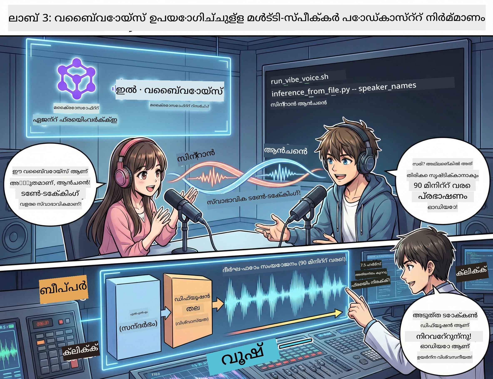

<!--
CO_OP_TRANSLATOR_METADATA:
{
  "original_hash": "bb2a3cf5ebd0ec8211af960a004fc23d",
  "translation_date": "2026-01-05T12:35:56+00:00",
  "source_file": "WorkshopForAgentic/md/03.Multi-SpeakerPodcastGenerationWithVibeVoice.md",
  "language_code": "ml"
}
-->
# അദ്ധ്യായം 3: നിങ്ങളുടെ പോഡ്കാസ്റ്റ് ജീവിതത്തിലേക്ക് കൊണ്ടുവരൂ 🎤



## മഹത്തായ അവസാനം

നിങ്ങൾ വിഷയങ്ങൾ പരിശോധിച്ചു. നിങ്ങൾ സ്‌ക്രിപ്റ്റുകൾ എഴുതി. ഇപ്പോൾ മുകളിലെ ചെറു പൂച്ച് ചേരാം: നിങ്ങളുടെ എഴുതിയ വാചകത്തെ യഥार्थ പോഡ്കാസ്റ്റ് ശബ്ദമായി മാറ്റാൻ!

നിങ്ങൾ കാണുക **VibeVoice** — മൈക്രോസോഫ്റ്റ് റിസർച്ച് നിർമ്മിച്ച ഒപ്പൺ-സോഴ്സ് TTS (വാചകത്തിൽ നിന്ന് ശബ്ദം) മാജിക്ക്, ഇത് സൃഷ്ടിക്കുന്നു:
- 🎭 സ്വാഭാവികമായ സംഭാഷണങ്ങൾ
- 👥 ബഹുവിദംsprecher (4 വരെ!)
- ⏱️ ദൈർഘ്യമുള്ള ശബ്ദം (90 മിനിറ്റ് വരെ!)
- 🎵 പ്രകടനശീലത്തോടെ പ്രസവം (റോബോട്ടു ശബ്ദങ്ങൾ അല്ല!)

ഇതാണ് സിന്തറ്റിക് പോഡ്കാസ്റ്റുകളുടെ പിന്നിൽ ഉള്ള സാങ്കേതിക വിദ്യ. നിങ്ങളുടെ നിർമ്മിക്കാം!

## VibeVoice എന്താണ്? (അദ്ഭുത ദിവസങ്ങൾ)

VibeVoice മൈക്രോസോഫ്റ്റ് റിസർച്ചിന്റെ ലോകത്തിന് ചെയ്ത സമ്മാനം ആണ്. ഇത് പ്രത്യേകിച്ച് പോഡ്കാസ്റ്റ് ശൈലിയിലെ സംഭാഷണശബ്ദത്തിന് രൂപകൽപ്പന ചെയ്തതാണ്.

### ഇത് എന്തുകൊണ്ട് അപൂർവമാണ് 🔥

* **⏱️ മാരാതോൺ സെഷനുകൾ**: തുടർച്ചയായി 90 മിനിറ്റ് ശബ്ദം സൃഷ്ടിക്കുന്നു (അത് ഒരു മുഴുവൻ പോഡ്കാസ്റ്റ് എപ്പിസോഡിന് സമം!)
* **👥 ബഹുവേദി മാജിക്**: 4 വ്യത്യസ്ത സ്വഭാവങ്ങളുള്ള ശബ്ദങ്ങൾ ഉണ്ടായിരിക്കും
* **⚡ അത്യന്തം കാര്യക്ഷമം**: ഹൈപ്പർ-ലോ 7.5 Hz ഫ്രെയിം നിരക്ക് ഉപയോഗിച്ച് കംപ്യൂട്ട് ശക്തി ലാഭിക്കുന്നു
* **🧠 ബുദ്ധിമുട്ടുള്ള ശബ്ദം**: LLM (കൊണ്ടെക്സ്റ്റ് മനസിലാക്കുന്നു) ഡിഫ്യൂഷൻ മോഡലുമായി (യഥാർത്ഥ ശബ്ദം സൃഷ്ടിക്കുന്നു) കൂട്ടിച്ചേർക്കുന്നു
* **🎭 സ്വാഭാവിക പ്രവാഹം**: തവണാകൽ, ഇടവേളകൾ, സംഭാഷണ താളം സ്വയം കൈകാര്യം ചെയ്യുന്നു

**പരിഭാഷ**: VibeVoice നന്നായി വായിക്കാത്തത് മാത്രമല്ല — അത് യഥാർത്ഥ ആളുകൾ സംസാരിക്കുന്ന പോലെ *പ്രകടിപ്പിക്കുന്നു*.

---

## തുടങ്ങിയതിന് മുൻപ് 🚀

**ആവശ്യം ഉള്ളവ**:

* 🐍 **Python 3.10+** (Acts 1 & 2-ൽ നിങ്ങൾക്കുണ്ട്)
* 🚀 **uv** (വേഗം പൈത്തൺ പാക്കേജ് മാനേജർ — നാം ഇൻസ്റ്റാൾ ചെയ്യും)
* 📝 **നിങ്ങളുടെ സ്‌ക്രിപ്റ്റ്**: Act 2-ൽ നിന്നുള്ള `podcast.txt` ഫയൽ (`../03.Application/` എന്നിടത്ത്)

**പ്രോ ടിപ്പ്**: ഈ ഘട്ടം പ്രീ-ട്രെയിൻഡ് മോഡൽ ഡൗൺലോഡ് ചെയ്യാൻ നല്ല ഇന്റർനെറ്റ് കണക്ഷൻ ആവശ്യമാണ്. ഒരു കാപ്പി എടുക്കൂ! ☕

---

## പോകാം! എളുപ്പമായ വഴിയിലൂടെ 🎬

നാം ഇത് എളുപ്പത്തിൽ സജ്ജമാക്കിയിരിക്കുന്നു. ഒരു ഷെൽ സ്‌ക്രിപ്റ്റ് എല്ലാം ചെയ്യുന്നു.

### പ്രക്രിയ

1. **അംഗീകാരം നൽകുക**:
```bash
chmod +x run_vibe_voice.sh
```

2. **ഇത് ഓടിക്കുക**:
```bash
./run_vibe_voice.sh
```

3. **മാജിക്ക് കാത്തിരിക്കുക** (ആദ്യ-runൽ കുറച്ച് മിനിറ്റെടുക്കാം)

### പിന്നിലെ കാര്യങ്ങൾ 🎭

സ്‌ക്രിപ്റ്റ് ആണ് നിങ്ങളുടെ സ്വയം പ്രവർത്തിക്കുന്ന ശബ്‌ദ എഞ്ചിനീയർ:

1. **📥 VibeVoice ഡൗൺലോഡ് ചെയ്യുന്നത്**: GitHub-ലിൽ നിന്നുള്ള ഔദ്യോഗിക റിപോസിറ്ററി ക്ലോൺ ചെയ്യുന്നു
2. **📦 ആശ്രിതങ്ങൾ ഇൻസ്റ്റാൾ ചെയ്യുന്നു**: `uv pip` ഉപയോഗിച്ച് വേഗത്തിലുള്ള പാക്കേജ് ഇൻസ്റ്റാളേഷൻ
3. **🎬 ശബ്ദം സൃഷ്ടിക്കുന്നു**: ഇൻഫെറെൻസ് സ്ക്രിപ്റ്റ് ഓടിക്കുന്നു:
   * `--model_path`: പ്രീ-ട്രെയിൻഡ് VibeVoice-7B മോഡൽ
   * `--txt_path`: നിങ്ങളുടെ `podcast.txt` സ്‌ക്രിപ്റ്റ്
   * `--speaker_names`: ശബ്ദങ്ങൾ ഏർപ്പെടുത്തുന്നു (പൂർവ്വനിരോധനം Xinran & Anchen)

**ഫലം**: നിങ്ങളുടെ സ്‌ക്രിപ്റ്റ് യഥാർത്ഥ പോഡ്കാസ്റ്റ് എപ്പിസോഡായി മാറും! 🎉

---

## നിങ്ങളുടെ ദൗത്യം 🎯

ഇത് രസകരമാക്കാം:

### ടാസ്‌ക് 1: ഉള്ളടക്കം സൃഷ്ടിക്കുക
`../03.Application/podcast.txt` അടുക്കുക, രണ്ട് ആളുകൾ തമ്മിലുള്ള സംഭാഷണം എഴുതുക. ടെക്‌നോളജി, ശौഖീനം, എന്തിനും ഓർക്കാമോ! ദയവായി അതിനെ സംഭാഷണാത്മകമാക്കുക.

**ഫോർമാറ്റ് ഉദാഹരണം**:
```
Speaker 1: Hey! Did you hear about the new AI model?
Speaker 2: No way! Tell me more!
Speaker 1: It's called...
```

### ടാസ്‌ക് 2: ശബ്ദം സൃഷ്ടിക്കുക
സ്‌ക്രിപ്റ്റ് ഓടിക്കുക, മാജിക്ക് നടക്കുന്നത് കാണുക. ആദ്യവട്ടം കൂടുതൽ സമയം എടുക്കാം (മോഡൽ ഡൗൺലോഡ് ചെയ്യുമ്പോൾ).

### ടാസ്‌ക് 3: കേൾക്കൂ & വിശകലനം ചെയ്യൂ
- ഇത് സ്വാഭാവികമാണോ?
- സംസാരികൾ വ്യത്യസ്ത ശബ്ദങ്ങളാണോ?
- ടർൺ-ടേക്കിംഗ് സുതന്ത്രമാണോ?
- ഏത് മോണ്മെന്റുകളും റൊബോട്ടിക് ആണോ?

### ടാസ്‌ക് 4: പരീക്ഷണം (ധൈര്യമുള്ളവർക്ക്)
`run_vibe_voice.sh` എഡിറ്റ് ചെയ്ത് `--speaker_names` മാറ്റി പുതിയ ശബ്ദ കൂട്ടായ്മകൾ പരീക്ഷിക്കുക. VibeVoice-ൽ നിരവധി പ്രീ-ട്രെയിൻഡ് ശബ്ദങ്ങൾ ഉണ്ട്!

**ബോണസ് ചലഞ്ച്**: 3-സ്പീക്കർ സംഭാഷണം ശ്രമിക്കുക! 🎆

---

## കൂടുതൽ പഠിക്കാം 📚

* **🏠 പ്രോജക്റ്റ് ഹോംപേജ്**: [VibeVoice ഔദ്യോഗിക സൈറ്റ്](https://microsoft.github.io/VibeVoice/)
* **🤗 പ്രീ-ട്രെയിൻഡ് മോഡൽ**: [Hugging Face - VibeVoice-7B](https://huggingface.co/vibevoice/VibeVoice-7B)
* **📖 ഗവേഷണ പേപ്പർ**: സാങ്കേതിക വിദ്യയിൽ ആഴത്തിൽ കയറുക (നിങ്ങൾക്ക് ഇഷ്ടമുള്ളെങ്കിൽ)

> **⚠️ ഉത്തരവാദിത്വമുള്ള AI ഓർമപ്പെടുത്തൽ**: VibeVoice ശക്തമാണ്. അത് സദ്വിചാരത്തോടെ ഉപയോഗിക്കുക! ഡീപ്‌ഫെയ്ക് അല്ലെങ്കിൽ തെറ്റിദ്ധരിപ്പിക്കുന്ന ഉള്ളടക്കം സൃഷ്ടിക്കരുത്. ആളുകൾക്ക് സഹായകരമായ നല്ല കാര്യങ്ങൾ സൃഷ്ടിക്കുക. 🙏

---

## 🏆 അഭിനന്ദനങ്ങൾ! നിങ്ങൾ വിജയിച്ചു!

നിങ്ങൾ പൂർണ്ണ പൈപ്പ്‌ലൈനും പൂർത്തിയാക്കിയിരിക്കുന്നു:
1. ✅ **അദ്ധ്യായം 1**: കസ്റ്റം ടൂളുകളുമായി AI ഏജന്റ்கள் നിർമ്മിച്ചു
2. ✅ **അദ്ധ്യായം 2**: ബഹുഏജന്റ് വർക്‌ഫ്ലോ ഏകീകരിച്ചു
3. ✅ **അദ്ധ്യായം 3**: യഥാർത്ഥ പോഡ്കാസ്റ്റ് ശബ്ദം സൃഷ്ടിച്ചു

**ഇപ്പോൾ നിങ്ങൾക്കുണ്ട്**:
- പ്രവർത്തിക്കുന്ന AI ഗവേഷണ സഹായി
- ഒരു പൂര്‍ണ പോഡ്കാസ്റ്റ് ഉത്പാദന പ്രവൃത്തി процессы
- പങ്കുവെക്കാവുന്ന യഥാർത്ഥ ശബ്ദഫയൽ

### ഇനി എങ്ങനെ? 🚀

**നിങ്ങളുടെ പോഡ്കാസ്റ്റ് ആരംഭിക്കുക!**
- പോഡ്കാസ്റ്റ് പ്ലാറ്റ്‌ഫോമുകളിൽ അപ്‌ലോഡ് ചെയ്യുക
- സോഷ്യൽ മീഡിയയിൽ പങ്കുവെക്കുക
- തവണയ്ക്കും മെച്ചപ്പെടുത്തുക

**തുടർന്ന് നിർമ്മിക്കുക!**
- വ്യത്യസ്ത വിഷയങ്ങൾ പരീക്ഷിക്കുക
- കൂടുതൽ സംസാരികളെ പരീക്ഷിക്കുക
- പശ്ചാത്തല സംഗീതം ചേർക്കുക
- വെബ് ഇന്റർഫേസ് നിർമ്മിക്കുക
- എല്ലാം സ്വയം പ്രവർത്തിപ്പിക്കുക

**നിങ്ങളുടെ ജോലി പങ്കുവെക്കൂ!**
നമുക്ക് ടാഗ് ചെയ്യൂ! നിങ്ങൾ നിർമ്മിച്ച കാണിക്കുക. AI പോഡ്കാസ്റ്റ് വിപ്ലവം നിങ്ങൾ കൊണ്ട് തുടങ്ങുന്നു. 🎙️

---

**ചോദ്യങ്ങളുണ്ടോ? ആശയങ്ങളുണ്ടോ? വിജയകഥകൾ പങ്കുവെയ്ക്കണോ?** വർക്ക്ഷോപ്പ് ചാറ്റിൽ ചേർക്കൂ! 

**ഉള്ളടക്കം സൃഷ്ടിക്കുന്ന ഭാവിയിലേക്ക് സ്വാഗതം.** 🌟

---

<!-- CO-OP TRANSLATOR DISCLAIMER START -->
**ഡിസ്ക്ലെയിമർ**:  
ഈ രേഖ AI പരിഭാഷാ സേവനമായ [Co-op Translator](https://github.com/Azure/co-op-translator) ഉപയോഗിച്ച് വിവർത്തനം ചെയ്തതാണ്. നാം കൃത്യതയ്ക്ക് പ്രയത്നicemaram, ഓട്ടോമാറ്റിക് വിവർത്തനങ്ങളിൽ ചില പിഴവുകൾ അല്ലെങ്കിൽ തകർച്ചകൾ ഉണ്ടാകാൻ സാധ്യതയുണ്ടെന്ന് ഗണ്യപ്പെടുത്തുക. നാടൻ ഭാഷയിലെ യഥാർത്ഥ രേഖ അധികാരപ്പെട്ട ഉറവിടമായി കണക്കാക്കണം. ഗുരുതരമായ വിവരങ്ങൾക്കായി പ്രൊഫഷണൽ മാനവ പരിഭാഷ ശുപാർശ ചെയ്യുന്നു. ഈ വിവർത്തനം ഉപയോഗിക്കുമ്പോൾ ഉണ്ടായേക്കാവുന്ന തെറ്റിദ്ധാരണകൾക്കോ തെറ്റിപ്രത്യാഖ്യാനങ്ങൾക്കോ ഞങ്ങൾ ഉത്തരവാദിത്വം വഹിക്കുന്നില്ല.
<!-- CO-OP TRANSLATOR DISCLAIMER END -->