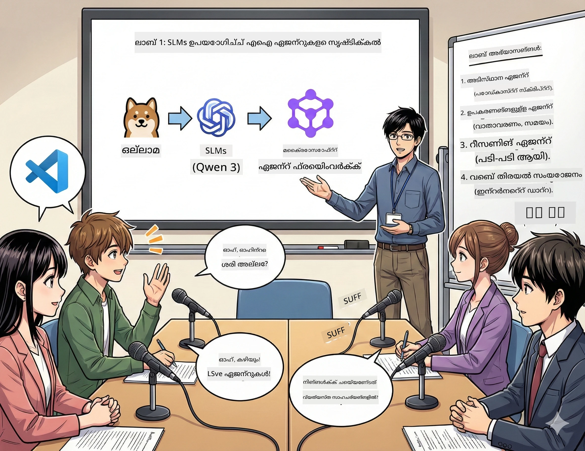

# 第一幕：നിന്റെ AI ഗവേഷണ സഹായിയെ പരിചയപ്പെടുക 🤖

## വെല്ലുവിളി

നീ പുതിയ സാങ്കേതിക പോഡ്കാസ്റ്റായ 「ഭാവി ബൈറ്റ്സ്」 പുറത്തിറക്കുന്നു. ആദ്യ എപ്പിസോഡ് ഏറ്റവും പുതിയ AI പുരോഗതിയെക്കുറിച്ചാണ്, പക്ഷേ അതിനായി നീയ്ക്ക് 24 മണിക്കൂറിനുള്ളിൽ ചെയ്യേണ്ടതുണ്ട്:
1. വിഷയം അന്വേഷിക്കുക
2. വിശ്വാസനീയമായ ഉറവിടങ്ങൾ കണ്ടെത്തുക
3. ആകർഷകമായ ഒരു സ്ക്രിപ്റ്റ് എഴുതുക
4. അത് സ്വാഭാവികമായി കേൾക്കപ്പെടുന്ന തരത്തിലാക്കുക

**കഥാവഴി**: നീ ഇതെല്ലാം ഒറ്റക്കല്ല ചെയ്യേണ്ടതില്ല. നീ നിന്റെ ആദ്യ AI സഹായി നിർമ്മിക്കാനിരിക്കുകയാണ്, ഇത് ഈ എല്ലാം ചെയ്യാൻ സഹായിക്കുമെന്ന്‌. നാം ഇതിന് Alex എന്ന് പേരടങ്ങാം —— ഒറ്റദിവസം വിട്ടുപോകരുതാത്ത, വിശ്രമം ആവശ്യമില്ലാത്ത നിന്റെ ഗവേഷണ പങ്കാളി.

## ചെറിയ ഭാഷാമോഡലുകൾ തിരഞ്ഞെടുക്കാൻ എന്തിന്?（റഹസ്യം: അവ മികച്ചതാണ്）

സെല്ലുലർ ഭാഷ മോഡലുകൾ (SLM) നിന്റെ സ്വന്തം കംപ്യൂട്ടറിൽ പ്രവർത്തിക്കുന്ന വ്യക്തിഗത AI ആണെന്നുപറയാം. ക്ലൗഡ് ഇല്ല, മാസാന്ത ഫീസ് ഇല്ല, അനിശ്ചിത ഡാറ്റ പങ്കുവെപ്പ് ഇല്ല.

**SLM എന്തിനാണ് ഇത്ര🔥:**
- **🏠 നിന്റെ മെഷീനിൽ പ്രവർത്തിക്കുന്നു**: ലാപ്‌ടോപ്പിൽ, ഡെസ്ക്ടോപ്പിൽ, പവർഫുൾ റാസ്ബെറി പൈയിലും
- **💸 തുടർച്ചമായ ചെലവ് ഇല്ല**: നിങ്ങളുടെ ചെറുകൈപ്പണം API ഫീസുകൾ നശിപ്പിക്കാനില്ല
- **🔒 സ്വകാര്യത മുൻഗണന**: നിങ്ങളുടെ ഡാറ്റ നിങ്ങളുടെ ഉപകരണത്തിനുള്ളിൽ മാറ്റിമറിക്കുകയില്ല
- **⚡ ബ്രഹ്മാണ്ഡ സൗരവ് പോലെ വേഗം**: നെറ്റ്‌വർക്കിംഗ് വൈകിപ്പിക്കൽ ഇല്ല, ഉടൻ പ്രതികരണം
- **🪦 ലളിതം**: 10 ബില്യൺ-100 ബില്യൺ പാരാമീറ്റർ, വലിയ മോഡലുകളുടെ 1000 ബില്യണിൽക്കാൾ ചെറിയ

**പ്രസിദ്ധമായ SLM**: Qwen 3, Phi-4, Gemma 3 (ഈ വർക്ക്‌ഷോപ്പ് Qwen ഉപയോഗിക്കുന്നു)

## നിന്റെ സജ്ജീകരണം

### Ollama: നിന്റെ AI മോഡൽ മാനേജർ

[Ollama](https://ollama.com/) എന്നത് AI മോഡലുകളുടെ Steam പോലെയാണ്. ലളിതമായ കമാൻഡ് ഉപയോഗിച്ച് മോഡലുകൾ ഡൗൺലോഡ് ചെയ്യാനും പ്രവർത്തിപ്പിക്കാനും നിയന്ത്രിക്കാനും കഴിയും.

**ഇത് കൂൾ ആകാൻ കാരണങ്ങൾ:**
- ഒരു കമാൻഡ് കൊണ്ട് ഏത് മോഡലും ഡൗൺലോഡ് ചെയ്ത് പ്രവർത്തിപ്പിക്കാൻ കഴിയും
- Mac, Windows, Linux എന്നിവയുമായ അനുകൂലത
- GPU ഉണ്ടെങ്കിൽ അത് താനായി ഉപയോഗിക്കുന്നു
- മെമ്മറി വളരെ സംരക്ഷിക്കുന്നു

### Microsoft Agent Framework: മായാജാലം ഉണ്ടാകുന്ന സ്ഥലം

[Microsoft Agent Framework](https://github.com/microsoft/agent-framework) നിന്റെ AI ഏജന്റുകൾ നിർമ്മിക്കുന്ന കളിസ്ഥലമാണ്, അവสามารถ:

- 💬 സംഭാഷണം നടത്തുകയും നിങ്ങളുടെ സംസാര വിഷയങ്ങൾ ഓർക്കുകയും ചെയ്യുന്നു
- 🛠️ ഇഷ്ടാനുസൃത ഉപകരണങ്ങൾ ഉപയോഗിക്കുന്നു (ഉദാ: വെബിൽ തിരയൽ, കാലാവസ്ഥ പരിശോധിക്കൽ)
- 🧠 ഉൾക്കാഴ്ചയോടെ സമസ്യകൾ അനാലിസിസ് ചെയ്യുന്നു
- 🤝 സംഘമായി മറ്റു ഏജന്റുകളുമായി സഹകരിക്കുന്നു
- 🔌 വിവിധ AI വിതരണക്കാരുമായി ബന്ധിപ്പിക്കുന്നു (OpenAI, Ollama, Azure)

**ഘടകങ്ങൾ:**
- **ഏജന്റുകൾ (Agents)**: നിശ്ചിത കാര്യങ്ങൾ നിർവഹിക്കുന്ന AI സഹായികൾ
- **ഉപകരണങ്ങൾ (Tools)**: നിങ്ങൾ അവയ്ക്ക് നൽകുന്ന പ്രത്യേക ശേഷികൾ
- **മെമ്മറി (Memory)**: അവ ഇടപാടുകളും സംഭാഷണങ്ങളും മറക്കാതെ കാത്തുസൂക്ഷിക്കുന്നു
- **ചിന്താനിരീക്ഷണം (Reasoning)**: ഫലങ്ങൾ മാത്രം മറുപടിയല്ല, കൃത്യമായ ചിന്തനം പഠിപ്പിക്കുന്നു

## നിന്റെ പരിശീലന മോണ്റാജ്: 4 ടാസ്ക്കുകൾ

### ടാസ്‌ക് 1: നിന്റെ ആദ്യ AI ഏജന്റ് സൃഷ്ടിക്കുക

📓 [Notebook തുറക്കുക](../../code/01.BasicAgent/00.BasicAgent-agent.ipynb)

**ടാസ്‌ക്**: Alex എന്ന播客് സ്ക്രിപ്റ്റ് രചിക്കുന്ന AI നിർമിക്കുക. Alex രണ്ട് ഹോസ്റ്റുമാർ технологി വിഷയങ്ങൾ ചർച്ച ചെയ്യുന്ന സംഭാഷണം സൃഷ്ടിക്കും.

**നീ പഠിക്കുന്നത്:**
- AI ഏജന്റിനെ എങ്ങനെ പ്രവർത്തിപ്പിക്കാം (ഓണിംഗ് ചെയ്യുന്നത് കണക്കുകൂട്ടാനാകും)
- അതിന് വ്യക്തിത്വംയും നിർദ്ദേശങ്ങളും നൽകുക
- യാഥാർത്ഥ്യപോലുള്ള പോഡ്കാസ്റ്റ് സ്ക്രിപ്റ്റ് സൃഷ്ടിക്കുക
- അത് നിന്റെ ചോദിച്ച കാര്യങ്ങൾക്ക് എങ്ങനെ മറുപടി നൽകുന്നു മനസ്സിലാക്കുക

**വിജയം**: Alex നിന്റെ 「ഭാവി ബൈറ്റ്സ്」 AI തിരിച്ചറിയൽ എപ്പിസോഡിന് അനുയോജ്യമായ സ്ക്രിപ്റ്റ് സൃഷ്ടിക്കുക! 🎯

### ടാസ്‌ക് 2: Alex ന് സൂപർപവർ നൽകുക (ഉപകരണങ്ങൾ!)

📓 [Notebook തുറക്കുക](../../code/01.BasicAgent/01.BasicAgent-tools.ipynb)

**ടാസ്‌ക്**: Alex ബുദ്ധിമാനാണ്, പക്ഷേ ഇന്ന് കാലാവസ്ഥ എങ്ങനെ എന്നോ or ഇപ്പോൾ സമയം എന്തെന്നോ അറിയില്ല. അതിന്റെ പ്രശ്നങ്ങൾ പരിഹരിക്കാൻ അതിന് ഉപകരണങ്ങൾ നൽകുക!

**നീ പഠിക്കുന്നത്:**
- ഇഷ്ടാനുസൃത Python ഫംഗ്ഷനുകൾ "ഉപകരണങ്ങൾ" ആയി സൃഷ്ടിക്കുക
- Alex അവ സ്വയം തിരഞ്ഞെടുക്കുകയും ഉപയോഗിക്കുകയും ചെയ്യുക
- അതിന്റെ സ്വതന്ത്ര പ്രശ്നപരിഹാരങ്ങൾ കാണുക
- പരിമിതമുള്ള വിവിധ ഉപകരണങ്ങൾ സംയോജിപ്പിച്ച് സങ്കീർണ്ണ ടാസ്ക്കുകൾ പൂർത്തിയാക്കുക

**വിജയം**: "ടോക്കിയോയിൽ കാലാവസ്ഥ എങ്ങനെ?" എന്ന് ചോദിച്ചാല്‍ Alex സ്വയം ഉത്തരം കണ്ടെത്തും! ☁️

### ടാസ്‌ക് 3: Alex ചിന്തിക്കാൻ പഠിപ്പിക്കുക

📓 [Notebook തുറക്കുക](../../code/01.BasicAgent/02.BasicAgent-reasoning.ipynb)

**ടാസ്‌ക്**: Alex തനിക്കുള്ള പ്രവൃത്തിതുറപ്പ് കാണിക്കും. പ്രശ്നങ്ങൾ പരിഹരിക്കുമ്പോൾ കുറിക്കേണ്ടത് ഉത്തരം മാത്രമല്ല, അതിന്റെ ചിന്തനവും ആണ്.

**നീ പഠിക്കുന്നത്:**
- "ചിന്താഗതിദൃശ്യ രീതി" പ്രവർത്തിപ്പിക്കുക (ഗണിത പാഠത്തിൽ ജോലികൾ കാണിക്കുന്നത് പോലെ)
- Alex ന്റെ ചുവടുപിടിച്ച ചിന്തന പ്രക്രിയ കാണുക
- ചിന്തന ശ്രേണി അറിയുക
- Alex ആശ്ചര്യപ്പെടുമ്പോൾ ഡീബഗ് ചെയ്യുക

**വിജയം**: ഒരു ദോഷംപരമായ ഗണിത പ്രശ്നം ചോദിച്ച് Alex അതിനെ ചിന്തിക്കുന്നത് കാണുക! 🧠

### ടാസ്‌ക് 4: Alex നെ ഇന്റർനെറ്റുമായി ബന്ധിപ്പിക്കുക

📓 [Notebook തുറക്കുക](../../code/01.BasicAgent/03.BasicAgent-websearch.ipynb)

**ടാസ്‌ക്**: Alex ന് അറിവിൻറെ അവസാന തീയതി ഉണ്ട്. അതിനെ തുടർച്ചയിൽ വിവരങ്ങൾ ലഭ്യമാക്കാൻ വെബുമായ ബന്ധിപ്പിക്കുക!

**നീ പഠിക്കുന്നത്:**
- ഇഷ്ടാനുസൃത വെബ് തിരയൽ ഉപകരണം നിർമ്മിക്കുക
- ബാഹ്യ API ഇന്റഗ്രേറ്റ് ചെയ്യുക
- നെറ്റ്‌വർക്ക് പിശകുകൾ നന്നായി കൈകാര്യം ചെയ്യുക
- Alex ന്റെ പരിശീലന ഡേറ്റയ്ക്ക് പുറത്തുള്ള വിവരങ്ങൾ നേടുക

**വിജയം**: ഇന്നത്തെ സാങ്കേതിക വാർത്ത ചോദിച്ച് ഏറ്റവും പുതിയ ഫലങ്ങൾ നേടുക! 📰

## തുടങ്ങുന്നതിന് മുമ്പ് 🚀

**അവിഹിത ഉപകരണങ്ങൾ**:
- Python 3.10+ ഇൻസ്റ്റാൾ ചെയ്തിരിക്കുന്നതും
- Ollama പ്രവർത്തിക്കുന്നതും (`ollama --version` ഉപയോഗിച്ച് പരിശോധിക്കുക)
- Python എക്സ്റ്റൻഷൻ ഉൾപ്പെടെയുള്ള VS Code
- കുറഞ്ഞത് 8GB RAM (സുഗമമായ അനുഭവത്തിനായി 16GB ആവശ്യം)

## ടാസ്‌ക് ക്രമം

പൂർണ്ണ അനുഭവത്തിനായി Notebook-കൾ താഴെപ്പറയുന്ന ക്രമത്തിൽ പൂർത്തിയാക്കുക:

1. [00.BasicAgent-agent.ipynb](../../code/01.BasicAgent/00.BasicAgent-agent.ipynb) —— Alex നെ പരിചയപ്പെടുക (നിന്റെ ആദ്യ AI ഏജന്റ്)
2. [01.BasicAgent-tools.ipynb](../../code/01.BasicAgent/01.BasicAgent-tools.ipynb) —— അപ്ഗ്രേഡ് സമയം!
3. [02.BasicAgent-reasoning.ipynb](../../code/01.BasicAgent/02.BasicAgent-reasoning.ipynb) —— Alex ചിന്തിക്കാൻ പഠിപ്പിക്കുക
4. [03.BasicAgent-websearch.ipynb](../../code/01.BasicAgent/03.BasicAgent-websearch.ipynb) —— ഇന്റർനെറ്റ് ആക്സസ് അൺലോക്ക് ചെയ്യുക!

## നീ എന്ത് കൈവശം വയ്ക്കും

പഥനം കഴിഞ്ഞ്, നീ കഴിയും:

- ✅ നിന്റെ സ്വന്തം hardware-ൽ AI മോഡലുകൾ പ്രവർത്തിപ്പിക്കുക (ക്ലൗഡ് ആവശ്യമില്ല!)
- ✅ ഇഷ്ടാനുസൃത വ്യക്തിത്വവും കഴിവുകളും ഉള്ള AI ഏജന്റുകൾ നിർമ്മിക്കുക
- ✅ ഏജന്റുകൾക്ക് ഉപകരണങ്ങൾ നൽകുക, യഥാർത്ഥ പ്രശ്നങ്ങൾ പരിഹരിക്കാൻ
- ✅ ഏജന്റുകളുടെ ചിന്തന പ്രക്രിയ കാണിക്കുക
- ✅ ഏജന്റുകളെ ബാഹ്യ ഡേറ്റ സ്രോതസുകളുമായി ബന്ധിപ്പിക്കുക
- ✅ പ്രശ്നങ്ങൾ ഉണ്ടാകുമ്പോൾ ഡീബഗ് ചെയ്യുക

## പ്രശ്നങ്ങൾ സംഭവിച്ചാൽ (വന്നുപോകുന്നത് എങ്ങനെ ശരിയാക്കാം)🔧

### "Alex ലോഡ് ചെയ്യാൻ പാടുണ്ട്! മെമ്മറി മതിയില്ല!"

**പരിഹാരം**: നിന്റെ കമ്പ്യൂട്ടർ ബുദ്ധിമുട്ടുകയാണ്. മറ്റു ആപ്ലിക്കേഷനുകൾ അടച്ച് നോക്കൂ, അല്ലെങ്കിൽ ചെറുതായ മോഡൽ ഉപയോഗിക്കൂ. കുറഞ്ഞത് 8GB RAM ആവശ്യമാണ്.

### "Alex വളരെ മന്ദമാണ്"

**പരിഹാരം**: Ollama സെറ്റിംഗ്സിൽ GPU എക്സിലറേഷൻ ഓണാക്കുക. അല്ലെങ്കിൽ കോൺടെക്സ്റ്റ് വിൻഡോ ചെറുക്കൂ. വേഗതാഫലം മോഡ് ആണെന്ന് കരുതൂ!🏎️

### "ഉപകരണങ്ങൾ কাজ ചെയ്യുന്നില്ല!"

**പരിഹാരം**: നിന്റെ ഫംഗ്ഷൻ സിഗ്നേച്ചറുകൾ ശ്രദ്ധയോടെ പരിശോധിക്കൂ. Alex ഉപകരണങ്ങളുടെ പ്രവർത്തനം മനസ്സിലാക്കാൻ ശരിയായ തര ത്രട്ടു സൂചനകൾ വേണം. ഇത് അനിപാടമായ നിർദ്ദേശമെന്നായി കരുതൂ.

## ഉപകാരപ്രദമായ ലിങ്കുകൾ 🔗

- [Agent Framework ഡോക്യുമെന്റേഷൻ](https://github.com/microsoft/agent-framework) —— ഔദ്യോഗിക മാർഗ്ഗനിർദ്ദേശങ്ങളും ഉദാഹരണങ്ങളും
- [Ollama മോഡൽ ലൈബ്രറി](https://ollama.com/library) —— എല്ലാ ലഭ്യമായ മോഡലുകളും കാണുക
- [Qwen മോഡൽ](https://ollama.com/library/qwen3) —— നിന്റെ AI സഹായിയുടെ മസ്തിഷ്‌കം
- [കോഡ് ഉദാഹരണങ്ങൾ](https://github.com/microsoft/agent-framework/tree/main/python/samples) —— ഇവിടെ നിന്നു ആശയങ്ങൾ പകർത്തുക

## അടുത്തത്: രണ്ടാം അങ്കം 🎬

നിനക്ക് ഒരു ഏജന്റ് ഉണ്ട്. പക്ഷേ ഒരുപാടു ഏജന്റുക്കൾ ചേർന്ന് പ്രവർത്തിക്കുമ്പോൾ എന്താകും? രണ്ടാം അങ്കത്തിൽ നീ ഒരു സമ്പൂർണ പോഡ്കാസ്റ്റ് നിർമ്മാണ സംഘം സൃഷ്ടിക്കും:
- **ഗവേഷണ ഏജന്റ്**: മികച്ച ഉറവിടങ്ങൾ കണ്ടെത്തുക
- **ലൈഖന ഏജന്റ്**: ഉത്തമ സ്ക്രിപ്റ്റ് തയ്യാറാക്കുക
- **എഡിറ്റർ (നീ!)**: അനുമോദനം നൽകുകയോ മാറ്റങ്ങൾ ആവശ്യപ്പെടുകയോ ചെയ്യുക

നമ്മൾ ചില AI മായാജാലങ്ങൾ ഒരുക്കാം!→ [രണ്ടാം അങ്കം: നിന്റെ നിർമ്മാണ ടീം സജ്ജീകരിക്കൽ](02.AIAgentOrchestrationAndWorkflows.md)

---

**പഠനത്തിൽ കുടുങ്ങിയോ?** വർക്ക്‌ഷോപ്പിൽ ചോദിക്കൂ. നാം ഒരുമിച്ച് പഠിക്കാം!🙌

---

<!-- CO-OP TRANSLATOR DISCLAIMER START -->
**പ്രത്യാഖ്യാനം**:  
ഈ രേഖ [Co-op Translator](https://github.com/Azure/co-op-translator) എന്ന AI പരിഭാഷാ സേവനം ഉപയോഗിച്ച് പരിഭാഷപ്പെടുത്തിയിരിക്കുന്നു. നാം സത്യസന്ധതയ്ക്ക് ശ്രമിച്ചാലും, സ്വയം പ്രവർത്തിക്കുന്ന പരിഭാഷകളിൽ പിശകുകളോ തെറ്റുകളോ ഉണ്ടാകാമെന്ന് ദയവായി ശ്രദ്ധിക്കുക. അതിന്റെ മാതൃഭാഷയിലുള്ള യഥാർത്ഥ രേഖ അഥോറിറ്റേറ്റീവ് ഉറവിടമായി പരിഗണിക്കണം. സുപ്രധാന വിവരങ്ങൾക്കായി, പ്രൊഫഷണൽ മനുഷ്യ പരിഭാഷ ശുപാർശ ചെയ്യുന്നു. ഈ പരിഭാഷ ഉപയോഗിക്കുന്നതിൽ നിന്നുണ്ടാകുന്ന ഏതെങ്കിലും തെറ്റിദ്ധാരണകൾക്കോ തെറ്റായി വ്യാഖ്യാനിക്കുന്നതിലോ ഞങ്ങൾ ഉത്തരവാദിത്വമുള്ളവർ അല്ല.
<!-- CO-OP TRANSLATOR DISCLAIMER END -->