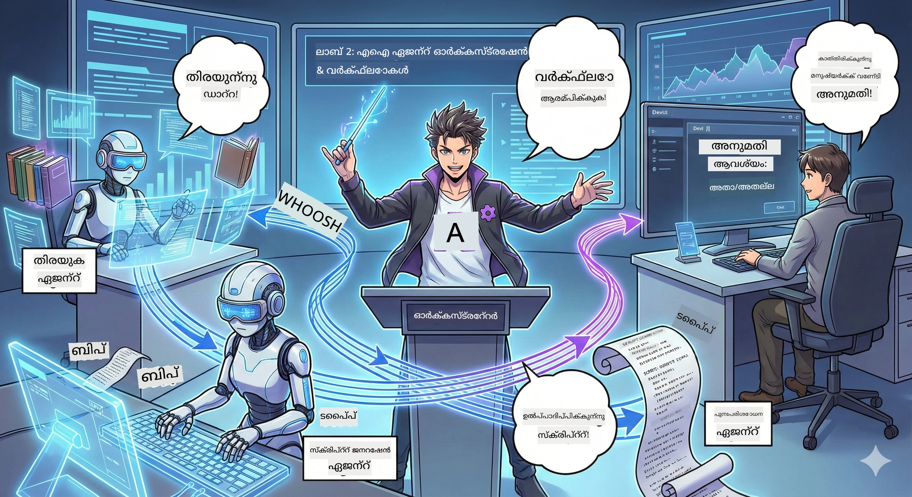

# രണ്ടാം അങ്കം: നിങ്ങളുടെ പോഡ്‌കാസ്‌റ്റ് നിർമ്മാണ ടീം രൂപീകരിക്കുക 🎬



## കഥാക്രമം തീവ്രമാകുന്നു

Alex(നിങ്ങൾ ആദ്യ അങ്കത്തിൽ ഉപയോഗിച്ച AI സഹായി) മികച്ചതാണ്, എന്നാൽ ഒരു ബുദ്ധിമത്തയുള്ള ഏജന്റ് മുഴുവൻ പോഡ്‌കാസ്‌റ്റ് സ്റ്റുഡിയോ പ്രവർത്തിപ്പിക്കാൻ മതിയാകില്ല. നിങ്ങൾക്ക് ഒരു *ടീം* ആവശ്യമുണ്ട്:
- 🔍 **ഗവേഷണ ഏജന്റ്**: പുതിയ വിവരങ്ങൾ അന്വേഷിക്കാൻ നെറ്റി തിരയുക
- ✍️ **സ്ക്രിപ്റ്റ് ഏജന്റ്**: ഗവേഷണം ആകർഷകമായ സംഭാഷണങ്ങളായി മാറ്റുക
- 👤 **നീ(എഡിറ്റർ)**: സ്ക്രിപ്റ്റ് അംഗീകരിക്കുക അല്ലെങ്കിൽ പുനഃരചനയ്ക്ക് തിരികെ അയയ്ക്കുക

സ്വാഗതം **AI ഏജന്റ് ഓർക്കസ്‌ട്രേഷൻ** ലേക്ക്—— നിങ്ങൾ നിങ്ങളുടെ AI ടീമിന്റെ ഡയറക്ടറാകുന്നു. Avengers ഭാര്യാ സംഘത്തെ പോലെ ചിന്തിക്കൂ, പക്ഷേ പോഡ്‌കാസ്റ്റ് നിർമ്മാണത്തിനായി.

## ഏജന്റ് ഓർക്കസ്‌ട്രേഷൻ എന്താണ്? (सरളമായ പതിപ്പ്)

നിങ്ങൾ ഒരു റസ്റ്റോറന്റ് ഓടിക്കുന്നതായി കണക്കാക്കൂ. നിങ്ങൾ ഒറ്റക്ക് എല്ലാം ചെയ്യും എന്ന് കരുതുന്നില്ല, അല്ലെ? നിങ്ങൾക്ക് ഉണ്ട്:
- 🍳 പാചകക്കാർ ഭക്ഷണം പാകം ചെയ്യാൻ
- 👨‍🍳 അസിസ്റ്റന്റ് പാചകക്കാർ ഒരുക്കങ്ങൾക്ക്
- 👩‍🍳 വേറ്റർ ഭക്ഷണം എത്തിക്കാൻ

എന്ന് പറഞ്ഞാൽ, AI ഉപയോഗിച്ചാണ് ഏജന്റ് ഓർക്കസ്‌ട്രേഷൻ. ഓരോ ഏജന്റിനും പ്രത്യേക കഴിവ് ഉണ്ട്, നിങ്ങള് അവയെ ഏകോപിപ്പിച്ച് വലിയ ലക്ഷ്യങ്ങൾ നേടിക്കുന്നു. ഒരു ഏജന്റിനും പ്രധാനഭാരമില്ല, പ്രവർത്തനം വേഗതയുള്ളത്.

### ബാൻഡ് അനാലജി 🎸

നിങ്ങളുടെ AI ഏജന്റ് ഒരു ബാൻഡിനുപോലെയാണ്:
- ** vocals**: ഉപഭോക്തൃ നേരിട്ടുള്ള പ്രവൃത്തികൾ കൈകാര്യം ചെയ്യുന്ന പ്രധാന ഏജന്റ്
- **ഡ്രമ്മർ**: റിതം സൂക്ഷിക്കുക, ബാക്ക്എണ്ട് പ്രോസസ്സ് കൈകാര്യം ചെയുക
- **ബേസ് ഗിറ്റാർ**: എല്ലാവർക്കും പിന്തുണ നൽകുന്നു, ഡാറ്റ ശേഖരിക്കുന്നു
- **നീ(ബാൻഡ് മാനേജർ)**: എല്ലാവർക്കും ഏകോപനം നൽകുന്നു!

ഏകോപനം ഇല്ലെങ്കിൽ? ശബ്ദം മാത്രം. ഓർക്കസ്‌ട്രേഷൻ ഉണ്ടായാൽ? മനോഹരമായ സംഗീതം.

### ഇത് എന്തുകൊണ്ട് പ്രധാനമാണ്

ഒരു AI ഏജന്റ് എല്ലാം ചെയ്യാൻ ശ്രമിക്കുന്നത് = ബർണ്ഔട്ട്. വിദഗ്ധ ഏജന്റുകളും ചേർന്ന് പ്രവർത്തിക്കുന്നത് = കാര്യക്ഷമത തുറന്നു കൊടുക്കല്!🚀

**സഗ്രഹം പറയുമ്പോൾ**: നിങ്ങൾ ഇൻഡിവിഡ്വലായി ഗവേഷണം, రచിക്കൽ, എഡിറ്റിങ് ചെയ്യാൻ ശ്രമിച്ചിരുന്നോ? ആണെങ്കിൽ, അത് ബുദ്ധിമുട്ടാണ്. ഓർക്കസ്‌ട്രേഷന്‍ വഴി, ഓരോ ഏജന്റും അതിന്റെ ഏറ്റവും മികച്ച കാര്യങ്ങൾ ചെയ്യുന്നുണ്ട്. നിങ്ങൾക്ക് അവസാനം തീരുമാനമെടുക്കാം മാത്രം.

**കുഴപ്പമില്ലാ ഉദാഹരണം**: കസ്റ്റമർ സർവീസ് ബോട്ട് ബില്ലിംഗ് കാര്യങ്ങൾ കൈകാര്യം ചെയ്യുന്നത്, സാങ്കേതിക പ്രശ്‌നങ്ങൾക്ക് മറുപടി കൊടുക്കുന്നത്, മാത്രമല്ല ആവശ്യമെങ്കിൽ മനുഷ്യനെ വിളിക്കുന്നത് അറിയുന്നു. അതാണ് ഓർക്കസ്ട്രേഷൻ!

## ഏജന്റ് vs വർക്ക്ഫ്ലോ: വ്യത്യാസമുണ്ടോ?

ഇങ്ങനെ ചിന്തിക്കൂ:

### 🤖 AI ഏജന്റ് = ജാസ്സ് സംഗീതജൻ
- **നിരീക്ഷണ അനുസരിച്ച് തീരുമാനം എടുക്കുന്നു** 
- **സ്വതന്ത്രമായി സൃഷ്ടിക്കുന്നു** അതിന്റെ ഉപകരണങ്ങൾ ഉപയോഗിച്ച്
- **ചിന്തിക്കുന്നു** LLM ന്യൂറൽ നെറ്റ്വർക്ക് ഉപയോഗിച്ച് 
- **മാറിപ്പോകുന്നു** എന്തും നിങ്ങള് അയയ്ക്കുന്നവയ്ക്ക്

### 🎵 വർക്ക്ഫ്ലോ = ഓർക്കസ്ട്ര ത്തർ ഒരു ക്ലാസിക് സംഗീതം വായിക്കുന്നു
- **സംഗീത പട്ടിക അനുസരിക്കും** (മുൻകൂട്ടി നിർവ്വചിച്ച രീതികൾ)
- **അനുപാതമായ കാർയ്യനിർവ്വഹണം**
- **ഒന്നിലധികം ഏജന്റുകൾ, ആളുകൾ, സിസ്റ്റങ്ങൾ ഏകോപിപ്പിക്കുന്നു**
- **സൂക്ഷ്മമായ ഘടന, ഒരു റെസിപ്പി പോലുള്ളത്**

**മന്ത്രം**: വർക്ക്ഫ്ലോ *ഓർക്കസ്‌ട്രേറ്റ്* ചെയ്യുന്നു ഏജന്റുകള്! നിങ്ങൾ ഒരു വർക്ക്ഫ്ലോ നിർമ്മിച്ച്, ഏജന്റുകൾ എപ്പോൾ എന്നപോലെ പ്രവർത്തിക്കണമെന്ന് നിർദ്ദേശിക്കുന്നു. രണ്ട് വളരെയധികം നേട്ടങ്ങൾ. 🎭

## AI ടീമിനെ ഏകീകരിക്കാൻ താൽപര്യമുള്ള മൂന്ന് മാർഗങ്ങൾ

### 1. 🎯 കേന്ദ്രീകൃതമാക്കി (നിങ്ങൾ ബോസ്)

ഒരു പ്രധാന ഏജന്റ് നിർദ്ദേശങ്ങൾ നൽകുന്നു. നിങ്ങൾ ഒരു ടീമിനെ നിയന്ത്രിക്കുന്ന പോലെ — ഏതു പ്രവർത്തി ആരെ നിർവ്വഹിക്കും എന്നും തീയതി നിർണ്ണയിക്കുന്നു.

**നീതികൾ**:
- ✅ വ്യക്തമായ നേതൃം (കൂരക്കഴിവില്ലാതെ)
- ✅ ഏകോപിത തീരുമാനങ്ങൾ
- ✅ ഡീബഗ് ചെയ്യാൻ എളുപ്പം

**ഉപയോഗം**:
- കസ്റ്റമർ സർവീസ് റൂട്ടിങ് ("ഇത് ബില്ലിംഗ് ആണ്, അല്ലെങ്കിൽ ടെക്നിക്കൽ സഹായം?")
- ഉള്ളടക്കത്തിനുള്ള അംഗീകാരം ("ഇത് സ്ക്രിപ്റ്റ് അംഗീകരിച്ചോ?")
- പോഡ്‌കാസ്റ്റ് നിർമ്മാണം (ഇപ്പോൾ നാം നിർമ്മിക്കുന്നതു)

### 2. 🤝 ഡിസ്പെർഷൻഡ് (സ്വയം സംഘടന ചെയ്യുന്‍ ഏജന്റുകൾ)

ഏജന്റുകൾ നേരിട്ട് സംസാരിച്ച് ഒരു കൂട്ടമായി പ്രശ്നങ്ങൾ പരിഹരിക്കുന്നു. എല്ലാവരും ഏകോപിപ്പിക്കുന്ന ഒരു ഗ്രൂപ്പ് ചാറ്റ് പോലെയാണ്.

**നീതികൾ**:
- ✅ എളുപ്പമുള്ള സ്കെയിലിംഗ് (ഏവിടെയെങ്കിലും ഏജന്റുകൾ കൂട്ടിച്ചേർക്കാം)
- ✅ ഒറ്റ പോയിന്റ് ഫയല്യൂർ ഇല്ല
- ✅ ഏജന്റുകൾ പ്രകൃതിപരമായി സഹകരിക്കുന്നു

**ഉപയോഗം**:
- ഗവേഷണ ടീം (എല്ലാ ഏജന്റും വ്യത്യസ്ത വക്കേഷൻ ഉപയോഗിക്കുന്നു)
- ബ്രെയിൻസ്റ്റോർം മീറ്റിംഗുകൾ
- വിതരണപ്രശ്‌ന പരിഹാരം

### 3. 🔀 ഹൈബ്രിഡ് (രണ്ടിന്റേയും മികച്ചതാണ്)

നീ ഏറെക്കുറെ ആധികാരികമായി സംവിധാനം ചെയ്യുന്നു, പക്ഷേ ഏജന്റുകൾ സ്വതന്ത്രമായി പ്രവർത്തിക്കുന്നു. ഒരു വിശ്വാസ സ്ഥാപന CEO പോലെയാണ്.

**പരിപൂർത്തിക്ക്**: നിയന്ത്രണവും വിശാലതയും ആവശ്യമുള്ള പ്രോജക്റ്റുകൾ.

## Microsoft Agent Framework: നിങ്ങളുടെ ഓർക്കസ്‌ട്രേഷൻ കിറ്റ് 🧰

നിർമ്മിക്കാൻ സമയമാണ്! നിങ്ങൾ ഉപയോഗിക്കുന്നത്:

### ഘടകങ്ങൾ

#### 1. 🧱 Executor (നിങ്ങളുടെ തൊഴിലാളികൾ)
- **അവർ ആര്**: ഒറ്റപ്പെട്ട പ്രോസസ്സിംഗ് യൂണിറ്റുകൾ — ഏജന്റോ കസ്റ്റം ലൊജിക്കോ ആയിരിക്കാം
- **അവർ എന്ത് ചെയ്യും**: ഇൻപുട്ട് സ്വീകരിക്കുക, ജോലി പൂർത്തിയാക്കുക, ഔട്ട്പുട്ട് നൽകുക
- **അവതാരിക**: Assembly line ലെ വർക്ക് സ്റ്റേഷൻ പോലെ

#### 2. ➡️ എഡ്ജുകൾ (കണക്ഷനുകൾ)
- **അവർ ആര്**: എക്സിക്യൂട്ടറുകളുടെ ഇടയിലെ പാതകൾ
- **അവർ എന്ത് ചെയ്യും**: മെസേജ് ഫ്ളോ നിയന്ത്രിക്കുക ("A കഴിഞ്ഞ് B ആയി പോകുക")
- **അവതാരിക**: ഫ്ലോചാർട്ട്上的 അമ്പുകൾ

#### 3. 🗺️ Workflow (മൂല്യനിർണ്ണയം)
- **അവർ ആര്**: എക്സിക്യൂട്ടറുകളും എഡ്ജുകളും ചേർന്ന ഭാഷ്യം
- **അവർ എന്ത് ചെയ്യും**: ആരംഭത്തിൽ നിന്ന് അവസാനം വരെ പൂർണ്ണ പരിധി നിർവചിക്കുക
- **അവതാരിക**: നിങ്ങളുടെ നിർമ്മാണ പ്രവർത്തനത്തിന്റെ പ്ലാൻ

### നിങ്ങൾ ഇഷ്ടപ്പെടുന്ന മികച്ച സവിശേഷതകൾ

**🛡️ ടൈപ്പ് സെഫ്റ്റി**: ഏജന്റുകൾ തമ്മിലുള്ള സന്ദേശങ്ങൾക്ക് ടൈപ്പ് പരിശോധിക്കൽ ഉണ്ട്. "അയ്യോ! തെറ്റായ ഡാറ്റാ ടൈപ്പ്" മാറ്റങ്ങൾ ഇല്ല.

**🔀 ഫ്ലെക്സിബിൾ റൂട്ടിങ്**:
- ഇഫ്-തെൻ നിബന്ധനകൾ ("അംഗീകരിച്ചാൽ പ്രസിദ്ധീകരിക്കുക; അല്ലെങ്കിൽ പുനഃരചന")
- പാരലൽ പ്രോസസ്സിംഗ് (ഏജന്റുകൾ ഒരേ സമയം ജോലി ചെയ്യുന്നു)
- ഡൈനാമിക് പാത (ഫലങ്ങൾ അനുസരിച്ചു വർക്ക്ഫ്ലോ മാറ്റങ്ങൾ)

**🔌 എക്സ്റ്റേണൽ ഇൻ്റഗ്രേഷൻ**:
- API കൾക്ക് കണക്ട് ചെയ്യുക
- മാനുവൽ ചെക്ക്‌പോയിൻ്റുകൾ ചേർക്കുക (നിങ്ങൾ പ്രസിദ്ധീകരിക്കുന്നതിന് മുമ്പ് അംഗീകരിക്കുക)
- അഭ്യർത്ഥന/പ്രതികരണം ഫ്ലോ നിർമ്മിക്കുക

**💾 ചെക്‌പോയിന്റ്**: പുരോഗതി സംരക്ഷിക്കുക! എന്തെങ്കിലും തകരാറായി എങ്കിൽ നിന്ന ഇടം മുതൽ തുടരും.

**🤝 മൾട്ടി ഏജന്റ് ഏകോപനം**:
- ഏജന്റുകൾ ക്രമത്തിൽ ഓടിക്കുക (A → B → C)
- അവർ പാരലലായി ഓടുക (A + B + C ഒരുപോലെ)
- ഏജന്റുകൾ തമ്മിൽ കൈമാറ്റം
- സഹകരിച്ച് പ്രവർത്തിക്കുക

## മികച്ച പ്രായോഗിക മാർഗങ്ങൾ 🎯

### 1. മൊഡ്യൂളറാക്കുക
ഓരോ ഏജന്റും ഒരു കാര്യത്തിൽ നന്നായി അധിനിവೇಶിക്കണം. എല്ലാം ചെയ്യാൻ ശ്രമിക്കുന്ന "സൂപ്പർ ഏജന്റ്" ഉണ്ടാക്കരുത് — ഡീബഗ്ഗിംഗിനിടെ നിങ്ങൾക്ക് വെറുപ്പാകും.

### 2. പരാജയം കണക്കിലെടുക്കുക
ഏജന്റുകൾ പിഴച്ചു പോകും. നെറ്റ്വർക്ക് വീഴ്ച വരും. പിഴവ് കൈകാര്യം ചെയ്യാനും ബാക്കപ്പ് പ്ലാൻ ഉണ്ടാക്കാനും നിർദ്ദേശിക്കുക. നിങ്ങളുടെ ഭാവി ആത്മാവ് നന്ദി പറയും.

### 3. എല്ലാം നിരീക്ഷിക്കുക
ഏജന്റുകൾ എന്ത് ചെയ്യുന്നുവെന്ന് ട്രാക്ക് ചെയ്യുക. DevUI ഉപയോഗിച്ച് പ്രവർത്തനത്തിൽ ഉള്ള വർക്ക്ഫ്ലോകൾ കാണുക.

### 4. സന്ദേശ വലിപ്പം കൂടുതൽ പ്രയോജനപ്പെടുത്തി
എളുപ്പമാക്കാൻ ഏജന്റുകൾക്കിടയിലെ വൻ ഫയൽസ് അയക്കരുത്. സന്ദേശങ്ങൾ ചെറുതായി വയ്ക്കുക.

### 5. ശരിയായ മോഡൽ തിരഞ്ഞെടുക്കുക
നിയന്ത്രണം വേണോ? കേന്ദ്രീകൃതം തിരഞ്ഞെടുക്കുക. വലുപ്പം വേണോ? ഡിസ്പെർഷൻഡ് തിരഞ്ഞെടുക്കുക. തീരുമാനിക്കാനാകുന്നില്ലേ? ഹൈബ്രിഡ്.

## DevUI: നിങ്ങളുടെ വർക്ക്ഫ്ലോ ഡീബഗർ 🔍

### DevUI എന്തിനാണ്?

DevUI നിങ്ങളുടെ ഏജന്റുകളും വർക്ക്ഫ്ലോകളും പരീക്ഷിക്കുന്ന പ്ലേ ഗ്രൗണ്ടാണ്. ഇത് ഒരു വെബ് ഇന്റർഫെയ്‌സ്:
- 👀 നിങ്ങളുടെ വർക്ക്ഫ്ലോ പ്രവർത്തനം കാണുക
- 💬 നേരിട്ട് ഏജന്റുമായി ചെന്നെ
- 🔍 പിഴവുകൾ വിഷയിപ്പിക്കാൻ ഡീബഗ് ചെയ്യുക
- 📊 ട്രേസുകളും പ്രകടന സൂചനകളും കാണുക

> **പ്രധാനവും**: DevUI വികസനത്തിനായി മാത്രമാണ്! പ്രൊഡക്ഷനിൽ ഉപയോഗിക്കരുത്. നിങ്ങളുടെ ഉൾപ്രാദേശിക ടെസ്റ്റിംഗ് അന്തരീക്ഷമായി കണക്കാക്കുക.

### ഇതിന്റെ മികച്ച സവിശേഷതകൾ

- **🖥️ ഇന്ററാക്ടീവ് വെബ് UI**: ക്ലിക്ക് ചെയ്ത്, ടൈപ്പ് ചെയ്ത്, ടെസ്റ്റ് ചെയ്യുക — കമാൻഡ് ലൈൻ ആവശ്യക്കരുത്
- **📁 ഡ്രാഗ് ആൻഡ് ഡ്രോപ്പ് പിന്തുണ**: ഫയലുകൾ അപ്‌ലോഡ് ചെയ്യുക, വിവിധ ഇന്പുട്ടുകൾ പരീക്ഷിക്കുക
- **📂 ഓട്ടോ തിരിച്ചറിയൽ**: ഫോൾഡർ ഇൻഡിക്കേറ്റ് ചെയ്താൽ എല്ലാ ഏജന്റുകളെയും കണ്ടെത്തും
- **📋 മോഡൽ സജ്ജീകരണം ആവശ്യമില്ല**: കോഡിൽ രജിസ്റ്റർ ചെയ്ത ഏജന്റുകൾക്ക് ഫോൾഡർ ഘടന വേണ്ട
- **🔌 OpenAI സപ്പോർട്ട്**: OpenAI SDK അനുയോജ്യമാണ്
- **👁️ ഉൾക്കൊള്ളുന്ന ട്രേസിംഗ്**: ഏജന്റുകൾ ചെയ്യുന്നതെല്ലാം കൃത്യമായും കാണാൻ

### ഇൻപുട്ട് എങ്ങനെ പ്രവർത്തിക്കുന്നു

DevUI ഇൻപുട്ട് വളരെ ബുദ്ധിമുട്ടു കുറഞ്ഞതാണു:

- **ഏജന്റ് ടെസ്റ്റ് ചെയ്യുമ്പോൾ?** ടെക്സ്റ്റ് ബോക്സ്‌വും ഫയൽ അപ്‌ലോഡ് ബട്ടണും ലഭിക്കും
- **വർക്ക്ഫ്ലോ ടെസ്റ്റ് ചെയ്യുമ്പോൾ?** നിങ്ങളുടെ വർക്ക്ഫ്ലോ പ്രതീക്ഷിച്ചിരിക്കുന്ന ഇൻപുട്ടുകൾ അനുസരിച്ച് UI സ്വയം ഫീൽഡുകൾ സൃഷ്ടിക്കുന്നു

ഇതൊരു മാജിക് പോലെയാണ്, പക്ഷേ അത് നല്ല കോഡാണ് മാത്രം.✨

## നിങ്ങളുടെ ദൗത്യം: പോഡ്‌കാസ്റ്റ് സ്റ്റുഡിയോ നിർമ്മിക്കുക 🎬

### ദൗത്യം 1: DevUI ഉപയോഗിച്ച് ഒറ്റ ഏജന്റ് സൃഷ്ടിക്കുക

📂 [01.AgentDevUI](../../../../../WorkshopForAgentic/code/02.Workflow/01.AgentDevUI)

**ചിലവേലി**: പൂർണ്ണ ടീം നിർമ്മിക്കുന്നതിനു മുമ്പ്, ഒറ്റ ഏജന്റ് കൊണ്ട് DevUI പരീക്ഷിക്കുക: വെബ് സെർച്ച് വിദഗ്ദ്ധൻ.

**നിങ്ങൾ നിർമ്മിക്കുന്നതു**:
ഇന്റർനെറ്റിൽ പോഡ്‌കാസ്റ്റ് വിഷയം കണ്ടെത്താൻ കഴിവുള്ള ഗവേഷണ ഏജന്റ്. DevUI വെബ് ഇന്റർഫെയ്‌സ് `http://localhost:8090` ഉപയോഗിച്ച് പരീക്ഷിക്കും.

**നിങ്ങൾക്ക് ലഭിക്കുന്ന കഴിവുകൾ**:
- 🚀 DevUIയിൽ ഏജന്റ് സ്റ്റാർട്ട് ചെയ്യുക
- 🔍 ഏജന്റിന്റെ പ്രതികരണങ്ങൾ പ്രതീക്ഷിച്ചു നോക്കുക
- 🛠️ കസ്റ്റം ഉപകരണം നിർമ്മിക്കുക (വെബ് സെർച്)
- 📊 പ്രശ്നങ്ങൾ ഡീബഗ് ചെയ്യാൻ ട്രേസിംഗ് সক্ষমമാക്കുക
- 🖥️ ഇന്ററാക്ടീവ് വെബ് UI ഉപയോഗിക്കുക

**കോഡ്**:
- `agent.py`: നിങ്ങളുടെ വെബ് സെർച്ച് പരമാധികാരമുള്ള SearchAgent
- OllamaChatClient ഉപയോഗിച്ച് Qwen-ലും ബന്ധമുണ്ടാക്കുന്നു
- `web_search()` ടൂൾ ഫങ്ക്ഷൻ നടപ്പിലാക്കുക
- `serve()` ഓടിച്ച് DevUI ഓട്ടോമാറ്റിക്കായി തുറക്കുക

**വിജയം**: നിങ്ങളുടെ ഏജക്‌ടിന്റെ മുമ്പിൽ "AI മേഖലയിലെ ഹอต്സ്പോട്ടുകൾ എന്തെല്ലാം?" ചോദിച്ച് നെറ്റിൽ സെർച്ച് ചെയ്യുന്നത് കാണുക! 🎉

### ദൗത്യം 2: ബഹുഏജന്റ് വർക്ക്ഫ്ലോ നിർമ്മിക്കുക

📂 [02.WorkflowDevUI](../../../../../WorkshopForAgentic/code/02.Workflow/02.WorkflowDevUI)

**ചിലവേലി**: യഥാർത്ഥ രസതന്ത്രം ഇവിടെ തുടങ്ങുന്നു! പൂർണ്ണമായ പോഡ്‌കാസ്റ്റ് നിർമ്മാണ വർക്ക്ഫ്ലോ ഉണ്ടാക്കുക:
1. 🔍 **ഗവേഷണ ഏജന്റ്** → വിഷയം അന്വേഷിക്കുക
2. ✍️ **സ്ക്രിപ്റ്റ് ഏജന്റ്** → രണ്ട് ഹോസ്റ്റുകൾക്കിടയിലെ സംഭാഷണം എഴുതുക (ചൈനീസ് ഭാഷയിൽ!)
3. 👤 **അസോസിയേറ്റ് എക്സിക്യൂട്ടർ** → നിങ്ങളെ അംഗീകരിക്കലിന് ആവശ്യപ്പെടുക അല്ലെങ്കിൽ തള്ളുക
4. 🔄 **ലൂപ് ബാക്ക്** → തള്ളിയാൽ നിങ്ങളുടെ ഫീഡ്ബാക്കിന് അനുസരിച്ച് പുനഃരചന ചെയ്യുക

**നിങ്ങൾക്ക് ലഭിക്കുന്ന കഴിവുകൾ**:
- 🧱 വ്യത്യസ്ത ജോലികൾക്കായി സ്പെഷ്യലൈസ്ഡ് ഏജന്റുകൾ ഉണ്ടാക്കൽ
- 🔗 WorkflowBuilder ഉപയോഗിച്ച് ഏജന്റുകൾ കണക്റ്റ് ചെയ്യുക
- 🔀 അംഗീകാര ലൂപ് നടപ്പാക്കുക (മാനവ ഇടപെടലും!)
- 🚦 വ്യത്യസ്ത മാർഗ്ഗങ്ങളെ അനുസരിച്ചുള്ള റൂട്ടിങ് (അംഗീകരണവും നിരസണവും)
- 🔧 വ്യവസായ ലൊജിക്ക് ഉദ്ദേശിച്ച കസ്റ്റം എക്സിക്യൂട്ടർ നിർമ്മിക്കുക

**വർക്ക്ഫ്ലോ**:  
```
SearchAgent → ScriptAgent → ReviewExecutor
                             ↑          ↓ (如果被拒绝)
                             ←─────────
```


**കോഡ്**:
- `search_agent/agent.py`: നിങ്ങളുടെ ഗവേഷക വിദഗ്ദ്ധൻ
- `generate_script_agent/agent.py`: നിങ്ങളുടെ സ്ക്രിപ്റ്റ് എഴുത്തുകാരൻ (ചൈനീസ് മാറ്റാനായി!)
- `workflow/workflow.py`: ഇവിടെ ഓർക്കസ്‌ട്രേഷൻ മാജിക് നടക്കുന്നു
- `main.py`: DevUIൽ എല്ലാം സ്റ്റാർട്ട് ചെയ്യുക

**വിജയം**: ഒരു വിഷയം നൽകി, സ്ക്രിപ്റ്റ് പരിശോധിക്കുക, ഒരു തള്ളി പരീക്ഷണത്തിനു ശേഷം അംഗീകരിക്കുക! 🎉

### ദൗത്യം 3: കൺസോൾ ആപ്പ് നിർമ്മിക്കുക

📂 [03.Application](../../../../../WorkshopForAgentic/code/02.Workflow/03.Application)

**ചിലവേലി**: നിങ്ങളുടെ വർക്ക്ഫ്ലോ DevUIയിൽ നിന്ന് മാറ്റി, നിറഞ്ഞ നിറത്തിലുള്ള ഔട്ട്പുട്ട്, ലോഡിംഗ് സ്പിന്നർ, ഫയൽ സേവിംഗ് ഉള്ള മോഡേണ്‍ ടെർമിനൽ ആപ്പ് ആക്കുക. ഇത് പ്രൊഡക്ഷൻ റെഡി വേരിയന്റാണ്!

**നിങ്ങൾക്ക് ലഭിക്കുന്ന കഴിവുകൾ**:
- ⚡ പ്രോഗ്രാമാറ്റിക്കായി വർക്ക്ഫ്ലോ ഓടിക്കുക (DevUI ഇല്ലാതെ)
- 📡 സ്ട്രീമിംഗ് ഇവന്റ് ഡ്രിവൻ ആർക്കിടെക്ചർ ഉപയോഗിക്കുക
- 🎨 മനോഹരമായ ടെർമിനൽ UI (നിറം, സ്പിന്നർ, പ്രോഗ്രസ് ബാർ)
- 💾 അന്തിമ സ്ക്രിപ്റ്റ് ഫയലിൽ സേവിംഗ്
- 🔄 Python asyncio ഉപയോഗിച്ച് അസിങ്ക്രോണസ് വർക്ക്ഫ്ലോ കൈകാര്യം ചെയ്യുക

**എന്ത് ചെയ്യുന്നു**:
1. നിങ്ങളുടെ പോഡ്‌കാസ്റ്റ് വിഷയം ചോദിക്കുന്നു
2. ലൈവ് പ്രോഗ്രസ് കാട്ടുന്നു ("ഗവേഷണ ഏജന്റ് പ്രവൃത്തിയിൽ...")
3. നിറം നൽകുന്നGenerated സ്ക്രിപ്റ്റ് പ്രദർശിപ്പിക്കുന്നു
4. നിങ്ങളുടെ അംഗീകാരം ചോദിക്കുന്നു
5. അംഗീകരിച്ച സ്ക്രിപ്റ്റ് `podcast.txt` ഫയലിൽ സേവ് ചെയ്യുന്നു

**കോഡ്**:
- `podcast_app.py`: ഇവന്റ് ഹാൻഡ്ലിങ്ങോടുകൂടിയ മുഖ്യ ആപ്പ്
- `workflow.py`: ദൗത്യം 2 ലെ വർക്ക്ഫ്ലോ വീണ്ടും ഉപയോഗിക്കുക
- സംഭവങ്ങൾ കൈകാര്യംചെയ്യുക: `AgentRunUpdateEvent`, `RequestInfoEvent`, `WorkflowOutputEvent`
- ടെർമിനലിന് ANSI നിറങ്ങൾ ഉപയോഗിച്ച് സ്റ്റൈലിംഗ്

**വിജയകരമായ നിബന്ധന**: അപ്ലിക്കേഷൻ ഓടിക്കുക, പോഡ്കാസ്റ്റ് സ്‌ക്രിപ്റ്റ് സൃഷ്ടിക്കുക, അത് സംരക്ഷിക്കപ്പെടുന്നത് കാണുക! നിങ്ങൾ ഒരിക്കൽ സാദ്ധ്യതയുള്ള ഒരു ഉപകരണം നിർമ്മിച്ചിരിക്കുന്നു.🚀

## നിങ്ങൾ പഠിച്ചിരിക്കുന്നത് 🏆

രണ്ടാം ഘട്ടത്തിന് ശേഷം, നിങ്ങൾക്ക് കഴിയും:

- ✅ ബോസ് പോലെ ഒട്ടുമിക്ക AI ഏജൻറുകളെ ഏകോപിപ്പിക്കുക
- ✅ ക്രമവും നിബന്ധനാ ലൂജികും ഉള്ള വർക്ഫ്ലോകൾ നിർമ്മിക്കുക
- ✅ മാനുഷികമായ അംഗീകാരം ചെക്ക്‌പോയിന്റ് ചേർക്കുക
- ✅ DevUI ഉപയോഗിച്ച് വർക്ഫ്ലോ ടെസ്റ്റ് ചെയ്യുകയും ഡീബഗ് ചെയ്യുകയും ചെയ്യുക
- ✅ നിർമ്മാണത്തിന് തയ്യാറായ കോൺസോൾ അപ്ലിക്കേഷൻ സൃഷ്ടിക്കുക
- ✅ സങ്കീർണ്ണ സംവിധാനങ്ങളിൽ എററുകൾ കൃത്യമായി കൈകാര്യം ചെയ്യുക
- ✅ ഏത് പ്രോജക്റ്റിനും ശരിയായ ഏകോപന മാതൃക തിരഞ്ഞെടുക്കുക

## പ്രശ്നങ്ങൾ ഉണ്ടാകുമ്പോൾ 🔧

### "എന്റെ വർക്ഫ്ലോ വളരെ സങ്കീർണ്ണമാണ്!"
**പരിഹാരം**: അതിനെ ചെറിയ സബ്വർക്ഫ്ലോകളായി വിഭജിക്കുക. ഓരോ വർക്ഫ്ലോയും ഒരു കാര്യം ശരിയായി ചെയ്യണം. ആവശ്യമെങ്കിൽ അവ കൂട്ടി ബന്ധിപ്പിക്കുക.

### "എന്ത് സംഭവിക്കുന്നു എന്ന് ഞാൻ ട്രാക്ക് ചെയ്യാൻ കഴിയുന്നില്ല!"
**പരിഹാരം**: വർക്ഫ്ലോ ചെക്ക്‌പോയിന്റുകൾ ഉപയോഗിച്ച് സ്റ്റേറ്റ് സംരക്ഷിക്കുക. ഓരോ പടവും കാണുന്നതിനായി DevUI-ൽ ട്രാക്കിംഗ് ഓണാക്കുക.

### "ഒരു ഏജൻറിന്റെ പിഴവ് എല്ലാം തകർന്നിടും!"
**പരിഹാരം**: പിഴവ് പരിധികൾ ചേർക്കുക. ഓരോ ഏജൻറിനും തങ്ങളുടെ പരാജയം കൈകാര്യംചെയ്യാനും ബാക്കപ്പ് പെരുമാറ്റം ഉള്ളതിനുംാകും.

### "ഇത് വളരെ മന്ദമാണ്"
**പരിഹാരം**: ഏജൻറുകൾ പരസ്പരം സമാന്തരമായി ഓടിപ്പോകാമോ? ക്രമപ്രകാരമുള്ള വർക്ഫ്ലോകൾ എളുപ്പവും മന്ദവും ആണ്. സമാന്തരമായ അവസരങ്ങൾ തിരയുക!

## ഉപകാരപ്പെടുന്ന വിഭവങ്ങൾ 🔗

- [വർക്ഫ്ലോ ഡോക്യൂമെന്റേഷൻ](https://learn.microsoft.com/en-us/agent-framework/user-guide/workflows/overview) —— മൈക്രോസോഫ്റ്റ് ഔദ്യോഗിക ഗൈഡ്
- [ഓർക്കസ്ട്രേഷൻ മാതൃകകൾ](https://www.ibm.com/think/topics/ai-agent-orchestration) —— IBM-ന്റെ ഇടപാടുകൾ
- [Agent Framework GitHub](https://github.com/microsoft/agent-framework) —— കോഡ് പോയി കാണുക
- [കോഡ് ഉദാഹരണങ്ങൾ](https://github.com/microsoft/agent-framework/tree/main/python/samples) —— ഇവിടെനിന്നു മാതൃകകൾ പകർത്തുക

---

**അവസാന ഘട്ടത്തിന് തയ്യാറാണോ?** നിങ്ങള്‍ക്ക് ഒരു സ്‌ക്രിപ്റ്റ് ലഭിച്ചു. ഇപ്പോൾ അത് യഥാർത്ഥ ശബ്ദമാക്കാം!→ [മൂന്നാം ഘട്ടം: നിങ്ങളുടെ പോഡ്കാസ്റ്റ് ജീവനുള്ളതാക്കുക](03.Multi-SpeakerPodcastGenerationWithVibeVoice.md) 🎤

---

**മുട്ടിയോ? ആശയക്കുഴപ്പമാണോ? ആവേശത്തിലാണ്?** വർക്ഫ്ലോ ചാറ്റിൽ പങ്കിടുക! നമ്മൾ ഒന്നിച്ച് പഠിക്കാം.🚀

---

<!-- CO-OP TRANSLATOR DISCLAIMER START -->
**വിലക്കുറിപ്പ്**:  
ഈ പ്രമാണം AI തർജ്ജമ സേവനം [Co-op Translator](https://github.com/Azure/co-op-translator) ഉപയോഗിച്ച് തർജ്ജമ ചെയ്തു. ശരിയായ തീർച്ചയിലേക്കായി ഞങ്ങൾ പരിശ്രമിക്കുന്നുവെങ്കിലും, യാന്ത്രിക തർജ്ജമയിൽ പിശക്കുകൾ അല്ലെങ്കിൽ അശുദ്ധികൾ ഉണ്ടായിരിക്കാമെന്നത് ദയവായി ശ്രദ്ധിക്കുക. പ്രമാണത്തിന്റെ മാതൃഭാഷയിൽ ഉള്ള പുരാതന പകർപ്പ് authoritative സ്രോതസ്സ് ആയി പരിഗണിക്കണം. ഗുരുതര വിവരങ്ങൾക്കായി പ്രൊഫഷണൽ മാനവ തർജ്മ പ്രതിപാദനം ശുപാർശ ചെയ്യപ്പെടുന്നു. ഈ തർജ്മ ഉപയോഗിച്ചതിൽ നിന്ന് ഉണ്ടാകുന്ന എന്തും തെറ്റിദ്ധാരണകൾക്കോ തെറ്റായ അർത്ഥവും ഞങ്ങൾ ഉത്തരവാദിത്വം ഏറ്റെടുക്കുന്നില്ല.
<!-- CO-OP TRANSLATOR DISCLAIMER END -->