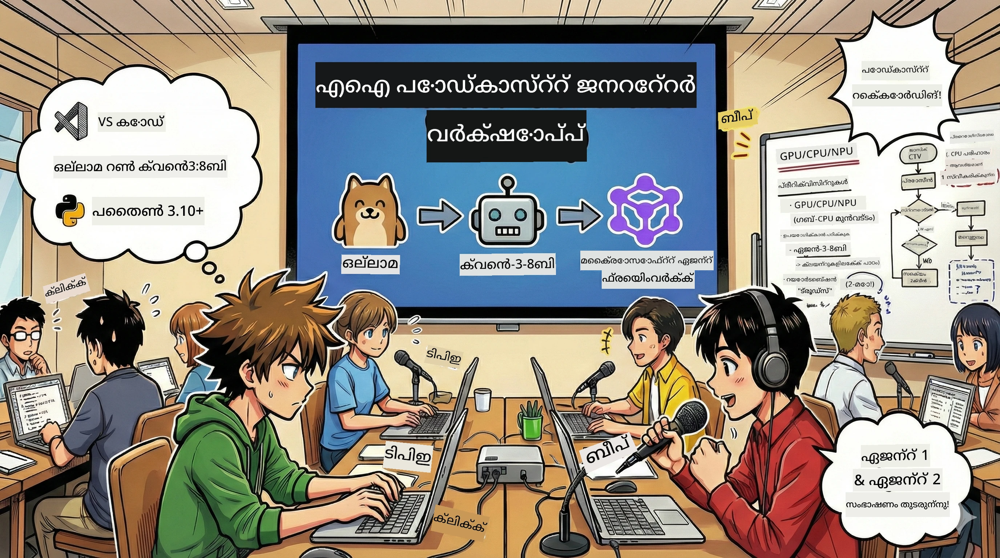

# 🎙️ AI പോഡ്കാസ്റ്റ് സ്റ്റുഡിയോ വർക്‌ഷോപ്പ്



## നിങ്ങളുടെ ദൗത്യം

**AI പോഡ്കാസ്റ്റ് സ്റ്റുഡിയോയിൽ** സ്വാഗതം! നിങ്ങൾ നിങ്ങളുടെ സ്വന്തം ടെക്നോളജി പോഡ്കാസ്റ്റ് "ഭാവി ബൈറ്റ്" ആരംഭിക്കാനാണ് പോകുന്നത് — പക്ഷേ ഒരു തിരുശ്ശീലുണ്ട്: നിങ്ങൾ അത് സൃഷ്ടിക്കുന്നതിന് സഹായിക്കുന്ന AI-നായുള്ള ഒരു നിർമ്മാണ സംഘത്തെ നിങ്ങൾ രൂപപ്പെടുത്തുകയാണ്. നിരന്തരം ഗവേഷണം, സ്ക്രിപ്റ്റ് രചന, ഓഡിയോ എഡിറ്റിംഗ് എന്നപോലുള്ള കാര്യങ്ങൾ വേണ്ട. പകരം, നിങ്ങൾ പ്രോഗ്രാമിങ്ങിലൂടെ AI സൂപ്പർപവർ ഉള്ള പോഡ്കാസ്റ്റ് നിർമ്മാതാവായി മാറും.

## കഥയുടെ പശ്ചാത്തലം

ചിന്തിയ്ക്കൂ: നിങ്ങൾക്കും സുഹൃത്തുക്കൾക്കും ഏറ്റവും കൂൾ ടെക്നോളജി ട്രെൻഡുകൾക്കുറിച്ച് ഒരു പോഡ്കാസ്റ്റ് തുടങ്ങണമെന്ന് ആഗ്രഹമുണ്ട്, പക്ഷേ എല്ലാവരും പഠനം, ജോലി, ജീവിതം എന്നിവയിൽ ബിസിയാണെന്ന്. നിങ്ങൾക്ക് എളുപ്പത്തിൽ കഠിനപ്രവർത്തനം ചെയ്യാൻ സഹായിക്കുന്ന AI എജന്റ് ടീം ഉണ്ടാക്കിയിട്ട് സഹായിച്ചാൽ? ഒരു എജന്റ് വിഷയം ഗവേഷിപ്പിക്കും, മറ്റൊന്ന് ആകർഷകമായ സ്ക്രിപ്റ്റ് എഴുതും, മൂന്നാമത്തത് എഴുത്ത് സ്വാഭാവികവും സുതാര്യവുമായ സംഭാഷണത്തിലേക്ക് മാറ്റും. ഇത് സയൻസ് ഫിക്ഷൻ പോലെയാണ് തോന്നുന്നോ? നമുക്ക് ഇതിനെ യഥാർത്ഥമാക്കാം.

## നിങ്ങൾ പഠിക്കാനിരിക്കുന്നതു

വർക്‌ഷോപ്പ് അവസാനിച്ചപ്പോൾ, നിങ്ങൾക്ക് അറിയാം എങ്ങനെ:
- 🤖 നിങ്ങളുടെ സ്വന്തം ലോക്കൽ AI മോഡൽ ഡിപ്പ്ലോയ് ചെയ്യാം (API ഫീസുമില്ല, ക്ലൗഡ് ആശ്രിതത്വമില്ല!)
- 🔧 പ്രായോഗികമായി സഹകരിക്കുന്ന പ്രൊഫഷണൽ AI എജന്റുകൾ നിർമ്മിക്കുക
- 🎬 ആശയത്തിൽ നിന്ന് ഓഡിയോ വരെ പൂർണ്ണ പോഡ്കാസ്റ്റ് നിർമ്മാണ പ്രക്രിയ സൃഷ്ടിക്കുക

## നിങ്ങളുടെ യാത്ര: മൂന്ന് ഭാഗങ്ങൾ

ഏതെങ്കിലും നല്ല കഥ പോലെ, നമുക്ക് മൂന്ന് ഭാഗങ്ങളുണ്ട്. ഓരോ ഭാഗവും നിങ്ങളുടെ AI പോഡ്കാസ്റ്റ് സ്റ്റുഡിയോ ക്രമീകരിക്കും:

| അധ്യായം | നിങ്ങളുടെ ദൗത്യം | സംഭവിക്കുന്നത് | ലഭിക്കുന്ന കഴിവുകൾ |
|---------|------------------|--------------|--------------------|
| **പട്ടം 1** | [നിങ്ങളുടെ AI സഹായിയെ പരിചയപ്പെടുക](01.BuildAIAgentWithSLM.md) | നിങ്ങൾ ചാറ്റ് ചെയ്യാൻ, വെബ് തിരയാൻ, പ്രശ്‌നങ്ങൾ പരിഹരിക്കാൻ കഴിയുന്ന AI എജന്റുകൾ എങ്ങനെ സൃഷ്ടിക്കാമെന്ന് കണ്ടെത്തും. ഇവയെ ഉറക്കമില്ലാത്ത ഗവേഷകരായി കണക്കാക്കുക. | 🎯 നിങ്ങളുടെ ആദ്യ എജന്റ് നിർമ്മിക്കുക<br>🛠️ അതിന് പിന്നാലെ വൈദഗ്ധ്യം നൽകുക (ഉപകരണങ്ങൾ!)<br>🧠 അതിനെ ചിന്തിക്കുക പഠിപ്പിക്കുക<br>🌐 ഇന്റർനെറ്റിനോട് ബന്ധിപ്പിക്കുക |
| **പട്ടം 2** | [നിങ്ങളുടെ നിർമ്മാണ സംഘം കൂട്ടുക](02.AIAgentOrchestrationAndWorkflows.md) | ഇപ്പോൾ കാര്യങ്ങൾ രസകരമാണ്! പല AI എജന്റുകളെയും ഒരു യഥാർത്ഥ പോഡ്കാസ്റ്റ് ടീമിനൊപ്പം പോലെ സഹകരിപ്പിക്കാൻ നിങ്ങൾ പ്രവർത്തിക്കും. ഒരാൾ ഗവേഷണം ചെയ്യും, മറ്റൊന്ന് എഴുതും, നിങ്ങൾ അവലോകനം ചെയ്യും — സംഘാടന സഹകരണം സ്വപ്നം സഫലമാക്കുന്നു. | 🎭 പല എജന്റുകളെയും ഏകോപിപ്പിക്കുക<br>🔄 അവലോകന പ്രവാഹങ്ങള്‍ നിർമ്മിക്കുക<br>🖥️ DevUI ഇന്റർഫേസ് ഉപയോഗിച്ച് പരീക്ഷിക്കുക<br>✋ മനുഷ്യ നിയന്ത്രണം തുടരുക |
| **പട്ടം 3** | [നിങ്ങളുടെ പോഡ്കാസ്റ്റ് ജീവിയാക്കൂ](03.Multi-SpeakerPodcastGenerationWithVibeVoice.md) | വിവാഹം! നിങ്ങളുടെ ടെക്സ്റ്റ് സ്ക്രിപ്റ്റ് യഥാർത്ഥ പോഡ്കാസ്റ്റ് ഓഡിയോയ്ക്കായി സ്വാഭാവികവും യാഥാർത്ഥ്യവുമുള്ളശബ്ദങ്ങളായി മാറ്റുക. നിങ്ങളുടെ "ഭാവി ബൈറ്റ്" പോഡ്കാസ്റ്റ് പുറത്തിറക്കാൻ തയ്യാറായി! | 🎤 ടെക്സ്റ്റു വോയ്സ് മാറ്റം മാജിക്<br>👥 വളരെ സംസാരിക്കുന്ന ശബ്ദങ്ങൾ<br>⏱️ നീണ്ട ഫോർമാറ്റ് ഓഡിയോ<br>🚀 പൂര്‍ണമായി ഓട്ടോമേറ്റഡ് |

ഓരോ ഭാഗവും പുതിയ കഴിവുകൾ തുറക്കും. നിങ്ങൾ ധൈര്യവാനായാൽ ചാടിപ്പോവാം, പക്ഷേ ക്രമത്തിൽ പഠിക്കാൻ നാം ശുപാർശ ചെയ്യുന്നു!

## പരിസ്ഥിതി ആവശ്യങ്ങൾ

വർക്‌ഷോപ്പ് വിവിധ ഹാർഡ്വെയർ പരിസരങ്ങളിൽ പിന്തുണയുണ്ട്:
- **CPU**: പരീക്ഷണത്തിനും ചെറുതുമുള്ള ഉപയോഗത്തിനും അനുയോജ്യം
- **GPU**: ഉത്പാദന പരിസരങ്ങൾക്ക് ശുപാർശ, നിർണായകമായ കണക്ക് വേഗത വർദ്ധിപ്പിക്കൽ
- **NPU**: അടുത്ത തലമുറ ന്യുറൽ പ്രോസസ്സ് യൂണിറ്റിൽ പിന്തുണ

## നിങ്ങൾക്ക് എന്തൂണ്ടാകണം

### സോഫ്‌റ്റ്‌വെയർ പട്ടിക ✅
- **Python 3.10+** (നിങ്ങളുടെ പ്രോഗ്രാമിങ് ഭാഷ)
- **Ollama** (നിങ്ങളുടെ മഷീനിൽ AI മോഡൽ പ്രവർത്തിപ്പിക്കാൻ)
- **VS Code** (നിങ്ങളുടെ കോഡ് എഡിറ്റർ)
- **Python വിപുലീകരണം** (VS Code കൂടുതൽ ബുദ്ധിമുട്ടാക്കാൻ)
- **Git** (കോഡ് കിട്ടാൻ)

### ഹാർഡ്വെയർ പരിശോധന 💻
- **ഞാൻ ഓടിക്കാമോ?**: 8GB മെമ്മറി, 10GB ലഭ്യമായ സ്ഥലം (കയ്യടങ്ങി ഉപയോഗിക്കാം, കുറെയധികം മന്ദഗതിയോ ഉള്ള സാധ്യത)
- **അത്‌വശ്യ ക്രമീകരണം**: 16GB+ മെമ്മറി, നല്ലൊരു GPU (സുതാര്യമായ പ്രവർത്തനം!)
- **NPU ഉണ്ടോ?**: അതിന്റെ കാര്യം ഹൃദയം! അടുത്ത തലമുറ പ്രകടനം തുറക്കാം 🚀

## നിങ്ങളുടെ സ്റ്റുഡിയോ നിർമ്മിക്കുക 🎬

### ഘട്ടം 1: Python അപ്ഡേറ്റ്

Python 3.10 അല്ലെങ്കിൽ അതിൽക്കൂടുതൽ വേർഷൻ ഉണ്ടെന്ന് ഉറപ്പാക്കുക:

```bash
python --version
# Python 3.10.x അല്ലെങ്കിൽ അതിലധികം വേർഷനാണ് കാണിക്കേണ്ടത്
```

Python ഇല്ലെങ്കിൽ, [python.org](https://python.org) വഴി ലഭിക്കുക — ഇത് സൗജന്യമാണ്!

### ഘട്ടം 2: Ollama (നിങ്ങളുടെ AI മോഡൽ റണ്ണർ) ലഭ്യമാക്കുക

നിങ്ങളുടെ ഓപ്പറേറ്റിംഗ് സിസ്റ്റത്തിന് Ollama [ollama.ai](https://ollama.ai) ൽ നിന്നും ഡൗൺലോഡ് ചെയ്യൂ. ഇതെ AI മോഡലുകൾ ലോക്കൽ എൻജിനായി പ്രവർത്തിപ്പിക്കാൻ ഉപകരിക്കും.

സജ്ജമാണോ എന്ന് പരിശോധിക്കുക:

```bash
ollama --version
```

### ഘട്ടം 3: നിങ്ങളുടെ AI മസ്തിഷ്‌കം ഡൗൺലോഡ് ചെയ്യുക 🧠

Qwen-3-8B മോഡൽ ലഭ്യമാകാൻ സമയം വന്നിരിക്കുന്നു (പഴയ AI സഹായിയെ നിയമിക്കുന്നതിന് സമാനമാണ്):

```bash
ollama pull qwen3:8b
```

* ഇതിന് കുറച്ച് മിനിറ്റുകൾ എടുക്കാം. പർഫക്റ്റ് കാപ്പി സമയം! ☕*

### ഘട്ടം 4: VS Code സെറ്റപ്പ്

ഇപ്പോൾ വരെ ഇല്ലെങ്കിൽ, [Visual Studio Code](https://code.visualstudio.com/) ഡൗൺലോഡ് ചെയ്യൂ. ഏറ്റവും മികച്ച കോഡ് എഡിറ്റർ ആണ് (വണ്ടിക്ക് വരുമോ? 😄).

### ഘട്ടം 5: Python വിപുലീകരണം

VS Code-ൽ:
1. `Ctrl+Shift+X` അമർത്തുക (Mac-ന് `Cmd+Shift+X`)
2. "Python" തിരയുക
3. Microsoft ജനറേറ്റഡ് പൈതൺ വിപുലീകരണം ഇൻസ്റ്റാൾ ചെയ്യുക

### ഘട്ടം 6: വലിയൊരു വിജയം! 🎉

നിങ്ങൾ സത്യത്തിൽ തയ്യാറാണ്. നമുക്ക് കുറച്ചു AI മാജിക്ക് നിർമ്മിക്കാം!

### ഘട്ടം 7: Microsoft Agent Framework ഒപ്പം ആവശ്യമായ പാക്കേജുകൾ ഇൻസ്റ്റാൾ ചെയ്യുക 📦

വർക്‌ഷോപ്പിനുള്ള എല്ലാ ആശ്രിതങ്ങളും ഇൻസ്റ്റാൾ ചെയ്യുക:

```bash
pip install -r ./Installations/requirements.txt -U
```

*ഈ ഇൻസ്റ്റലേഷൻ Microsoft Agent Framework എല്ലാം ആവശ്യമായ പാക്കേജുകളും ഉൾക്കൊള്ളും. ഒരു കാപ്പി എടുത്തു കുടിക്കാൻ ഓർക്കൂ — ആദ്യ ഇൻസ്റ്റലേഷൻ കുറച്ച് മിനിട്ട് എടുത്തേക്കാം! ☕*

## വർക്‌ഷോപ്പ് വിശദീകരണം

വിശദമായ പ്രൊജക്റ്റ് ഘടന, കോൺഫിഗറേഷൻ ഘട്ടങ്ങൾ, എങ്ങനെ വഴിപോകാമെന്ന് വർക്‌ഷോപ്പിൽ തുടർച്ചയായി വിശദീകരിക്കും.

## തകരാറുകൾ പരിഹരിക്കൽ (പ്രശ്നങ്ങൾ വന്നാൽ)🔧

### "അയി, മോഡൽ ഡൗൺലോഡ് വളരെ മന്ദഗതിയിലാണു!"
**പരിഹാരം**: VPN ഉപയോഗിക്കുക അല്ലെങ്കിൽ Ollama മിറർ സോഴ്സ് സെറ്റ് ചെയ്യുക. ചിലപ്പോൾ നെറ്റ്‌വർക്ക് മടിക്കാറുണ്ട്.

### "എന്റെ കമ്പ്യൂട്ടർ ഇടിഞ്ഞ് പോകുന്നു! മെമ്മറി പോര!"
**പരിഹാരം**: ചെറിയ മോഡലിലേക്ക് മാറുക അല്ലെങ്കിൽ `num_ctx` ക്രമീകരണങ്ങൾ കുറച്ച് മെമ്മറി ഉപയോഗിക്കാൻ സെറ്റ് ചെയ്യുക. അത് നിങ്ങളുടെ AI നെ ഡയറ്റ് ചെയ്യുന്നതുപോലെയാണ്.

### "GPU ഉപയോഗിച്ച് ഇതിനെ ഉപരിതല വേഗത്തിൽ ഓടിക്കാമോ?"
**പരിഹാരം**: Ollama സ്വയമെന്ന് GPU കണ്ടെത്തും! നിങ്ങളുടെ GPU ഡ്രൈവർ അപ്ഡേറ്റ് ചെയ്‌തിട്ടുണ്ടെന്ന് ഉറപ്പാക്കുക. സൗജന്യ ഗതാഗതം! 🏎️

## അധിക സാമ്പത്തികസാധനങ്ങൾ (ആസക്തരിലേക്ക്) 📚

- [Ollama ഡോക്യുമെന്റേഷൻ](https://github.com/ollama/ollama) — ലോക്കൽ AI മോഡലുകൾക്കുറിച്ച് കൂടുതൽ അറിയുക
- [Microsoft Agent Framework](https://microsoft.github.io/autogen/) — എജന്റ് ടീമുകൾ നിർമ്മിക്കുന്നതിനുള്ള വിശദാംശങ്ങൾ
- [Qwen മോഡൽ വിവരങ്ങൾ](https://qwenlm.github.io/) — നിങ്ങളുടെ AI സഹായിയുടെ മസ്തിഷ്‌കം അറിയുക

## ലൈസൻസ്

MIT ലൈസൻസ് — ദ്ഗേജ് കാര്യങ്ങൾ നിർമ്മിച്ച് പങ്കുവെച്ചു, ലോകം കൂടുതൽ മനോഹരമാക്കൂ! 🌍

## സംഭാവനകൾ വേണമോ?

ബഗ് കാണിക്കുന്നുണ്ടോ? ആശയങ്ങൾ ഉണ്ടോ? ഇഷ്യു അല്ലെങ്കിൽ PR സമർപ്പിക്കൂ! നമുക്ക് സമുദായ വായുഭവം ഇഷ്ടമാണ്. ✨

---

<!-- CO-OP TRANSLATOR DISCLAIMER START -->
**പരിചാരണാശ്രയം**:  
ഈ രേഖ AI പരിഭാഷാ സേവനം [Co-op Translator](https://github.com/Azure/co-op-translator) ഉപയോഗിച്ച് വിവർത്തനം ചെയ്തതാണ്. ഞങ്ങൾ കൃത്യതയ്ക്ക് ശ്രമിക്കുന്നുവെങ്കിലും, സ്വയമെയ്ക്കപ്പെട്ട വിവർത്തനങ്ങളിൽ പിശക് அல்லது അകുറ്റതകൾ ഉണ്ടായിരിക്കാൻ സാധ്യതയുണ്ട്. അടിസ്ഥാന രേഖയുടെ ഔദ്യോഗിക ഭാഷയിലുള്ള പ്രമാണം മാത്രമേ ആത്മാർത്ഥമായ സ്രോതസ്സായി പരിഗണിക്കപ്പെട്ടിരിക്കൂ. നിർണ്ണായക വിവരങ്ങൾക്ക് പ്രൊഫഷണൽ മനുഷ്യപരിഭാഷ ശിപാർശ ചെയ്യുന്നു. ഈ പരിഭാഷ ഉപയോഗിക്കുന്നതിനാൽ ഉണ്ടായേക്കാവുന്ന ബോധപ്പിഴയോ തെറ്റിദ്ധാരണയോ സംബന്ധിച്ച നിർണ്ണായകത ഞങ്ങൾ ഏറ്റെടുക്കുന്നില്ല.
<!-- CO-OP TRANSLATOR DISCLAIMER END -->