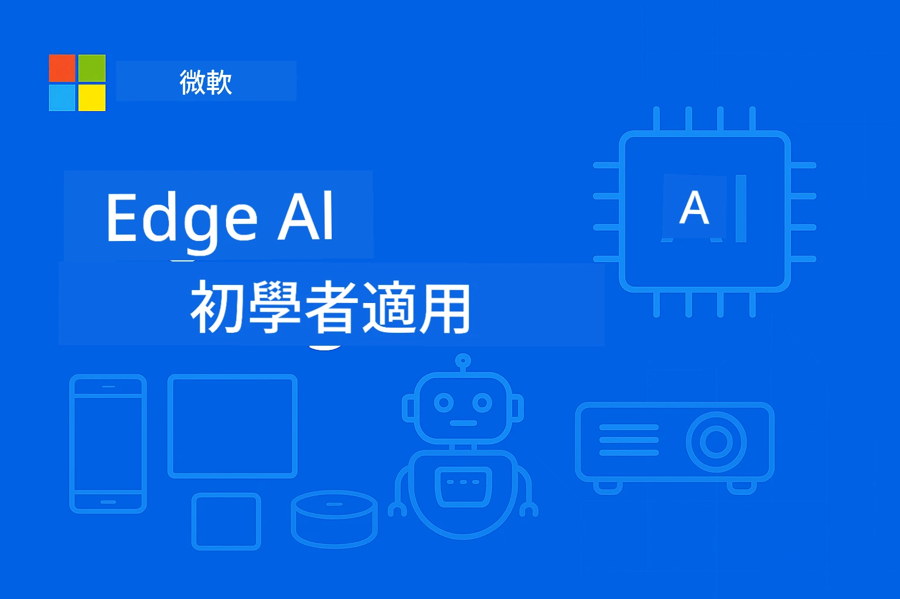

<!--
CO_OP_TRANSLATOR_METADATA:
{
  "original_hash": "ac31463ae3ed21a0ce83b0a351c23dd4",
  "translation_date": "2026-01-05T09:05:01+00:00",
  "source_file": "README.md",
  "language_code": "mo"
}
-->
# EdgeAI 初學者指南




[](https://GitHub.com/microsoft/edgeai-for-beginners/graphs/contributors)
[](https://GitHub.com/microsoft/edgeai-for-beginners/issues)
[](https://GitHub.com/microsoft/edgeai-for-beginners/pulls)
[](http://makeapullrequest.com)

[](https://GitHub.com/microsoft/edgeai-for-beginners/watchers)
[](https://GitHub.com/microsoft/edgeai-for-beginners/fork)
[](https://GitHub.com/microsoft/edgeai-for-beginners/stargazers)


[](https://discord.gg/nTYy5BXMWG)

按以下步驟開始使用這些資源：

1. **分支此倉庫**：點擊 [](https://GitHub.com/microsoft/edgeai-for-beginners/fork)
2. **克隆倉庫**：   `git clone https://github.com/microsoft/edgeai-for-beginners.git`
3. [**加入 Azure AI Foundry Discord，認識專家與開發者夥伴**](https://discord.com/invite/ByRwuEEgH4)


### 🌐 多語言支援

#### 透過 GitHub Action 支援（自動且保持最新）

<!-- CO-OP TRANSLATOR LANGUAGES TABLE START -->
[阿拉伯語](../ar/README.md) | [孟加拉語](../bn/README.md) | [保加利亞語](../bg/README.md) | [緬甸語 (緬甸)](../my/README.md) | [中文（簡體）](../zh/README.md) | [中文（繁體，香港）](../hk/README.md) | [中文（繁體，澳門）](./README.md) | [中文（繁體，臺灣）](../tw/README.md) | [克羅地亞語](../hr/README.md) | [捷克語](../cs/README.md) | [丹麥語](../da/README.md) | [荷蘭語](../nl/README.md) | [愛沙尼亞語](../et/README.md) | [芬蘭語](../fi/README.md) | [法語](../fr/README.md) | [德語](../de/README.md) | [希臘語](../el/README.md) | [希伯來語](../he/README.md) | [印地語](../hi/README.md) | [匈牙利語](../hu/README.md) | [印尼語](../id/README.md) | [意大利語](../it/README.md) | [日語](../ja/README.md) | [坎納達語](../kn/README.md) | [韓語](../ko/README.md) | [立陶宛語](../lt/README.md) | [馬來語](../ms/README.md) | [馬拉雅拉姆語](../ml/README.md) | [馬拉地語](../mr/README.md) | [尼泊爾語](../ne/README.md) | [奈及利亞皮欽語](../pcm/README.md) | [挪威語](../no/README.md) | [波斯語 (法爾西語)](../fa/README.md) | [波蘭語](../pl/README.md) | [葡萄牙語 (巴西)](../br/README.md) | [葡萄牙語 (葡萄牙)](../pt/README.md) | [旁遮普語 (Gurmukhi)](../pa/README.md) | [羅馬尼亞語](../ro/README.md) | [俄語](../ru/README.md) | [塞爾維亞語 (西里爾字母)](../sr/README.md) | [斯洛伐克語](../sk/README.md) | [斯洛文尼亞語](../sl/README.md) | [西班牙語](../es/README.md) | [斯瓦希里語](../sw/README.md) | [瑞典語](../sv/README.md) | [塔加洛語 (菲律賓語)](../tl/README.md) | [泰米爾語](../ta/README.md) | [泰盧固語](../te/README.md) | [泰語](../th/README.md) | [土耳其語](../tr/README.md) | [烏克蘭語](../uk/README.md) | [烏爾都語](../ur/README.md) | [越南語](../vi/README.md)

> **較喜歡本地克隆？**

> 此存儲庫包含 50 多種語言翻譯，下載大小明顯增加。想不帶翻譯克隆，請使用稀疏檢出：
> ```bash
> git clone --filter=blob:none --sparse https://github.com/microsoft/edgeai-for-beginners.git
> cd edgeai-for-beginners
> git sparse-checkout set --no-cone '/*' '!translations' '!translated_images'
> ```
> 這樣您將獲得完成課程所需的一切，下載速度更快。
<!-- CO-OP TRANSLATOR LANGUAGES TABLE END -->

**如希望新增其他翻譯語言，請參閱列表 [這裡](https://github.com/Azure/co-op-translator/blob/main/getting_started/supported-languages.md)**
## 介紹

歡迎來到 **EdgeAI 初學者指南** — 帶您全方位深入體驗革新的邊緣人工智能世界。本課程連結強大的 AI 能力與實用的現場設備部署，讓您直接發揮 AI 潛力於數據產生和決策的第一線。

### 您將掌握的內容

本課程將帶您從基礎概念至生產級實作，內容涵蓋：
- 專為邊緣部署優化的**小型語言模型（SLM）**
- 跨平台的**硬體感知優化**
- 具備隱私保護功能的**即時推理**
- 企業應用的**生產部署策略**

### 為何 EdgeAI 重要

Edge AI 是一種創新模式，解決現代關鍵挑戰：
- **隱私與安全**：本地處理敏感數據，免於雲端暴露
- **即時效能**：消除網絡延遲，適用時間敏感場景
- **成本效益**：降低頻寬與雲端運算開銷
- **韌性運作**：網路中斷時依然保持功能
- **法規遵從**：符合資料主權要求

### 邊緣人工智能

Edge AI 指在靠近數據產生地的硬件本地執行 AI 演算法及語言模型，無需依賴雲端資源推理。它降低延遲、強化隱私，實現實時決策。

### 核心原則：
- **設備端推理**：AI 模型於邊緣裝置（手機、路由器、微控制器、工業電腦）執行
- **離線能力**：無需持續連網功能
- **低延遲**：立即響應，適合即時系統
- **數據主權**：將敏感數據保留於本地，提升安全與合規

### 小型語言模型（SLM）

如 Phi-4、Mistral-7B 和 Gemma 是經優化較大型 LLM 的版本——經過訓練或蒸餾以達成：
- **降低記憶體佔用**：提高有限邊緣裝置記憶體效率
- **降低計算需求**：優化 CPU 及邊緣 GPU 表現
- **啟動速度加快**：快速初始化，提升應用響應力

它們解鎖強大的自然語言處理能力，同時符合以下限制：
- **嵌入式系統**：物聯網裝置及工控控制器
- **行動裝置**：具離線能力的智慧型手機和平板
- **物聯網設備**：有限資源的感測器與智慧裝置
- **邊緣伺服器**：有限 GPU 的本地處理單元
- **個人電腦**：桌上型和筆記型電腦部署場景

## 課程模組與導航

| 模組   | 主題                  | 專注區域       | 主要內容                               | 難度  | 時長        |
|--------|-----------------------|----------------|--------------------------------------|--------|-------------|
| [📖 00 ](./introduction.md) | [EdgeAI 簡介](./introduction.md)       | 基礎與背景     | EdgeAI 概觀 • 產業應用 • SLM 簡介 • 學習目標                   | 初學者 | 1-2 小時    |
| [📚 01](../../Module01)       | [EdgeAI 基礎](./Module01/README.md)       | 雲端 vs 邊緣 AI 比較 | EdgeAI 基礎 • 實況案例 • 實作指南 • 邊緣部署                     | 初學者 | 3-4 小時    |
| [🧠 02](../../Module02)       | [SLM 模型基礎](./Module02/README.md)       | 模型系列與架構 | Phi 系列 • Qwen 系列 • Gemma 系列 • BitNET • μModel • Phi-Silica | 初學者 | 4-5 小時    |
| [🚀 03](../../Module03)       | [SLM 部署實戰](./Module03/README.md)       | 本地與雲端部署 | 進階學習 • 本地環境 • 雲端部署                                   | 中階   | 4-5 小時    |
| [⚙️ 04](../../Module04)       | [模型優化工具組](./Module04/README.md)       | 跨平台優化     | 介紹 • Llama.cpp • Microsoft Olive • OpenVINO • Apple MLX • 工作流程綜合 | 中階   | 5-6 小時    |
| [🔧 05](../../Module05)       | [SLMOps 生產](./Module05/README.md)       | 生產操作       | SLMOps 介紹 • 模型蒸餾 • 微調 • 生產部署                         | 進階   | 5-6 小時    |
| [🤖 06](../../Module06)       | [AI 代理與函式調用](./Module06/README.md)   | 代理框架與 MCP | 代理介紹 • 函式調用 • 模型上下文協定                             | 進階   | 4-5 小時    |
| [💻 07](../../Module07)       | [平台實作](./Module07/README.md)            | 跨平台範例     | AI 工具組 • Foundry Local • Windows 開發                        | 進階   | 3-4 小時    |
| [🏭 08](../../Module08)       | [Foundry Local 工具組](./Module08/README.md) | 生產就緒範例   | 範例應用 (詳見下方)                                              | 專家   | 8-10 小時   |

### 🏭 **模組 08：範例應用**

- [01: REST Chat 快速入門](./Module08/samples/01/README.md)
- [02: OpenAI SDK 整合](./Module08/samples/02/README.md)
- [03: 模型探索與基準測試](./Module08/samples/03/README.md)
- [04: Chainlit RAG 應用](./Module08/samples/04/README.md)
- [05: 多代理協調](./Module08/samples/05/README.md)
- [06: 模型即工具路由器](./Module08/samples/06/README.md)
- [07: 直接 API 客戶端](./Module08/samples/07/README.md)
- [08: Windows 11 聊天應用](./Module08/samples/08/README.md)
- [09: 進階多代理系統](./Module08/samples/09/README.md)
- [10: Foundry 工具框架](./Module08/samples/10/README.md)

### 🎓 **工作坊：動手學習路徑**

完整的動手機器手冊，含生產級實作：

- **[工作坊指南](./Workshop/Readme.md)** - 完整學習目標、成果與資源導覽
- **Python 範例** (6 堂課) - 更新最佳實務、錯誤處理與豐富文件
- **Jupyter 筆記本** (8 個互動) - 分步教程，含基準與效能監控
- **課程指南** - 各工作坊課程詳細 Markdown 指南
- **驗證工具** - 代碼品質檢驗與冒煙測試腳本

**您將建立：**
- 支援串流的本地 AI 聊天應用
- 帶品質評估的 RAG 管線 (RAGAS)
- 多模型基準與比較工具
- 多代理協調系統
- 以任務為基礎的智能模型路由

### 🎙️ **Agentic 工作坊：實作 - AI Podcast 工作室**

從頭打造 AI 驅動的播客製作管線！本沉浸式工作坊教您創建完整多代理系統，將想法轉化為專業播客節目。
**[🎬 開始 AI Podcast Studio 工作坊](./WorkshopForAgentic/README.md)**

**你的任務**：啟動「Future Bytes」——一個完全由你自行構建的 AI 代理驅動的科技播客。無需雲端依賴，無 API 成本——所有運行都在你的本機進行。

**獨特之處：**
- **🤖 真正的多代理協同** — 構建專門的 AI 代理進行研究、撰寫和音頻製作
- **🎯 完整生產流程** — 從主題選擇到最終播客音頻輸出
- **💻 100% 本地部署** — 使用 Ollama 和本地模型（Qwen-3-8B），確保完全私隱與控制
- **🎤 文字轉語音整合** — 將腳本轉換為自然的多角色對話
- **✋ 人類交互流程** — 通過審核關卡確保品質，同時保持自動化

**三幕學習旅程：**

| 幕 | 專注 | 主要技能 | 時長 |
|-----|-------|------------|----------|
| **[幕 1：認識你的 AI 助手](./WorkshopForAgentic/md/01.BuildAIAgentWithSLM.md)** | 建立你的第一個 AI 代理 | 工具整合 • 網頁搜尋 • 問題解決 • 代理推理 | 2-3 小時 |
| **[幕 2：組建你的製作團隊](./WorkshopForAgentic/md/02.AIAgentOrchestrationAndWorkflows.md)** | 協調多個代理 | 團隊協作 • 審核流程 • DevUI 介面 • 人類監督 | 3-4 小時 |
| **[幕 3：讓你的播客活起來](./WorkshopForAgentic/md/03.Multi-SpeakerPodcastGenerationWithVibeVoice.md)** | 產生播客音頻 | 文字轉語音 • 多角色合成 • 長音頻 • 完全自動化 | 2-3 小時 |

**使用技術：**
- **Microsoft 代理框架** — 多代理協同與協調
- **Ollama** — 本地 AI 模型執行環境（無需雲端）
- **Qwen-3-8B** — 開源語言模型，專優於代理任務
- **文字轉語音 API** — 用於自然語音合成與播客製作

**硬體支援：**
- ✅ **CPU 模式** — 適用於任何現代電腦（建議 8GB+ 記憶體）
- 🚀 **GPU 加速** — NVIDIA/AMD GPU 明顯提升推理速度
- ⚡ **NPU 支援** — 次世代神經處理器加速

**適合對象：**
- 學習多代理 AI 系統的開發者
- 對 AI 自動化與工作流程感興趣者
- 探索 AI 輔助製作的內容創作者
- 學習實用 AI 協調模式的學生

**開始建構**：[🎙️ AI Podcast Studio 工作坊 →](./WorkshopForAgentic/README.md)

### 📊 **學習路線摘要**
- **總時長**：36-45 小時
- **初學者路線**：模組 01-02（7-9 小時）  
- **中階路線**：模組 03-04（9-11 小時）
- **高階路線**：模組 05-07（12-15 小時）
- **專家路線**：模組 08（8-10 小時）

## 你將建構

### 🎯 核心能力
- **邊緣 AI 架構**：設計本地優先、雲端整合的 AI 系統
- **模型優化**：量化和壓縮模型以利邊緣部署（提升 85% 速度，減少 75% 大小）
- **多平台部署**：Windows、行動、嵌入式及雲端邊緣混合系統
- **生產運維**：監控、擴展及維護邊緣 AI 生產環境

### 🏗️ 實務專案
- **Foundry 本地聊天應用**：支援模型切換的 Windows 11 原生應用
- **多代理系統**：含專家代理的協調者，處理複雜流程  
- **RAG 應用**：本地文件處理與向量搜尋
- **模型路由器**：根據任務分析智慧選擇模型
- **API 框架**：生產級客戶端，支持串流與健康監測
- **跨平台工具**：LangChain / Semantic Kernel 整合模式

### 🏢 業界應用
**製造業** • **醫療保健** • **自動駕駛車** • **智慧城市** • **行動應用**

## 快速開始

**建議學習路線**（總計 20-30 小時）：

0. **📖 介紹** ([Introduction.md](./introduction.md))：EdgeAI 基礎＋行業背景＋學習框架  
1. **📚 基礎**（模組 01-02）：EdgeAI 概念＋SLM 模型家族  
2. **⚙️ 優化**（模組 03-04）：部署＋量化框架  
3. **🚀 生產**（模組 05-06）：SLMOps＋AI 代理＋函數呼叫  
4. **💻 實作**（模組 07-08）：平台範例＋Foundry Local 工具包

每個模組包含理論、實作練習及生產級代碼範例。

## 職涯影響

**技術職稱**：邊緣 AI 解決方案架構師 • 邊緣機器學習工程師 • 物聯網 AI 開發者 • 行動 AI 開發者

**產業領域**：工業 4.0 • 醫療科技 • 自動系統 • 金融科技 • 消費電子

**作品集專案**：多代理系統 • 生產 RAG 應用 • 跨平台部署 • 性能優化

## 專案結構

```
edgeai-for-beginners/
├── 📖 introduction.md  # Foundation: EdgeAI Overview & Learning Framework
├── 📚 Module01-04/     # Fundamentals → SLMs → Deployment → Optimization  
├── 🔧 Module05-06/     # SLMOps → AI Agents → Function Calling
├── 💻 Module07/        # Platform Samples (VS Code, Windows, Jetson, Mobile)
├── 🏭 Module08/        # Foundry Local Toolkit + 10 Comprehensive Samples
│   ├── samples/01-06/  # Foundation: REST, SDK, RAG, Agents, Routing
│   └── samples/07-10/  # Advanced: API Client, Windows App, Enterprise Agents, Tools
├── 🌐 translations/    # Multi-language support (8+ languages)
└── 📋 STUDY_GUIDE.md   # Structured learning paths & time allocation
```

## 課程亮點

✅ **循序漸進學習**：理論→實作→生產部署  
✅ **真實案例研究**：Microsoft、日本航空、企業實施  
✅ **豐富實作範例**：50+ 範例，10 個完整 Foundry Local 示範  
✅ **性能聚焦**：提升 85% 速度，減少 75% 大小  
✅ **多平台支持**：Windows、行動、嵌入式、雲端邊緣混合  
✅ **生產就緒**：監控、擴展、安全與合規框架

📖 **[學習指南可用](STUDY_GUIDE.md)**：結構化 20 小時學習路線，含時間分配指導和自我評估工具。

---

**EdgeAI 代表 AI 部署的未來**：本地優先，保護隱私且高效。掌握這些技能，打造下一代智慧應用。

## 其他課程

我們團隊還有其他課程！看看：

<!-- CO-OP TRANSLATOR OTHER COURSES START -->
### LangChain
[](https://aka.ms/langchain4j-for-beginners)
[](https://aka.ms/langchainjs-for-beginners?WT.mc_id=m365-94501-dwahlin)

---

### Azure / Edge / MCP / Agents
[](https://github.com/microsoft/AZD-for-beginners?WT.mc_id=academic-105485-koreyst)
[](https://github.com/microsoft/edgeai-for-beginners?WT.mc_id=academic-105485-koreyst)
[](https://github.com/microsoft/mcp-for-beginners?WT.mc_id=academic-105485-koreyst)
[](https://github.com/microsoft/ai-agents-for-beginners?WT.mc_id=academic-105485-koreyst)

---
 
### 生成式 AI 系列
[](https://github.com/microsoft/generative-ai-for-beginners?WT.mc_id=academic-105485-koreyst)
[-9333EA?style=for-the-badge&labelColor=E5E7EB&color=9333EA)](https://github.com/microsoft/Generative-AI-for-beginners-dotnet?WT.mc_id=academic-105485-koreyst)
[-C084FC?style=for-the-badge&labelColor=E5E7EB&color=C084FC)](https://github.com/microsoft/generative-ai-for-beginners-java?WT.mc_id=academic-105485-koreyst)
[-E879F9?style=for-the-badge&labelColor=E5E7EB&color=E879F9)](https://github.com/microsoft/generative-ai-with-javascript?WT.mc_id=academic-105485-koreyst)

---
 
### 核心學習
[](https://aka.ms/ml-beginners?WT.mc_id=academic-105485-koreyst)
[](https://aka.ms/datascience-beginners?WT.mc_id=academic-105485-koreyst)
[](https://aka.ms/ai-beginners?WT.mc_id=academic-105485-koreyst)
[](https://github.com/microsoft/Security-101?WT.mc_id=academic-96948-sayoung)
[](https://aka.ms/webdev-beginners?WT.mc_id=academic-105485-koreyst)
[](https://aka.ms/iot-beginners?WT.mc_id=academic-105485-koreyst)
[](https://github.com/microsoft/xr-development-for-beginners?WT.mc_id=academic-105485-koreyst)

---
 
### Copilot 系列
[](https://aka.ms/GitHubCopilotAI?WT.mc_id=academic-105485-koreyst)
[](https://github.com/microsoft/mastering-github-copilot-for-dotnet-csharp-developers?WT.mc_id=academic-105485-koreyst)
[](https://github.com/microsoft/CopilotAdventures?WT.mc_id=academic-105485-koreyst)
<!-- CO-OP TRANSLATOR OTHER COURSES END -->

## 尋求協助

如果你遇到困難或對建立 AI 應用程式有任何疑問，歡迎加入：

[](https://discord.gg/nTYy5BXMWG)

如果你在開發中有產品反饋或遇到錯誤，請造訪：

[](https://aka.ms/foundry/forum)

---

<!-- CO-OP TRANSLATOR DISCLAIMER START -->
**免責聲明**：  
本文件係使用人工智能翻譯服務 [Co-op Translator](https://github.com/Azure/co-op-translator) 所翻譯。雖然我們力求準確，但請注意，機械翻譯可能包含錯誤或不準確之處。原文件以其母語版本為準。如涉及重要資訊，建議尋求專業人工翻譯。本公司不對因使用此翻譯而產生之任何誤解或誤讀承擔責任。
<!-- CO-OP TRANSLATOR DISCLAIMER END -->