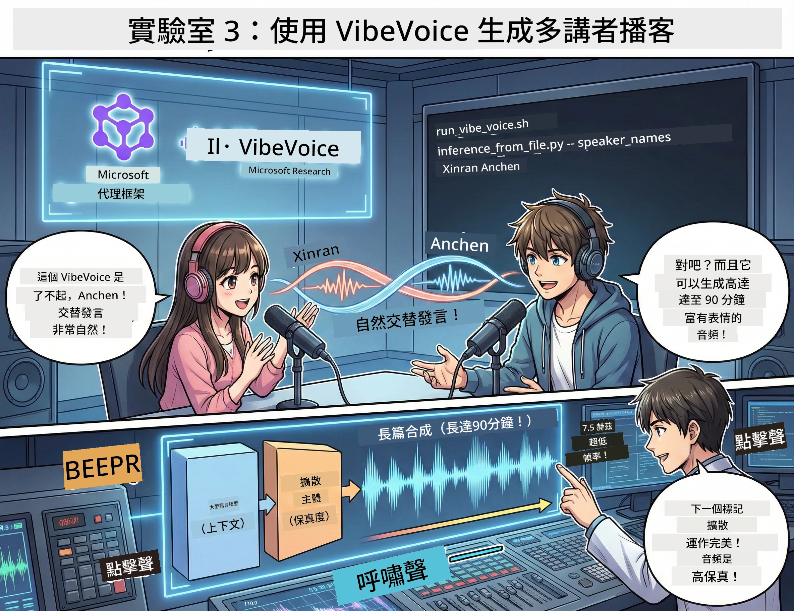

<!--
CO_OP_TRANSLATOR_METADATA:
{
  "original_hash": "bb2a3cf5ebd0ec8211af960a004fc23d",
  "translation_date": "2026-01-05T12:04:57+00:00",
  "source_file": "WorkshopForAgentic/md/03.Multi-SpeakerPodcastGenerationWithVibeVoice.md",
  "language_code": "mo"
}
-->
# Act 3: 將你的播客帶入生活 🎤



## 最終章

你已經研究過主題，撰寫過腳本。現在是最後一環：將文字變成真實聲音的播客音訊！

這就是 **VibeVoice** — 微軟研究院的開源 TTS（文字轉語音）魔法，它能創造：
- 🎭 自然聽起來的對話
- 👥 多位講者（最多4位！）
- ⏱️ 長時間音頻（最多90分鐘！）
- 🎵 富表情的朗讀（不是機械音！）

這就是合成播客的技術。讓我們開始做你的吧！

## 什麼是 VibeVoice？（酷炫功能）

VibeVoice 是微軟研究院送給世界的禮物。它特別為播客式對話音頻設計。

### 為何它很厲害 🔥

* **⏱️ 馬拉松長談**：可以連續生成最多90分鐘語音（完整一集播客！）
* **👥 多人講話魔法**：最多4種不同聲音，且個性保持一致
* **⚡ 超級高效**：使用超低7.5 Hz幀率，節省計算資源
* **🧠 智能音頻**：結合LLM（理解上下文）與擴散模型（創造逼真音訊）
* **🎭 自然流暢**：自動處理輪流發言、停頓和對話節奏

**翻譯**：VibeVoice 不只是讀你的腳本 — 它用演出的方式像真人在對話。

---

## 開始前準備 🚀

**你需要**：

* 🐍 **Python 3.10+**（你在 Act 1 & 2 已經裝好）
* 🚀 **uv**（快速的 Python 套件管理器—我們會安裝）
* 📝 **你的腳本**：Act 2 的 `podcast.txt` 檔案（在 `../03.Application/`）

**專家秘訣**：這步需要下載預訓練模型，請保持良好網路連線。喝杯咖啡吧！☕

---

## 開始吧！簡單作法 🎬

我們已經把流程弄得非常簡單。一個 shell 腳本解決一切。

### 過程

1. **給予執行權限**：
```bash
chmod +x run_vibe_voice.sh
```

2. **執行腳本**：
```bash
./run_vibe_voice.sh
```

3. **等待魔法發生**（第一次運行可能需幾分鐘）

### 背後發生什麼 🎭

這個腳本其實就是你的自動音效工程師：

1. **📥 下載 VibeVoice**：從 GitHub 複製官方程式庫
2. **📦 安裝相依套件**：用 `uv pip` 快速安裝套件
3. **🎬 產生音訊**：執行推論腳本並帶入：
   * `--model_path`：預訓練的 VibeVoice-7B 模型
   * `--txt_path`：你的 `podcast.txt` 腳本
   * `--speaker_names`：指定講者名稱（預設是 Xinran & Anchen）

**結果**：你的腳本化身為真實播客集數！🎉

---

## 你的任務 🎯

讓我們玩點有趣的：

### 任務1：創建內容
編輯 `../03.Application/podcast.txt`，寫兩個人的對話。可以是科技、興趣、隨意話題！讓它像真對話一樣。

**格式範例**：
```
Speaker 1: Hey! Did you hear about the new AI model?
Speaker 2: No way! Tell me more!
Speaker 1: It's called...
```

### 任務2：產生音訊
執行腳本並看魔法發生。第一次較慢（要下載模型）。

### 任務3：聆聽與分析
- 聲音聽起來自然嗎？
- 講者聲音有沒有不同特色？
- 輪流發言順暢嗎？
- 有沒有聽起來像機械聲的時刻？

### 任務4：試驗（敢玩版）
編輯 `run_vibe_voice.sh`，改變 `--speaker_names` 來試不同聲音組合。VibeVoice 有多種預訓練聲音可用！

**額外挑戰**：試試看三人對話！🎆

---

## 深入了解 📚

* **🏠 專案首頁**：[VibeVoice 官方網站](https://microsoft.github.io/VibeVoice/)
* **🤗 預訓練模型**：[Hugging Face - VibeVoice-7B](https://huggingface.co/vibevoice/VibeVoice-7B)
* **📖 研究論文**：深入了解技術（如果你有興趣）

> **⚠️ 負責任的 AI 提醒**：VibeVoice 非常強大，請倫理使用！不要用來製作深偽或誤導內容。創造能幫助人的酷東西。🙏

---

## 🏆 恭喜！你完成了！

你剛完成完整流程：
1. ✅ **Act 1**：用客製工具建立AI代理
2. ✅ **Act 2**：安排多代理工作流程
3. ✅ **Act 3**：產生真實播客音訊

**你現在有**：
- 運作中的 AI 研究助手
- 完整播客製作工作流程
- 可分享的實際音訊檔案

### 接下來呢？🚀

**開播吧！**
- 上傳到播客平台
- 分享到社群網站
- 持續改良和迭代

**繼續打造！**
- 試不同主題
- 實驗更多講者
- 加入背景音樂
- 建立網頁介面
- 自動化全流程

**分享你的作品！**
標註我們！讓世界看見你打造的作品。AI播客革命，由你開始。🎙️

---

**有問題？想法？成功經驗？** 在工作坊聊天室發問吧！

**歡迎來到內容創造的未來。** 🌟

---

<!-- CO-OP TRANSLATOR DISCLAIMER START -->
**免責聲明**：
本文件乃使用 AI 翻譯服務 [Co-op Translator](https://github.com/Azure/co-op-translator) 進行翻譯。儘管我們致力於確保準確性，請注意自動翻譯可能包含錯誤或不準確之處。原文文件的本地語言版本應視為權威來源。對於關鍵資訊，建議採用專業人工翻譯。我們不對因使用本翻譯而引起之任何誤解或誤譯承擔責任。
<!-- CO-OP TRANSLATOR DISCLAIMER END -->