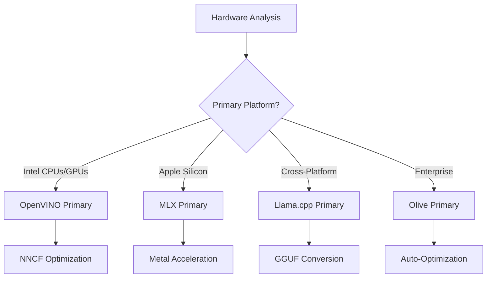
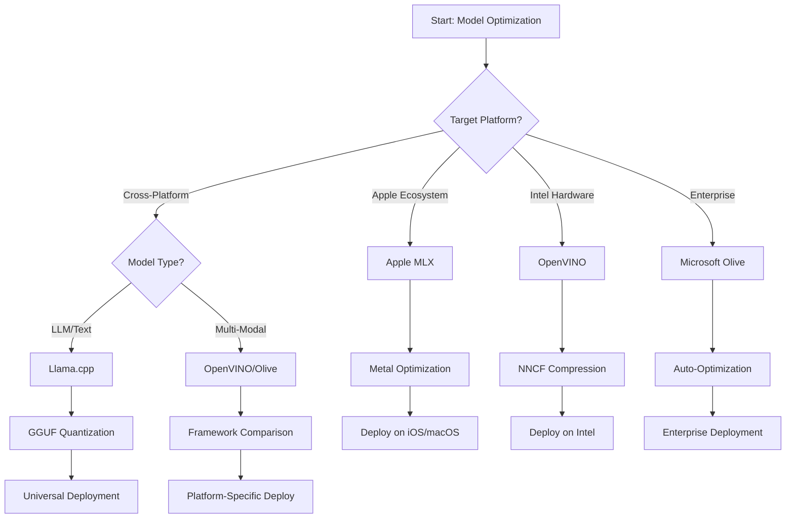
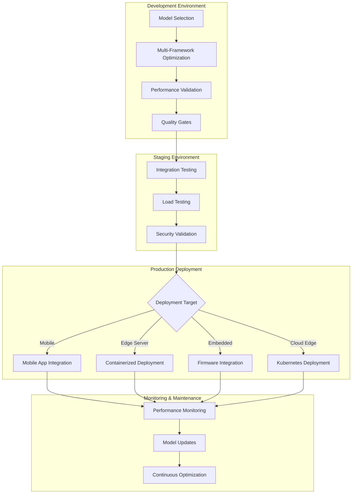

<!--
CO_OP_TRANSLATOR_METADATA:
{
  "original_hash": "6fbccc3e9d5911e3df32090724daac13",
  "translation_date": "2025-10-30T11:56:23+00:00",
  "source_file": "Module04/06.workflow-synthesis.md",
  "language_code": "mr"
}
-->
# विभाग 6: एज AI विकास कार्यप्रवाह संश्लेषण

## विषय सूची
1. [परिचय](../../../Module04)
2. [शिकण्याचे उद्दिष्टे](../../../Module04)
3. [एकत्रित कार्यप्रवाहाचा आढावा](../../../Module04)
4. [फ्रेमवर्क निवड मॅट्रिक्स](../../../Module04)
5. [सर्वोत्तम पद्धतींचा संश्लेषण](../../../Module04)
6. [तैनाती धोरण मार्गदर्शक](../../../Module04)
7. [कामगिरी ऑप्टिमायझेशन कार्यप्रवाह](../../../Module04)
8. [उत्पादन तयारी चेकलिस्ट](../../../Module04)
9. [समस्या निवारण आणि निरीक्षण](../../../Module04)
10. [तुमच्या एज AI पाइपलाइनचे भविष्य सुरक्षित करणे](../../../Module04)

## परिचय

एज AI विकासासाठी अनेक ऑप्टिमायझेशन फ्रेमवर्क्स, तैनाती धोरणे आणि हार्डवेअर विचारांची सखोल समज आवश्यक आहे. Llama.cpp, Microsoft Olive, OpenVINO, आणि Apple MLX मधील ज्ञान एकत्र करून एकत्रित कार्यप्रवाह तयार करण्यासाठी ही व्यापक संश्लेषण कार्यक्षमता वाढवते, गुणवत्ता टिकवते आणि यशस्वी उत्पादन तैनाती सुनिश्चित करते.

या कोर्समध्ये, आपण वेगवेगळ्या ऑप्टिमायझेशन फ्रेमवर्क्सचा अभ्यास केला आहे, ज्यामध्ये प्रत्येकाची अनोखी ताकद आणि विशेष उपयोग प्रकरणे आहेत. तथापि, वास्तविक जगातील एज AI प्रकल्पांमध्ये अनेक फ्रेमवर्क्समधील तंत्रे एकत्र करणे किंवा विशिष्ट मर्यादा आणि आवश्यकता पूर्ण करण्यासाठी सर्वोत्तम परिणाम देणाऱ्या दृष्टिकोनाबद्दल धोरणात्मक निर्णय घेणे आवश्यक असते.

या विभागात सर्व फ्रेमवर्क्समधील सामूहिक ज्ञान कृतीशील कार्यप्रवाह, निर्णय वृक्ष आणि सर्वोत्तम पद्धतींमध्ये संश्लेषित केले आहे, जे तुम्हाला उत्पादन-तयार एज AI सोल्यूशन्स कार्यक्षमतेने आणि प्रभावीपणे तयार करण्यास सक्षम करतात. तुम्ही मोबाइल डिव्हाइस, एम्बेडेड सिस्टीम्स किंवा एज सर्व्हर्ससाठी ऑप्टिमायझेशन करत असाल, तरीही हा मार्गदर्शक तुमच्या विकास जीवनचक्रादरम्यान माहितीपूर्ण निर्णय घेण्यासाठी धोरणात्मक फ्रेमवर्क प्रदान करतो.

## शिकण्याचे उद्दिष्टे

या विभागाच्या शेवटी, तुम्ही सक्षम असाल:

### धोरणात्मक निर्णय घेणे
- **मूल्यांकन आणि निवड**: प्रकल्पाच्या गरजा, हार्डवेअर मर्यादा आणि तैनाती परिस्थितीवर आधारित सर्वोत्तम ऑप्टिमायझेशन फ्रेमवर्क निवडणे
- **संपूर्ण कार्यप्रवाह डिझाइन करा**: जास्तीत जास्त कार्यक्षमतेसाठी अनेक ऑप्टिमायझेशन तंत्रे एकत्रित करणारे
- **तडजोडांचे मूल्यांकन करा**: मॉडेल अचूकता, अनुमान गती, मेमरी वापर आणि वेगवेगळ्या फ्रेमवर्क्समधील तैनातीची गुंतागुंत यामधील

### कार्यप्रवाह एकत्रीकरण
- **एकत्रित विकास पाइपलाइन अंमलात आणा**: अनेक ऑप्टिमायझेशन फ्रेमवर्क्सच्या ताकदीचा लाभ घेणे
- **पुनरुत्पादक कार्यप्रवाह तयार करा**: वेगवेगळ्या वातावरणांमध्ये सुसंगत मॉडेल ऑप्टिमायझेशन आणि तैनातीसाठी
- **गुणवत्ता गेट्स स्थापित करा**: ऑप्टिमायझेशन केलेले मॉडेल उत्पादनाच्या गरजा पूर्ण करत असल्याची खात्री करण्यासाठी

### कामगिरी ऑप्टिमायझेशन
- **पद्धतशीर ऑप्टिमायझेशन धोरणे लागू करा**: क्वांटायझेशन, प्रूनिंग आणि हार्डवेअर-विशिष्ट प्रवेग तंत्रांचा वापर करून
- **मॉडेल कामगिरीचे निरीक्षण आणि बेंचमार्क करा**: वेगवेगळ्या ऑप्टिमायझेशन स्तरांवर आणि तैनातीच्या लक्ष्यांवर
- **विशिष्ट हार्डवेअर प्लॅटफॉर्मसाठी ऑप्टिमायझेशन करा**: CPU, GPU, NPU आणि विशेष एज प्रवेगकांसह

### उत्पादन तैनाती
- **स्केलेबल तैनाती आर्किटेक्चर डिझाइन करा**: जे अनेक मॉडेल स्वरूप आणि अनुमान इंजिन समाविष्ट करते
- **उत्पादन वातावरणात एज AI अनुप्रयोगांसाठी निरीक्षण आणि निरीक्षण अंमलात आणा**
- **मॉडेल अद्यतने, कामगिरी निरीक्षण आणि प्रणाली ऑप्टिमायझेशनसाठी देखभाल कार्यप्रवाह स्थापित करा**

### क्रॉस-प्लॅटफॉर्म उत्कृष्टता
- **ऑप्टिमायझेशन केलेली मॉडेल्स तैनात करा**: विविध हार्डवेअर प्लॅटफॉर्मवर सुसंगत कामगिरी राखत
- **प्लॅटफॉर्म-विशिष्ट ऑप्टिमायझेशन हाताळा**: Windows, macOS, Linux, मोबाइल आणि एम्बेडेड सिस्टीम्ससाठी
- **अॅब्स्ट्रॅक्शन लेयर्स तयार करा**: जे वेगवेगळ्या एज वातावरणांमध्ये अखंड तैनाती सक्षम करतात

## एकत्रित कार्यप्रवाहाचा आढावा

### टप्पा 1: आवश्यकता विश्लेषण आणि फ्रेमवर्क निवड

यशस्वी एज AI तैनातीची पायाभूत आवश्यकता विश्लेषणाने सुरू होते, जी फ्रेमवर्क निवड आणि ऑप्टिमायझेशन धोरणाला माहिती देते.

#### 1.1 हार्डवेअर मूल्यांकन


**महत्त्वाचे विचार:**
- **CPU आर्किटेक्चर**: x86, ARM, Apple Silicon क्षमता
- **प्रवेगक उपलब्धता**: GPU, NPU, VPU, विशेष AI चिप्स
- **मेमरी मर्यादा**: RAM मर्यादा, स्टोरेज क्षमता
- **पॉवर बजेट**: बॅटरी आयुष्य, थर्मल मर्यादा
- **कनेक्टिव्हिटी**: ऑफलाइन आवश्यकता, बँडविड्थ मर्यादा

#### 1.2 अनुप्रयोग आवश्यकता मॅट्रिक्स

| आवश्यकता | Llama.cpp | Microsoft Olive | OpenVINO | Apple MLX |
|-----------|-----------|-----------------|----------|-----------|
| क्रॉस-प्लॅटफॉर्म | ✅ उत्कृष्ट | ⚡ चांगले | ⚡ चांगले | ❌ फक्त Apple |
| एंटरप्राइझ एकत्रीकरण | ⚡ मूलभूत | ✅ उत्कृष्ट | ✅ उत्कृष्ट | ⚡ मर्यादित |
| मोबाइल तैनाती | ✅ उत्कृष्ट | ⚡ चांगले | ⚡ चांगले | ✅ iOS उत्कृष्ट |
| रिअल-टाइम अनुमान | ✅ उत्कृष्ट | ✅ उत्कृष्ट | ✅ उत्कृष्ट | ✅ उत्कृष्ट |
| मॉडेल विविधता | ✅ LLM केंद्रित | ✅ सर्व मॉडेल्स | ✅ सर्व मॉडेल्स | ✅ LLM केंद्रित |
| वापरण्यास सुलभता | ✅ सोपे | ✅ स्वयंचलित | ⚡ मध्यम | ✅ सोपे |

### टप्पा 2: मॉडेल तयारी आणि ऑप्टिमायझेशन

#### 2.1 सार्वत्रिक मॉडेल मूल्यांकन पाइपलाइन

```python
# Universal Model Assessment Framework
class EdgeAIModelAssessment:
    def __init__(self, model_path, target_hardware):
        self.model_path = model_path
        self.target_hardware = target_hardware
        self.optimization_frameworks = []
        
    def assess_model_characteristics(self):
        """Analyze model size, architecture, and complexity"""
        return {
            'model_size': self.get_model_size(),
            'parameter_count': self.get_parameter_count(),
            'architecture_type': self.detect_architecture(),
            'quantization_compatibility': self.check_quantization_support()
        }
    
    def recommend_optimization_strategy(self):
        """Recommend optimal frameworks and techniques"""
        characteristics = self.assess_model_characteristics()
        
        if self.target_hardware.startswith('apple'):
            return self.mlx_optimization_strategy(characteristics)
        elif self.target_hardware.startswith('intel'):
            return self.openvino_optimization_strategy(characteristics)
        elif characteristics['model_size'] > 7_000_000_000:  # 7B+ parameters
            return self.enterprise_optimization_strategy(characteristics)
        else:
            return self.lightweight_optimization_strategy(characteristics)
```

#### 2.2 मल्टी-फ्रेमवर्क ऑप्टिमायझेशन पाइपलाइन

**क्रमिक ऑप्टिमायझेशन दृष्टिकोन:**
1. **प्रारंभिक रूपांतरण**: मध्यवर्ती स्वरूपात रूपांतरित करा (ONNX शक्य असल्यास)
2. **फ्रेमवर्क-विशिष्ट ऑप्टिमायझेशन**: विशेष तंत्र लागू करा
3. **क्रॉस-व्हॅलिडेशन**: लक्ष्य प्लॅटफॉर्मवर कामगिरी सत्यापित करा
4. **अंतिम पॅकेजिंग**: तैनातीसाठी तयार करा

```bash
# Multi-Framework Optimization Script
#!/bin/bash

MODEL_NAME="phi-3-mini"
BASE_MODEL="microsoft/Phi-3-mini-4k-instruct"

# Phase 1: ONNX Conversion (Universal)
python convert_to_onnx.py --model $BASE_MODEL --output models/onnx/

# Phase 2: Platform-Specific Optimization
if [[ "$TARGET_PLATFORM" == "intel" ]]; then
    # OpenVINO Optimization
    python optimize_openvino.py --input models/onnx/ --output models/openvino/
elif [[ "$TARGET_PLATFORM" == "apple" ]]; then
    # MLX Optimization
    python optimize_mlx.py --input $BASE_MODEL --output models/mlx/
elif [[ "$TARGET_PLATFORM" == "cross" ]]; then
    # Llama.cpp Optimization
    python convert_to_gguf.py --input models/onnx/ --output models/gguf/
fi

# Phase 3: Validation
python validate_optimization.py --original $BASE_MODEL --optimized models/$TARGET_PLATFORM/
```

### टप्पा 3: कामगिरी सत्यापन आणि बेंचमार्किंग

#### 3.1 व्यापक बेंचमार्किंग फ्रेमवर्क

```python
class EdgeAIBenchmark:
    def __init__(self, optimized_models):
        self.models = optimized_models
        self.metrics = {
            'inference_time': [],
            'memory_usage': [],
            'accuracy_score': [],
            'throughput': [],
            'energy_consumption': []
        }
    
    def run_comprehensive_benchmark(self):
        """Execute standardized benchmarks across all optimized models"""
        test_inputs = self.generate_test_inputs()
        
        for model_framework, model_path in self.models.items():
            print(f"Benchmarking {model_framework}...")
            
            # Latency Testing
            latency = self.measure_inference_latency(model_path, test_inputs)
            
            # Memory Profiling
            memory = self.profile_memory_usage(model_path)
            
            # Accuracy Validation
            accuracy = self.validate_model_accuracy(model_path, test_inputs)
            
            # Throughput Analysis
            throughput = self.measure_throughput(model_path)
            
            self.record_metrics(model_framework, latency, memory, accuracy, throughput)
    
    def generate_optimization_report(self):
        """Create comprehensive comparison report"""
        report = {
            'recommendations': self.analyze_performance_trade_offs(),
            'deployment_guidance': self.generate_deployment_recommendations(),
            'monitoring_requirements': self.define_monitoring_metrics()
        }
        return report
```

## फ्रेमवर्क निवड मॅट्रिक्स

### फ्रेमवर्क निवडीसाठी निर्णय वृक्ष



### व्यापक निवड निकष

#### 1. प्राथमिक उपयोग प्रकरण संरेखन

**मोठे भाषा मॉडेल्स (LLMs):**
- **Llama.cpp**: CPU-केंद्रित, क्रॉस-प्लॅटफॉर्म तैनातीसाठी सर्वोत्तम
- **Apple MLX**: Apple Silicon साठी एकात्मिक मेमरीसह उत्कृष्ट
- **OpenVINO**: NNCF ऑप्टिमायझेशनसह Intel हार्डवेअर साठी उत्कृष्ट
- **Microsoft Olive**: स्वयंचलिततेसह एंटरप्राइझ कार्यप्रवाहांसाठी आदर्श

**मल्टी-मोडल मॉडेल्स:**
- **OpenVINO**: व्हिजन, ऑडिओ आणि टेक्स्टसाठी व्यापक समर्थन
- **Microsoft Olive**: जटिल पाइपलाइन्ससाठी एंटरप्राइझ-ग्रेड ऑप्टिमायझेशन
- **Llama.cpp**: फक्त टेक्स्ट-आधारित मॉडेल्ससाठी मर्यादित
- **Apple MLX**: मल्टी-मोडल अनुप्रयोगांसाठी वाढते समर्थन

#### 2. हार्डवेअर प्लॅटफॉर्म मॅट्रिक्स

| प्लॅटफॉर्म | प्राथमिक फ्रेमवर्क | दुय्यम पर्याय | विशेष वैशिष्ट्ये |
|------------|------------------|----------------|------------------|
| Intel CPU/GPU | OpenVINO | Microsoft Olive | NNCF संकुचन, Intel ऑप्टिमायझेशन |
| NVIDIA GPU | Microsoft Olive | OpenVINO | CUDA प्रवेग, एंटरप्राइझ वैशिष्ट्ये |
| Apple Silicon | Apple MLX | Llama.cpp | Metal shaders, एकात्मिक मेमरी |
| ARM मोबाइल | Llama.cpp | OpenVINO | क्रॉस-प्लॅटफॉर्म, किमान अवलंबित्व |
| Edge TPU | OpenVINO | Microsoft Olive | विशेष प्रवेगक समर्थन |
| एम्बेडेड ARM | Llama.cpp | OpenVINO | किमान फूटप्रिंट, कार्यक्षम अनुमान |

#### 3. विकास कार्यप्रवाह प्राधान्ये

**जलद प्रोटोटायपिंग:**
1. **Llama.cpp**: सर्वात जलद सेटअप, त्वरित परिणाम
2. **Apple MLX**: सोपी Python API, जलद पुनरावृत्ती
3. **Microsoft Olive**: स्वयंचलित ऑप्टिमायझेशन, किमान कॉन्फिगरेशन
4. **OpenVINO**: अधिक जटिल सेटअप, व्यापक वैशिष्ट्ये

**एंटरप्राइझ उत्पादन:**
1. **Microsoft Olive**: एंटरप्राइझ वैशिष्ट्ये, Azure एकत्रीकरण
2. **OpenVINO**: Intel इकोसिस्टम, व्यापक साधने
3. **Apple MLX**: Apple-विशिष्ट एंटरप्राइझ अनुप्रयोग
4. **Llama.cpp**: सोपी तैनाती, मर्यादित एंटरप्राइझ वैशिष्ट्ये

## सर्वोत्तम पद्धतींचा संश्लेषण

### सार्वत्रिक ऑप्टिमायझेशन तत्त्वे

#### 1. प्रगत ऑप्टिमायझेशन धोरण

```python
class ProgressiveOptimization:
    def __init__(self, base_model):
        self.base_model = base_model
        self.optimization_stages = [
            'baseline_measurement',
            'format_conversion',
            'quantization_optimization',
            'hardware_acceleration',
            'production_validation'
        ]
    
    def execute_progressive_optimization(self):
        """Apply optimization techniques incrementally"""
        
        # Stage 1: Baseline Measurement
        baseline_metrics = self.measure_baseline_performance()
        
        # Stage 2: Format Conversion
        converted_model = self.convert_to_optimal_format()
        conversion_metrics = self.measure_performance(converted_model)
        
        # Stage 3: Quantization
        quantized_model = self.apply_quantization(converted_model)
        quantization_metrics = self.measure_performance(quantized_model)
        
        # Stage 4: Hardware Acceleration
        accelerated_model = self.enable_hardware_acceleration(quantized_model)
        acceleration_metrics = self.measure_performance(accelerated_model)
        
        # Stage 5: Validation
        production_ready = self.validate_for_production(accelerated_model)
        
        return self.compile_optimization_report(
            baseline_metrics, conversion_metrics, 
            quantization_metrics, acceleration_metrics
        )
```

#### 2. गुणवत्ता गेट अंमलबजावणी

**अचूकता जतन गेट्स:**
- मूळ मॉडेल अचूकतेच्या >95% टिकवून ठेवा
- प्रतिनिधी चाचणी डेटासेट्सवर सत्यापित करा
- उत्पादन सत्यापनासाठी A/B चाचणी अंमलात आणा

**कामगिरी सुधारणा गेट्स:**
- किमान 2x गती सुधारणा साध्य करा
- मेमरी फूटप्रिंट किमान 50% कमी करा
- अनुमान वेळ सुसंगतता सत्यापित करा

**उत्पादन तयारी गेट्स:**
- अपेक्षित लोड अंतर्गत ताण चाचणी पास करा
- वेळोवेळी स्थिर कामगिरी प्रदर्शित करा
- सुरक्षा आणि गोपनीयता आवश्यकता सत्यापित करा

### फ्रेमवर्क-विशिष्ट सर्वोत्तम पद्धतींचा समावेश

#### 1. क्वांटायझेशन धोरण संश्लेषण

```python
# Unified Quantization Approach
class UnifiedQuantizationStrategy:
    def __init__(self, model, target_platform):
        self.model = model
        self.platform = target_platform
        
    def select_optimal_quantization(self):
        """Choose best quantization based on platform and requirements"""
        
        if self.platform == 'apple_silicon':
            return self.mlx_quantization_strategy()
        elif self.platform == 'intel_hardware':
            return self.openvino_quantization_strategy()
        elif self.platform == 'cross_platform':
            return self.llamacpp_quantization_strategy()
        else:
            return self.olive_quantization_strategy()
    
    def mlx_quantization_strategy(self):
        """Apple MLX-specific quantization"""
        return {
            'method': 'mlx_quantize',
            'precision': 'int4',
            'group_size': 64,
            'optimization_target': 'unified_memory'
        }
    
    def openvino_quantization_strategy(self):
        """OpenVINO NNCF quantization"""
        return {
            'method': 'nncf_quantize',
            'precision': 'int8',
            'calibration_method': 'post_training',
            'optimization_target': 'intel_hardware'
        }
```

#### 2. हार्डवेअर प्रवेग ऑप्टिमायझेशन

**CPU ऑप्टिमायझेशन संश्लेषण:**
- **SIMD निर्देश**: फ्रेमवर्क्समध्ये ऑप्टिमायझेशन केलेल्या कर्नल्सचा लाभ घ्या
- **मेमरी बँडविड्थ**: कॅशे कार्यक्षमतेसाठी डेटा लेआउट्स ऑप्टिमायझ करा
- **थ्रेडिंग**: संसाधन मर्यादांसह समांतरता संतुलित करा

**GPU प्रवेग सर्वोत्तम पद्धती:**
- **बॅच प्रक्रिया**: योग्य बॅच आकारांसह थ्रूपुट जास्तीत जास्त करा
- **मेमरी व्यवस्थापन**: GPU मेमरी वाटप आणि हस्तांतरण ऑप्टिमायझ करा
- **प्रिसिजन**: चांगल्या कामगिरीसाठी FP16 वापरा

**NPU/विशेष प्रवेगक ऑप्टिमायझेशन:**
- **मॉडेल आर्किटेक्चर**: प्रवेगक क्षमतांसह सुसंगतता सुनिश्चित करा
- **डेटा प्रवाह**: प्रवेगक कार्यक्षमतेसाठी इनपुट/आउटपुट पाइपलाइन ऑप्टिमायझ करा
- **फॉलबॅक धोरणे**: असमर्थित ऑपरेशन्ससाठी CPU फॉलबॅक अंमलात आणा

## तैनाती धोरण मार्गदर्शक

### सार्वत्रिक तैनाती आर्किटेक्चर



### प्लॅटफॉर्म-विशिष्ट तैनाती नमुने

#### 1. मोबाइल तैनाती धोरण

```yaml
# Mobile Deployment Configuration
mobile_deployment:
  ios:
    framework: apple_mlx
    optimization:
      quantization: int4
      memory_mapping: true
      background_execution: limited
    packaging:
      format: mlx
      bundle_size: <50MB
      
  android:
    framework: llama_cpp
    optimization:
      quantization: q4_k_m
      threading: android_optimized
      memory_management: conservative
    packaging:
      format: gguf
      apk_size: <100MB
      
  cross_platform:
    framework: onnx_runtime
    optimization:
      quantization: int8
      execution_provider: cpu
    packaging:
      format: onnx
      shared_libraries: minimal
```

#### 2. एज सर्व्हर तैनाती

```yaml
# Edge Server Deployment Configuration
edge_server:
  intel_based:
    framework: openvino
    optimization:
      quantization: int8
      acceleration: cpu_gpu_auto
      batch_processing: dynamic
    deployment:
      container: openvino_runtime
      orchestration: kubernetes
      scaling: horizontal
      
  nvidia_based:
    framework: microsoft_olive
    optimization:
      quantization: int4
      acceleration: cuda
      tensor_parallelism: true
    deployment:
      container: nvidia_triton
      orchestration: kubernetes
      scaling: gpu_aware
```

### कंटेनरायझेशन सर्वोत्तम पद्धती

```dockerfile
# Multi-Framework Edge AI Container
FROM ubuntu:22.04 as base

# Install common dependencies
RUN apt-get update && apt-get install -y \
    python3 \
    python3-pip \
    build-essential \
    cmake \
    && rm -rf /var/lib/apt/lists/*

# Framework-specific stages
FROM base as openvino
RUN pip install openvino nncf optimum[intel]

FROM base as llamacpp
RUN git clone https://github.com/ggerganov/llama.cpp.git \
    && cd llama.cpp && make LLAMA_OPENBLAS=1

FROM base as olive
RUN pip install olive-ai[auto-opt] onnxruntime-genai

# Production stage with selected framework
FROM openvino as production
COPY models/ /app/models/
COPY src/ /app/src/
WORKDIR /app

EXPOSE 8080
CMD ["python3", "src/inference_server.py"]
```

## कामगिरी ऑप्टिमायझेशन कार्यप्रवाह

### पद्धतशीर कामगिरी ट्यूनिंग

#### 1. कामगिरी प्रोफाइलिंग पाइपलाइन

```python
class EdgeAIPerformanceProfiler:
    def __init__(self, model_path, framework):
        self.model_path = model_path
        self.framework = framework
        self.profiling_results = {}
    
    def comprehensive_profiling(self):
        """Execute comprehensive performance analysis"""
        
        # CPU Profiling
        cpu_profile = self.profile_cpu_usage()
        
        # Memory Profiling
        memory_profile = self.profile_memory_usage()
        
        # Inference Latency
        latency_profile = self.profile_inference_latency()
        
        # Throughput Analysis
        throughput_profile = self.profile_throughput()
        
        # Energy Consumption (where available)
        energy_profile = self.profile_energy_consumption()
        
        return self.compile_performance_report(
            cpu_profile, memory_profile, latency_profile,
            throughput_profile, energy_profile
        )
    
    def identify_bottlenecks(self):
        """Automatically identify performance bottlenecks"""
        bottlenecks = []
        
        if self.profiling_results['cpu_utilization'] > 80:
            bottlenecks.append('cpu_bound')
        
        if self.profiling_results['memory_usage'] > 90:
            bottlenecks.append('memory_bound')
        
        if self.profiling_results['inference_variance'] > 20:
            bottlenecks.append('inconsistent_performance')
        
        return self.generate_optimization_recommendations(bottlenecks)
```

#### 2. स्वयंचलित ऑप्टिमायझेशन पाइपलाइन

```python
class AutomatedOptimizationPipeline:
    def __init__(self, base_model, target_constraints):
        self.base_model = base_model
        self.constraints = target_constraints
        self.optimization_history = []
    
    def execute_optimization_search(self):
        """Systematically search optimization space"""
        
        optimization_candidates = [
            {'quantization': 'int8', 'pruning': 0.1},
            {'quantization': 'int4', 'pruning': 0.2},
            {'quantization': 'int8', 'acceleration': 'gpu'},
            {'quantization': 'int4', 'acceleration': 'npu'}
        ]
        
        best_configuration = None
        best_score = 0
        
        for config in optimization_candidates:
            optimized_model = self.apply_optimization(config)
            score = self.evaluate_optimization(optimized_model)
            
            if score > best_score and self.meets_constraints(optimized_model):
                best_score = score
                best_configuration = config
            
            self.optimization_history.append({
                'config': config,
                'score': score,
                'model': optimized_model
            })
        
        return best_configuration, self.optimization_history
```

### मल्टी-ऑब्जेक्टिव्ह ऑप्टिमायझेशन

#### 1. एज AI साठी पारेतो ऑप्टिमायझेशन

```python
class ParetoOptimization:
    def __init__(self, objectives=['speed', 'accuracy', 'memory']):
        self.objectives = objectives
        self.pareto_frontier = []
    
    def find_pareto_optimal_solutions(self, optimization_results):
        """Identify Pareto-optimal configurations"""
        
        for result in optimization_results:
            is_dominated = False
            
            for frontier_point in self.pareto_frontier:
                if self.dominates(frontier_point, result):
                    is_dominated = True
                    break
            
            if not is_dominated:
                # Remove dominated points from frontier
                self.pareto_frontier = [
                    point for point in self.pareto_frontier 
                    if not self.dominates(result, point)
                ]
                
                self.pareto_frontier.append(result)
        
        return self.pareto_frontier
    
    def recommend_configuration(self, user_preferences):
        """Recommend configuration based on user preferences"""
        
        weighted_scores = []
        for config in self.pareto_frontier:
            score = sum(
                user_preferences[obj] * config['metrics'][obj] 
                for obj in self.objectives
            )
            weighted_scores.append((score, config))
        
        return max(weighted_scores, key=lambda x: x[0])[1]
```

## उत्पादन तयारी चेकलिस्ट

### व्यापक उत्पादन सत्यापन

#### 1. मॉडेल गुणवत्ता आश्वासन

```python
class ProductionReadinessValidator:
    def __init__(self, optimized_model, production_requirements):
        self.model = optimized_model
        self.requirements = production_requirements
        self.validation_results = {}
    
    def validate_model_quality(self):
        """Comprehensive model quality validation"""
        
        # Accuracy Validation
        accuracy_result = self.validate_accuracy()
        
        # Performance Validation
        performance_result = self.validate_performance()
        
        # Robustness Testing
        robustness_result = self.validate_robustness()
        
        # Security Assessment
        security_result = self.validate_security()
        
        # Compliance Verification
        compliance_result = self.validate_compliance()
        
        return self.compile_validation_report(
            accuracy_result, performance_result, robustness_result,
            security_result, compliance_result
        )
    
    def generate_certification_report(self):
        """Generate production certification report"""
        return {
            'model_signature': self.generate_model_signature(),
            'validation_timestamp': datetime.now(),
            'validation_results': self.validation_results,
            'deployment_approval': self.check_deployment_approval(),
            'monitoring_requirements': self.define_monitoring_requirements()
        }
```

#### 2. उत्पादन तैनाती चेकलिस्ट

**पूर्व-तैनाती सत्यापन:**
- [ ] मॉडेल अचूकता किमान आवश्यकता पूर्ण करते (>95% बेसलाइन)
- [ ] कामगिरी लक्ष्य साध्य केले (लेटन्सी, थ्रूपुट, मेमरी)
- [ ] सुरक्षा असुरक्षितता मूल्यांकन आणि कमी केल्या
- [ ] अपेक्षित लोड अंतर्गत ताण चाचणी पूर्ण केली
- [ ] अपयश परिस्थितींची चाचणी केली आणि पुनर्प्राप्ती प्रक्रियांची पडताळणी केली
- [ ] निरीक्षण आणि अलर्टिंग प्रणाली कॉन्फिगर केली
- [ ] रोलबॅक प्रक्रियांची चाचणी केली आणि दस्तऐवजीकरण केले

**तैनाती प्रक्रिया:**
- [ ] ब्लू-ग्रीन तैनाती धोरण अंमलात आणले
- [ ] हळूहळू ट्रॅफिक वाढवणे कॉन्फिगर केले
- [ ] रिअल-टाइम निरीक्षण डॅशबोर्ड सक्रिय
- [ ] कामगिरी बेसलाइन स्थापित केली
- [ ] त्रुटी दर मर्यादा परिभाषित केल्या
- [ ] स्वयंचलित रोलबॅक ट्रिगर्स कॉन्फिगर केले

**तैनाती नंतर निरीक्षण:**
- [ ] मॉडेल ड्रिफ्ट डिटेक्शन सक्रिय
- [ ] कामगिरी ह्रास अलर्ट कॉन्फिगर केले
- [ ] संसाधन वापर निरीक्षण सक्षम केले
- [ ] वापरकर्ता अनुभव मेट्रिक्स ट्रॅक केले
- [ ] मॉडेल आवृत्तीकरण आणि वंशज राखले
- [ ] नियमित मॉडेल कामगिरी पुनरावलोकने नियोजित केली

### सतत एकत्रीकरण/सतत तैनाती (CI/CD)

```yaml
# Edge AI CI/CD Pipeline Configuration
edge_ai_pipeline:
  stages:
    - model_validation
    - optimization
    - testing
    - staging_deployment
    - production_deployment
    - monitoring
  
  model_validation:
    accuracy_threshold: 0.95
    performance_baseline: required
    security_scan: enabled
    
  optimization:
    frameworks:
      - llama_cpp
      - openvino
      - microsoft_olive
    validation:
      cross_validation: enabled
      performance_comparison: required
      
  testing:
    unit_tests: comprehensive
    integration_tests: full_pipeline
    load_tests: production_scale
    security_tests: comprehensive
    
  deployment:
    strategy: blue_green
    traffic_ramping: gradual
    rollback: automatic
    monitoring: real_time
```

## समस्या निवारण आणि निरीक्षण

### सार्वत्रिक समस्या निवारण फ्रेमवर्क

#### 1. सामान्य समस्या आणि उपाय

**कामगिरी समस्या:**
```python
class PerformanceTroubleshooter:
    def __init__(self, model_metrics):
        self.metrics = model_metrics
        
    def diagnose_performance_issues(self):
        """Systematic performance issue diagnosis"""
        
        issues = []
        
        # High latency diagnosis
        if self.metrics['avg_latency'] > self.metrics['target_latency']:
            issues.append(self.diagnose_latency_issues())
        
        # Memory usage diagnosis
        if self.metrics['memory_usage'] > self.metrics['memory_limit']:
            issues.append(self.diagnose_memory_issues())
        
        # Throughput diagnosis
        if self.metrics['throughput'] < self.metrics['target_throughput']:
            issues.append(self.diagnose_throughput_issues())
        
        return self.generate_resolution_plan(issues)
    
    def diagnose_latency_issues(self):
        """Specific latency troubleshooting"""
        potential_causes = []
        
        if self.metrics['cpu_utilization'] > 80:
            potential_causes.append('cpu_bottleneck')
        
        if self.metrics['memory_bandwidth'] > 90:
            potential_causes.append('memory_bandwidth_limit')
        
        if self.metrics['model_size'] > self.metrics['optimal_size']:
            potential_causes.append('model_too_large')
        
        return {
            'issue': 'high_latency',
            'causes': potential_causes,
            'solutions': self.generate_latency_solutions(potential_causes)
        }
```

**फ्रेमवर्क-विशिष्ट समस्या निवारण:**

| समस्या | Llama.cpp | Microsoft Olive | OpenVINO | Apple MLX |
|--------|-----------|-----------------|----------|-----------|
| मेमरी समस्या | संदर्भ लांबी कमी करा | बॅच आकार कमी करा | कॅशिंग सक्षम करा | मेमरी मॅपिंग वापरा |
| धीमे अनुमान | SIMD सक्षम करा | क्वांटायझेशन तपासा | थ्रेडिंग ऑप्टिमायझ करा | Metal सक्षम करा |
| अचूकता हानी | उच्च क्वांटायझेशन | QAT सह पुन्हा प्रशिक्षण | कॅलिब्रेशन वाढवा | पोस्ट-क्वांट फाइन
लक्षात ठेवा की सर्वोत्तम ऑप्टिमायझेशन रणनीती ही ती आहे जी तुमच्या विशिष्ट गरजा पूर्ण करते आणि त्या गरजा बदलत असताना अनुकूल होण्याची लवचिकता राखते. माहितीपूर्ण निर्णय घेण्यासाठी या मार्गदर्शकाचा एक चौकट म्हणून वापर करा, परंतु नेहमीच तुमचे पर्याय अनुभवजन्य चाचणी आणि वास्तविक-जागतिक तैनाती अनुभवाद्वारे सत्यापित करा.

## ➡️ पुढे काय

- [07: Qualcomm QNN Framework सखोल अभ्यास](./07.QualcommQNN.md)

---

**अस्वीकरण**:  
हा दस्तऐवज AI भाषांतर सेवा [Co-op Translator](https://github.com/Azure/co-op-translator) वापरून भाषांतरित करण्यात आला आहे. आम्ही अचूकतेसाठी प्रयत्नशील असलो तरी, कृपया लक्षात ठेवा की स्वयंचलित भाषांतरे त्रुटी किंवा अचूकतेच्या अभावाने युक्त असू शकतात. मूळ भाषेतील दस्तऐवज हा अधिकृत स्रोत मानला जावा. महत्त्वाच्या माहितीसाठी, व्यावसायिक मानवी भाषांतराची शिफारस केली जाते. या भाषांतराचा वापर करून निर्माण झालेल्या कोणत्याही गैरसमज किंवा चुकीच्या अर्थासाठी आम्ही जबाबदार राहणार नाही.