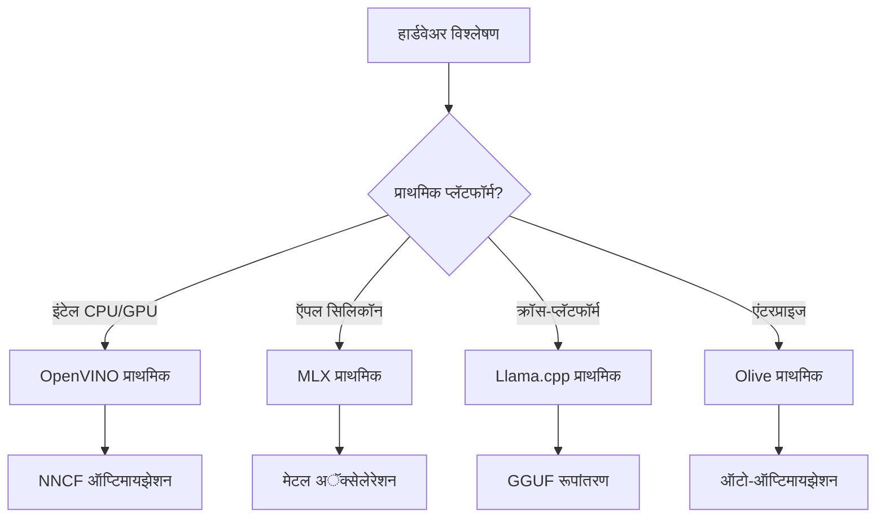
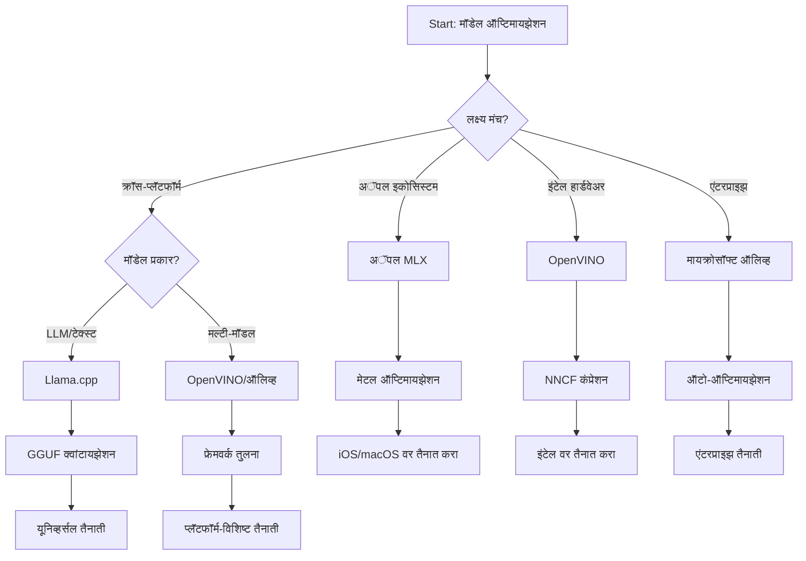
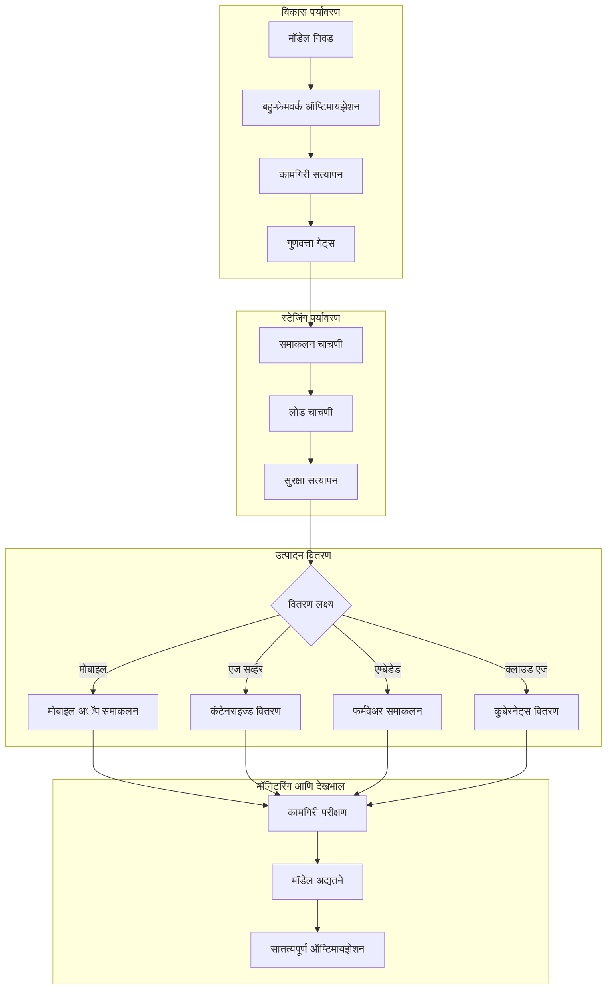

# विभाग 6: एज AI विकास कार्यप्रवाह संश्लेषण

## सूची
1. [परिचय](#परिचय)
2. [शिकण्याचे उद्दिष्टे](#शिकण्याचे-उद्दिष्टे)
3. [एकत्रित कार्यप्रवाह अवलोकन](#एकत्रित-कार्यप्रवाह-अवलोकन)
4. [फ्रेमवर्क निवड मॅट्रिक्स](#फ्रेमवर्क-निवड-मॅट्रिक्स)
5. [सर्वोत्तम पद्धतींचा संश्लेषण](#सर्वोत्तम-पद्धतींचा-संश्लेषण)
6. [परिनियोजन धोरण मार्गदर्शक](#परिनियोजन-धोरण-मार्गदर्शक)
7. [कामगिरी सुधारणा कार्यप्रवाह](#कार्यक्षमता-सुधारणा-कार्यप्रवाह)
8. [उत्पादन तयारी तपासणी यादी](#उत्पादन-तयारी-तपासणी-यादी)
9. [समस्या निवारण आणि निरीक्षण](#समस्या-निवारण-आणि-निरीक्षण)
10. [आपल्या एज AI पाईपलाईनचे भविष्यातील संरक्षण](#आपल्या-एज-ai-पाईपलाईनचे-भविष्यातील-संरक्षण)

## परिचय

एज AI विकासासाठी बहुविध सुधारणा फ्रेमवर्क्स, परिनियोजन धोरणे, आणि हार्डवेअर बाबतीत सखोल समज आवश्यक आहे. हा सखोल संश्लेषण Llama.cpp, Microsoft Olive, OpenVINO, आणि Apple MLX च्या ज्ञानाला एकत्र आणून एक एकात्मिक कार्यप्रवाह तयार करतो जो कार्यक्षमता वाढवतो, गुणवत्ता राखतो, आणि यशस्वी उत्पादन परिनियोजन सुनिश्चित करतो.

या कोर्समध्ये आपण वेगवेगळ्या सुधारणा फ्रेमवर्क्सचा अभ्यास केला आहे, ज्यांचे वेगळे बलस्थान आणि खास वापरकेस होते. मात्र, वास्तविक एज AI प्रकल्पांसाठी अनेक फ्रेमवर्क्समधील तंत्रांचा एकत्रित वापर करण्याची किंवा विशिष्ट बंधने आणि गरजांसाठी सर्वोत्तम निकाल देणाऱ्या पध्दतींची धोरणात्मक निवड करण्याची गरज असते.

हा विभाग सर्व फ्रेमवर्क्सच्या सामूहिक ज्ञानाचा उपयोग करून अमलात आणता येण्याजोगे कार्यप्रवाह, निर्णय वृक्ष, आणि सर्वोत्तम पद्धती तयार करतो, ज्याद्वारे तुम्ही उत्पादन-तयार एज AI उपाय जलद आणि प्रभावीपणे तयार करू शकता. तुम्ही मोबाइल उपकरणे, एम्बेडेड सिस्टम किंवा एज सर्व्हरवर ऑप्टिमायझेशन करत असाल, हा मार्गदर्शक तुम्हाला विकास जीवनचक्रात जागरूक निर्णय घेण्यासाठी धोरणात्मक फ्रेमवर्क पुरवतो.

## शिकण्याचे उद्दिष्टे

या विभागाच्या शेवटी, तुम्ही सक्षम असाल:

### धोरणात्मक निर्णय घेणे
- **प्रकल्प गरजा, हार्डवेअर बंधने, आणि परिनियोजन परिस्थिती यांच्या आधारावर सर्वोत्तम सुधारणा फ्रेमवर्कचे मूल्यांकन आणि निवड करा**
- **अधिकतम कार्यक्षमता साठी बहुविध सुधारणा तंत्रांचा समावेश करणारे सखोल कार्यप्रवाह डिझाइन करा**
- **मॉडेल अचूकता, अनुमान गती, स्मृती वापर, आणि परिनियोजन गुंतागुंती यामधील समतोल मूल्यांकन करा**

### कार्यप्रवाह एकत्रीकरण
- **अनेक फ्रेमवर्क्सच्या बलस्थानांचा उपयोग करणारे एकत्रित विकास पाईपलाईन्स राबवा**
- **सुसंगत मॉडेल ऑप्टिमायझेशन आणि परिनियोजनसाठी पुनरुत्पादित कार्यप्रवाह तयार करा**
- **उत्पादन गरजा पूर्ण करण्यासाठी गुणवत्ता गेट्स आणि प्रमाणीकरण प्रक्रिया स्थापन करा**

### कार्यक्षमता सुधारणा
- **संख्या क्वांटायझेशन, प्रूनिंग, आणि हार्डवेअर-विशिष्ट त्वरीकरण तंत्रांचा वापर करून साक्षेप पूर्ण करा**
- **विभिन्न ऑप्टिमायझेशन स्तरांवर आणि परिनियोजन लक्ष्यांवर मॉडेल कामगिरीवर लक्ष ठेवा आणि मापन करा**
- **CPU, GPU, NPU आणि विशेष एज त्वरीकरणांसारख्या विशिष्ट हार्डवेअर प्लॅटफॉर्मसाठी ऑप्टिमायझेशन करा**

### उत्पादन परिनियोजन
- **अनेक मॉडेल स्वरूप आणि अनुमान इंजिन स्वीकारणाऱ्या विस्तारित परिनियोजन आर्किटेक्चर डिझाइन करा**
- **उत्पादन वातावरणातील एज AI अनुप्रयोगांसाठी निरीक्षण आणि दृश्यता राबवा**
- **मॉडेल अद्यतने, कामगिरी निरीक्षण, आणि प्रणाली सुधारणा साठी देखभाल कार्यप्रवाह तयार करा**

### क्रॉस-प्लॅटफॉर्म उत्कृष्टता
- **विभिन्न हार्डवेअर प्लॅटफॉर्मवर सुसंगत कामगिरी राखत ऑप्टिमाईज्ड मॉडेल परिनियोजित करा**
- **विंडोज, मॅकोएस, लिनक्स, मोबाइल आणि एम्बेडेड सिस्टीमसाठी प्लॅटफॉर्म-विशिष्ट ऑप्टिमायझेशन हाताळा**
- **वेगवेगळ्या एज वातावरणात सहज परिनियोजनासाठी प्रतिबिंबक स्तर तयार करा**

## एकत्रित कार्यप्रवाह अवलोकन

### टप्पा 1: गरजांचे विश्लेषण आणि फ्रेमवर्क निवड

यशस्वी एज AI परिनियोजनाची पायाभरणी सखोल गरजांच्या विश्लेषणाने सुरू होते ज्यामुळे फ्रेमवर्क निवड आणि सुधारणा धोरण ठरवले जाते.

#### 1.1 हार्डवेअर मूल्यांकन

```mermaid
graph TD
    A[हार्डवेअर विश्लेषण] --> B{प्राथमिक प्लॅटफॉर्म?}
    B -->|इंटेल CPU/GPU| C[OpenVINO प्राथमिक]
    B -->|ऍपल सिलिकॉन| D[MLX प्राथमिक]
    B -->|क्रॉस-प्लॅटफॉर्म| E[Llama.cpp प्राथमिक]
    B -->|एंटरप्राइज| F[Olive प्राथमिक]
    
    C --> G[NNCF ऑप्टिमायझेशन]
    D --> H[मेटल अॅक्सेलेरेशन]
    E --> I[GGUF रूपांतरण]
    F --> J[ऑटो-ऑप्टिमायझेशन]
```

**महत्त्वाच्या बाबी:**
- **CPU आर्किटेक्चर**: x86, ARM, Apple सिलिकॉन क्षमता
- **त्वरीतक उपलब्धता**: GPU, NPU, VPU, खास AI चिप्स
- **स्मृती बंधने**: RAM मर्यादा, संचय क्षमता
- **बिजली बजेट**: बॅटरी आयुष्य, तापमान बंधने
- **संवाद क्षमता**: ऑफलाइन आवश्यकता, बँडविड्थ बंधने

#### 1.2 अनुप्रयोग गरज मॅट्रिक्स

| गरज | Llama.cpp | Microsoft Olive | OpenVINO | Apple MLX |
|-------------|-----------|-----------------|----------|-----------|
| क्रॉस-प्लॅटफॉर्म | ✅ उत्कृष्ट | ⚡ चांगले | ⚡ चांगले | ❌ फक्त Apple |
| एंटरप्राइझ एकत्रीकरण | ⚡ मूलभूत | ✅ उत्कृष्ट | ✅ उत्कृष्ट | ⚡ मर्यादित |
| मोबाइल परिनियोजन | ✅ उत्कृष्ट | ⚡ चांगले | ⚡ चांगले | ✅ iOS उत्कृष्ट |
| रिअल-टाइम अनुमान | ✅ उत्कृष्ट | ✅ उत्कृष्ट | ✅ उत्कृष्ट | ✅ उत्कृष्ट |
| मॉडेल विविधता | ✅ LLM केंद्रित | ✅ सर्व मॉडेल्स | ✅ सर्व मॉडेल्स | ✅ LLM केंद्रित |
| वापर सुलभता | ✅ साधे | ✅ स्वयंचलित | ⚡ मध्यम | ✅ साधे |

### टप्पा 2: मॉडेल तयार करणे आणि सुधारणा

#### 2.1 सार्वत्रिक मॉडेल मूल्यांकन पाईपलाईन

```python
# सार्वत्रिक मॉडेल मूल्यमापन फ्रेमवर्क
class EdgeAIModelAssessment:
    def __init__(self, model_path, target_hardware):
        self.model_path = model_path
        self.target_hardware = target_hardware
        self.optimization_frameworks = []
        
    def assess_model_characteristics(self):
        """Analyze model size, architecture, and complexity"""
        return {
            'model_size': self.get_model_size(),
            'parameter_count': self.get_parameter_count(),
            'architecture_type': self.detect_architecture(),
            'quantization_compatibility': self.check_quantization_support()
        }
    
    def recommend_optimization_strategy(self):
        """Recommend optimal frameworks and techniques"""
        characteristics = self.assess_model_characteristics()
        
        if self.target_hardware.startswith('apple'):
            return self.mlx_optimization_strategy(characteristics)
        elif self.target_hardware.startswith('intel'):
            return self.openvino_optimization_strategy(characteristics)
        elif characteristics['model_size'] > 7_000_000_000:  # 7B+ पॅरामीटर्स
            return self.enterprise_optimization_strategy(characteristics)
        else:
            return self.lightweight_optimization_strategy(characteristics)
```

#### 2.2 बहु-फ्रेमवर्क सुधारणा पाईपलाईन

**अनुक्रमिक सुधारणा पध्दत:**
1. **प्रारंभिक रूपांतरण**: मधल्या स्वरूपात रूपांतर करा (संभव असल्यास ONNX)
2. **फ्रेमवर्क-विशिष्ट सुधारणा**: खास तंत्र वापरा
3. **क्रॉस-व्हॅलिडेशन**: लक्ष्य प्लॅटफॉर्मवर कामगिरी पडताळा
4. **अंतिम पॅकेजिंग**: परिनियोजनासाठी तयार करा

```bash
# मल्टी-फ्रेमवर्क ऑप्टिमायझेशन स्क्रिप्ट
#!/bin/bash

MODEL_NAME="phi-3-mini"
BASE_MODEL="microsoft/Phi-3-mini-4k-instruct"

# टप्पा 1: ONNX रूपांतरण (सर्वसाधारण)
python convert_to_onnx.py --model $BASE_MODEL --output models/onnx/

# टप्पा 2: प्लॅटफॉर्म-विशिष्ट ऑप्टिमायझेशन
if [[ "$TARGET_PLATFORM" == "intel" ]]; then
    # OpenVINO ऑप्टिमायझेशन
    python optimize_openvino.py --input models/onnx/ --output models/openvino/
elif [[ "$TARGET_PLATFORM" == "apple" ]]; then
    # MLX ऑप्टिमायझेशन
    python optimize_mlx.py --input $BASE_MODEL --output models/mlx/
elif [[ "$TARGET_PLATFORM" == "cross" ]]; then
    # Llama.cpp ऑप्टिमायझेशन
    python convert_to_gguf.py --input models/onnx/ --output models/gguf/
fi

# टप्पा 3: पडताळणी
python validate_optimization.py --original $BASE_MODEL --optimized models/$TARGET_PLATFORM/
```

### टप्पा 3: कामगिरी प्रमाणीकरण आणि मापन

#### 3.1 सखोल मापन फ्रेमवर्क

```python
class EdgeAIBenchmark:
    def __init__(self, optimized_models):
        self.models = optimized_models
        self.metrics = {
            'inference_time': [],
            'memory_usage': [],
            'accuracy_score': [],
            'throughput': [],
            'energy_consumption': []
        }
    
    def run_comprehensive_benchmark(self):
        """Execute standardized benchmarks across all optimized models"""
        test_inputs = self.generate_test_inputs()
        
        for model_framework, model_path in self.models.items():
            print(f"Benchmarking {model_framework}...")
            
            # प्रतिसाद वेळ चाचणी
            latency = self.measure_inference_latency(model_path, test_inputs)
            
            # मेमरी प्रोफाइलिंग
            memory = self.profile_memory_usage(model_path)
            
            # अचूकता पडताळणी
            accuracy = self.validate_model_accuracy(model_path, test_inputs)
            
            # थ्रूपुट विश्लेषण
            throughput = self.measure_throughput(model_path)
            
            self.record_metrics(model_framework, latency, memory, accuracy, throughput)
    
    def generate_optimization_report(self):
        """Create comprehensive comparison report"""
        report = {
            'recommendations': self.analyze_performance_trade_offs(),
            'deployment_guidance': self.generate_deployment_recommendations(),
            'monitoring_requirements': self.define_monitoring_metrics()
        }
        return report
```

## फ्रेमवर्क निवड मॅट्रिक्स

### फ्रेमवर्क निवडीसाठी निर्णय वृक्ष


```mermaid
graph TD
    A[Start: मॉडेल ऑप्टिमायझेशन] --> B{लक्ष्य मंच?}
    
    B -->|अॅपल इकोसिस्टम| C[अॅपल MLX]
    B -->|इंटेल हार्डवेअर| D[OpenVINO]
    B -->|क्रॉस-प्लॅटफॉर्म| E{मॉडेल प्रकार?}
    B -->|एंटरप्राइझ| F[मायक्रोसॉफ्ट ऑलिव्ह]
    
    E -->|LLM/टेक्स्ट| G[Llama.cpp]
    E -->|मल्टी-मॉडल| H[OpenVINO/ऑलिव्ह]
    
    C --> I[मेटल ऑप्टिमायझेशन]
    D --> J[NNCF कंप्रेशन]
    F --> K[ऑटो-ऑप्टिमायझेशन]
    G --> L[GGUF क्वांटायझेशन]
    H --> M[फ्रेमवर्क तुलना]
    
    I --> N[iOS/macOS वर तैनात करा]
    J --> O[इंटेल वर तैनात करा]
    K --> P[एंटरप्राइझ तैनाती]
    L --> Q[यूनिव्हर्सल तैनाती]
    M --> R[प्लॅटफॉर्म-विशिष्ट तैनाती]
```

### सखोल निवड निकष

#### 1. प्राथमिक वापर प्रकरण जुळवा

**मोठे भाषा मॉडेल्स (LLMs):**
- **Llama.cpp**: CPU-केंद्रित, क्रॉस-प्लॅटफॉर्म परिनियोजनासाठी सर्वोत्तम
- **Apple MLX**: Apple सिलिकॉनसाठी आणि एकत्रित स्मृतीसाठी उत्तम
- **OpenVINO**: Intel हार्डवेअरसाठी उत्तम NNCF ऑप्टिमायझेशनसह
- **Microsoft Olive**: एंटरप्राइझ कार्यप्रवाहांसाठी आदर्श स्वयंचलनासह

**बहु-मोडल मॉडेल्स:**
- **OpenVINO**: दृष्टी, ऑडिओ, आणि मजकूरासाठी सखोल समर्थन
- **Microsoft Olive**: क्लिष्ट पाईपलाईन्ससाठी एंटरप्राइझ-दर्जाचे ऑप्टिमायझेशन
- **Llama.cpp**: फक्त मजकूर-आधारित मॉडेल्ससाठी मर्यादित
- **Apple MLX**: बहु-मोडल अनुप्रयोगांसाठी वाढती मदत

#### 2. हार्डवेअर प्लॅटफॉर्म मॅट्रिक्स

| प्लॅटफॉर्म | प्राथमिक फ्रेमवर्क | द्वितीयक पर्याय | विशेष वैशिष्ट्ये |
|----------|------------------|------------------|---------------------|
| Intel CPU/GPU | OpenVINO | Microsoft Olive | NNCF संकुचन, Intel ऑप्टिमायझेशन |
| NVIDIA GPU | Microsoft Olive | OpenVINO | CUDA त्वरीकरण, एंटरप्राइझ वैशिष्ट्ये |
| Apple Silicon | Apple MLX | Llama.cpp | Metal shaders, एकत्रित स्मृती |
| ARM मोबाइल | Llama.cpp | OpenVINO | क्रॉस-प्लॅटफॉर्म, न्यूनतम अवलंबित्वे |
| एज TPU | OpenVINO | Microsoft Olive | खास त्वरीतक सहाय्य |
| एम्बेडेड ARM | Llama.cpp | OpenVINO | कमी ठसा, कार्यक्षम अनुमान |

#### 3. विकास कार्यप्रवाह पसंती

**वेगवान प्रोटोटाइपिंग:**
1. **Llama.cpp**: सर्वात जलद सेटअप, तत्काळ निकाल
2. **Apple MLX**: सोपी Python API, जलद पुनरावृत्ती
3. **Microsoft Olive**: स्वयंचलित ऑप्टिमायझेशन, कमी संरचना
4. **OpenVINO**: अधिक गुंतागुंतीचे सेटअप, सखोल वैशिष्ट्ये

**एंटरप्राइझ उत्पादन:**
1. **Microsoft Olive**: एंटरप्राइज वैशिष्ट्ये, Azure एकत्रीकरण
2. **OpenVINO**: Intel परिसंस्था, सखोल साधने
3. **Apple MLX**: Apple-विशिष्ट एंटरप्राइझ अनुप्रयोग
4. **Llama.cpp**: सोपे परिनियोजन, मर्यादित एंटरप्राइज वैशिष्ट्ये

## सर्वोत्तम पद्धतींचा संश्लेषण

### सार्वत्रिक सुधारणा तत्त्वे

#### 1. प्रगतीशील सुधारणा धोरण

```python
class ProgressiveOptimization:
    def __init__(self, base_model):
        self.base_model = base_model
        self.optimization_stages = [
            'baseline_measurement',
            'format_conversion',
            'quantization_optimization',
            'hardware_acceleration',
            'production_validation'
        ]
    
    def execute_progressive_optimization(self):
        """Apply optimization techniques incrementally"""
        
        # टप्पा 1: बेसलाइन मापन
        baseline_metrics = self.measure_baseline_performance()
        
        # टप्पा 2: फॉरमॅट रूपांतरण
        converted_model = self.convert_to_optimal_format()
        conversion_metrics = self.measure_performance(converted_model)
        
        # टप्पा 3: क्वांटायझेशन
        quantized_model = self.apply_quantization(converted_model)
        quantization_metrics = self.measure_performance(quantized_model)
        
        # टप्पा 4: हार्डवेअर वेगवान करणे
        accelerated_model = self.enable_hardware_acceleration(quantized_model)
        acceleration_metrics = self.measure_performance(accelerated_model)
        
        # टप्पा 5: सत्यापन
        production_ready = self.validate_for_production(accelerated_model)
        
        return self.compile_optimization_report(
            baseline_metrics, conversion_metrics, 
            quantization_metrics, acceleration_metrics
        )
```

#### 2. गुणवत्ता गेट अंमलबजावणी

**अचूकता राखणी गेट्स:**
- मूळ मॉडेल अचूकतेचे >95% राखा
- प्रतिनिधिक चाचणी डेटासेट्सविरुद्ध प्रमाणीकरण करा
- उत्पादन खात्रीसाठी A/B चाचणी राबवा

**कार्यक्षमता सुधारणा गेट्स:**
- किमान 2x गती सुधारणा साध्य करा
- स्मृतीचा वापर किमान 50% कमी करा
- अनुमान वेळेची सुसंगती तपासा

**उत्पादन तयारी गेट्स:**
- भाराखाली तपासणी उत्तीर्ण करा
- वेळोवेळी स्थिर कामगिरी दर्शवा
- सुरक्षा आणि गोपनीयता आवश्यकतांचा प्रमाणीकरण करा

### फ्रेमवर्क-विशिष्ट सर्वोत्तम पद्धती एकत्रीकरण

#### 1. क्वांटायझेशन धोरण संश्लेषण

```python
# एकत्रित क्वांटायझेशन पद्धत
class UnifiedQuantizationStrategy:
    def __init__(self, model, target_platform):
        self.model = model
        self.platform = target_platform
        
    def select_optimal_quantization(self):
        """Choose best quantization based on platform and requirements"""
        
        if self.platform == 'apple_silicon':
            return self.mlx_quantization_strategy()
        elif self.platform == 'intel_hardware':
            return self.openvino_quantization_strategy()
        elif self.platform == 'cross_platform':
            return self.llamacpp_quantization_strategy()
        else:
            return self.olive_quantization_strategy()
    
    def mlx_quantization_strategy(self):
        """Apple MLX-specific quantization"""
        return {
            'method': 'mlx_quantize',
            'precision': 'int4',
            'group_size': 64,
            'optimization_target': 'unified_memory'
        }
    
    def openvino_quantization_strategy(self):
        """OpenVINO NNCF quantization"""
        return {
            'method': 'nncf_quantize',
            'precision': 'int8',
            'calibration_method': 'post_training',
            'optimization_target': 'intel_hardware'
        }
```

#### 2. हार्डवेअर त्वरीकरण सुधारणा

**CPU ऑप्टिमायझेशन संश्लेषण:**
- **SIMD सूचना**: फ्रेमवर्क्समध्ये ऑप्टिमायझ्ड कर्नल्सचा वापर करा
- **स्मृती बँडविड्थ**: कॅश कार्यक्षमतेसाठी डेटा लेआउट ऑप्टिमाइझ करा
- **थ्रेडिंग**: संसाधन मर्यादांशी समतोल ठेवा

**GPU त्वरीकरण सर्वोत्तम पद्धती:**
- **बॅच प्रक्रिया**: योग्य बॅच आकारांसह जास्तीत जास्त थ्रूपुट मिळवा
- **स्मृती व्यवस्थापन**: GPU स्मृती वाटप आणि ट्रान्सफर ऑप्टिमाइझ करा
- **प्रिसिजन**: चांगल्या कार्यक्षमतेसाठी समर्थित असल्यास FP16 वापरा

**NPU/विशेष त्वरीतक सुधारणा:**
- **मॉडेल आर्किटेक्चर**: त्वरीतक क्षमतांशी सुसंगतता सुनिश्चित करा
- **डेटा प्रवाह**: त्वरीतक कार्यक्षमतेसाठी इनपुट/आउटपुट पाईपलाईन्स ऑप्टिमाइझ करा
- **फॉलबॅक धोरणे**: न समर्थित ऑपरेशन्ससाठी CPU फॉलबॅक अंमलात आणा

## परिनियोजन धोरण मार्गदर्शक

### सार्वत्रिक परिनियोजन आर्किटेक्चर


```mermaid
graph TB
    subgraph "विकास पर्यावरण"
        A[मॉडेल निवड] --> B[बहु-फ्रेमवर्क ऑप्टिमायझेशन]
        B --> C[कामगिरी सत्यापन]
        C --> D[गुणवत्ता गेट्स]
    end
    
    subgraph "स्टेजिंग पर्यावरण"
        D --> E[समाकलन चाचणी]
        E --> F[लोड चाचणी]
        F --> G[सुरक्षा सत्यापन]
    end
    
    subgraph "उत्पादन वितरण"
        G --> H{वितरण लक्ष्य}
        H -->|मोबाइल| I[मोबाइल अॅप समाकलन]
        H -->|एज सर्व्हर| J[कंटेनराइज्ड वितरण]
        H -->|एम्बेडेड| K[फर्मवेअर समाकलन]
        H -->|क्लाउड एज| L[कुबेरनेट्स वितरण]
    end
    
    subgraph "मॉनिटरिंग आणि देखभाल"
        I --> M[कामगिरी परीक्षण]
        J --> M
        K --> M
        L --> M
        M --> N[मॉडेल अद्यतने]
        N --> O[सातत्यपूर्ण ऑप्टिमायझेशन]
    end
```

### प्लॅटफॉर्म-विशिष्ट परिनियोजन पॅटर्न्स

#### 1. मोबाइल परिनियोजन धोरण

```yaml
# Mobile Deployment Configuration
mobile_deployment:
  ios:
    framework: apple_mlx
    optimization:
      quantization: int4
      memory_mapping: true
      background_execution: limited
    packaging:
      format: mlx
      bundle_size: <50MB
      
  android:
    framework: llama_cpp
    optimization:
      quantization: q4_k_m
      threading: android_optimized
      memory_management: conservative
    packaging:
      format: gguf
      apk_size: <100MB
      
  cross_platform:
    framework: onnx_runtime
    optimization:
      quantization: int8
      execution_provider: cpu
    packaging:
      format: onnx
      shared_libraries: minimal
```

#### 2. एज सर्व्हर परिनियोजन

```yaml
# Edge Server Deployment Configuration
edge_server:
  intel_based:
    framework: openvino
    optimization:
      quantization: int8
      acceleration: cpu_gpu_auto
      batch_processing: dynamic
    deployment:
      container: openvino_runtime
      orchestration: kubernetes
      scaling: horizontal
      
  nvidia_based:
    framework: microsoft_olive
    optimization:
      quantization: int4
      acceleration: cuda
      tensor_parallelism: true
    deployment:
      container: nvidia_triton
      orchestration: kubernetes
      scaling: gpu_aware
```

### कंटेनरायझेशन सर्वोत्तम पद्धती

```dockerfile
# Multi-Framework Edge AI Container
FROM ubuntu:22.04 as base

# Install common dependencies
RUN apt-get update && apt-get install -y \
    python3 \
    python3-pip \
    build-essential \
    cmake \
    && rm -rf /var/lib/apt/lists/*

# Framework-specific stages
FROM base as openvino
RUN pip install openvino nncf optimum[intel]

FROM base as llamacpp
RUN git clone https://github.com/ggerganov/llama.cpp.git \
    && cd llama.cpp && make LLAMA_OPENBLAS=1

FROM base as olive
RUN pip install olive-ai[auto-opt] onnxruntime-genai

# Production stage with selected framework
FROM openvino as production
COPY models/ /app/models/
COPY src/ /app/src/
WORKDIR /app

EXPOSE 8080
CMD ["python3", "src/inference_server.py"]
```

## कार्यक्षमता सुधारणा कार्यप्रवाह

### सुसंगत कार्यक्षमता ट्यूनिंग

#### 1. कार्यक्षमता प्रोफाइलिंग पाईपलाईन

```python
class EdgeAIPerformanceProfiler:
    def __init__(self, model_path, framework):
        self.model_path = model_path
        self.framework = framework
        self.profiling_results = {}
    
    def comprehensive_profiling(self):
        """Execute comprehensive performance analysis"""
        
        # CPU प्रोफाइलिंग
        cpu_profile = self.profile_cpu_usage()
        
        # मेमरी प्रोफाइलिंग
        memory_profile = self.profile_memory_usage()
        
        # अनुमान विलंब
        latency_profile = self.profile_inference_latency()
        
        # थ्रूपुट विश्लेषण
        throughput_profile = self.profile_throughput()
        
        # ऊर्जा वापर (जिथे उपलब्ध आहे)
        energy_profile = self.profile_energy_consumption()
        
        return self.compile_performance_report(
            cpu_profile, memory_profile, latency_profile,
            throughput_profile, energy_profile
        )
    
    def identify_bottlenecks(self):
        """Automatically identify performance bottlenecks"""
        bottlenecks = []
        
        if self.profiling_results['cpu_utilization'] > 80:
            bottlenecks.append('cpu_bound')
        
        if self.profiling_results['memory_usage'] > 90:
            bottlenecks.append('memory_bound')
        
        if self.profiling_results['inference_variance'] > 20:
            bottlenecks.append('inconsistent_performance')
        
        return self.generate_optimization_recommendations(bottlenecks)
```

#### 2. स्वयंचलित सुधारणा पाईपलाईन

```python
class AutomatedOptimizationPipeline:
    def __init__(self, base_model, target_constraints):
        self.base_model = base_model
        self.constraints = target_constraints
        self.optimization_history = []
    
    def execute_optimization_search(self):
        """Systematically search optimization space"""
        
        optimization_candidates = [
            {'quantization': 'int8', 'pruning': 0.1},
            {'quantization': 'int4', 'pruning': 0.2},
            {'quantization': 'int8', 'acceleration': 'gpu'},
            {'quantization': 'int4', 'acceleration': 'npu'}
        ]
        
        best_configuration = None
        best_score = 0
        
        for config in optimization_candidates:
            optimized_model = self.apply_optimization(config)
            score = self.evaluate_optimization(optimized_model)
            
            if score > best_score and self.meets_constraints(optimized_model):
                best_score = score
                best_configuration = config
            
            self.optimization_history.append({
                'config': config,
                'score': score,
                'model': optimized_model
            })
        
        return best_configuration, self.optimization_history
```

### बहु-उद्दिष्ट सुधारणा

#### 1. एज AI साठी पारेतो ऑप्टिमायझेशन

```python
class ParetoOptimization:
    def __init__(self, objectives=['speed', 'accuracy', 'memory']):
        self.objectives = objectives
        self.pareto_frontier = []
    
    def find_pareto_optimal_solutions(self, optimization_results):
        """Identify Pareto-optimal configurations"""
        
        for result in optimization_results:
            is_dominated = False
            
            for frontier_point in self.pareto_frontier:
                if self.dominates(frontier_point, result):
                    is_dominated = True
                    break
            
            if not is_dominated:
                # सीमारेषेवरून प्रभुत्व असलेले मुद्दे काढा
                self.pareto_frontier = [
                    point for point in self.pareto_frontier 
                    if not self.dominates(result, point)
                ]
                
                self.pareto_frontier.append(result)
        
        return self.pareto_frontier
    
    def recommend_configuration(self, user_preferences):
        """Recommend configuration based on user preferences"""
        
        weighted_scores = []
        for config in self.pareto_frontier:
            score = sum(
                user_preferences[obj] * config['metrics'][obj] 
                for obj in self.objectives
            )
            weighted_scores.append((score, config))
        
        return max(weighted_scores, key=lambda x: x[0])[1]
```

## उत्पादन तयारी तपासणी यादी

### सखोल उत्पादन प्रमाणीकरण

#### 1. मॉडेल गुणवत्ता हमी

```python
class ProductionReadinessValidator:
    def __init__(self, optimized_model, production_requirements):
        self.model = optimized_model
        self.requirements = production_requirements
        self.validation_results = {}
    
    def validate_model_quality(self):
        """Comprehensive model quality validation"""
        
        # अचूकता पडताळणी
        accuracy_result = self.validate_accuracy()
        
        # कार्यक्षमता पडताळणी
        performance_result = self.validate_performance()
        
        # मजबुती चाचणी
        robustness_result = self.validate_robustness()
        
        # सुरक्षा मूल्यांकन
        security_result = self.validate_security()
        
        # अनुपालन पडताळणी
        compliance_result = self.validate_compliance()
        
        return self.compile_validation_report(
            accuracy_result, performance_result, robustness_result,
            security_result, compliance_result
        )
    
    def generate_certification_report(self):
        """Generate production certification report"""
        return {
            'model_signature': self.generate_model_signature(),
            'validation_timestamp': datetime.now(),
            'validation_results': self.validation_results,
            'deployment_approval': self.check_deployment_approval(),
            'monitoring_requirements': self.define_monitoring_requirements()
        }
```

#### 2. उत्पादन परिनियोजन तपासणी यादी

**परिनियोजनपूर्व प्रमाणीकरण:**
- [ ] मॉडेल अचूकता किमान आवश्यकता पूर्ण करते (>95% मूलभूत)
- [ ] कामगिरी लक्ष्ये साध्य केली (विलंब, थ्रूपुट, स्मृती)
- [ ] सुरक्षा असुरक्षितता तपासली आणि कमी केली
- [ ] अपेक्षित भाराखाली ताण तपासणी पूर्ण केली
- [ ] अपयश परिस्थिती तपासल्या आणि पुनर्प्राप्ती प्रक्रिया प्रमाणित केल्या
- [ ] निरीक्षण आणि अलर्ट सिस्टम्स संरचीत केले
- [ ] रोलबॅक प्रक्रिया तपासल्या आणि दस्तऐवजीकरण केल्या

**परिनियोजन प्रक्रिया:**
- [ ] ब्लू-ग्रीन परिनियोजन धोरण राबवले
- [ ] हळूवार ट्रॅफिक वाढीचे नियोजन केले
- [ ] रिअल-टाइम निरीक्षण डॅशबोर्ड्स सक्रिय
- [ ] कामगिरी मूलभूतरेषा स्थापन केल्या
- [ ] त्रुटी दर प्रतिबंध निर्दिष्ट केले
- [ ] स्वयंचलित रोलबॅक ट्रिगर संरचीत केले

**परिनियोजनानंतर निरीक्षण:**
- [ ] मॉडेल ड्रिफ्ट शोध सक्रिय
- [ ] कामगिरी कमी होण्याबाबत अलर्ट संरचीत
- [ ] संसाधन वापर निरीक्षण सक्षम
- [ ] वापरकर्ता अनुभव निर्देशांक ट्रॅकिंग
- [ ] मॉडेल आवृत्ती आणि वंश चौकशी राखली
- [ ] नियमित मॉडेल कामगिरी पुनरावलोकने ठराविक

### सतत इंटीग्रेशन/सतत परिनियोजन (CI/CD)

```yaml
# Edge AI CI/CD Pipeline Configuration
edge_ai_pipeline:
  stages:
    - model_validation
    - optimization
    - testing
    - staging_deployment
    - production_deployment
    - monitoring
  
  model_validation:
    accuracy_threshold: 0.95
    performance_baseline: required
    security_scan: enabled
    
  optimization:
    frameworks:
      - llama_cpp
      - openvino
      - microsoft_olive
    validation:
      cross_validation: enabled
      performance_comparison: required
      
  testing:
    unit_tests: comprehensive
    integration_tests: full_pipeline
    load_tests: production_scale
    security_tests: comprehensive
    
  deployment:
    strategy: blue_green
    traffic_ramping: gradual
    rollback: automatic
    monitoring: real_time
```

## समस्या निवारण आणि निरीक्षण

### सार्वत्रिक समस्या निवारण फ्रेमवर्क

#### 1. सामान्य समस्या आणि उपाय

**कामगिरी समस्या:**
```python
class PerformanceTroubleshooter:
    def __init__(self, model_metrics):
        self.metrics = model_metrics
        
    def diagnose_performance_issues(self):
        """Systematic performance issue diagnosis"""
        
        issues = []
        
        # उच्च लेटेंसी निदान
        if self.metrics['avg_latency'] > self.metrics['target_latency']:
            issues.append(self.diagnose_latency_issues())
        
        # मेमरी वापर निदान
        if self.metrics['memory_usage'] > self.metrics['memory_limit']:
            issues.append(self.diagnose_memory_issues())
        
        # थ्रूपुट निदान
        if self.metrics['throughput'] < self.metrics['target_throughput']:
            issues.append(self.diagnose_throughput_issues())
        
        return self.generate_resolution_plan(issues)
    
    def diagnose_latency_issues(self):
        """Specific latency troubleshooting"""
        potential_causes = []
        
        if self.metrics['cpu_utilization'] > 80:
            potential_causes.append('cpu_bottleneck')
        
        if self.metrics['memory_bandwidth'] > 90:
            potential_causes.append('memory_bandwidth_limit')
        
        if self.metrics['model_size'] > self.metrics['optimal_size']:
            potential_causes.append('model_too_large')
        
        return {
            'issue': 'high_latency',
            'causes': potential_causes,
            'solutions': self.generate_latency_solutions(potential_causes)
        }
```

**फ्रेमवर्क-विशिष्ट समस्या निवारण:**

| समस्या | Llama.cpp | Microsoft Olive | OpenVINO | Apple MLX |
|-------|-----------|-----------------|----------|-----------|
| स्मृती समस्या | संदर्भ लांबी कमी करा | बॅच आकार कमी करा | कॅशिंग सक्षम करा | स्मृती मॅपिंग वापरा |
| मंद अनुमान | SIMD सक्षम करा | क्वांटायझेशन तपासा | थ्रेडिंग ऑप्टिमाइझ करा | Metal सक्षम करा |
| अचूकता कमी | जास्त क्वांटायझेशन करा | QAT सह पुनरप्रशिक्षण करा | कॅलिब्रेशन वाढवा | क्वांट नंतर फायन-ट्यून करा |
| सुसंगतता | मॉडेल स्वरूप तपासा | फ्रेमवर्क आवृत्ती तपासा | ड्रायव्हर्स अपडेट करा | macOS आवृत्ती तपासा |

#### 2. उत्पादन निरीक्षण धोरण

```python
class EdgeAIMonitoring:
    def __init__(self, deployment_config):
        self.config = deployment_config
        self.metrics_collectors = []
        self.alerting_rules = []
    
    def setup_comprehensive_monitoring(self):
        """Configure comprehensive monitoring for Edge AI deployment"""
        
        # मॉडेल कामगिरी निरीक्षण
        self.setup_model_performance_monitoring()
        
        # पायाभूत सुविधा निरीक्षण
        self.setup_infrastructure_monitoring()
        
        # व्यवसाय मेट्रिक्स निरीक्षण
        self.setup_business_metrics_monitoring()
        
        # सुरक्षा निरीक्षण
        self.setup_security_monitoring()
    
    def setup_model_performance_monitoring(self):
        """Model-specific performance monitoring"""
        metrics = [
            'inference_latency_p50',
            'inference_latency_p95',
            'inference_latency_p99',
            'model_accuracy_drift',
            'prediction_confidence_distribution',
            'error_rate',
            'throughput_requests_per_second'
        ]
        
        for metric in metrics:
            self.add_metric_collector(metric)
            self.add_alerting_rule(metric)
    
    def detect_model_drift(self):
        """Automated model drift detection"""
        drift_indicators = [
            self.statistical_drift_detection(),
            self.performance_drift_detection(),
            self.data_distribution_shift_detection()
        ]
        
        return self.aggregate_drift_signals(drift_indicators)
```

### स्वयंचलित समस्या निवारण

```python
class AutomatedIssueResolution:
    def __init__(self, monitoring_system):
        self.monitoring = monitoring_system
        self.resolution_strategies = {}
    
    def handle_performance_degradation(self, alert):
        """Automated performance issue resolution"""
        
        if alert['type'] == 'high_latency':
            return self.resolve_latency_issue(alert)
        elif alert['type'] == 'high_memory_usage':
            return self.resolve_memory_issue(alert)
        elif alert['type'] == 'accuracy_drift':
            return self.resolve_accuracy_issue(alert)
        
    def resolve_latency_issue(self, alert):
        """Automated latency issue resolution"""
        resolution_steps = [
            'increase_cpu_allocation',
            'enable_model_caching',
            'reduce_batch_size',
            'switch_to_quantized_model'
        ]
        
        for step in resolution_steps:
            if self.apply_resolution_step(step):
                return f"Resolved latency issue with: {step}"
        
        return "Escalating to human operator"
```

## आपल्या एज AI पाईपलाईनचे भविष्यातील संरक्षण

### उदयोन्मुख तंत्रज्ञान एकत्रीकरण

#### 1. पुढील पिढीचे हार्डवेअर समर्थन

```python
class FutureHardwareIntegration:
    def __init__(self):
        self.supported_accelerators = [
            'npu_next_gen',
            'quantum_processors',
            'neuromorphic_chips',
            'optical_processors'
        ]
    
    def design_adaptive_pipeline(self):
        """Create hardware-agnostic optimization pipeline"""
        
        pipeline = {
            'model_preparation': self.universal_model_preparation(),
            'hardware_detection': self.dynamic_hardware_detection(),
            'optimization_selection': self.adaptive_optimization_selection(),
            'performance_validation': self.hardware_agnostic_validation()
        }
        
        return pipeline
    
    def adaptive_optimization_selection(self):
        """Dynamically select optimization based on available hardware"""
        
        def optimize_for_hardware(model, available_hardware):
            if 'npu' in available_hardware:
                return self.npu_optimization(model)
            elif 'quantum' in available_hardware:
                return self.quantum_optimization(model)
            elif 'neuromorphic' in available_hardware:
                return self.neuromorphic_optimization(model)
            else:
                return self.fallback_optimization(model)
        
        return optimize_for_hardware
```

#### 2. मॉडेल आर्किटेक्चर विकास

**उदयोन्मुख आर्किटेक्चरसाठी समर्थन:**
- **मिश्र तज्ज्ञ (MoE)**: कार्यक्षमतेसाठी विरळ मॉडेल आर्किटेक्चर
- **रिट्रिव्हल-अगमेंटेड जनरेशन**: संकरित मॉडेल + ज्ञानाधार प्रणाली
- **बहु-मोडल मॉडेल्स**: दृष्टी + भाषा + ऑडिओ एकत्रीकरण
- **फेडरेटेड शिक्षण**: वितरित प्रशिक्षण आणि सुधारणा

```python
class NextGenModelSupport:
    def __init__(self):
        self.architecture_handlers = {
            'moe': self.handle_mixture_of_experts,
            'rag': self.handle_retrieval_augmented,
            'multimodal': self.handle_multimodal,
            'federated': self.handle_federated_learning
        }
    
    def handle_mixture_of_experts(self, model):
        """Optimize Mixture of Experts models for edge deployment"""
        optimization_strategy = {
            'expert_pruning': True,
            'routing_optimization': True,
            'expert_quantization': 'per_expert',
            'load_balancing': 'dynamic'
        }
        return self.apply_moe_optimization(model, optimization_strategy)
```

### सतत शिक्षण आणि अनुकूलन

#### 1. ऑनलाइन शिक्षण एकत्रीकरण

```python
class EdgeOnlineLearning:
    def __init__(self, base_model, learning_rate=0.001):
        self.base_model = base_model
        self.learning_rate = learning_rate
        self.adaptation_buffer = []
    
    def continuous_adaptation(self, new_data, feedback):
        """Continuously adapt model based on edge data"""
        
        # गोपनीयता जपणारी स्थानिक रूपांतर
        local_updates = self.compute_local_gradients(new_data, feedback)
        
        # बंधने लागू करून अद्यतने करा
        adapted_model = self.apply_constrained_updates(
            self.base_model, local_updates
        )
        
        # रूपांतराची गुणवत्ता सत्यापित करा
        if self.validate_adaptation(adapted_model):
            self.base_model = adapted_model
            return True
        
        return False
    
    def federated_learning_participation(self):
        """Participate in federated learning while preserving privacy"""
        
        # स्थानिक मॉडेल अद्यतने गणना करा
        local_updates = self.compute_private_updates()
        
        # भेदात्मक गोपनीयता संरक्षण
        private_updates = self.apply_differential_privacy(local_updates)
        
        # फेडरेटेड शिक्षण समन्वयकासोबत सामायिक करा
        return self.share_updates(private_updates)
```

#### 2. शाश्वतता आणि ग्रीन AI

```python
class GreenEdgeAI:
    def __init__(self, sustainability_targets):
        self.targets = sustainability_targets
        self.energy_monitor = EnergyMonitor()
    
    def optimize_for_sustainability(self, model):
        """Optimize model for minimal environmental impact"""
        
        optimization_objectives = [
            'minimize_energy_consumption',
            'maximize_hardware_utilization',
            'reduce_model_training_cost',
            'extend_device_lifetime'
        ]
        
        return self.multi_objective_green_optimization(
            model, optimization_objectives
        )
    
    def carbon_aware_deployment(self):
        """Deploy models considering carbon footprint"""
        
        deployment_strategy = {
            'prefer_renewable_energy_regions': True,
            'optimize_for_energy_efficiency': True,
            'minimize_data_transfer': True,
            'lifecycle_carbon_accounting': True
        }
        
        return deployment_strategy
```

## निष्कर्ष

हा सखोल कार्यप्रवाह संश्लेषण एज AI सुधारणा ज्ञानाचा संगम आहे, जे सर्व प्रमुख सुधारणा फ्रेमवर्क्समधील सर्वोत्तम पद्धती एकत्र करून एक एकसंध, उत्पादन-तयार दृष्टिकोन तयार करतो. या मार्गदर्शकांचे पालन करून, तुम्ही सक्षम असाल:

**आदर्श कार्यक्षमता साध्य करा**: सुसंगत फ्रेमवर्क निवड, प्रगतीशील सुधारणा, आणि सखोल प्रमाणीकरणाद्वारे, जेणेकरून तुमचे एज AI अनुप्रयोग उच्चतम कार्यक्षमतेने काम करतील.

**उत्पादन तयारी सुनिश्चित करा**: सखोल चाचणी, निरीक्षण, आणि गुणवत्ता गेट्ससह जे विश्वसनीय परिनियोजन आणि वास्तव जगातील कार्यसाधनेसाठी खात्रीशीर आहेत.

**दीर्घकालीन यश टिकवा**: सतत निरीक्षण, स्वयंचलित समस्या निवारण, आणि अनुकूलन धोरणांद्वारे जे तुमच्या एज AI उपायांना कार्यक्षम आणि संबंधित राखतात.

**तुमच्या गुंतवणुकीचे भविष्यातील संरक्षण करा**: लवचिक, हार्डवेअर-स्वतंत्र पाईपलाईन्स डिझाइन करून जी उदयोन्मुख तंत्रज्ञान आणि गरजांसह विकसित होऊ शकतात.

एज AI क्षेत्र वेगाने विकसित होत आहे, ज्यामध्ये नवीन हार्डवेअर प्लॅटफॉर्म्स, सुधारणा तंत्रे, आणि परिनियोजन धोरणे नियमितपणे उदयास येत आहेत. हा संश्लेषण या गुंतागुंतीत प्रभावीपणे मार्गदर्शन करण्यासाठी पाया प्रदान करतो तर मजबूत, कार्यक्षम, आणि देखभाल करण्यायोग्य एज AI उपाय तयार करतो जे उत्पादन वातावरणात वास्तविक मूल्य देतात.

लक्षात ठेवा की सर्वोत्तम सुधारणा धोरण तेच आहे जे तुमच्या विशेष गरजांना पूर्ण करते आणि त्या गरजा विकसित होत असल्याने अनुकूल होण्याची लवचीकता राखते. या मार्गदर्शकाचा वापर माहितीपूर्ण निर्णय घेण्यासाठी फ्रेमवर्क म्हणून करा, पण नेहमीच तुमच्या निवडींचा परीक्षात्मक चाचणी आणि वास्तविक परिनियोजन अनुभवातून प्रमाणीकरण करा.

## ➡️ पुढे काय


- [07: Qualcomm QNN फ्रेमवर्क डीप डायव्ह](./07.QualcommQNN.md)

---

<!-- CO-OP TRANSLATOR DISCLAIMER START -->
**अस्वीकरण**:
हा दस्तऐवज AI भाषांतर सेवा [Co-op Translator](https://github.com/Azure/co-op-translator) चा वापर करून अनुवादित केला आहे. जरी आम्ही अचूकतेसाठी प्रयत्न करतो, तरी कृपया लक्षात घ्या की स्वयंचलित भाषांतरांमध्ये त्रुटी किंवा अचूकतेची कमतरता असू शकते. मूळ दस्तऐवज त्याच्या मूळ भाषेत अधिकृत स्रोत मानला पाहिजे. महत्त्वाची माहिती असल्यास, व्यावसायिक मानवी भाषांतराची शिफारस केली जाते. या भाषांतराच्या वापरामुळे उद्भवणाऱ्या कोणत्याही गैरसमज किंवा चुकीच्या अर्थलावणीसाठी आम्ही जबाबदार नाही.
<!-- CO-OP TRANSLATOR DISCLAIMER END -->