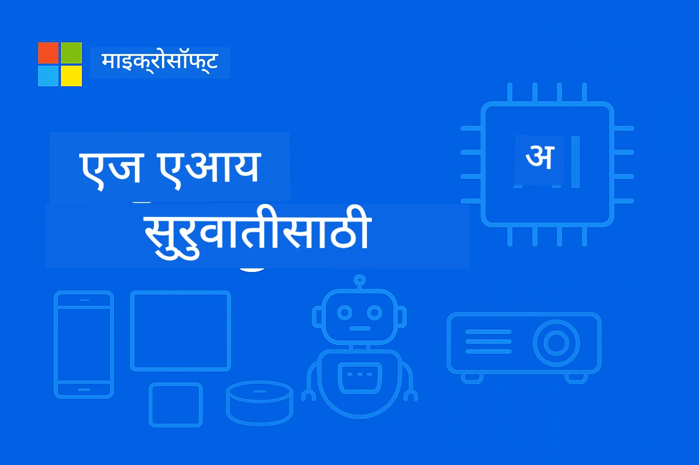

# EdgeAI सुरुवातीसाठी 




[](https://GitHub.com/microsoft/edgeai-for-beginners/graphs/contributors)
[](https://GitHub.com/microsoft/edgeai-for-beginners/issues)
[](https://GitHub.com/microsoft/edgeai-for-beginners/pulls)
[](http://makeapullrequest.com)

[](https://GitHub.com/microsoft/edgeai-for-beginners/watchers)
[](https://GitHub.com/microsoft/edgeai-for-beginners/fork)
[](https://GitHub.com/microsoft/edgeai-for-beginners/stargazers)


[](https://discord.gg/nTYy5BXMWG)

या संसाधनांचा वापर सुरू करण्यासाठी खालील चरणांचे अनुसरण करा:

1. **संग्रहालय फोर्क करा**: क्लिक करा [](https://GitHub.com/microsoft/edgeai-for-beginners/fork)
2. **संग्रहालय क्लोन करा**:   `git clone https://github.com/microsoft/edgeai-for-beginners.git`
3. [**Azure AI Foundry Discord मध्ये सामील व्हा आणि तज्ञ व सहकारी डेव्हलपर भेटा**](https://discord.com/invite/ByRwuEEgH4)


### 🌐 बहुभाषिक समर्थन

#### GitHub Action द्वारे समर्थित (स्वयंचलित आणि नेहमी अपडेट)

<!-- CO-OP TRANSLATOR LANGUAGES TABLE START -->
[Arabic](../ar/README.md) | [Bengali](../bn/README.md) | [Bulgarian](../bg/README.md) | [Burmese (Myanmar)](../my/README.md) | [Chinese (Simplified)](../zh-CN/README.md) | [Chinese (Traditional, Hong Kong)](../zh-HK/README.md) | [Chinese (Traditional, Macau)](../zh-MO/README.md) | [Chinese (Traditional, Taiwan)](../zh-TW/README.md) | [Croatian](../hr/README.md) | [Czech](../cs/README.md) | [Danish](../da/README.md) | [Dutch](../nl/README.md) | [Estonian](../et/README.md) | [Finnish](../fi/README.md) | [French](../fr/README.md) | [German](../de/README.md) | [Greek](../el/README.md) | [Hebrew](../he/README.md) | [Hindi](../hi/README.md) | [Hungarian](../hu/README.md) | [Indonesian](../id/README.md) | [Italian](../it/README.md) | [Japanese](../ja/README.md) | [Kannada](../kn/README.md) | [Korean](../ko/README.md) | [Lithuanian](../lt/README.md) | [Malay](../ms/README.md) | [Malayalam](../ml/README.md) | [Marathi](./README.md) | [Nepali](../ne/README.md) | [Nigerian Pidgin](../pcm/README.md) | [Norwegian](../no/README.md) | [Persian (Farsi)](../fa/README.md) | [Polish](../pl/README.md) | [Portuguese (Brazil)](../pt-BR/README.md) | [Portuguese (Portugal)](../pt-PT/README.md) | [Punjabi (Gurmukhi)](../pa/README.md) | [Romanian](../ro/README.md) | [Russian](../ru/README.md) | [Serbian (Cyrillic)](../sr/README.md) | [Slovak](../sk/README.md) | [Slovenian](../sl/README.md) | [Spanish](../es/README.md) | [Swahili](../sw/README.md) | [Swedish](../sv/README.md) | [Tagalog (Filipino)](../tl/README.md) | [Tamil](../ta/README.md) | [Telugu](../te/README.md) | [Thai](../th/README.md) | [Turkish](../tr/README.md) | [Ukrainian](../uk/README.md) | [Urdu](../ur/README.md) | [Vietnamese](../vi/README.md)

> **स्थानिक क्लोन प्राधान्य द्यायचे का?**

> या रिपॉझिटरीमध्ये ५०+ भाषांतरांचा समावेश आहे ज्यामुळे डाउनलोडचा आकार मोठा होतो. भाषांतरांशिवाय क्लोन करण्यासाठी sparse checkout वापरा:
> ```bash
> git clone --filter=blob:none --sparse https://github.com/microsoft/edgeai-for-beginners.git
> cd edgeai-for-beginners
> git sparse-checkout set --no-cone '/*' '!translations' '!translated_images'
> ```
> यामुळे तुम्हाला कोर्स पूर्ण करण्यासाठी गरजेची सर्व माहिती अधिक वेगाने मिळेल.
<!-- CO-OP TRANSLATOR LANGUAGES TABLE END -->

**जर तुम्हाला अतिरिक्त भाषांतरांसाठी समर्थन हवे असल्यास ते [येथे](https://github.com/Azure/co-op-translator/blob/main/getting_started/supported-languages.md) सूचीबद्ध आहे**
## परिचय

**EdgeAI for Beginners** मध्ये तुमचे स्वागत आहे – एज आर्टिफिशियल इंटेलिजेंसच्या परिवर्तनकारी जगात तुमचा सर्वसमावेशक प्रवास. हा कोर्स शक्तिशाली AI क्षमता आणि एज उपकरणांवर प्रत्यक्ष व्यवहारातील तैनात करण्याच्या दरम्यानची दरी कमी करतो, त्यासाठी तुम्हाला AIची क्षमता थेट जिथे डेटा तयार होतो आणि निर्णय घेतले जातात तिथे वापरण्याची क्षमता प्रदान करतो.

### तुम्ही काय शिकाल

हा कोर्स तुम्हाला मूलभूत संकल्पनांपासून उत्पादनापर्यंतची तयारी केली जाते, ज्यात समाविष्ट आहे:
- **एजवर तैनात करण्यासाठी ऑप्टिमाइझ केलेले लहान भाषा मॉडेल्स (SLMs)**
- **विविध प्लॅटफॉर्मवर हार्डवेअर-जाणिवानुसार ऑप्टिमायझेशन**
- **खाजगीपणाचे संरक्षण करणाऱ्या क्षमतांसह रिअल-टाइम इनफरन्स**
- **एंटरप्राइझ अनुप्रयोगांसाठी उत्पादन तैनाती धोरणे**

### EdgeAI का महत्त्वाचे आहे

Edge AI एक नवीन प्रवृत्ती आहे जी आधुनिक महत्त्वाच्या समस्या सोडवते:
- **खाजगीपणा आणि सुरक्षा**: संवेदनशील डेटा स्थानिक पातळीवर प्रक्रिया करा, क्लाउडमध्ये खुलासा न करता
- **रिअल-टाइम कार्यक्षमता**: वेळेच्या दृष्टीने महत्त्वाच्या अनुप्रयोगांसाठी नेटवर्क विलंब दूर करा
- **खर्च बचत**: बँडविड्थ आणि क्लाउड संगणनाचा खर्च कमी करा
- **सतत कार्यक्षमतेची खात्री**: नेटवर्क खंडनांसमयीही कार्यरत राहा
- **नियामक पालन**: डेटाच्या सार्वभौमत्वाच्या आवश्यकता पूर्ण करा

### Edge AI

Edge AI म्हणजे AI अल्गोरिदम आणि भाषा मॉडेल्स हार्डवेअरवर स्थानिकपणे चालवणे, जिथे डेटा तयार होतो तिथल्या जवळ, क्लाउड संसाधनेवर अवलंबून न राहता इनफरन्स करण्यासाठी. यामुळे विलंब कमी होतो, खाजगीपणा वाढतो, आणि रिअल-टाइम निर्णय घेणे शक्य होते.

### मुख्य तत्त्वे:
- **डिव्हाइसवर इनफरन्स**: AI मॉडेल्स एज उपकरणांवर (फोन्स, राऊटर्स, मायक्रोकंट्रोलर्स, औद्योगिक PC) चालतात
- **ऑफलाइन क्षमता**: सातत्यपूर्ण इंटरनेट कनेक्टिव्हिटीशिवाय कार्य
- **कमी विलंब**: तत्काळ प्रतिसाद रिअल-टाइम प्रणालींसाठी योग्य
- **डेटा सार्वभौमत्व**: संवेदनशील डेटा स्थानिक ठेवतो, सुरक्षा आणि अनुपालन सुधारतो

### लहान भाषा मॉडेल्स (SLMs)

Phi-4, Mistral-7B, आणि Gemma सारखे SLMs मोठ्या LLMs चे ऑप्टिमाइझ केलेले आवृत्त्या आहेत - प्रशिक्षण घेऊन किंवा डिस्टिल करून:
- **कमी मेमरी वापर**: मर्यादित एज डिव्हाइसच्या मेमरीचा कार्यक्षम वापर
- **कमी संगणकीय मागणी**: CPU आणि एज GPU कार्यक्षमतेसाठी ऑप्टिमाइझेशन
- **जलद प्रारंभ वेळा**: प्रतिसादक्षम अनुप्रयोगांसाठी जलद विद्यमानता

ते सामर्थ्यवान NLP क्षमता सक्षम करतात आणि या मर्यादांना पूर्ण करतात:
- **एम्बेडेड सिस्टीम्स**: IoT उपकरणे आणि औद्योगिक नियंत्रक
- **मोबाईल डिव्हाइसेस**: स्मार्टफोन आणि टॅबलेट्स ज्या ऑफलाइन काम करू शकतात
- **IoT उपकरणे**: संसाधन मर्यादित सेन्सर्स आणि स्मार्ट उपकरणे
- **एज सर्व्हर्स**: मर्यादित GPU संसाधनांसह स्थानिक प्रक्रिया युनिट्स
- **वैयक्तिक संगणक**: डेस्कटॉप आणि लॅपटॉपवर तैनात करण्याचे प्रकार

## कोर्स मॉड्यूल आणि नेव्हिगेशन

| मॉड्यूल | विषय | लक्ष केंद्रित क्षेत्र | मुख्य सामग्री | पातळी | कालावधी |
|--------|-------|------------|-------------|--------|----------|
| [📖 00 ](./introduction.md) | [EdgeAI परिचय](./introduction.md) | पाया आणि संदर्भ | EdgeAI आढावा • उद्योगातील अनुप्रयोग • SLM परिचय • शिक्षण उद्दीष्टे | नवशिक्या | १-२ तास |
| [📚 01](../../Module01) | [EdgeAI मूलभूत संकल्पना](./Module01/README.md) | क्लाउड विरुद्ध एज AI तुलना | EdgeAI मूलभूत • प्रत्यक्ष केस स्टडीज • अंमलबजावणी मार्गदर्शक • एज तैनाती | नवशिक्या | ३-४ तास |
| [🧠 02](../../Module02) | [SLM मॉडेल आधारभूत](./Module02/README.md) | मॉडेल कुटुंबे आणि आर्किटेक्चर | Phi कुटुंब • Qwen कुटुंब • Gemma कुटुंब • BitNET • μModel • Phi-Silica | नवशिक्या | ४-५ तास |
| [🚀 03](../../Module03) | [SLM तैनाती व्यवहार](./Module03/README.md) | स्थानिक आणि क्लाउड तैनाती | प्रगत शिक्षण • स्थानिक वातावरण • क्लाउड तैनाती | मध्यम | ४-५ तास |
| [⚙️ 04](../../Module04) | [मॉडेल ऑप्टिमायझेशन टूलकिट](./Module04/README.md) | क्रॉस-प्लॅटफॉर्म ऑप्टिमायझेशन | परिचय • Llama.cpp • Microsoft Olive • OpenVINO • Apple MLX • वर्कफ्लो संश्लेषण | मध्यम | ५-६ तास |
| [🔧 05](../../Module05) | [SLMOps उत्पादन](./Module05/README.md) | उत्पादन ऑपरेशन्स | SLMOps परिचय • मॉडेल डिस्टिलेशन • फाइन-ट्यूनिंग • उत्पादन तैनाती | प्रगत | ५-६ तास |
| [🤖 06](../../Module06) | [AI एजंट्स आणि फंक्शन कॉलिंग](./Module06/README.md) | एजंट फ्रेमवर्क आणि MCP | एजंट परिचय • फंक्शन कॉलिंग • मॉडेल कॉन्टेक्स्ट प्रोटोकॉल | प्रगत | ४-५ तास |
| [💻 07](../../Module07) | [प्लॅटफॉर्म अंमलबजावणी](./Module07/README.md) | क्रॉस-प्लॅटफॉर्म नमुने | AI टूलकिट • Foundry Local • विंडोज विकास | प्रगत | ३-४ तास |
| [🏭 08](../../Module08) | [Foundry Local टूलकिट](./Module08/README.md) | उत्पादन-तयार नमुने | नमुना अनुप्रयोग (खाली तपशील पहा) | तज्ञ | ८-१० तास |

### 🏭 **मॉड्यूल 08: नमुना अनुप्रयोग**

- [01: REST Chat त्वरीत प्रारंभ](./Module08/samples/01/README.md)
- [02: OpenAI SDK एकत्रीकरण](./Module08/samples/02/README.md)
- [03: मॉडेल शोध आणि बेंचमार्किंग](./Module08/samples/03/README.md)
- [04: Chainlit RAG अनुप्रयोग](./Module08/samples/04/README.md)
- [05: बहु-एजंट समन्वयन](./Module08/samples/05/README.md)
- [06: मॉडेल्स-एज-टूल्स राऊटर](./Module08/samples/06/README.md)
- [07: थेट API क्लायंट](./Module08/samples/07/README.md)
- [08: विंडोज 11 चॅट अॅप](./Module08/samples/08/README.md)
- [09: प्रगत बहु-एजंट सिस्टीम](./Module08/samples/09/README.md)
- [10: Foundry Tools फ्रेमवर्क](./Module08/samples/10/README.md)

### 🎓 **कार्यशाळा: हाताशी शिकण्याचा मार्ग**

व्यापक हाताशी कार्यशाळा साहित्य उत्पादन-तयार कार्यांबरोबर:

- **[कार्यशाळा मार्गदर्शक](./Workshop/Readme.md)** - संपूर्ण शिक्षण उद्दिष्टे, परिणाम, आणि संसाधन नेव्हिगेशन
- **Python नमुने** (६ सत्रे) - सर्वोत्तम पद्धती, त्रुटी हाताळणी, आणि संपूर्ण दस्तऐवजीकरणासह अद्यतनित
- **Jupyter नोटबुक्स** (८ इंटरऐक्टिव) - टप्प्याटप्प्याने ट्युटोरियल्स बेंचमार्क आणि कार्यक्षमता निरीक्षणासह
- **सत्र मार्गदर्शक** - प्रत्येक कार्यशाळा सत्रासाठी तपशीलवार मार्कडाऊन मार्गदर्शक
- **वैधता साधने** - कोड गुणवत्ता तपासण्यासाठी आणि स्मोक टेस्ट चालविण्यासाठी स्क्रिप्ट्स

**तुम्ही काय तयार कराल:**
- स्थानिक AI चॅट अनुप्रयोग स्ट्रीमिंग समर्थनासह
- गुणवत्ता मूल्यांकनासह RAG पाइपलाइन (RAGAS)
- बहु-मॉडेल बेंचमार्किंग आणि तुलना साधने
- बहु-एजंट समन्वयन प्रणाली
- कार्याधारित निवडीसह बुद्धिमान मॉडेल राऊटिंग

### 🎙️ **एजंटिकसाठी कार्यशाळा: हाताशी - AI पॉडकास्ट स्टुडिओ**

मुळापासून AI-शक्तीसंपन्न पॉडकास्ट उत्पादन पाइपलाइन तयार करा! ही घनघणीत कार्यशाळा तुम्हाला संपूर्ण बहु-एजंट प्रणाली तयार करण्यास शिकवते ज्यातून कल्पना व्यावसायिक पॉडकास्ट भागांमध्ये परिवर्तित होतात.
**[🎬 स्टार्ट द AI पॉडकास्ट स्टुडिओ वर्कशॉप](./WorkshopForAgentic/README.md)**

**आपले मिशन**: "Future Bytes" सुरू करा — एक टेक पॉडकास्ट जो पूर्णपणे तुम्ही स्वतः तयार केलेल्या AI एजंट्सवर चालतो. कोणताही क्लाऊड अवलंबित्व नाही, API खर्च नाही — सर्व काही तुमच्या संगणकावर स्थानिकरित्या चालते.

**हे अनन्य काय बनवते:**
- **🤖 रिअल मल्टी-एजंट ऑर्केस्ट्रेशन** - संशोधन करणारे, लिहिणारे आणि ऑडिओ तयार करणारे विशिष्ट AI एजंट तयार करा
- **🎯 संपूर्ण प्रॉडक्शन पाइपलाइन** - विषय निवडण्यापासून शेवटच्या पॉडकास्ट ऑडिओपर्यंत
- **💻 100% स्थानिक डिप्लॉयमेंट** - पूर्ण गोपनीयता आणि नियंत्रणासाठी Ollama आणि स्थानिक मॉडेल्स (Qwen-3-8B) वापरते
- **🎤 टेक्स्ट-टू-स्पीच इंटिग्रेशन** - स्क्रिप्ट्सना नैसर्गिक आवाजातील बहु-वक्ता संभाषणांमध्ये रूपांतरित करा
- **✋ ह्युमन-इन-द-लूप वर्कफ्लोज** - गुणवत्ता सुनिश्चित करण्यासाठी मंजुरी दारे ठेवणे आणि ऑटोमेशन राखणे

**तीन-अंकी शिकण्याची यात्रा:**

| अंक | लक्ष केंद्रित | मुख्य कौशल्ये | कालावधी |
|-----|--------------|--------------|----------|
| **[अंक 1: तुमचे AI सहाय्यक भेटा](./WorkshopForAgentic/md/01.BuildAIAgentWithSLM.md)** | तुमचा पहिला AI एजंट तयार करा | साधन एकत्रीकरण • वेब शोध • समस्या सोडवणूक • एजंटिक विचारसरणी | 2-3 तास |
| **[अंक 2: तुमची प्रॉडक्शन टीम तयार करा](./WorkshopForAgentic/md/02.AIAgentOrchestrationAndWorkflows.md)** | अनेक एजंट्सना एकत्र करा | टीम समन्वय • मंजुरी वर्कफ्लोज • DevUI इंटरफेस • मानवी देखरेख | 3-4 तास |
| **[अंक 3: तुमचा पॉडकास्ट सजीव करा](./WorkshopForAgentic/md/03.Multi-SpeakerPodcastGenerationWithVibeVoice.md)** | पॉडकास्ट ऑडिओ तयार करा | टेक्स्ट-टू-स्पीच • बहु-वक्ता संकलेन • लॉंग-फॉर्म ऑडिओ • पूर्ण ऑटोमेशन | 2-3 तास |

**वापरलेल्या तंत्रज्ञान:**
- **Microsoft Agent Framework** - मल्टी-एजंट ऑर्केस्ट्रेशन आणि समन्वय
- **Ollama** - स्थानिक AI मॉडेल रनटाइम (कोणत्याही क्लाऊडची आवश्यकता नाही)
- **Qwen-3-8B** - एजंटिक कामांसाठी अनुकूलित ओपन-सोर्स भाषा मॉडेल
- **Text-to-Speech APIs** - पॉडकास्ट निर्मितीसाठी नैसर्गिक आवाज संकलन

**हार्डवेअर समर्थन:**
- ✅ **CPU मोड** - कोणत्याही आधुनिक संगणकावर कार्य करते (8GB+ RAM शिफारस)
- 🚀 **GPU अ‍ॅक्सेलेरेशन** - NVIDIA/AMD GPUs सह लक्षणीय जलद इन्फरन्स
- ⚡ **NPU समर्थन** - पुढील पिढीच्या न्यूरल प्रोसेसिंग युनिट अ‍ॅक्सेलेरेशन

**सर्वोत्तम कोणासाठी:**
- मल्टी-एजंट AI प्रणाली शिकणारे विकसक
- AI ऑटोमेशन आणि वर्कफ्लोजमध्ये रस असणारे कोणतेही व्यक्ती
- AI-सहाय्यक उत्पादन शोधणारे कंटेंट क्रिएटर्स
- व्यावहारिक AI ऑर्केस्ट्रेशन नमुन्यांचा अभ्यास करणारे विद्यार्थी

**तयार करू लागा**: [🎙️ द AI पॉडकास्ट स्टुडिओ वर्कशॉप →](./WorkshopForAgentic/README.md)

### 📊 **शिकण्याचा मार्ग सारांश**
- **एकूण कालावधी**: 36-45 तास
- **प्रारंभिक मार्ग**: मॉड्यूल 01-02 (7-9 तास)  
- **मध्यम मार्ग**: मॉड्यूल 03-04 (9-11 तास)
- **प्रगत मार्ग**: मॉड्यूल 05-07 (12-15 तास)
- **तज्ञ मार्ग**: मॉड्यूल 08 (8-10 तास)

## तुम्ही काय तयार कराल

### 🎯 मुख्य कौशल्ये
- **एज AI आर्किटेक्चर**: स्थानिक-प्रथम AI प्रणाली डिझाइन करा ज्यात क्लाऊड समाकलन आहे
- **मॉडेल ऑप्टिमायझेशन**: एज डिप्लॉयमेंटसाठी मॉडेल्स क्वांटायझ आणि संक्षेप करा (85% वेग वाढ, 75% आकार कमी)
- **मल्टी-प्लॅटफॉर्म डिप्लॉयमेंट**: विंडोज, मोबाइल, एम्बेडेड, आणि क्लाऊड-एज हायब्रिड सिस्टम्स
- **प्रॉडक्शन ऑपरेशन्स**: एज AI उत्पादनात देखरेख, स्केलिंग, आणि देखभाल

### 🏗️ व्यावहारिक प्रकल्प
- **Foundry Local Chat Apps**: मॉडेल स्विचिंगसह Windows 11 देशी अनुप्रयोग
- **मल्टी-एजंट सिस्टम्स**: क्लिष्ट वर्कफ्लोजसाठी समन्वयक आणि तज्ञ एजंट्स  
- **RAG अनुप्रयोग**: स्थानिक डॉक्युमेंट प्रक्रियेसाठी व्हेक्टर शोध
- **मॉडेल राउटर्स**: कार्य विश्लेषणावर आधारित मॉडेल्समधून बुद्धिमान निवड
- **API फ्रेमवर्क्स**: स्ट्रीमिंग आणि आरोग्य देखरेखसह उत्पादन-तयार क्लायंट्स
- **क्रॉस-प्लॅटफॉर्म साधने**: LangChain/Semantic Kernel समाकलन नमुने

### 🏢 उद्योग अनुप्रयोग
**मॅन्युफॅक्चरिंग** • **हेल्थकेअर** • **स्वयंचलित वाहनं** • **स्मार्ट सिटी** • **मोबाइल अ‍ॅप्स**

## जलद प्रारंभ

**शिफारसीय शिकण्याचा मार्ग** (एकूण 20-30 तास):

0. **📖 परिचय** ([Introduction.md](./introduction.md)): EdgeAIचा पाया + उद्योग संदर्भ + शिकण्याचा आराखडा
1. **📚 पाया** (मॉड्यूल 01-02): EdgeAI संकल्पना + SLM मॉडेल कुटुंबे
2. **⚙️ ऑप्टिमायझेशन** (मॉड्यूल 03-04): डिप्लॉयमेंट + क्वांटायझेशन फ्रेमवर्क  
3. **🚀 उत्पादन** (मॉड्यूल 05-06): SLMOps + AI एजंट्स + फंक्शन कॉलिंग
4. **💻 अमलबजावणी** (मॉड्यूल 07-08): प्लॅटफॉर्म नमुने + Foundry Local टूलकिट

प्रत्येक मॉड्यूलमध्ये सैद्धांतिक, प्रत्यक्ष प्रयोग आणि उत्पादन-तयार कोड नमुने आहेत.

## करिअर परिणाम

**तांत्रिक भूमिका**: EdgeAI सोल्यूशन्स आर्किटेक्ट • ML अभियंता (एज) • IoT AI विकसक • मोबाइल AI विकसक

**उद्योग क्षेत्रे**: मॅन्युफॅक्चरिंग 4.0 • हेल्थकेअर टेक • स्वयंचलित प्रणाली • फिनटेक • ग्राहक इलेक्ट्रॉनिक्स

**पोर्टफोलिओ प्रोजेक्ट्स**: मल्टी-एजंट प्रणाली • उत्पादन RAG अनुप्रयोग • क्रॉस-प्लॅटफॉर्म डिप्लॉयमेंट • कार्यक्षमता ऑप्टिमायझेशन

## रेपॉजिटरी संरचना

```
edgeai-for-beginners/
├── 📖 introduction.md  # Foundation: EdgeAI Overview & Learning Framework
├── 📚 Module01-04/     # Fundamentals → SLMs → Deployment → Optimization  
├── 🔧 Module05-06/     # SLMOps → AI Agents → Function Calling
├── 💻 Module07/        # Platform Samples (VS Code, Windows, Jetson, Mobile)
├── 🏭 Module08/        # Foundry Local Toolkit + 10 Comprehensive Samples
│   ├── samples/01-06/  # Foundation: REST, SDK, RAG, Agents, Routing
│   └── samples/07-10/  # Advanced: API Client, Windows App, Enterprise Agents, Tools
├── 🌐 translations/    # Multi-language support (8+ languages)
└── 📋 STUDY_GUIDE.md   # Structured learning paths & time allocation
```

## कोर्स हायलाइट्स

✅ **प्रगतीशील शिक्षण**: सिद्धांत → सराव → उत्पादन डिप्लॉयमेंट  
✅ **खऱ्या प्रकरणांचे अभ्यास**: Microsoft, Japan Airlines, एंटरप्राइज कार्यान्वयन  
✅ **प्रत्यक्ष नमुने**: 50+ उदाहरणे, 10 व्यापक Foundry Local डेमो  
✅ **कार्यक्षमता लक्ष केंद्रित**: 85% वेग वाढ, 75% आकार कपात  
✅ **मल्टी-प्लॅटफॉर्म**: विंडोज, मोबाइल, एम्बेडेड, क्लाऊड-एज हायब्रिड  
✅ **उत्पादनासाठी तयार**: देखरेख, विस्तार, सुरक्षा, अनुपालन धरम

📖 **[अभ्यास मार्गदर्शक उपलब्ध](STUDY_GUIDE.md)**: वेळ वाटप मार्गदर्शन आणि स्व-मूल्यमापन साधनांसह 20 तासांची संरचित शिकण्याची वाट

---

**EdgeAI म्हणजे AI डिप्लॉयमेंटचे भविष्य**: स्थानिक-प्रथम, गोपनीयता रक्षण करणारे, आणि कार्यक्षम. पुढील पिढीच्या बुद्धिमान अनुप्रयोगांना तयार करण्यासाठी ही कौशल्ये आत्मसात करा.

## इतर कोर्सेस

आमची टीम इतर कोर्स तयार करते! पाहा:

<!-- CO-OP TRANSLATOR OTHER COURSES START -->
### LangChain
[](https://aka.ms/langchain4j-for-beginners)
[](https://aka.ms/langchainjs-for-beginners?WT.mc_id=m365-94501-dwahlin)
[](https://github.com/microsoft/langchain-for-beginners?WT.mc_id=m365-94501-dwahlin)
---

### Azure / Edge / MCP / Agents
[](https://github.com/microsoft/AZD-for-beginners?WT.mc_id=academic-105485-koreyst)
[](https://github.com/microsoft/edgeai-for-beginners?WT.mc_id=academic-105485-koreyst)
[](https://github.com/microsoft/mcp-for-beginners?WT.mc_id=academic-105485-koreyst)
[](https://github.com/microsoft/ai-agents-for-beginners?WT.mc_id=academic-105485-koreyst)

---
 
### जनरेटिव AI सिरीज
[](https://github.com/microsoft/generative-ai-for-beginners?WT.mc_id=academic-105485-koreyst)
[-9333EA?style=for-the-badge&labelColor=E5E7EB&color=9333EA)](https://github.com/microsoft/Generative-AI-for-beginners-dotnet?WT.mc_id=academic-105485-koreyst)
[-C084FC?style=for-the-badge&labelColor=E5E7EB&color=C084FC)](https://github.com/microsoft/generative-ai-for-beginners-java?WT.mc_id=academic-105485-koreyst)
[-E879F9?style=for-the-badge&labelColor=E5E7EB&color=E879F9)](https://github.com/microsoft/generative-ai-with-javascript?WT.mc_id=academic-105485-koreyst)

---
 
### मुख्य शिक्षण
[](https://aka.ms/ml-beginners?WT.mc_id=academic-105485-koreyst)
[](https://aka.ms/datascience-beginners?WT.mc_id=academic-105485-koreyst)
[](https://aka.ms/ai-beginners?WT.mc_id=academic-105485-koreyst)
[](https://github.com/microsoft/Security-101?WT.mc_id=academic-96948-sayoung)
[](https://aka.ms/webdev-beginners?WT.mc_id=academic-105485-koreyst)
[](https://aka.ms/iot-beginners?WT.mc_id=academic-105485-koreyst)
[](https://github.com/microsoft/xr-development-for-beginners?WT.mc_id=academic-105485-koreyst)

---
 
### कॉपायलट सिरीज
[](https://aka.ms/GitHubCopilotAI?WT.mc_id=academic-105485-koreyst)
[](https://github.com/microsoft/mastering-github-copilot-for-dotnet-csharp-developers?WT.mc_id=academic-105485-koreyst)
[](https://github.com/microsoft/CopilotAdventures?WT.mc_id=academic-105485-koreyst)
<!-- CO-OP TRANSLATOR OTHER COURSES END -->

## मदत मिळवा

जर तुम्ही अडकले असाल किंवा AI अ‍ॅप्स तयार करण्याबाबत काही प्रश्न असतील तर, सहभागी व्हा:

[](https://discord.gg/nTYy5BXMWG)

जर तुम्हाला उत्पादनाबाबत अभिप्राय किंवा त्रुटी आढळल्या असतील तर भेट द्या:

[](https://aka.ms/foundry/forum)

---

<!-- CO-OP TRANSLATOR DISCLAIMER START -->
**अस्वीकरण**:
हा दस्तऐवज AI भाषांतर सेवा [Co-op Translator](https://github.com/Azure/co-op-translator) वापरून भाषांतरित केला आहे. आम्ही अचूकतेसाठी प्रयत्न करतो, तरीही कृत्रिम भाषांतरात चुका किंवा अचूकतेची कमतरता असू शकते, याची कृपया जाणीव ठेवा. मूळ दस्तऐवज त्याच्या मूळ भाषेतच प्राधान्य द्यावा. महत्वाच्या माहितीसाठी, व्यावसायिक मानवी भाषांतर करणे शिफारसीय आहे. या भाषांतराच्या वापरामुळे होणाऱ्या कोणत्याही गैरसमज किंवा चुकीच्या अर्थसंग्रहासाठी आम्ही जबाबदार नाही.
<!-- CO-OP TRANSLATOR DISCLAIMER END -->