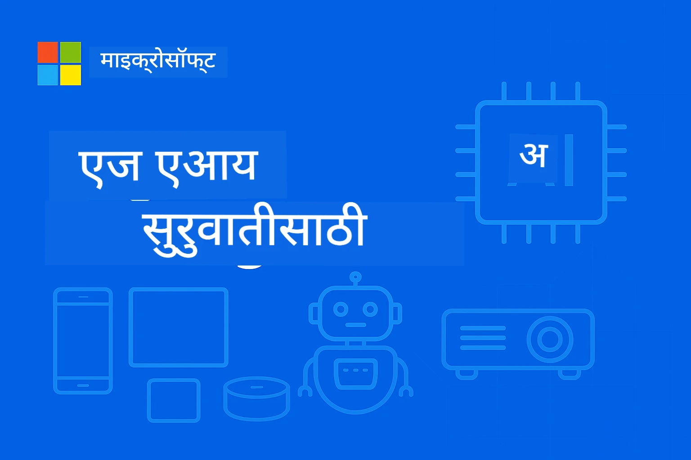

# नवशिक्यांसाठी EdgeAI 




[](https://GitHub.com/microsoft/edgeai-for-beginners/graphs/contributors)
[](https://GitHub.com/microsoft/edgeai-for-beginners/issues)
[](https://GitHub.com/microsoft/edgeai-for-beginners/pulls)
[](http://makeapullrequest.com)

[](https://GitHub.com/microsoft/edgeai-for-beginners/watchers)
[](https://GitHub.com/microsoft/edgeai-for-beginners/fork)
[](https://GitHub.com/microsoft/edgeai-for-beginners/stargazers)


[](https://discord.gg/nTYy5BXMWG)

हे संसाधने वापरण्यास प्रारंभ करण्यासाठी खालील चरणांचे अनुसरण करा:

1. **रेपॉझिटरी फॉर्क करा**: क्लिक करा [](https://GitHub.com/microsoft/edgeai-for-beginners/fork)
2. **रेपॉझिटरी क्लोन करा**:   `git clone https://github.com/microsoft/edgeai-for-beginners.git`
3. [**Azure AI Foundry Discord मध्ये सामील व्हा आणि तज्ञ व इतर विकासक भेटा**](https://discord.com/invite/ByRwuEEgH4)


### 🌐 बहुभाषिक समर्थन

#### GitHub Action द्वारे समर्थित (स्वयंचलित आणि नेहमी अद्ययावत)

<!-- CO-OP TRANSLATOR LANGUAGES TABLE START -->
[अरबी](../ar/README.md) | [बंगाली](../bn/README.md) | [बल्गेरियन](../bg/README.md) | [बर्मीज (म्यानमार)](../my/README.md) | [चिनी (सोप्या)](../zh-CN/README.md) | [चिनी (परंपरागत, हॉंगकॉंग)](../zh-HK/README.md) | [चिनी (परंपरागत, मकावु)](../zh-MO/README.md) | [चिनी (परंपरागत, तैवान)](../zh-TW/README.md) | [क्रोएशियाई](../hr/README.md) | [झेक](../cs/README.md) | [डॅनिश](../da/README.md) | [डच](../nl/README.md) | [एस्टोनियन](../et/README.md) | [फिन्निश](../fi/README.md) | [फ्रेंच](../fr/README.md) | [जर्मन](../de/README.md) | [ग्रीक](../el/README.md) | [हिब्रू](../he/README.md) | [हिंदी](../hi/README.md) | [हंगेरियन](../hu/README.md) | [इंडोनेशियन](../id/README.md) | [इटालियन](../it/README.md) | [जपानी](../ja/README.md) | [कन्नड](../kn/README.md) | [ख्मेर](../km/README.md) | [कोरियन](../ko/README.md) | [लिथुआनियन](../lt/README.md) | [मलय](../ms/README.md) | [मलयाळम](../ml/README.md) | [मराठी](./README.md) | [नेपाली](../ne/README.md) | [नायजेरियन पिडगिन](../pcm/README.md) | [नॉर्वेजियन](../no/README.md) | [फारसी (पर्शियन)](../fa/README.md) | [पोलिश](../pl/README.md) | [पुर्तगाली (ब्राझील)](../pt-BR/README.md) | [पुर्तगाली (पुर्तगाल)](../pt-PT/README.md) | [पंजाबी (गुरमुखी)](../pa/README.md) | [रोमानियन](../ro/README.md) | [रशियन](../ru/README.md) | [सर्बियन (सिरिलिक)](../sr/README.md) | [स्लोवाक](../sk/README.md) | [स्लोव्हेनियन](../sl/README.md) | [स्पॅनिश](../es/README.md) | [स्वाहिली](../sw/README.md) | [स्वीडिश](../sv/README.md) | [टॅगलॉग (फिलिपिनो)](../tl/README.md) | [तामिळ](../ta/README.md) | [तेलुगू](../te/README.md) | [थाई](../th/README.md) | [तुर्की](../tr/README.md) | [उक्रेनियन](../uk/README.md) | [उर्दू](../ur/README.md) | [व्हिएतनामी](../vi/README.md)

> **स्थानिक क्लोन प्राधान्य द्यायचे आहे?**
>
> या रेपॉझिटरीमध्ये ५०+ भाषांतील भाषांतर समाविष्ट आहे ज्यामुळे डाउनलोड आकार लक्षणीय वाढतो. भाषांतरांशिवाय क्लोन करण्यासाठी sparse checkout वापरा:
>
> **Bash / macOS / Linux:**
> ```bash
> git clone --filter=blob:none --sparse https://github.com/microsoft/edgeai-for-beginners.git
> cd edgeai-for-beginners
> git sparse-checkout set --no-cone '/*' '!translations' '!translated_images'
> ```
>
> **CMD (Windows):**
> ```cmd
> git clone --filter=blob:none --sparse https://github.com/microsoft/edgeai-for-beginners.git
> cd edgeai-for-beginners
> git sparse-checkout set --no-cone "/*" "!translations" "!translated_images"
> ```
>
> यामुळे तुम्हाला कोर्स पूर्ण करण्यासाठी आवश्यक सर्वकाही खूप जलद डाउनलोड करता येईल.
<!-- CO-OP TRANSLATOR LANGUAGES TABLE END -->

**तुम्हाला अधिक भाषांतरांची आवश्यकता असल्यास ती [इथे](https://github.com/Azure/co-op-translator/blob/main/getting_started/supported-languages.md) दिलेली आहेत**
## परिचय

**EdgeAI for Beginners** मध्ये आपले स्वागत आहे – एज आर्टिफिशियल इंटेलिजन्सच्या परिवर्तनकारी जगात तुमचा सर्वसमावेशक प्रवास. हा कोर्स शक्तिशाली एआय क्षमतांमधील आणि एज उपकरणांवर व्यावहारिक, वास्तविक जगातील तैनात करण्यातील अंतर कमी करतो, आणि तुम्हाला थेट जिथे डेटा तयार होतो आणि निर्णय घेणे आवश्यक आहे तिथे AI च्या शक्यतांचा वापर करण्यास सक्षम करतो.

### तुम्ही काय शिकाल

हा कोर्स तुम्हाला मूलभूत संकल्पनांपासून उत्पादन-तयार अंमलबजावणीपर्यंत नेतो, यात समाविष्ट आहे:
- एज तैनातीसाठी सुसज्ज **लहान भाषा मॉडेल्स (SLMs)**
- विविध प्लॅटफॉर्मसाठी **हार्डवेअर-अनुकूलित ऑप्टिमायझेशन**
- **खाजगी संरक्षणक्षमतेसह** रिअल-टाइम इनफरन्स
- एंटरप्राइझ अनुप्रयोगांसाठी **उत्पादन तैनाती धोरणे**

### EdgeAI का महत्वाचे आहे

Edge AI एक परिमाणात्मक बदल सूचित करतो जो आधुनिक गंभीर आव्हानांना उत्तर देतो:
- **खाजगीपणा आणि सुरक्षा**: संवेदनशील डेटा स्थानिकपणे प्रक्रिया करा, क्लाउडमध्ये न पाठवता
- **रिअल-टाइम कार्यक्षमता**: वेळेची महत्त्वपूर्ण अनुप्रयोगांसाठी नेटवर्क विलंब कमी करा
- **कमी खर्च**: बँडविड्थ आणि क्लाउड संगणन खर्च कमी करा
- **प्रतिरोधक ऑपरेशन्स**: नेटवर्क बंद असल्यासही कार्य हाताळा
- **नियमांचे पालन**: डेटा संप्रभुतेच्या आवश्यकतांचे पालन करा

### एज AI म्हणजे काय?

एज AI म्हणजे AI अल्गोरिदम आणि भाषा मॉडेल्स हार्डवेअरवर स्थानिकपणे चालवणे जेथे डेटा तयार होतो, क्लाउड संसाधनांवर अवलंबून न राहता इनफरन्ससाठी. यामुळे विलंब कमी होतो, खाजगीपणा वाढतो आणि रिअल-टाइम निर्णय घेणे शक्य होते.

### मूलभूत तत्त्वे:
- **डिव्हाइसवर इनफरन्स**: AI मॉडेल एज डिव्हाइसेस (फोन, राउटर, मायक्रोकंट्रोलर, औद्योगिक PCs) वर चालतात
- **ऑफलाईन क्षमता**: सातत्यपूर्ण इंटरनेट कनेक्टिव्हिटीशिवाय कार्य करते
- **कमी विलंब**: त्वरित प्रतिसाद, रिअल-टाइम सिस्टमसाठी योग्य
- **डेटा संप्रभुता**: संवेदनशील डेटा स्थानिक ठेवतो, सुरक्षा आणि नियम पालन वाढवतो

### लहान भाषा मॉडेल्स (SLMs)

Phi-4, Mistral-7B, आणि Gemma सारखी SLMs मोठ्या LLMs च्या ऑप्टिमाइझ्ड आवृत्त्या आहेत – ज्याचा प्रशिक्षण किंवा डिस्टिलेशन करण्यात आले आहे:
- **कमी मेमरी फूटप्रिंट**: मर्यादित एज डिव्हाइस मेमरीचा कार्यक्षम वापर
- **कमी संगणन मागणी**: CPU आणि एज GPU क्षमतेसाठी ऑप्टिमाइझ्ड
- **वेगवान सुरूवात वेळा**: प्रतिसादक्षम अनुप्रयोगांसाठी जलद सुरू होणे

ही मॉडेल्स शक्तिशाली NLP क्षमता उघडतात आणि या मर्यादा पूर्ण करतात:
- **एंबेडेड सिस्टम्स**: IoT उपकरणे आणि औद्योगिक नियंत्रक
- **मोबाईल उपकरणे**: स्मार्टफोन आणि टॅबलेट ज्यात ऑफलाइन कार्यक्षमतेसह
- **IoT उपकरणे**: मर्यादित संसाधनांसह सेन्सर्स आणि स्मार्ट उपकरणे
- **एज सर्व्हर्स**: मर्यादित GPU संसाधने असलेले स्थानिक प्रक्रिया युनिट्स
- **वैयक्तिक संगणक**: डेस्कटॉप आणि लॅपटॉप तैनाती संदर्भ

## कोर्स मॉड्यूल्स आणि नेव्हिगेशन

| मॉड्यूल | विषय | लक्ष केंद्रित क्षेत्र | मुख्य सामग्री | पातळी | कालावधी |
|--------|-------|------------|-------------|--------|----------|
| [📖 ००](./introduction.md) | [EdgeAI परिचय](./introduction.md) | पाया व संदर्भ | EdgeAI आढावा • उद्योग अनुप्रयोग • SLM परिचय • शिकण्याचे उद्दिष्टे | नवशिक्या | १-२ तास |
| [📚 ०१](../../Module01) | [EdgeAI मूलतत्त्वे](./Module01/README.md) | क्लाउड विरुद्ध एज AI तुलना | EdgeAI मूलतत्त्वे • वास्तविक केस स्टडीज • अंमलबजावणी मार्गदर्शक • एज तैनाती | नवशिक्या | ३-४ तास |
| [🧠 ०२](../../Module02) | [SLM मॉडेल मूलतत्त्वे](./Module02/README.md) | मॉडेल कुटुंबे आणि रचना | Phi कुटुंब • Qwen कुटुंब • Gemma कुटुंब • BitNET • μModel • Phi-Silica | नवशिक्या | ४-५ तास |
| [🚀 ०३](../../Module03) | [SLM तैनाती सराव](./Module03/README.md) | स्थानिक आणि क्लाउड तैनात | प्रगत शिक्षण • स्थानिक वातावरण • क्लाउड तैनात | मध्यम | ४-५ तास |
| [⚙️ ०४](../../Module04) | [मॉडेल ऑप्टिमायझेशन टूलकिट](./Module04/README.md) | क्रॉस-प्लॅटफॉर्म ऑप्टिमायझेशन | परिचय • Llama.cpp • Microsoft Olive • OpenVINO • Apple MLX • कार्यप्रवाह संयोग | मध्यम | ५-६ तास |
| [🔧 ०५](../../Module05) | [SLMOps उत्पादन](./Module05/README.md) | उत्पादन ऑपरेशन्स | SLMOps परिचय • मॉडेल डिस्टिलेशन • फाइन-ट्यूनिंग • उत्पादन तैनाती | प्रगत | ५-६ तास |
| [🤖 ०६](../../Module06) | [AI एजंट्स & फंक्शन कॉलिंग](./Module06/README.md) | एजंट फ्रेमवर्क आणि MCP | एजंट परिचय • फंक्शन कॉलिंग • मॉडेल संदर्भ प्रोटोकॉल | प्रगत | ४-५ तास |
| [💻 ०७](../../Module07) | [प्लॅटफॉर्म अंमलबजावणी](./Module07/README.md) | क्रॉस-प्लॅटफॉर्म नमुने | AI टूलकिट • Foundry Local • Windows Development | प्रगत | ३-४ तास |
| [🏭 ०८](../../Module08) | [Foundry लोकल टूलकिट](./Module08/README.md) | उत्पादन-तयार नमुने | नमुना अनुप्रयोग (खाली तपशील पहा) | तज्ञ | ८-१० तास |

### 🏭 **मॉड्यूल ०८: नमुना अनुप्रयोग**

- [०१: REST चॅट त्वरित प्रारंभ](./Module08/samples/01/README.md)
- [०२: OpenAI SDK समाकलन](./Module08/samples/02/README.md)
- [०३: मॉडेल शोध व बेंचमार्किंग](./Module08/samples/03/README.md)
- [०४: Chainlit RAG अनुप्रयोग](./Module08/samples/04/README.md)
- [०५: मल्टी-एजंट ऑर्केस्ट्रेशन](./Module08/samples/05/README.md)
- [०६: मॉडेल-एज-टूल्स राउटर](./Module08/samples/06/README.md)
- [०७: थेट API क्लायंट](./Module08/samples/07/README.md)
- [०८: Windows 11 चॅट अनुप्रयोग](./Module08/samples/08/README.md)
- [०९: प्रगत मल्टी-एजंट सिस्टम](./Module08/samples/09/README.md)
- [१०: Foundry टूल्स फ्रेमवर्क](./Module08/samples/10/README.md)

### 🎓 **कार्यशाळा: व्यावहारिक शिकण्याचा मार्ग**

उत्पादन-तयार अंमलबजावणीसह सर्वसमावेशक व्यावहारिक कार्यशाळा सामग्री:

- **[कार्यशाळा मार्गदर्शक](./Workshop/Readme.md)** - पूर्ण शिकण्याची उद्दिष्टे, परिणाम, आणि संसाधन नेव्हिगेशन
- **Python नमुने** (६ सत्रे) - सर्वोत्तम पद्धती, त्रुटी हँडलिंग, आणि सविस्तर दस्तऐवजीकरणासह अद्ययावत
- **Jupyter नोटबुक्स** (८ संवादात्मक) - टप्प्याटप्प्याने ट्युटोरियल, बेंचमार्क आणि कार्यक्षमता निरीक्षणासह
- **सत्र मार्गदर्शक** - प्रत्येक कार्यशाळा सत्रासाठी सविस्तर मार्कडाऊन मार्गदर्शक
- **वैधता साधने** - कोड गुणवत्ता तपासणीसाठी स्क्रिप्ट आणि स्मोक टेस्ट चालविण्यासाठी

**तुम्ही काय तयार कराल:**
- स्थानिक AI चॅट अनुप्रयोग, स्ट्रीमिंग समर्थनासह
- गुणवत्तेचे मूल्यमापन करणारे RAG पाइपलाइन (RAGAS)
- बहु-मॉडेल बेंचमार्किंग आणि तुलना साधने
- मल्टी-एजंट ऑर्केस्ट्रेशन सिस्टम्स
- कार्याधारित निवडींसह बुद्धिमान मॉडेल राउटिंग

### 🎙️ **एजंटिकसाठी कार्यशाळा: व्यावहारिक - AI पॉडकास्ट स्टुडिओ**
शून्यातून एआय-संचालित पॉडकास्ट उत्पादन पाईपलाईन तयार करा! हा immersive कार्यशाळा तुम्हाला संपूर्ण मल्टी-एजंट सिस्टम तयार करण्यास शिकवते ज्यामुळे कल्पना व्यावसायिक पॉडकास्ट भागांमध्ये रूपांतरित होतात.

**[🎬 AI पॉडकास्ट स्टुडिओ कार्यशाळा सुरू करा](./WorkshopForAgentic/README.md)**

**तुमचे मिशन**: "Future Bytes" लॉन्च करा — पूर्णपणे तुम्ही स्वतः तयार केलेल्या AI एजंट्सद्वारे चालविलेला एक तंत्रज्ञान पॉडकास्ट. कोणतीही क्लाउड अवलंबित्व नाही, API खर्च नाही — सर्व काही तुमच्या मशीनवर स्थानिकपणे चालते.

**हे का वेगळे आहे:**
- **🤖 वास्तविक मल्टी-एजंट संचालन** - संशोधन करणार्‍या, लिहिणार्‍या आणि ऑडिओ तयार करणार्‍या तज्ञ AI एजंटांची निर्मिती करा
- **🎯 संपूर्ण उत्पादन पाईपलाईन** - विषय निवडणून अंतिम पॉडकास्ट ऑडिओ उत्पादनापर्यंत
- **💻 १००% स्थानिक तैनाती** - Ollama आणि स्थानिक मॉडेल्स (Qwen-3-8B) वापरल्याने पूर्णपणे गोपनीयता आणि नियंत्रण
- **🎤 टेक्स्ट-टू-स्पीच समाकलन** - स्क्रिप्ट्सना नैसर्गिक आवाजातील बहु-वक्ता संभाषणांमध्ये रूपांतरित करा
- **✋ मानवी-इन-द-लूप वर्कफ्लोज** - मान्यता प्रक्रियेमुळे गुणवत्ता सुनिश्चित करणे आणि ऑटोमेशन राखणे

**तीन-अंकात्मक शिकण्याचा प्रवास:**

| अंक | लक्ष केंद्रित | मुख्य कौशल्ये | कालावधी |
|-----|--------------|--------------|----------|
| **[अंक १: तुमचे AI सहाय्यक भेटा](./WorkshopForAgentic/md/01.BuildAIAgentWithSLM.md)** | तुमचा पहिला AI एजंट तयार करा | साधन समाकलन • वेब शोध • समस्या निवारण • एजंटिक विचार | २-३ तास |
| **[अंक २: तुमचा उत्पादन संघ जमा करा](./WorkshopForAgentic/md/02.AIAgentOrchestrationAndWorkflows.md)** | अनेक एजंट्सचे संचालन करा | संघ समन्वय • मंजुरी वर्कफ्लोज • DevUI इंटरफेस • मानवी देखरेख | ३-४ तास |
| **[अंक ३: तुमचा पॉडकास्ट सजीव करा](./WorkshopForAgentic/md/03.Multi-SpeakerPodcastGenerationWithVibeVoice.md)** | पॉडकास्ट ऑडिओ निर्माण करा | टेक्स्ट-टू-स्पीच • बहु-वक्ता संश्लेषण • लांब स्वरूप ऑडिओ • पूर्ण ऑटोमेशन | २-३ तास |

**वापरलेली तंत्रज्ञान:**
- **Microsoft Agent Framework** - मल्टी-एजंट संचालन आणि समन्वय
- **Ollama** - स्थानिक AI मॉडेल रनटाइम (क्लाऊड आवश्यक नाही)
- **Qwen-3-8B** - एजंटिक कामांसाठी ऑप्टिमाइझ केलेले ओपन-सोर्स भाषा मॉडेल
- **टेक्स्ट-टू-स्पीच API** - पॉडकास्ट निर्मितीसाठी नैसर्गिक आवाजातील संश्लेषण

**हार्डवेअर समर्थन:**
- ✅ **CPU मोड** - कोणत्याही आधुनिक संगणकावर कार्य करते (8GB+ RAM शिफारस)
- 🚀 **GPU वेगवेगळेपणा** - NVIDIA/AMD GPU वापरून जलद इनफरन्स
- ⚡ **NPU समर्थन** - पुढील पिढीचे न्यूरल प्रोसेसिंग युनिट त्वरेने कामगिरी

**यासाठी योग्य:**
- मल्टी-एजंट AI प्रणाली शिकणारे विकसक
- AI ऑटोमेशन आणि वर्कफ्लोजमध्ये रस असलेले कोणतेही
- AI सहाय्यक उत्पादनातील सामग्री निर्माता
- व्यावहारिक AI संचालन पद्धती अभ्यासणारे विद्यार्थी

**बनवायला सुरुवात करा**: [🎙️ AI पॉडकास्ट स्टुडिओ कार्यशाळा →](./WorkshopForAgentic/README.md)

### 📊 **शिकण्याचा सारांश**
- **एकूण कालावधी**: 36-45 तास
- **सुरुवातीचा मार्ग**: मॉड्यूल 01-02 (7-9 तास)  
- **मध्यम मार्ग**: मॉड्यूल 03-04 (9-11 तास)
- **प्रगत मार्ग**: मॉड्यूल 05-07 (12-15 तास)
- **तज्ञ मार्ग**: मॉड्यूल 08 (8-10 तास)

## तुम्ही काय तयार कराल

### 🎯 मुख्य कौशल्ये
- **एज AI आर्किटेक्चर**: क्लाऊड इंटिग्रेशनसह स्थानिक-प्रथम AI प्रणाली डिझाइन करा
- **मॉडेल ऑप्टिमायझेशन**: एज तैनातीसाठी मॉडेल्स क्वांटाइझ आणि कॉम्प्रेस करा (85% वेगात वाढ, 75% आकार कमी)
- **मल्टी-प्लॅटफॉर्म तैनाती**: विंडोज, मोबाइल, एम्बेडेड आणि क्लाऊड-एज हायब्रिड प्रणाली
- **उत्पादन कार्यप्रणाली**: एज AI चे मॉनिटरिंग, स्केलिंग आणि देखभाल

### 🏗️ व्यावहारिक प्रकल्प
- **Foundry स्थानिक चॅट अॅप्स**: विंडोज 11 नॅटिव ॲप्लिकेशन मॉडेल स्विचसह
- **मल्टी-एजंट सिस्टम्स**: क्लिष्ट वर्कफ्लो साठी समन्वयक आणि तज्ञ एजंट्स  
- **RAG अॅप्लिकेशन्स**: स्थानिक दस्तऐवज प्रक्रिया आणि व्हेक्टर शोध
- **मॉडेल राऊटर्स**: कार्य विश्लेषणानुसार बुद्धिमान निवड
- **API फ्रेमवर्क्स**: उत्पादनासाठी तयार क्लायंट्स ज्यात स्ट्रीमिंग आणि आरोग्य मॉनिटरिंग
- **क्रॉस-प्लॅटफॉर्म टूल्स**: LangChain/Semantic Kernel समाकलन नमुने

### 🏢 औद्योगिक अनुप्रयोग
**मॅन्युफॅक्चरिंग** • **हेल्थकेअर** • **स्वायत्त वाहन** • **स्मार्ट सिटीज** • **मोबाइल अॅप्स**

## जलद प्रारंभ

**शिफारस केलेला शिकण्याचा मार्ग** (एकूण 20-30 तास):

0. **📖 परिचय** ([Introduction.md](./introduction.md)): EdgeAI पाया + उद्योग संदर्भ + शिकण्याची चौकट
1. **📚 पाया** (मॉड्यूल 01-02): EdgeAI संकल्पना + SLM मॉडेल कुटुंबे
2. **⚙️ ऑप्टिमायझेशन** (मॉड्यूल 03-04): तैनाती + क्वांटायझेशन फ्रेमवर्क  
3. **🚀 उत्पादन** (मॉड्यूल 05-06): SLMOps + AI एजंट्स + फंक्शन कॉलिंग
4. **💻 अंमलबजावणी** (मॉड्यूल 07-08): प्लॅटफॉर्म नमुने + Foundry स्थानिक टूलकिट

प्रत्येक मॉड्यूलमध्ये थिअरी, प्रत्यक्ष व्यायाम आणि उत्पादनासाठी तयार कोड नमुने आहेत.

## करिअर प्रभाव

**तांत्रिक भूमिका**: EdgeAI समाधान आर्किटेक्ट • ML इंजिनियर (एज) • IoT AI विकसक • मोबाइल AI विकसक

**उद्योग क्षेत्रे**: मॅन्युफॅक्चरिंग 4.0 • हेल्थकेअर टेक • स्वायत्त प्रणाली • FinTech • ग्राहक इलेक्ट्रॉनिक्स

**पोर्टफोलिओ प्रकल्प**: मल्टी-एजंट सिस्टम्स • उत्पादन RAG अॅप्स • क्रॉस-प्लॅटफॉर्म तैनाती • कामगिरी सुधारणा

## रेपॉजिटरी रचना

```
edgeai-for-beginners/
├── 📖 introduction.md  # Foundation: EdgeAI Overview & Learning Framework
├── 📚 Module01-04/     # Fundamentals → SLMs → Deployment → Optimization  
├── 🔧 Module05-06/     # SLMOps → AI Agents → Function Calling
├── 💻 Module07/        # Platform Samples (VS Code, Windows, Jetson, Mobile)
├── 🏭 Module08/        # Foundry Local Toolkit + 10 Comprehensive Samples
│   ├── samples/01-06/  # Foundation: REST, SDK, RAG, Agents, Routing
│   └── samples/07-10/  # Advanced: API Client, Windows App, Enterprise Agents, Tools
├── 🌐 translations/    # Multi-language support (8+ languages)
└── 📋 STUDY_GUIDE.md   # Structured learning paths & time allocation
```

## कोर्स वैशिष्ट्ये

✅ **प्रगत शिकणे**: थिअरी → प्रॅक्टिस → उत्पादन तैनाती  
✅ **प्रत्यक्ष केसेस**: Microsoft, Japan Airlines, उद्यम अंमलबजावणी  
✅ **हाताळणी नमुने**: 50+ उदाहरणे, 10 व्यापक Foundry स्थानिक डेमो  
✅ **कार्यक्षमता केंद्रित**: 85% वेग सुधारणा, 75% आकार कपात  
✅ **मल्टी-प्लॅटफॉर्म**: विंडोज, मोबाइल, एम्बेडेड, क्लाऊड-एज हायब्रिड  
✅ **उत्पादनासाठी सज्ज**: मॉनिटरिंग, स्केलिंग, सुरक्षा, अनुपालन फ्रेमवर्क

📖 **[अभ्यास मार्गदर्शक उपलब्ध](STUDY_GUIDE.md)**: 20 तासांची संरचित शिकण्याची वाटचाल टाइम अ‍ॅलोकेशन मार्गदर्शन आणि स्व मूल्यांकन साधनांसह.

---

**EdgeAI हा AI तैनातीचा भविष्य दर्शवितो**: स्थानिक-प्रथम, गोपनीयता जपणारा आणि कार्यक्षम. या कौशल्यांमध्ये प्रावीण्य मिळवा आणि पुढील पिढीच्या बुद्धिमान अ‍ॅप्लिकेशन्स तयार करा.

## इतर कोर्सेस

आमचा संघ अन्य कोर्सेस तयार करतो! पहा:

<!-- CO-OP TRANSLATOR OTHER COURSES START -->
### LangChain
[](https://aka.ms/langchain4j-for-beginners)
[](https://aka.ms/langchainjs-for-beginners?WT.mc_id=m365-94501-dwahlin)
[](https://github.com/microsoft/langchain-for-beginners?WT.mc_id=m365-94501-dwahlin)
---

### Azure / Edge / MCP / Agents
[](https://github.com/microsoft/AZD-for-beginners?WT.mc_id=academic-105485-koreyst)
[](https://github.com/microsoft/edgeai-for-beginners?WT.mc_id=academic-105485-koreyst)
[](https://github.com/microsoft/mcp-for-beginners?WT.mc_id=academic-105485-koreyst)
[](https://github.com/microsoft/ai-agents-for-beginners?WT.mc_id=academic-105485-koreyst)

---
 
### Generative AI Series
[](https://github.com/microsoft/generative-ai-for-beginners?WT.mc_id=academic-105485-koreyst)
[-9333EA?style=for-the-badge&labelColor=E5E7EB&color=9333EA)](https://github.com/microsoft/Generative-AI-for-beginners-dotnet?WT.mc_id=academic-105485-koreyst)
[-C084FC?style=for-the-badge&labelColor=E5E7EB&color=C084FC)](https://github.com/microsoft/generative-ai-for-beginners-java?WT.mc_id=academic-105485-koreyst)
[-E879F9?style=for-the-badge&labelColor=E5E7EB&color=E879F9)](https://github.com/microsoft/generative-ai-with-javascript?WT.mc_id=academic-105485-koreyst)

---
 
### Core Learning
[](https://aka.ms/ml-beginners?WT.mc_id=academic-105485-koreyst)
[](https://aka.ms/datascience-beginners?WT.mc_id=academic-105485-koreyst)
[](https://aka.ms/ai-beginners?WT.mc_id=academic-105485-koreyst)
[](https://github.com/microsoft/Security-101?WT.mc_id=academic-96948-sayoung)
[](https://aka.ms/webdev-beginners?WT.mc_id=academic-105485-koreyst)
[](https://aka.ms/iot-beginners?WT.mc_id=academic-105485-koreyst)
[](https://github.com/microsoft/xr-development-for-beginners?WT.mc_id=academic-105485-koreyst)

---
 
### Copilot Series
[](https://aka.ms/GitHubCopilotAI?WT.mc_id=academic-105485-koreyst)
[](https://github.com/microsoft/mastering-github-copilot-for-dotnet-csharp-developers?WT.mc_id=academic-105485-koreyst)
[](https://github.com/microsoft/CopilotAdventures?WT.mc_id=academic-105485-koreyst)
<!-- CO-OP TRANSLATOR OTHER COURSES END -->

## मदत मिळवा

जर तुम्ही अडकले असाल किंवा AI अॅप्स तयार करण्याबाबत काही प्रश्न असतील, तर सहभागी व्हा:

[](https://discord.gg/nTYy5BXMWG)

जर तुम्हाला उत्पादनाबाबत अभिप्राय द्यायचा असेल किंवा तयार करताना त्रुटी आढळल्या असतील तर भेट द्या:

[](https://aka.ms/foundry/forum)

---

<!-- CO-OP TRANSLATOR DISCLAIMER START -->
**अस्वीकरण**:
हा दस्तऐवज AI अनुवाद सेवा [Co-op Translator](https://github.com/Azure/co-op-translator) वापरून अनुवादित केला आहे. आम्ही अचूकतेसाठी प्रयत्नशील असताना, कृपया लक्षात ठेवा की स्वयंचलित अनुवादांमध्ये चुका किंवा अचूकतेचा अभाव असू शकतो. मूळ दस्तऐवज त्याच्या स्थानिक भाषेत अधिकृत स्रोत मानला जाणे आवश्यक आहे. महत्त्वाच्या माहितीकरिता, व्यावसायिक मानवी अनुवाद शिफारस केले जाते. या अनुवादाच्या वापराबाबत कोणत्याही गैरसमज किंवा चुकीच्या अर्थलागी आम्ही जबाबदार नाही.
<!-- CO-OP TRANSLATOR DISCLAIMER END -->