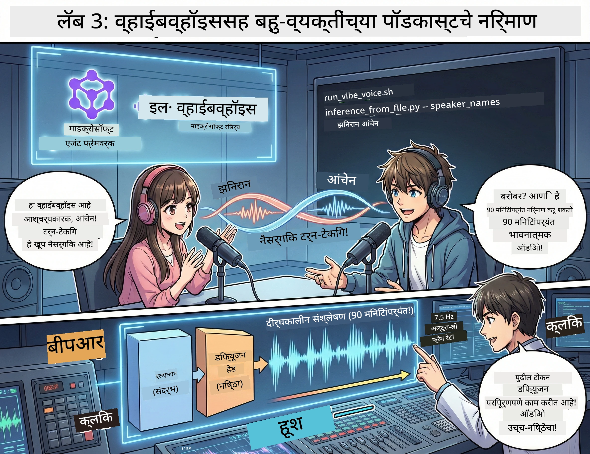

<!--
CO_OP_TRANSLATOR_METADATA:
{
  "original_hash": "bb2a3cf5ebd0ec8211af960a004fc23d",
  "translation_date": "2026-01-05T12:09:34+00:00",
  "source_file": "WorkshopForAgentic/md/03.Multi-SpeakerPodcastGenerationWithVibeVoice.md",
  "language_code": "mr"
}
-->
# अ‍ॅक्ट 3: तुमचा पॉडकास्ट सजीव करा 🎤



## महान समारोप

तुम्ही विषय संशोधन केले आहे. तुम्ही स्क्रिप्ट लिहिल्या आहेत. आता शिगेला मिरवा: तुमचा मजकूर वास्तविक पॉडकास्ट ऑडिओंमध्ये बदलणे, खऱ्या आवाजांसह!

ओळख करून द्या **VibeVoice** — मायक्रोसॉफ्ट रिसर्चचे ओपन-सोर्स TTS (टेक्स्ट-टू-स्पीच) जादू जे तयार करते:
- 🎭 निसर्गसदृश संभाषणे
- 👥 एकाहून अधिक वक्ते (४ पर्यंत!)
- ⏱️ लांबट स्वरूपाचा ऑडिओ (९० मिनिटांपर्यंत!)
- 🎵 अभिव्यक्तीपूर्ण वितरण (रोबोट आवाज नाही!)

हे औद्योगिक पॉडकास्टमागील तंत्रज्ञान आहे. चला तुमचं बनवू!

## VibeVoice म्हणजे काय? (मस्त गोष्टी)

VibeVoice हे मायक्रोसॉफ्ट रिसर्चकडून जगासाठी दिलेली भेट आहे. हे विशेषतः पॉडकास्ट-शैलीतील संभाषणात्मक ऑडिओसाठी डिझाइन केलेले आहे.

### का आहे ते प्रभावित करणारं 🔥

* **⏱️ मैराथॉन सत्रे**: सलग ९० मिनिटांपर्यंत भाषण तयार करू शकते (ते पूर्ण पॉडकास्ट एपिसोड आहे!)
* **👥 बहु-वक्ता जादू**: ४ वेगवेगळ्या आवाजांपर्यंत समान व्यक्तिमत्वांसह
* **⚡ अतिशय कार्यक्षम**: अति कमी ७.५ Hz फ्रेम दर वापरून संगणकीय शक्ती वाचवते
* **🧠 हुशार ऑडिओ**: LLM (संदर्भ समजते) आणि डिफ्यूजन मॉडेल (वास्तविक ऑडिओ तयार करते) यांचे संयोजन
* **🎭 निसर्गसदृश प्रवाह**: टर्न-टेकिंग, थांबा आणि संभाषण ताल स्वयंचलितपणे हाताळते

**भाषांतर**: VibeVoice फक्त तुमची स्क्रिप्ट वाचत नाही — ते *प्रदर्शन करते* जणू काही लोक खऱ्या बोलत आहेत.

---

## सुरूवात करण्यापूर्वी 🚀

**तुमच्याकडे काय असायला हवे**:

* 🐍 **Python 3.10+** (तुमच्याकडे अ‍ॅक्ट 1 आणि 2 मधून आधीच आहे)
* 🚀 **uv** (वेगवान Python पॅकेज मॅनेजर — आपण हे इन्स्टॉल करू)
* 📝 **तुमची स्क्रिप्ट**: अ‍ॅक्ट 2 मधील `podcast.txt` फाइल (पथातील `../03.Application/`)

**प्रो टिप**: या टप्प्यासाठी पूर्व-प्रशिक्षित मॉडेल डाउनलोड करण्यासाठी चांगली इंटरनेट कनेक्शन आवश्यक आहे. एक कॉफी घ्या! ☕

---

## चला प्रारंभ करूया! सोपा मार्ग 🎬

आम्ही हे खूप सोपं केले आहे. एक शेल स्क्रिप्ट सर्व काम करते.

### प्रक्रिया

1. **ते कार्यान्वित करा**:
```bash
chmod +x run_vibe_voice.sh
```

2. **ते चालवा**:
```bash
./run_vibe_voice.sh
```

3. **जादूची वाट पहा** (पहिल्या वापरासाठी काही मिनिटे लागू शकतात)

### मागील बाजूने काय होते 🎭

स्क्रिप्ट मूलत: तुमचा स्वयंचलित साउंड इंजिनीअर आहे:

1. **📥 VibeVoice डाउनलोड करतो**: GitHub मधून अधिकृत रेपो क्लोन करतो
2. **📦 अवलंबित्वे इन्स्टॉल करतो**: `uv pip` वापरून अतिशय वेगवान पॅकेज इन्स्टॉल कराने
3. **🎬 ऑडिओ तयार करतो**: इन्फरन्स स्क्रिप्ट चालवतो:
   * `--model_path`: पूर्व-प्रशिक्षित VibeVoice-7B मॉडेल
   * `--txt_path`: तुमची `podcast.txt` स्क्रिप्ट
   * `--speaker_names`: आवाजे नियुक्त करतो (डिफॉल्टने Xinran & Anchen)

**परिणाम**: तुमची स्क्रिप्ट खऱ्या पॉडकास्ट एपिसोडमध्ये परिणत होते! 🎉

---

## तुमचा मिशन 🎯

चला थोडे मनोरंजक बनवूया:

### टास्क 1: सामग्री तयार करा
`../03.Application/podcast.txt` संपादित करा ज्यात दोन लोकांचं संभाषण असो. तंत्रज्ञान, छंद, काहीही बोला! फक्त संभाषणसदृश ठेवा.

**फॉरमॅट उदाहरण**:
```
Speaker 1: Hey! Did you hear about the new AI model?
Speaker 2: No way! Tell me more!
Speaker 1: It's called...
```

### टास्क 2: ऑडिओ तयार करा
स्क्रिप्ट चालवा आणि जादू बघा. पहिल्यावटीला अधिक वेळ लागू शकतो (मॉडेल डाउनलोड करताना).

### टास्क 3: ऐका आणि विश्लेषण करा
- आवाज निसर्गसदृश वाटतो का?
- वक्ते वेगळे आवाज आहेत का?
- टर्न-टेकिंग सुरळीत आहे का?
- कोणतेही रोबोटसदृश क्षण आहेत का?

### टास्क 4: प्रयोग करा (धाडसी लोकांसाठी)
`run_vibe_voice.sh` संपादित करा आणि `--speaker_names` बदला, वेगवेगळ्या आवाज कॉम्बिनेशनसाठी प्रयत्न करा. VibeVoice कडे अनेक पूर्व-प्रशिक्षित आवाज उपलब्ध आहेत!

**बोनस आव्हान**: ३ वक्त्यांचा संभाषण करा! 🎆

---

## अधिक शिका 📚

* **🏠 प्रोजेक्ट होमपेज**: [VibeVoice अधिकृत साइट](https://microsoft.github.io/VibeVoice/)
* **🤗 पूर्व-प्रशिक्षित मॉडेल**: [Hugging Face - VibeVoice-7B](https://huggingface.co/vibevoice/VibeVoice-7B)
* **📖 संशोधन पत्र**: तंत्रज्ञानाचा सखोल अभ्यास (जर आवड असेल तर)

> **⚠️ जबाबदार AI स्मरणपत्र**: VibeVoice शक्तिशाली आहे. नैतिक वापर करा! डीपफेक किंवा भ्रामक सामग्री तयार करू नका. लोकांना मदत करणाऱ्या महान गोष्टी तयार करा. 🙏

---

## 🏆 अभिनंदन! तुम्ही यशस्वी झाले!

तुम्ही संपूर्ण प्रक्रियेचा आराखडा पूर्ण केला:
1. ✅ **अ‍ॅक्ट 1**: कस्टम टूल्ससह AI एजंट्स तयार केले
2. ✅ **अ‍ॅक्ट 2**: मल्टी-एजंट वर्कफ्लो संयोजित केला
3. ✅ **अ‍ॅक्ट 3**: खरा पॉडकास्ट ऑडिओ तयार केला

**तुमच्याकडे आता आहे**:
- कार्यरत AI संशोधन सहाय्यक
- संपूर्ण पॉडकास्ट उत्पादन वर्कफ्लो
- वास्तविक ऑडिओ फाइल तुम्ही शेअर करू शकता

### पुढे काय? 🚀

**तुमचा पॉडकास्ट लॉन्च करा!**
- पॉडकास्ट प्लॅटफॉर्मवर अपलोड करा
- सोशल मिडियावर शेअर करा
- पुनरावृत्ती करा आणि सुधारणा करा

**बनवत रहा!**
- वेगवेगळ्या विषयांचा प्रयत्न करा
- अधिक वक्त्यांसह प्रयोग करा
- बॅकग्राउंड म्युझिक जोडा
- वेब इंटरफेस तयार करा
- संपूर्ण प्रक्रिया स्वयंचलित करा

**तुमचं काम शेअर करा!**
आम्हाला टॅग करा! जगाला दाखवा तुम्ही काय तयार केलं. AI पॉडकास्ट क्रांती तुमच्यापासून सुरु होते. 🎙️

---

**प्रश्न? कल्पना? यशकथा?** वर्कशॉप चॅटमध्ये सांगा!

**सामग्री निर्मितीच्या भविष्याला स्वागत आहे.** 🌟

---

<!-- CO-OP TRANSLATOR DISCLAIMER START -->
**अस्वीकरण**:
हा दस्तऐवज AI भाषांतर सेवा [Co-op Translator](https://github.com/Azure/co-op-translator) वापरून भाषांतरित करण्यात आला आहे. आम्ही अचूकतेसाठी प्रयत्नशील आहोत, तरी कृपया लक्षात घ्या की स्वयंचलित भाषांतरांमध्ये चुका किंवा अचूकतेची कमतरता असू शकते. मूळ दस्तऐवज त्याच्या मूळ भाषेमध्ये अधिकृत स्रोत मानला जावा. महत्त्वाच्या माहितीसाठी व्यावसायिक मानवी भाषांतराची शिफारस केली जाते. या भाषांतराच्या वापरामुळे उद्भवणाऱ्या कोणत्याही गैरसमजुती किंवा चुकीच्या अर्थलागी आम्ही जबाबदार नाही.
<!-- CO-OP TRANSLATOR DISCLAIMER END -->