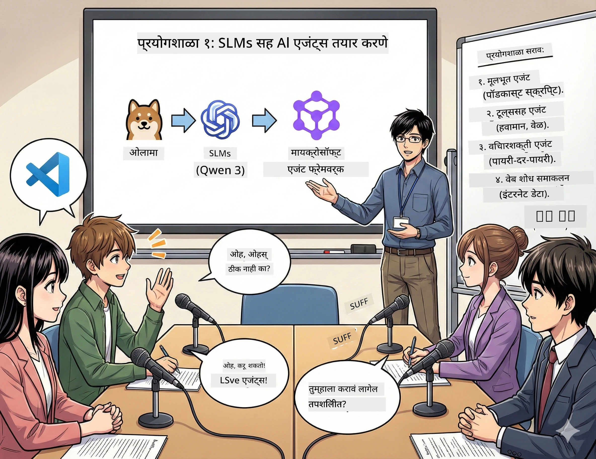

<!--
CO_OP_TRANSLATOR_METADATA:
{
  "original_hash": "21779ce57b388adecb26881a35d9cbcf",
  "translation_date": "2026-01-05T16:39:57+00:00",
  "source_file": "WorkshopForAgentic/translation/zh-cn/01.BuildAIAgentWithSLM.md",
  "language_code": "mr"
}
-->
# 第一幕：तुमचा AI संशोधन सहाय्यक ओळखा 🤖

## आव्हान

तुम्ही तुमचा नवीन तंत्रज्ञान पॉडकास्ट "फ्युचर बाइट्स" लॉन्च करत आहात. पहिली एपीसोड अलीकडील AI प्रगतीबाबत आहे, पण तुमच्याकडे फक्त २४ तास आहेत:
1. विषय संशोधन करा
2. विश्वासार्ह स्रोत शोधा
3. आकर्षक स्क्रिप्ट लिहा
4. ते नैसर्गिक ऐकण्यासाठी बनवा

**कथा वळण**: तुम्हाला हे सर्व एकटे करून घ्यावे लागणार नाही. तुम्ही तुमचा पहिला AI सहाय्यक तयार करणार आहात, जो हे सर्व करण्यास मदत करू शकतो. त्याला Alex नाव देऊ या — तुमचा कधीही थकणार नाही असा संशोधन पार्टनर, ज्याला झोपेची गरज नाही.

## का लहान भाषा मॉडेल्स निवडा? (सभाघर खुलासा: ते खूप छान आहेत)

लहान भाषा मॉडेल्स (SLM) म्हणजे *तुमच्या* संगणकावर चालणारा वैयक्तिक AI समजा. कोणतीही क्लाउड, कोणीही मासिक शुल्क नाही, कोणी शंकास्पद डेटा शेअरिंग नाही.

**SLM म्हणून ते का 🔥 आहेत:**
- **🏠 तुमच्या संगणकावर चालतात**: लॅपटॉप, डेस्कटॉप, अगदी सक्षम रास्पबेरी पायवरही
- **💸 शून्य चालू खर्च**: API फी तुमच्या खिशावर परिणाम करत नाही
- **🔒 गोपनीयता प्रथम**: तुमचा डेटा कधीही तुमच्या डिव्हाइसला बाहेर जात नाही
- **⚡ विजेच्या वेगाने**: कोणतीही नेटवर्क उशीर नाही, झटपट प्रतिसाद
- **🪦 लहान पेक्षा हलके**: 1 ते 10 अब्ज पॅरामीटर्स, मोठ्या मॉडेल्सच्या 1000 अब्जांच्या तुलनेत

**लोकप्रियम SLM**: Qwen 3, Phi-4, Gemma 3 (या कार्यशाळेत Qwen वापरले)

## तुमचा टूलकिट

### Ollama: तुमचा AI मॉडेल व्यवस्थापक

[Ollama](https://ollama.com/) हे AI मॉडेल्ससाठी Steam सारखे आहे. सोप्या आदेशांनी मॉडेल डाउनलोड, चालवा आणि व्यवस्थापित करा.

**ते कसे छान आहे:**
- एका आदेशाने कोणतेही मॉडेल डाउनलोड आणि चालवू शकता
- Mac, Windows, Linux साठी उपयुक्त
- GPU उपलब्ध असल्यास ते आपोआप वापरले जाते
- अतिशय कमी मेमरी वापर

### Microsoft Agent Framework: जिथे जादू होते

[Microsoft Agent Framework](https://github.com/microsoft/agent-framework) हा तुम्ही AI एजंट तयार करण्याचा पुढारी प्लॅटफॉर्म आहे, जे करू शकतात:

- 💬 संवाद साधा आणि तुमच्या चर्चा लक्षात ठेवा
- 🛠️ कस्टम टूल्स वापरा (जसे की वेब शोधा किंवा हवामान पहा)
- 🧠 गुंतागुंतीच्या समस्यांवर टप्प्याटप्प्याने विचार करा
- 🤝 एजंट टीम म्हणून इतर एजंट्ससोबत सहकार्य करा
- 🔌 वेगवेगळ्या AI प्रदात्यांशी कनेक्ट करा (OpenAI, Ollama, Azure)

**बांधकाम घटक:**
- **एजंट्स (Agents)**: विशिष्ट कामांसाठी AI सहाय्यक
- **टूल्स (Tools)**: तुम्ही त्यांना दिलेल्या खास क्षमता
- **मेमरी (Memory)**: त्यामुळे ते तुमची चर्चा विसरत नाहीत
- **तर्क (Reasoning)**: त्यांना केवळ उत्तर देण्याऐवजी विचार करण्यास शिकवा

## तुमच्या प्रशिक्षणाचे मोंटाज: ४ कामे

### काम १: तुमचा पहिला एजंट तयार करा

📓 [Notebook उघडा](../../code/01.BasicAgent/00.BasicAgent-agent.ipynb)

**काम**: Alex तयार करा, तुमचा पॉडकास्ट स्क्रिप्ट लेखन AI. Alex ला दोन होस्टर्समधील तंत्रज्ञानावर चर्चा करणारे संभाषण तयार करणे आवश्यक आहे.

**तुम्ही शिकाल:**
- AI एजंट कसा जागृत करायचा (सोमवारी उठण्याइतका सोपा)
- त्याला व्यक्तिमत्व आणि सूचनांशी कसे द्यायचे
- त्याला मूळ पॉडकास्ट स्क्रिप्ट कशी तयार करायची
- त्याचे प्रतिसाद समजून घेणे

**जिंकण्याची अट**: Alex तुमच्या "फ्युचर बाइट्स" AI विषयक पहिले प्रायोगिक एपिसोडसाठी स्क्रिप्ट तयार करेल!🎯

### काम २: Alex ला सुपरपॉवर द्या (टूल्स!)

📓 [Notebook उघडा](../../code/01.BasicAgent/01.BasicAgent-tools.ipynb)

**काम**: Alex हुशार आहे, पण त्याला आजचा हवामान किंवा सध्याचा वेळ माहित नाही. चला त्याला टूल्स देऊन हे सोडवूया!

**तुम्ही शिकाल:**
- "टूल" म्हणून कस्टम Python फंक्शन्स तयार कसे करायचे
- Alex ला ठरवायचे *कोणी* टूल कधी वापरायचे
- त्याला स्वयंचलितपणे समस्या सोडवताना पहाणे
- अनेक टूल्स संयोजित करून गुंतागुंतीचे कामे पूर्ण करणे

**जिंकण्याची अट**: "टोकियोतील हवामान कसे आहे?" असे विचारले तर Alex स्वतः उत्तर शोधेल!☁️

### काम ३: Alex ला विचार करण्यास शिकवा

📓 [Notebook उघडा](../../code/01.BasicAgent/02.BasicAgent-reasoning.ipynb)

**काम**: Alex कसे काम करते ते दाखवा. समस्या सोडवताना, तुम्हाला पाहायचे आहे की तो *कसा* विचार करतो, केवळ उत्तर देत नाही.

**तुम्ही शिकाल:**
- "तर्क मोड" सक्रिय करा (जसे गणित वर्गात तुमचे काम दाखवता)
- Alex चा टप्प्याटप्प्याने विचार करण्याचा प्रवास पहा
- विचार साखळी टिपा समजून घ्या
- Alex गोंधळल्यास डिबग करा

**जिंकण्याची अट**: एखादा कठीण गणिती प्रश्न विचारा आणि Alex कसा विचार करतो ते पहा!🧠

### काम ४: Alex ला इंटरनेटशी कनेक्ट करा

📓 [Notebook उघडा](../../code/01.BasicAgent/03.BasicAgent-websearch.ipynb)

**काम**: Alex च्या माहितीची मर्यादा आहे. चला त्याला वेबशी कनेक्ट करूया, जेणेकरून त्याला रिअलटाइम माहिती मिळेल!

**तुम्ही शिकाल:**
- कस्टम वेब शोध टूल तयार करा
- बाह्य API समाकलित करा
- वेब त्रुटी व्यवस्थापित करा
- Alex च्या प्रशिक्षण माहितीपेक्षा बाहेर माहिती मिळवा

**जिंकण्याची अट**: आजचे तंत्रज्ञान बातम्या विचारा आणि ताज्या निकाल मिळवा!📰

## सुरू करण्यापूर्वी 🚀

**आवश्यक सामग्री**:
- Python 3.10+ इंस्टॉल केलेले
- Ollama चालू आहे ( वापरून तपासा `ollama --version`)
- Python एक्स्टेंशनसह VS Code
- किमान 8GB RAM (सुलभतेसाठी 16GB आवश्यक)

## कामांची श्रेणी

पूर्ण अनुभवासाठी Notebook क्रमाने पूर्ण करा:

1. [00.BasicAgent-agent.ipynb](../../code/01.BasicAgent/00.BasicAgent-agent.ipynb) —— Alex ओळखा (तुमचा पहिला एजंट)
2. [01.BasicAgent-tools.ipynb](../../code/01.BasicAgent/01.BasicAgent-tools.ipynb) —— अपग्रेड वेळ!
3. [02.BasicAgent-reasoning.ipynb](../../code/01.BasicAgent/02.BasicAgent-reasoning.ipynb) —— Alex ला विचार करायला शिकवा
4. [03.BasicAgent-websearch.ipynb](../../code/01.BasicAgent/03.BasicAgent-websearch.ipynb) —— इंटरनेट प्रवेश अनलॉक करा!

## तुम्हाला काय मिळेल

पहिला अंक पूर्ण केल्यानंतर, तुम्ही सक्षम असाल:

- ✅ तुमच्या हार्डवेअरवर AI मॉडेल्स चालवायला (क्लाउडची गरज नाही!)
- ✅ वैयक्तिकृत व्यक्तिमत्व आणि कौशल्ये असलेले एजंट तयार करायला
- ✅ एजंट्सना टूल्स द्यायला जे प्रत्यक्ष समस्या सोडवतात
- ✅ एजंट्सना त्यांचा तर्क प्रक्रियाही दाखवायला
- ✅ एजंट्सना बाह्य डेटास्रोतांशी कनेक्ट करायला
- ✅ जेव्हा काही चुकते तेव्हा डिबग करायला

## जेव्हा काही चुकते (आणि कसे दुरुस्त करावे)🔧

### "Alex लोड होत नाही! मेमरी अपुरी!"
**उपाय**: तुमचा संगणक जखडलेला आहे. इतर अॅप्स बंद करण्याचा प्रयत्न करा, किंवा लहान मॉडेल वापरा. 8GB मेमरी कमीतकमी गरज आहे.

### "Alex खूप हळू आहे"
**उपाय**: Ollama मधील GPU अॅक्सेलेरेशन सक्षम करा. किंवा संदर्भ विंडोचा आकार कमी करा. स्पीड मोड ON!🏎️

### "टूल काम करत नाही!"
**उपाय**: तुमचे फंक्शन सिग्नेचर नीट तपासा. Alex ला टूल काय करतो ते समजण्यासाठी योग्य प्रकार सूचना लागतात. त्याला स्पष्ट सूचना देताना समजा.

## उपयुक्त दुवे 🔗

- [Agent Framework दस्तऐवज](https://github.com/microsoft/agent-framework) —— अधिकृत मार्गदर्शक आणि उदाहरणे
- [Ollama मॉडेल लायब्ररी](https://ollama.com/library) —— सर्व उपलब्ध मॉडेल्स ब्राउझ करा
- [Qwen मॉडेल](https://ollama.com/library/qwen3) —— तुमच्या AI सहाय्यकाचं मेंदू ओळखा
- [कोड उदाहरणे](https://github.com/microsoft/agent-framework/tree/main/python/samples) —— इथून प्रेरणा घ्या

## पुढचे पाऊल: दुसरा अंक 🎬

तुमच्याकडे एजंट आहे. पण जर तुम्हाला एक *टीम* एजंट्सची असती तर? दुसऱ्या अंकात तुम्ही एक पूर्ण पॉडकास्ट प्रोडक्शन टीम तयार करणार आहात:
- **संशोधन एजंट**: सर्वोत्तम स्रोत शोधतो
- **लेखन एजंट**: परिपूर्ण स्क्रिप्ट तयार करतो
- **संपादन (तुम्ही!)**: मान्यता देतो किंवा बदल मागतो

चला काही AI जादू करूया!→ [दुसरा अंक: तुमची प्रोडक्शन टीम तयार करा](02.AIAgentOrchestrationAndWorkflows.md)

---

**अडकलात का?** कार्यशाळेत प्रश्न विचारा. आपण एकत्र शिकू!🙌

---

<!-- CO-OP TRANSLATOR DISCLAIMER START -->
**सूचना**:
हा दस्तऐवज AI भाषांतर सेवेसह [Co-op Translator](https://github.com/Azure/co-op-translator) वापरून भाषांतरित केला आहे. आम्ही अचूकतेसाठी प्रयत्नशील असलो तरी, कृपया ध्यानात ठेवा की स्वयंचलित भाषांतरांमध्ये चुका किंवा अचूकतेच्या त्रुटी असू शकतात. मूळ दस्तऐवज त्याच्या मूळ भाषेत अधिकृत स्रोत मानला जावा. महत्त्वाची माहितीकरिता व्यावसायिक मानवी भाषांतर करण्याचा सल्ला दिला जातो. या भाषांतराच्या वापरामुळे उद्भवलेल्या कोणत्याही गैरसमजुती किंवा चुकीच्या समजुतीबाबत आम्ही जबाबदार नाही.
<!-- CO-OP TRANSLATOR DISCLAIMER END -->