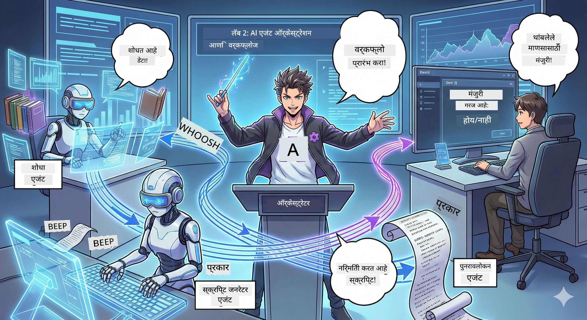

<!--
CO_OP_TRANSLATOR_METADATA:
{
  "original_hash": "2a2578dc4f813ca93ca7952d842a4b59",
  "translation_date": "2026-01-05T14:39:05+00:00",
  "source_file": "WorkshopForAgentic/translation/zh-cn/02.AIAgentOrchestrationAndWorkflows.md",
  "language_code": "mr"
}
-->
# दुसरा अंक: तुमची पॉडकास्ट निर्मिती टीम तयार करा 🎬



## गोष्टींची तीव्रता वाढते

अलेक्झ (तू पहिल्या अंकातील AI सहाय्यक) छान आहे, पण एकच एजंट एका संपूर्ण पॉडकास्ट स्टुडिओला चालवू शकत नाही. तुला एका *टीम* ची गरज आहे:
- 🔍 **संशोधन एजंट**: नवीन माहिती शोधण्यासाठी वेबवर शोधा
- ✍️ **स्क्रिप्ट एजंट**: संशोधनाला आकर्षक संवादात रूपांतर करा
- 👤 **तू (संपादक)**: स्क्रिप्ट मंजूर करा किंवा पुन्हा लिहिण्यास पाठवा

तुमचे स्वागत आहे **AI एजंट ऑर्केस्ट्रेशन** मध्ये — जिथे तुम्ही तुमच्या स्वतःच्या AI टीमचे दिग्दर्शक होता. विचार करा एवेंजर्स टीमसारखे पण पॉडकास्ट निर्मितीसाठी.

## एजंट ऑर्केस्ट्रेशन म्हणजे काय? (सोप्या भाषेत)

तुला रेस्टॉरंट चालवत असं समजा. तू स्वतः सर्व काही करणार नाहीस, बरोबर? तुझ्याकडे असतात:
- 🍳 शेफ जे जेवण बनवतात
- 👨‍🍳 सहायक शेफ जे तयारी करतात
- 👩‍🍳 वेटर जे जेवण सर्व्ह करतात

एजंट ऑर्केस्ट्रेशन देखील तसचं आहे, पण AI सह. प्रत्येक एजंटची तज्ञता असते, आणि तू त्यांना समन्वय साधून मोठं उद्दिष्ट साध्य करतोस. कुठल्याही एका एजंटवर जास्त भार येत नाही आणि काम अधिक वेगाने पूर्ण होते.

### बँडचा समानार्थक 🎸

तुझा AI एजंट म्हणजे एक संगीत बँडसारखा आहे:
- **मुख्य गायक**: ग्राहकांच्या कामांवर लक्ष ठेवणार मुख्य एजंट
- **ड्रमर**: ताल राखतो, बॅकएंड प्रक्रिया सांभाळतो
- **बेस गिटार वादक**: प्रत्येकाला समर्थन देतो, डेटा मिळवतो
- **तू (बँड मॅनेजर)**: सर्वांचे समन्वय साधतोस!

समन्वय नसल्यास? फक्त गोंगाट होतो. समन्वय असला तर? सुंदर संगीत.

### हे का महत्त्वाचे आहे

एक AI एजंट सर्व काही करण्याचा प्रयत्न करतो = थकवा. व्यावसायिक एजंट एकत्र काम करतात = कार्यक्षमता उघडणं! 🚀

**खरे बोलायचे झाले तर**: आठवतं का एकटा संशोधन, लेखन, आणि संपादन करायला गेला होता? हो, ते चांगलं नव्हतं. ऑर्केस्ट्रेशनमुळे प्रत्येक एजंट त्याचा उतकृष्ट भाग करतो. तुला फक्त अंतिम निर्णय घ्यायचा आहे.

**वास्तविक जीवन उदाहरण**: ग्राहक समर्थन बॉट कधी बिलिंग हाताळायचा, कधी तांत्रिक प्रश्न, आणि कधी माणसाला कॉल करायचा ते जाणतो. तेच म्हणजे ऑर्केस्ट्रेशन!

## एजंट आणि वर्कफ्लो: काय फरक आहे?

असं समजा:

### 🤖 AI एजंट = जॅझ म्युझिशियन
- **तयार निर्णय** त्याने ऐकलेल्या आधारावर घेतो
- **सर्जनशीलता** त्याच्या साधनांसह उपाय शोधतो
- **विचार करतो** LLM मेंदूने
- **पुढे जातो** काहीही दिलं तरी

### 🎵 वर्कफ्लो = संगित बँड क्लासिकल संगीत वाजवतो
- **गाण्याचा स्कोर फॉलो करतो** (पूर्वनियोजित पावले)
- **पूर्वनिर्धारित** कार्यवाही मार्ग
- **समन्वय** अनेक एजंट, मानवी, प्रणालींमध्ये
- **रचनेत** रेसिपीसारखं

**जादू**: वर्कफ्लो *ऑर्केस्ट्रेट* करतो एजंट्सना! तू वर्कफ्लो तयार करतोस आणि एजंट्सना सांगतोस केव्हा काम करायचं. दोन्हीचा चांगला संगम. 🎭

## तुमच्या AI टीमला समन्वयित करण्याचे तीन मार्ग

### 1. 🎯 केंद्रीकृत (तू बॉस - निर्णयकर्ता)

एका मुख्य एजंटला आदेश देणारा समज. त्याला समजावून घे, जणू तू टीममध्ये व्यवस्थापक आहेस — कोण काय करेल आणि कधी करेल हे तुम्ही ठरवतो.

**फायदे**:
- ✅ स्पष्ट नेतृत्व (काही गोंधळ नाही)
- ✅ सुसंगत निर्णय
- ✅ डीबग करणे सोपे

**उपयुक्त**:
- ग्राहक सेवा राऊटिंग ("हे बिलिंग आहे की तांत्रिक मदत?")
- सामग्री मंजुरी वर्कफ्लो ("हा स्क्रिप्ट पास आहे का?")
- पॉडकास्ट निर्मिती (जी आपण आज तयार करीत आहोत!)

### 2. 🤝 विकेंद्रीकृत (एजंट स्वतः संघटित)

एजंट्स थेट एकमेकांशी बोलतात आणि समूह म्हणून समस्या सोडवतात. जणू सर्वजण एका गट चॅटमध्ये समन्वय साधत आहेत.

**फायदे**:
- ✅ सहज वाढवता येते (नवीन एजंट्स कधीही जोडा)
- ✅ एकाच ठिकाणची अयशस्वी समस्या नाही
- ✅ एजंट्स आपोआप सहकार्य करतात

**उपयुक्त**:
- संशोधन टीम (प्रत्येक एजंट वेगवेगळ्या स्त्रोतांचा शोध घेतो)
- ब्रेनस्टॉर्मिंग सभा
- वितरण केलेले समस्यांचे निराकरण

### 3. 🔀 मिश्र (दोन्ही चांगले)

तू एकंदर दिशा देतोस, पण एजंट्सना कार्यांवर स्वायत्तता असते. जणू CEO जी टीमवर विश्वास ठेवतो.

**सुयोग्य**: नियंत्रण आणि लवचिकता दोन्ही हवी असलेले जटिल प्रकल्प.

## Microsoft एजंट फ्रेमवर्क: तुझं ऑर्केस्ट्रेशन किट 🧰

बांधकामाची वेळ आली! हाच पर्याय तू वापरशील:

### बांधण्यासाठी घटक

#### 1. 🧱 एक्झिक्यूटर (तुझे कामगार)
- **ते काय आहेत**: स्वतंत्र प्रक्रिया युनिट्स — कदाचित एजंट्स किंवा कस्टम लॉजिक
- **ते काय करतात**: इनपुट घेतात, काम पूर्ण करतात, आउटपुट निर्माण करतात
- **विचार करा**: उत्पादन लाईनवरील वर्कस्टेशन्स म्हणून

#### 2. ➡️ एज (संपर्क)
- **ते काय आहेत**: एक्झिक्युटर्समधील मार्ग
- **ते काय करतात**: संदेश प्रवाहाचे नियंत्रण ("A नंतर B ला जा")
- **विचार करा**: फ्लोचार्टच्या बाणांप्रमाणे

#### 3. 🗺️ वर्कफ्लो (एकूण योजना)
- **ते काय आहेत**: एक्झिक्युटर + एज यांचे पूर्ण चित्र
- **ते काय करतात**: सुरुवातीपासून शेवटपर्यंत संपूर्ण प्रक्रिया परिभाषित करतात
- **विचार करा**: तुझ्या निर्मिती प्रक्रियेचा ब्लूप्रिंट

### तुला आवडतील हे वेगळे फिचर्स

**🛡️ टाइप सेफ्टी**: एजंट्समधील संदेशांची टाइप तपासणी होते. "अरे, चुकीचा डेटा टाइप" अशी आश्चर्यकारक स्थिती नाही.

**🔀 लवचिक मार्गदर्शन**:
- If-then शर्ती ("जर मान्यतर, प्रकाशन करा; नाही तर पुन्हा लिहा")
- समांतर प्रक्रिया (अनेक एजंट्स एकाच वेळी काम करतात)
- डायनॅमिक मार्ग (वर्कफ्लो निकालानुसार समायोजित होते)

**🔌 बाह्य समाकलने**:
- API शी जोडा
- मॅन्युअल चेकपॉइंट्स जोडा (तू प्रकाशित करण्यापूर्वी मान्य करतोस)
- विनंती/प्रतिक्रिया फ्लोज तयार करा

**💾 चेकपॉइंट्स**: प्रगती जतन करा! काही अडचण आली तर तिथून परत सुरू करता येईल.

**🤝 बहु-एजंट समन्वय**:
- अनुक्रमे एजंट्स चालवा (A → B → C)
- त्यांना समांतर चालवा (A + B + C एकाच वेळी)
- एजंट्स मध्ये हँडऑफ करा
- सहकार्याने काम करा

## सर्वोत्तम पद्धती (प्रो टिप्स) 🎯

### 1. मॉड्युलर रहा  
प्रत्येक एजंटने एकच गोष्ट नीट करावी. "सर्व काही करणारा सुपर एजंट" तयार करू नका — डीबग करताना तुझं नुकसान होईल.

### 2. अपयशासाठी योजना करा  
एजंट चुकू शकतो. नेटवर्क फेल होऊ शकतो. चुका हाताळण्याचे आणि बॅकअप योजना तयार करा. तुझा भविष्याचा मी तुझा आभार मानेल.

### 3. सगळे निरीक्षण करा  
एजंट काय करत आहे ते ट्रॅक करा. DevUI वापरा (आम्ही त्याबद्दल पुढे बोलू) चालू वर्कफ्लो पहाण्यासाठी.

### 4. संदेशाचा आकार कमी करा  
एजंट्समधील मोठ्या फाइल्स पाठवू नका. संदेश लहान ठेवा, ज्यामुळे गती वाढेल.

### 5. बरोबर पॅटर्न निवडा  
नियंत्रण हवं? केंद्रीकृत निवडा. प्रमाणवार हवं? विकेंद्रीकृत निवडा. नक्की काय करावं माहिती नाही? मिश्र निवडा!

## DevUI: तुझा वर्कफ्लो डिबगर 🔍

### DevUI म्हणजे काय?

DevUI म्हणजे तुझ्या एजंट्स आणि वर्कफ्लोचा टेस्टिंग प्लेग्राउंड. हे एक वेब इंटरफेस आहे, जिथे तू करू शकतोस:
- 👀 तुमचा वर्कफ्लो चालताना पहा
- 💬 थेट एजंट्सशी संवाद करा
- 🔍 त्रुटी झाल्यावर डीबग करा
- 📊 ट्रेसिंग आणि कामगिरीच्या मेट्रिक्स पहा

> **महत्त्वाचं**: DevUI फक्त डेव्हलपमेंटसाठी आहे! उत्पादनासाठी वापरू नका. हे तुझ्या लोकल टेस्टिंग एन्व्हायर्नमेंटसारखे आहे.

### काय मस्त आहे

- **🖥️ इंटरएक्टिव्ह वेब UI**: क्लिक करा, टाका, टेस्ट करा — कमांडलाइनची गरज नाही
- **📁 ड्रॅग आणि ड्रॉप रेडी**: फायली अपलोड करा, वेगवेगळ्या इनपुटसह टेस्ट करा
- **📂 ऑटो डिस्कव्हरी**: एका फोल्डरकडे निर्देश करा, ते सर्व एजंट्स आपआपसात शोधून काढते
- **📋 सेटअपमधून मुक्त**: फोल्डर स्ट्रक्चर नको, कोडमध्ये एजंट्स नोंद करा
- **🔌 OpenAI सुसंगत**: OpenAI SDK सोबत सुसंगत (सुत्रसंकलन चरमश्रेय!)
- **👁️ अंतर्भूत ट्रॅकिंग**: तुझा एजंट काय करत आहे ते अचूक पाहा

### इनपुट कसे काम करते

DevUI इनपुटमध्ये खूप स्मार्ट आहे:

- **एजंट टेस्ट करायचा आहे?** तुला टेक्स्ट बॉक्स आणि फाइल अपलोड बटण मिळेल
- **वर्कफ्लो टेस्ट करायचा आहे?** UI तुमच्या वर्कफ्लोकडे पाहून इनपुट फिल्डस् तयार करतो

हे जणू जादू आहे, पण खरंतर उत्तम कोडिंग आहे. ✨

## तुझं काम: पॉडकास्ट स्टुडिओ तयार कर 🎬

### काम 1: DevUI वापरून एक एजंट तयार करा

📂 [01.AgentDevUI](../../../../../WorkshopForAgentic/code/02.Workflow/01.AgentDevUI)

**आव्हान**: पूर्ण टीम बनवण्याआधी, चल DevUI वापरून एक एजंट टेस्ट करूया: वेब संशोधन तज्ञ.

**तु काय बनवत आहेस**:  
इंटरनेटवर पॉडकास्ट विषय शोधणारा संशोधन एजंट. DevUI च्या वेब इंटरफेस `http://localhost:8090` वापरून टेस्ट करशील.

**तुला काय शिकायला मिळेल**:  
- 🚀 DevUI मध्ये एजंट कसा चालवायचा  
- 🔍 रिअलटाइम एजंट रिस्पॉन्स कसा टेस्ट करायचा  
- 🛠️ कस्टम टूल (वेबसर्च) कसे तयार करायचे  
- 📊 डीबगसाठी ट्रेसिंग कसे एनेबल करायचे  
- 🖥️ इंटरएक्टिव्ह वेब UI कसा वापरायचा  

**कोड**:  
- `agent.py`: वेब सर्च सुपरपॉवर असलेला SearchAgent  
- OllamaChatClient वापरून Qwen शी कनेक्शन  
- `web_search()` टूल फंक्शनची अंमलबजावणी  
- `serve()` वापरून सुरुवात —DevUI आपोआप उघडेल  

**जिंकण्याची अट**: एजंटला विचार "AI क्षेत्रात काय नवीन ट्रेंड आहेत?" आणि त्याला वेब शोधताना बघा! 🎉

### काम 2: मल्टी-एजंट वर्कफ्लो तयार करा

📂 [02.WorkflowDevUI](../../../../../WorkshopForAgentic/code/02.Workflow/02.WorkflowDevUI)

**आव्हान**: आता खरी मजा सुरू होते! पूर्ण पॉडकास्ट निर्मिती वर्कफ्लो तयार करा:  
1. 🔍 **शोध एजंट** → तुमचा विषय संशोधन करा  
2. ✍️ **स्क्रिप्ट एजंट** → दोन होस्ट्समधला संवाद लिहा (चिनी भाषेत!)  
3. 👤 **समीक्षा एक्झिक्यूटर** → तुझा मंजुरी किंवा नाकारण्याची विनंती करतो  
4. 🔄 **फिरवून पाठवणे** → नाकारल्यास, तुमच्या अभिप्रायानुसार पुन्हा लिहा  

**तुला काय शिकायचं**:  
- 🧱 वेगवेगळ्या कामांसाठी विशेषज्ञ एजंट बनवणे  
- 🔗 WorkflowBuilder वापरून एजंट्स कनेक्ट करणे  
- 🔀 मान्यतेसाठी लूप तयार करणे (मॅन्युअल चेकपॉइंट!)  
- 🚦 शर्तीवर मार्गदर्शन (मंजूर केले vs नाकारले)  
- 🔧 व्यवसाय लॉजिकसाठी कस्टम एक्झिक्यूटर्स तयार करणे  

**वर्कफ्लो**:  
```
SearchAgent → ScriptAgent → ReviewExecutor
                             ↑          ↓ (如果被拒绝)
                             ←─────────
```
  
**कोड**:  
- `search_agent/agent.py`: तुमचा संशोधन तज्ञ  
- `generate_script_agent/agent.py`: तुमचा स्क्रिप्ट लेखक (चिनी भाषेत!)  
- `workflow/workflow.py`: ऑर्केस्ट्रेशन मॅजिक येथे होते  
- `main.py`: DevUI मध्ये सर्व सुरू करा  

**जिंकण्याची अट**: एखादा विषय द्या, स्क्रिप्ट तपासा, एकदा नाकारून लूप तपासा, मग मंजूर करा! 🎉

### काम 3: कंसोल अ‍ॅप्लिकेशन तयार करा

📂 [03.Application](../../../../../WorkshopForAgentic/code/02.Workflow/03.Application)

**आव्हान**: DevUI मधील तुमचा वर्कफ्लो रंगीत आउटपुट, लोडिंग स्पिनर, आणि फाइल सेव्हिंगसह स्टायलिश टर्मिनल अ‍ॅप मध्ये रूपांतरित करा. हे उत्पादनासाठी तयार आहे!

**तुला काय शिकायचं**:  
- ⚡ प्रोग्रामॅटिकली वर्कफ्लो चालवणे (DevUI शिवाय)  
- 📡 स्ट्रीमिंग इव्हेंट-ड्रिव्हन आर्किटेक्चर वापरणे  
- 🎨 सुंदर टर्मिनल UI बनवणे (रंग, स्पिनर, प्रगती बार)  
- 💾 अंतिम स्क्रिप्ट फाइलमध्ये जतन करणे  
- 🔄 Python asyncio वापरून असिंक्रोनस वर्कफ्लो हाताळणे  

**ते काय करते**:  
1. तुझ्याकडून पॉडकास्ट विषय विचारा  
2. रिअलटाइम प्रगती दाखवा ("शोध एजंट काम करत आहे...")  
3. तयार झालेली स्क्रिप्ट रंगीत दाखवा  
4. तुझी मंजुरी मागा  
5. मान्यताप्राप्त स्क्रिप्ट `podcast.txt` मध्ये जतन करा  

**कोड**:  
- `podcast_app.py`: इव्हेंट हँडलिंग सह मुख्य अ‍ॅप  
- `workflow.py`: काम 2 चा वर्कफ्लो पुनर्वापर करा
- इव्हेंट प्रक्रियेत करा: `AgentRunUpdateEvent`、`RequestInfoEvent`、`WorkflowOutputEvent`
- टर्मिनल शैलीसाठी ANSI रंग वापरा

**यशस्वी अटी**: अॅप चालवा, पॉडकास्ट स्क्रिप्ट तयार करा, पाहा की ती जतन झाली आहे! तुम्ही खरोखरच एक साधन तयार केले आहे.🚀

## तुम्ही आधीच जिंकलात 🏆

दुसर्‍या चरणानंतर, तुम्ही करू शकता:

- ✅ बॉससारखे अनेक AI एजंट्सचे आयोजन करा
- ✅ अनुक्रम आणि अटींच्या लॉजिकसह वर्कफ्लो तयार करा
- ✅ मानवी मंजुरी तपासणी बिंदू जोडा
- ✅ DevUI वापरून वर्कफ्लो चाचणी व डीबग करा
- ✅ उत्पादनासाठी तैयार कन्सोल अॅप्लिकेशन तयार करा
- ✅ जटिल प्रणालींमध्ये त्रुटी सौम्यपणे हाताळा
- ✅ कोणत्याही प्रोजेक्टसाठी योग्य आयोजन पद्धत निवडा

## जेव्हा गोष्टी चुकतात तेव्हा 🔧

### "माझा वर्कफ्लो खूप जटिल आहे!"
**उपाय**: त्याला लहान उपवर्कफ्लोमध्ये विभाजित करा. प्रत्येक वर्कफ्लोने एक काम चांगल्या प्रकारे करावे. गरज असल्यास त्यांना एकत्र लिंक करा.

### "माझ्या घडत असलेल्या गोष्टींचा मला मागोवा घेता येत नाही!"
**उपाय**: स्टेट जतन करण्यासाठी वर्कफ्लो चेकपॉइंट वापरा. प्रत्येक टप्पा पाहण्यासाठी DevUI मध्ये ट्रेसिंग सक्षम करा.

### "एका एजंटचा त्रुटीमुळे सर्व काही क्रॅश होते!"
**उपाय**: त्रुटी मर्यादा जोडा. प्रत्येक एजंटने आपल्या अपयशाला स्वतःहून हाताळावे आणि पर्यायी वर्तन ठेवलं पाहिजे.

### "हे खूप हळू आहे"
**उपाय**: एजंटचे समांतर चालवता येऊ शकते का? अनुक्रम वर्कफ्लो सोपे आहे पण हळू आहे. समांतर संधी शोधा!

## उपयुक्त संसाधने 🔗

- [वर्कफ्लो दस्तऐवज](https://learn.microsoft.com/en-us/agent-framework/user-guide/workflows/overview) —— अधिकृत Microsoft मार्गदर्शक
- [आयोजन पद्धती](https://www.ibm.com/think/topics/ai-agent-orchestration) —— IBM चा दृष्टिकोन
- [Agent Framework GitHub](https://github.com/microsoft/agent-framework) —— स्त्रोत कोड ब्राउझ करा
- [कोड उदाहरणे](https://github.com/microsoft/agent-framework/tree/main/python/samples) —— इथे मॉडेल्स चोरी करा

---

**तयार आहात अंतिम टप्प्यासाठी?** तुमच्याकडे स्क्रिप्ट आहे. आता चला ती प्रत्यक्ष ऑडिओमध्ये रूपांतरित करू!→ [तिसरा चरण: तुमचा पॉडकास्ट सजीव करा](03.Multi-SpeakerPodcastGenerationWithVibeVoice.md) 🎤

---

**अडकलात? गोंधळात आहात? उत्साही आहात?** वर्कशॉप चॅटर मध्ये सामायिक करा! आपण एकत्र शिकू.🚀

---

<!-- CO-OP TRANSLATOR DISCLAIMER START -->
**अस्वीकरण**:
हा दस्तऐवज AI भाषांतर सेवा [Co-op Translator](https://github.com/Azure/co-op-translator) वापरून अनुवादित करण्यात आला आहे. आम्ही अचूकतेसाठी प्रयत्न करत असलो तरी, कृपया लक्षात घ्या की स्वयंचलित भाषांतरांमध्ये चुका किंवा अपूर्णता असू शकते. मूळ दस्तऐवज त्याच्या मूळ भाषेतच अधिकृत स्रोत मानावा. महत्त्वाची माहिती असल्यास व्यावसायिक मानवी भाषांतर करावे अशी शिफारस केली जाते. या भाषांतराच्या वापरामुळे उद्भवणाऱ्या कोणत्याही गैरसमजुती किंवा चुकीच्या अर्थलाघवांसाठी आम्ही जबाबदार नाही.
<!-- CO-OP TRANSLATOR DISCLAIMER END -->