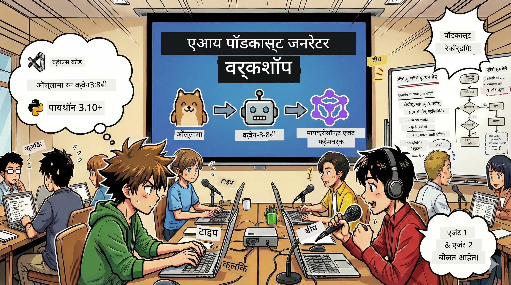

<!--
CO_OP_TRANSLATOR_METADATA:
{
  "original_hash": "aa775a734bda4590ecbe3a94a3b62197",
  "translation_date": "2026-01-05T17:34:01+00:00",
  "source_file": "WorkshopForAgentic/translation/zh-cn/README.md",
  "language_code": "mr"
}
-->
# 🎙️ AI पॉडकास्ट स्टुडिओ कार्यशाळा



## तुमचे कार्य

**AI पॉडकास्ट स्टुडिओ** मध्ये तुमचे स्वागत आहे! तुम्ही तुमचा तंत्रज्ञान पॉडकास्ट "Future Bytes" सुरू करणार आहात—पण येथे एक वळण आहे: तुम्ही एक AI चालित उत्पादन टीम तयार करणार आहात जी तुमच्या पॉडकास्टच्या निर्मितीत मदत करेल. आता अनंत संशोधन, स्क्रिप्ट लेखन आणि ऑडिओ संपादनाची गरज नाही. त्याऐवजी, तुम्ही प्रोग्रामिंगद्वारे AI सुपरपॉवर असलेले पॉडकास्ट निर्माता बनाल.

## कथा पार्श्वभूमी

कल्पना करा: तुम्ही आणि तुमचे मित्र अत्याधुनिक तंत्रज्ञान ट्रेंडवर एक पॉडकास्ट सुरू करू इच्छित आहात, पण प्रत्येकजण शिकत, काम करत किंवा जीवनात व्यस्त आहे. जर तुम्ही एक AI एजंट्सची टीम तयार केली ज्यांनी हे भारी काम पूर्ण केलं तर काय होई? एक एजंट संशोधनासाठी, दुसरा आकर्षक स्क्रिप्ट लिहिण्यासाठी, आणि तिसरा मजकूर नैसर्गिक आणि प्रवाही संभाषणात रूपांतरित करेल. विज्ञानकथेसारखे वाटतेय? चला ते वास्तवात रूपांतरित करूया.

## तुम्ही काय शिकाल

या कार्यशाळेच्या शेवटी, तुम्हाला माहित असेल कसे:
- 🤖 तुमचा स्वतःचा स्थानिक AI मॉडेल तैनात करायचे (कोणताही API शुल्क नाही, क्लाउडवर अवलंबित्व नाही!)
- 🔧 व्यावहारिकपणे सहकार्य करणारी व्यावसायिक AI एजंट्स तयार करायचे
- 🎬 कल्पना पासून ऑडिओपर्यंत संपूर्ण पॉडकास्ट उत्पादन प्रवाह तयार करायचा

## तुमची यात्रा: तीन अध्यार्पणे

कुठलीही चांगली कथा कशी असते तशी, आपल्याकडे तीन अध्यार्पणे आहेत. प्रत्येक अध्यार्पण तुमचा AI पॉडकास्ट स्टुडिओ हळूहळू तयार करेल:

| प्रकरण | तुमचे कार्य | काय घडेल | एक्सपर्ट कौशल्ये |
|---------|------------|-----------|-------------------|
| **पहिले अध्यार्पण** | [तुमचा AI सहाय्यक ओळखा](01.BuildAIAgentWithSLM.md) | तुम्हाला AI एजंट कसे तयार करायचे हे समजेल जे गप्पादरम्यान बोलू शकतात, वेब शोधू शकतात आणि समस्यांचे निराकरण करू शकतात. त्यांना कुंटुबाच्या कामासाठी सतत जागरूक संशोधक समजा. | 🎯 तुमचा पहिला एजंट तयार करा<br>🛠️ त्याला सुपरपॉवर द्या (टूल्स!)<br>🧠 त्याला विचार करायला शिकवा<br>🌐 इंटरनेटशी कनेक्ट करा |
| **दुसरे अध्यार्पण** | [तुमची उत्पादन टीम तयार करा](02.AIAgentOrchestrationAndWorkflows.md) | आता गोष्टी मजेदार होतात! तुम्ही एकाधिक AI एजंट्सना एक पॉडकास्ट टीमप्रमाणे समन्वित करण्यात शिकाल. एक संशोधन, एक लेखन करतो, तुम्ही मंजुरी देता—टीमवर्क स्वप्न पूर्ण करते. | 🎭 अनेक एजंट्स समन्वित करा<br>🔄 मंजुरी कार्यप्रवाह तयार करा<br>🖥️ DevUI इंटरफेस वापरून चाचणी करा<br>✋ मानव नियंत्रण ठेवा |
| **तिसरे अध्यार्पण** | [पॉडकास्ट सजीव करा](03.Multi-SpeakerPodcastGenerationWithVibeVoice.md) | अंतिम अध्याय! तुमची मजकूर स्क्रिप्ट प्रत्यक्ष आवाज आणि नैसर्गिक संभाषणासह रिअल पॉडकास्ट ऑडिओमध्ये रूपांतरित करा. तुमचा "Future Bytes" पॉडकास्ट प्रसिद्धीसाठी तयार आहे! | 🎤 मजकूर ते आवाज जादू<br>👥 अनेक वक्त्यांचे आवाज<br>⏱️ लांब स्वरूपाची ऑडिओ<br>🚀 पूर्णपणे स्वयंचलित |

प्रत्येक अध्यार्पण नवीन कौशल्ये उघडते. तुम्ही धैर्यशील असाल तर अध्यार्पणे स्किप करू शकता, पण आम्ही शिफारस करतो की क्रमाने शिका!

## पर्यावरण आवश्यकता

ही कार्यशाळा विविध हार्डवेअर कॉन्फिगरेशनसाठी समर्थीत आहे:
- **CPU**: चाचणी व लहान प्रमाणात वापरासाठी योग्य
- **GPU**: उत्पादनासाठी शिफारस केली जाते, त्वरित संश्लेषण वेग वाढवते
- **NPU**: पुढील पिढी न्यूरल प्रोसेसिंग युनिट वेगवाढीसाठी समर्थीत

## तुम्हाला काय आवश्यक आहे

### सॉफ्टवेअर यादी ✅
- **Python 3.10+** (तुमची प्रोग्रामिंग भाषा)
- **Ollama** (तुमच्या मशीनवर AI मॉडेल चालवण्यासाठी)
- **VS Code** (तुमचा कोड संपादक)
- **Python एक्सटेंशन** (VS Code अधिक बुद्धिमान बनवण्यासाठी)
- **Git** (कोड मिळवण्यासाठी)

### हार्डवेअर तपासणी 💻
- **मी चालवू शकतो का?**: 8GB RAM, 10GB उपलब्ध जागा (चालेल पण कदाचित हळू)
- **आदर्श कॉन्फिगरेशन**: 16GB+ RAM, चांगला GPU (सुलभ चालन!)
- **NPU आहे का?**: तर छान! पुढील पिढी कार्यक्षमता उघडेल 🚀

## तुमचा स्टुडिओ सेट करा 🎬

### पाऊल 1: Python अपग्रेड करा

Python 3.10 किंवा नवीन आवृत्ती आहे याची खात्री करा:

```bash
python --version
# Python 3.10.x किंवा त्यापेक्षा उच्च आवृत्ती दर्शविली पाहिजे
```

Python नाही का? [python.org](https://python.org) वरून डाउनलोड करा — हे विनामूल्य आहे!

### पाऊल 2: Ollama (तुमचा AI मॉडेल रनर) डाउनलोड करा

तुमच्या OS साठी योग्य Ollama [ollama.ai](https://ollama.ai) वरून डाउनलोड करा. हे स्थानिक AI मॉडेल्स चालवण्याचा इंजिन आहे.

तयार असल्याची खात्री करा:

```bash
ollama --version
```

### पाऊल 3: तुमचा AI मेंदू 🧠 डाउनलोड करा

Qwen-3-8B मॉडेल मिळवण्याची वेळ आली आहे (तुमचा पहिला AI सहाय्यक भाड्याने घेण्यासारखा):

```bash
ollama pull qwen3:8b
```

*हे काही मिनिटे लागू शकते. उत्कृष्ट कॉफी वेळ! ☕*

### पाऊल 4: VS Code सेट करा

जर अजून नसल्यास, [Visual Studio Code](https://code.visualstudio.com/) मिळवा. हे सर्वोत्तम कोड संपादक आहे (खेळ सांगा 😄).

### पाऊल 5: Python एक्सटेंशन

VS Code मध्ये:
1. `Ctrl+Shift+X` दाबा (Mac वर `Cmd+Shift+X`)
2. "Python" शोधा
3. Microsoft चा अधिकृत Python एक्सटेंशन इंस्टॉल करा

### पाऊल 6: मोठ्या साजशृंगाराची तयारी! 🎉

खरं सांगायचे तर, तुम्ही तयार आहात. चला काही AI जादू तयार करूया!

### पाऊल 7: Microsoft Agent Framework आणि संबंधित पॅकेजेस इंस्टॉल करा 📦

कार्यशाळासाठी आवश्यक सर्व अवलंबनं इंस्टॉल करा:

```bash
pip install -r ./Installations/requirements.txt -U
```

*हे Microsoft Agent Framework आणि सर्व आवश्यक पॅकेजेस इंस्टॉल करेल. कॉफी प्या — प्रथम इंस्टॉलेशन काही मिनिटे घेऊ शकते! ☕*

## कार्यशाळा सूचना

संपूर्ण प्रकल्प संरचना, कॉन्फिगरेशन पायऱ्या आणि कसे चालवायचे यावर कार्यशाळेदरम्यान सखोल मार्गदर्शन केले जाईल.

## समस्या सोडवणे (जेव्हा काहीतरी चुकते)🔧

### "अरेरे, मॉडेल डाउनलोड खूप हळू आहे!"
**सोल्यूशन**: VPN वापरा किंवा Ollama मिरर कॉन्फिगर करा. कधी कधी इंटरनेटची गती खाल्ली असते.

### "माझा संगणक साचले आहे! मेमरी कमी!"
**सोल्यूशन**: लहान मॉडेलवर स्विच करा किंवा `num_ctx` सेटिंग कमी करा ज्याने कमी मेमरी वापर होईल. त्याला AI ला डायएट देण्यासारखे समजा.

### "मी GPU वापरून हे वेगाने करू शकतो का?"
**सोल्यूशन**: Ollama GPU ऑटो डिटेक्ट करतो! फक्त खात्री करा की तुमच्या GPU ड्रायव्हर अपडेटेड आहेत. फ्री स्पीड बूस्ट! 🏎️

## अतिरिक्त संसाधने (कुतूहलासाठी)📚

- [Ollama दस्तऐवज](https://github.com/ollama/ollama) — स्थानिक AI मॉडेल्स विषयी अधिक जाणून घ्या
- [Microsoft Agent Framework](https://microsoft.github.io/autogen/) — एजंट टीम तयार करण्याबाबत अधिक माहिती
- [Qwen मॉडेल माहिती](https://qwenlm.github.io/) — तुमच्या AI सहाय्यकाचा मेंदू ओळखा

## परवानगी

MIT परवाना — मस्त गोष्टी तयार करा, शेअर करा, आणि जग अधिक सुंदर करा! 🌍

## सहकार्य हवे का?

कुणती बग सापडली? काही सूचना आहेत? इश्यू किंवा PR सबमिट करा! आम्हाला समुदाय आवडतो. ✨

---

<!-- CO-OP TRANSLATOR DISCLAIMER START -->
**अस्वीकरण**:
हा दस्तऐवज AI अनुवाद सेवा [Co-op Translator](https://github.com/Azure/co-op-translator) वापरून अनुवादित केला आहे. आम्ही अचूकतेसाठी प्रयत्न करत असलो तरी, कृपया लक्षात घ्या की स्वयंचलित अनुवादांमध्ये चुका किंवा अप्रशुद्धता असू शकते. मूळ दस्तऐवज त्याच्या स्थानिक भाषेत अधिकृत स्रोत मानले पाहिजे. महत्त्वाच्या माहिती साठी व्यावसायिक मानवी अनुवादाची शिफारस केली जाते. या अनुवादाच्या वापरामुळे उद्भवलेल्या कोणत्याही गैरसमजुती किंवा चुकीबद्दल आम्ही जबाबदार नाही.
<!-- CO-OP TRANSLATOR DISCLAIMER END -->