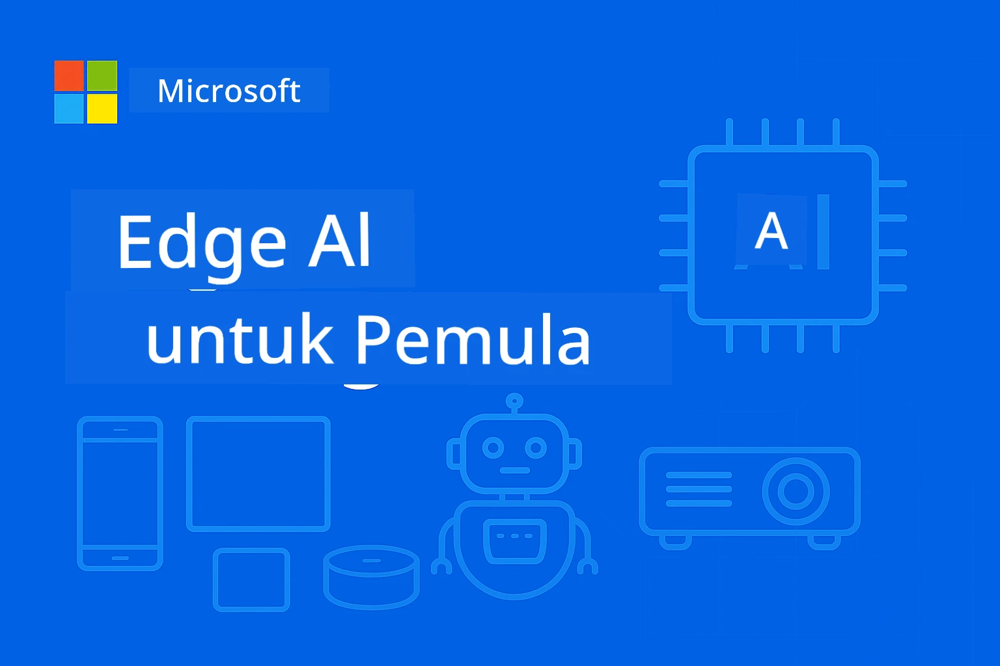

# EdgeAI untuk Pemula




[](https://GitHub.com/microsoft/edgeai-for-beginners/graphs/contributors)
[](https://GitHub.com/microsoft/edgeai-for-beginners/issues)
[](https://GitHub.com/microsoft/edgeai-for-beginners/pulls)
[](http://makeapullrequest.com)

[](https://GitHub.com/microsoft/edgeai-for-beginners/watchers)
[](https://GitHub.com/microsoft/edgeai-for-beginners/fork)
[](https://GitHub.com/microsoft/edgeai-for-beginners/stargazers)


[](https://discord.gg/nTYy5BXMWG)

Ikuti langkah berikut untuk memulakan penggunaan sumber ini:

1. **Fork Repositori**: Klik [](https://GitHub.com/microsoft/edgeai-for-beginners/fork)
2. **Clone Repositori**:   `git clone https://github.com/microsoft/edgeai-for-beginners.git`
3. [**Sertai Discord Azure AI Foundry dan berjumpa dengan pakar serta pembangun lain**](https://discord.com/invite/ByRwuEEgH4)


### 🌐 Sokongan Pelbagai Bahasa

#### Disokong melalui GitHub Action (Automatik & Sentiasa Dikemaskini)

<!-- CO-OP TRANSLATOR LANGUAGES TABLE START -->
[Arabic](../ar/README.md) | [Bengali](../bn/README.md) | [Bulgarian](../bg/README.md) | [Burmese (Myanmar)](../my/README.md) | [Chinese (Simplified)](../zh-CN/README.md) | [Chinese (Traditional, Hong Kong)](../zh-HK/README.md) | [Chinese (Traditional, Macau)](../zh-MO/README.md) | [Chinese (Traditional, Taiwan)](../zh-TW/README.md) | [Croatian](../hr/README.md) | [Czech](../cs/README.md) | [Danish](../da/README.md) | [Dutch](../nl/README.md) | [Estonian](../et/README.md) | [Finnish](../fi/README.md) | [French](../fr/README.md) | [German](../de/README.md) | [Greek](../el/README.md) | [Hebrew](../he/README.md) | [Hindi](../hi/README.md) | [Hungarian](../hu/README.md) | [Indonesian](../id/README.md) | [Italian](../it/README.md) | [Japanese](../ja/README.md) | [Kannada](../kn/README.md) | [Korean](../ko/README.md) | [Lithuanian](../lt/README.md) | [Malay](./README.md) | [Malayalam](../ml/README.md) | [Marathi](../mr/README.md) | [Nepali](../ne/README.md) | [Nigerian Pidgin](../pcm/README.md) | [Norwegian](../no/README.md) | [Persian (Farsi)](../fa/README.md) | [Polish](../pl/README.md) | [Portuguese (Brazil)](../pt-BR/README.md) | [Portuguese (Portugal)](../pt-PT/README.md) | [Punjabi (Gurmukhi)](../pa/README.md) | [Romanian](../ro/README.md) | [Russian](../ru/README.md) | [Serbian (Cyrillic)](../sr/README.md) | [Slovak](../sk/README.md) | [Slovenian](../sl/README.md) | [Spanish](../es/README.md) | [Swahili](../sw/README.md) | [Swedish](../sv/README.md) | [Tagalog (Filipino)](../tl/README.md) | [Tamil](../ta/README.md) | [Telugu](../te/README.md) | [Thai](../th/README.md) | [Turkish](../tr/README.md) | [Ukrainian](../uk/README.md) | [Urdu](../ur/README.md) | [Vietnamese](../vi/README.md)

> **Lebih Suka Clone Secara Tempatan?**

> Repositori ini mengandungi lebih 50 terjemahan bahasa yang meningkatkan saiz muat turun dengan ketara. Untuk clone tanpa terjemahan, gunakan sparse checkout:
> ```bash
> git clone --filter=blob:none --sparse https://github.com/microsoft/edgeai-for-beginners.git
> cd edgeai-for-beginners
> git sparse-checkout set --no-cone '/*' '!translations' '!translated_images'
> ```
> Ini membekalkan segala yang anda perlukan untuk menamatkan kursus dengan muat turun yang jauh lebih pantas.
<!-- CO-OP TRANSLATOR LANGUAGES TABLE END -->

**Jika anda ingin menyokong bahasa terjemahan tambahan yang disenaraikan [di sini](https://github.com/Azure/co-op-translator/blob/main/getting_started/supported-languages.md)**
## Pengenalan

Selamat datang ke **EdgeAI untuk Pemula** – perjalanan menyeluruh anda ke dalam dunia transformasi Kecerdasan Buatan Edge. Kursus ini merapatkan jurang antara kebolehan AI yang hebat dan penggunaan praktikal di dunia nyata pada peranti edge, membolehkan anda memanfaatkan potensi AI terus di tempat data dijana dan keputusan perlu dibuat.

### Apa yang Anda Akan Kuasai

Kursus ini membawa anda dari konsep asas hingga pelaksanaan siap produksi, meliputi:
- **Model Bahasa Kecil (SLMs)** yang dioptimumkan untuk pelaksanaan edge
- **Pengoptimuman berasaskan perkakasan** merentas pelbagai platform
- **Inferens masa nyata** dengan keupayaan mengekalkan privasi
- **Strategi pelaksanaan produksi** untuk aplikasi perusahaan

### Mengapa EdgeAI Penting

Edge AI mewakili perubahan paradigma yang menangani cabaran moden yang kritikal:
- **Privasi & Keselamatan**: Proses data sensitif secara tempatan tanpa pendedahan ke awan
- **Prestasi Masa Nyata**: Menghapuskan kelewatan rangkaian untuk aplikasi kritikal masa
- **Kecekapan Kos**: Mengurangkan penggunaan jalur lebar dan belanja pengkomputeran awan
- **Operasi Tahan Lasak**: Menyokong fungsi semasa gangguan rangkaian
- **Pematuhan Peraturan**: Memenuhi keperluan kedaulatan data

### Edge AI

Edge AI merujuk kepada menjalankan algoritma AI dan model bahasa secara tempatan pada perkakasan, berhampiran tempat data dijana tanpa bergantung pada sumber awan untuk inferens. Ia mengurangkan kelewatan, meningkatkan privasi, dan membolehkan pembuatan keputusan masa nyata.

### Prinsip Teras:
- **Inferens di peranti**: Model AI dijalankan pada peranti edge (telefon, penghala, mikropengawal, PC industri)
- **Keupayaan luar talian**: Berfungsi tanpa sambungan internet berterusan
- **Kelewatan rendah**: Respons segera sesuai untuk sistem masa nyata
- **Kedaulatan data**: Menyimpan data sensitif secara tempatan, meningkatkan keselamatan dan pematuhan

### Model Bahasa Kecil (SLMs)

SLM seperti Phi-4, Mistral-7B, dan Gemma adalah versi dioptimumkan model bahasa besar (LLMs)—dilatih atau disuling untuk:
- **Kesan memori dikurangkan**: Penggunaan cekap memori terhad peranti edge
- **Tuntutan pengkomputeran rendah**: Dioptimumkan untuk prestasi CPU dan GPU edge
- **Masa mula pantas**: Inisialisasi cepat untuk aplikasi responsif

Ia membuka kebolehan NLP hebat sambil mematuhi kekangan:
- **Sistem terbenam**: Peranti IoT dan pengawal industri
- **Peranti mudah alih**: Telefon pintar dan tablet dengan keupayaan luar talian
- **Peranti IoT**: Sensor dan peranti pintar dengan sumber terhad
- **Server edge**: Unit pemprosesan tempatan dengan sumber GPU terhad
- **Komputer Peribadi**: Senario pelaksanaan desktop dan komputer riba

## Modul & Navigasi Kursus

| Modul | Topik | Fokus | Kandungan Utama | Tahap | Tempoh |
|--------|-------|------------|-------------|--------|----------|
| [📖 00 ](./introduction.md) | [Pengenalan kepada EdgeAI](./introduction.md) | Asas & Konteks | Gambaran EdgeAI • Aplikasi Industri • Pengenalan SLM • Objektif Pembelajaran | Pemula | 1-2 jam |
| [📚 01](../../Module01) | [Asas EdgeAI](./Module01/README.md) | Perbandingan Cloud vs Edge AI | Asas EdgeAI • Kajian Kes Dunia Nyata • Panduan Pelaksanaan • Pelaksanaan Edge | Pemula | 3-4 jam |
| [🧠 02](../../Module02) | [Asas Model SLM](./Module02/README.md) | Keluarga model & seni bina | Keluarga Phi • Keluarga Qwen • Keluarga Gemma • BitNET • μModel • Phi-Silica | Pemula | 4-5 jam |
| [🚀 03](../../Module03) | [Amalan Pelaksanaan SLM](./Module03/README.md) | Pelaksanaan tempatan & awan | Pembelajaran Lanjutan • Persekitaran Tempatan • Pelaksanaan Awan | Pertengahan | 4-5 jam |
| [⚙️ 04](../../Module04) | [Kit Alat Pengoptimuman Model](./Module04/README.md) | Pengoptimuman merentas platform | Pengenalan • Llama.cpp • Microsoft Olive • OpenVINO • Apple MLX • Sintesis Aliran Kerja | Pertengahan | 5-6 jam |
| [🔧 05](../../Module05) | [Produksi SLMOps](./Module05/README.md) | Operasi produksi | Pengenalan SLMOps • Penyulingan Model • Penalaan Halus • Pelaksanaan Produksi | Lanjutan | 5-6 jam |
| [🤖 06](../../Module06) | [Ejen AI & Panggilan Fungsi](./Module06/README.md) | Rangka kerja Ejen & MCP | Pengenalan Ejen • Panggilan Fungsi • Protokol Konteks Model | Lanjutan | 4-5 jam |
| [💻 07](../../Module07) | [Pelaksanaan Platform](./Module07/README.md) | Contoh merentas platform | Kit AI • Foundry Tempatan • Pembangunan Windows | Lanjutan | 3-4 jam |
| [🏭 08](../../Module08) | [Kit Alat Foundry Tempatan](./Module08/README.md) | Sampel siap produksi | Aplikasi contoh (lihat butiran di bawah) | Pakar | 8-10 jam |

### 🏭 **Modul 08: Aplikasi Contoh**

- [01: Permulaan Pantas REST Chat](./Module08/samples/01/README.md)
- [02: Integrasi SDK OpenAI](./Module08/samples/02/README.md)
- [03: Penemuan Model & Penanda Aras](./Module08/samples/03/README.md)
- [04: Aplikasi Chainlit RAG](./Module08/samples/04/README.md)
- [05: Orkestrasi Pelbagai Ejen](./Module08/samples/05/README.md)
- [06: Router Model-sebagai-Alat](./Module08/samples/06/README.md)
- [07: Klien API Langsung](./Module08/samples/07/README.md)
- [08: Aplikasi Chat Windows 11](./Module08/samples/08/README.md)
- [09: Sistem Pelbagai Ejen Lanjutan](./Module08/samples/09/README.md)
- [10: Rangka Kerja Alat Foundry](./Module08/samples/10/README.md)

### 🎓 **Bengkel: Laluan Pembelajaran Praktikal**

Bahan bengkel praktikal yang komprehensif dengan pelaksanaan siap produksi:

- **[Panduan Bengkel](./Workshop/Readme.md)** - Objektif pembelajaran lengkap, hasil, dan navigasi sumber
- **Contoh Python** (6 sesi) - Dikemaskini dengan amalan terbaik, pengendalian ralat, dan dokumentasi terperinci
- **Jupyter Notebooks** (8 interaktif) - Tutorial langkah demi langkah dengan penanda aras dan pemantauan prestasi
- **Panduan Sesi** - Panduan terperinci dalam markdown untuk setiap sesi bengkel
- **Alat Validasi** - Skrip untuk mengesahkan kualiti kod dan menjalankan ujian pantas

**Apa yang Anda Akan Bina:**
- Aplikasi chat AI tempatan dengan sokongan streaming
- Saluran RAG dengan penilaian kualiti (RAGAS)
- Alat penanda aras dan perbandingan pelbagai model
- Sistem orkestrasi pelbagai ejen
- Penghalaan model pintar dengan pemilihan berasaskan tugas

### 🎙️ **Bengkel Untuk Agentic: Praktikal - Studio Podcast AI**

Bina saluran penghasilan podcast berkuasa AI dari awal! Bengkel menyeluruh ini mengajar anda mencipta sistem pelbagai ejen lengkap yang mengubah idea menjadi episod podcast profesional.
**[🎬 Mula Bengkel Studio Podcast AI](./WorkshopForAgentic/README.md)**

**Misi Anda**: Lancarkan "Future Bytes" — podcast teknologi yang sepenuhnya dijana oleh ejen AI yang anda bina sendiri. Tiada pergantungan awan, tiada kos API — semuanya berjalan secara tempatan di mesin anda.

**Apa Yang Membuatkan Ini Unik:**
- **🤖 Orkestrasi Multi-Ejen Sebenar** - Bina ejen AI khusus yang membuat penyelidikan, menulis, dan menghasilkan audio
- **🎯 Saluran Pengeluaran Lengkap** - Dari pemilihan topik hingga output audio podcast akhir
- **💻 Penggunaan Sepenuhnya Tempatan** - Menggunakan Ollama dan model tempatan (Qwen-3-8B) untuk privasi dan kawalan penuh
- **🎤 Integrasi Ucapan Daripada Teks** - Menukar skrip menjadi perbualan pelbagai penceramah yang kedengaran semula jadi
- **✋ Aliran Kerja Manusia-dalam-Laluan** - Pintu kelulusan memastikan kualiti sambil mengekalkan automasi

**Perjalanan Pembelajaran Tiga Babak:**

| Babak | Fokus | Kemahiran Utama | Tempoh |
|-----|-------|------------|----------|
| **[Babak 1: Kenali Pembantu AI Anda](./WorkshopForAgentic/md/01.BuildAIAgentWithSLM.md)** | Bina ejen AI pertama anda | Integrasi alat • Carian web • Penyelesaian masalah • Penalaran ejen | 2-3 jam |
| **[Babak 2: Satukan Pasukan Pengeluaran Anda](./WorkshopForAgentic/md/02.AIAgentOrchestrationAndWorkflows.md)** | Orkestrasi pelbagai ejen | Penyelarasan pasukan • Aliran kerja kelulusan • Antara muka DevUI • Pengawasan manusia | 3-4 jam |
| **[Babak 3: Hidupkan Podcast Anda](./WorkshopForAgentic/md/03.Multi-SpeakerPodcastGenerationWithVibeVoice.md)** | Jana audio podcast | Ucapan dari teks • Sintesis pelbagai penceramah • Audio bentuk panjang • Automasi penuh | 2-3 jam |

**Teknologi Digunakan:**
- **Microsoft Agent Framework** - Orkestrasi dan penyelarasan multi-ejen
- **Ollama** - Runtime model AI tempatan (tiada awan diperlukan)
- **Qwen-3-8B** - Model bahasa sumber terbuka yang dioptimumkan untuk tugasan ejen
- **API Ucapan Daripada Teks** - Sintesis suara semula jadi untuk penjanaan podcast

**Sokongan Perkakasan:**
- ✅ **Mod CPU** - Berfungsi pada mana-mana komputer moden (8GB+ RAM disyorkan)
- 🚀 **Pecutan GPU** - Inferens jauh lebih pantas dengan GPU NVIDIA/AMD
- ⚡ **Sokongan NPU** - Pecutan unit pemprosesan neural generasi seterusnya

**Sesuai Untuk:**
- Pembangun yang belajar sistem AI multi-ejen
- Sesiapa yang berminat dalam automasi AI dan aliran kerja
- Pencipta kandungan yang meneroka pengeluaran dengan bantuan AI
- Pelajar yang mengkaji corak orkestrasi AI praktikal

**Mula Membina**: [🎙️ Bengkel Studio Podcast AI →](./WorkshopForAgentic/README.md)

### 📊 **Ringkasan Laluan Pembelajaran**
- **Jumlah Tempoh**: 36-45 jam
- **Laluan Permulaan**: Modul 01-02 (7-9 jam)  
- **Laluan Pertengahan**: Modul 03-04 (9-11 jam)
- **Laluan Lanjutan**: Modul 05-07 (12-15 jam)
- **Laluan Pakar**: Modul 08 (8-10 jam)

## Apa Yang Anda Akan Bina

### 🎯 Kompetensi Teras
- **Seni Bina AI Edge**: Reka sistem AI dengan pendekatan tempatan dahulu dan integrasi awan
- **Pengoptimuman Model**: Kuantasi dan mampatan model untuk pengedaran edge (peningkatan kelajuan 85%, pengurangan saiz 75%)
- **Pengedaran Pelbagai Platform**: Windows, mudah alih, terbenam, dan sistem gabungan awan-edge
- **Operasi Pengeluaran**: Pemantauan, penskalaan, dan penyelenggaraan AI edge dalam pengeluaran

### 🏗️ Projek Praktikal
- **Aplikasi Sembang Tempatan Foundry**: Aplikasi asli Windows 11 dengan penukaran model
- **Sistem Multi-Ejen**: Penyelarasan dengan ejen pakar untuk aliran kerja kompleks  
- **Aplikasi RAG**: Pemprosesan dokumen tempatan dengan carian vektor
- **Penghala Model**: Pemilihan pintar antara model berdasarkan analisis tugasan
- **Rangka Kerja API**: Klien sedia pengeluaran dengan penstriman dan pemantauan kesihatan
- **Alat Merentas Platform**: Corak integrasi LangChain/Semantic Kernel

### 🏢 Aplikasi Industri
**Pembuatan** • **Penjagaan Kesihatan** • **Kenderaan Autonomi** • **Bandar Pintar** • **Aplikasi Mudah Alih**

## Mula dengan Pantas

**Laluan Pembelajaran Disyorkan** (20-30 jam keseluruhan):

0. **📖 Pengenalan** ([Introduction.md](./introduction.md)): Asas EdgeAI + konteks industri + rangka kerja pembelajaran
1. **📚 Asas** (Modul 01-02): Konsep EdgeAI + keluarga model SLM
2. **⚙️ Pengoptimuman** (Modul 03-04): Pengedaran + rangka kerja kuantasi  
3. **🚀 Pengeluaran** (Modul 05-06): SLMOps + ejen AI + panggilan fungsi
4. **💻 Pelaksanaan** (Modul 07-08): Sampel platform + kit alat Foundry Local

Setiap modul merangkumi teori, latihan langsung, dan contoh kod sedia pengeluaran.

## Impak Kerjaya

**Peranan Teknikal**: Arkitek Penyelesaian EdgeAI • Jurutera ML (Edge) • Pembangun AI IoT • Pembangun AI Mudah Alih

**Sektor Industri**: Pembuatan 4.0 • Teknologi Penjagaan Kesihatan • Sistem Autonomi • FinTech • Elektronik Pengguna

**Projek Portfolio**: Sistem multi-ejen • Aplikasi RAG pengeluaran • Pengedaran merentas platform • Pengoptimuman prestasi

## Struktur Repositori

```
edgeai-for-beginners/
├── 📖 introduction.md  # Foundation: EdgeAI Overview & Learning Framework
├── 📚 Module01-04/     # Fundamentals → SLMs → Deployment → Optimization  
├── 🔧 Module05-06/     # SLMOps → AI Agents → Function Calling
├── 💻 Module07/        # Platform Samples (VS Code, Windows, Jetson, Mobile)
├── 🏭 Module08/        # Foundry Local Toolkit + 10 Comprehensive Samples
│   ├── samples/01-06/  # Foundation: REST, SDK, RAG, Agents, Routing
│   └── samples/07-10/  # Advanced: API Client, Windows App, Enterprise Agents, Tools
├── 🌐 translations/    # Multi-language support (8+ languages)
└── 📋 STUDY_GUIDE.md   # Structured learning paths & time allocation
```

## Sorotan Kursus

✅ **Pembelajaran Progresif**: Teori → Amalan → Pengedaran pengeluaran  
✅ **Kajian Kes Sebenar**: Microsoft, Japan Airlines, pelaksanaan perusahaan  
✅ **Contoh Praktikal**: 50+ contoh, 10 demo komprehensif Foundry Local  
✅ **Fokus Prestasi**: Peningkatan kelajuan 85%, pengurangan saiz 75%  
✅ **Pelbagai Platform**: Windows, mudah alih, tertanam, gabungan awan-edge  
✅ **Sedia Pengeluaran**: Pemantauan, penskalaan, keselamatan, rangka kerja pematuhan

📖 **[Panduan Pembelajaran Tersedia](STUDY_GUIDE.md)**: Laluan pembelajaran 20 jam berstruktur dengan panduan pembahagian masa dan alat penilaian kendiri.

---

**EdgeAI melambangkan masa depan pengedaran AI**: tempatan dahulu, melindungi privasi, dan cekap. Kuasai kemahiran ini untuk membina generasi seterusnya aplikasi pintar.

## Kursus Lain

Pasukan kami menghasilkan kursus lain! Lihat:

<!-- CO-OP TRANSLATOR OTHER COURSES START -->
### LangChain
[](https://aka.ms/langchain4j-for-beginners)
[](https://aka.ms/langchainjs-for-beginners?WT.mc_id=m365-94501-dwahlin)

---

### Azure / Edge / MCP / Ejen
[](https://github.com/microsoft/AZD-for-beginners?WT.mc_id=academic-105485-koreyst)
[](https://github.com/microsoft/edgeai-for-beginners?WT.mc_id=academic-105485-koreyst)
[](https://github.com/microsoft/mcp-for-beginners?WT.mc_id=academic-105485-koreyst)
[](https://github.com/microsoft/ai-agents-for-beginners?WT.mc_id=academic-105485-koreyst)

---
 
### Siri AI Generatif
[](https://github.com/microsoft/generative-ai-for-beginners?WT.mc_id=academic-105485-koreyst)
[-9333EA?style=for-the-badge&labelColor=E5E7EB&color=9333EA)](https://github.com/microsoft/Generative-AI-for-beginners-dotnet?WT.mc_id=academic-105485-koreyst)
[-C084FC?style=for-the-badge&labelColor=E5E7EB&color=C084FC)](https://github.com/microsoft/generative-ai-for-beginners-java?WT.mc_id=academic-105485-koreyst)
[-E879F9?style=for-the-badge&labelColor=E5E7EB&color=E879F9)](https://github.com/microsoft/generative-ai-with-javascript?WT.mc_id=academic-105485-koreyst)

---
 
### Pembelajaran Teras
[](https://aka.ms/ml-beginners?WT.mc_id=academic-105485-koreyst)
[](https://aka.ms/datascience-beginners?WT.mc_id=academic-105485-koreyst)
[](https://aka.ms/ai-beginners?WT.mc_id=academic-105485-koreyst)
[](https://github.com/microsoft/Security-101?WT.mc_id=academic-96948-sayoung)
[](https://aka.ms/webdev-beginners?WT.mc_id=academic-105485-koreyst)
[](https://aka.ms/iot-beginners?WT.mc_id=academic-105485-koreyst)
[](https://github.com/microsoft/xr-development-for-beginners?WT.mc_id=academic-105485-koreyst)

---
 
### Siri Copilot
[](https://aka.ms/GitHubCopilotAI?WT.mc_id=academic-105485-koreyst)
[](https://github.com/microsoft/mastering-github-copilot-for-dotnet-csharp-developers?WT.mc_id=academic-105485-koreyst)
[](https://github.com/microsoft/CopilotAdventures?WT.mc_id=academic-105485-koreyst)
<!-- CO-OP TRANSLATOR OTHER COURSES END -->

## Mendapatkan Bantuan

Jika anda tersekat atau mempunyai sebarang soalan mengenai pembangunan aplikasi AI, sertai:

[](https://discord.gg/nTYy5BXMWG)

Jika anda mempunyai maklum balas produk atau ralat semasa membina, lawati:

[](https://aka.ms/foundry/forum)

---

<!-- CO-OP TRANSLATOR DISCLAIMER START -->
**Penafian**:  
Dokumen ini telah diterjemahkan menggunakan perkhidmatan terjemahan AI [Co-op Translator](https://github.com/Azure/co-op-translator). Walaupun kami berusaha untuk ketepatan, sila maklum bahawa terjemahan automatik mungkin mengandungi kesilapan atau ketidaktepatan. Dokumen asal dalam bahasa asalnya hendaklah dianggap sebagai sumber yang sahih. Untuk maklumat penting, terjemahan profesional oleh manusia adalah disyorkan. Kami tidak bertanggungjawab atas sebarang salah faham atau salah tafsir yang timbul daripada penggunaan terjemahan ini.
<!-- CO-OP TRANSLATOR DISCLAIMER END -->