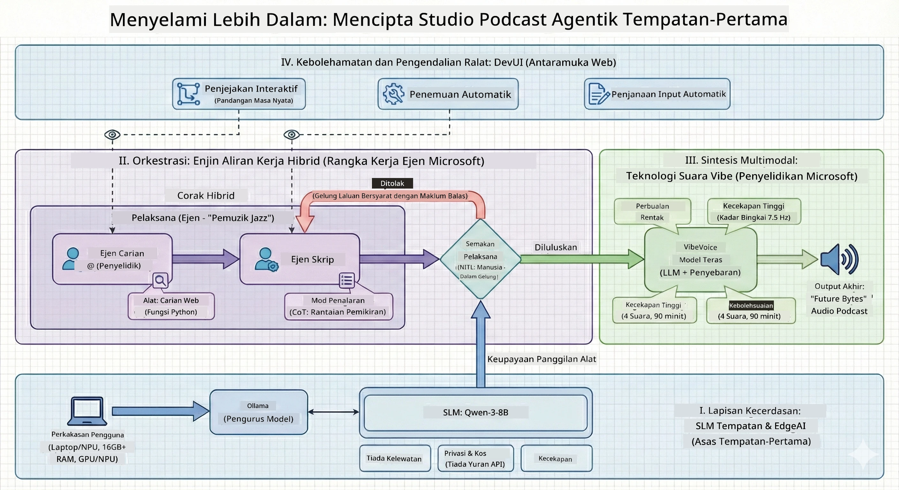

<!--
CO_OP_TRANSLATOR_METADATA:
{
  "original_hash": "f94e745264597bc5d8df967ead2eff97",
  "translation_date": "2026-01-05T10:46:46+00:00",
  "source_file": "WorkshopForAgentic/README.md",
  "language_code": "ms"
}
-->
# 🎙️ Bengkel Studio Podcast AI

> 🌏 [中文版 (Versi Cina)](translation/zh-cn/README.md)


## Misi Anda

Selamat datang ke **The AI Podcast Studio**! Anda akan melancarkan podcast teknologi anda sendiri yang dinamakan "Future Bytes" — tetapi ada kelainan: anda akan membina satu pasukan pengeluaran yang dikuasakan oleh AI untuk membantu anda menciptanya. Tiada lagi jam penyelidikan tanpa henti, penulisan skrip, dan penyuntingan audio. Sebaliknya, anda akan menulis kod untuk menjadi penerbit podcast dengan kuasa AI.

## Cerita

Bayangkan ini: Anda dan kawan-kawan ingin memulakan podcast tentang trend teknologi paling hebat, tetapi semua sibuk dengan sekolah, kerja, atau kehidupan. Bagaimana jika anda boleh membina satu pasukan ejen AI untuk melakukan kerja berat? Satu ejen membuat penyelidikan topik, satu lagi menulis skrip menarik, dan seorang lagi mengubah teks menjadi perbualan semula jadi. Kedengaran macam sains fiksyen? Mari kita realisasikan.

## Apa Yang Anda Akan Pelajari

Selepas bengkel ini, anda akan tahu cara untuk:
- 🤖 Melancarkan model AI tempatan anda sendiri (tiada kos API, tiada ketergantungan awan!)
- 🔧 Membina ejen AI khusus yang benar-benar bekerjasama
- 🎬 Mewujudkan saluran pengeluaran podcast lengkap dari idea ke audio

## Perjalanan Anda: Tiga Babak



Seperti mana-mana cerita yang bagus, kami ada tiga babak. Setiap satu membina studio podcast AI anda langkah demi langkah:

| Episod | Misi Anda | Apa Yang Berlaku | Kemahiran Dibuka |
|---------|-----------|-----------------|-----------------|
| **Babak 1** | [Kenali Pembantu AI Anda](md/01.BuildAIAgentWithSLM.md) | Anda mengetahui cara mencipta ejen AI yang boleh berbual, melayari web, dan menyelesaikan masalah. Anggap mereka sebagai pelatih penyelidikan anda yang tidak pernah tidur. | 🎯 Bina ejen pertama anda<br>🛠️ Berikan kuasa super (alat!)<br>🧠 Ajar ia berfikir<br>🌐 Sambungkan ke internet |
| **Babak 2** | [Susun Pasukan Pengeluaran Anda](md/02.AIAgentOrchestrationAndWorkflows.md) | Sekarang menjadi menarik! Anda akan menyelaraskan beberapa ejen AI untuk bekerjasama seperti pasukan podcast sebenar. Satu buat penyelidikan, satu tulis, anda sahkan — kerja berpasukan menjadikan impian jadi kenyataan. | 🎭 Koordinasi banyak ejen<br>🔄 Bina aliran kerja kelulusan<br>🖥️ Uji dengan antara muka DevUI<br>✋ Kekalkan kawalan manusia |
| **Babak 3** | [Hidupkan Podcast Anda](md/03.Multi-SpeakerPodcastGenerationWithVibeVoice.md) | Penamat! Tukarkan skrip teks anda menjadi audio podcast sebenar dengan suara realistik dan perbualan semula jadi. Podcast "Future Bytes" anda sudah sedia untuk diterbitkan! | 🎤 Magik teks-ke-ucapan<br>👥 Pelbagai suara penceramah<br>⏱️ Audio bentuk panjang<br>🚀 Automasi penuh |

Setiap babak membuka kebolehan baru. Teruskan jika berani, namun kami sarankan ikut ceritanya!

## Keperluan Persekitaran

Bengkel ini menyokong pelbagai persekitaran perkakasan:
- **CPU**: Sesuai untuk ujian dan penggunaan skala kecil
- **GPU**: Disyorkan untuk persekitaran pengeluaran, mempercepatkan inferens dengan ketara
- **NPU**: Menyokong pemecut unit pemprosesan neural generasi baharu

## Apa Yang Anda Perlukan

### Senarai Semak Perisian ✅
- **Python 3.10+** (Bahasa pengaturcaraan anda)
- **Ollama** (Jalankan model AI pada mesin anda)
- **VS Code** (Penyunting kod anda)
- **Sambungan Python** (Membuat VS Code lebih bijak)
- **Git** (Untuk dapatkan kod)

### Semakan Perkakasan 💻
- **Bolehkah saya jalankan ini?**: 8GB RAM, 10GB ruang kosong (boleh, tapi mungkin perlahan)
- **Setup ideal**: 16GB+ RAM, GPU yang baik (lancar!)
- **Ada NPU?**: Lebih baik! Prestasi generasi baharu dibuka 🚀

## Tetapkan Studio Anda 🎬

### Langkah 1: Kuasa Python

Pastikan anda ada Python 3.10 atau lebih baru:

```bash
python --version
# Harus menunjukkan Python 3.10.x atau lebih tinggi
```

Tiada Python? Dapatkan dari [python.org](https://python.org) — ia percuma!

### Langkah 2: Dapatkan Ollama (Pelari Model AI Anda)

Pergi ke [ollama.ai](https://ollama.ai) dan muat turun Ollama untuk OS anda. Anggap ia sebagai enjin yang menjalankan model AI anda secara tempatan.

Periksa jika ia sedia:

```bash
ollama --version
```

### Langkah 3: Muat Turun Otak AI Anda 🧠

Masa untuk dapatkan model Qwen-3-8B (macam mengambil pembantu AI pertama anda):

```bash
ollama pull qwen3:8b
```

*Ini mungkin mengambil beberapa minit. Masa sesuai untuk rehat kopi! ☕*

### Langkah 4: Pasang VS Code

Dapatkan [Visual Studio Code](https://code.visualstudio.com/) jika belum ada. Ia penyunting kod terbaik (lawankan saya 😄).

### Langkah 5: Sambungan Python

Dalam VS Code:
1. Tekan `Ctrl+Shift+X` (atau `Cmd+Shift+X` pada Mac)
2. Cari "Python"
3. Pasang sambungan rasmi Microsoft Python

### Langkah 6: Anda Sedia! 🎉

Betul-betul, anda sudah sedia untuk bertindak. Mari bina magik AI!

### Langkah 7: Pasang Microsoft Agent Framework dan Pakej Berkaitan 📦

Pasang semua kebergantungan yang diperlukan untuk bengkel:

```bash
pip install -r ./Installations/requirements.txt -U
```

*Ini akan memasang Microsoft Agent Framework dan semua pakej perlu. Ambil kopi — persediaan pertama mungkin ambil masa beberapa minit! ☕*

## Arahan Bengkel

Struktur projek terperinci, langkah konfigurasi, dan cara pelaksanaan akan diterangkan satu persatu semasa bengkel.

## Penyelesaian Masalah (Apabila Ada Masalah) 🔧

### "Aduh, muat turun model ambil masa terlalu lama!"
**Pembaikan**: Gunakan VPN atau tetapkan Ollama dengan cermin sumber. Kadangkala internet tidak menyenangkan kita.

### "Komputer saya rosak! Kekurangan memori!"
**Pembaikan**: Tukar kepada model yang lebih kecil atau laraskan tetapan `num_ctx` untuk guna kurang memori. Anggap itu seperti diet untuk AI anda.

### "Bolehkah saya percepatkan dengan GPU saya?"
**Pembaikan**: Ollama mengesan GPU secara automatik! Pastikan pemacu GPU anda dikemas kini. Tambahan kelajuan percuma! 🏎️

## Sumber Tambahan (Untuk Yang Ingin Tahu) 📚

- [Dokumen Ollama](https://github.com/ollama/ollama) — Mendalami model AI tempatan
- [Microsoft Agent Framework](https://microsoft.github.io/autogen/) — Pelajari lebih tentang membina pasukan ejen
- [Info Model Qwen](https://qwenlm.github.io/) — Kenali otak pembantu AI anda

## Lesen

Lesen MIT — Bina perkara hebat, kongsi, jadikan dunia lebih baik! 🌍

## Mahu Menyumbang?

Jumpa pepijat? Ada idea? Buat Isu atau PR! Kami suka suasana komuniti. ✨

---

<!-- CO-OP TRANSLATOR DISCLAIMER START -->
**Penafian**:  
Dokumen ini telah diterjemahkan menggunakan perkhidmatan terjemahan AI [Co-op Translator](https://github.com/Azure/co-op-translator). Walaupun kami berusaha untuk memastikan ketepatan, sila maklum bahawa terjemahan automatik mungkin mengandungi kesilapan atau ketidaktepatan. Dokumen asal dalam bahasa asalnya hendaklah dianggap sebagai sumber rujukan yang sah. Bagi maklumat yang penting, terjemahan profesional oleh manusia adalah disyorkan. Kami tidak bertanggungjawab atas sebarang salah faham atau salah tafsir yang timbul daripada penggunaan terjemahan ini.
<!-- CO-OP TRANSLATOR DISCLAIMER END -->