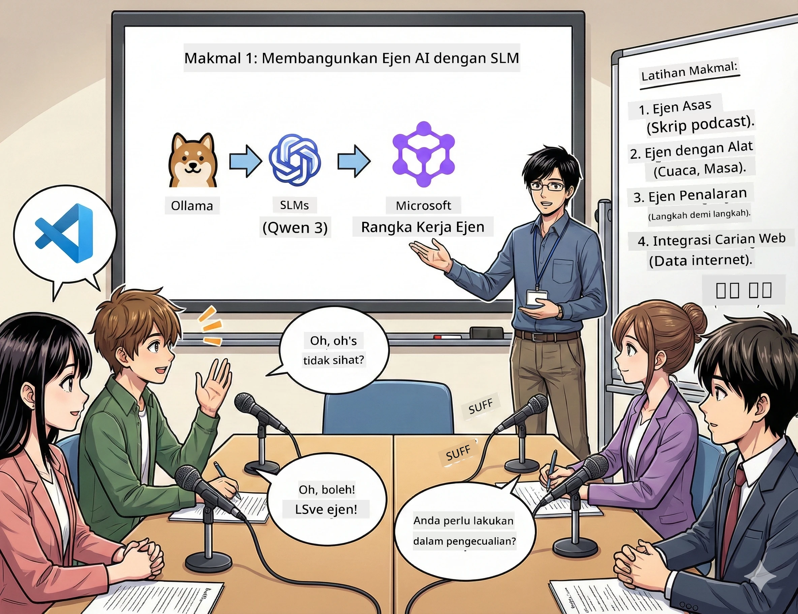

<!--
CO_OP_TRANSLATOR_METADATA:
{
  "original_hash": "21779ce57b388adecb26881a35d9cbcf",
  "translation_date": "2026-01-05T16:57:30+00:00",
  "source_file": "WorkshopForAgentic/translation/zh-cn/01.BuildAIAgentWithSLM.md",
  "language_code": "ms"
}
-->
# Bab 1: Kenali Pembantu Penyelidikan AI Anda 🤖

## Cabaran

Anda sedang melancarkan "Future Bytes", podcast teknologi baru anda. Episod pertama adalah mengenai penemuan AI terkini, tetapi anda hanya mempunyai 24 jam untuk:
1. Menyelidik topik
2. Mencari sumber yang boleh dipercayai
3. Menulis skrip yang menarik
4. Membuatnya terdengar semula jadi

**Pusingan cerita**: Anda tidak perlu melakukannya seorang diri. Anda akan membina pembantu AI pertama anda yang boleh membantu melakukan semua ini. Mari kita panggil dia Alex — rakan penyelidik anda yang tidak pernah letih, tidak pernah tidur.

## Kenapa pilih model bahasa kecil? (Spoiler: Mereka hebat)

Bayangkan model bahasa kecil (SLM) sebagai AI peribadi yang berjalan di *komputer anda*. Tiada awan, tiada bayaran bulanan, tiada perkongsian data yang meragukan.

**Kenapa SLM sangat🔥:**
- **🏠 Berjalan di mesin anda**: komputer riba, desktop, malah Raspberry Pi berkuasa tinggi
- **💸 Kos operasi sifar**: tiada bayaran API yang membazir wang anda
- **🔒 Prioriti privasi**: data anda tidak pernah keluar dari peranti anda
- **⚡ Sangat pantas**: tiada kelewatan rangkaian, respons segera
- **🪦 Ringan**: 1-10 bilion parameter berbanding model besar 100 bilion+

**SLM popular**: Qwen 3, Phi-4, Gemma 3 (workshop ini guna Qwen)

## Set Alat Anda

### Ollama: Pengurus Model AI Anda

[Ollama](https://ollama.com/) ibarat Steam untuk model AI. Muat turun, jalankan dan urus model dengan arahan mudah.

**Apa yang hebat:**
- Muat turun & jalankan mana-mana model dengan satu arahan
- Sokong Mac, Windows, Linux
- Automatik guna GPU jika ada
- Jimat memori sangat tinggi

### Rangka Kerja Agen Microsoft: Tempat Sihir Berlaku

[Rangka Kerja Agen Microsoft](https://github.com/microsoft/agent-framework) adalah gelanggang anda untuk membina agen AI pintar yang boleh:

- 💬 Bersembang dan ingat apa yang dibincangkan
- 🛠️ Gunakan alatan tersuai (seperti carian web atau semak cuaca)
- 🧠 Fikirkan masalah kompleks secara berperingkat
- 🤝 Kerjasama sebagai pasukan dengan agen lain
- 🔌 Sambung ke pembekal AI berbeza (OpenAI, Ollama, Azure)

**Modul pembinaan:**
- **Agen (Agents)**: pembantu AI yang mempunyai tugas tertentu
- **Alatan (Tools)**: keupayaan khas yang anda berikan
- **Memori (Memory)**: supaya mereka tidak lupa perbualan anda
- **Penalaran (Reasoning)**: ajar mereka berfikir, bukan hanya membalas

## Montaj Latihan Anda: 4 Tugas

### Tugasan 1: Cipta Agen Pintar Pertama Anda

📓 [Buka Notebook](../../code/01.BasicAgent/00.BasicAgent-agent.ipynb)

**Tugasan**: Bina Alex, AI penulis skrip podcast anda. Alex perlu menghasilkan dialog dua hos membincangkan topik teknologi.

**Anda akan belajar:**
- Cara menghidupkan agen AI (lebih mudah daripada bangun Isnin pagi)
- Berikan personaliti dan arahan
- Biarkan dia hasilkan skrip podcast yang asli
- Fahami jawapan yang diberikan

**Kriteria kejayaan**: Alex cipta skrip untuk episod percubaan "Future Bytes" tentang AI! 🎯

### Tugasan 2: Beri Alex Kuasa Super (Alatan!)

📓 [Buka Notebook](../../code/01.BasicAgent/01.BasicAgent-tools.ipynb)

**Tugasan**: Alex pintar, tapi dia tak tahu cuaca hari ini atau pukul berapa sekarang. Mari beri dia alatan untuk selesaikan masalah itu!

**Anda akan belajar:**
- Cipta fungsi Python tersuai sebagai "alat"
- Biarkan Alex tentukan *bila* nak guna alat yang mana
- Saksikan penyelesaian masalah secara bebas
- Gabungkan beberapa alat untuk tugas yang kompleks

**Kriteria kejayaan**: Tanya "Bagaimana cuaca di Tokyo?" Alex akan cari jawapannya sendiri! ☁️

### Tugasan 3: Ajar Alex Berfikir

📓 [Buka Notebook](../../code/01.BasicAgent/02.BasicAgent-reasoning.ipynb)

**Tugasan**: Biar Alex tunjukkan proses kerjanya. Dalam menyelesaikan masalah, anda mahu lihat *bagaimana* dia berfikir, bukan hanya jawapan.

**Anda akan belajar:**
- Aktifkan "mod penalaran" (seperti tunjukkan kerja di kelas matematik)
- Lihat proses pemikiran langkah demi langkah Alex
- Fahami petunjuk rantai pemikiran
- Perbaiki apabila Alex keliru

**Kriteria kejayaan**: Tanya soalan matematik susah dan lihat Alex berfikir! 🧠

### Tugasan 4: Sambungkan Alex ke Internet

📓 [Buka Notebook](../../code/01.BasicAgent/03.BasicAgent-websearch.ipynb)

**Tugasan**: Pengetahuan Alex ada tarikh tamat. Sambungkan dia ke internet untuk maklumat masa nyata!

**Anda akan belajar:**
- Bina alat carian web tersuai
- Integrasi API luaran
- Tangani ralat rangkaian dengan elegan
- Dapatkan maklumat melebihi data latihan Alex

**Kriteria kejayaan**: Tanyakan berita teknologi hari ini dan dapatkan hasil terkini! 📰

## Sebelum Mula 🚀

**Peralatan diperlukan**:
- Python 3.10+ dipasang
- Ollama berjalan (semak dengan `ollama --version`)
- VS Code dengan sambungan Python
- Minimum 8GB RAM (16GB untuk pengalaman lancar)

## Urutan Tugasan

Lengkapkan notebook secara berurutan untuk pengalaman penuh:

1. [00.BasicAgent-agent.ipynb](../../code/01.BasicAgent/00.BasicAgent-agent.ipynb) —— Kenali Alex (agen pertama anda)
2. [01.BasicAgent-tools.ipynb](../../code/01.BasicAgent/01.BasicAgent-tools.ipynb) —— Masa peningkatan!
3. [02.BasicAgent-reasoning.ipynb](../../code/01.BasicAgent/02.BasicAgent-reasoning.ipynb) —— Ajar Alex berfikir
4. [03.BasicAgent-websearch.ipynb](../../code/01.BasicAgent/03.BasicAgent-websearch.ipynb) —— Buka akses internet!

## Apa yang Anda Akan Kuasai

Selepas Bab 1, anda boleh:

- ✅ Menjalankan model AI pada perkakasan anda sendiri (tanpa awan!)
- ✅ Membina agen dengan personaliti dan kemahiran tersuai
- ✅ Beri agen alatan untuk selesaikan masalah sebenar
- ✅ Biarkan agen menunjukkan proses penalaran mereka
- ✅ Sambungkan agen ke sumber data luaran
- ✅ Baiki apabila berlaku masalah

## Apabila Ada Masalah (dan Cara Memperbaiki) 🔧

### "Alex tak boleh dimuat! Memori tidak cukup!"
**Penyelesaian**: Komputer anda sedang terbeban. Cuba tutup aplikasi lain atau tukar ke model yang lebih kecil. 8GB RAM adalah minimum.

### "Alex terlalu perlahan"
**Penyelesaian**: Aktifkan pecut GPU di tetapan Ollama. Atau kecilkan saiz tetingkap konteks. Mod pelarian aktif! 🏎️

### "Alatan tidak berfungsi!"
**Penyelesaian**: Semak tanda tangan fungsi anda dengan teliti. Alex perlukan petunjuk jenis tepat untuk faham fungsi alat tersebut. Anggap ia seperti arahan yang jelas.

## Pautan Berguna 🔗

- [Dokumentasi Agent Framework](https://github.com/microsoft/agent-framework) —— panduan rasmi dan contoh
- [Perpustakaan Model Ollama](https://ollama.com/library) —— semak semua model tersedia
- [Model Qwen](https://ollama.com/library/qwen3) —— kenali otak pembantu AI anda
- [Contoh Kod](https://github.com/microsoft/agent-framework/tree/main/python/samples) —— curi idea dari sini

## Langkah Seterusnya: Bab 2 🎬

Anda ada satu agen. Tapi bagaimana jika anda ada *pasukan* agen bekerjasama? Dalam Bab 2, anda akan bina pasukan produksi podcast lengkap:
- **Agen penyelidik**: cari sumber terbaik
- **Agen penulis**: hasilkan skrip sempurna
- **Editor (anda!)**: lulus atau minta perubahan

Mari kita atur sedikit sihir AI!→ [Bab 2: Bentuk Pasukan Produksi Anda](02.AIAgentOrchestrationAndWorkflows.md)

---

**Tersangkut?** Tanyalah semasa workshop. Kita belajar bersama! 🙌

---

<!-- CO-OP TRANSLATOR DISCLAIMER START -->
**Penafian**:  
Dokumen ini telah diterjemahkan menggunakan perkhidmatan terjemahan AI [Co-op Translator](https://github.com/Azure/co-op-translator). Walaupun kami berusaha untuk memastikan ketepatan, sila ambil perhatian bahawa terjemahan automatik mungkin mengandungi kesilapan atau ketidaktepatan. Dokumen asal dalam bahasa asalnya hendaklah dianggap sebagai sumber rujukan yang sahih. Untuk maklumat penting, terjemahan oleh manusia profesional adalah disyorkan. Kami tidak bertanggungjawab atas sebarang salah faham atau salah tafsir yang timbul daripada penggunaan terjemahan ini.
<!-- CO-OP TRANSLATOR DISCLAIMER END -->