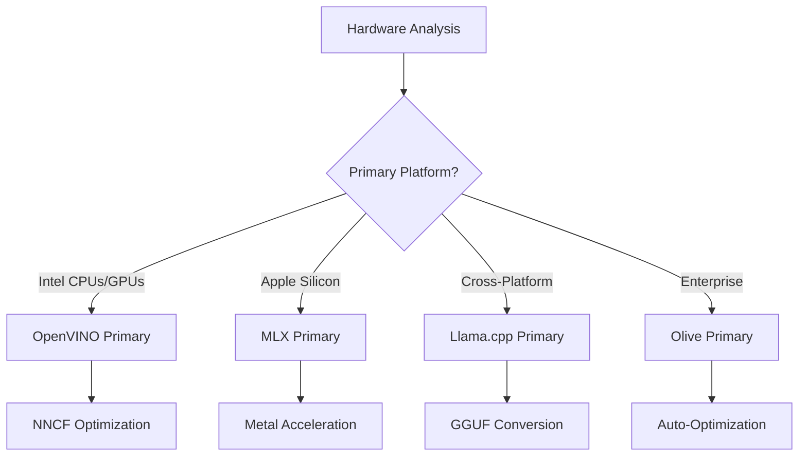
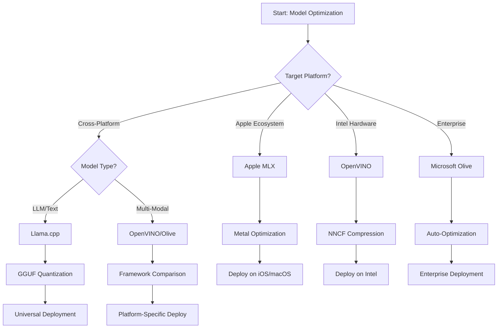
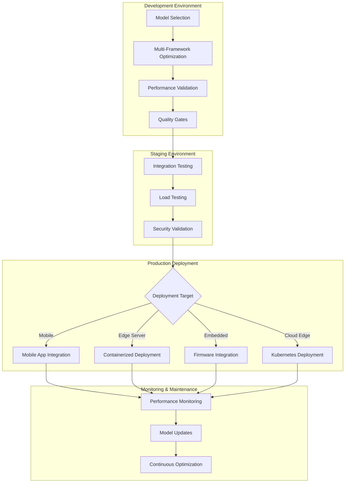

<!--
CO_OP_TRANSLATOR_METADATA:
{
  "original_hash": "6fbccc3e9d5911e3df32090724daac13",
  "translation_date": "2025-10-30T15:10:10+00:00",
  "source_file": "Module04/06.workflow-synthesis.md",
  "language_code": "my"
}
-->
# အပိုင်း ၆: Edge AI ဖွံ့ဖြိုးတိုးတက်မှုလုပ်ငန်းစဉ်များကို စုစည်းခြင်း

## အကြောင်းအရာများ
1. [မိတ်ဆက်](../../../Module04)
2. [သင်ယူရမည့်ရည်ရွယ်ချက်များ](../../../Module04)
3. [လုပ်ငန်းစဉ်များကို စုစည်းခြင်း](../../../Module04)
4. [Framework ရွေးချယ်မှု မက်ထရစ်](../../../Module04)
5. [အကောင်းဆုံးအလေ့အကျင့်များကို စုစည်းခြင်း](../../../Module04)
6. [Deployment မဟာဗျူဟာလမ်းညွှန်](../../../Module04)
7. [စွမ်းဆောင်ရည်တိုးတက်မှုလုပ်ငန်းစဉ်](../../../Module04)
8. [ထုတ်လုပ်မှုအဆင်သင့် စစ်ဆေးစာရင်း](../../../Module04)
9. [ပြဿနာဖြေရှင်းခြင်းနှင့် စောင့်ကြည့်ခြင်း](../../../Module04)
10. [Edge AI Pipeline ကို အနာဂတ်အတွက် ပြင်ဆင်ခြင်း](../../../Module04)

## မိတ်ဆက်

Edge AI ဖွံ့ဖြိုးတိုးတက်မှုသည် အများပြည်သူ optimization frameworks, deployment မဟာဗျူဟာများနှင့် hardware အခြေအနေများကို နားလည်မှုအဆင့်မြင့်တစ်ခုလိုအပ်သည်။ Llama.cpp, Microsoft Olive, OpenVINO, Apple MLX တို့မှ သိရှိမှုများကို စုစည်းပြီး အကျိုးရှိစွာအသုံးချနိုင်သော workflow တစ်ခုကို ဖန်တီးရန် ဒီအပိုင်းတွင် စုစည်းထားသည်။

ဒီသင်တန်းတစ်ခုလုံးအတွင်းမှာ optimization frameworks တစ်ခုချင်းစီ၏ အားသာချက်များနှင့် အထူးအသုံးပြုမှုများကို လေ့လာခဲ့ကြသည်။ သို့သော် အမှန်တကယ် Edge AI ပရောဂျက်များတွင် frameworks များစွာမှ နည်းလမ်းများကို ပေါင်းစပ်အသုံးပြုရန် သို့မဟုတ် အကန့်အသတ်များနှင့် လိုအပ်ချက်များအတွက် အကောင်းဆုံးရလဒ်များကို ပေးစွမ်းနိုင်မည့် နည်းလမ်းများကို ရွေးချယ်ရန် လိုအပ်သည်။

ဒီအပိုင်းတွင် frameworks များမှ သိရှိမှုများကို စနစ်တကျ workflows, ဆုံးဖြတ်ချက်ပုံစံများနှင့် အကောင်းဆုံးအလေ့အကျင့်များအဖြစ် စုစည်းထားပြီး Edge AI ဖြေရှင်းချက်များကို ထုတ်လုပ်မှုအဆင့်သို့ အကျိုးရှိစွာတိုးတက်စေမည့် လမ်းညွှန်ကို ပေးထားသည်။ မိုဘိုင်း device, embedded systems, edge servers များအတွက် optimization လုပ်ရန်ဖြစ်စေ၊ ဒီလမ်းညွှန်သည် သင်၏ဖွံ့ဖြိုးတိုးတက်မှုအလှည့်ကျစဉ်အတွင်း ဆုံးဖြတ်ချက်များကို အကျိုးရှိစွာလုပ်ဆောင်ရန် မဟာဗျူဟာ framework ကို ပေးစွမ်းသည်။

## သင်ယူရမည့်ရည်ရွယ်ချက်များ

ဒီအပိုင်းအဆုံးတွင် သင်သည် အောက်ပါများကို လုပ်ဆောင်နိုင်မည်ဖြစ်သည်-

### မဟာဗျူဟာဆိုင်ရာ ဆုံးဖြတ်ချက်လုပ်ခြင်း
- **Project လိုအပ်ချက်များ**, hardware အကန့်အသတ်များနှင့် deployment အခြေအနေများအပေါ် အခြေခံ၍ အကောင်းဆုံး optimization framework ကို **အကဲဖြတ်ပြီး ရွေးချယ်နိုင်ခြင်း**
- **Optimization နည်းလမ်းများစွာကို ပေါင်းစပ်ထားသော workflows** ကို **ဒီဇိုင်းဆွဲနိုင်ခြင်း**
- Framework များအကြား model တိကျမှု, inference အမြန်နှုန်း, memory အသုံးပြုမှုနှင့် deployment အခက်အခဲများအကြား **အကျိုးဆက်များကို အကဲဖြတ်နိုင်ခြင်း**

### Workflow ပေါင်းစည်းခြင်း
- Framework များ၏အားသာချက်များကို အသုံးချသော **Unified Development Pipelines** ကို **အကောင်အထည်ဖော်နိုင်ခြင်း**
- **Model Optimization နှင့် Deployment** ကို **ပတ်ဝန်းကျင်များအတွင်း တူညီမှုရှိစွာ ပြုလုပ်နိုင်သော workflows** ဖန်တီးခြင်း
- **Optimized Models** များသည် ထုတ်လုပ်မှုလိုအပ်ချက်များနှင့် ကိုက်ညီမှုရှိစေရန် **အရည်အသွေးစစ်ဆေးမှုများ** ထူထောင်ခြင်း

### စွမ်းဆောင်ရည်တိုးတက်မှု
- Quantization, pruning, hardware-specific acceleration နည်းလမ်းများကို အသုံးပြု၍ **စနစ်တကျ optimization များကို လုပ်ဆောင်နိုင်ခြင်း**
- **Optimization အဆင့်များနှင့် Deployment ရည်မှန်းချက်များအတွင်း** Model စွမ်းဆောင်ရည်ကို **စောင့်ကြည့်ပြီး အကဲဖြတ်နိုင်ခြင်း**
- CPU, GPU, NPU နှင့် edge accelerators အထူးပြု hardware platform များအတွက် **Optimization လုပ်ဆောင်နိုင်ခြင်း**

### ထုတ်လုပ်မှု Deployment
- **Model Formats နှင့် Inference Engines များစွာကို ထည့်သွင်းထားသော Scalable Deployment Architectures** ကို **ဒီဇိုင်းဆွဲနိုင်ခြင်း**
- **Production Environments** တွင် Edge AI Applications များအတွက် **Monitoring နှင့် Observability** ကို **အကောင်အထည်ဖော်နိုင်ခြင်း**
- Model Updates, စွမ်းဆောင်ရည်စောင့်ကြည့်မှုနှင့် System Optimization များအတွက် **Maintenance Workflows** ထူထောင်ခြင်း

### Cross-Platform အထူးပြုမှု
- **Hardware Platforms များစွာတွင် Optimized Models များကို Deployment လုပ်နိုင်ခြင်း**၊ စွမ်းဆောင်ရည်တူညီမှုရှိစေရန်
- Windows, macOS, Linux, mobile နှင့် embedded systems များအတွက် **Platform-Specific Optimizations** ကို ကိုင်တွယ်နိုင်ခြင်း
- **Edge Environments များအတွင်း Seamless Deployment** ကို အကောင်အထည်ဖော်နိုင်သော **Abstraction Layers** ဖန်တီးခြင်း

## Unified Workflow Overview

### အဆင့် ၁: လိုအပ်ချက်များအကဲဖြတ်ခြင်းနှင့် Framework ရွေးချယ်ခြင်း

Edge AI Deployment အောင်မြင်မှု၏ အခြေခံသည် Framework ရွေးချယ်မှုနှင့် Optimization Strategy ကို သတ်မှတ်ပေးသော လိုအပ်ချက်များအကဲဖြတ်မှုဖြင့် စတင်သည်။

#### ၁.၁ Hardware အကဲဖြတ်ခြင်း


**အဓိကစဉ်းစားရန်များ:**
- **CPU Architecture**: x86, ARM, Apple Silicon အစွမ်းသတ္တိများ
- **Accelerator ရှိမှု**: GPU, NPU, VPU, AI Chips အထူးပြု
- **Memory အကန့်အသတ်များ**: RAM အကန့်အသတ်များ, Storage စွမ်းဆောင်ရည်
- **Power Budget**: Battery အသက်, Thermal အကန့်အသတ်များ
- **Connectivity**: Offline လိုအပ်ချက်များ, Bandwidth အကန့်အသတ်များ

#### ၁.၂ Application လိုအပ်ချက် မက်ထရစ်

| လိုအပ်ချက် | Llama.cpp | Microsoft Olive | OpenVINO | Apple MLX |
|-------------|-----------|-----------------|----------|-----------|
| Cross-platform | ✅ အလွန်ကောင်း | ⚡ ကောင်း | ⚡ ကောင်း | ❌ Apple အတွက်သာ |
| Enterprise Integration | ⚡ အခြေခံ | ✅ အလွန်ကောင်း | ✅ အလွန်ကောင်း | ⚡ အကန့်အသတ်ရှိ |
| Mobile Deployment | ✅ အလွန်ကောင်း | ⚡ ကောင်း | ⚡ ကောင်း | ✅ iOS အတွက် အလွန်ကောင်း |
| Real-time Inference | ✅ အလွန်ကောင်း | ✅ အလွန်ကောင်း | ✅ အလွန်ကောင်း | ✅ အလွန်ကောင်း |
| Model Diversity | ✅ LLM အထူးပြု | ✅ Model အားလုံး | ✅ Model အားလုံး | ✅ LLM အထူးပြု |
| Ease of Use | ✅ ရိုးရှင်း | ✅ အလိုအလျောက် | ⚡ အလယ်အလတ် | ✅ ရိုးရှင်း |

### အဆင့် ၂: Model ပြင်ဆင်ခြင်းနှင့် Optimization

#### ၂.၁ Universal Model အကဲဖြတ်မှု Pipeline

```python
# Universal Model Assessment Framework
class EdgeAIModelAssessment:
    def __init__(self, model_path, target_hardware):
        self.model_path = model_path
        self.target_hardware = target_hardware
        self.optimization_frameworks = []
        
    def assess_model_characteristics(self):
        """Analyze model size, architecture, and complexity"""
        return {
            'model_size': self.get_model_size(),
            'parameter_count': self.get_parameter_count(),
            'architecture_type': self.detect_architecture(),
            'quantization_compatibility': self.check_quantization_support()
        }
    
    def recommend_optimization_strategy(self):
        """Recommend optimal frameworks and techniques"""
        characteristics = self.assess_model_characteristics()
        
        if self.target_hardware.startswith('apple'):
            return self.mlx_optimization_strategy(characteristics)
        elif self.target_hardware.startswith('intel'):
            return self.openvino_optimization_strategy(characteristics)
        elif characteristics['model_size'] > 7_000_000_000:  # 7B+ parameters
            return self.enterprise_optimization_strategy(characteristics)
        else:
            return self.lightweight_optimization_strategy(characteristics)
```

#### ၂.၂ Multi-Framework Optimization Pipeline

**Sequential Optimization Approach:**
1. **Initial Conversion**: ONNX အဖြစ် Intermediate Format သို့ ပြောင်းလဲခြင်း
2. **Framework-Specific Optimization**: အထူးပြုနည်းလမ်းများကို အသုံးပြုခြင်း
3. **Cross-Validation**: Target Platforms များအတွင်း စွမ်းဆောင်ရည်ကို အတည်ပြုခြင်း
4. **Final Packaging**: Deployment အတွက် ပြင်ဆင်ခြင်း

```bash
# Multi-Framework Optimization Script
#!/bin/bash

MODEL_NAME="phi-3-mini"
BASE_MODEL="microsoft/Phi-3-mini-4k-instruct"

# Phase 1: ONNX Conversion (Universal)
python convert_to_onnx.py --model $BASE_MODEL --output models/onnx/

# Phase 2: Platform-Specific Optimization
if [[ "$TARGET_PLATFORM" == "intel" ]]; then
    # OpenVINO Optimization
    python optimize_openvino.py --input models/onnx/ --output models/openvino/
elif [[ "$TARGET_PLATFORM" == "apple" ]]; then
    # MLX Optimization
    python optimize_mlx.py --input $BASE_MODEL --output models/mlx/
elif [[ "$TARGET_PLATFORM" == "cross" ]]; then
    # Llama.cpp Optimization
    python convert_to_gguf.py --input models/onnx/ --output models/gguf/
fi

# Phase 3: Validation
python validate_optimization.py --original $BASE_MODEL --optimized models/$TARGET_PLATFORM/
```

### အဆင့် ၃: စွမ်းဆောင်ရည်အတည်ပြုခြင်းနှင့် Benchmarking

#### ၃.၁ Comprehensive Benchmarking Framework

```python
class EdgeAIBenchmark:
    def __init__(self, optimized_models):
        self.models = optimized_models
        self.metrics = {
            'inference_time': [],
            'memory_usage': [],
            'accuracy_score': [],
            'throughput': [],
            'energy_consumption': []
        }
    
    def run_comprehensive_benchmark(self):
        """Execute standardized benchmarks across all optimized models"""
        test_inputs = self.generate_test_inputs()
        
        for model_framework, model_path in self.models.items():
            print(f"Benchmarking {model_framework}...")
            
            # Latency Testing
            latency = self.measure_inference_latency(model_path, test_inputs)
            
            # Memory Profiling
            memory = self.profile_memory_usage(model_path)
            
            # Accuracy Validation
            accuracy = self.validate_model_accuracy(model_path, test_inputs)
            
            # Throughput Analysis
            throughput = self.measure_throughput(model_path)
            
            self.record_metrics(model_framework, latency, memory, accuracy, throughput)
    
    def generate_optimization_report(self):
        """Create comprehensive comparison report"""
        report = {
            'recommendations': self.analyze_performance_trade_offs(),
            'deployment_guidance': self.generate_deployment_recommendations(),
            'monitoring_requirements': self.define_monitoring_metrics()
        }
        return report
```

## Framework ရွေးချယ်မှု မက်ထရစ်

### Framework ရွေးချယ်မှု ဆုံးဖြတ်ချက်ပုံစံ



### Comprehensive ရွေးချယ်မှုအခြေခံချက်များ

#### ၁. Primary Use Case Alignment

**Large Language Models (LLMs):**
- **Llama.cpp**: CPU အထူးပြု, Cross-platform Deployment အတွက် အကောင်းဆုံး
- **Apple MLX**: Apple Silicon အတွက် Memory ပေါင်းစည်းမှုနှင့် အကောင်းဆုံး
- **OpenVINO**: Intel Hardware အတွက် NNCF Optimization ဖြင့် အလွန်ကောင်း
- **Microsoft Olive**: Enterprise Workflows အတွက် Automation ဖြင့် အကောင်းဆုံး

**Multi-Modal Models:**
- **OpenVINO**: Vision, Audio, Text အတွက် Comprehensive Support
- **Microsoft Olive**: Enterprise-grade Optimization အတွက် အလွန်ကောင်း
- **Llama.cpp**: Text-based Models အတွက် အကန့်အသတ်ရှိ
- **Apple MLX**: Multi-modal Applications အတွက် တိုးတက်မှုရှိ

#### ၂. Hardware Platform Matrix

| Platform | Primary Framework | Secondary Option | Specialized Features |
|----------|------------------|------------------|---------------------|
| Intel CPU/GPU | OpenVINO | Microsoft Olive | NNCF Compression, Intel Optimization |
| NVIDIA GPU | Microsoft Olive | OpenVINO | CUDA Acceleration, Enterprise Features |
| Apple Silicon | Apple MLX | Llama.cpp | Metal Shaders, Unified Memory |
| ARM Mobile | Llama.cpp | OpenVINO | Cross-platform, Minimal Dependencies |
| Edge TPU | OpenVINO | Microsoft Olive | Specialized Accelerator Support |
| Embedded ARM | Llama.cpp | OpenVINO | Minimal Footprint, Efficient Inference |

#### ၃. Development Workflow Preferences

**Rapid Prototyping:**
1. **Llama.cpp**: Setup အမြန်ဆုံး, ရလဒ်ချက်ချင်းရ
2. **Apple MLX**: Python API ရိုးရှင်းမှု, Iteration အမြန်
3. **Microsoft Olive**: Automated Optimization, Configuration အနည်းဆုံး
4. **OpenVINO**: Setup အခက်အခဲရှိ, Comprehensive Features

**Enterprise Production:**
1. **Microsoft Olive**: Enterprise Features, Azure Integration
2. **OpenVINO**: Intel Ecosystem, Comprehensive Tools
3. **Apple MLX**: Apple-specific Enterprise Applications
4. **Llama.cpp**: Deployment ရိုးရှင်း, Enterprise Features အကန့်အသတ်ရှိ

## အကောင်းဆုံးအလေ့အကျင့်များကို စုစည်းခြင်း

### Universal Optimization Principles

#### ၁. Progressive Optimization Strategy

```python
class ProgressiveOptimization:
    def __init__(self, base_model):
        self.base_model = base_model
        self.optimization_stages = [
            'baseline_measurement',
            'format_conversion',
            'quantization_optimization',
            'hardware_acceleration',
            'production_validation'
        ]
    
    def execute_progressive_optimization(self):
        """Apply optimization techniques incrementally"""
        
        # Stage 1: Baseline Measurement
        baseline_metrics = self.measure_baseline_performance()
        
        # Stage 2: Format Conversion
        converted_model = self.convert_to_optimal_format()
        conversion_metrics = self.measure_performance(converted_model)
        
        # Stage 3: Quantization
        quantized_model = self.apply_quantization(converted_model)
        quantization_metrics = self.measure_performance(quantized_model)
        
        # Stage 4: Hardware Acceleration
        accelerated_model = self.enable_hardware_acceleration(quantized_model)
        acceleration_metrics = self.measure_performance(accelerated_model)
        
        # Stage 5: Validation
        production_ready = self.validate_for_production(accelerated_model)
        
        return self.compile_optimization_report(
            baseline_metrics, conversion_metrics, 
            quantization_metrics, acceleration_metrics
        )
```

#### ၂. Quality Gate Implementation

**Accuracy Preservation Gates:**
- Original Model Accuracy ၏ ၉၅% ထက်ပိုမိုထိန်းသိမ်းထားခြင်း
- Representative Test Datasets များနှင့် Validate လုပ်ခြင်း
- Production Validation အတွက် A/B Testing ပြုလုပ်ခြင်း

**Performance Improvement Gates:**
- အနည်းဆုံး ၂ ဆ အမြန်နှုန်းတိုးတက်မှုရရှိခြင်း
- Memory Footprint ကို ၅၀% အနည်းဆုံးလျှော့ချခြင်း
- Inference Time တိကျမှုကို Validate လုပ်ခြင်း

**Production Readiness Gates:**
- Load အောက် Stress Testing ဖြတ်ကျော်ခြင်း
- အချိန်ကြာမြင့်စွမ်းဆောင်ရည်တည်ငြိမ်မှုကို ပြသခြင်း
- Security နှင့် Privacy လိုအပ်ချက်များကို Validate လုပ်ခြင်း

### Framework-Specific Best Practices Integration

#### ၁. Quantization Strategy Synthesis

```python
# Unified Quantization Approach
class UnifiedQuantizationStrategy:
    def __init__(self, model, target_platform):
        self.model = model
        self.platform = target_platform
        
    def select_optimal_quantization(self):
        """Choose best quantization based on platform and requirements"""
        
        if self.platform == 'apple_silicon':
            return self.mlx_quantization_strategy()
        elif self.platform == 'intel_hardware':
            return self.openvino_quantization_strategy()
        elif self.platform == 'cross_platform':
            return self.llamacpp_quantization_strategy()
        else:
            return self.olive_quantization_strategy()
    
    def mlx_quantization_strategy(self):
        """Apple MLX-specific quantization"""
        return {
            'method': 'mlx_quantize',
            'precision': 'int4',
            'group_size': 64,
            'optimization_target': 'unified_memory'
        }
    
    def openvino_quantization_strategy(self):
        """OpenVINO NNCF quantization"""
        return {
            'method': 'nncf_quantize',
            'precision': 'int8',
            'calibration_method': 'post_training',
            'optimization_target': 'intel_hardware'
        }
```

#### ၂. Hardware Acceleration Optimization

**CPU Optimization Synthesis:**
- **SIMD Instructions**: Framework များအတွင်း Optimized Kernels အသုံးပြုခြင်း
- **Memory Bandwidth**: Cache Efficiency အတွက် Data Layouts ကို Optimize လုပ်ခြင်း
- **Threading**: Parallelism ကို Resource အကန့်အသတ်များနှင့် Balance လုပ်ခြင်း

**GPU Acceleration Best Practices:**
- **Batch Processing**: Batch Size သင့်တော်မှုဖြင့် Throughput တိုးမြှင့်ခြင်း
- **Memory Management**: GPU Memory Allocation နှင့် Transfers ကို Optimize လုပ်ခြင်း
- **Precision**: FP16 ကို Support ရှိပါက စွမ်းဆောင်ရည်တိုးတက်မှုအတွက် အသုံးပြုခြင်း

**NPU/Specialized Accelerator Optimization:**
- **Model Architecture**: Accelerator စွမ်းဆောင်ရည်နှင့် ကိုက်ညီမှုရှိစေရန် အတည်ပြုခြင်း
- **Data Flow**: Accelerator Efficiency အတွက် Input/Output Pipelines ကို Optimize လုပ်ခြင်း
- **Fallback Strategies**: Unsupported Operations များအတွက် CPU Fallback ကို အကောင်အထည်ဖော်ခြင်း

## Deployment Strategy Guide

### Universal Deployment Architecture



### Platform-Specific Deployment Patterns

#### ၁. Mobile Deployment Strategy

```yaml
# Mobile Deployment Configuration
mobile_deployment:
  ios:
    framework: apple_mlx
    optimization:
      quantization: int4
      memory_mapping: true
      background_execution: limited
    packaging:
      format: mlx
      bundle_size: <50MB
      
  android:
    framework: llama_cpp
    optimization:
      quantization: q4_k_m
      threading: android_optimized
      memory_management: conservative
    packaging:
      format: gguf
      apk_size: <100MB
      
  cross_platform:
    framework: onnx_runtime
    optimization:
      quantization: int8
      execution_provider: cpu
    packaging:
      format: onnx
      shared_libraries: minimal
```

#### ၂. Edge Server Deployment

```yaml
# Edge Server Deployment Configuration
edge_server:
  intel_based:
    framework: openvino
    optimization:
      quantization: int8
      acceleration: cpu_gpu_auto
      batch_processing: dynamic
    deployment:
      container: openvino_runtime
      orchestration: kubernetes
      scaling: horizontal
      
  nvidia_based:
    framework: microsoft_olive
    optimization:
      quantization: int4
      acceleration: cuda
      tensor_parallelism: true
    deployment:
      container: nvidia_triton
      orchestration: kubernetes
      scaling: gpu_aware
```

### Containerization Best Practices

```dockerfile
# Multi-Framework Edge AI Container
FROM ubuntu:22.04 as base

# Install common dependencies
RUN apt-get update && apt-get install -y \
    python3 \
    python3-pip \
    build-essential \
    cmake \
    && rm -rf /var/lib/apt/lists/*

# Framework-specific stages
FROM base as openvino
RUN pip install openvino nncf optimum[intel]

FROM base as llamacpp
RUN git clone https://github.com/ggerganov/llama.cpp.git \
    && cd llama.cpp && make LLAMA_OPENBLAS=1

FROM base as olive
RUN pip install olive-ai[auto-opt] onnxruntime-genai

# Production stage with selected framework
FROM openvino as production
COPY models/ /app/models/
COPY src/ /app/src/
WORKDIR /app

EXPOSE 8080
CMD ["python3", "src/inference_server.py"]
```

## စွမ်းဆောင်ရည်တိုးတက်မှုလုပ်ငန်းစဉ်

### Systematic Performance Tuning

#### ၁. Performance Profiling Pipeline

```python
class EdgeAIPerformanceProfiler:
    def __init__(self, model_path, framework):
        self.model_path = model_path
        self.framework = framework
        self.profiling_results = {}
    
    def comprehensive_profiling(self):
        """Execute comprehensive performance analysis"""
        
        # CPU Profiling
        cpu_profile = self.profile_cpu_usage()
        
        # Memory Profiling
        memory_profile = self.profile_memory_usage()
        
        # Inference Latency
        latency_profile = self.profile_inference_latency()
        
        # Throughput Analysis
        throughput_profile = self.profile_throughput()
        
        # Energy Consumption (where available)
        energy_profile = self.profile_energy_consumption()
        
        return self.compile_performance_report(
            cpu_profile, memory_profile, latency_profile,
            throughput_profile, energy_profile
        )
    
    def identify_bottlenecks(self):
        """Automatically identify performance bottlenecks"""
        bottlenecks = []
        
        if self.profiling_results['cpu_utilization'] > 80:
            bottlenecks.append('cpu_bound')
        
        if self.profiling_results['memory_usage'] > 90:
            bottlenecks.append('memory_bound')
        
        if self.profiling_results['inference_variance'] > 20:
            bottlenecks.append('inconsistent_performance')
        
        return self.generate_optimization_recommendations(bottlenecks)
```

#### ၂. Automated Optimization Pipeline

```python
class AutomatedOptimizationPipeline:
    def __init__(self, base_model, target_constraints):
        self.base_model = base_model
        self.constraints = target_constraints
        self.optimization_history = []
    
    def execute_optimization_search(self):
        """Systematically search optimization space"""
        
        optimization_candidates = [
            {'quantization': 'int8', 'pruning': 0.1},
            {'quantization': 'int4', 'pruning': 0.2},
            {'quantization': 'int8', 'acceleration': 'gpu'},
            {'quantization': 'int4', 'acceleration': 'npu'}
        ]
        
        best_configuration = None
        best_score = 0
        
        for config in optimization_candidates:
            optimized_model = self.apply_optimization(config)
            score = self.evaluate_optimization(optimized_model)
            
            if score > best_score and self.meets_constraints(optimized_model):
                best_score = score
                best_configuration = config
            
            self.optimization_history.append({
                'config': config,
                'score': score,
                'model': optimized_model
            })
        
        return best_configuration, self.optimization_history
```

### Multi-Objective Optimization

#### ၁. Pareto Optimization for Edge AI

```python
class ParetoOptimization:
    def __init__(self, objectives=['speed', 'accuracy', 'memory']):
        self.objectives = objectives
        self.pareto_frontier = []
    
    def find_pareto_optimal_solutions(self, optimization_results):
        """Identify Pareto-optimal configurations"""
        
        for result in optimization_results:
            is_dominated = False
            
            for frontier_point in self.pareto_frontier:
                if self.dominates(frontier_point, result):
                    is_dominated = True
                    break
            
            if not is_dominated:
                # Remove dominated points from frontier
                self.pareto_frontier = [
                    point for point in self.pareto_frontier 
                    if not self.dominates(result, point)
                ]
                
                self.pareto_frontier.append(result)
        
        return self.pareto_frontier
    
    def recommend_configuration(self, user_preferences):
        """Recommend configuration based on user preferences"""
        
        weighted_scores = []
        for config in self.pareto_frontier:
            score = sum(
                user_preferences[obj] * config['metrics'][obj] 
                for obj in self.objectives
            )
            weighted_scores.append((score, config))
        
        return max(weighted_scores, key=lambda x: x[0])[1]
```

## ထုတ်လုပ်မှုအဆင်သင့် စစ်ဆေးစာရင်း

### Comprehensive Production Validation

#### ၁. Model Quality Assurance

```python
class ProductionReadinessValidator:
    def __init__(self, optimized_model, production_requirements):
        self.model = optimized_model
        self.requirements = production_requirements
        self.validation_results = {}
    
    def validate_model_quality(self):
        """Comprehensive model quality validation"""
        
        # Accuracy Validation
        accuracy_result = self.validate_accuracy()
        
        # Performance Validation
        performance_result = self.validate_performance()
        
        # Robustness Testing
        robustness_result = self.validate_robustness()
        
        # Security Assessment
        security_result = self.validate_security()
        
        # Compliance Verification
        compliance_result = self.validate_compliance()
        
        return self.compile_validation_report(
            accuracy_result, performance_result, robustness_result,
            security_result, compliance_result
        )
    
    def generate_certification_report(self):
        """Generate production certification report"""
        return {
            'model_signature': self.generate_model_signature(),
            'validation_timestamp': datetime.now(),
            'validation_results': self.validation_results,
            'deployment_approval': self.check_deployment_approval(),
            'monitoring_requirements': self.define_monitoring_requirements()
        }
```

#### ၂. Production Deployment Checklist

**Pre-Deployment Validation:**
- [ ] Model Accuracy သည် အနည်းဆုံးလိုအပ်ချက်များကို ဖြည့်ဆည်းထားသည် (>95% of baseline)
- [ ] စွမ်းဆောင်ရည်ရည်မှန်းချက်များကို ပြည့်မီထားသည် (Latency, Throughput, Memory)
- [ ] Security အန္တရာယ်များကို အကဲဖြတ်ပြီး ဖြေရှင်းထားသည်
- [ ] Stress Testing ကို မျှော်လင့်ထားသော Load အောက်တွင် ပြုလုပ်ပြီးဖြစ်သည်
- [ ] Failure Scenarios များကို စမ်းသပ်ပြီး Recovery Procedures များကို အတည်ပြုထားသည်
- [ ] Monitoring နှင့် Alerting Systems များကို Configure လုပ်ထားသည်
- [ ] Rollback Procedures များကို စမ်းသပ်ပြီး Documentation ပြုလုပ်ထားသည်

**Deployment Process:**
- [ ] Blue-Green Deployment Strategy ကို အကောင်အထည်ဖော်ထားသည်
- [ ] Gradual Traffic Ramping ကို Configure လုပ်ထားသည်
- [ ] Real-Time Monitoring Dashboards ကို Active လုပ်ထားသည်
- [ ] Performance Baselines ကို Establish လုပ်ထားသည်
- [ ] Error Rate Thresholds ကို သတ်မှတ်ထားသည်
- [ ] Automated Rollback Triggers ကို Configure လုပ်ထားသည်

**Post-Deployment Monitoring:**
- [ ] Model Drift Detection ကို Active လုပ်ထားသည်
- [ ] Performance Degradation Alerts ကို Configure လုပ်ထားသည်
- [ ] Resource Utilization Monitoring ကို Enabled လုပ်ထားသည်
- [ ] User Experience Metrics ကို Track လုပ်ထားသည်
- [ ] Model Versioning နှင့် Lineage ကို Maintain လုပ်ထားသည်
- [ ] Regular Model Performance Reviews ကို Schedule လုပ်ထားသည်

### Continuous Integration/Continuous Deployment (CI/CD)

```yaml
# Edge AI CI/CD Pipeline Configuration
edge_ai_pipeline:
  stages:
    - model_validation
    - optimization
    - testing
    - staging_deployment
    - production_deployment
    - monitoring
  
  model_validation:
    accuracy_threshold: 0.95
    performance_baseline: required
    security_scan: enabled
    
  optimization:
    frameworks:
      - llama_cpp
      - openvino
      - microsoft_olive
    validation:
      cross_validation: enabled
      performance_comparison: required
      
  testing:
    unit_tests: comprehensive
    integration_tests: full_pipeline
    load_tests: production_scale
    security_tests: comprehensive
    
  deployment:
    strategy: blue_green
    traffic_ramping: gradual
    rollback: automatic
    monitoring: real_time
```

## ပြဿနာဖြေရှင်းခြင်းနှင့် စောင့်ကြည့်ခြင်း

### Universal Troubleshooting Framework

#### ၁. Common Issues and Solutions

**Performance Issues:**
```python
class PerformanceTroubleshooter:
    def __init__(self, model_metrics):
        self.metrics = model_metrics
        
    def diagnose_performance_issues(self):
        """Systematic performance issue diagnosis"""
        
        issues = []
        
        # High latency diagnosis
        if self.metrics['avg_latency'] > self.metrics['target_latency']:
            issues.append(self.diagnose_latency_issues())
        
        # Memory usage diagnosis
        if self.metrics['memory_usage'] > self.metrics['memory_limit']:
            issues.append(self.diagnose_memory_issues())
        
        # Throughput diagnosis
        if self.metrics['throughput'] < self.metrics['target_throughput']:
            issues.append(self.diagnose_throughput_issues())
        
        return self.generate_resolution_plan(issues)
    
    def diagnose_latency_issues(self):
        """Specific latency troubleshooting"""
        potential_causes = []
        
        if self.metrics['cpu_utilization'] > 80:
            potential_causes.append('cpu_bottleneck')
        
        if self.metrics['memory_bandwidth'] > 90:
            potential_causes.append('memory_bandwidth_limit')
        
        if self.metrics['model_size'] > self.metrics['optimal_size']:
            potential_causes.append('model_too_large')
        
        return {
            'issue': 'high_latency',
            'causes': potential_causes,
            'solutions': self.generate_latency_solutions(potential_causes)
        }
```

**Framework-Specific Troubleshooting:**

| ပြဿနာ | Llama.cpp | Microsoft Olive | OpenVINO | Apple MLX |
|-------|-----------|-----------------|----------|-----------|
| Memory Issues | Context Length ကို လျှော့ချ | Batch Size ကို လျှော့ချ | Caching ကို Enable လုပ် | Memory Mapping ကို အသုံးပြု |
| Slow Inference | SIMD ကို Enable လုပ် | Quantization ကို စစ်ဆေး | Threading ကို Optimize လုပ် | Metal ကို Enable လုပ် |
| Accuracy Loss | Quantization ကို မြှင့်တင် | QAT ဖြင့် Retrain | Calibration ကို တိုးမြှင့် | Post-Quant ကို Fine-Tune |
| Compatibility | Model Format ကို စစ်ဆေး
သင့်ရဲ့ အထူးလိုအပ်ချက်များကို ဖြည့်ဆည်းပေးနိုင်ပြီး၊ အလိုအလျောက် ပြောင်းလဲနိုင်စွမ်းရှိသော အခြေအနေများကို ထိန်းသိမ်းထားနိုင်သော အကောင်းဆုံး အဆင့်မြှင့်တင်မှု မဟာဗျူဟာကို သတိပြုပါ။ ဒီလမ်းညွှန်ကို သတိထားပြီး ဆုံးဖြတ်ချက်များကို ချမှတ်ရန် အခြေခံအနေဖြင့် အသုံးပြုနိုင်ပါသည်။ သို့သော် သင့်ရဲ့ ရွေးချယ်မှုများကို အတွေ့အကြုံနှင့် အမှန်တကယ် အသုံးချမှုများမှတစ်ဆင့် အမြဲတမ်း အတည်ပြုပါ။

## ➡️ နောက်တစ်ခု

- [07: Qualcomm QNN Framework Deep Dive](./07.QualcommQNN.md)

---

**အကြောင်းကြားချက်**:  
ဤစာရွက်စာတမ်းကို AI ဘာသာပြန်ဝန်ဆောင်မှု [Co-op Translator](https://github.com/Azure/co-op-translator) ကို အသုံးပြု၍ ဘာသာပြန်ထားပါသည်။ ကျွန်ုပ်တို့သည် တိကျမှုအတွက် ကြိုးစားနေသော်လည်း အလိုအလျောက် ဘာသာပြန်မှုများတွင် အမှားများ သို့မဟုတ် မမှန်ကန်မှုများ ပါဝင်နိုင်သည်ကို သတိပြုပါ။ မူရင်းဘာသာစကားဖြင့် ရေးသားထားသော စာရွက်စာတမ်းကို အာဏာတရားရှိသော အရင်းအမြစ်အဖြစ် သတ်မှတ်သင့်ပါသည်။ အရေးကြီးသော အချက်အလက်များအတွက် လူသားပညာရှင်များမှ ဘာသာပြန်မှုကို အကြံပြုပါသည်။ ဤဘာသာပြန်မှုကို အသုံးပြုခြင်းမှ ဖြစ်ပေါ်လာသော အလွဲအမှားများ သို့မဟုတ် အနားယူမှုများအတွက် ကျွန်ုပ်တို့သည် တာဝန်မယူပါ။