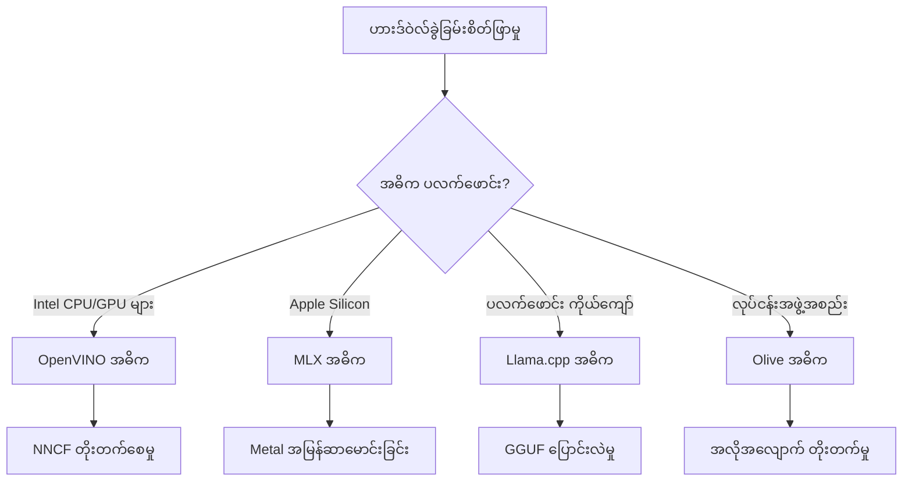
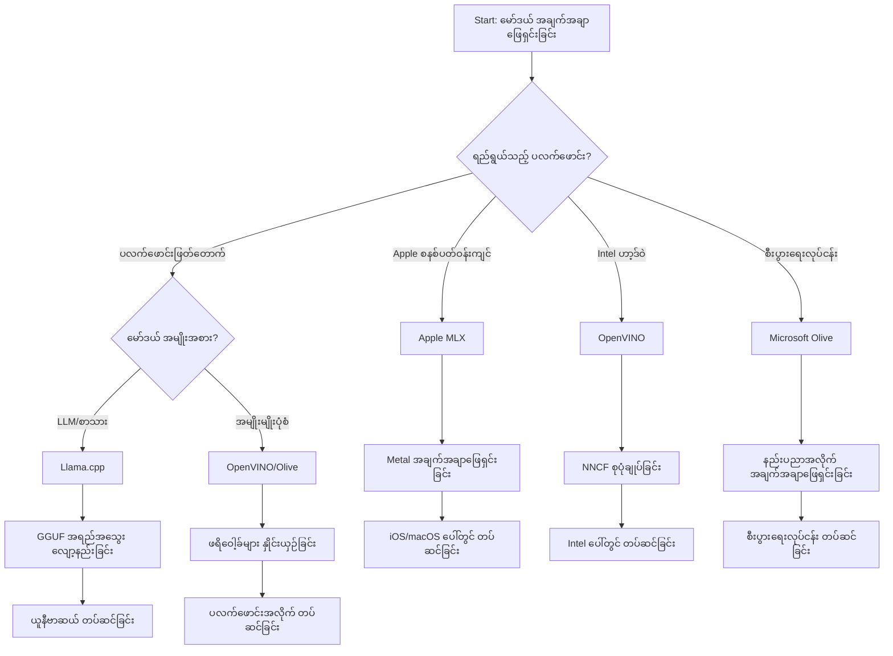
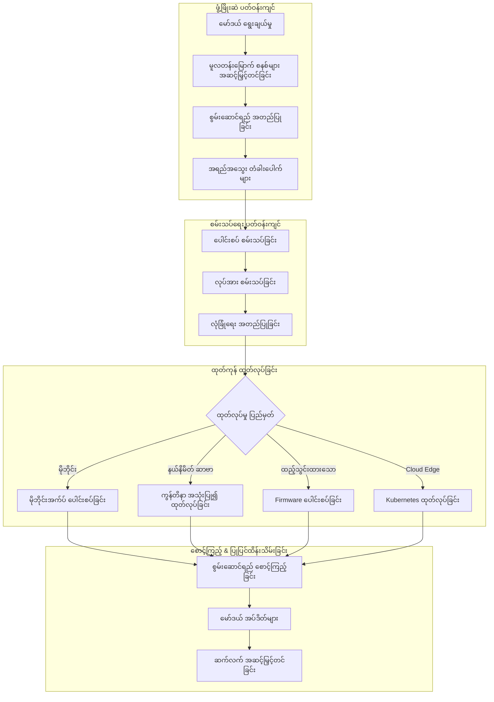

# အပိုင်း ၆: Edge AI ဖွံ့ဖြိုးမှု လုပ်ငန်းစဉ် အနှစ်ချုပ်

## အကြောင်းအရာစာရင်း
၁။ [နိဒါန်း](#နိဒါန်း)
၂။ [သင်ယူရမည့်ရည်မှန်းချက်များ](#သင်ယူရမည့်ရည်မှန်းချက်များ)
၃။ [ပေါင်းစပ်လုပ်ငန်းစဉ် အမြင်](#ပေါင်းစပ်လုပ်ငန်းစဉ်-အမြင်)
၄။ [ဖရိမ်းဝက် များရွေးချယ်မှု ဇယား](#ဖရိမ်ဝက်-ရွေးချယ်မှု-ဇယား)
၅။ [အကောင်းဆုံးနည်းလမ်းများ အနှစ်ချုပ်](#အကောင်းဆုံးနည်းလမ်းများ-အနှစ်ချုပ်)
၆။ [ထည့်သွင်းအသုံးပြုမှု မဟာဗျူဟာ လမ်းညွှန်](#ထည့်သွင်းအသုံးပြုမှု-မဟာဗျူဟာ-လမ်းညွှန်)
၇။ [စွမ်းဆောင်ရည် တိုးတက်စေရေး လုပ်ငန်းစဉ်](#စွမ်းဆောင်ရည်-မြှင့်တင်ရေး-လုပ်ငန်းစဉ်)
၈။ [ထုတ်လုပ်မှု အသင့်ရှိမှု စစ်ဆေးစာရင်း](#ထုတ်လုပ်မှု-အသင့်ရှိမှု-စစ်ဆေးစာရင်း)
၉။ [ပြဿနာဖြေရှင်းခြင်းနှင့် ကြည့်ရှုလေ့လာခြင်း](#ပြဿနာဖြေရှင်းခြင်းနှင့်-ကြည့်ရှုလေ့လာခြင်း)
၁၀။ [သင့် Edge AI လမ်းကြောင်း အနာဂတ် သတ်မှတ်ခြင်း](#သင့်-edge-ai-လမ်းကြောင်း-အနာဂတ်-သတ်မှတ်ခြင်း)

## နိဒါန်း

Edge AI ဖွံ့ဖြိုးမှုသည် optimization ဖရိမ်ဝက် များ၊ ထည့်သွင်းအသုံးပြုမှု မဟာဗျူဟာများနှင့် hardware ဆိုင်ရာစဉ်းစားချက်များကို နက်နက်ရှိုင်းရှိုင်း နားလည်မှု လိုအပ်သည်။ ဒီကျယ်ပြန့်ပြီး စုပေါင်းထားသော အနှစ်ချုပ်သည် Llama.cpp, Microsoft Olive, OpenVINO နှင့် Apple MLX မှသာယာအောင် လုပ်ဆောင်နိုင်မှုများကို ပေါင်းစပ်၍ စွမ်းဆောင်ရည်အ maximale ဖြစ်စေ၊ အရည်အသွေးထိန်းသိမ်းပြီး ထိရောက်သည့် ထုတ်လုပ်မှု ထည့်သွင်းအသုံးပြုမှု လုပ်ငန်းစဉ်တစ်ခု ဖန်တီးပေးသည်။

ဒီသင်တန်းတစ်လျှောက်မှာ ကျွန်တော်တို့က မတူညီတဲ့ optimization ဖရိမ်ဝက် များကိုလေ့လာခဲ့ပြီး သူတို့ရဲ့ ထူးခြားချက်များနဲ့ အထူးပြုမှုထောက်ပံ့မှု များကို သိရှိခဲ့သည်။ သို့သော် အမှန်တကယ် Edge AI ပရောဂျက်များမှာ အသုံးပြုရန် တစ်ခုထက်မက ဖရိမ်ဝက် များ၏ နည်းလမ်းများ ပေါင်းစပ်ရန် သို့မဟုတ် သတ်မှတ်ထားသည့် ကန့်သတ်ချက်များနှင့် လိုအပ်ချက် အတွက် အကောင်းဆုံးရလဒ်ရရှိမည့် နည်းလမ်းကို ဆုံးဖြတ်ရမည့် ရှုထောင့်ဝင်မှု လိုအပ်သည်။

ဒီအပိုင်းက ဖရိမ်ဝက် များအားလုံးမှ စုစည်းထားသော ဉာဏ်ပညာတို့ကို လိုက်နာလှုပ်ရှားနိုင်သည့် လုပ်ငန်းစဉ်များ၊ ဆုံးဖြတ်မှု သစ်ရင်းများနဲ့ အကောင်းဆုံးနည်းလမ်းများအဖြစ် ပေါင်းစပ်ပေးပြီး စွမ်းဆောင်ရည်မြင့်သော Edge AI ဖြေရှင်းချက် များကို ထုတ်လုပ်ရေးအဆင့်သို့ ကောင်းမွန်စွာ တည်ဆောက်နိုင်ရန် အတွက် မဟာဗျူဟာကို ပံ့ပိုးပေးသည်။ မိုဘိုင်း စက်ပစ္စည်းများ၊ embedded စနစ်များ သို့မဟုတ် edge server များအတွက် optimization လုပ်နေစဉ်မှာ လည်း ဒီလမ်းညွှန်မှုက วิaille တွေသာဆုံးဖြတ်မှုဆိုင်ရာ မဟာဗျူဟာကို လမ်းပြပေးပါလိမ့်မယ်။

## သင်ယူရမည့်ရည်မှန်းချက်များ

ဒီအပိုင်းပြီးဆုံးသည်နှင့်အတူ သင်သည် အောက်ပါအရာများကို ပြုလုပ်နိုင်ပါလိမ့်မည် -

### မဟာဗျူဟာ ဆုံးဖြတ်ချက်ချခြင်း
- **ပရောဂျက် လိုအပ်ချက်များ၊ hardware ကန့်သတ်ချက်များ နှင့် ထည့်သွင်းအသုံးပြုမှု အခြေနေများအပေါ် မူတည်၍ အကောင်းဆုံး optimization ဖရိမ်ဝက် ကို သုံးသပ် ရွေးချယ်ခြင်း**
- **ထိရောက်မှုအပြည့်အဝအတွက် optimization နည်းလမ်းများစွာ ပေါင်းစပ်ထားသော လုပ်ငန်းစဉ်များကို ဒီဇိုင်းဆွဲခြင်း**
- **မတူညီသော ဖရိမ်ဝက် များအတွင်း မော်ဒယ်တိကျမှု၊ အကြောင်းအရာ အမြန်နှုန်း၊ မemory အသုံးပြုမှု နှင့် ထည့်သွင်းအသုံးပြုမှု ရှုပ်ထွေးမှုတို့အကြား စီးပွားဆိုင်ရာ အလားအလာများ သုံးသပ်ခြင်း**

### လုပ်ငန်းစဉ် ပေါင်းစပ်ခြင်း
- **ဖရိမ်ဝက် များစွာ၏အားသာချက်များကိုအသုံးပြု၍ ပေါင်းစပ် ဖွံ့ဖြိုးမှု လမ်းကြောင်းတစ်လျှောက် ဆောင်ရွက်ခြင်း**
- **အသုံးပြုမှု တူညီမှုရှိအောင် လုပ်ငန်းစဉ်များ ထုတ်လုပ်ခြင်း**
- **ထိရောက်သော မော်ဒယ်များကို ထုတ်လုပ်မှု လိုအပ်ချက်များနှင့် ကိုက်ညီအောင် အရည်အသွေး စစ်ဆေးမှုများနှင့် အတည်ပြုမှုလုပ်ငန်းစဉ်များ စတင်တည်ထောင်ခြင်း**

### စွမ်းဆောင်ရည် မြှင့်တင်ခြင်း
- **quantization, pruning နှင့် hardware အသီးသီးတွင် သက်ဆိုင်ရာ အရှိန်မြှင့် နည်းလမ်းများကို အသုံးပြု၍ စနစ်တကျ optimization မဟာဗျူဟာများ လုပ်ဆောင်ခြင်း**
- **optimization အဆင့်များနှင့် ထည့်သွင်းအသုံးပြုမှု ပစ်မှတ်များတလျှောက် မော်ဒယ်စွမ်းဆောင်ရည်ကို ကြည့်ရှု၍ စစ်တမ်းများ ပြုလုပ်ခြင်း**
- **CPU, GPU, NPU နှင့် အထူးပြု edge accelerators များအပါအဝင် specific hardware platform များအတွက် optimization လုပ်ခြင်း**

### ထုတ်လုပ်မှု ထည့်သွင်းအသုံးပြုမှု
- **မော်ဒယ် ပုံစံများနှင့် inference engine များစွာကို ထောက်ပံ့နိုင်သော များမြွေ့နိုင်သည့် ထည့်သွင်းအသုံးပြုမှု သဘာဝအင်ဂျင်နီယာ လုပ်ဆောင်မှု ဒီဇိုင်းဆွဲခြင်း**
- **ထုတ်လုပ်မှု အခြေအနေများတွင် Edge AI အက်ပလီကေးရှင်းများအတွက် ကြည့်ရှုလေ့လာမှုနှင့် စောင့်ကြည့်မှုများ ကျင်းပခြင်း**
- **မော်ဒယ် အသစ်ပြောင်းခြင်း၊ စွမ်းဆောင်ရည်ထိန်းသိမ်းမှုနှင့် စနစ် optimization အတွက် ထိန်းသိမ်းမှု လုပ်ငန်းစဉ်များ တည်ဆောက်ခြင်း**

### Cross-Platform ထူးခြားမှု
- **ဖွံ့ဖြိုးပြီး မော်ဒယ်များကို မတူညီသော hardware platform များတွင် ထည့်သွင်း အသုံးပြုထားသည့် performance ကို ကြီးမားစွာ ထိန်းသိမ်းခြင်း**
- **Windows, macOS, Linux, mobile နှင့် embedded system များအတွက် platform-specific optimization များ ကိုင်တွယ်ခြင်း**
- **မျိုးစုံသော edge ပတ်ဝန်းကျင်များသို့ စလွယ်ကူစွာ ထည့်သွင်းအသုံးပြုနိုင်ရန် abstraction layer များ ဖန်တီးခြင်း**

## ပေါင်းစပ်လုပ်ငန်းစဉ် အမြင်

### အဆင့် ၁: လိုအပ်ချက် ခွဲခြားစစ်ဆေးခြင်းနှင့် ဖရိမ်ဝက် ရွေးချယ်ခြင်း

အောင်မြင်သော Edge AI ထည့်သွင်းအသုံးပြုမှုအခြေခံမှာ လိုအပ်ချက်များကို လုံးဝနက်ရှိုင်းစွာ ခွဲခြားစစ်ဆေးခြင်းဖြစ်ပြီး ယင်းအလေးအနက်သည် ဖရိမ်ဝက် ရွေးချယ်မှုနှင့် optimization မဟာဗျူဟာကို သတ်မှတ်ပေးသည့် အခြေခံအရာ ဖြစ်သည်။

#### ၁.၁ Hardware စစ်ဆေးခြင်း

```mermaid
graph TD
    A[ဟားဒ်ဝဲလ်ခွဲခြမ်းစိတ်ဖြာမှု] --> B{အဓိက ပလက်ဖောင်း?}
    B -->|Intel CPU/GPU များ| C[OpenVINO အဓိက]
    B -->|Apple Silicon| D[MLX အဓိက]
    B -->|ပလက်ဖောင်း ကိုယ်ကျော်| E[Llama.cpp အဓိက]
    B -->|လုပ်ငန်းအဖွဲ့အစည်း| F[Olive အဓိက]
    
    C --> G[NNCF တိုးတက်စေမှု]
    D --> H[Metal အမြန်ဆာမောင်းခြင်း]
    E --> I[GGUF ပြောင်းလဲမှု]
    F --> J[အလိုအလျောက် တိုးတက်မှု]
```

**အဓိက စဉ်းစားချက်များ:**
- **CPU ဆောက်လုပ်ပုံ**: x86, ARM, Apple Silicon ၏ စွမ်းဆောင်ရည်များ
- **အရှိန်မြှင့် ကိရိယာ ရရှိနိုင်မှု**: GPU, NPU, VPU, အထူးပြု AI chip များ
- **မှတ်ဉာဏ် ကန့်သတ်ချက်များ**: RAM ကန့်သတ်ချက်, သိမ်းဆည်းနိုင်မှု
- **စွမ်းအင် ဘတ်ဂျက်**: ဘက်ထရီ အသက်တာ, ထအာမခံချက်များ
- **ချိတ်ဆက်မှု**: အော့ဖ်လိုင်း လိုအပ်ချက်များ, bandwidth ကန့်သတ်ချက်များ

#### ၁.၂ အက်ပလီကေးရှင်း လိုအပ်ချက် ဇယား

| လိုအပ်ချက် | Llama.cpp | Microsoft Olive | OpenVINO | Apple MLX |
|-------------|-----------|-----------------|----------|-----------|
| Cross-platform | ✅ အထူးသင့်တော် | ⚡ ကောင်း | ⚡ ကောင်း | ❌ Apple အတွက်ပဲ |
| စီးပွားရေးပိုင်ဆိုင်မှုနှင့် ပေါင်းစပ်မှု | ⚡ အခြေခံ | ✅ အထူးသင့်တော် | ✅ အထူးသင့်တော် | ⚡ ကန့်သတ်ထား |
| မိုဘိုင်း ထည့်သွင်းအသုံးပြုမှု | ✅ အထူးသင့်တော် | ⚡ ကောင်း | ⚡ ကောင်း | ✅ iOS အထူးသင့်တော် |
| အချိန်နဲ့ တန်းတူ အနက်ယူမှု | ✅ အထူးသင့်တော် | ✅ အထူးသင့်တော် | ✅ အထူးသင့်တော် | ✅ အထူးသင့်တော် |
| မော်ဒယ်မျိုးစုံ | ✅ LLM အာရုံစိုက်မှု | ✅ အားလုံးသော မော်ဒယ်များ | ✅ အားလုံးသော မော်ဒယ်များ | ✅ LLM အာရုံစိုက်မှု |
| အသုံးပြုရ လွယ်ကူမှု | ✅ ရိုးရှင်း | ✅ အလိုအလျောက် | ⚡ အလယ်အလတ် | ✅ ရိုးရှင်း |

### အဆင့် ၂: မော်ဒယ် ပြင်ဆင်ခြင်းနှင့် Optimization

#### ၂.၁ ပြည့်စုံသော မော်ဒယ် စစ်ဆေးမှု လမ်းကြောင်း

```python
# တစ်ကမวน မော်ဒယ် သတ်မှတ်မှု ဖရိမ်းဝင်း
class EdgeAIModelAssessment:
    def __init__(self, model_path, target_hardware):
        self.model_path = model_path
        self.target_hardware = target_hardware
        self.optimization_frameworks = []
        
    def assess_model_characteristics(self):
        """Analyze model size, architecture, and complexity"""
        return {
            'model_size': self.get_model_size(),
            'parameter_count': self.get_parameter_count(),
            'architecture_type': self.detect_architecture(),
            'quantization_compatibility': self.check_quantization_support()
        }
    
    def recommend_optimization_strategy(self):
        """Recommend optimal frameworks and techniques"""
        characteristics = self.assess_model_characteristics()
        
        if self.target_hardware.startswith('apple'):
            return self.mlx_optimization_strategy(characteristics)
        elif self.target_hardware.startswith('intel'):
            return self.openvino_optimization_strategy(characteristics)
        elif characteristics['model_size'] > 7_000_000_000:  # 7 ဘီ+ ပါရာမီတာများ
            return self.enterprise_optimization_strategy(characteristics)
        else:
            return self.lightweight_optimization_strategy(characteristics)
```

#### ၂.၂ ဖရိမ်ဝက်စွဲ Optimization လုပ်ငန်းစဉ် ပေါင်းစပ်ခြင်း

**အဆင့်လိုက် Optimization မဟာဗျူဟာ:**
၁။ **အစပိုင်းပြောင်းလဲမှု**: အလယ်ပိုင်းပုံစံ (ONNX ဖြစ်ပါက) သို့ အလွယ်တကူ ပြောင်းခြင်း
၂။ **ဖရိမ်ဝက် အထူးပြု Optimization**: အထူးနည်းလမ်းများ ကို စတင်အသုံးပြုခြင်း
၃။ **ထိုကဲ့သို့ Cross-Validation**: ရည်မှန်းထားသော platform များတွင် စွမ်းဆောင်ရည် စစ်ဆေးခြင်း
၄။ **နောက်ဆုံးထည့်သွင်းခြင်း**: ထုတ်လုပ်မှုအတွက် အသင့်ပြင်ဆင်ခြင်း

```bash
# မော်တော်လ်-ဖရိမ်ဝပ် အာပတိမိတ်ရှင်း စကရစ်တ်
#!/bin/bash

MODEL_NAME="phi-3-mini"
BASE_MODEL="microsoft/Phi-3-mini-4k-instruct"

# အဆင့် ၁: ONNX ပြောင်းလဲမှု (အပြည်ပြည်ဆိုင်ရာ)
python convert_to_onnx.py --model $BASE_MODEL --output models/onnx/

# အဆင့် ၂: စက်ပစ္စည်းအလိုက် အာပတိမိတ်ရှင်း
if [[ "$TARGET_PLATFORM" == "intel" ]]; then
    # OpenVINO အာပတိမိတ်ရှင်း
    python optimize_openvino.py --input models/onnx/ --output models/openvino/
elif [[ "$TARGET_PLATFORM" == "apple" ]]; then
    # MLX အာပတိမိတ်ရှင်း
    python optimize_mlx.py --input $BASE_MODEL --output models/mlx/
elif [[ "$TARGET_PLATFORM" == "cross" ]]; then
    # Llama.cpp အာပတိမိတ်ရှင်း
    python convert_to_gguf.py --input models/onnx/ --output models/gguf/
fi

# အဆင့် ၃: သက်သေပြမှု
python validate_optimization.py --original $BASE_MODEL --optimized models/$TARGET_PLATFORM/
```

### အဆင့် ၃: စွမ်းဆောင်ရည် အတည်ပြုခြင်းနှင့် Benchmarking

#### ၃.၁ ပြည့်စုံသော Benchmarking ဖရိမ်ဝက်

```python
class EdgeAIBenchmark:
    def __init__(self, optimized_models):
        self.models = optimized_models
        self.metrics = {
            'inference_time': [],
            'memory_usage': [],
            'accuracy_score': [],
            'throughput': [],
            'energy_consumption': []
        }
    
    def run_comprehensive_benchmark(self):
        """Execute standardized benchmarks across all optimized models"""
        test_inputs = self.generate_test_inputs()
        
        for model_framework, model_path in self.models.items():
            print(f"Benchmarking {model_framework}...")
            
            # နောက်ကျမှု စမ်းသပ်ခြင်း
            latency = self.measure_inference_latency(model_path, test_inputs)
            
            # မှတ်ဉာဏ် ပရိုဖိုင်လုပ်ခြင်း
            memory = self.profile_memory_usage(model_path)
            
            # တိကျမှန်ကန်မှု အတည်ပြုခြင်း
            accuracy = self.validate_model_accuracy(model_path, test_inputs)
            
            # ထံတိုးနှုန်း ဆန်းစစ်ခြင်း
            throughput = self.measure_throughput(model_path)
            
            self.record_metrics(model_framework, latency, memory, accuracy, throughput)
    
    def generate_optimization_report(self):
        """Create comprehensive comparison report"""
        report = {
            'recommendations': self.analyze_performance_trade_offs(),
            'deployment_guidance': self.generate_deployment_recommendations(),
            'monitoring_requirements': self.define_monitoring_metrics()
        }
        return report
```

## ဖရိမ်ဝက် ရွေးချယ်မှု ဇယား

### ဖရိမ်ဝက် ရွေးချယ်ရာ ဆုံးဖြတ်ချက် သစ်ရင်း


```mermaid
graph TD
    A[Start: မော်ဒယ် အချက်အချာဖြေရှင်းခြင်း] --> B{ရည်ရွယ်သည့် ပလက်ဖောင်း?}
    
    B -->|Apple စနစ်ပတ်ဝန်းကျင်| C[Apple MLX]
    B -->|Intel ဟာ့ဒ်ဝဲ| D[OpenVINO]
    B -->|ပလက်ဖောင်းဖြတ်တောက်| E{မော်ဒယ် အမျိုးအစား?}
    B -->|စီးပွားရေးလုပ်ငန်း| F[Microsoft Olive]
    
    E -->|LLM/စာသား| G[Llama.cpp]
    E -->|အမျိုးမျိုးပုံစံ| H[OpenVINO/Olive]
    
    C --> I[Metal အချက်အချာဖြေရှင်းခြင်း]
    D --> J[NNCF စုပုံချုပ်ခြင်း]
    F --> K[နည်းပညာအလိုက် အချက်အချာဖြေရှင်းခြင်း]
    G --> L[GGUF အရည်အသွေး လျော့နည်းခြင်း]
    H --> M[ဖရိဝေါ့ခ်များ နှိုင်းယှဉ်ခြင်း]
    
    I --> N[iOS/macOS ပေါ်တွင် တပ်ဆင်ခြင်း]
    J --> O[Intel ပေါ်တွင် တပ်ဆင်ခြင်း]
    K --> P[စီးပွားရေးလုပ်ငန်း တပ်ဆင်ခြင်း]
    L --> Q[ယူနီဗာဆယ် တပ်ဆင်ခြင်း]
    M --> R[ပလက်ဖောင်းအလိုက် တပ်ဆင်ခြင်း]
```

### ပြည့်စုံသော ရွေးချယ်မှု စံနှုန်းများ

#### ၁. အဓိက အသုံးပြုမှု အမှီအခိုက်

**ကြီးမားသော ဘာသာစကား မော်ဒယ်များ (LLMs):**
- **Llama.cpp**: CPU သုံးသော cross-platform ထည့်သွင်းအသုံးပြုမှုအတွက် အကောင်းဆုံး
- **Apple MLX**: Apple Silicon နှင့် စုပေါင်းနေသော memory များအတွက် သင့်တော်ဆုံး
- **OpenVINO**: Intel hardware နှင့် NNCF optimization အတွက် ကောင်းမွန်သောရွေးချယ်မှု
- **Microsoft Olive**: စီးပွားရေးလုပ်ငန်းစဉ်များအတွက် အလိုအလျောက်လုပ်ဆောင်မှု

**မော်ဒယ် မျိုးစုံ:**
- **OpenVINO**: ရုပ်မြင်သံကြား၊ အသံနှင့် စာသားများကို စုံစမ်းထောက်ပံ့မှု ပေးသည်
- **Microsoft Olive**: ရှုပ်ထွေးသော လုပ်ငန်းစဉ်များအတွက် စီးပွားရေးအဆင့် optimization
- **Llama.cpp**: စာသားပေါ်အခြေခံ မော်ဒယ်များအတွက် ကန့်သတ်ထားသည်
- **Apple MLX**: မော်ဒယ်မျိုးစုံအက်ပလီကေးရှင်းများအတွက် တိုးတက်လာနေသည်

#### ၂. Hardware Platform ဇယား

| Platform | အဓိက ဖရိမ်ဝက် | ဒုတိယ ရွေးချယ်မှု | အထူးပြု အင်္ဂါရပ်များ |
|----------|------------------|------------------|---------------------|
| Intel CPU/GPU | OpenVINO | Microsoft Olive | NNCF ဖိအားချခြင်း, Intel optimization |
| NVIDIA GPU | Microsoft Olive | OpenVINO | CUDA အရှိန်မြှင့်မှု, စီးပွားရေး အင်္ဂါရပ်များ |
| Apple Silicon | Apple MLX | Llama.cpp | Metal shaders, စုပေါင်း memory |
| ARM Mobile | Llama.cpp | OpenVINO | Cross-platform, အနည်းဆုံးတာဝန်ယူမှုများ |
| Edge TPU | OpenVINO | Microsoft Olive | အထူးပြု accelerator ထောက်ပံ့မှု |
| Embedded ARM | Llama.cpp | OpenVINO | အနည်းဆုံး အရွယ်အစား, ထိရောက်သော Inference |

#### ၃. ဖွံ့ဖြိုးမှု လုပ်ငန်းစဉ် နှစ်သက်မှု

**အမြန် Prototype ကြိုးစားမှု:**
၁။ **Llama.cpp**: အမြန်ဆုံး တည်ဆောက်မှု၊ ခဏလေးရလဒ်
၂။ **Apple MLX**: ရိုးရှင်းသော Python API၊ အမြန်ပြန်လည်ပြင်ဆင်ခြင်း
၃။ **Microsoft Olive**: အလိုအလျောက် optimization ၊ အနည်းဆုံး တက်ကြွမှု
၄။ **OpenVINO**: အသေးစိတ် Setup၊ ပြည့်စုံသော အင်္ဂါရပ်များ

**စီးပွားရေးထုတ်လုပ်မှု:**
၁။ **Microsoft Olive**: စီးပွားရေး အင်္ဂါရပ်များ၊ Azure ပေါင်းစည်းမှု
၂။ **OpenVINO**: Intel ပတ်၀န်းကျင်, ပြည့်စုံသော tools
၃။ **Apple MLX**: Apple များအတွက် စီးပွားရေး လျုပ်ငန်းများ
၄။ **Llama.cpp**: ရိုးရှင်းသော ထည့်သွင်းအသုံးပြုမှု၊ ကန့်သတ်ချက်ရှိသော စီးပွားရေး အင်္ဂါရပ်များ

## အကောင်းဆုံးနည်းလမ်းများ အနှစ်ချုပ်

### စွမ်းဆောင်ရည် မြှင့်တင်ရေး နည်းလမ်းများ

#### ၁. တိုးတက်မှု Optimization မဟာဗျူဟာ

```python
class ProgressiveOptimization:
    def __init__(self, base_model):
        self.base_model = base_model
        self.optimization_stages = [
            'baseline_measurement',
            'format_conversion',
            'quantization_optimization',
            'hardware_acceleration',
            'production_validation'
        ]
    
    def execute_progressive_optimization(self):
        """Apply optimization techniques incrementally"""
        
        # အဆင့် ၁: အခြေခံတိုင်းတာချက်
        baseline_metrics = self.measure_baseline_performance()
        
        # အဆင့် ၂: ဖော်မတ်ပြောင်းလဲခြင်း
        converted_model = self.convert_to_optimal_format()
        conversion_metrics = self.measure_performance(converted_model)
        
        # အဆင့် ၃: အရေအတွက်သတ်မှတ်ခြင်း
        quantized_model = self.apply_quantization(converted_model)
        quantization_metrics = self.measure_performance(quantized_model)
        
        # အဆင့် ၄: အထောက်အပံ့ ဆော့ဖ်ဝဲမျှတမှု
        accelerated_model = self.enable_hardware_acceleration(quantized_model)
        acceleration_metrics = self.measure_performance(accelerated_model)
        
        # အဆင့် ၅: စစ်ဆေးခြင်း
        production_ready = self.validate_for_production(accelerated_model)
        
        return self.compile_optimization_report(
            baseline_metrics, conversion_metrics, 
            quantization_metrics, acceleration_metrics
        )
```

#### ၂. အရည်အသွေး အတားအဆီး တည်ဆောက်မှု

**တိကျမှန်ကန်မှု ထိန်းသိမ်းရေး အတားအဆီးများ:**
- မူရင်းမော်ဒယ် တိကျမှန်ကန်မှု ၉၅% ထက် ပိုပြီး ထိန်းသိမ်းပါ။
- ကိုယ်စားပြု စမ်းသပ်မှုဒေတာ စာရင်းများနှင့် အတည်ပြုပါ။
- ထုတ်လုပ်မှု အတည်ပြုမှုအတွက် A/B စမ်းသပ်မှုလုပ်ပါ။

**စွမ်းဆောင်ရည်တိုးတက်ရေး အတားအဆီးများ:**
- အနည်းဆုံး ၂ ဆ အမြန်နှုန်းတိုးတက်မှုရရှိပါ။
- မemory အသုံးချမှုကို အနည်းဆုံး ၅၀% လျှော့ပါ။
- Inference အချိန် တည်ငြိမ်မှုကို အတည်ပြုပါ။

**ထုတ်လုပ်မှု အသင့်ရှိရေး အတားအဆီးများ:**
- စိတ်ဖိစီးမှု စမ်းသပ်မှုများ ကျော်လွန်ပါ။
- အချိန်ကြာမြင့်စွာ တည်ငြိမ်သော စွမ်းဆောင်ရည် ပြသနိုင်ပါ။
- လုံခြုံရေးနှင့် ကိုယ်ရေးကိုယ်တာလိုအပ်ချက်များကို သေချာစွာ စစ်ဆေးပါ။

### ဖရိမ်ဝက် အထူးနည်းလမ်းများ ပေါင်းစပ်ခြင်း

#### ၁. Quantization မဟာဗျူဟာ အနှစ်ချုပ်

```python
# ညီညွတ်သော အရည်အစုံချိန်ညှိနည်း
class UnifiedQuantizationStrategy:
    def __init__(self, model, target_platform):
        self.model = model
        self.platform = target_platform
        
    def select_optimal_quantization(self):
        """Choose best quantization based on platform and requirements"""
        
        if self.platform == 'apple_silicon':
            return self.mlx_quantization_strategy()
        elif self.platform == 'intel_hardware':
            return self.openvino_quantization_strategy()
        elif self.platform == 'cross_platform':
            return self.llamacpp_quantization_strategy()
        else:
            return self.olive_quantization_strategy()
    
    def mlx_quantization_strategy(self):
        """Apple MLX-specific quantization"""
        return {
            'method': 'mlx_quantize',
            'precision': 'int4',
            'group_size': 64,
            'optimization_target': 'unified_memory'
        }
    
    def openvino_quantization_strategy(self):
        """OpenVINO NNCF quantization"""
        return {
            'method': 'nncf_quantize',
            'precision': 'int8',
            'calibration_method': 'post_training',
            'optimization_target': 'intel_hardware'
        }
```

#### ၂. Hardware အရှိန်မြှင့်တင်ခြင်း Optimization

**CPU Optimization အနှစ်ချုပ်:**
- **SIMD အမိန့်များ**: ဖရိမ်ဝက်စွဲများတလျှောက် အာရုံစိုက် kernel များ အသုံးပြုခြင်း
- **မှတ်ဥာဏ် အကျယ်**: Cache ထိရောက်မှုအတွက် ဒေတာ စီတန်းမှုများ တိုးတက်စေခြင်း
- **ကြိုးပေါင်းခြင်း**: အရင်းအမြစ် ကန့်သတ်ချက်နှင့် ကိုက်ညီအောင် အတူတက်ကိုင်ခြင်း

**GPU အရှိန်မြှင့်အတွက် အကောင်းဆုံးနည်းလမ်းများ:**
- **အစုအဖွဲ့ လုပ်ငန်းဆောင်တာ**: မှန်ကန်သော batch အရွယ်အစားများဖြင့် throughput ကိုအများဆုံးပြုလုပ်ခြင်း
- **မှတ်ဥာဏ် စီမံခန့်ခွဲမှု**: GPU မှတ်ဉာဏ်နှင့် လွှဲပြောင်းမှုများကို အကောင်းဆုံးပြုလုပ်ခြင်း
- **တိကျမှန်ကန်မှု**: ကောင်းမွန်သော စွမ်းဆောင်ရည်အတွက် FP16 ကို အသုံးပြုပြီး optimization ပြုလုပ်ခြင်း

**NPU / အထူးပြု Accelerator Optimization:**
- **မော်ဒယ် တည်ဆောက်ပုံ**: accelerator ၏ လုပ်ဆောင်နိုင်မှုများနှင့် ကိုက်ညီမှုရှိစေရန်
- **ဒေတာလည်ပတ်မှု**: accelerator ထိရောက်မှုအတွက် input/output လမ်းကြောင်းများ ကောင်းမွန်အောင် ပြုပြင်ခြင်း
- **fallback မဟာဗျူဟာ**: ဆောင်ရွက်ချက်မရောက်သော အရာများအတွက် CPU fallback စနစ် တည်ဆောက်ခြင်း

## ထည့်သွင်းအသုံးပြုမှု မဟာဗျူဟာ လမ်းညွှန်

### Universal Deployment အဆောက်အအုံ


```mermaid
graph TB
    subgraph "ဖွံ့ဖြိုးဆဲ ပတ်ဝန်းကျင်"
        A[မော်ဒယ် ရွေးချယ်မှု] --> B[မူလတန်းမြောက် စနစ်များ အဆင့်မြှင့်တင်ခြင်း]
        B --> C[စွမ်းဆောင်ရည် အတည်ပြုခြင်း]
        C --> D[အရည်အသွေး တံခါးပေါက်များ]
    end
    
    subgraph "စမ်းသပ်ရေး ပတ်ဝန်းကျင်"
        D --> E[ပေါင်းစပ် စမ်းသပ်ခြင်း]
        E --> F[လုပ်အား စမ်းသပ်ခြင်း]
        F --> G[လုံခြုံရေး အတည်ပြုခြင်း]
    end
    
    subgraph "ထုတ်ကုန် ထုတ်လုပ်ခြင်း"
        G --> H{ထုတ်လုပ်မှု ပြည်မှတ်}
        H -->|မိုဘိုင်း| I[မိုဘိုင်းအက်ပ် ပေါင်းစပ်ခြင်း]
        H -->|နယ်နိမိတ် ဆာဗာ| J[ကွန်တိနာ အသုံးပြု၍ ထုတ်လုပ်ခြင်း]
        H -->|ထည့်သွင်းထားသော| K[Firmware ပေါင်းစပ်ခြင်း]
        H -->|Cloud Edge| L[Kubernetes ထုတ်လုပ်ခြင်း]
    end
    
    subgraph "စောင့်ကြည့် & ပြုပြင်ထိန်းသိမ်းခြင်း"
        I --> M[စွမ်းဆောင်ရည် စောင့်ကြည့်ခြင်း]
        J --> M
        K --> M
        L --> M
        M --> N[မော်ဒယ် အပ်ဒိတ်များ]
        N --> O[ဆက်လက် အဆင့်မြှင့်တင်ခြင်း]
    end
```

### Platform-Specific ထည့်သွင်းအသုံးပြုမှု ပုံစံများ

#### ၁. မိုဘိုင်း ထည့်သွင်းအသုံးပြုမှု မဟာဗျူဟာ

```yaml
# Mobile Deployment Configuration
mobile_deployment:
  ios:
    framework: apple_mlx
    optimization:
      quantization: int4
      memory_mapping: true
      background_execution: limited
    packaging:
      format: mlx
      bundle_size: <50MB
      
  android:
    framework: llama_cpp
    optimization:
      quantization: q4_k_m
      threading: android_optimized
      memory_management: conservative
    packaging:
      format: gguf
      apk_size: <100MB
      
  cross_platform:
    framework: onnx_runtime
    optimization:
      quantization: int8
      execution_provider: cpu
    packaging:
      format: onnx
      shared_libraries: minimal
```

#### ၂. Edge Server ထည့်သွင်းအသုံးပြုမှု

```yaml
# Edge Server Deployment Configuration
edge_server:
  intel_based:
    framework: openvino
    optimization:
      quantization: int8
      acceleration: cpu_gpu_auto
      batch_processing: dynamic
    deployment:
      container: openvino_runtime
      orchestration: kubernetes
      scaling: horizontal
      
  nvidia_based:
    framework: microsoft_olive
    optimization:
      quantization: int4
      acceleration: cuda
      tensor_parallelism: true
    deployment:
      container: nvidia_triton
      orchestration: kubernetes
      scaling: gpu_aware
```

### ကွန်တိန်နာရေးရှင်း အကောင်းဆုံးနည်းလမ်းများ

```dockerfile
# Multi-Framework Edge AI Container
FROM ubuntu:22.04 as base

# Install common dependencies
RUN apt-get update && apt-get install -y \
    python3 \
    python3-pip \
    build-essential \
    cmake \
    && rm -rf /var/lib/apt/lists/*

# Framework-specific stages
FROM base as openvino
RUN pip install openvino nncf optimum[intel]

FROM base as llamacpp
RUN git clone https://github.com/ggerganov/llama.cpp.git \
    && cd llama.cpp && make LLAMA_OPENBLAS=1

FROM base as olive
RUN pip install olive-ai[auto-opt] onnxruntime-genai

# Production stage with selected framework
FROM openvino as production
COPY models/ /app/models/
COPY src/ /app/src/
WORKDIR /app

EXPOSE 8080
CMD ["python3", "src/inference_server.py"]
```

## စွမ်းဆောင်ရည် မြှင့်တင်ရေး လုပ်ငန်းစဉ်

### စနစ်တကျ စွမ်းဆောင်ရည် တိုးတက်စေရေး

#### ၁. စွမ်းဆောင်ရည် စစ်ဆေးခြင်း လမ်းကြောင်း

```python
class EdgeAIPerformanceProfiler:
    def __init__(self, model_path, framework):
        self.model_path = model_path
        self.framework = framework
        self.profiling_results = {}
    
    def comprehensive_profiling(self):
        """Execute comprehensive performance analysis"""
        
        # CPU ကို ပရိုဖိုင်းလုပ်ခြင်း
        cpu_profile = self.profile_cpu_usage()
        
        # မျိုးမစွာမှု ပရိုဖိုင်းလုပ်ခြင်း
        memory_profile = self.profile_memory_usage()
        
        # ခန့်မှန်းချက်ဆိုက်လပ်စီ
        latency_profile = self.profile_inference_latency()
        
        # ထွက်ရှိမှု လေ့လာမှု
        throughput_profile = self.profile_throughput()
        
        # စွမ်းအင် သုံးစွဲမှု (ရနိုင်ပါက)
        energy_profile = self.profile_energy_consumption()
        
        return self.compile_performance_report(
            cpu_profile, memory_profile, latency_profile,
            throughput_profile, energy_profile
        )
    
    def identify_bottlenecks(self):
        """Automatically identify performance bottlenecks"""
        bottlenecks = []
        
        if self.profiling_results['cpu_utilization'] > 80:
            bottlenecks.append('cpu_bound')
        
        if self.profiling_results['memory_usage'] > 90:
            bottlenecks.append('memory_bound')
        
        if self.profiling_results['inference_variance'] > 20:
            bottlenecks.append('inconsistent_performance')
        
        return self.generate_optimization_recommendations(bottlenecks)
```

#### ၂. အလိုအလျောက် optimization လုပ်ငန်းစဉ်

```python
class AutomatedOptimizationPipeline:
    def __init__(self, base_model, target_constraints):
        self.base_model = base_model
        self.constraints = target_constraints
        self.optimization_history = []
    
    def execute_optimization_search(self):
        """Systematically search optimization space"""
        
        optimization_candidates = [
            {'quantization': 'int8', 'pruning': 0.1},
            {'quantization': 'int4', 'pruning': 0.2},
            {'quantization': 'int8', 'acceleration': 'gpu'},
            {'quantization': 'int4', 'acceleration': 'npu'}
        ]
        
        best_configuration = None
        best_score = 0
        
        for config in optimization_candidates:
            optimized_model = self.apply_optimization(config)
            score = self.evaluate_optimization(optimized_model)
            
            if score > best_score and self.meets_constraints(optimized_model):
                best_score = score
                best_configuration = config
            
            self.optimization_history.append({
                'config': config,
                'score': score,
                'model': optimized_model
            })
        
        return best_configuration, self.optimization_history
```

### မဟာဗျူဟာအလေးပေးထားသော Optimization

#### ၁. Edge AI အတွက် Pareto Optimization

```python
class ParetoOptimization:
    def __init__(self, objectives=['speed', 'accuracy', 'memory']):
        self.objectives = objectives
        self.pareto_frontier = []
    
    def find_pareto_optimal_solutions(self, optimization_results):
        """Identify Pareto-optimal configurations"""
        
        for result in optimization_results:
            is_dominated = False
            
            for frontier_point in self.pareto_frontier:
                if self.dominates(frontier_point, result):
                    is_dominated = True
                    break
            
            if not is_dominated:
                # အဆင့်ရှေ့တန်းမှ အာဏာပြင်းသောအမှတ်များကို ဖယ်ရှားပါ
                self.pareto_frontier = [
                    point for point in self.pareto_frontier 
                    if not self.dominates(result, point)
                ]
                
                self.pareto_frontier.append(result)
        
        return self.pareto_frontier
    
    def recommend_configuration(self, user_preferences):
        """Recommend configuration based on user preferences"""
        
        weighted_scores = []
        for config in self.pareto_frontier:
            score = sum(
                user_preferences[obj] * config['metrics'][obj] 
                for obj in self.objectives
            )
            weighted_scores.append((score, config))
        
        return max(weighted_scores, key=lambda x: x[0])[1]
```

## ထုတ်လုပ်မှု အသင့်ရှိမှု စစ်ဆေးစာရင်း

### ပြည့်စုံသော ထုတ်လုပ်မှု အတည်ပြုခြင်း

#### ၁. မော်ဒယ် အရည်အသွေး အာမခံချက်

```python
class ProductionReadinessValidator:
    def __init__(self, optimized_model, production_requirements):
        self.model = optimized_model
        self.requirements = production_requirements
        self.validation_results = {}
    
    def validate_model_quality(self):
        """Comprehensive model quality validation"""
        
        # တိကျချက် အတည်ပြုခြင်း
        accuracy_result = self.validate_accuracy()
        
        # စွမ်းဆောင်ရည် အတည်ပြုခြင်း
        performance_result = self.validate_performance()
        
        # ခိုင်ခံမှု စမ်းသပ်ခြင်း
        robustness_result = self.validate_robustness()
        
        # လုံခြုံရေး အကဲဖြတ်ခြင်း
        security_result = self.validate_security()
        
        # သတ်မှတ်ချက်လိုက်နာမှု အတည်ပြုခြင်း
        compliance_result = self.validate_compliance()
        
        return self.compile_validation_report(
            accuracy_result, performance_result, robustness_result,
            security_result, compliance_result
        )
    
    def generate_certification_report(self):
        """Generate production certification report"""
        return {
            'model_signature': self.generate_model_signature(),
            'validation_timestamp': datetime.now(),
            'validation_results': self.validation_results,
            'deployment_approval': self.check_deployment_approval(),
            'monitoring_requirements': self.define_monitoring_requirements()
        }
```

#### ၂. ထုတ်လုပ်မှု ထည့်သွင်းအသုံးပြုမှု စစ်ဆေးစာရင်း

**ထည့်သွင်းမီ အတည်ပြုခြင်း:**
- [ ] မော်ဒယ်တိကျမှန်ကန်မှု အနည်းဆုံး လိုအပ်ချက် (>95% of baseline)
- [ ] စွမ်းဆောင်ရည်ပစ်မှတ်များ သတ်မှတ်ပြီး ရရှိထားသည် (latency, throughput, memory)
- [ ] လုံခြုံရေး ချို့ယွင်းချက်များ သုံးသပ်ပြီး ကာကွယ်ထားသည်
- [ ] မျှော်မှန်းထားသော စိတ်ဖိစီးမှုအောက်တွင် စမ်းသပ်မှု ပြီးမြောက်သည်
- [ ] မအောင်မြင်မှုအခြေအနေများ စမ်းသပ်ပြီး ပြန်လည်ကောင်းမွန်မှုလုပ်ထုံးလုပ်နည်း သေချာသည်
- [ ] ကြည့်ရှုချိန်းညှိခြင်းနှင့် အရေးပေါ်သတိပေးစနစ်များ တပ်ဆင်ထားသည်
- [ ] ပြန်လည်ဖျက်သိမ်းခြင်း လုပ်ထုံးလုပ်နည်းများ စမ်းသပ်ပြီး စာရွက်စာတမ်းပြုစုထားသည်

**ထည့်သွင်းမှု လုပ်ငန်းစဉ်:**
- [ ] Blue-green ထည့်သွင်းမှု မဟာဗျူဟာ ကို စီမံဆောင်ရွက်သည်
- [ ] အစာရှောင်မသော traffic မြှင့်တင်မှု ကို စီမံထားသည်
- [ ] အချိန်နှင့်တပြေးညီ ကြည့်ရှုမှု ဒိုင်ယာဂရမ်များ လုပ်ဆောင်နေသည်
- [ ] စွမ်းဆောင်ရည် မျက်နှာစာများ တည်ဆောက်ထားသည်
- [ ] အမှားနှုန်း အကန့်အသတ်များ သတ်မှတ်ထားသည်
- [ ] အလိုအလျောက် ပြန်လည်ဖျက်သိမ်းမှု trigger များ ဖွင့်ထားသည်

**ထည့်သွင်းပြီးနောက် ကြည့်ရှုမှု:**
- [ ] မော်ဒယ် လွှဲပြောင်းချက် မှတ်ချက်များ လုပ်ဆောင်နေသည်
- [ ] စွမ်းဆောင်ရည် ကျဆင်းမှု သတိပေးချက်များ ဖွင့်ထားသည်
- [ ] အရင်းအမြစ် အသုံးပြုမှု ကြည့်ရှုမှု ဖွင့်ထားသည်
- [ ] အသုံးပြုသူ အတွေ့အကြုံ ကို အတည်ပြုခြင်း
- [ ] မော်ဒယ် ဗားရှင်းနှင့် အမှတ်တရ များ ထိန်းသိမ်းထားသည်
- [ ] မော်ဒယ် စွမ်းဆောင်ရည် သုံးသပ်မှုများ သတ်မှတ်ထားသည်

### ဆက်လက် ပေါင်းသင်း ဆက်သွယ်မှု / ဆက်လက် ထည့်သွင်းအသုံးပြုမှု (CI/CD)

```yaml
# Edge AI CI/CD Pipeline Configuration
edge_ai_pipeline:
  stages:
    - model_validation
    - optimization
    - testing
    - staging_deployment
    - production_deployment
    - monitoring
  
  model_validation:
    accuracy_threshold: 0.95
    performance_baseline: required
    security_scan: enabled
    
  optimization:
    frameworks:
      - llama_cpp
      - openvino
      - microsoft_olive
    validation:
      cross_validation: enabled
      performance_comparison: required
      
  testing:
    unit_tests: comprehensive
    integration_tests: full_pipeline
    load_tests: production_scale
    security_tests: comprehensive
    
  deployment:
    strategy: blue_green
    traffic_ramping: gradual
    rollback: automatic
    monitoring: real_time
```

## ပြဿနာဖြေရှင်းခြင်းနှင့် ကြည့်ရှုလေ့လာခြင်း

### Universal ပြဿနာဖြေရှင်းခြင်း ဖရိမ်ဝက်

#### ၁. ပုံမှန် ဖြစ်ပေါ်သော ပြဿနာများနှင့် ဖြေရှင်းနည်းများ

**စွမ်းဆောင်ရည် ပြဿနာများ:**
```python
class PerformanceTroubleshooter:
    def __init__(self, model_metrics):
        self.metrics = model_metrics
        
    def diagnose_performance_issues(self):
        """Systematic performance issue diagnosis"""
        
        issues = []
        
        # မြင့်မားသော ကြာမြင့်ချိန် ရောဂါသိရှိခြင်း
        if self.metrics['avg_latency'] > self.metrics['target_latency']:
            issues.append(self.diagnose_latency_issues())
        
        # မှတ်ဉာဏ်အသုံးပြုမှု ရောဂါသိရှိခြင်း
        if self.metrics['memory_usage'] > self.metrics['memory_limit']:
            issues.append(self.diagnose_memory_issues())
        
        # ထွက်ခွာပမာဏ ရောဂါသိရှိခြင်း
        if self.metrics['throughput'] < self.metrics['target_throughput']:
            issues.append(self.diagnose_throughput_issues())
        
        return self.generate_resolution_plan(issues)
    
    def diagnose_latency_issues(self):
        """Specific latency troubleshooting"""
        potential_causes = []
        
        if self.metrics['cpu_utilization'] > 80:
            potential_causes.append('cpu_bottleneck')
        
        if self.metrics['memory_bandwidth'] > 90:
            potential_causes.append('memory_bandwidth_limit')
        
        if self.metrics['model_size'] > self.metrics['optimal_size']:
            potential_causes.append('model_too_large')
        
        return {
            'issue': 'high_latency',
            'causes': potential_causes,
            'solutions': self.generate_latency_solutions(potential_causes)
        }
```

**ဖရိမ်ဝက် အထူးပြဿနာဖြေရှင်းခြင်း:**

| ပြဿနာ | Llama.cpp | Microsoft Olive | OpenVINO | Apple MLX |
|-------|-----------|-----------------|----------|-----------|
| မှတ်ဉာဏ်ပြဿနာများ | context length လျော့ချပါ | batch size လျော့ချပါ | caching ကိုအသုံးပြုပါ | memory mapping အသုံးပြုပါ |
| အနည်းငယ် ဆွဲထုတ်ခြင်း | SIMD အမိန့် ဖွင့်ပါ | quantization ကိုစစ်ဆေးပါ | threading ကို optimze လုပ်ပါ | Metal ဖွင့်ပါ |
| တိကျမှု ပျက်ခြင်း | quantization မြင့်မားစေပါ | QAT ဖြင့် ပြန်လည်လေ့ကျင့်ပါ | calibration မြှင့်ပါ | post-quant ဖိုင်န်တွန်းလုပ်ပါ |
| ကိုက်ညီမှု | မော်ဒယ် ပုံစံ စစ်ဆေးပါ | ဖရိမ်ဝက် ဗားရှင်း သေချာစစ်ဆေးပါ | မောင်းသူများ update လုပ်ပါ | macOS ဗားရှင်း စစ်ဆေးပါ |

#### ၂. ထုတ်လုပ်မှု ကြည့်ရှုမှု မဟာဗျူဟာ

```python
class EdgeAIMonitoring:
    def __init__(self, deployment_config):
        self.config = deployment_config
        self.metrics_collectors = []
        self.alerting_rules = []
    
    def setup_comprehensive_monitoring(self):
        """Configure comprehensive monitoring for Edge AI deployment"""
        
        # မော်ဒယ်ဆောင်ရွက်မှုစောင့်ကြပ်ခြင်း
        self.setup_model_performance_monitoring()
        
        # အဆောက်အအုံစောင့်ကြပ်ခြင်း
        self.setup_infrastructure_monitoring()
        
        # စီးပွားရေးတိုင်းတာမှုများ စောင့်ကြပ်ခြင်း
        self.setup_business_metrics_monitoring()
        
        # လုံခြုံရေးစောင့်ကြပ်ခြင်း
        self.setup_security_monitoring()
    
    def setup_model_performance_monitoring(self):
        """Model-specific performance monitoring"""
        metrics = [
            'inference_latency_p50',
            'inference_latency_p95',
            'inference_latency_p99',
            'model_accuracy_drift',
            'prediction_confidence_distribution',
            'error_rate',
            'throughput_requests_per_second'
        ]
        
        for metric in metrics:
            self.add_metric_collector(metric)
            self.add_alerting_rule(metric)
    
    def detect_model_drift(self):
        """Automated model drift detection"""
        drift_indicators = [
            self.statistical_drift_detection(),
            self.performance_drift_detection(),
            self.data_distribution_shift_detection()
        ]
        
        return self.aggregate_drift_signals(drift_indicators)
```

### အလိုအလျောက် ပြဿနာဖြေရှင်းခြင်း

```python
class AutomatedIssueResolution:
    def __init__(self, monitoring_system):
        self.monitoring = monitoring_system
        self.resolution_strategies = {}
    
    def handle_performance_degradation(self, alert):
        """Automated performance issue resolution"""
        
        if alert['type'] == 'high_latency':
            return self.resolve_latency_issue(alert)
        elif alert['type'] == 'high_memory_usage':
            return self.resolve_memory_issue(alert)
        elif alert['type'] == 'accuracy_drift':
            return self.resolve_accuracy_issue(alert)
        
    def resolve_latency_issue(self, alert):
        """Automated latency issue resolution"""
        resolution_steps = [
            'increase_cpu_allocation',
            'enable_model_caching',
            'reduce_batch_size',
            'switch_to_quantized_model'
        ]
        
        for step in resolution_steps:
            if self.apply_resolution_step(step):
                return f"Resolved latency issue with: {step}"
        
        return "Escalating to human operator"
```

## သင့် Edge AI လမ်းကြောင်း အနာဂတ် သတ်မှတ်ခြင်း

### နောက်တစ်မျိုးမြှင့် ထွက်ပေါ်လာသော နည်းပညာများ ပေါင်းစပ်မှု

#### ၁. နောက်လှမ်း hardware ထောက်ပံ့မှု

```python
class FutureHardwareIntegration:
    def __init__(self):
        self.supported_accelerators = [
            'npu_next_gen',
            'quantum_processors',
            'neuromorphic_chips',
            'optical_processors'
        ]
    
    def design_adaptive_pipeline(self):
        """Create hardware-agnostic optimization pipeline"""
        
        pipeline = {
            'model_preparation': self.universal_model_preparation(),
            'hardware_detection': self.dynamic_hardware_detection(),
            'optimization_selection': self.adaptive_optimization_selection(),
            'performance_validation': self.hardware_agnostic_validation()
        }
        
        return pipeline
    
    def adaptive_optimization_selection(self):
        """Dynamically select optimization based on available hardware"""
        
        def optimize_for_hardware(model, available_hardware):
            if 'npu' in available_hardware:
                return self.npu_optimization(model)
            elif 'quantum' in available_hardware:
                return self.quantum_optimization(model)
            elif 'neuromorphic' in available_hardware:
                return self.neuromorphic_optimization(model)
            else:
                return self.fallback_optimization(model)
        
        return optimize_for_hardware
```

#### ၂. မော်ဒယ် တည်ဆောက်ပုံ တိုးတက်မှု

**ထွက်ပေါ်လာသော Architecture များအတွက် ထောက်ပံ့မှု:**
- **Mixture of Experts (MoE)**: ထိရောက်မှုအတွက် ပျော့ပြောင်းမော်ဒယ် Architecture များ
- **Retrieval-Augmented Generation**: မော်ဒယ်ပေါင်းစပ်ခြင်းနှင့် အသိပညာ အခြေခံစနစ်များ
- **မော်ဒယ်မျိုးစုံ**: ရုပ်မြင်သံကြား + ဘာသာစကား + အသံ ပေါင်းစပ်မှု
- **Federated Learning**: ဖြန့်ဝေ၍ လေ့ကျင့်ခြင်းနှင့် optimization

```python
class NextGenModelSupport:
    def __init__(self):
        self.architecture_handlers = {
            'moe': self.handle_mixture_of_experts,
            'rag': self.handle_retrieval_augmented,
            'multimodal': self.handle_multimodal,
            'federated': self.handle_federated_learning
        }
    
    def handle_mixture_of_experts(self, model):
        """Optimize Mixture of Experts models for edge deployment"""
        optimization_strategy = {
            'expert_pruning': True,
            'routing_optimization': True,
            'expert_quantization': 'per_expert',
            'load_balancing': 'dynamic'
        }
        return self.apply_moe_optimization(model, optimization_strategy)
```

### ဆက်လက် သင်ယူမှု နှင့် ကိုက်ညီမှု

#### ၁. အွန်လိုင်း သင်ယူမှု ပေါင်းစပ်မှု

```python
class EdgeOnlineLearning:
    def __init__(self, base_model, learning_rate=0.001):
        self.base_model = base_model
        self.learning_rate = learning_rate
        self.adaptation_buffer = []
    
    def continuous_adaptation(self, new_data, feedback):
        """Continuously adapt model based on edge data"""
        
        # ပုဂ္ဂိုလ်ရေးကာကွယ်မှုကို ထိန်းသိမ်းသည့် ဒေသဆိုင်ရာ ချိန်နှိုင်းမှု
        local_updates = self.compute_local_gradients(new_data, feedback)
        
        # ကန့်သတ်ချက်များဖြင့် ပြုပြင်ချက်များ လုပ်ဆောင်ပါ
        adapted_model = self.apply_constrained_updates(
            self.base_model, local_updates
        )
        
        # ချိန်နှိုင်းမှု အရည်အသွေးကို အတည်ပြုပါ
        if self.validate_adaptation(adapted_model):
            self.base_model = adapted_model
            return True
        
        return False
    
    def federated_learning_participation(self):
        """Participate in federated learning while preserving privacy"""
        
        # ဒေသဆိုင်ရာ မော်ဒယ်ကို ပြုပြင်ချက်များတွက်ချက်ပါ
        local_updates = self.compute_private_updates()
        
        # အထူးပုဂ္ဂိုလ်ရေး ကာကွယ်မှု
        private_updates = self.apply_differential_privacy(local_updates)
        
        # ဖက်ဒရေးတက် လေ့လာမှု စနစ်ညွှန်ကြားသူနှင့် မျှဝေပါ
        return self.share_updates(private_updates)
```

#### ၂. သဘာဝ ဟန်ချက်နှင့် အစိမ်းရောင် AI

```python
class GreenEdgeAI:
    def __init__(self, sustainability_targets):
        self.targets = sustainability_targets
        self.energy_monitor = EnergyMonitor()
    
    def optimize_for_sustainability(self, model):
        """Optimize model for minimal environmental impact"""
        
        optimization_objectives = [
            'minimize_energy_consumption',
            'maximize_hardware_utilization',
            'reduce_model_training_cost',
            'extend_device_lifetime'
        ]
        
        return self.multi_objective_green_optimization(
            model, optimization_objectives
        )
    
    def carbon_aware_deployment(self):
        """Deploy models considering carbon footprint"""
        
        deployment_strategy = {
            'prefer_renewable_energy_regions': True,
            'optimize_for_energy_efficiency': True,
            'minimize_data_transfer': True,
            'lifecycle_carbon_accounting': True
        }
        
        return deployment_strategy
```

## နိဂုံးချုပ်

ဒီကျယ်ပြန့်သော workflow အနှစ်ချုပ်က Edge AI optimization ဗဟုသုတအပေါင်းအရင်း ဖြစ်ပြီး အဓိက optimization ဖရိမ်ဝက် များမှ အကောင်းဆုံးနည်းလမ်းများကို စုပေါင်းထားသော ထုတ်လုပ်ရေး အသင့်ရှိသော နည်းလမ်းတစ်ခု ဖြစ်သည်။ ဒီလမ်းညွှန်မှုများကို လိုက်နာခြင်းဖြင့် သင်သည် -

**အကောင်းဆုံး စွမ်းဆောင်ရည် ရရှိစေပါမည်**: စနစ်တကျ ဖရိမ်ဝက် ရွေးချယ်ခြင်း, တိုးတက်မှု optimization နှင့် ပြည့်စုံသည့် အတည်ပြုချက်မှတဆင့် သင့် Edge AI အက်ပလီကေးရှင်းများအတွက် အများဆုံး ထိရောက်မှုကို ပေးစွမ်းနိုင်မည်။

**ထုတ်လုပ်မှု အသင့်ရှိမှု အာမခံပါမည်**: စမ်းသပ်မှုများ, ကြည့်ရှုမှု၊ အရည်အသွေး အတားအဆီးများဖြင့် လုံခြုံစိတ်ချရသော deployment နှင့် အလုပ်လုပ်မှုကို သေချာစေပါသည်။

**ရှည်လျားသော အောင်မြင်မှုကို ထိန်းသိမ်းပါမည်**: ဆက်လက် ကြည့်ရှုမှုများ၊ အလိုအလျောက် ပြဿနာများ ဖြေရှင်းခြင်းနှင့် သင့် Edge AI ဖြေရှင်းချက်များအား တိုးတက်စေသော ကိုက်ညီမှု မဟာဗျူဟာများဖြင့် စွမ်းဆောင်ရည်အောင်မြင်မှုကို ထိန်းသိမ်းမှုဆောင်ပါသည်။

**သင်၏ ရင်းနှီးမြှုပ်နှံမှုကို အနာဂတ် ယုံကြည်စိတ်ချစေရန်**: hardware agnostic ဖြစ်သည့် ဒေါင်းလိုင်းများကို ဒီဇိုင်းဆွဲ၍ နည်းပညာအသစ်များနှင့် လိုအပ်ချက်များအတွက် တိုးချဲ့ရန် ချိန်ညှိနိုင်သော နည်းလမ်းများ ဖန်တီးပါ။

Edge AI နယ်ပယ်သည် hardware platform အသစ်များ၊ optimization နည်းလမ်းအသစ်များနှင့် ထည့်သွင်းအသုံးပြုမှု မဟာဗျူဟာအသစ်များဖြင့် အမြန်တိုးတက်လျက်ရှိသည်။ ဒီအနှစ်ချုပ်သည် ဒီရှုပ်ထွေးမှုများကို ဖြတ်သန်းသွားရန်အတွက် အခြေခံကို ပေးပြီး  ထုတ်လုပ်မှုအခြေအနေများတွင် တည်ငြိမ်၍ ထိရောက်သော Edge AI ဖြေရှင်းချက်များ ဖန်တီးနိုင်ရန် ကူညီပေးပါသည်။

သင့်ရဲ့ သတ်မှတ်ချက်အပေါ် မူတည်၍ ပြောင်းလဲနိုင်စွမ်းရှိချင်းကို ထိန်းသိမ်းထားသော အကောင်းဆုံး optimization မဟာဗျူဟာသည် အမြဲ အကောင်းဆုံး ဖြစ်ပါသည်ကို သတိပြုပါ။ ဒီလမ်းညွှန်ကို သတင်းအချက်အလက်လိုအပ်ချက်များအတွက် အခြေခံဖြစ်စေသော်လည်း သင်၏ရွေးချယ်မှုများကို စမ်းသပ်ခြင်းနှင့် အမှန်တကယ် ထည့်သွင်းအသုံးပြုခြင်းများမှတဆင့် အတည်ပြုပါ။

## ➡️ နောက်တစ်ဆင့်


- [၀၇: Qualcomm QNN Framework အနက်ချင်းသွင်းလေ့လာခြင်း](./07.QualcommQNN.md)

---

<!-- CO-OP TRANSLATOR DISCLAIMER START -->
**ပြောကြားချက်**
ဤစာတမ်းကို AI ဘာသာပြန်ဝန်ဆောင်မှု [Co-op Translator](https://github.com/Azure/co-op-translator) အသုံးပြု၍ ဘာသာပြန်ထားပါသည်။ ကျွန်ုပ်တို့သည် တိကျမှန်ကန်မှုအတွက် ကြိုးပမ်းနေသော်လည်း၊ စက်ကိရိယာဘာသာပြန်ခြင်းများတွင် အမှားများ သို့မဟုတ် မှားယွင်းချက်များ ပါဝင်နိုင်ကြောင်း သတိပြုပါရန် လိုအပ်ပါသည်။ မူလစာတမ်းကို မူရင်းဘာသာဖြင့်သာ ယုံကြည်စိတ်ချရသော အချက်အလက်အဖြစ် သတ်မှတ်သင့်သည်။ အရေးကြီးသည့် သတင်းအချက်အလက်များအတွက် ပရော်ဖက်ရှင်နယ် လူသားဘာသာပြန်သူဝန်ဆောင်မှုကို အကြံပြုပါသည်။ ဤဘာသာပြန်ချက်ကို အသုံးပြုခြင်းမှ ဖြစ်ပေါ်လာသော နားလည်မှုကွာခြားမှုများ သို့မဟုတ် မမှန်ကန်သော အသုံးပြုမှုများအတွက် ကျွန်ုပ်တို့ တာဝန်မခံပါ။
<!-- CO-OP TRANSLATOR DISCLAIMER END -->