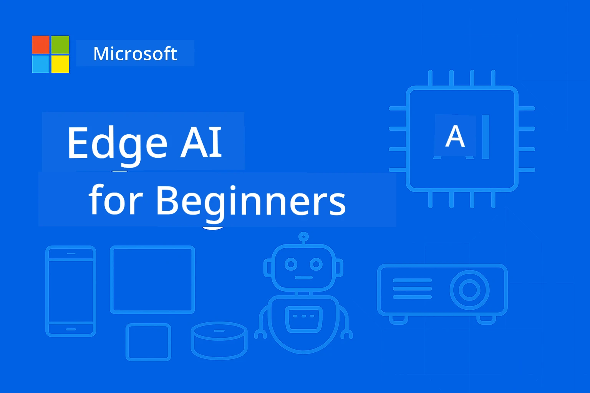

# EdgeAI for Beginners 




[](https://GitHub.com/microsoft/edgeai-for-beginners/graphs/contributors)
[](https://GitHub.com/microsoft/edgeai-for-beginners/issues)
[](https://GitHub.com/microsoft/edgeai-for-beginners/pulls)
[](http://makeapullrequest.com)

[](https://GitHub.com/microsoft/edgeai-for-beginners/watchers)
[](https://GitHub.com/microsoft/edgeai-for-beginners/fork)
[](https://GitHub.com/microsoft/edgeai-for-beginners/stargazers)


[](https://discord.gg/nTYy5BXMWG)

Follow these steps to get started using these resources:

1. **Fork the Repository**: Click [](https://GitHub.com/microsoft/edgeai-for-beginners/fork)
2. **Clone the Repository**:   `git clone https://github.com/microsoft/edgeai-for-beginners.git`
3. [**Join The Azure AI Foundry Discord and meet experts and fellow developers**](https://discord.com/invite/ByRwuEEgH4)


### 🌐 Multi-Language Support

#### Supported via GitHub Action (Automated & Always Up-to-Date)

<!-- CO-OP TRANSLATOR LANGUAGES TABLE START -->
[Arabic](../ar/README.md) | [Bengali](../bn/README.md) | [Bulgarian](../bg/README.md) | [Burmese (Myanmar)](./README.md) | [Chinese (Simplified)](../zh-CN/README.md) | [Chinese (Traditional, Hong Kong)](../zh-HK/README.md) | [Chinese (Traditional, Macau)](../zh-MO/README.md) | [Chinese (Traditional, Taiwan)](../zh-TW/README.md) | [Croatian](../hr/README.md) | [Czech](../cs/README.md) | [Danish](../da/README.md) | [Dutch](../nl/README.md) | [Estonian](../et/README.md) | [Finnish](../fi/README.md) | [French](../fr/README.md) | [German](../de/README.md) | [Greek](../el/README.md) | [Hebrew](../he/README.md) | [Hindi](../hi/README.md) | [Hungarian](../hu/README.md) | [Indonesian](../id/README.md) | [Italian](../it/README.md) | [Japanese](../ja/README.md) | [Kannada](../kn/README.md) | [Korean](../ko/README.md) | [Lithuanian](../lt/README.md) | [Malay](../ms/README.md) | [Malayalam](../ml/README.md) | [Marathi](../mr/README.md) | [Nepali](../ne/README.md) | [Nigerian Pidgin](../pcm/README.md) | [Norwegian](../no/README.md) | [Persian (Farsi)](../fa/README.md) | [Polish](../pl/README.md) | [Portuguese (Brazil)](../pt-BR/README.md) | [Portuguese (Portugal)](../pt-PT/README.md) | [Punjabi (Gurmukhi)](../pa/README.md) | [Romanian](../ro/README.md) | [Russian](../ru/README.md) | [Serbian (Cyrillic)](../sr/README.md) | [Slovak](../sk/README.md) | [Slovenian](../sl/README.md) | [Spanish](../es/README.md) | [Swahili](../sw/README.md) | [Swedish](../sv/README.md) | [Tagalog (Filipino)](../tl/README.md) | [Tamil](../ta/README.md) | [Telugu](../te/README.md) | [Thai](../th/README.md) | [Turkish](../tr/README.md) | [Ukrainian](../uk/README.md) | [Urdu](../ur/README.md) | [Vietnamese](../vi/README.md)

> **Prefer to Clone Locally?**

> This repository includes 50+ language translations which significantly increases the download size. To clone without translations, use sparse checkout:
> ```bash
> git clone --filter=blob:none --sparse https://github.com/microsoft/edgeai-for-beginners.git
> cd edgeai-for-beginners
> git sparse-checkout set --no-cone '/*' '!translations' '!translated_images'
> ```
> This gives you everything you need to complete the course with a much faster download.
<!-- CO-OP TRANSLATOR LANGUAGES TABLE END -->

**If you wish to have additional translations languages supported are listed [here](https://github.com/Azure/co-op-translator/blob/main/getting_started/supported-languages.md)**
## Introduction

**EdgeAI for Beginners** သို့ကြိုဆိုပါသည် – ကွဲပြားလွန်းသော Edge Artificial Intelligence ၏ ပြောင်းလဲမှုလောကထဲသို့ သင့်ရဲ့ အသေးစိတ်ခရီးစဉ်ဖြစ်သည်။ ဤသင်တန်းသည် အင်အားကြီး AI စွမ်းဆောင်ရည်များနဲ့ ပရက်တက်ကယ်၊ အမှန်တကယ် အသုံးပြုနိုင်သော edge ဒရိုင်ဗာများပေါ်တွင် ထည့်သွင်း ဆောင်ရွက်ခြင်းတို့အကြား ဖြစ်ပေါ်နေသော ဖယ်ကွယ်မှုကို ဆက်သွယ်ပေးပြီး၊ ဒေတာထွက်ပေါက်နေရာနှင့် ဆုံးဖြတ်ချက်များလိုအပ်သောနေရာများတွင် AI ၏ လက်တွေ့ပါဝင်မှုကို သုံးစွဲနိုင်စေသည်။

### သင်ဘာတွေ ပိုင်နိုင်မှာလဲ

ဤသင်တန်းသည် အခြေခံအယူအဆများမှ ထုတ်လုပ်မှုအဆင့်သို့ ရောက်အောင် လမ်းညွှန်ပေးပြီး အောက်ပါအကြောင်းအရာများကို ကူးလွှဲစေသည် -
- **Small Language Models (SLMs)** ကို နားလည်ခြင်း နှင့် edge ပေါ်တွင် တပ်ဆင်ထားခြင်းအတွက် အထူးထိန်းသိမ်း
- **Hardware-aware optimization** ကို အမျိုးမျိုးသော ပလက်ဖောင်းများအတွက် ဆောင်ရွက်ခြင်း
- **Real-time inference** နှင့် ပုဂ္ဂလိကရေးနှင့်အတူ လုံခြုံရေးစနစ်
- **Production deployment** များအတွက် အကောင်အထည်ဖော်ခြင်း

### EdgeAI အတွက် အရေးကြီးချက်

Edge AI သည် အတွက် မီနစ်ဖြစ်ပြီး အောက်ပါ အရေးကြီးသောခက်ခဲမှုများကို ဖြေရှင်းနိုင်သည်-
- **Privacy & Security**: ဒေတာကို မိုဃ်းတိမ်တွင်း မပေါ်လွင်ပဲ ဒေသဆိုင်ရာမှာ ကာကွယ်စောင့်ရှောက်အသုံးပြုနိုင်ခြင်း
- **Real-time Performance**: အချိန်အရေးကြီးသော အက်ပလီကေးရှင်းများအတွက် ကြိုးစက်ဆက်သွယ်မှု အချိန်ကြာမြင့်မှုကို ဖယ်ရှားခြင်း
- **Cost Efficiency**: အင်တာနက်ပမာဏ နှင့် မိုဃ်းကွန်ပျူတာသုံးစရိတ်ကို လျှော့ချခြင်း
- **Resilient Operations**: ကြိုးကြာမှုရှိသော အချိန်များတွင် နေရာယူဆောင်ရွက်နိုင်ခြင်း
- **Regulatory Compliance**: ဒေတာနယ်မြေပိုင်ဆိုင်မှု စည်းမျဉ်းများကို ဆောင်ရွက်ခြင်း

### Edge AI

Edge AI သည် ဒေတာထွက်ပေါက်ရာနေရာနှင့် နီးကပ်စွာ hardware ပေါ်တွင် AI အယ်လ်ဂေါရီသမ်များနှင့် ဘာသာစကားမော်ဒယ်များကို မိုဃ်းကွန်ပျူတာတွင် မအပ်ထားဘဲ တွက်ချက်ဆောင်ရွက်ခြင်းကို ဆိုလိုသည်။ ၎င်းမှာ ချက်ချင်းတုံ့ပြန်မှုများစေပြီး၊ လျှို့ဝှက်ချက်နှင့် လုပ်ဆောင်ချက်များကို တိုးတက်စေသည်။

### အဓိက စည်းကမ်းတွေ-
- **On-device inference**: AI မော်ဒယ်များကို ဖုန်း၊ ရေဦးစက်၊ မိုက်ခရိုကိုန့်ထရိုးလာ၊ စက်မှု PC စသည့် edge စက်ပစ္စည်းများပေါ်တွင် ဆောင်ရွက်သည်
- **Offline capability**: အင်တာနက်ဆက်သွယ်မှု မတည်တံ့ပါက တာရှည်ဆောင်ရွက်နိုင်ခြင်း
- **Low latency**: အချိန်တိုအတွင်း ချက်ချင်းတုံ့ပြန်မှုရှိခြင်း
- **Data sovereignty**: ဒေတာလုံခြုံရေးနှင့်စည်းမျဉ်းကန့်သတ်မှုများအတွက် ဒေတာကို ဒေသတွင်းထားရှိခြင်း

### Small Language Models (SLMs)

Phi-4, Mistral-7B နှင့် Gemma ကဲ့သို့သော SLM များမှာ ရှားရှားနည်းသော LLM များအတွက် ဉာဏ်မြှင့်ချုပ်ထားသော မော်ဒယ်များဖြစ်ပြီး -
- **အသေးတဲ့ မှတ်ဉာဏ် အသုံးပြုမှု**: edge devices မှတ်ဉာဏ်ကန့်သတ်မှုနဲ့ ကိုက်ညီစေ
- **ကွန်ပျူတာလိုအပ်ချက်နည်းပါးမှု**: CPU နှင့် edge GPU စွမ်းဆောင်ရည်အတွက် အထူးလိုက်လျောညီထွေဖြစ်စေခြင်း
- **အလျင်အမြန် စတင်ချိန်**: တုံ့ပြန်နိုင်မှု အမြန်တက်စေခြင်း

၎င်းတို့သည် အောက်ပါ ကန့်သတ်ချက်များနှင့် ကိုက်ညီစေပြီး ပြင်းထန်သော NLP စွမ်းရည်များကို ဖြေရှင်းပေးသည်-
- **Embedded systems**: IoT စက်များနှင့် စက်မှု รีဂျစ်တရီများ
- **Mobile devices**: ဖုန်းများနှင့် တက်ဘလက်များ (offline အားထားနိုင်သော)
- **IoT Devices**: ကန့်သတ်ထားသော စွမ်းဆောင်ရည်ရှိသော စင်ဆာများနှင့် စမတ်စက်များ
- **Edge servers**: ဒေသအလိုက် ဝန်ဆောင်မှုဆော့ဝဲ ေနရာများ (GPU နည်းသော)
- **Personal Computers**: Desktop နှင့် Laptop ဖြင့် အသုံးပြုမှုများ

## Course Modules & Navigation

| Module | Topic | Focus Area | Key Content | Level | Duration |
|--------|-------|------------|-------------|--------|----------|
| [📖 00 ](./introduction.md) | [Introduction to EdgeAI](./introduction.md) | Foundation & Context | EdgeAI အကျဉ်းချုပ် • စက်မှုလုပ်ငန်း တက်လမ်းများ • SLM မိတ်ဆက် • သင်ယူရန် ရည်မှန်းချက်များ | စတင်သူ | 1-2 နာရီ |
| [📚 01](../../Module01) | [EdgeAI Fundamentals](./Module01/README.md) | Cloud နှင့် Edge AI နှိုင်းယှဉ်ခြင်း | EdgeAI အခြေခံ • လောကအရောင်ပြမှုများ • အကောင်အထည်ဖော် လမ်းညွှန် • Edge ပေါ် တပ်ဆင်မှု | စတင်သူ | 3-4 နာရီ |
| [🧠 02](../../Module02) | [SLM Model Foundations](./Module02/README.md) | မော်ဒယ် မျိုးစိတ် နှင့် အဆောက်အအုံ | Phi မျိုးစိတ် • Qwen မျိုးစိတ် • Gemma မျိုးစိတ် • BitNET • μModel • Phi-Silica | စတင်သူ | 4-5 နာရီ |
| [🚀 03](../../Module03) | [SLM Deployment Practice](./Module03/README.md) | ဒေသတွင်းနှင့် မိုဃ်းကွန်ပျူတာ တပ်ဆင်မှု | မြှင့်တင်သင်ကြားမှုများ • ဒေသတွင်း ပတ်ဝန်းကျင် • မိုဃ်းကွန်ပျူတာ တပ်ဆင်မှု | အလယ်အလတ် | 4-5 နာရီ |
| [⚙️ 04](../../Module04) | [Model Optimization Toolkit](./Module04/README.md) | ပလက်ဖောင်းဖြတ်တောက် ပြုပြင်ထိန်းသိမ်းမှု | မိတ်ဆက် • Llama.cpp • Microsoft Olive • OpenVINO • Apple MLX • လုပ်ငန်းစဉ် ချည်စပ်မှု | အလယ်အလတ် | 5-6 နာရီ |
| [🔧 05](../../Module05) | [SLMOps Production](./Module05/README.md) | ထုတ်လုပ်မှု လုပ်ငန်းဆောင်တာများ | SLMOps မိတ်ဆက် • မော်ဒယ် ချုပ်ပြုတ်ခြင်း • ညှိနှိုင်းမှု • ထုတ်လုပ်မှု တပ်ဆင်ခြင်း | ကြီးပြင်းသူ | 5-6 နာရီ |
| [🤖 06](../../Module06) | [AI Agents & Function Calling](./Module06/README.md) | Agent Frameworks နှင့် MCP | Agent မိတ်ဆက် • Function Calling • Model Context Protocol | ကြီးပြင်းသူ | 4-5 နာရီ |
| [💻 07](../../Module07) | [Platform Implementation](./Module07/README.md) | ပလက်ဖောင်းဖြတ်တောက် နမူနာများ | AI Toolkit • Foundry Local • Windows ဖွံ့ဖြိုးရေး | ကြီးပြင်းသူ | 3-4 နာရီ |
| [🏭 08](../../Module08) | [Foundry Local Toolkit](./Module08/README.md) | ထုတ်လုပ်သူအဆင့် နမူနာများ | နမူနာ အက်ပလီကေးရှင်းများ (အောက်တွင် ကြည့်ပါ) | ကျွမ်းကျင်သူ | 8-10 နာရီ |

### 🏭 **Module 08: Sample Applications**

- [01: REST Chat Quickstart](./Module08/samples/01/README.md)
- [02: OpenAI SDK Integration](./Module08/samples/02/README.md)
- [03: Model Discovery & Benchmarking](./Module08/samples/03/README.md)
- [04: Chainlit RAG Application](./Module08/samples/04/README.md)
- [05: Multi-Agent Orchestration](./Module08/samples/05/README.md)
- [06: Models-as-Tools Router](./Module08/samples/06/README.md)
- [07: Direct API Client](./Module08/samples/07/README.md)
- [08: Windows 11 Chat App](./Module08/samples/08/README.md)
- [09: Advanced Multi-Agent System](./Module08/samples/09/README.md)
- [10: Foundry Tools Framework](./Module08/samples/10/README.md)

### 🎓 **Workshop: Hands-On Learning Path**

ထုတ်လုပ်မှုအဆင့် အသုံးပြုနိုင်သော လက်တွေ့လုပ်ငန်း သင်ကြားမှု ပစ္စည်းများကြီးများပါရှိသည်-

- **[Workshop Guide](./Workshop/Readme.md)** - သင်ယူရန်ရည်မှန်းချက်များ၊ ရလဒ်များ၊ အရင်းအမြစ် လမ်းညွှန်မှုများ
- **Python နမူနာများ** (6 ကြိမ်) - အကောင်းဆုံးလက်တွေ့ဆောင်ရွက်နည်းများ၊ အမှားကိုင်တွယ်ခြင်း နဲ့ စာရွက်စာတမ်းများထည့်သွင်းထားသည်
- **Jupyter Notebooks** (8 အပြန်အလှန်) - အဆင့်လိုက် သင်ခန်းစာများ၊ စမ်းသပ်မှုများနှင့် စွမ်းဆောင်ရည်ထိန်းချုပ်ခြင်း
- **Session Guides** - workshop  အစီအစဥ်တစ်ခုချင်းစီအတွက် ဖော်ပြချက်များ ပါဝင်သည်
- **Validation Tools** - ကုဒ်အရည်အသွေးစစ်ဆေးခြင်းနှင့် Smoke Test ပြုလုပ်ခြင်း အတွက် script များ

**သင်တည်ဆောက်မည့်အရာများ:**
- လုပ်ငန်းစဉ်လည်ပတ်မှုကို ထောက်ပံ့နိုင်သော ဒေသဆိုင်ရာ AI စကားပြောအက်ပလီကေးရှင်းများ
- အရည်အသွေး သုံးသပ်မှု (RAGAS) ပါသော RAG Pipeline များ
- မော်ဒယ် အတူတကွ စမ်းသပ်မှု နှင့် နှိုင်းယှဉ်ခြင်း ကိရိယာများ
- Multi-agent အုပ်ချုပ်မှု စနစ်များ
- လုပ်ငန်းအပေါ် မူတည်၍ စီမံခန့်ခွဲသော အသိဉာဏ်ရှိ မော်ဒယ်လမ်းညွှန်မှု စနစ်များ

### 🎙️ **Workshop For Agentic: Hands-On - The AI Podcast Studio**

အဆိုပါ workshop မှာ သင်သည် AI ပါဝင်သော podcast ထုတ်လုပ်မှု လုပ်ငန်းစဉ်တစ်ခုကို စတင်တည်ဆောက်သင်ယူမည်ဖြစ်သည်။ ၎င်း သင်ကြားမှုသည် စိတ်ကူးများအား ပရော်ဖက်ရှင်နယ် podcast ဖြစ်အောင် ပြောင်းလဲပေးသော multi-agent စနစ်ကို ဖန်တီးပေးမည်ဖြစ်သည်။
**[🎬 AI Podcast Studio ဝန်းရံသင်တန်း အလုပ်ရုံဆွေးနွေးပွဲ စတင်မှု](./WorkshopForAgentic/README.md)**

**သင်၏တာဝန်**: "Future Bytes" ကို စတင်လိုက်ပါ — သင်ကိုယ်တိုင်တည်ဆောက်မည့် AI အေးဂျင့်များဖြင့် အသုံးပြုသောနည်းပညာပိုဒ်ကတ်အစီအစဉ်တစ်ခု။ မည်သည့် cloud မှာမဟုတ်ဘဲ၊ API ကုန်ကျစရိတ်မရှိဘဲ — အားလုံးကို သင့်စက်ပေါ်မှာပြုလုပ်သည်။

**ဒီအစီအစဉ်၏ ထူးခြားချက်များ:**
- **🤖 အမှန်တကယ် Multi-Agent စနစ် စီမံခန့်ခွဲမှု** - သုတေသနလုပ်၊ စာရေး, အသံထုတ်လုပ်နိုင်သော AI အေးဂျင့်များကို တည်ဆောက်ပါ
- **🎯 ပြည့်စုံသော ထုတ်လုပ်မှု လမ်းကြောင်း** - ခေါင်းစဉ်ရွေးချယ်မှ သီချင်းထုတ်လွှင့်ခြင်းအထိ
- **💻 ၁၀၀% ဒေသတွင်းအသုံးပြုနိုင်မှု** - Ollama နှင့် ဒေသတွင်းပုံစံများ (Qwen-3-8B) အသုံးပြု၍ ကိုယ်ပိုင်အချက်အလုပ်အရင်းအမြစ်များဖြင့်
- **🎤 စာသားမှ အသံသို့ ပေါင်းစည်းမှု** - စာကြောင်းများကို သဘာဝတုန့်ပြန်သံဖြင့် စကားပြောစုံဖွဲ့ခြင်း
- **✋ လူရှုထောင့်အတွက် လုပ်ဆောင်မှုများ** - အတည်ပြုခွင့်များဖြင့် အရည်အသွေးကို ထိန်းသိမ်းကာ အလိုအလျောက်စနစ်ကို ထိန်းသိမ်းသည်

**သုံးပိုင်းသင်ယူရေးခရီး:**

| အကျင့် | ဦးတည်ချက် | အဓိကကျကျ ကျွမ်းကျင်မှုများ | ကြာချိန် |
|--------|-------------|----------------------------|-----------|
| **[အကျင့် ၁: ကိုယ့် AI အကူအညီများနှင့် တွေ့ဆုံခြင်း](./WorkshopForAgentic/md/01.BuildAIAgentWithSLM.md)** | ပထမ AI အေးဂျင့်တစ်ခု တည်ဆောက်ခြင်း | ကိရိယာ ပေါင်းစည်းမှု • ဝက်ဘ်ရှာဖွေမှု • ပြဿနာဖြေရှင်းမှု • Agentic သဘောထား | ၂-၃ နာရီ |
| **[အကျင့် ၂: ထုတ်လုပ်မှုအဖွဲ့ စုစည်းခြင်း](./WorkshopForAgentic/md/02.AIAgentOrchestrationAndWorkflows.md)** | AI အေးဂျင့်များ သွားရင်း စီမံခန့်ခွဲခြင်း | အသင်းညှိနှိုင်းမှု • အတည်ပြုလမ်းကြောင်းများ • DevUI မျက်နှာပြင် • လူကြီးကြီးစိုးရှောက်မှု | ၃-၄ နာရီ |
| **[အကျင့် ၃: သင်၏ Podcast ကို အသက်သွင်းခြင်း](./WorkshopForAgentic/md/03.Multi-SpeakerPodcastGenerationWithVibeVoice.md)** | Podcast အသံထုတ်လုပ်ခြင်း | စာသားမှအသံသို့ • စကားပြောသူစုံဖွဲ့ခြင်း • ရုပ်ရှင်မီဒီယာအချိုးအစား • အလိုအလျောက်စနစ် | ၂-၃ နာရီ |

**အသုံးပြုနည်းပညာများ:**
- **Microsoft Agent Framework** - Multi-agent စီမံခန့်ခွဲမှုနှင့်ညှိနှိုင်းမှု
- **Ollama** - ဒေသတွင်း AI ပုံစံ တည်ဆောက်မှု runtime (cloud မလိုအပ်)
- **Qwen-3-8B** - agentic အလုပ်များအတွက် optimised open-source ဘာသာစကားပုံစံ
- **စာသားမှအသံသို့ API များ** - Podcast ထုတ်လုပ်မှုအတွက် သဘာဝအသံထုတ်ခြင်း

**ဟာ့ဒ်ဝဲ ထောက်ပံ့မှု:**
- ✅ **CPU မုတ်ဆိတ်** - မည်သည့်ခေတ်မှီကွန်ပြူတာမှာမဆို အလုပ်လုပ်နိုင်သည် (8GB+ RAM အကြံပြု)
- 🚀 **GPU မြန်ဆန်ခြင်း** - NVIDIA/AMD GPU များဖြင့် အလွန်မြန်မြန်ဆန်ဆန် inference
- ⚡ **NPU ထောက်ပံ့မှု** - နောက်တော်တဆောက် Neural Processing Unit မြန်ဆန်ခြင်း

**အထူးသင့်လျော်သည်:**
- Multi-agent AI စနစ်များ လေ့လာလိုသူများ
- AI အလိုအလျောက်လုပ်ငန်းစဥ်နှင့် workflow များစိတ်ဝင်စားသူများ
- AI အကူအညီဖြင့် ထုတ်လုပ်မှုလောကကို တွေ့မြင်လိုသူ မီဒီယာဖန်တီးသူများ
- AI စနစ်စီမံခန့်ခွဲမှု ပုံစံများကို သင်ယူလိုသူ ကျောင်းသူကျောင်းသားများ

**စတင်တည်ဆောက်ခြင်း**: [🎙️ AI Podcast Studio ဝန်းရံသင်တန်း →](./WorkshopForAgentic/README.md)

### 📊 **သင်ယူမှု လမ်းကြောင်း အကျဉ်းချုပ်**
- **စုစုပေါင်း ကြာချိန်**: ၃၆-၄၅ နာရီ
- **အစိတ်အပိုင်း အတူတူ**: Module 01-02 (၇-၉ နာရီ)  
- **အလယ်အလတ် အဆင့်**: Module 03-04 (၉-၁၁ နာရီ)
- **မြင့်မား အဆင့်**: Module 05-07 (၁၂-၁၅ နာရီ)
- **ကျွမ်းကျင်သူ အဆင့်**: Module 08 (၈-၁၀ နာရီ)

## သင်တည်ဆောက်မှာ ဖြစ်သည်များ

### 🎯 အဓိက ကျွမ်းကျင်မှုများ
- **Edge AI လုပ်ဆောင်ပုံကြောင်း**: ဒေသတွင်းပထမ AI စနစ်များနှင့် cloud ပေါင်းစပ်ခြင်းဒီဇိုင်း
- **ပုံစံ ပြုပြင်ပြောင်းလဲမှု**: Edge သို့ အသင်းပေးဖို့ အတွက် ပုံစံများကို တိုင်းတာချိန်နှုန်းမြှင့်ခြင်းနှင့် ဖိုင်အရွယ်အစားလျော့နည်းခြင်း (မြန်နှုန်း ၈၅% မြှင့်တင်, အရွယ်အစား ၇၅% လျော့)
- **မြင့်မားသော ပလက်ဖောင်းများတွင် ထုတ်လုပ်မှု**: Windows, မိုဘိုင်း, ထည့်သွင်းထားသော စနစ်များ နှင့် cloud-edge နှစ်ခုလုံး
- **ထုတ်လုပ်မှု လုပ်ငန်းစဉ်များ**: Edge AI ကို ကြည့်ရှုခြင်း, တိုးချဲ့မှုနှင့် ထိန်းသိမ်းမှု

### 🏗️ လက်တွေ့ ပရောဂျက်များ
- **Foundry ဒေသတွင်း စကားပြော App များ**: Windows 11 နိုင်တိုက် မည်သည့် AI ပုံစံမှ ပြောင်းလဲအသုံးပြုနိုင်သော အက်ပ်
- **Multi-Agent စနစ်များ**: အသင်းညှိနှိုင်းမှုဖြင့် အထူးပြုချက် AI agent များဖြင့် ခက်ခဲသော workflow များကို စီမံခန့်ခွဲခြင်း  
- **RAG (Retrieval-Augmented Generation) အက်ပ်များ**: ဒေသတွင်းစာရွက်စာတမ်း ကိုယ်စားပြုဖြေရှင်းမှုနှင့် vectorရှာဖွေမှု
- **ပုံစံရွေးချယ်သူများ**: တာဝန်ခွဲခြားမှုအရ ပုံစံတွေကို သိပ္ပံနည်းဖြင့် ရွေးချယ်ပေးခြင်း
- **API ဖွဲ့စည်းမှုများ**: ထုတ်လုပ်မှုအဆင့် client များအတွက် စီးဆင်းမှုနှင့် စိတ်ကျေနပ်မှု မော်နီတာပြုလုပ်ခြင်း
- **Cross-Platform အထောက်အပံ့**: LangChain/Semantic Kernel ပေါင်းစည်းမှု နမူနာများ

### 🏢 လုပ်ငန်းအသုံးချမှုများ
**စက်မှုလုပ်ငန်း** • **ကျန်းမာရေး** • **အလိုအလျောက် မောင်းနှင်စနစ်များ** • **တိုးတက်သောမြို့များ** • **မိုဘိုင်း အက်ပ်များ**

## အလျော်အမောစတင်ရန်

**အကြံပြု သင်ယူလမ်းကြောင်း** (စုစုပေါင်း ၂၀-၃၀ နာရီ):

0. **📖 နိဒါန်း** ([Introduction.md](./introduction.md)): EdgeAI အခြေခံ + လုပ်ငန်းအပြင်အဆင် + သင်ယူမှုစနစ်
1. **📚 အခြေခံ** (Module 01-02): EdgeAI အကြောင်းအရာများ + SLM ပုံစံ မျိုးစုံ
2. **⚙️ ပြုပြင်ပြောင်းလဲခြင်း** (Module 03-04): ထုတ်လုပ်မှုနှင့် တိုင်းတာခြင်း Framework များ  
3. **🚀 ထုတ်လုပ်မှု** (Module 05-06): SLMOps + AI Agent များ + function calling
4. **💻 လက်တွေ့ ပြုလုပ်မှု** (Module 07-08): ပလက်ဖောင်းနမူနာများ + Foundry ဒေသတွင်း ကိရိယာစုစည်းမှု

အပိုင်းတိုင်းတွင် သီအိုရီ၊ လက်တွေ့ လေ့ကျင့်ခန်းများနှင့် ထုတ်လုပ်မှုအဆင့် ကိုယ်တိုင်းရေးသည့် နမူနာများ ပါဝင်သည်။

## အလုပ်အကိုင် သက်ရောက်မှု

**နည်းပညာဆိုင်ရာ အခန်းကဏ္ဍများ**: EdgeAI ဖြေရှင်းချက် ဒီဇိုင်နာ • ML အင်ဂျင်နီယာ (Edge) • IoT AI ဖန်တီးသူ • မိုဘိုင်း AI ဖန်တီးသူ

**လုပ်ငန်းကဏ္ဍများ**: စက်မှု ၄.၀ • ကျန်းမာရေးနည်းပညာ • အလိုအလျောက်စနစ်များ • ငွေကြေးနည်းပညာ • စားသုံးသူလျှပ်စစ်ပစ္စည်းများ

**ပုံစံ စီမံကိန်းများ**: Multi-agent စနစ်များ • ထုတ်လုပ်မှု RAG အက်ပ်များ • Cross-platform ထုတ်လုပ်မှု • လုပ်ဆောင်မှု မြှင့်တင်ခြင်း

## ရုပ်သိမ်းထားမှု ဖွဲ့စည်းမှု

```
edgeai-for-beginners/
├── 📖 introduction.md  # Foundation: EdgeAI Overview & Learning Framework
├── 📚 Module01-04/     # Fundamentals → SLMs → Deployment → Optimization  
├── 🔧 Module05-06/     # SLMOps → AI Agents → Function Calling
├── 💻 Module07/        # Platform Samples (VS Code, Windows, Jetson, Mobile)
├── 🏭 Module08/        # Foundry Local Toolkit + 10 Comprehensive Samples
│   ├── samples/01-06/  # Foundation: REST, SDK, RAG, Agents, Routing
│   └── samples/07-10/  # Advanced: API Client, Windows App, Enterprise Agents, Tools
├── 🌐 translations/    # Multi-language support (8+ languages)
└── 📋 STUDY_GUIDE.md   # Structured learning paths & time allocation
```

## သင်တန်း အထူးအဆန်းများ

✅ **တိုးတက်သော သင်ယူမှု**: သီအိုရီ → လက်တွေ့ → ထုတ်လုပ်မှုကျင်းပခြင်း  
✅ **အမှန်တကယ် ကိစ္စလေ့လာမှုများ**: Microsoft, Japan Airlines, စီးပွားရေးအဖွဲ့အစည်းများစွာ  
✅ **လက်တွေ့ နမူနာများ**: ၅၀ ကျော်၊ Foundry ဒေသတွင်း ၁၀ ခု ပြည့်စုံသော စမ်းသပ်မှုများ  
✅ **လုပ်ဆောင်မှု အာရုံစိုက်မှု**: မြန်နှုန်း ၈၅% မြှင့်တင်၊ ဖိုင်အရွယ်အစား ၇၅% လျှော့  
✅ **အမျိုးမျိုးသော ပလက်ဖောင်းများ**: Windows, မိုဘိုင်း, ထည့်သွင်းထားသည့်၊ cloud-edge နှစ်မျိုးစပ်  
✅ **ထုတ်လုပ်မှုအဆင့် အသင့်ရှိမှု**: မော်နီတာ၊ တိုးချဲ့မှု၊ လုံခြုံရေး၊ လိုက်နာမှုစနစ်များ

📖 **[လေ့လာ လမ်းညွှန် ရနိုင်သည်](STUDY_GUIDE.md)**: ၂၀ နာရီ သင်ယူမှု လမ်းကြောင်းကို အစီအစဉ်တကျနှင့် ကိုယ်တိုင်အကဲဖြတ်ရေးကိရိယာများပါဝင်သည်။

---

**EdgeAI သည် AI အထောက်အပံ့ ပိုင်းစစ်မှန်သော အနာဂတ်ကို ကိုယ်စားပြုသည်**: ဒေသတွင်း မူလ အလားအလာဖြစ်ပြီး ကိုယ်ပိုင်လုံခြုံမှုနှင့် ထိရောက်မှုရှိသည်။ ဒီကျွမ်းကျင်မှုများကို ကျွမ်းကျင်ပြီး အနာဂတ်ထုတ်လုပ်မှု အက်ပ်များကို တည်ဆောက်လိုက်ပါ။

## အခြားသင်တန်းများ

ကျွန်ုပ်တို့အဖွဲ့ အခြားသင်တန်းများထုတ်လုပ်သည်! ကြည့်ရှုနိုင်ပါသည်-

<!-- CO-OP TRANSLATOR OTHER COURSES START -->
### LangChain
[](https://aka.ms/langchain4j-for-beginners)
[](https://aka.ms/langchainjs-for-beginners?WT.mc_id=m365-94501-dwahlin)

---

### Azure / Edge / MCP / Agents
[](https://github.com/microsoft/AZD-for-beginners?WT.mc_id=academic-105485-koreyst)
[](https://github.com/microsoft/edgeai-for-beginners?WT.mc_id=academic-105485-koreyst)
[](https://github.com/microsoft/mcp-for-beginners?WT.mc_id=academic-105485-koreyst)
[](https://github.com/microsoft/ai-agents-for-beginners?WT.mc_id=academic-105485-koreyst)

---
 
### Generative AI Series
[](https://github.com/microsoft/generative-ai-for-beginners?WT.mc_id=academic-105485-koreyst)
[-9333EA?style=for-the-badge&labelColor=E5E7EB&color=9333EA)](https://github.com/microsoft/Generative-AI-for-beginners-dotnet?WT.mc_id=academic-105485-koreyst)
[-C084FC?style=for-the-badge&labelColor=E5E7EB&color=C084FC)](https://github.com/microsoft/generative-ai-for-beginners-java?WT.mc_id=academic-105485-koreyst)
[-E879F9?style=for-the-badge&labelColor=E5E7EB&color=E879F9)](https://github.com/microsoft/generative-ai-with-javascript?WT.mc_id=academic-105485-koreyst)

---
 
### Core Learning
[](https://aka.ms/ml-beginners?WT.mc_id=academic-105485-koreyst)
[](https://aka.ms/datascience-beginners?WT.mc_id=academic-105485-koreyst)
[](https://aka.ms/ai-beginners?WT.mc_id=academic-105485-koreyst)
[](https://github.com/microsoft/Security-101?WT.mc_id=academic-96948-sayoung)
[](https://aka.ms/webdev-beginners?WT.mc_id=academic-105485-koreyst)
[](https://aka.ms/iot-beginners?WT.mc_id=academic-105485-koreyst)
[](https://github.com/microsoft/xr-development-for-beginners?WT.mc_id=academic-105485-koreyst)

---
 
### Copilot Series
[](https://aka.ms/GitHubCopilotAI?WT.mc_id=academic-105485-koreyst)
[](https://github.com/microsoft/mastering-github-copilot-for-dotnet-csharp-developers?WT.mc_id=academic-105485-koreyst)
[](https://github.com/microsoft/CopilotAdventures?WT.mc_id=academic-105485-koreyst)
<!-- CO-OP TRANSLATOR OTHER COURSES END -->

## ကူညီမှုရယူနည်း

AI app တွေအည်ဆောက်ရာမှာ တားဆိုမှုရင်ဆိုင်ရသော်လည်း မေးချင်တာတွေရှိရင် သို့မဟုတ် ကူညီမှု လိုအပ်ရင် ပါဝင်ဆွေးနွေးနိုင်ပါတယ်-

[](https://discord.gg/nTYy5BXMWG)

ထုတ်ကုန်အကြံပြုချက်များ သို့မဟုတ် ဖက်လွဲမှုများ ရှိ၍ ဆောက်လုပ်နေရင် အောက်ပါနေရာသို့ သွားရောက်နိုင်ပါတယ်-

[](https://aka.ms/foundry/forum)

---

<!-- CO-OP TRANSLATOR DISCLAIMER START -->
**မှတ်ချက်**  
ဤစာတမ်းကို AI ဘာသာပြန်ဝန်ဆောင်မှုဖြစ်သော [Co-op Translator](https://github.com/Azure/co-op-translator) ကို အသုံးပြု၍ ဘာသာပြန်ထားပါသည်။ တိကျမှန်ကန်မှုအတွက် ကြိုးစားပေမယ့် အလိုအလျောက်ဘာသာပြန်မှုတွင် အမှားများ သို့မဟုတ် မှားယွင်းချက်များ ပါဝင်နိုင်သည်ကို ကျေးဇူးပြု၍ သတိပြုပါ။ မူလစာတမ်းကို မိခင်ဘာသာဖြင့်သာ ယုံကြည်စွာ အခြေခံရန် သတိပြုရမည်ဖြစ်သည်။ အရေးကြီးသည့် သတင်းအချက်အလက်များအတွက် လူမှုဘာသာပြန်ပညာရှင်များအား ပြန်လည် လုပ်ဆောင်ရန် အကြံပြုပါသည်။ ဤဘာသာပြန်မှု အသုံးပြုမှုကြောင့် ထွက်ပေါ်လာနိုင်သည့် နားလည်မှု မှားယွင်းမှုများအတွက် ကျွန်ုပ်တို့ တာဝန်မယူပါ။
<!-- CO-OP TRANSLATOR DISCLAIMER END -->