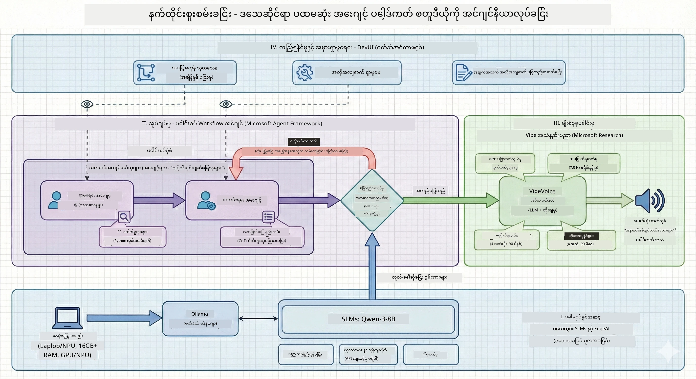

<!--
CO_OP_TRANSLATOR_METADATA:
{
  "original_hash": "f94e745264597bc5d8df967ead2eff97",
  "translation_date": "2026-01-05T10:56:27+00:00",
  "source_file": "WorkshopForAgentic/README.md",
  "language_code": "my"
}
-->
# 🎙️ The AI Podcast Studio Workshop

> 🌏 [中文版 (Chinese Version)](translation/zh-cn/README.md)


## Your Mission

**The AI Podcast Studio** သို့ ကြိုဆိုပါသည်။ သင်မှာ "Future Bytes" ဟုခေါ်သော သင့်ကိုယ်ပိုင်နည်းပညာပေါ်ဒ်ကတ်ကို စတင်ဖန်တီးတော့မယ် - သို့ရာတွင် အထူးချက်မှာ AI ပါဝင်သော ထုတ်လုပ်မှုအဖွဲ့တစ်ဖွဲ့ကို တည်ဆောက်ကာ အကူအညီပြုမည်ဖြစ်သည်။ ရှာဖွေမှုစာရွက်ရေးခြင်းနှင့် အသံတည်းဖြတ်ခြင်း စသည့် ကြာမြင့်သော အလုပ်များကို မလုပ်တော့ရပါဘူး။ မိမိကိုယ်ပိုင် AI ပါဝင်သော ပေါ်ဒ်ကတ်ထုတ်လုပ်သူဖြစ်လာရန် ကုဒ်ရေးသားမယ်။

## The Story

စိတ်ကူးပါ။ သင်နှင့် မိတ်ဆွေများသည် နောက်ဆုံးပေါ်နည်းပညာ ထိပ်တန်းကဏ္ဍများအကြောင်း ပေါ်ဒ်ကတ်တစ်ခုစတင်လိုသည်၊ သို့မဟုတ် တက်ကြွတဲ့ အလုပ်သမားတွေနဲ့ ကျောင်းသားတွေနဲ့ မပြေလည်တော့ပါ။ သင် AI ပြုလုပ်သော အဖွဲ့တစ်ဖွဲ့ကို တည်ဆောက်၍ အလုပ်ခဲများကို ဆောင်ရွက်စေချင်သည် ဆိုပါစို့။ တစ်ဦးထုတ်လေ့လာ၊ တစ်ဦး စာရွက်ရေး၊ တစ်ဦး စကားပြောသဘာဝဖြင့် စာကိုအသံပြောင်းပေးသည်။ ဒီဟာက စာနယ်ဇင်းစိတ်ကူးလား? တကယ်ဖြစ်အောင်လုပ်ကြပါစို့။

## What You'll Learn

ဒီအလုပ်ရုံသင်တန်းပြီးဆုံးစဉ်တွင် သင်သည်
- 🤖 သင့်ကိုယ်ပိုင် ဒေသတွင်း AI မော်ဒယ်တစ်ခုကို ထုတ်သုံးနည်း (API ကုန်ကျစရိတ်မရှိ၊ မိုက်ကလောက်မလိုအပ်)
- 🔧 လုပ်ဆောင်နိုင်သည့် ကြောင့်ဖက် AI အေးဂျင့်များ တည်ဆောက်နည်း
- 🎬 စိတ်ကူးမှ အသံထုတ်ထိထိရောက်ရောက် ထုတ်လုပ်ခြင်း လုပ်ငန်းစဉ် တစ်လျှောက် ဖန်တီးနည်း

## Your Journey: Three Acts



 ကောင်းမွန်သောဇာတ်လမ်းလိုပဲ သုံးပတ်လမ်းရှိတယ်။ ပတ်လမ်းတိုင်းက သင့် AI ပေါ်ဒ်ကတ်စတူဒီယိုကို ဖြည်းဖြည်းချင်း တည်ဆောက်ပေးပါမယ်-

| Episode | Your Quest | What Happens | Skills Unlocked |
|---------|-----------|--------------|----------------|
| **Act 1** | [သင့် AI အကူအညီဖော်များကို တွေ့ဆုံခြင်း](md/01.BuildAIAgentWithSLM.md) | စကားပြောနိုင်၊ ဝက်ဘ်ရှာဖွေနိုင်၊ ပြဿနာဖြေရှင်းနိုင်တဲ့ AI အေးဂျင့်များ ဖန်တီးနည်းကို ရှာဖွေတွေ့ရှိမည်။ အိပ်မက်တောင်မရသော သုတေသန ဝန်ထမ်းများလို့ သတ်မှတ်ပါ။ | 🎯 ပထမဆုံးအေးဂျင့် တည်ဆောက်ခြင်း<br>🛠️ အတုအယောင်များ ပေးခြင်း (ကိရိယာများ!)<br>🧠 စဉ်းစားသင်ကြားပေးခြင်း<br>🌐 အင်တာနက်နှင့် ချိတ်ဆက်ခြင်း |
| **Act 2** | [ထုတ်လုပ်မှုအဖွဲ့ကို စုစည်းခြင်း](md/02.AIAgentOrchestrationAndWorkflows.md) | ယခုမောလဲစရာကောင်းသည်။ ပေါင်းစပ်အေးဂျင့် အလုပ်ကို ညှိနှိုင်း၍ အမှန်တကယ် ပေါ်ဒ်ကတ်အဖွဲ့လို အမျိုးအစားလုပ်ပါမည်။ တစ်ဦး သုတေသန၊ တစ်ဦး စာရေး၊ သင် ခွင့်ပြုသည်—အဖွဲ့ဝင်လက်တွဲမှုသည် အောင်မြင်မှုဖြစ်သည်။ | 🎭 အေးဂျင့်များစွာ ညှိနှိုင်းခြင်း<br>🔄 ခွင့်ပြုလုပ်ငန်းစဉ်တည်ဆောက်ခြင်း<br>🖥️ DevUI အင်တာဖေ့စ်ဖြင့် စမ်းသပ်ခြင်း<br>✋ လူသားကို ထိန်းချုပ်မှုထိန်းသိမ်းခြင်း |
| **Act 3** | [သင့်ပေါ်ဒ်ကတ်ကို အသက်သွင်းခြင်း](md/03.Multi-SpeakerPodcastGenerationWithVibeVoice.md) | နောက်ဆုံးပိုင်း! စာရွက်ချုပ်များကို သဘာဝစကားသံဖြင့် အမှန်တကယ်ပေါ်ဒ်ကတ်အသံပြောင်းပါ။ သင့် "Future Bytes" ပေါ်ဒ်ကတ် ပြင်ဆင်ပြီး လွှင့်ထုတ်ရန် အသင့်ဖြစ်ပါပြီ။ | 🎤 စာ-to-အသံ စွမ်းရည်<br>👥 မတူညီသော ဟောပြောသူ အသံများ<br>⏱️ တောင့်တယ်သော အသံ<br>🚀 အလိုအလျောက် လုပ်ငန်းစဉ်များ |

ပတ်လမ်းတိုင်းနှင့်အမျှ အဆင့်အသစ်များ လေ့လာရပါမည်။ ရဲရဲတင်းတင်းအောင် ကြိုတင် လမ်းလျှောက်နိုင်သော်လည်း ဇာတ်အိမ်အတိုင်း လိုက်နာ၍ သင်ယူရန် အကြံပေးပါသည်။

## Environment Requirements

ဒီအလုပ်ရုံ သည့် ဟာ့ဒ်ဝဲပတ်ဝန်းကျင်များကို ထောက်ပံ့သည်။
- **CPU**: စမ်းသပ်မှုနှင့် သေးငယ်သောအသုံးပြုမှုအတွက် သင့်တော်သည်
- **GPU**: ထုတ်လုပ်မှုပတ်ဝန်းကျင်အတွက် အကြံပြုသည်၊ အမြန်ဆန်မှု တိုးတက်စေသည်
- **NPU**: နောက်ဆုံးပေါ် နေရာချပြုပြင်မှု တိုက်ရိုက်မှုကို ထောက်ပံ့သည်

## What You'll Need

### Software Checklist ✅
- **Python 3.10+** ( သင်၏ ကုဒ်ရေးခြင်း ဘာသာစကား)
- **Ollama** ( သင့်စက်ပေါ်တွင် AI မော်ဒယ်များမှာလည်ပတ်စေသည်)
- **VS Code** ( သင့်ကုဒ်တည်းဖြတ်သူ)
- **Python Extension** (VS Code ကို ပိုမိုအထောက်အပံ့ဖြစ်စေသည်)
- **Git** (ကုဒ်များ ထုတ်ယူရန်)

### Hardware Check 💻
- **ဤစက်တွင် ဆောင်ရွက်နိုင်သလား?**: 8GB RAM, 10GB လွတ်မြောက်နေရာ (အလုပ်လုပ်သည်၊ သေးငယ်သော်လည်း မေ့လျော့တတ်)
- **အကောင်းဆုံး စီမံချက်**: 16GB+ RAM၊ ကောင်းမွန်သော GPU (ထိရောက်ပြီး ပျော်ရွှင်မှုရရှိ)
- **NPU ရှိသလား?**: ပိုပြီးကောင်း! နောက်ဆုံးပေါ်စွမ်းဆောင်ရည် လွှင့်မည် 🚀

## Setup Your Studio 🎬

### Step 1: Python Power-Up

Python 3.10 သို့ အထက်ရှိကြောင်း သေချာစွာ စစ်ဆေးပါ။

```bash
python --version
# Python 3.10.x သို့မဟုတ် ထက်မြင့်သော ဗားရှင်းကို ပြသသင့်သည်
```

Python မရှိပါက [python.org](https://python.org) မှ ဒေါင်းလုပ်လုပ်နိုင်သည် — အခမဲ့!

### Step 2: Get Ollama (Your AI Model Runner)

သင်၏ OS အတွက် Ollama ကို [ollama.ai](https://ollama.ai) မှ ဒေါင်းလုပ်ယူပါ။ AI မော်ဒယ်များကို ဒေသတြင်းတွင် လည်ပတ်စေသော အင်ဂျင်တစ်ခုလို ဖြစ်သည်။

 အသင့်ရှိနေသည်ဟု စစ်ဆေးပါ-

```bash
ollama --version
```

### Step 3: Download Your AI Brain 🧠

Qwen-3-8B မော်ဒယ်(မိမိ၏ ပထမဆုံး AI အကူအညီဖြစ်သော) ကို ဒေါင်းလုပ်လုပ်ရန် အချိန်ရပါပြီ-

```bash
ollama pull qwen3:8b
```

*ဤလုပ်ငန်းသည် မိနစ်အနည်းငယ်ချိန်ယူနိုင်ပါသည်။ ကော်ဖီခုန်ချိန်အတွက် အချိန်ကောင်း! ☕*

### Step 4: Set Up VS Code

[Visual Studio Code](https://code.visualstudio.com/) ကို မရှိသေးပါက ဒေါင်းလုပ်လုပ်ပါ။ ကောဒီတည်းဖြတ်သူအကောင်းဆုံးဖြစ်သည် (ပြိုင်ခွင့် 😄)။

### Step 5: Python Extension

VS Code တွင် -
1. `Ctrl+Shift+X` (Mac တွင် `Cmd+Shift+X`) ကို နှိပ်ပါ
2. "Python" ကို ရှာပါ
3. Microsoft ၏ Python extension ကို တပ်ဆင်ပါ

### Step 6: You're All Set! 🎉

ပြင်းပြည့်စွာ ပြင်ဆင်ပြီးပါပြီ။ AI ဇာတ်မြူးစေကြပါစို့!

### Step 7: Install Microsoft Agent Framework and Related Packages 📦

အလုပ်ရုံသင်တန်းအတွက် လိုအပ်သော အားလုံးသော ပတျည်းကေါင်းများကို ထည့်သွင်းရန်-

```bash
pip install -r ./Installations/requirements.txt -U
```

*ဤကိရိယာသည် Microsoft Agent Framework နှင့် လိုအပ်သော များစွာသော ကိုယ်စားလှယ်များကို တပ်ဆင်မည်။ ရင်သပ်ရှုမောဖွယ်ကော့ဖီရယူပါ၊ ပထမဆုံးတင်သွင်းမှုအချိန် အနည်းငယ်ယူပါသည်! ☕*

## Workshop Instructions

အလုပ်ရုံ၏ တိကျသော ပရောဂျက်ဖွဲ့စည်းမှု၊ ဖွဲ့စည်းကိရိယာများနှင့် အကောင်အထည်ဖော်နည်းများကို အဆင့်ဆင့်ရှင်းပြပါမည်။

## Troubleshooting (When Things Go Wrong) 🔧

### "ဟိုဟို၊ မော်ဒယ်ဒေါင်းလုပ်ကြာနေလာပြီ!"
**ပြင်ဆင်နည်း**: VPN သုံးပါ သို့မဟုတ် Ollama ကို မီးရောင်တုံ့ ပြင်ထုတ် အရင်းမြစ်ဖြင့် ပြင်ဆင်ပါ။ အင်တာနက်က ကျွန်ုပ်တို့ကိုမကြိုက်တဲ့အခါ ရှိတတ်သည်။

### "ကွန်ပျူတာ အမှတ်အတင်ပြတ်သွားပြီ!"
**ပြင်ဆင်နည်း**: သေးငယ်သောမော်ဒယ်သို့ ပြောင်းရွှေ့ပါ၊ `num_ctx` စီတန်းကို ပြင်ပါ။ AI အစားအသောက် ကန့်သတ်ခြင်းလိုဖြစ်သည်။

### "GPU ဖြင့်ပိုမြန်စေလိုရင်ဖြစ်မလား?"
**ပြင်ဆင်နည်း**: Ollama မှ GPU များကို အလိုအလျောက်ဖော်ထုတ်ပေးသည်! GPU အတွက် မောင်းနှင်သူများ ကိုဆုံးဖြတ်ထားလျှင် အမြန်နှုန်းတိုးနိုင်သည်။ 🏎️

## Extra Resources (For the Curious) 📚

- [Ollama Docs](https://github.com/ollama/ollama) — ဒေသတွင်း AI မော်ဒယ်နက်ရှိုင်းစွာလေ့လာခြင်း
- [Microsoft Agent Framework](https://microsoft.github.io/autogen/) — အေးဂျင့်အဖွဲ့ဖန်တီးနည်း
- [Qwen Model Info](https://qwenlm.github.io/) — သင်၏ AI အကူအညီ၏ ဦးနှောက်ကို တွေ့ဆုံခြင်း

## License

MIT License — စိတ်ကူးယဉ်အရာများတည်ဆောက်၊ ဝေမျှ၊ ကမ္ဘာကြီးကို ပိုကောင်းစေပါ။

## Want to Contribute?

ဘတ်ဂ်တွေတွေ့ပါသလား? စိတ်ကူးရှိပါသလား? Issue သို့ PR တင်ပါ! လူထုပူးပေါင်းဆောင်ရွက်မှုကို ကျွန်ုပ်တို့နှစ်သက်သည်။ ✨

---

<!-- CO-OP TRANSLATOR DISCLAIMER START -->
**ကျေးဇူးပြု၍ သတိပြုပါ**  
ဤစာတမ်းကို AI ဘာသာပြန်ဝန်ဆောင်မှု [Co-op Translator](https://github.com/Azure/co-op-translator) ဖြင့် ဘာသာပြန်ထားပါသည်။ ကျွန်ုပ်တို့သည် တိကျမှုအတွက် ကြိုးပမ်းသည်ဖြစ်သော်လည်း၊ အလိုအလျောက် ဘာသာပြန်ခြင်းတွင် အမှားများ သို့မဟုတ် အကွာအဝေးရှိနိုင်ပါသဖြင့် သတိပြုကြပါရန် လိုအပ်ပါသည်။ မူလစာတမ်းကို မူရင်းဘာသာဖြင့်သာ တရားဝင် အချက်အလက်အရင်းမြစ်အဖြစ် မှတ်ယူရမည်ဖြစ်သည်။ အရေးကြီးသော သတင်းအချက်အလက်များအတွက် များစွာသတိထား၍ လူ့ဘာသာပြန်ပညာရှင်တစ်ဦးမှ ဘာသာပြန်ခြင်းကို သင်ယူစေဖို့ အကြံပြုပါသည်။ ဤဘာသာပြန်ချက်ကို အသုံးပြုခြင်းမှ ဖြစ်ပေါ်လာနိုင်သည့် မည်သည့် နားလည်မှုမှားခြင်း သို့မဟုတ် အဓိပ္ပါယ်ပျက်မှုများအတွက် ကော်ပိုရေးရှင်းသည် တာဝန်မကျေမနပ်ပါ။
<!-- CO-OP TRANSLATOR DISCLAIMER END -->